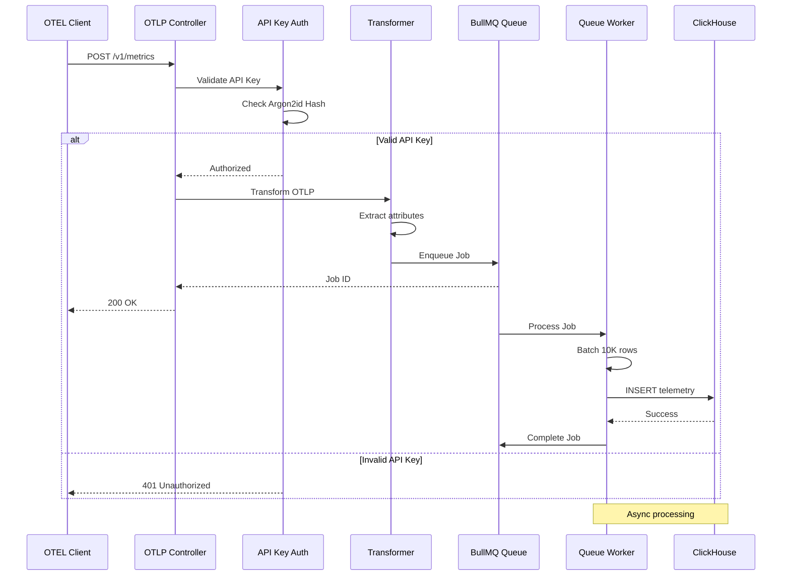
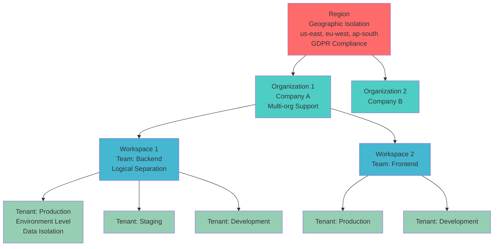
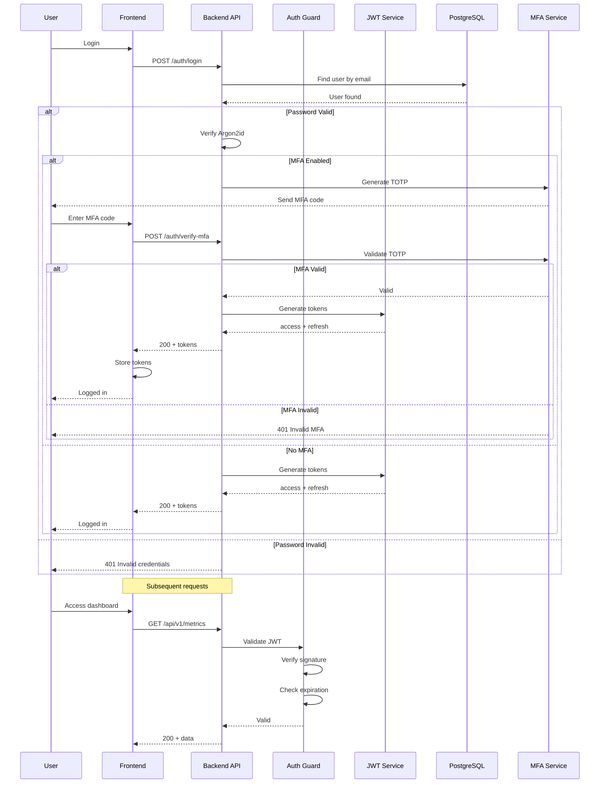
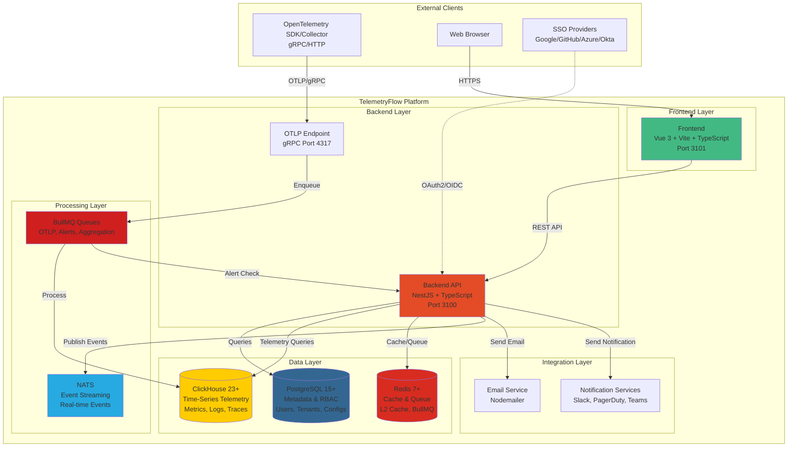
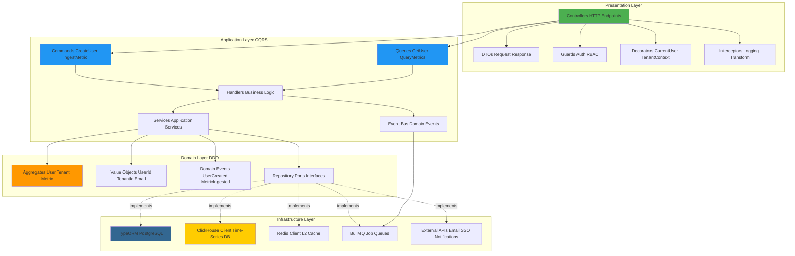
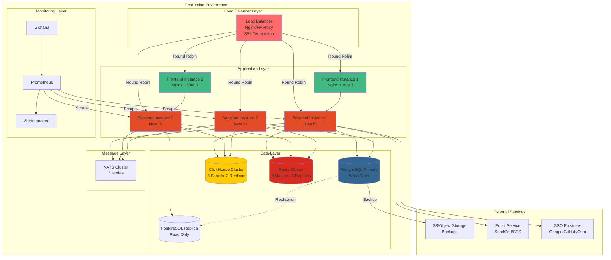
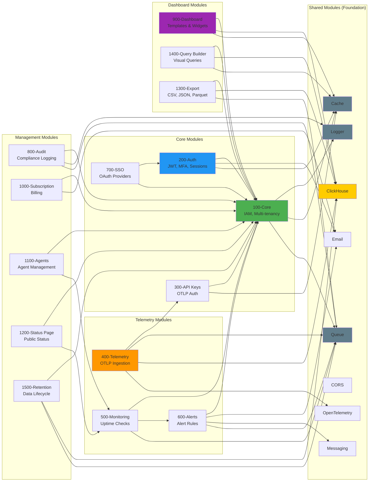

# TelemetryFlow Platform - Overview Documentation

<div align="center">
  <picture>
    <source media="(prefers-color-scheme: dark)" srcset="https://github.com/telemetryflow/.github/blob/main/docs/assets/tfo-logo-dark.svg">
    <source media="(prefers-color-scheme: light)" srcset="https://github.com/telemetryflow/.github/blob/main/docs/assets/tfo-logo-light.svg">
    
  </picture>

  <h3>Enterprise-Grade Observability Platform for Modern Cloud Infrastructure</h3>

  <p>
    <strong>100% OpenTelemetry Compliant</strong> • Built with <strong>DDD/CQRS</strong> • Production-Ready
  </p>

  [](../CHANGELOG.md)
  [](../LICENSE)
  [](https://nestjs.com/)
  [](https://vuejs.org/)
  [](https://www.typescriptlang.org/)
  [](https://clickhouse.com/)
  [](https://opentelemetry.io/)
  [](docs-ddd-backend/)
  [](../backend/src/modules/iam/)

</div>

- **Version:** 3.10.0
- **Status:** Production Ready
- **License:** Apache 2.0
- **Built by:** DevOpsCorner Indonesia
- **Last Updated:** December 12, 2025

---

## Table of Contents

1. [What is TelemetryFlow?](#what-is-telemetryflow)
2. [Documentation Structure](#documentation-structure)
3. [Quick Start](#quick-start)
4. [Key Features](#key-features)
5. [Architecture Overview](#architecture-overview)
6. [Technology Stack](#technology-stack)
7. [Module Overview](#module-overview)
8. [Contributing](#contributing)

---

## What is TelemetryFlow?

**TelemetryFlow** is an **enterprise-grade observability platform** that provides complete telemetry collection, storage, and visualization capabilities. It is a **100% OpenTelemetry Protocol (OTLP) compliant** platform designed to be an open-source alternative to commercial observability solutions like Datadog, New Relic, or Dynatrace.

### Problem It Solves

| Problem | TelemetryFlow Solution |
|---------|----------------------|
| **Fragmented Observability** | Organizations use separate tools for metrics (Prometheus), logs (ELK), and traces (Jaeger). TelemetryFlow unifies all three signals in one platform. |
| **Vendor Lock-in** | By being OTLP-compliant, it works with any OpenTelemetry SDK or Collector, providing vendor-neutral observability. |
| **Multi-Tenancy Complexity** | Provides hierarchical tenant isolation (Region → Organization → Workspace → Tenant) with automatic data segregation. |
| **High Cost** | Open-source platform that can be self-hosted, eliminating per-GB pricing of commercial solutions. |
| **Compliance Requirements** | Built-in audit logging, GDPR compliance, regional data segregation, and soft deletion for compliance. |

### Core Capabilities

- **📊 Unified Telemetry Collection** - Metrics, Logs, and Traces in one platform
- **🔌 100% OTLP Compliant** - Works with any OpenTelemetry SDK
- **🏢 Enterprise Multi-Tenancy** - Hierarchical isolation with Region → Org → Workspace → Tenant
- **🚨 Advanced Alerting** - 33 production-ready alert rules with fatigue prevention
- **📈 Real-time Dashboards** - 6 pre-configured templates with 12+ widget types
- **🔐 Enterprise Security** - JWT, MFA, SSO (Google/GitHub/Azure/Okta), RBAC, API keys
- **⚡ High Performance** - Multi-level caching, queue-based processing, ClickHouse optimization
- **📋 Compliance Ready** - Audit logging, GDPR, SOC2, HIPAA support

---

## Documentation Structure

This documentation is organized into the following sections:

```
.
├── README.md                          # This file - Platform overview
├── architecture/
│   ├── 01-SYSTEM-ARCHITECTURE.md      # High-level system architecture
│   ├── 02-DATA-FLOW.md                # How data flows through the system
│   ├── 03-MULTI-TENANCY.md            # Multi-tenancy architecture
│   ├── 04-SECURITY.md                 # Security architecture
│   └── 05-PERFORMANCE.md              # Performance optimizations
├── backend/
│   ├── 00-BACKEND-OVERVIEW.md         # Backend architecture overview
│   ├── 01-TECH-STACK.md               # Technology stack details
│   ├── 02-DDD-CQRS.md                 # Domain-Driven Design & CQRS patterns
│   ├── 03-MODULE-STRUCTURE.md         # Standard module structure
│   ├── modules/
│   │   ├── 100-core.md                # Core IAM module
│   │   ├── 200-auth.md                # Authentication module
│   │   ├── 300-api-keys.md            # API keys module
│   │   ├── 400-telemetry.md           # Telemetry ingestion module
│   │   ├── 500-monitoring.md          # Uptime monitoring module
│   │   ├── 600-alerts.md              # Alerting module
│   │   ├── 700-sso.md                 # Single Sign-On module
│   │   ├── 800-audit.md               # Audit logging module
│   │   ├── 900-dashboard.md           # Dashboard module
│   │   ├── 1000-subscription.md       # Subscription module
│   │   ├── 1100-agents.md             # Agent management module
│   │   ├── 1200-status-page.md        # Status page module
│   │   ├── 1300-export.md             # Data export module
│   │   ├── 1400-query-builder.md      # Query builder module
│   │   └── 1500-retention-policy.md   # Retention policy module
│   └── shared/
│       ├── logger.md                  # Logger module
│       ├── cache.md                   # Cache module
│       ├── queue.md                   # Queue module
│       ├── messaging.md               # Messaging module
│       ├── email.md                   # Email module
│       └── cors.md                    # CORS module
├── frontend/
│   ├── 00-FRONTEND-OVERVIEW.md        # Frontend architecture overview
│   ├── 01-TECH-STACK.md               # Vue 3, Vite, TypeScript
│   ├── 02-MODULE-STRUCTURE.md         # Frontend module organization
│   ├── 03-STATE-MANAGEMENT.md         # Pinia stores and composition
│   ├── 04-ROUTING.md                  # Vue Router configuration
│   └── 05-VISUALIZATION.md            # ECharts integration
├── shared/
│   ├── API-REFERENCE.md               # REST API documentation
│   ├── OTLP-INGESTION.md              # OTLP ingestion guide
│   ├── DATABASE-SCHEMA.md             # PostgreSQL + ClickHouse schemas
│   └── NAMING-CONVENTIONS.md          # Coding standards
└── deployment/
    ├── DOCKER-COMPOSE.md              # Docker deployment
    ├── KUBERNETES.md                  # Kubernetes deployment
    ├── CONFIGURATION.md               # Environment configuration
    └── PRODUCTION-CHECKLIST.md        # Production deployment guide
```

---

## Quick Start

### Prerequisites

- **Node.js** 18+ (20.x recommended)
- **PostgreSQL** 15+
- **ClickHouse** 23+
- **Redis** 7+
- **Docker** & **Docker Compose** (for local development)

### Local Development Setup

```bash
# 1. Clone the repository
git clone https://github.com/telemetryflow/telemetryflow-platform.git
cd telemetryflow-platform

# 2. Start infrastructure services (PostgreSQL, ClickHouse, Redis)
cd backend
pnpm docker:up

# 3. Install backend dependencies
pnpm install

# 4. Run database migrations
pnpm migration:run

# 5. Start backend development server
pnpm dev

# 6. In a new terminal, start frontend
cd ../frontend
pnpm install
pnpm dev
```

### Access the Platform

- **Frontend:** http://localhost:5173
- **Backend API:** http://localhost:3100/api/v2
- **API Documentation:** http://localhost:3100/api/docs
- **Health Check:** http://localhost:3100/health

### Default Credentials

```bash
# Super Administrator
Email: super.administrator@telemetryflow.id
Password: SuperAdmin@123456

# Administrator
Email: admin.telemetryflow@telemetryflow.id
Password: Admin@123456

# Developer
Email: developer.telemetryflow@telemetryflow.id
Password: Developer@123456

# Viewer
Email: viewer.telemetryflow@telemetryflow.id
Password: Viewer@123456

# Demo
Email: demo.telemetryflow@telemetryflow.id
Password: Demo@123456
```

> References:
> [06-RBAC-SYSTEM-PLATFORM.md](./architecture/06-RBAC-SYSTEM-PLATFORM.md)

---

## Key Features

### 1. Unified Telemetry Collection (OTLP Compliant)

**Metrics**
- Time-series storage in ClickHouse
- Support for: Gauges, Counters, Histograms, Summaries
- Exemplars for metric-trace correlation
- Pre-aggregation tables for 50-90% query speedup
- Custom aggregation functions (sum, avg, min, max, percentiles)

**Logs**
- Structured logging with full-text search
- Severity levels: DEBUG, INFO, WARN, ERROR, FATAL
- Trace context propagation (traceId, spanId)
- Real-time log streaming via WebSocket
- High-cardinality attribute indexing

**Traces**
- Distributed tracing with span visualization
- Service dependency mapping
- Critical path analysis
- Trace-log correlation
- Span attribute search

**OTLP Endpoints**
```
POST /api/v2/otlp/metrics   # Ingest OTLP metrics
POST /api/v2/otlp/logs      # Ingest OTLP logs
POST /api/v2/otlp/traces    # Ingest OTLP traces
```

**OTLP Ingestion Flow:**



### 2. Multi-Tenancy Architecture

**Hierarchical Isolation:**



**Features:**
- Automatic tenant context injection
- All queries filtered by workspace_id and tenant_id
- ClickHouse partitioning by tenant
- Cross-tenant data isolation guaranteed
- Resource quotas per workspace
- Regional data segregation for compliance

### 3. Authentication & Security

**5-Tier RBAC System:**
- **Super Administrator** - Global platform management
- **Administrator** - Organization-level management
- **Developer** - Write access to telemetry
- **Viewer** - Read-only dashboard access
- **Demo** - Limited demo access

**API Key Authentication (OTLP):**
- AWS-style dual-key system (tfk-*/tfs-*)
- Argon2id hashing (OWASP-recommended)
- Permission-based access: `metrics:write`, `logs:write`, `traces:write`
- Automatic key rotation with zero-downtime
- Rate limiting: 1000 req/min per key

**Authentication Methods:**
- JWT with refresh tokens
- Multi-Factor Authentication (TOTP)
- SSO providers: Google, GitHub, Azure AD, Okta
- SAML 2.0 and OIDC support

**Authentication Flow:**



### 4. Advanced Alerting

**33 Default Production-Ready Rules:**
- Kubernetes (pod crashes, OOMKilled, restarts)
- VMs (CPU, memory, disk, network)
- Redis (memory usage, evictions, slowlog)
- Load Balancers (5xx errors, target health)
- Databases (connection pool, slow queries)

**Fatigue Prevention:**
- Cooldown periods (5-60 minutes)
- Rate limiting (max 10 alerts/hour per rule)
- Deduplication (fingerprint-based)
- Auto-resolution after conditions clear

**Notification Channels (8):**
- Email, Slack, PagerDuty, Webhook, Microsoft Teams, Discord, Telegram, SMS (Twilio)

### 5. Dashboards & Visualization

**6 Pre-configured Templates:**
1. **System Monitoring** - CPU, memory, disk, network
2. **Application Performance Monitoring (APM)** - Response times, throughput, errors, traces
3. **Logs Explorer** - Advanced log filtering and analysis
4. **Infrastructure Monitoring** - Containers, Kubernetes, cloud resources
5. **Network Monitoring** - Bandwidth, latency, packet loss
6. **Custom Metrics Dashboard** - Flexible custom metrics

**12+ Widget Types:**
- line_chart, bar_chart, area_chart, pie_chart, donut_chart
- table, gauge, stat, heatmap, graph (network diagram)
- text panel, logs viewer

**Features:**
- Drag-and-drop dashboard builder
- Real-time updates via WebSocket
- Template variables for dynamic parameterization
- Clone from templates
- Export/import dashboards

### 6. Performance Optimizations

**Multi-Level Cache:**
- L1: In-memory cache (60s TTL)
- L2: Redis cache (30min TTL)
- 60-80% cache hit rate

**Message Queues:**
- 5 BullMQ queues: OTLP, Alerts, Aggregation, Cleanup, Notifications
- Async processing with retries
- Job prioritization

**Database Optimizations:**
- 20 ClickHouse indexes (bloom filter, minmax, set)
- 10-50x faster searches
- Partitioning by tenant and timestamp
- Data compression (50-90% space savings)

---

## Architecture Overview

### High-Level Architecture



### Backend Architecture (DDD + CQRS)



### Deployment Architecture



For detailed architecture documentation, see:
- [System Architecture](./architecture/01-SYSTEM-ARCHITECTURE.md)
- [Data Flow](./architecture/02-DATA-FLOW.md)
- [Multi-Tenancy](./architecture/03-MULTI-TENANCY.md)
- [Security](./architecture/04-SECURITY.md)
- [Performance](./architecture/05-PERFORMANCE.md)

---

## Technology Stack

### Backend

| Category | Technology | Version | Purpose |
|----------|-----------|---------|---------|
| **Framework** | NestJS | 10.x | Enterprise Node.js framework |
| **Language** | TypeScript | 5.7+ | Type-safe development |
| **Runtime** | Node.js | 18-20.x | JavaScript runtime |
| **Metadata DB** | PostgreSQL | 15+ | Relational data storage |
| **Telemetry DB** | ClickHouse | 23+ | Time-series data storage |
| **Cache & Queue** | Redis | 7+ | Caching and job queues |
| **ORM** | TypeORM | 0.3.x | PostgreSQL migrations |
| **Queue** | BullMQ | 5.x | Async job processing |
| **Messaging** | NATS | 2.x | Event streaming (optional) |
| **Telemetry** | OpenTelemetry | 0.208+ | Self-instrumentation |
| **Auth** | Passport JWT | Latest | Authentication |
| **Validation** | class-validator | Latest | DTO validation |
| **Hashing** | Argon2 | Latest | Password hashing |

### Frontend

| Category | Technology | Version | Purpose |
|----------|-----------|---------|---------|
| **Framework** | Vue | 3.5.24 | Progressive JavaScript framework |
| **Build Tool** | Vite | 7.2.4 | Lightning-fast HMR |
| **Language** | TypeScript | 5.8.3 | Type-safe development |
| **UI Library** | Naive UI | 2.43.2 | Vue 3 component library |
| **CSS Engine** | UnoCSS | 66.5.9 | Atomic CSS |
| **State** | Pinia | 3.0.4 | Vue 3 state management |
| **Router** | Vue Router | 4.6.3 | Official Vue router |
| **Charts** | ECharts | 6.0.0 | 80+ chart types |
| **HTTP Client** | Axios | 1.13.2 | REST API calls |
| **WebSocket** | Socket.IO | 4.8.1 | Real-time updates |

---

## Module Overview

### Module Dependencies



### Backend Modules (15)

| Module | Name | Purpose | Status |
|--------|------|---------|--------|
| **100** | Core | IAM, Multi-tenancy, RBAC | ✅ Production |
| **200** | Auth | Authentication, JWT, MFA | ✅ Production |
| **300** | API Keys | OTLP API key authentication | ✅ Production |
| **400** | Telemetry | OTLP ingestion (metrics/logs/traces) | ✅ Production |
| **500** | Monitoring | Uptime monitors, agent management | ✅ Production |
| **600** | Alerts | Alert rules, notifications, history | ✅ Production |
| **700** | SSO | Google, GitHub, Azure, Okta | ✅ Production |
| **800** | Audit | Audit logging, compliance | ✅ Production |
| **900** | Dashboard | Dashboard templates, widgets | ✅ Production |
| **1000** | Subscription | Billing, subscription management | ✅ Production |
| **1100** | Agents | Agent deployment, heartbeat | ✅ Production |
| **1200** | Status Page | Public/private status pages | ✅ Production |
| **1300** | Export | Data export (CSV, JSON, Parquet) | ✅ Production |
| **1400** | Query Builder | Visual query builder | ✅ Production |
| **1500** | Retention Policy | Data retention management | ✅ Production |

### Shared Modules (10)

| Module | Purpose | Key Features |
|--------|---------|--------------|
| **logger** | Logging service | Winston, multiple transports, trace propagation |
| **cache** | Multi-level cache | L1 (memory) + L2 (Redis), 60-80% hit rate |
| **queue** | Job queue | BullMQ, 5 queues, async processing |
| **messaging** | Event streaming | NATS pub/sub, optional |
| **email** | Email service | Nodemailer, Handlebars templates |
| **cors** | CORS configuration | Database-driven validation |
| **clickhouse** | ClickHouse service | Shared ClickHouse client |
| **otel** | OpenTelemetry | Self-instrumentation |
| **ui** | Web UI | EJS templates, static assets |
| **platform** | Platform utilities | Common helpers |

---

## Contributing

### Development Workflow

1. **Fork the repository**
2. **Create a feature branch** - `git checkout -b feature/my-feature`
3. **Follow naming conventions** - See [NAMING-CONVENTIONS.md](./shared/NAMING-CONVENTIONS.md)
4. **Write tests** - Maintain 88%+ coverage
5. **Run linting** - `pnpm lint`
6. **Build successfully** - `pnpm build` (must show 0 errors)
7. **Submit pull request**

### Coding Standards

- **Backend:** NestJS best practices, DDD patterns, CQRS
- **Frontend:** Vue 3 Composition API, TypeScript strict mode
- **Testing:** Unit tests (88%+), integration tests, e2e tests
- **Documentation:** JSDoc for all public APIs
- **Commit Messages:** Conventional Commits format

### Module Development Guide

When creating a new module, follow the standard structure:

```
{module-number}-{module-name}/
├── {module-number}-{module-name}.module.ts
├── README.md
├── application/
│   ├── commands/
│   ├── queries/
│   ├── handlers/
│   ├── dto/
│   └── services/
├── domain/
│   ├── aggregates/
│   ├── entities/
│   ├── events/
│   ├── repositories/
│   ├── services/
│   └── value-objects/
├── infrastructure/
│   ├── persistence/
│   │   ├── postgres/
│   │   └── clickhouse/
│   ├── messaging/
│   └── services/
├── presentation/
│   ├── controllers/
│   ├── dto/
│   ├── guards/
│   └── decorators/
└── tests/
    ├── unit/
    ├── integration/
    └── e2e/
```

---

## Support & Resources

### Documentation

- **Architecture:** [./architecture/](./architecture/)
- **Backend:** [./backend/](./backend/)
- **Frontend:** [./frontend/](./frontend/)
- **API Reference:** [./shared/API-REFERENCE.md](./shared/API-REFERENCE.md)
- **Deployment:** [./deployment/](./deployment/)

### Community

- **GitHub:** https://github.com/telemetryflow/telemetryflow-platform
- **Issues:** https://github.com/telemetryflow/telemetryflow-platform/issues
- **Discussions:** https://github.com/telemetryflow/telemetryflow-platform/discussions

### Statistics

| Metric | Count |
|--------|-------|
| Backend Modules | 15 |
| Frontend Modules | 5+ |
| CQRS Handlers | 40+ |
| API Endpoints | 120+ |
| Database Tables | 50+ |
| Lines of Code | 110,000+ |
| Test Cases | 280+ |
| Test Coverage | 88-92% |
| Documentation Pages | 203+ |
| Version | 3.10.0 |

---

## License

Apache License 2.0 - See [LICENSE](./LICENSE) for details.

---

## Acknowledgments

Built with ❤️ by **DevOpsCorner Indonesia**

- **Status:** ✅ Production Ready (Zero Build Errors)
- **Last Updated:** December 12, 2025
