<div align="center">
  <picture>
    <source media="(prefers-color-scheme: dark)" srcset="https://github.com/telemetryflow/.github/raw/main/docs/assets/tfo-logo-dark.svg">
    <source media="(prefers-color-scheme: light)" srcset="https://github.com/telemetryflow/.github/raw/main/docs/assets/tfo-logo-light.svg">
    
  </picture>

  <h1>TelemetryFlow Platform - Overview Documentation</h1>

  <h3>Enterprise-Grade Observability Platform for Modern Cloud Infrastructure</h3>

  <p>
    <strong>100% OpenTelemetry Compliant</strong> &bull;
    Built with <strong>DDD/CQRS</strong> &bull;
    Production-Ready &bull;
    Apache 2.0 Licensed
  </p>

[](#)
[](#)
[](https://nestjs.com/)
[](https://vuejs.org/)
[](https://golang.org/)
[](https://www.typescriptlang.org/)
[](https://clickhouse.com/)
[](https://opentelemetry.io/)
[](#)

</div>

- **Version:** 1.4.0
- **Status:** Production Ready
- **License:** Apache 2.0
- **Built by:** DevOpsCorner Indonesia
- **Last Updated:** May 14, 2026

---

## Table of Contents

1. [What is TelemetryFlow?](#what-is-telemetryflow)
2. [Documentation Structure](#documentation-structure)
3. [Quick Start](#quick-start)
4. [Key Features](#key-features)
5. [Architecture Overview](#architecture-overview)
6. [Technology Stack](#technology-stack)
7. [Module Overview](#module-overview)
8. [Contributing](#contributing)

---

## What is TelemetryFlow?

**TelemetryFlow** is an **enterprise-grade observability platform** that provides unified telemetry collection, storage, analysis, and visualization. It is **100% OpenTelemetry Protocol (OTLP) compliant**, designed as an open-source alternative to commercial solutions like Datadog, New Relic, and Dynatrace.

### Problem It Solves

| Problem                      | TelemetryFlow Solution                                                    |
| ---------------------------- | ------------------------------------------------------------------------- |
| **Fragmented Tooling**       | Unifies metrics, logs, traces, and exemplars into a single platform       |
| **Vendor Lock-in**           | 100% OTLP-compliant — works with any OpenTelemetry SDK or Collector       |
| **Multi-Tenancy Complexity** | Hierarchical isolation: Region → Organization → Workspace → Tenant        |
| **High Cost**                | Self-hosted, eliminating per-GB pricing of commercial solutions           |
| **Compliance Requirements**  | Built-in audit logging, GDPR compliance, regional data segregation        |
| **Monitoring Silos**         | Consolidates Prometheus, kube-state-metrics, node-exporter into one agent |

### Core Capabilities

- **Unified Telemetry Collection** — Metrics, Logs, Traces, and Exemplars in one platform
- **100% OTLP Compliant** — Works with any OpenTelemetry SDK
- **Enterprise Multi-Tenancy** — Hierarchical isolation with Region → Org → Workspace → Tenant
- **Advanced Alerting** — 33 production-ready alert rules with fatigue prevention
- **Real-time Dashboards** — 6 pre-configured templates with 12+ widget types
- **Enterprise Security** — JWT, MFA, SSO (Google/GitHub/Azure/Okta), 5-Tier RBAC, API keys
- **High Performance** — Multi-level caching, queue-based processing, ClickHouse optimization
- **Compliance Ready** — Audit logging, GDPR, SOC2, HIPAA support
- **Database Monitoring** — Native collectors for 9 databases with Query Analytics (QAN)
- **Infrastructure Agent** — TFO Agent replaces Prometheus, KSM, node-exporter, FluentBit
- **AI Intelligence** — MCP servers for Claude AI, TFQL natural language queries

---

## Documentation Structure

This documentation is organized into the following sections:

```
.
├── README.md                          # This file - Platform overview
├── architecture/
│   ├── 01-SYSTEM-ARCHITECTURE.md      # High-level system architecture
│   ├── 02-DATA-FLOW.md                # How data flows through the system
│   ├── 03-MULTI-TENANCY.md            # Multi-tenancy architecture
│   ├── 04-SECURITY.md                 # Security architecture
│   ├── 05-PERFORMANCE.md              # Performance optimizations
│   └── 06-RBAC-SYSTEM-PLATFORM.md     # 5-Tier RBAC system
├── backend/
│   ├── 00-BACKEND-OVERVIEW.md         # Backend architecture overview
│   ├── 01-TECH-STACK.md               # Technology stack details
│   ├── 02-DDD-CQRS.md                 # Domain-Driven Design & CQRS patterns
│   ├── 03-MODULE-STRUCTURE.md         # Standard module structure
│   ├── modules/
│   │   ├── 100-core.md                # Core IAM module
│   │   ├── 200-auth.md                # Authentication module
│   │   ├── 300-api-keys.md            # API keys module
│   │   ├── 400-telemetry.md           # Telemetry ingestion module
│   │   ├── 500-monitoring.md          # Uptime monitoring module
│   │   ├── 600-alerts.md              # Alerting module
│   │   ├── 700-sso.md                 # Single Sign-On module
│   │   ├── 800-audit.md               # Audit logging module
│   │   ├── 900-dashboard.md           # Dashboard module
│   │   ├── 1000-subscription.md       # Subscription module
│   │   ├── 1100-agents.md             # Agent management module
│   │   ├── 1200-status-page.md        # Status page module
│   │   ├── 1300-export.md             # Data export module
│   │   ├── 1400-query-builder.md      # Query builder module
│   │   └── 1500-retention-policy.md   # Retention policy module
│   └── shared/
│       ├── logger.md                  # Logger module
│       ├── cache.md                   # Cache module
│       ├── queue.md                   # Queue module
│       ├── messaging.md               # Messaging module
│       ├── email.md                   # Email module
│       └── cors.md                    # CORS module
├── frontend/
│   ├── 00-FRONTEND-OVERVIEW.md        # Frontend architecture overview
│   ├── 01-TECH-STACK.md               # Vue 3, Vite, TypeScript
│   ├── 02-MODULE-STRUCTURE.md         # Frontend module organization
│   ├── 03-STATE-MANAGEMENT.md         # Pinia stores and composition
│   ├── 04-ROUTING.md                  # Vue Router configuration
│   └── 05-VISUALIZATION.md            # ECharts integration
├── shared/
│   ├── API-REFERENCE.md               # REST API documentation
│   ├── DATABASE-SCHEMA.md             # PostgreSQL + ClickHouse schemas
│   ├── NAMING-CONVENTIONS.md          # Coding standards
│   └── OTLP-INGESTION.md              # OTLP ingestion guide
└── deployment/
    ├── DOCKER-COMPOSE.md              # Docker deployment
    ├── KUBERNETES.md                  # Kubernetes deployment
    ├── CONFIGURATION.md               # Environment configuration
    └── PRODUCTION-CHECKLIST.md        # Production deployment guide
```

---

## Quick Start

### Prerequisites

- **Node.js** 20+ & **pnpm** 9+
- **PostgreSQL** 16+
- **ClickHouse** 23+
- **Redis** 7+
- **Docker** & **Docker Compose** (for local development)
- **Go** 1.24+ (for Agent/Collector development)

### Local Development Setup

```bash
# 1. Clone the repository
git clone https://github.com/telemetryflow/telemetryflow-platform.git
cd telemetryflow-platform

# 2. Start infrastructure services (PostgreSQL, ClickHouse, Redis, NATS)
docker-compose --profile core up -d

# 3. Install dependencies
pnpm install

# 4. Run database migrations
pnpm db:migrate

# 5. Seed data
pnpm db:seed

# 6. Start development servers
pnpm dev
```

### Access the Platform

| Service                | URL                            |
| ---------------------- | ------------------------------ |
| **Frontend Dashboard** | http://localhost:8080          |
| **Backend API**        | http://localhost:3000/api/v2   |
| **API Documentation**  | http://localhost:3000/api/docs |
| **Health Check**       | http://localhost:3000/health   |
| **ClickHouse**         | http://localhost:8123          |

### Default Credentials (5-Tier RBAC)

| Role                    | Email                                    | Password          |
| ----------------------- | ---------------------------------------- | ----------------- |
| **Super Administrator** | super.administrator@telemetryflow.id     | SuperAdmin@123456 |
| **Administrator**       | admin.telemetryflow@telemetryflow.id     | Admin@123456      |
| **Developer**           | developer.telemetryflow@telemetryflow.id | Developer@123456  |
| **Viewer**              | viewer.telemetryflow@telemetryflow.id    | Viewer@123456     |
| **Demo**                | demo.telemetryflow@telemetryflow.id      | Demo@123456       |

---

## Key Features

### 1. Unified Telemetry Collection (OTLP Compliant)

**Metrics**

- Time-series storage in ClickHouse with pre-aggregation materialized views
- Support for: Gauges, Counters, Histograms, Summaries
- Exemplars for metric-trace correlation
- Pre-aggregation tables for 50-90% query speedup
- Custom aggregation functions (sum, avg, min, max, percentiles)
- Rollup cascade: raw → 1m → 1h → 1d (automatic via materialized views)

**Logs**

- Structured logging with full-text search
- Severity levels: DEBUG, INFO, WARN, ERROR, FATAL
- Trace context propagation (traceId, spanId)
- Real-time log streaming via WebSocket
- High-cardinality attribute indexing

**Traces**

- Distributed tracing with waterfall span visualization
- Service dependency mapping from span relationships
- Critical path analysis identifying bottlenecks
- Trace-log correlation for unified debugging
- Span attribute search with flexible filtering

**OTLP Endpoints**

```
POST /api/v2/otlp/metrics   # Ingest OTLP metrics
POST /api/v2/otlp/logs      # Ingest OTLP logs
POST /api/v2/otlp/traces    # Ingest OTLP traces
```

**OTLP Ingestion Flow:**

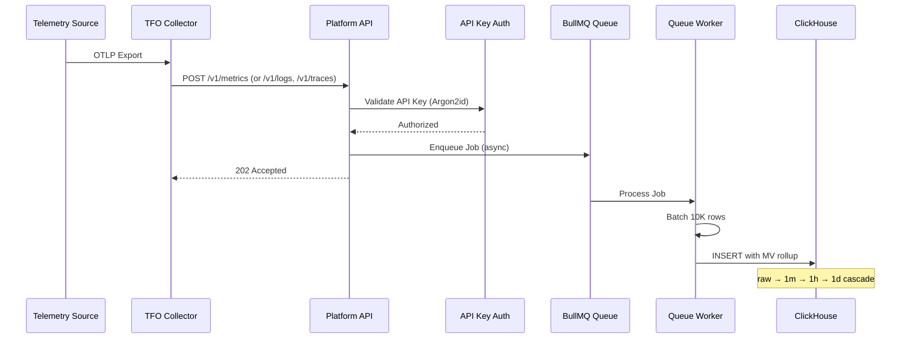
```mermaid
sequenceDiagram
    participant SRC as Telemetry Source
    participant COL as TFO Collector
    participant API as Platform API
    participant AUTH as API Key Auth
    participant Q as BullMQ Queue
    participant W as Queue Worker
    participant CH as ClickHouse

    SRC->>COL: OTLP Export
    COL->>API: POST /v1/metrics (or /v1/logs, /v1/traces)
    API->>AUTH: Validate API Key (Argon2id)
    AUTH-->>API: Authorized
    API->>Q: Enqueue Job (async)
    API-->>COL: 202 Accepted
    Q->>W: Process Job
    W->>W: Batch 10K rows
    W->>CH: INSERT with MV rollup
    Note over CH: raw → 1m → 1h → 1d cascade
```

### 2. Infrastructure Monitoring

#### TFO Agent v1.2.0 — One-For-All Collector

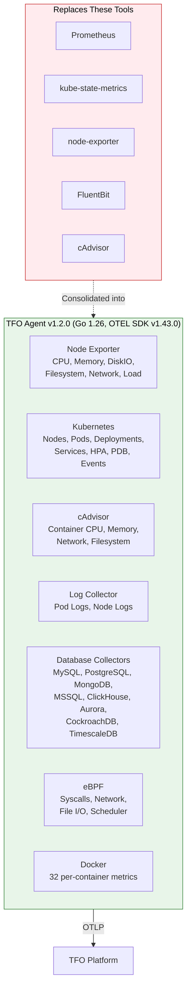
```mermaid
graph TB
    subgraph Replaced["Replaces These Tools"]
        PROM["Prometheus"]
        KSM["kube-state-metrics"]
        NE["node-exporter"]
        FB["FluentBit"]
        CAD["cAdvisor"]
    end

    subgraph Agent["TFO Agent v1.2.0 (Go 1.26, OTEL SDK v1.43.0)"]
        NE_MOD["Node Exporter<br/>CPU, Memory, DiskIO,<br/>Filesystem, Network, Load"]
        K8S_MOD["Kubernetes<br/>Nodes, Pods, Deployments,<br/>Services, HPA, PDB, Events"]
        CAD_MOD["cAdvisor<br/>Container CPU, Memory,<br/>Network, Filesystem"]
        LOG_MOD["Log Collector<br/>Pod Logs, Node Logs"]
        DB_MOD["Database Collectors<br/>MySQL, PostgreSQL, MongoDB,<br/>MSSQL, ClickHouse, Aurora,<br/>CockroachDB, TimescaleDB"]
        EBPF_MOD["eBPF<br/>Syscalls, Network,<br/>File I/O, Scheduler"]
        DOCKER_MOD["Docker<br/>32 per-container metrics"]
    end

    Replaced -.->|"Consolidated into"| Agent
    Agent -->|"OTLP"| PLATFORM["TFO Platform"]

    style Replaced fill:#ffebee,stroke:#c62828,color:#000
    style Agent fill:#e8f5e9,stroke:#2e7d32,color:#000
```

**Key Capabilities:**

- **9 Database Collectors**: MySQL/MariaDB/Percona, PostgreSQL, MongoDB, MSSQL, ClickHouse, CockroachDB, Amazon Aurora, TimescaleDB, SQLite3
- **eBPF Metrics**: 28 kernel-level metrics across 7 categories (syscall, network, file I/O, scheduler, memory, TCP state, Hubble)
- **Docker Monitoring**: 32 per-container metrics via Docker Engine API
- **cAdvisor Scraping**: Prometheus endpoint scraper for container metrics
- **39+ Integrations**: Cloud (GCP, Azure, AWS, Alibaba), APM (Datadog, New Relic, Dynatrace, Instana), OSS (SigNoz, Coroot, HyperDX, OpenObserve, Netdata), Streaming (Kafka, Loki, InfluxDB), Network (Cisco, SNMP, MQTT)
- **Resilient**: Disk-backed buffer, auto-reconnection, graceful shutdown
- **Cross-Platform**: Linux, macOS, Windows

#### TFO Collector v1.2.1 — OCB-Native Gateway

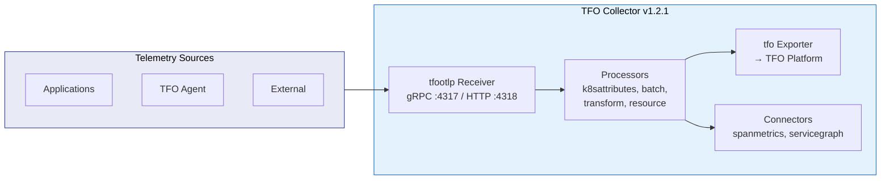
```mermaid
flowchart LR
    subgraph Sources["Telemetry Sources"]
        APP["Applications"]
        AGENT["TFO Agent"]
        EXT["External"]
    end

    subgraph Collector["TFO Collector v1.2.1"]
        RCV["tfootlp Receiver<br/>gRPC :4317 / HTTP :4318"]
        PROC["Processors<br/>k8sattributes, batch,<br/>transform, resource"]
        EXP_TFO["tfo Exporter<br/>→ TFO Platform"]
        CONN["Connectors<br/>spanmetrics, servicegraph"]
    end

    Sources --> RCV --> PROC
    PROC --> EXP_TFO
    PROC --> CONN

    style Sources fill:#e8eaf6,stroke:#283593,color:#000
    style Collector fill:#e3f2fd,stroke:#1565c0,color:#000
```

**Key Features:**

- Built on OpenTelemetry Core v1.58.0 + Contrib v0.152.0
- **Dual Endpoints**: Community v1 + Platform v2 on same port (4318)
- **4 Custom TFO Components**: `tfootlp` receiver, `tfo` exporter, `tfoauth` extension, `tfoidentity` extension
- **85+ OTel Community Components**: receivers, processors, exporters
- **Connectors**: spanmetrics (exemplars), servicegraph (service dependency maps)
- **Security**: Alpine runtime, non-root (UID 10001), CVE-patched, RBAC for K8s
- **Deployment**: Docker, Kubernetes (Helm), binary

#### Kubernetes Monitoring

Comprehensive K8s observability with 79+ graph definitions and 8 datatables:

| Category          | Metrics                               | Graphs |
| ----------------- | ------------------------------------- | ------ |
| **Node Metrics**  | CPU, Memory, Disk, Network, Load      | 15+    |
| **Pod/Container** | CPU, Memory, Restarts, Status         | 20+    |
| **Workloads**     | Deployments, StatefulSets, DaemonSets | 12+    |
| **Storage**       | PV, PVC, Storage Classes              | 8+     |
| **Network**       | Services, Endpoints, Ingresses        | 10+    |
| **Cluster**       | API Server, CoreDNS, Events, HPA      | 14+    |

#### Database Monitoring (QAN)

Query Analytics with native collectors for popular databases:

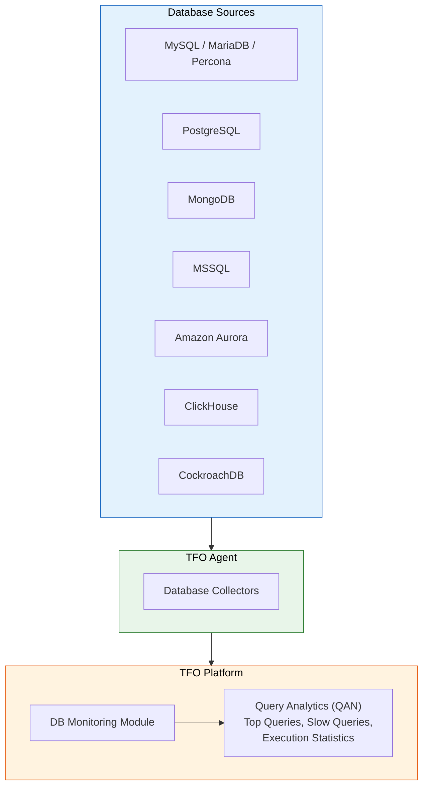
```mermaid
graph TB
    subgraph DB["Database Sources"]
        MYSQL["MySQL / MariaDB / Percona"]
        PG["PostgreSQL"]
        MONGO["MongoDB"]
        MSSQL["MSSQL"]
        AURORA["Amazon Aurora"]
        CH["ClickHouse"]
        CRDB["CockroachDB"]
    end

    subgraph Agent["TFO Agent"]
        COLL["Database Collectors"]
    end

    subgraph Platform["TFO Platform"]
        DBMON["DB Monitoring Module"]
        QAN["Query Analytics (QAN)<br/>Top Queries, Slow Queries,<br/>Execution Statistics"]
    end

    DB --> Agent --> Platform
    DBMON --> QAN

    style DB fill:#e3f2fd,stroke:#1565c0,color:#000
    style Agent fill:#e8f5e9,stroke:#2e7d32,color:#000
    style Platform fill:#fff3e0,stroke:#e65100,color:#000
```

### 3. Multi-Tenancy Architecture

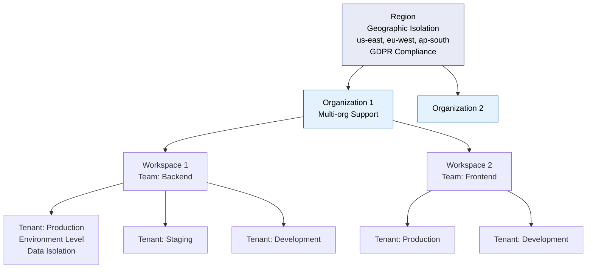
```mermaid
graph TD
    REGION[Region<br/>Geographic Isolation<br/>us-east, eu-west, ap-south<br/>GDPR Compliance]

    REGION --> ORG1[Organization 1<br/>Multi-org Support]
    REGION --> ORG2[Organization 2]

    ORG1 --> WS1[Workspace 1<br/>Team: Backend]
    ORG1 --> WS2[Workspace 2<br/>Team: Frontend]

    WS1 --> T1[Tenant: Production<br/>Environment Level<br/>Data Isolation]
    WS1 --> T2[Tenant: Staging]
    WS1 --> T3[Tenant: Development]

    WS2 --> T4[Tenant: Production]
    WS2 --> T5[Tenant: Development]

    style REGION fill:#e8eaf6,stroke:#283593,color:#000
    style ORG1 fill:#e3f2fd,stroke:#1565c0,color:#000
    style ORG2 fill:#e3f2fd,stroke:#1565c0,color:#000
```

**Features:**

- Automatic tenant context injection
- All queries filtered by workspace_id and tenant_id
- ClickHouse partitioning by tenant
- Cross-tenant data isolation guaranteed
- Resource quotas per workspace
- Regional data segregation for compliance

### 4. Authentication & Security

**5-Tier RBAC System:**

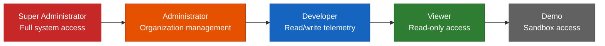
```mermaid
graph LR
    SA["Super Administrator<br/>Full system access"]
    ADM["Administrator<br/>Organization management"]
    DEV["Developer<br/>Read/write telemetry"]
    VWR["Viewer<br/>Read-only access"]
    DEMO["Demo<br/>Sandbox access"]

    SA --> ADM --> DEV --> VWR --> DEMO

    style SA fill:#c62828,stroke:#b71c1c,color:#fff
    style ADM fill:#e65100,stroke:#bf360c,color:#fff
    style DEV fill:#1565c0,stroke:#0d47a1,color:#fff
    style VWR fill:#2e7d32,stroke:#1b5e20,color:#fff
    style DEMO fill:#616161,stroke:#424242,color:#fff
```

**API Key Authentication (OTLP):**

- AWS-style dual-key system (tfk-_/tfs-_)
- Argon2id hashing (OWASP-recommended)
- Permission-based access: `metrics:write`, `logs:write`, `traces:write`
- Automatic key rotation with zero-downtime
- Rate limiting: 1000 req/min per key

**Authentication Methods:**

- JWT with refresh tokens
- Multi-Factor Authentication (TOTP)
- SSO providers: Google, GitHub, Azure AD, Okta
- SAML 2.0 and OIDC support

### 5. Advanced Alerting

**33 Default Production-Ready Rules:**

- Kubernetes (pod crashes, OOMKilled, restarts)
- VMs (CPU, memory, disk, network)
- Redis (memory usage, evictions, slowlog)
- Load Balancers (5xx errors, target health)
- Databases (connection pool, slow queries)

**Fatigue Prevention:**

- Cooldown periods (5-60 minutes)
- Rate limiting (max 10 alerts/hour per rule)
- Deduplication (fingerprint-based)
- Auto-resolution after conditions clear

**Notification Channels (8):**

- Email, Slack, PagerDuty, Webhook, Microsoft Teams, Discord, Telegram, SMS (Twilio)

### 6. Dashboards & Visualization

**6 Pre-configured Templates:**

1. **System Monitoring** - CPU, memory, disk, network
2. **Application Performance Monitoring (APM)** - Response times, throughput, errors, traces
3. **Logs Explorer** - Advanced log filtering and analysis
4. **Infrastructure Monitoring** - Containers, Kubernetes, cloud resources
5. **Network Monitoring** - Bandwidth, latency, packet loss
6. **Custom Metrics Dashboard** - Flexible custom metrics

**12+ Widget Types:**

- line_chart, bar_chart, area_chart, pie_chart, donut_chart
- table, gauge, stat, heatmap, graph (network diagram)
- text panel, logs viewer

### 7. Component Registry System

The frontend uses a centralized registry for all UI components:

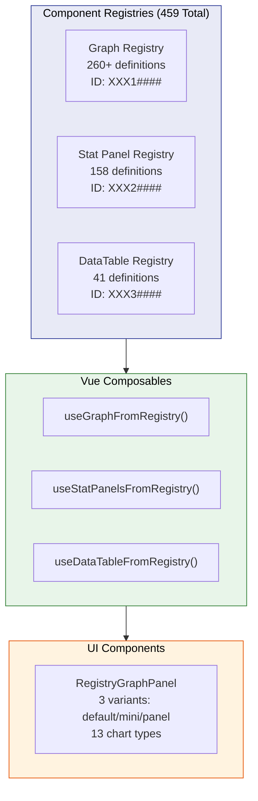
```mermaid
graph TB
    subgraph Registries["Component Registries (459 Total)"]
        GR["Graph Registry<br/>260+ definitions<br/>ID: XXX1####"]
        SP["Stat Panel Registry<br/>158 definitions<br/>ID: XXX2####"]
        DT["DataTable Registry<br/>41 definitions<br/>ID: XXX3####"]
    end

    subgraph Composables["Vue Composables"]
        UGR["useGraphFromRegistry()"]
        USP["useStatPanelsFromRegistry()"]
        UDT["useDataTableFromRegistry()"]
    end

    subgraph Components["UI Components"]
        RGP["RegistryGraphPanel<br/>3 variants: default/mini/panel<br/>13 chart types"]
    end

    Registries --> Composables --> Components

    style Registries fill:#e8eaf6,stroke:#283593,color:#000
    style Composables fill:#e8f5e9,stroke:#2e7d32,color:#000
    style Components fill:#fff3e0,stroke:#e65100,color:#000
```

**23 Module Codes**: HOM, DSH, MET, TRC, LOG, COR, EXP, ALR, RPT, UPT, STP, SVM, NWM, K8S, INF, AGT, RET, SUB, IAM, TEN, AUD, APK, NOT, LLM

### 8. AI Intelligence

**MCP Integration** — Model Context Protocol servers for AI-powered observability:

- **Go MCP Server** — Claude AI integration with platform API
- **Python MCP Server** — Natural language querying and analysis

**LLM Module:**

- Claude AI integration for natural language querying
- TFQL generation from natural language descriptions
- Anomaly explanation with contextual analysis
- Incident summarization across correlated signals

**Query Engine (TFQL):**

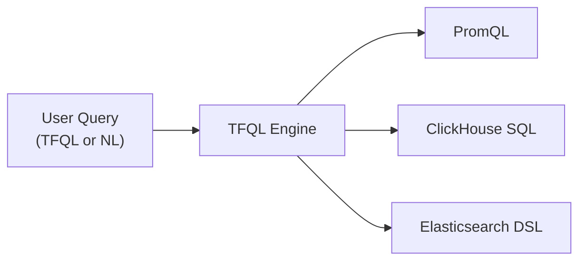
```mermaid
flowchart LR
    USER["User Query<br/>(TFQL or NL)"]
    TFQL["TFQL Engine"]
    PROM["PromQL"]
    CHSQL["ClickHouse SQL"]
    ES["Elasticsearch DSL"]

    USER --> TFQL
    TFQL --> PROM
    TFQL --> CHSQL
    TFQL --> ES
```

### 9. Performance Optimizations

**Dual-Layer Cache:**

- L1: In-memory cache (60s TTL)
- L2: Redis cache (1800s TTL)
- Event-driven invalidation via domain events
- Key prefix: `tf:cache:`

**Queue System (BullMQ on Redis DB 1):**

| Queue                  | Concurrency | Purpose                           |
| ---------------------- | ----------- | --------------------------------- |
| `otlp-ingestion`       | 10          | OTLP telemetry data processing    |
| `telemetry-processing` | 10          | Post-ingestion transformations    |
| `domain-events`        | 5           | Cross-module event propagation    |
| `alerts`               | 5           | Alert evaluation and notification |
| `notifications`        | 3           | Email, Slack, webhook delivery    |
| `reports`              | 3           | Scheduled report generation       |

**ClickHouse Optimizations:**

- 10 base tables, 24 materialized views
- TTL rollup cascade: raw → 1m → 1h → 1d
- Bloom filter, minmax, and set indexes
- Partitioning by tenant and timestamp
- 50-90% data compression

---

## Architecture Overview

### High-Level Architecture

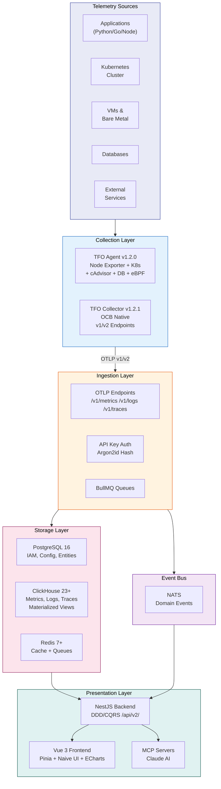
```mermaid
flowchart TB
    subgraph Sources["Telemetry Sources"]
        APP1["Applications<br/>(Python/Go/Node)"]
        K8S["Kubernetes<br/>Cluster"]
        VM["VMs &<br/>Bare Metal"]
        DB["Databases"]
        EXT["External<br/>Services"]
    end

    subgraph Collection["Collection Layer"]
        AGENT["TFO Agent v1.2.0<br/>Node Exporter + K8s<br/>+ cAdvisor + DB + eBPF"]
        TFOC["TFO Collector v1.2.1<br/>OCB Native<br/>v1/v2 Endpoints"]
    end

    subgraph Ingestion["Ingestion Layer"]
        OTLP_EP["OTLP Endpoints<br/>/v1/metrics /v1/logs /v1/traces"]
        AUTH["API Key Auth<br/>Argon2id Hash"]
        QUEUE["BullMQ Queues"]
    end

    subgraph Storage["Storage Layer"]
        PG["PostgreSQL 16<br/>IAM, Config, Entities"]
        CH["ClickHouse 23+<br/>Metrics, Logs, Traces<br/>Materialized Views"]
        RD["Redis 7+<br/>Cache + Queues"]
    end

    subgraph Messaging["Event Bus"]
        NATS["NATS<br/>Domain Events"]
    end

    subgraph Presentation["Presentation Layer"]
        BE["NestJS Backend<br/>DDD/CQRS /api/v2/"]
        FE["Vue 3 Frontend<br/>Pinia + Naive UI + ECharts"]
        MCP["MCP Servers<br/>Claude AI"]
    end

    Sources --> Collection
    Collection -->|"OTLP v1/v2"| Ingestion
    Ingestion --> Storage
    Ingestion --> Messaging
    Storage --> BE
    Messaging --> BE
    BE --> FE
    BE --> MCP

    style Sources fill:#e8eaf6,stroke:#283593,color:#000
    style Collection fill:#e3f2fd,stroke:#1565c0,color:#000
    style Ingestion fill:#fff3e0,stroke:#e65100,color:#000
    style Storage fill:#fce4ec,stroke:#880e4f,color:#000
    style Messaging fill:#f3e5f5,stroke:#6a1b9a,color:#000
    style Presentation fill:#e0f2f1,stroke:#004d40,color:#000
```

### Backend Architecture (DDD + CQRS)

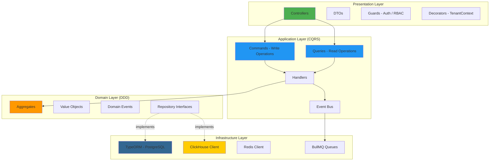
```mermaid
graph TD
    subgraph "Presentation Layer"
        CTRL[Controllers]
        DTO[DTOs]
        GUARD[Guards - Auth / RBAC]
        DEC[Decorators - TenantContext]
    end

    subgraph "Application Layer (CQRS)"
        CMD[Commands - Write Operations]
        QRY[Queries - Read Operations]
        HANDLER[Handlers]
        EVENT[Event Bus]
    end

    subgraph "Domain Layer (DDD)"
        AGG[Aggregates]
        VO[Value Objects]
        DEVT[Domain Events]
        PORT[Repository Interfaces]
    end

    subgraph "Infrastructure Layer"
        ORM[TypeORM - PostgreSQL]
        CH_SVC[ClickHouse Client]
        CACHE[Redis Client]
        QUEUE_SVC[BullMQ Queues]
    end

    CTRL --> CMD
    CTRL --> QRY
    CMD --> HANDLER
    QRY --> HANDLER
    HANDLER --> AGG
    HANDLER --> EVENT
    PORT -.->|"implements"| ORM
    PORT -.->|"implements"| CH_SVC
    EVENT --> QUEUE_SVC

    style CTRL fill:#4CAF50
    style CMD fill:#2196F3
    style QRY fill:#2196F3
    style AGG fill:#FF9800
    style ORM fill:#336791
    style CH_SVC fill:#ffcc01
```

### Deployment Architecture

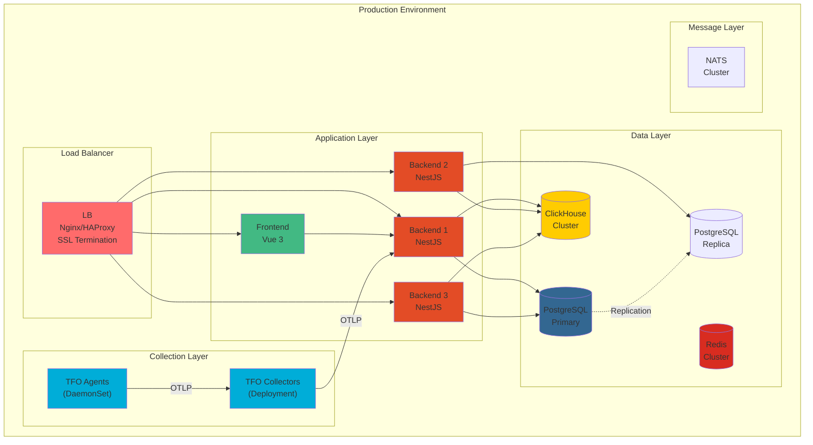
```mermaid
graph TB
    subgraph "Production Environment"
        subgraph "Load Balancer"
            LB[LB<br/>Nginx/HAProxy<br/>SSL Termination]
        end

        subgraph "Application Layer"
            FE1[Frontend<br/>Vue 3]
            API1[Backend 1<br/>NestJS]
            API2[Backend 2<br/>NestJS]
            API3[Backend 3<br/>NestJS]
        end

        subgraph "Data Layer"
            PG_PRIMARY[(PostgreSQL<br/>Primary)]
            PG_REPLICA[(PostgreSQL<br/>Replica)]
            CH_CLUSTER[(ClickHouse<br/>Cluster)]
            REDIS_CLUSTER[(Redis<br/>Cluster)]
        end

        subgraph "Collection Layer"
            AGENTS["TFO Agents<br/>(DaemonSet)"]
            COLLECTORS["TFO Collectors<br/>(Deployment)"]
        end

        subgraph "Message Layer"
            NATS_CLUSTER[NATS<br/>Cluster]
        end
    end

    LB --> FE1
    LB --> API1
    LB --> API2
    LB --> API3
    FE1 --> API1
    API1 --> PG_PRIMARY
    API2 --> PG_REPLICA
    API3 --> PG_PRIMARY
    PG_PRIMARY -.->|Replication| PG_REPLICA
    API1 --> CH_CLUSTER
    API2 --> CH_CLUSTER
    API3 --> CH_CLUSTER
    AGENTS -->|"OTLP"| COLLECTORS
    COLLECTORS -->|"OTLP"| API1

    style LB fill:#FF6B6B
    style FE1 fill:#42b983
    style API1 fill:#e34c26
    style API2 fill:#e34c26
    style API3 fill:#e34c26
    style PG_PRIMARY fill:#336791
    style CH_CLUSTER fill:#ffcc01
    style REDIS_CLUSTER fill:#d82c20
    style AGENTS fill:#00add8
    style COLLECTORS fill:#00add8
```

For detailed architecture documentation, see:

- [System Architecture](./architecture/01-SYSTEM-ARCHITECTURE.md)
- [Data Flow](./architecture/02-DATA-FLOW.md)
- [Multi-Tenancy](./architecture/03-MULTI-TENANCY.md)
- [Security](./architecture/04-SECURITY.md)
- [Performance](./architecture/05-PERFORMANCE.md)

---

## Technology Stack

### Backend

| Category          | Technology      | Version | Purpose                         |
| ----------------- | --------------- | ------- | ------------------------------- |
| **Framework**     | NestJS          | 11.x    | Enterprise Node.js framework    |
| **Language**      | TypeScript      | 5.x     | Type-safe development           |
| **Runtime**       | Node.js         | 20+     | JavaScript runtime              |
| **Metadata DB**   | PostgreSQL      | 16+     | Relational data storage         |
| **Telemetry DB**  | ClickHouse      | 23+     | Time-series data storage        |
| **Cache & Queue** | Redis           | 7+      | L1/L2 caching and BullMQ queues |
| **ORM**           | TypeORM         | 0.3.x   | PostgreSQL migrations           |
| **Queue**         | BullMQ          | 5.x     | Async job processing (6 queues) |
| **Messaging**     | NATS            | 2.x     | Event streaming                 |
| **Telemetry**     | OpenTelemetry   | 0.208+  | Self-instrumentation            |
| **Auth**          | Passport JWT    | Latest  | Authentication                  |
| **Validation**    | class-validator | Latest  | DTO validation                  |
| **Hashing**       | Argon2          | Latest  | Password + API key hashing      |

### Frontend

| Category        | Technology     | Version | Purpose                          |
| --------------- | -------------- | ------- | -------------------------------- |
| **Framework**   | Vue            | 3.5+    | Progressive JavaScript framework |
| **Build Tool**  | Vite           | 6.x     | Lightning-fast HMR               |
| **Language**    | TypeScript     | 5.x     | Type-safe development            |
| **UI Library**  | Naive UI       | 2.43+   | Vue 3 component library          |
| **CSS Engine**  | UnoCSS         | 66.x    | Atomic CSS                       |
| **State**       | Pinia          | 3.0+    | Vue 3 state management           |
| **Router**      | Vue Router     | 4.6+    | Official Vue router              |
| **Charts**      | Apache ECharts | 5.x+    | 80+ chart types                  |
| **HTTP Client** | Axios          | 1.13+   | REST API calls                   |
| **WebSocket**   | Socket.IO      | 4.8+    | Real-time updates                |

### Agent & Collector

| Category         | Technology            | Version  | Purpose                               |
| ---------------- | --------------------- | -------- | ------------------------------------- |
| **Agent**        | Go                    | 1.26+    | TFO Agent (infrastructure collection) |
| **Collector**    | Go (OCB)              | 1.26+    | TFO Collector (OTLP gateway)          |
| **OTEL SDK**     | OpenTelemetry Go      | v1.43.0  | Agent instrumentation                 |
| **OTEL Core**    | OpenTelemetry         | v1.58.0  | Collector core                        |
| **OTEL Contrib** | OpenTelemetry Contrib | v0.152.0 | Collector community components        |

---

## Module Overview

### Module Dependencies

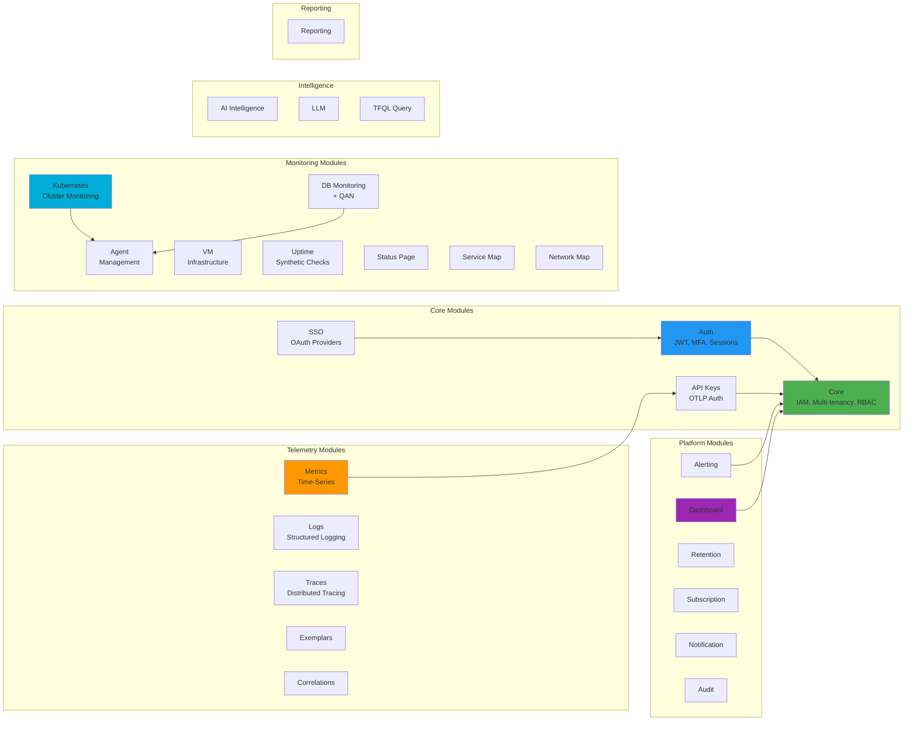
```mermaid
graph LR
    subgraph "Core Modules"
        CORE["Core<br/>IAM, Multi-tenancy, RBAC"]
        AUTH["Auth<br/>JWT, MFA, Sessions"]
        APIKEY["API Keys<br/>OTLP Auth"]
        SSO["SSO<br/>OAuth Providers"]
    end

    subgraph "Telemetry Modules"
        METRICS["Metrics<br/>Time-Series"]
        LOGS["Logs<br/>Structured Logging"]
        TRACES["Traces<br/>Distributed Tracing"]
        EXM["Exemplars"]
        COR["Correlations"]
    end

    subgraph "Monitoring Modules"
        AGENT["Agent<br/>Management"]
        K8S["Kubernetes<br/>Cluster Monitoring"]
        VM["VM<br/>Infrastructure"]
        UPT["Uptime<br/>Synthetic Checks"]
        STP["Status Page"]
        SVM["Service Map"]
        NWM["Network Map"]
        DBM["DB Monitoring<br/>+ QAN"]
    end

    subgraph "Platform Modules"
        DSH["Dashboard"]
        ALR["Alerting"]
        RET["Retention"]
        SUB["Subscription"]
        NOT["Notification"]
        AUD["Audit"]
    end

    subgraph "Intelligence"
        AI["AI Intelligence"]
        LLM["LLM"]
        TFQL["TFQL Query"]
    end

    subgraph "Reporting"
        RPT["Reporting"]
    end

    AUTH --> CORE
    APIKEY --> CORE
    SSO --> AUTH
    METRICS --> APIKEY
    K8S --> AGENT
    DBM --> AGENT
    ALR --> CORE
    DSH --> CORE

    style CORE fill:#4CAF50
    style AUTH fill:#2196F3
    style METRICS fill:#FF9800
    style K8S fill:#00ADD8
    style DSH fill:#9C27B0
```

### Backend Modules (25+)

| Module           | Name            | Purpose                                | Status     |
| ---------------- | --------------- | -------------------------------------- | ---------- |
| **Core**         | auth            | Authentication, JWT, MFA               | Production |
| **Core**         | iam             | Users, Roles, Permissions, RBAC        | Production |
| **Core**         | tenancy         | Multi-tenant isolation                 | Production |
| **Core**         | cache           | Dual-layer caching (L1/L2)             | Production |
| **Telemetry**    | metrics         | OTLP metrics ingestion & queries       | Production |
| **Telemetry**    | logs            | OTLP logs ingestion & search           | Production |
| **Telemetry**    | traces          | OTLP traces ingestion & visualization  | Production |
| **Telemetry**    | exemplars       | Metric-to-trace correlation            | Production |
| **Telemetry**    | correlations    | Cross-signal correlation               | Production |
| **Monitoring**   | agent           | Agent registration & lifecycle         | Production |
| **Monitoring**   | kubernetes      | K8s cluster monitoring (79+ graphs)    | Production |
| **Monitoring**   | vm              | VM/infrastructure monitoring           | Production |
| **Monitoring**   | uptime          | Synthetic checks & endpoint monitoring | Production |
| **Monitoring**   | status-page     | Public/private status pages            | Production |
| **Monitoring**   | service-map     | Service dependency mapping             | Production |
| **Monitoring**   | network-map     | Network topology visualization         | Production |
| **Monitoring**   | db-monitoring   | Database monitoring + QAN              | Production |
| **Platform**     | dashboard       | Dashboard templates & widgets          | Production |
| **Platform**     | alerting        | Alert rules, notifications (33 rules)  | Production |
| **Platform**     | retention       | Per-signal TTL management              | Production |
| **Platform**     | subscription    | Plan-based feature gating              | Production |
| **Platform**     | api-keys        | AWS-style API key management           | Production |
| **Platform**     | notification    | Multi-channel notifications            | Production |
| **Platform**     | sso             | Google, GitHub, Azure AD, Okta         | Production |
| **Platform**     | audit           | Immutable audit trail                  | Production |
| **Intelligence** | ai-intelligence | AI-powered observability               | Production |
| **Intelligence** | llm             | Claude AI integration                  | Production |
| **Intelligence** | query           | TFQL query engine                      | Production |
| **Intelligence** | data-masking    | PII redaction                          | Production |
| **Reporting**    | reporting       | Scheduled reports & PDF                | Production |

---

## Contributing

### Development Workflow

1. **Fork the repository**
2. **Create a feature branch** - `git checkout -b feature/my-feature`
3. **Follow naming conventions** - See [NAMING-CONVENTIONS.md](./shared/NAMING-CONVENTIONS.md)
4. **Write tests** - Maintain 88%+ coverage
5. **Run linting** - `pnpm lint`
6. **Build successfully** - `pnpm build` (must show 0 errors)
7. **Submit pull request**

### Coding Standards

- **Backend:** NestJS best practices, DDD patterns, CQRS
- **Frontend:** Vue 3 Composition API, TypeScript strict mode
- **Testing:** Unit tests (88%+), integration tests, e2e tests
- **Documentation:** JSDoc for all public APIs
- **Commit Messages:** Conventional Commits format

---

## Support & Resources

### Documentation

- **Architecture:** [./architecture/](./architecture/)
- **Backend:** [./backend/](./backend/)
- **Frontend:** [./frontend/](./frontend/)
- **API Reference:** [./shared/API-REFERENCE.md](./shared/API-REFERENCE.md)
- **Deployment:** [./deployment/](./deployment/)

### Community

- **GitHub:** https://github.com/telemetryflow/telemetryflow-platform
- **Issues:** https://github.com/telemetryflow/telemetryflow-platform/issues
- **Discussions:** https://github.com/telemetryflow/telemetryflow-platform/discussions

### Statistics

| Metric                         | Count                                   |
| ------------------------------ | --------------------------------------- |
| Backend Modules                | 25+ (DDD/CQRS)                          |
| Frontend Registry Entries      | 459 (graphs + stat panels + datatables) |
| CQRS Handlers                  | 40+                                     |
| API Endpoints                  | 120+                                    |
| Database Collectors (Agent)    | 9 databases                             |
| 3rd Party Integrations (Agent) | 39+                                     |
| eBPF Metrics (Agent)           | 28 kernel-level                         |
| ClickHouse Base Tables         | 10                                      |
| ClickHouse Materialized Views  | 24                                      |
| BullMQ Queues                  | 6                                       |
| Version                        | 1.4.0                                   |

---

## License

Apache License 2.0 - See [LICENSE](./LICENSE) for details.

---

## Acknowledgments

Built by **DevOpsCorner Indonesia**

- **Status:** Production Ready
- **Last Updated:** May 14, 2026
- **Website:** [telemetryflow.id](https://telemetryflow.id)
