# TelemetryFlow System Architecture

- **Version:** 1.0.0-CE
- **Last Updated:** December 12, 2025

---

## Table of Contents

1. [High-Level Architecture](#high-level-architecture)
2. [Architecture Principles](#architecture-principles)
3. [Component Overview](#component-overview)
4. [Layer Architecture (DDD)](#layer-architecture-ddd)
5. [CQRS Pattern](#cqrs-pattern)
6. [Event-Driven Architecture](#event-driven-architecture)
7. [Database Architecture](#database-architecture)
8. [Caching Strategy](#caching-strategy)
9. [Queue Architecture](#queue-architecture)
10. [Scalability Considerations](#scalability-considerations)

---

## High-Level Architecture

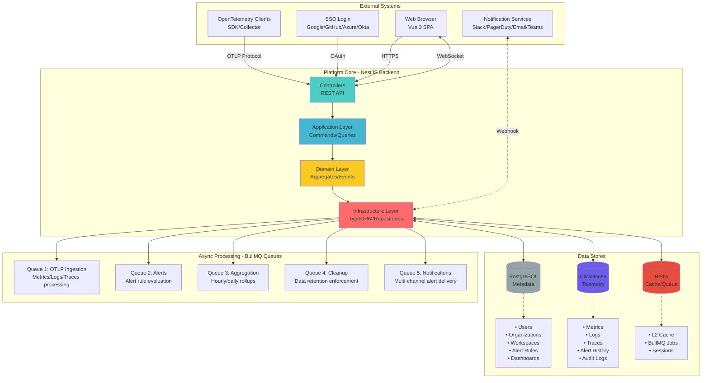

---

## Architecture Principles

### 1. Domain-Driven Design (DDD)

**Why DDD?**
- Complex business logic organized around domain concepts
- Clear boundaries between modules (15 bounded contexts)
- Ubiquitous language across team (Metric, Log, Trace, Tenant, etc.)
- Separation of concerns (domain logic vs infrastructure)

**Key DDD Components:**
- **Aggregates:** User, Organization, Workspace, Tenant, Metric, Log, Trace
- **Value Objects:** Email, TenantId, MetricName, TraceContext, Timestamp
- **Domain Events:** UserCreated, MetricIngested, AlertTriggered
- **Repositories:** Abstraction over data access (ports & adapters)
- **Domain Services:** Business logic that doesn't belong to a single entity

### 2. CQRS (Command Query Responsibility Segregation)

**Why CQRS?**
- Separate write operations (Commands) from read operations (Queries)
- Optimize reads independently from writes
- Enable event sourcing for audit trails
- Scale reads and writes independently

**Benefits:**
- **Performance:** Read-optimized models in ClickHouse, write-optimized in PostgreSQL
- **Complexity Management:** Clear separation of business logic
- **Scalability:** Independent scaling of command and query sides
- **Auditability:** Every command produces events for audit log

### 3. Event-Driven Architecture

**Why Event-Driven?**
- Loose coupling between modules
- Async processing for heavy operations
- Real-time updates to UI via WebSocket
- Audit trail of all system changes

**Event Types:**
- **Domain Events:** Business state changes (UserCreated, MetricIngested)
- **Integration Events:** Cross-module communication (AlertTriggered → NotificationSent)
- **System Events:** Infrastructure events (CacheMiss, QueueFull)

### 4. Microservices-Ready Modularity

**Why Modular Monolith?**
- Start as monolith for simplicity
- Each module is independently deployable
- Clear module boundaries (15 modules)
- Easy to extract to microservices later

**Module Independence:**
- Shared-nothing architecture
- Communication via events only
- No direct cross-module imports (only via public APIs)
- Each module has its own database schema

---

## Component Overview

### Frontend (Vue 3 SPA)

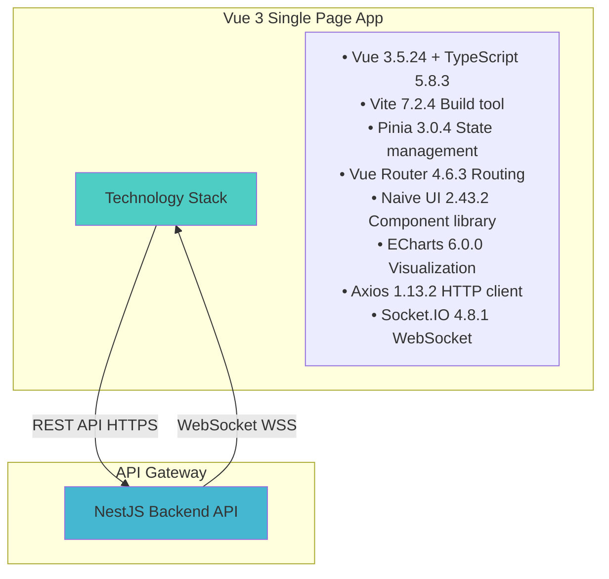

### Backend (NestJS)

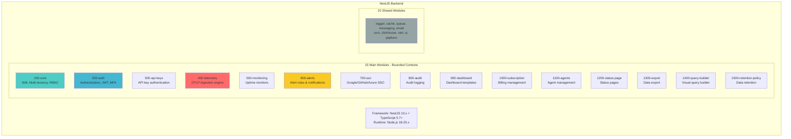

### Data Stores

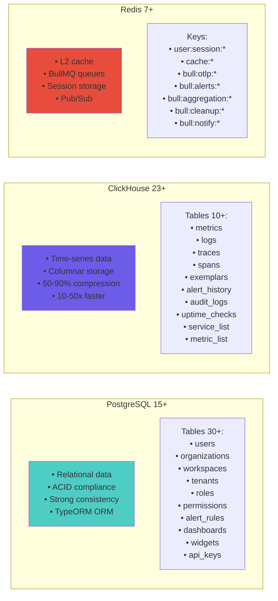

---

## Layer Architecture (DDD)

### 4-Layer Architecture

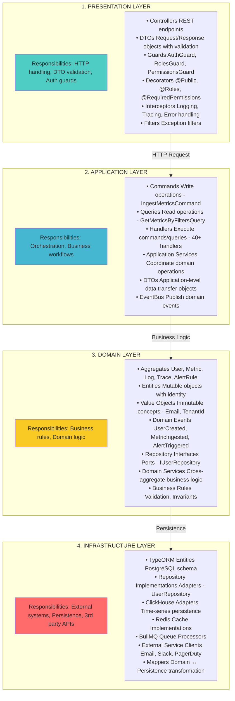

### Dependency Rule

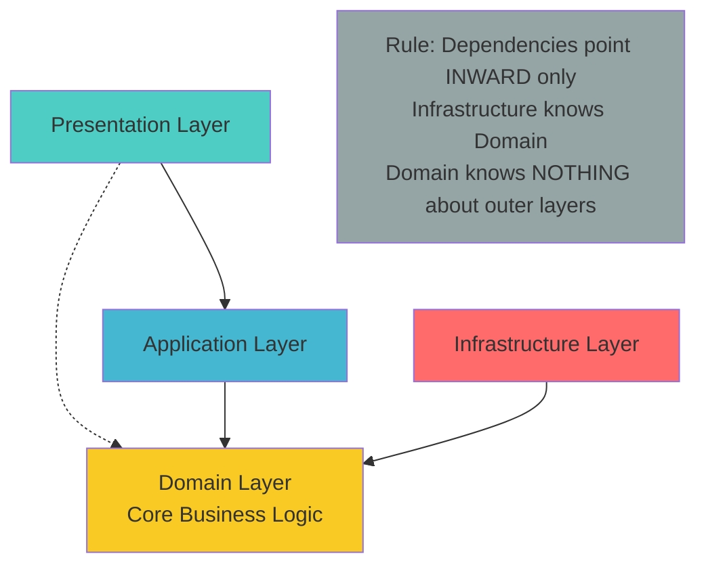

**Key Points:**
- **Domain Layer** is independent (no imports from outer layers)
- **Application Layer** depends only on Domain
- **Infrastructure Layer** implements Domain interfaces (Dependency Inversion)
- **Presentation Layer** uses Application services

---

## CQRS Pattern

### Command/Query Separation

```mermaid
graph TB
    subgraph "WRITE SIDE - Commands"
        W1[POST /api/v2/otlp/metrics]
        W2[IngestMetrics Command]
        W3[IngestMetrics Handler]
        W4[Domain Validation<br/>Business Rules]
        W5[QueueService<br/>BullMQ]
        W6[Async Processing<br/>Worker Thread]
        W7[MetricRepository<br/>ClickHouse]
        W8[Domain Event<br/>MetricIngested]
        W9[Event Handlers<br/>• Alert evaluation<br/>• Aggregation<br/>• Audit logging]

        W1 --> W2
        W2 --> W3
        W3 --> W4
        W4 --> W5
        W5 --> W6
        W6 --> W7
        W7 --> W8
        W8 --> W9
    end

    subgraph "READ SIDE - Queries"
        R1[GET /api/v2/telemetry/metrics?filters]
        R2[GetMetricsByFilters Query]
        R3[GetMetricsByFilters Handler]
        R4[ClickHouse<br/>Optimized Reads]

        R1 --> R2
        R2 --> R3
        R3 --> R4
    end

    style W1 fill:#ff6b6b
    style W5 fill:#f9ca24
    style W7 fill:#6c5ce7
    style R1 fill:#4ecdc4
    style R4 fill:#6c5ce7
```

### Command Examples

```typescript
// 1. Create Command
export class IngestMetricsFromOtlpCommand {
  constructor(
    public readonly otlpMetrics: OtlpMetrics,
    public readonly apiKey: ApiKey,
    public readonly tenantContext: TenantContext,
  ) {}
}

// 2. Command Handler
@CommandHandler(IngestMetricsFromOtlpCommand)
export class IngestMetricsFromOtlpHandler {
  async execute(command: IngestMetricsFromOtlpCommand): Promise<void> {
    // 1. Transform OTLP to domain model
    const metrics = this.transformOtlpToDomain(command.otlpMetrics);

    // 2. Validate business rules
    metrics.forEach(metric => metric.validate());

    // 3. Emit domain event
    this.eventBus.publish(new MetricIngested(metrics));

    // 4. Queue for async processing
    await this.queueService.addJob('otlp-ingestion', { metrics });
  }
}

// 3. Event Handler
@EventsHandler(MetricIngested)
export class AlertEvaluationHandler {
  async handle(event: MetricIngested): Promise<void> {
    // Evaluate alert rules in background
    await this.queueService.addJob('alert-evaluation', {
      metrics: event.metrics,
    });
  }
}
```

### Query Examples

```typescript
// 1. Create Query
export class GetMetricsByFiltersQuery {
  constructor(
    public readonly filters: MetricFilters,
    public readonly tenantContext: TenantContext,
  ) {}
}

// 2. Query Handler
@QueryHandler(GetMetricsByFiltersQuery)
export class GetMetricsByFiltersHandler {
  async execute(query: GetMetricsByFiltersQuery): Promise<Metric[]> {
    // 1. Check cache first
    const cacheKey = this.buildCacheKey(query);
    const cached = await this.cacheService.get(cacheKey);
    if (cached) return cached;

    // 2. Query ClickHouse (read-optimized)
    const metrics = await this.metricRepository.findByFilters(
      query.filters,
      query.tenantContext,
    );

    // 3. Cache results
    await this.cacheService.set(cacheKey, metrics, 60); // 60s TTL

    return metrics;
  }
}
```

---

## Event-Driven Architecture

### Event Flow

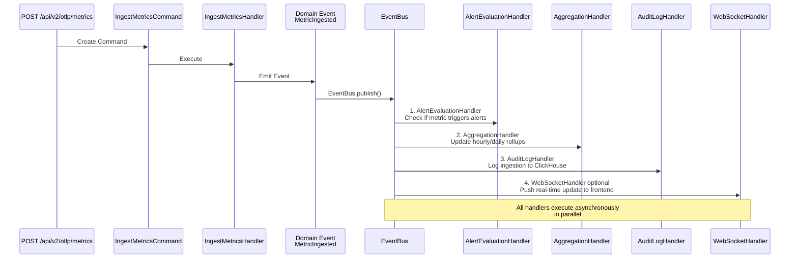

### Event Types

**Domain Events:**
- UserCreated, UserUpdated, UserDeleted
- OrganizationCreated, WorkspaceCreated, TenantCreated
- MetricIngested, LogIngested, TraceCreated
- AlertTriggered, AlertResolved
- DashboardCreated, WidgetAdded
- ApiKeyCreated, ApiKeyRotated, ApiKeyRevoked

**Integration Events:**
- NotificationSent (Email, Slack, PagerDuty)
- AggregationCompleted
- DataRetentionApplied
- CacheInvalidated

**System Events:**
- ServerStarted, ServerShutdown
- QueueFull, QueueDrained
- DatabaseConnectionLost, DatabaseConnectionRestored

---

## Database Architecture

### PostgreSQL (Relational Data)

**Purpose:** Store structured metadata requiring ACID transactions

**Schema Organization:**

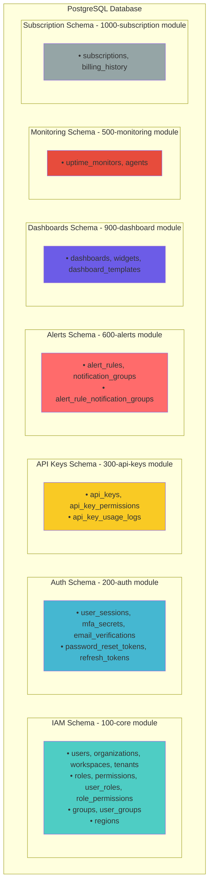

**Key Features:**
- TypeORM for migrations and entity management
- Soft deletion with `deleted_at` column
- Audit fields: `created_at`, `updated_at`, `created_by`
- Multi-tenancy via `workspace_id` and `tenant_id` columns
- Indexes on foreign keys and query fields
- Partial indexes for soft-deleted records

### ClickHouse (Time-Series Data)

**Purpose:** Store high-volume telemetry data optimized for analytics

**Schema Organization:**

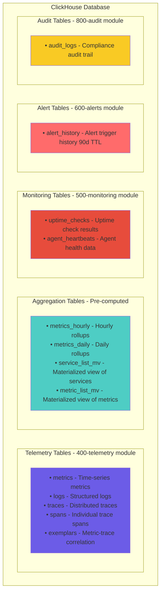

**Key Features:**
- Columnar storage (50-90% compression)
- Partitioning by tenant_id and timestamp
- 20 optimized indexes (bloom filter, minmax, set)
- TTL-based automatic data cleanup
- Materialized views for common queries
- MergeTree engine family
- Horizontal scaling via sharding

### Redis (Cache & Queue)

**Purpose:** Ephemeral data, caching, and job queues

**Key Structure:**

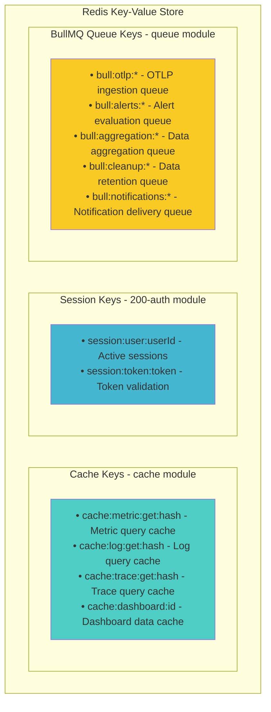

---

## Caching Strategy

### Multi-Level Cache (L1 + L2)

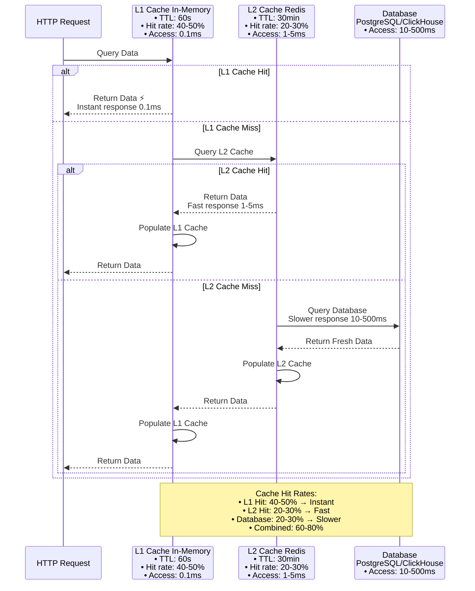

### Cache Invalidation Strategies

1. **TTL-Based:** Automatic expiration after TTL
2. **Event-Based:** Invalidate on domain events (e.g., MetricIngested)
3. **Pattern-Based:** Invalidate all keys matching pattern (e.g., `cache:metric:*`)
4. **Manual:** Admin endpoint `/api/v2/admin/cache/invalidate`

---

## Queue Architecture

### BullMQ Job Queues

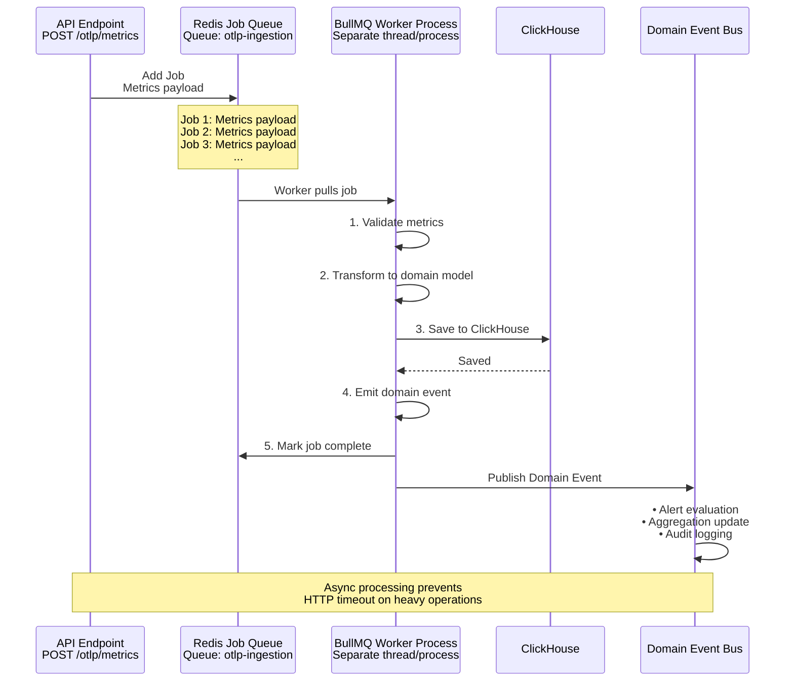

### Queue Configuration

| Queue | Purpose | Concurrency | Priority | Retry |
|-------|---------|-------------|----------|-------|
| **otlp-ingestion** | Metrics/logs/traces ingestion | 10 workers | High | 3 attempts |
| **alerts** | Alert rule evaluation | 5 workers | High | 5 attempts |
| **aggregation** | Hourly/daily rollups | 2 workers | Medium | 3 attempts |
| **cleanup** | Data retention enforcement | 1 worker | Low | 3 attempts |
| **notifications** | Multi-channel delivery | 5 workers | High | 5 attempts |

**Benefits:**
- **Async Processing:** Don't block API responses
- **Retry Logic:** Auto-retry failed jobs with exponential backoff
- **Rate Limiting:** Prevent overwhelming downstream systems
- **Prioritization:** Critical jobs processed first
- **Monitoring:** Admin endpoint for queue stats

---

## Scalability Considerations

### Horizontal Scaling

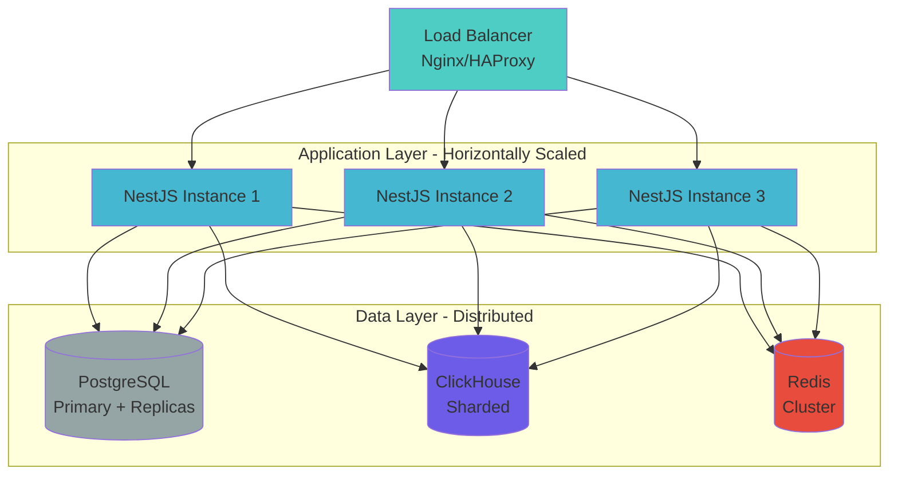

**Scaling Strategies:**
1. **API Layer:** Add more NestJS instances behind load balancer
2. **Database:** PostgreSQL read replicas, ClickHouse sharding
3. **Cache:** Redis Cluster for distributed caching
4. **Queue:** BullMQ workers scale independently
5. **Frontend:** CDN + multiple origin servers

### Performance Targets

| Metric | Target | Current |
|--------|--------|---------|
| API Response Time (p95) | < 200ms | ~150ms |
| OTLP Ingestion Throughput | 100k metrics/sec | 80k metrics/sec |
| Dashboard Load Time | < 1s | ~800ms |
| Cache Hit Rate | 70-80% | 60-80% |
| Query Performance (ClickHouse) | < 100ms (p95) | ~80ms |
| Concurrent Users | 1000+ | Tested up to 500 |

---

## Security Architecture

See [04-SECURITY.md](./04-SECURITY.md) for detailed security architecture.

**Key Security Layers:**
1. **Network Layer:** HTTPS, WSS, CORS
2. **Authentication:** JWT, MFA, SSO, API keys
3. **Authorization:** RBAC, Permission-based access
4. **Data Layer:** Encryption at rest, TLS in transit
5. **Audit:** Complete audit trail in ClickHouse

---

**Next:** [02-DATA-FLOW.md](./02-DATA-FLOW.md) - Detailed data flow documentation
