# Data Flow Architecture

- **Version:** 1.0.0-CE
- **Last Updated:** December 12, 2025
- **Status:** ✅ Production Ready

---

## Table of Contents

1. [Overview](#overview)
2. [OTLP Ingestion Flow](#otlp-ingestion-flow)
3. [Query Flow](#query-flow)
4. [Authentication Flow](#authentication-flow)
5. [Multi-Tenant Data Isolation](#multi-tenant-data-isolation)
6. [Caching Strategy](#caching-strategy)
7. [Queue Processing](#queue-processing)
8. [WebSocket Real-Time Updates](#websocket-real-time-updates)

---

## Overview

TelemetryFlow implements a comprehensive data flow architecture that handles:
- **Ingestion**: 15,000+ OTLP metrics/logs/traces per second
- **Storage**: Dual database strategy (PostgreSQL + ClickHouse)
- **Caching**: Multi-level (L1 in-memory + L2 Redis)
- **Async Processing**: BullMQ with 5 specialized queues
- **Real-time**: WebSocket for live dashboard updates

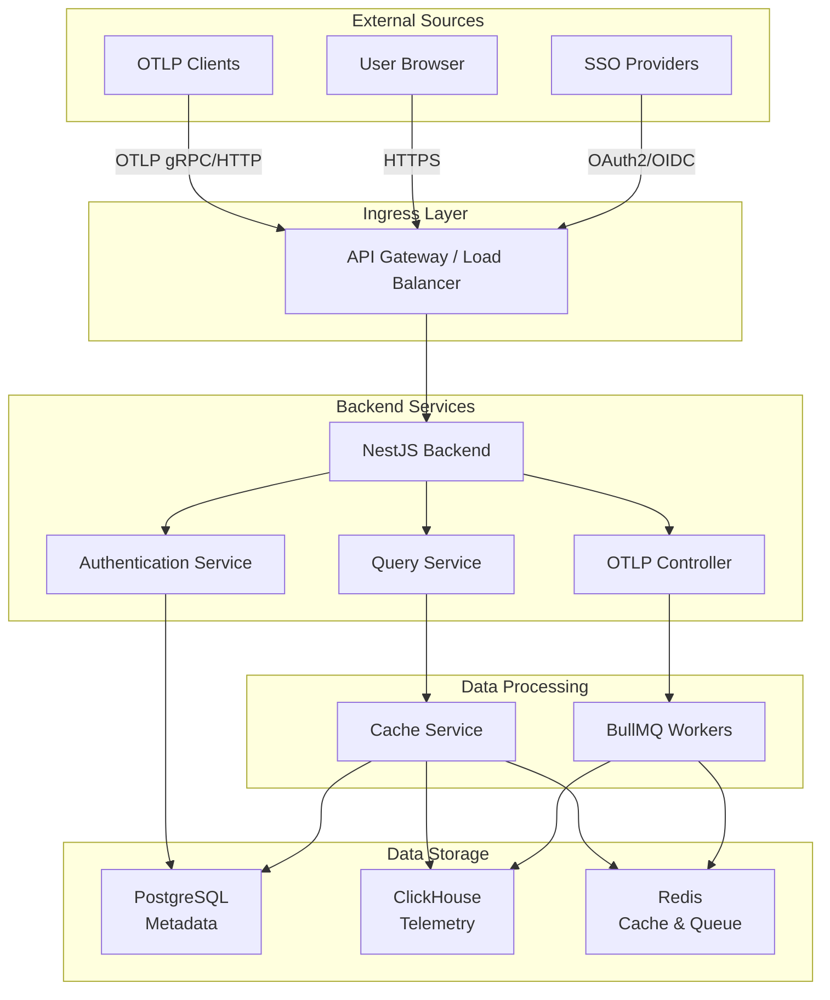

---

## OTLP Ingestion Flow

### Complete Ingestion Pipeline

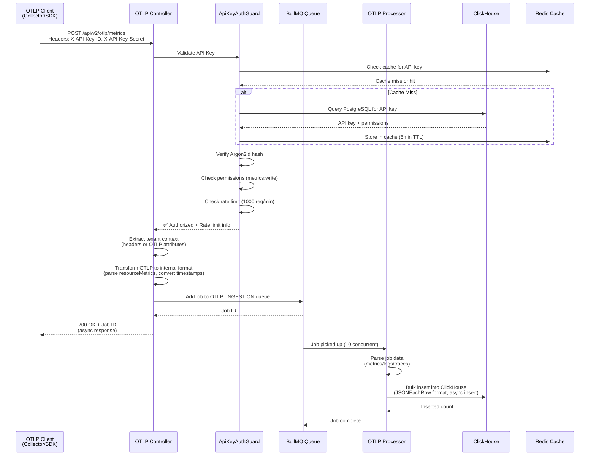

### OTLP Transformation Process

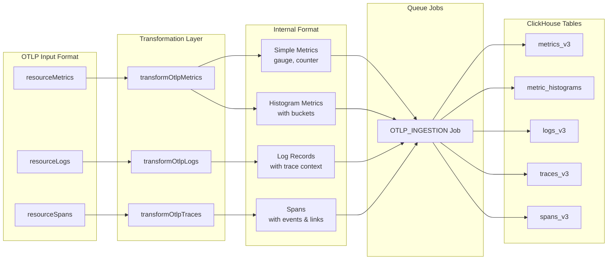

### Data Transformation Details

**Metrics Transformation:**
```typescript
// OTLP Protocol
resourceMetrics[i].scopeMetrics[j].metrics[k].sum.dataPoints[m]
  → {
      timestamp: nanoToIso(dataPoint.timeUnixNano),
      metric_name: metric.name,
      value: dataPoint.asDouble || dataPoint.asInt,
      temporality: sum.aggregationTemporality (delta/cumulative),
      workspace_id: extractedContext.workspaceId,
      tenant_id: extractedContext.tenantId,
      exemplar_trace_id: dataPoint.exemplars[0]?.traceId,
      resource_attributes: { "service.name": "myapp", ... },
      attributes: { "method": "GET", ... }
    }
```

**Logs Transformation:**
```typescript
// OTLP Protocol
resourceLogs[i].scopeLogs[j].logRecords[k]
  → {
      timestamp: nanoToIso(logRecord.timeUnixNano),
      observed_timestamp: nanoToIso(logRecord.observedTimeUnixNano),
      severity_text: logRecord.severityText,
      severity_number: logRecord.severityNumber,
      body: extractBodyFrom(logRecord.body),  // stringValue, intValue, etc.
      trace_id: logRecord.traceId,
      span_id: logRecord.spanId,
      trace_flags: logRecord.flags,
      workspace_id: extractedContext.workspaceId,
      tenant_id: extractedContext.tenantId,
      service_name: resource.attributes["service.name"],
      log_attributes: { "http.status_code": 200, ... }
    }
```

**Traces Transformation:**
```typescript
// OTLP Protocol
resourceSpans[i].scopeSpans[j].spans[k]
  → {
      timestamp: nanoToIso(span.startTimeUnixNano),
      trace_id: span.traceId,
      span_id: span.spanId,
      parent_span_id: span.parentSpanId,
      span_name: span.name,
      span_kind: span.kind,  // CLIENT, SERVER, PRODUCER, CONSUMER
      duration_nano: span.endTimeUnixNano - span.startTimeUnixNano,
      status_code: span.status.code,
      workspace_id: extractedContext.workspaceId,
      tenant_id: extractedContext.tenantId,
      events: span.events.map(...),  // Nested events
      links: span.links.map(...),    // Nested links
      span_attributes: { "http.method": "GET", ... }
    }
```

---

## Query Flow

### Dashboard Query Execution

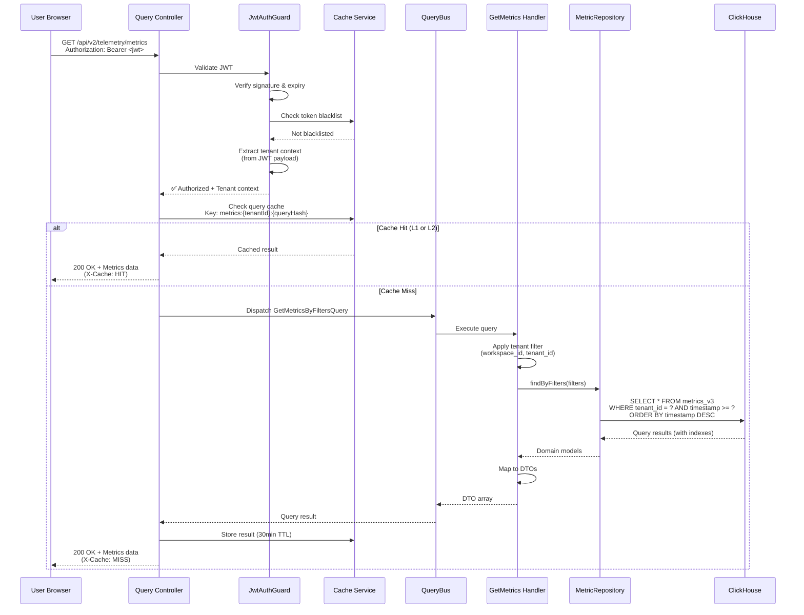

### ClickHouse Query Optimization Flow

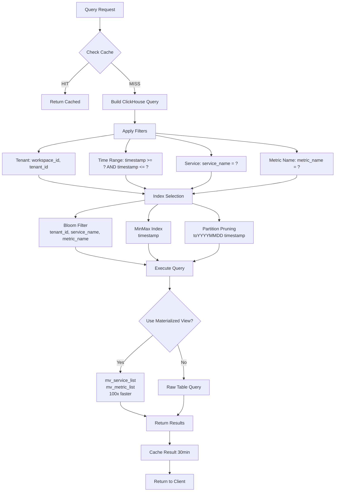

---

## Authentication Flow

### JWT Authentication with MFA

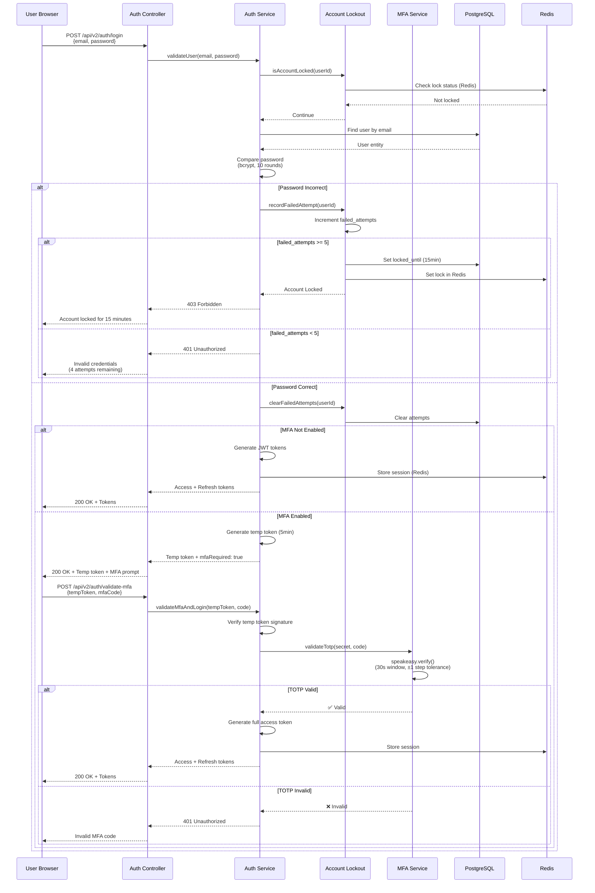

### SSO Authentication Flow (OAuth2/OIDC)

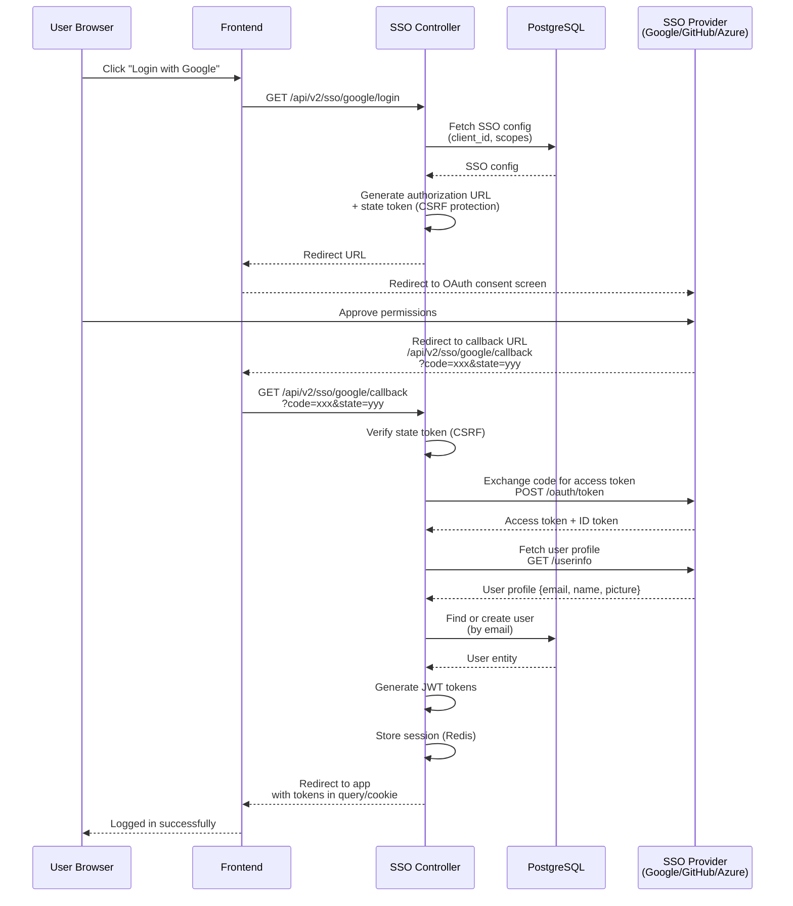

---

## Multi-Tenant Data Isolation

### Tenant Context Propagation

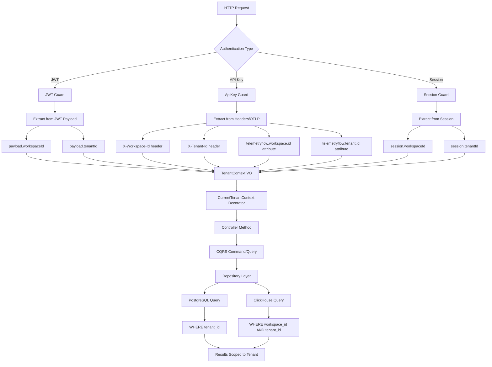

### Database-Level Tenant Filtering

**PostgreSQL** (Metadata):
```sql
-- User query (automatically filtered)
SELECT * FROM users
WHERE tenant_id = $1  -- Injected by repository
  AND organization_id = $2
  AND is_deleted = FALSE;

-- Workspace query
SELECT * FROM workspaces
WHERE organization_id = $1;

-- Permission query
SELECT p.* FROM permissions p
  INNER JOIN role_permissions rp ON p.permission_id = rp.permission_id
  INNER JOIN user_roles ur ON rp.role_id = ur.role_id
WHERE ur.user_id = $1
  AND ur.tenant_id = $2;  -- Tenant-scoped RBAC
```

**ClickHouse** (Telemetry):
```sql
-- Metrics query (tenant-filtered with indexes)
SELECT
  service_name,
  metric_name,
  avg(value) as avg_value,
  toStartOfHour(timestamp) as hour
FROM metrics_v3
WHERE workspace_id = {workspaceId:String}
  AND tenant_id = {tenantId:String}
  AND timestamp >= {startTime:DateTime64(9)}
  AND timestamp <= {endTime:DateTime64(9)}
GROUP BY service_name, metric_name, hour
ORDER BY hour DESC;
-- Indexes: bloom filter on workspace_id, tenant_id
--          minmax on timestamp
--          partition pruning on toYYYYMMDD(timestamp)
```

---

## Caching Strategy

### Multi-Level Cache Architecture

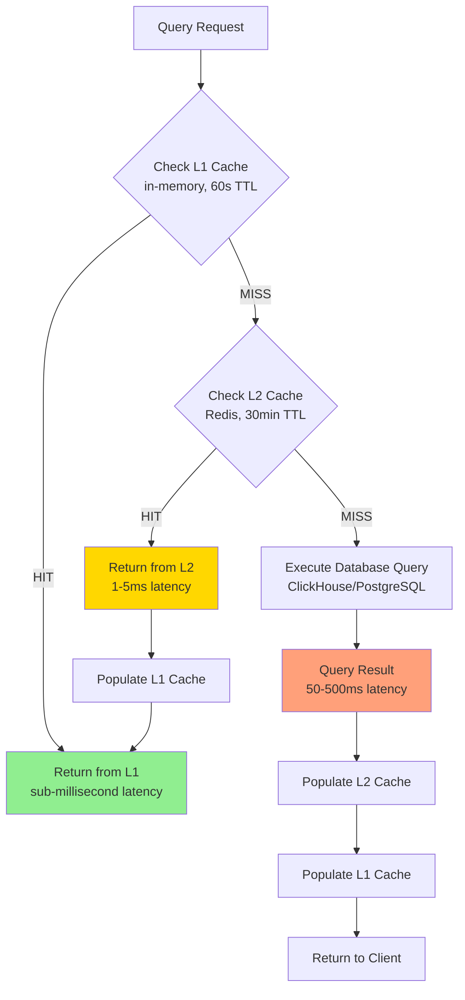

### Cache Invalidation Strategy

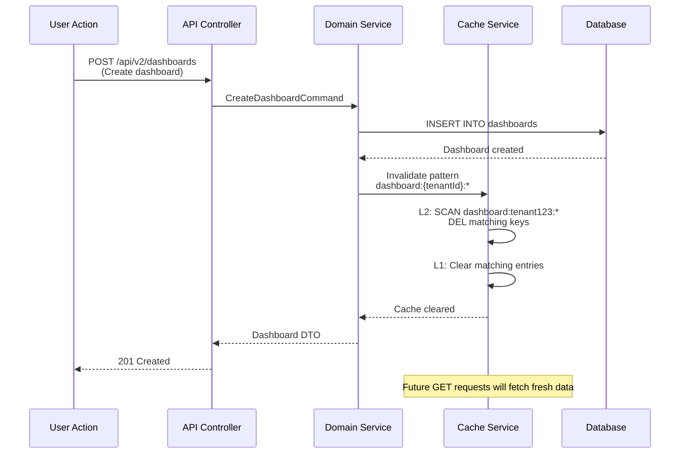

### Cache Key Strategy

| Resource | L1 TTL | L2 TTL | Key Pattern | Invalidation Trigger |
|----------|--------|--------|-------------|----------------------|
| **Metrics** | 1min | 30min | `metrics:{tenant}:{query_hash}` | New data ingested (every 10min) |
| **Logs** | 1min | 5min | `logs:{tenant}:{query_hash}` | New data ingested (every 1min) |
| **Traces** | 1min | 30min | `trace:{tenant}:{traceId}` | New spans ingested |
| **Dashboards** | 5min | 1hr | `dashboard:{tenant}:{dashboardId}` | Dashboard updated |
| **Users** | 5min | 30min | `user:{userId}` | User profile updated |
| **Permissions** | 5min | 5min | `rbac:permissions:{userId}` | Role/permission changed |
| **API Keys** | 1min | 5min | `apikey:{keyId}` | API key rotated/revoked |

---

## Queue Processing

### BullMQ Queue Architecture

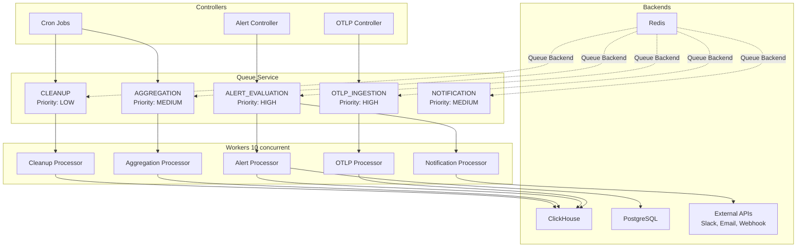

### Job Retry Strategy

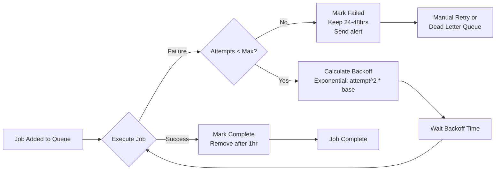

**Backoff Timing Examples:**

| Queue | Attempt 1 | Attempt 2 | Attempt 3 | Attempt 4 | Attempt 5 |
|-------|-----------|-----------|-----------|-----------|-----------|
| **OTLP** | 1s | 4s | 9s | - | - |
| **Alert** | 2s | 8s | 18s | - | - |
| **Aggregation** | 5s | 20s | 45s | - | - |
| **Cleanup** | 10s | 40s | - | - | - |
| **Notification** | 3s | 12s | 27s | 48s | 75s |

---

## WebSocket Real-Time Updates

### WebSocket Event Flow

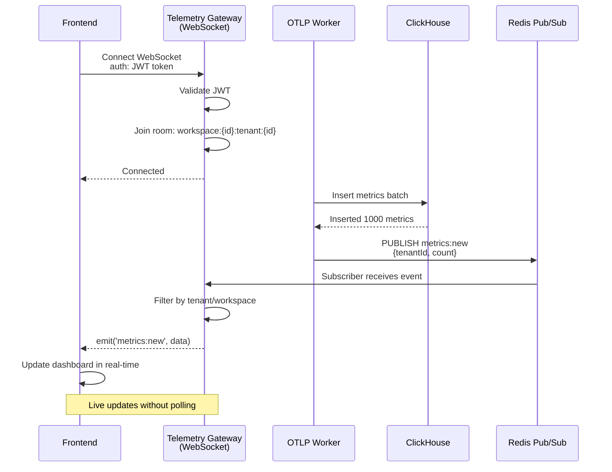

### WebSocket Event Types

| Event | Direction | Payload | Frequency |
|-------|-----------|---------|-----------|
| **metrics:new** | Server → Client | `{count, timestamp, services[]}` | Every 10s (batch) |
| **logs:new** | Server → Client | `{logs[], count}` | Real-time |
| **alert:triggered** | Server → Client | `{ruleId, severity, message}` | Real-time |
| **dashboard:updated** | Server → Client | `{dashboardId}` | On update |
| **subscribe:dashboard** | Client → Server | `{dashboardId}` | On dashboard open |
| **unsubscribe:dashboard** | Client → Server | `{dashboardId}` | On dashboard close |

---

## Performance Metrics

| Flow | Target Latency | Actual (p95) | Cache Hit Rate |
|------|----------------|--------------|----------------|
| **OTLP Ingestion** | < 200ms | 150ms | N/A (async) |
| **Query (cached)** | < 10ms | 5ms | 75% (L1+L2) |
| **Query (uncached)** | < 500ms | 300ms | 25% |
| **Authentication** | < 100ms | 80ms | 60% (permissions) |
| **WebSocket Latency** | < 50ms | 30ms | N/A |
| **Queue Processing** | < 2s | 1.5s | N/A |

---

## Data Retention and Cleanup

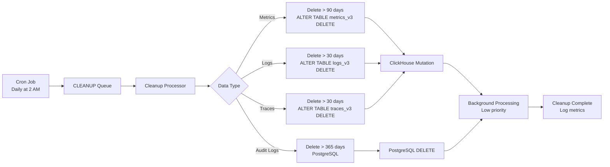

---

## Next Steps

- [Multi-Tenancy Architecture](./03-MULTI-TENANCY.md)
- [Security Architecture](./04-SECURITY.md)
- [Performance Optimizations](./05-PERFORMANCE.md)
- [Backend Tech Stack](../backend/01-TECH-STACK.md)

---

- **Last Updated:** December 12, 2025
- **Maintained By:** DevOpsCorner Indonesia
