# Multi-Tenancy Architecture

- **Version:** 3.10.0
- **Last Updated:** December 12, 2025
- **Status:** ✅ Production Ready

---

## Table of Contents

1. [Overview](#overview)
2. [Hierarchical Tenant Model](#hierarchical-tenant-model)
3. [Tenant Context Propagation](#tenant-context-propagation)
4. [Database-Level Isolation](#database-level-isolation)
5. [Query Filtering](#query-filtering)
6. [ClickHouse Partitioning](#clickhouse-partitioning)
7. [Security Considerations](#security-considerations)
8. [Performance Impact](#performance-impact)

---

## Overview

TelemetryFlow implements a **4-level hierarchical multi-tenancy** model designed for enterprise SaaS:


**Isolation Guarantees:**
- ✅ Data never crosses tenant boundaries
- ✅ Queries automatically scoped to tenant context
- ✅ Database-level partitioning for performance
- ✅ Regional compliance (GDPR, data residency)

---

## Hierarchical Tenant Model

### Entity Hierarchy


### Hierarchy Flow

```mermaid
flowchart LR
    A[👤 User Login] --> B{Belongs to Region?}
    B -->|Yes| C[Select Organization]
    C --> D[Select Workspace]
    D --> E[Select Tenant]
    E --> F[Access Telemetry Data]

    B -->|No| G[❌ Access Denied]

    style F fill:#90EE90
    style G fill:#FFB6C1
```



### Hierarchy Examples

**Example 1: E-commerce Platform**
```
Region: US-East-1
└─ Organization: ShopCo Inc
   ├─ Workspace: Production
   │  ├─ Tenant: web-frontend
   │  ├─ Tenant: api-backend
   │  └─ Tenant: payment-service
   └─ Workspace: Staging
      ├─ Tenant: web-frontend
      └─ Tenant: api-backend
```

**Example 2: Multi-Customer MSP**
```
Region: EU-West-1
├─ Organization: Customer-A (ACME Corp)
│  └─ Workspace: Production
│     ├─ Tenant: application
│     └─ Tenant: infrastructure
└─ Organization: Customer-B (TechCo)
   └─ Workspace: Production
      ├─ Tenant: microservice-1
      └─ Tenant: microservice-2
```

---

## Tenant Context Propagation

### Context Extraction Flow


### Tenant Context Value Object


### Context Extraction Priority


---

## Database-Level Isolation

### PostgreSQL Tenant Filtering


**Example Query Pattern:**
```typescript
// UserRepository.findByTenant()
async findByTenant(tenantContext: TenantContext): Promise<User[]> {
  return this.repository.find({
    where: {
      tenant_id: tenantContext.tenantId,
      workspace: { workspace_id: tenantContext.workspaceId },
      is_deleted: false,
    },
    relations: ['workspace', 'organization'],
  });
}
```

### ClickHouse Tenant Filtering


**Example ClickHouse Query:**
```sql
SELECT
  service_name,
  metric_name,
  avg(value) as avg_value,
  toStartOfHour(timestamp) as hour
FROM metrics_v3
WHERE workspace_id = {workspaceId:String}
  AND tenant_id = {tenantId:String}
  AND timestamp >= {startTime:DateTime64(9)}
  AND timestamp <= {endTime:DateTime64(9)}
  AND metric_name = {metricName:String}
GROUP BY service_name, metric_name, hour
ORDER BY hour DESC
LIMIT 1000
```

---

## Query Filtering

### Automatic Tenant Injection


### Repository Pattern


---

## ClickHouse Partitioning

### Partitioning Strategy


### Partition Pruning

```mermaid
flowchart LR
    A[Query with<br/>Time Range] --> B[Partition Pruning]

    B --> C{Date in Range?}

    C -->|2025-12-01| D[✅ Read Partition]
    C -->|2025-12-02| E[✅ Read Partition]
    C -->|2025-12-03| F[✅ Read Partition]
    C -->|2025-11-30| G[❌ Skip Partition]
    C -->|2025-12-04| H[❌ Skip Partition]

    D --> I[Filter by tenant_id<br/>using Bloom Filter]
    E --> I
    F --> I

    I --> J[Return Results]

    style D fill:#90EE90
    style E fill:#90EE90
    style F fill:#90EE90
    style G fill:#E0E0E0
    style H fill:#E0E0E0
```



### Index-Based Tenant Filtering


### Table Schema with Tenant Columns

```sql
CREATE TABLE metrics_v3 (
    timestamp DateTime64(9),
    metric_name String,
    service_name String,

    -- Multi-tenancy columns
    organization_id String DEFAULT '',
    workspace_id String DEFAULT '',
    tenant_id String DEFAULT '',

    resource_attributes Map(String, String),
    attributes Map(String, String),
    value Float64,
    unit String,
    metric_type Enum8('gauge'=1, 'counter'=2, 'histogram'=3, 'summary'=4),

    INDEX idx_tenant_id tenant_id TYPE bloom_filter GRANULARITY 1,
    INDEX idx_workspace_id workspace_id TYPE bloom_filter GRANULARITY 1,
    INDEX idx_organization_id organization_id TYPE bloom_filter GRANULARITY 1,
    INDEX idx_service_name service_name TYPE bloom_filter GRANULARITY 1,
    INDEX idx_metric_name metric_name TYPE bloom_filter GRANULARITY 1,
    INDEX idx_timestamp timestamp TYPE minmax GRANULARITY 1
)
ENGINE = MergeTree()
PARTITION BY toYYYYMMDD(timestamp)
ORDER BY (service_name, metric_name, timestamp)
TTL toDateTime(timestamp) + INTERVAL 90 DAY;
```

---

## Security Considerations

### Tenant Isolation Guarantees


### Cross-Tenant Access Prevention

```mermaid
sequenceDiagram
    participant U1 as User (Tenant A)
    participant API as API Gateway
    participant Auth as Auth Service
    participant DB as Database
    participant Audit as Audit Log

    U1->>API: Request data for Tenant B
    API->>Auth: Validate JWT
    Auth->>Auth: Extract tenant context<br/>tenantId = A

    API->>DB: Query with tenantId = A
    Note over API,DB: User CANNOT specify<br/>different tenant ID

    alt Attempt to bypass tenant filter
        U1->>API: Request with modified tenant_id
        API->>Auth: Validate tenant context
        Auth->>Audit: ⚠️ Log security violation
        Auth-->>U1: ❌ 403 Forbidden
    end

    DB-->>API: Data for Tenant A only
    API-->>U1: ✅ Authorized data
```



### Audit Trail


---

## Performance Impact

### Query Performance Comparison


### Index Hit Rate


### Partition Pruning Impact

| Query Type | Without Pruning | With Pruning | Improvement |
|------------|----------------|--------------|-------------|
| **Single Day** | 90 partitions | 1 partition | 90x faster |
| **1 Week** | 90 partitions | 7 partitions | 12.8x faster |
| **1 Month** | 90 partitions | 30 partitions | 3x faster |

### Cache Strategy per Tenant


---

## Implementation Checklist

### ✅ Multi-Tenancy Implementation

- [x] **Hierarchical Model**
  - [x] Region → Organization → Workspace → Tenant entities
  - [x] Foreign key relationships enforced
  - [x] Soft delete for compliance

- [x] **Context Propagation**
  - [x] TenantContext value object
  - [x] @CurrentTenantContext decorator
  - [x] Extraction from JWT payload
  - [x] Extraction from API key headers
  - [x] Extraction from OTLP resource attributes

- [x] **Database Isolation**
  - [x] PostgreSQL: WHERE tenant_id = ? filters
  - [x] ClickHouse: tenant_id columns with indexes
  - [x] Bloom filter indexes on tenant columns
  - [x] Query parameterization (prevent injection)

- [x] **Security**
  - [x] Tenant context validation
  - [x] Cross-tenant access prevention
  - [x] Audit logging for all operations
  - [x] Security violation detection

- [x] **Performance**
  - [x] Multi-level caching per tenant
  - [x] Partition pruning by time
  - [x] Bloom filter indexes
  - [x] Query optimization

---

## Best Practices

### 1. Always Use Tenant Context

```typescript
// ❌ BAD: No tenant context
async getMetrics() {
  return this.metricRepository.find();
}

// ✅ GOOD: Tenant context injected
async getMetrics(@CurrentTenantContext() context: TenantContext) {
  return this.metricRepository.findByTenant(context);
}
```

### 2. Validate Tenant Access

```typescript
// ✅ Always validate tenant context
if (!tenantContext || !tenantContext.tenantId) {
  throw new ForbiddenException('Tenant context required');
}

// ✅ Validate entity belongs to tenant
const dashboard = await this.findById(id);
if (dashboard.tenant_id !== tenantContext.tenantId) {
  throw new ForbiddenException('Access denied');
}
```

### 3. Use Parameterized Queries

```typescript
// ❌ BAD: SQL injection risk
const query = `SELECT * FROM metrics WHERE tenant_id = '${tenantId}'`;

// ✅ GOOD: Parameterized query
const query = `
  SELECT * FROM metrics
  WHERE tenant_id = {tenantId:String}
  AND workspace_id = {workspaceId:String}
`;
const params = { tenantId, workspaceId };
```

### 4. Cache Per Tenant

```typescript
// ✅ Tenant-scoped cache keys
const cacheKey = `tenant:${tenantId}:metrics:${queryHash}`;
const cached = await this.cache.get(cacheKey);
```

---

## Next Steps

- [Data Flow Architecture](./02-DATA-FLOW.md)
- [Security Architecture](./04-SECURITY.md)
- [Performance Optimizations](./05-PERFORMANCE.md)
- [Database Schema](../shared/DATABASE-SCHEMA.md)

---

- **Last Updated:** December 12, 2025
- **Maintained By:** DevOpsCorner Indonesia
