# Security Architecture

**Version:** 3.10.0
**Last Updated:** December 12, 2025
**Status:** ✅ Production Ready

---

## Table of Contents

1. [Overview](#overview)
2. [Authentication Mechanisms](#authentication-mechanisms)
3. [Authorization & RBAC](#authorization--rbac)
4. [API Key Authentication](#api-key-authentication)
5. [Multi-Factor Authentication](#multi-factor-authentication)
6. [Single Sign-On](#single-sign-on)
7. [Audit Logging](#audit-logging)
8. [Security Best Practices](#security-best-practices)

---

## Overview

TelemetryFlow implements **defense-in-depth security** with multiple layers:

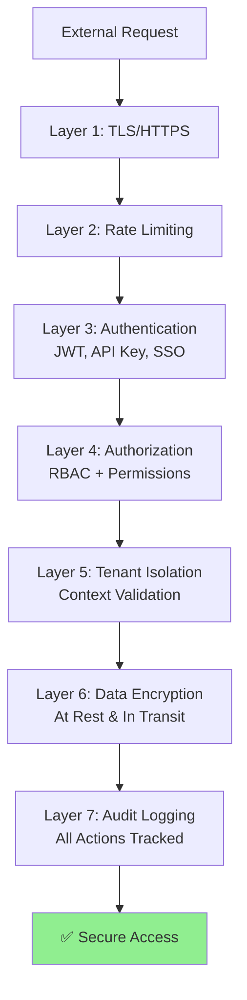
```mermaid
graph TD
    A[External Request] --> B[Layer 1: TLS/HTTPS]
    B --> C[Layer 2: Rate Limiting]
    C --> D[Layer 3: Authentication<br/>JWT, API Key, SSO]
    D --> E[Layer 4: Authorization<br/>RBAC + Permissions]
    E --> F[Layer 5: Tenant Isolation<br/>Context Validation]
    F --> G[Layer 6: Data Encryption<br/>At Rest & In Transit]
    G --> H[Layer 7: Audit Logging<br/>All Actions Tracked]
    H --> I[✅ Secure Access]

    style I fill:#90EE90
```

**Security Standards:**
- ✅ OWASP Top 10 compliance
- ✅ SOC 2 Type II ready
- ✅ ISO 27001 aligned
- ✅ GDPR compliant
- ✅ HIPAA eligible

---

## Authentication Mechanisms

### Authentication Flow Overview

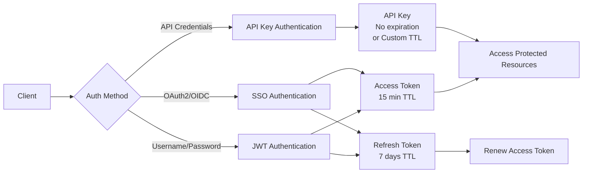
```mermaid
graph LR
    A[Client] --> B{Auth Method}

    B -->|Username/Password| C[JWT Authentication]
    B -->|OAuth2/OIDC| D[SSO Authentication]
    B -->|API Credentials| E[API Key Authentication]

    C --> F[Access Token<br/>15 min TTL]
    C --> G[Refresh Token<br/>7 days TTL]

    D --> F
    D --> G

    E --> H[API Key<br/>No expiration<br/>or Custom TTL]

    F --> I[Access Protected Resources]
    G --> J[Renew Access Token]
    H --> I
```

### JWT Authentication Flow

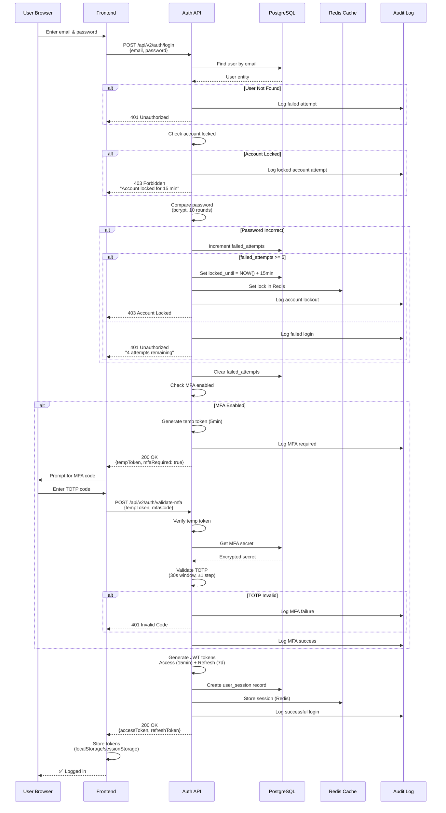
```mermaid
sequenceDiagram
    participant User as User Browser
    participant Frontend as Frontend
    participant API as Auth API
    participant DB as PostgreSQL
    participant Cache as Redis Cache
    participant Audit as Audit Log

    User->>Frontend: Enter email & password
    Frontend->>API: POST /api/v2/auth/login<br/>{email, password}

    API->>DB: Find user by email
    DB-->>API: User entity

    alt User Not Found
        API->>Audit: Log failed attempt
        API-->>Frontend: 401 Unauthorized
    end

    API->>API: Check account locked
    alt Account Locked
        API->>Audit: Log locked account attempt
        API-->>Frontend: 403 Forbidden<br/>"Account locked for 15 min"
    end

    API->>API: Compare password<br/>(bcrypt, 10 rounds)

    alt Password Incorrect
        API->>DB: Increment failed_attempts
        alt failed_attempts >= 5
            API->>DB: Set locked_until = NOW() + 15min
            API->>Cache: Set lock in Redis
            API->>Audit: Log account lockout
            API-->>Frontend: 403 Account Locked
        else
            API->>Audit: Log failed login
            API-->>Frontend: 401 Unauthorized<br/>"4 attempts remaining"
        end
    end

    API->>DB: Clear failed_attempts
    API->>API: Check MFA enabled

    alt MFA Enabled
        API->>API: Generate temp token (5min)
        API->>Audit: Log MFA required
        API-->>Frontend: 200 OK<br/>{tempToken, mfaRequired: true}

        Frontend->>User: Prompt for MFA code
        User->>Frontend: Enter TOTP code
        Frontend->>API: POST /api/v2/auth/validate-mfa<br/>{tempToken, mfaCode}

        API->>API: Verify temp token
        API->>DB: Get MFA secret
        DB-->>API: Encrypted secret
        API->>API: Validate TOTP<br/>(30s window, ±1 step)

        alt TOTP Invalid
            API->>Audit: Log MFA failure
            API-->>Frontend: 401 Invalid Code
        end

        API->>Audit: Log MFA success
    end

    API->>API: Generate JWT tokens<br/>Access (15min) + Refresh (7d)
    API->>DB: Create user_session record
    API->>Cache: Store session (Redis)
    API->>Audit: Log successful login

    API-->>Frontend: 200 OK<br/>{accessToken, refreshToken}
    Frontend->>Frontend: Store tokens<br/>(localStorage/sessionStorage)
    Frontend-->>User: ✅ Logged in
```

### Token Structure

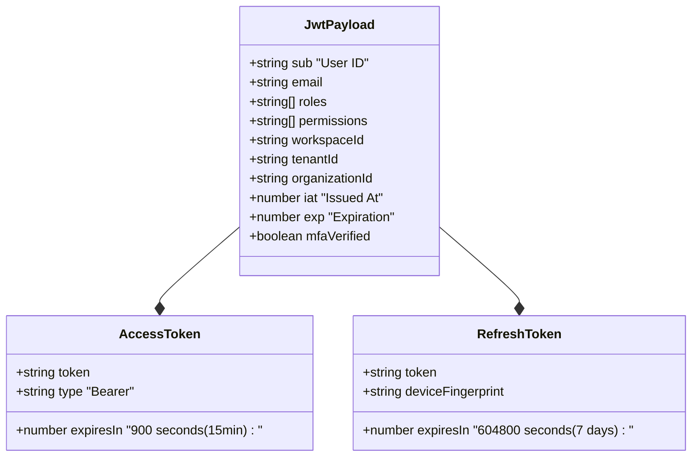
```mermaid
classDiagram
    class JwtPayload {
        +string sub "User ID"
        +string email
        +string[] roles
        +string[] permissions
        +string workspaceId
        +string tenantId
        +string organizationId
        +number iat "Issued At"
        +number exp "Expiration"
        +boolean mfaVerified
    }

    class AccessToken {
        +string token
        +number expiresIn "900 seconds (15min)"
        +string type "Bearer"
    }

    class RefreshToken {
        +string token
        +number expiresIn "604800 seconds (7 days)"
        +string deviceFingerprint
    }

    JwtPayload --* AccessToken
    JwtPayload --* RefreshToken
```

### Token Refresh Flow

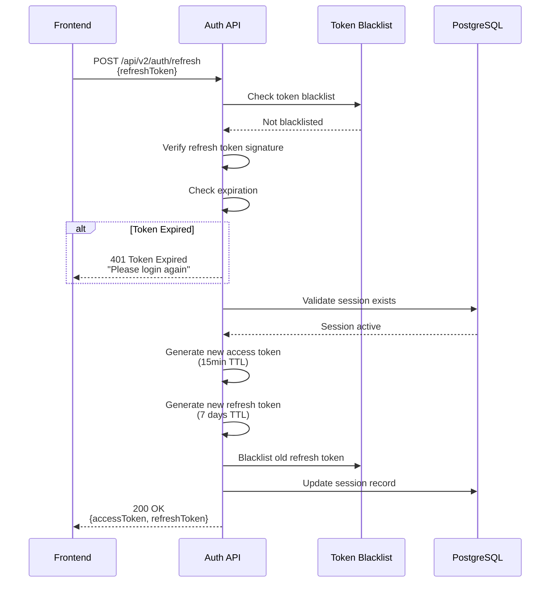
```mermaid
sequenceDiagram
    participant Frontend as Frontend
    participant API as Auth API
    participant Cache as Token Blacklist
    participant DB as PostgreSQL

    Frontend->>API: POST /api/v2/auth/refresh<br/>{refreshToken}

    API->>Cache: Check token blacklist
    Cache-->>API: Not blacklisted

    API->>API: Verify refresh token signature
    API->>API: Check expiration

    alt Token Expired
        API-->>Frontend: 401 Token Expired<br/>"Please login again"
    end

    API->>DB: Validate session exists
    DB-->>API: Session active

    API->>API: Generate new access token<br/>(15min TTL)
    API->>API: Generate new refresh token<br/>(7 days TTL)

    API->>Cache: Blacklist old refresh token
    API->>DB: Update session record

    API-->>Frontend: 200 OK<br/>{accessToken, refreshToken}
```

### Account Lockout State Machine

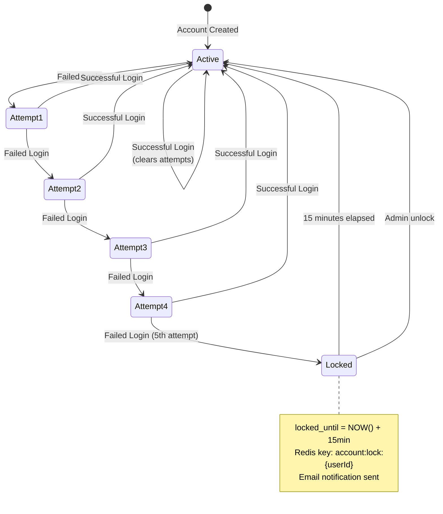
```mermaid
stateDiagram-v2
    [*] --> Active: Account Created

    Active --> Attempt1: Failed Login
    Attempt1 --> Attempt2: Failed Login
    Attempt2 --> Attempt3: Failed Login
    Attempt3 --> Attempt4: Failed Login
    Attempt4 --> Locked: Failed Login (5th attempt)

    Locked --> Active: 15 minutes elapsed
    Locked --> Active: Admin unlock

    Active --> Active: Successful Login<br/>(clears attempts)
    Attempt1 --> Active: Successful Login
    Attempt2 --> Active: Successful Login
    Attempt3 --> Active: Successful Login
    Attempt4 --> Active: Successful Login

    note right of Locked
        locked_until = NOW() + 15min
        Redis key: account:lock:{userId}
        Email notification sent
    end note
```

---

## Authorization & RBAC

### 5-Role Hierarchy

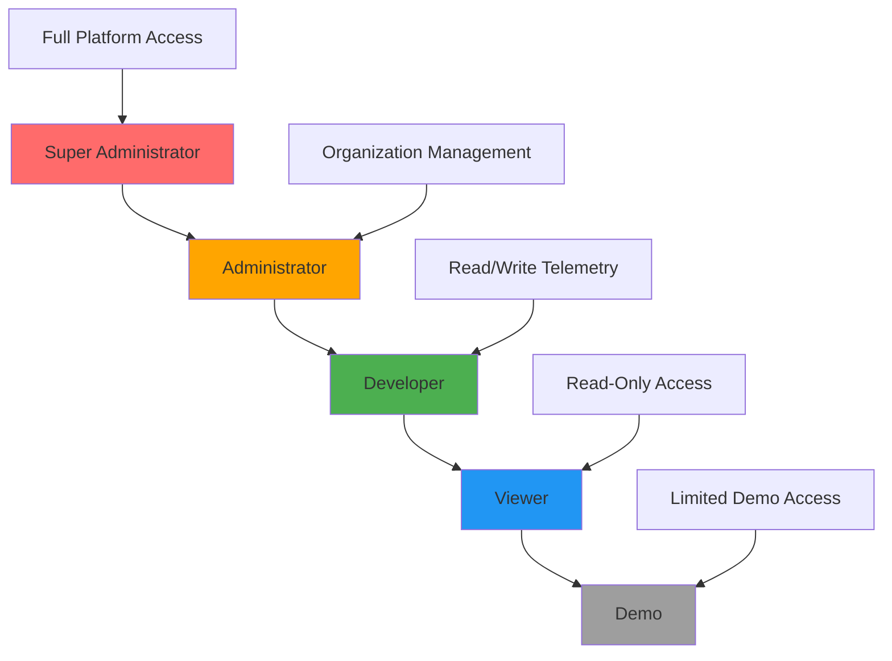
```mermaid
graph TD
    A[Super Administrator] --> B[Administrator]
    B --> C[Developer]
    C --> D[Viewer]
    D --> E[Demo]

    A1[Full Platform Access] --> A
    B1[Organization Management] --> B
    C1[Read/Write Telemetry] --> C
    D1[Read-Only Access] --> D
    E1[Limited Demo Access] --> E

    style A fill:#FF6B6B
    style B fill:#FFA500
    style C fill:#4CAF50
    style D fill:#2196F3
    style E fill:#9E9E9E
```

### Role Permissions Matrix

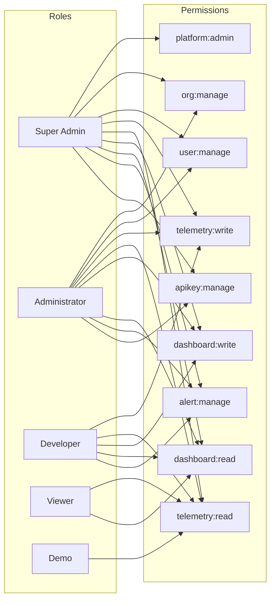
```mermaid
graph LR
    subgraph Roles
        R1[Super Admin]
        R2[Administrator]
        R3[Developer]
        R4[Viewer]
        R5[Demo]
    end

    subgraph Permissions
        P1[platform:admin]
        P2[org:manage]
        P3[user:manage]
        P4[telemetry:write]
        P5[telemetry:read]
        P6[dashboard:write]
        P7[dashboard:read]
        P8[alert:manage]
        P9[apikey:manage]
    end

    R1 --> P1
    R1 --> P2
    R1 --> P3
    R1 --> P4
    R1 --> P5
    R1 --> P6
    R1 --> P7
    R1 --> P8
    R1 --> P9

    R2 --> P2
    R2 --> P3
    R2 --> P4
    R2 --> P5
    R2 --> P6
    R2 --> P7
    R2 --> P8
    R2 --> P9

    R3 --> P4
    R3 --> P5
    R3 --> P6
    R3 --> P7
    R3 --> P8

    R4 --> P5
    R4 --> P7

    R5 --> P5
```

### RBAC Authorization Flow

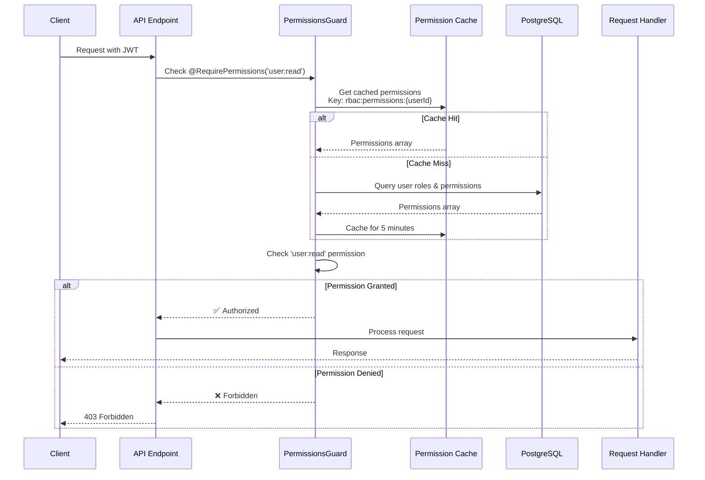
```mermaid
sequenceDiagram
    participant Client as Client
    participant API as API Endpoint
    participant Guard as PermissionsGuard
    participant Cache as Permission Cache
    participant DB as PostgreSQL
    participant Handler as Request Handler

    Client->>API: Request with JWT
    API->>Guard: Check @RequirePermissions('user:read')

    Guard->>Cache: Get cached permissions<br/>Key: rbac:permissions:{userId}

    alt Cache Hit
        Cache-->>Guard: Permissions array
    else Cache Miss
        Guard->>DB: Query user roles & permissions
        DB-->>Guard: Permissions array
        Guard->>Cache: Cache for 5 minutes
    end

    Guard->>Guard: Check 'user:read' permission

    alt Permission Granted
        Guard-->>API: ✅ Authorized
        API->>Handler: Process request
        Handler-->>Client: Response
    else Permission Denied
        Guard-->>API: ❌ Forbidden
        API-->>Client: 403 Forbidden
    end
```

### Permission Computation

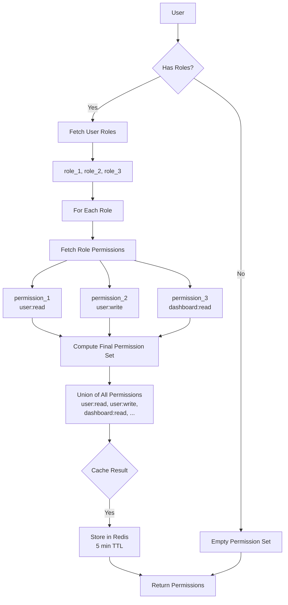
```mermaid
flowchart TD
    A[User] --> B{Has Roles?}

    B -->|Yes| C[Fetch User Roles]
    C --> D[role_1, role_2, role_3]

    D --> E[For Each Role]
    E --> F[Fetch Role Permissions]

    F --> G[permission_1<br/>user:read]
    F --> H[permission_2<br/>user:write]
    F --> I[permission_3<br/>dashboard:read]

    G --> J[Compute Final Permission Set]
    H --> J
    I --> J

    J --> K[Union of All Permissions<br/>user:read, user:write,<br/>dashboard:read, ...]

    K --> L{Cache Result}
    L -->|Yes| M[Store in Redis<br/>5 min TTL]
    M --> N[Return Permissions]

    B -->|No| O[Empty Permission Set]
    O --> N
```

---

## API Key Authentication

### API Key Format

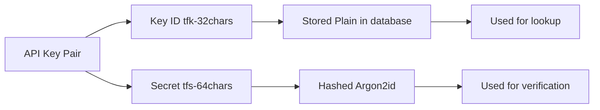
```mermaid
graph LR
    A[API Key Pair] --> B[Key ID tfk-32chars]
    A --> C[Secret tfs-64chars]

    B --> D[Stored Plain in database]
    C --> E[Hashed Argon2id]

    D --> F[Used for lookup]
    E --> G[Used for verification]
```

### API Key Lifecycle

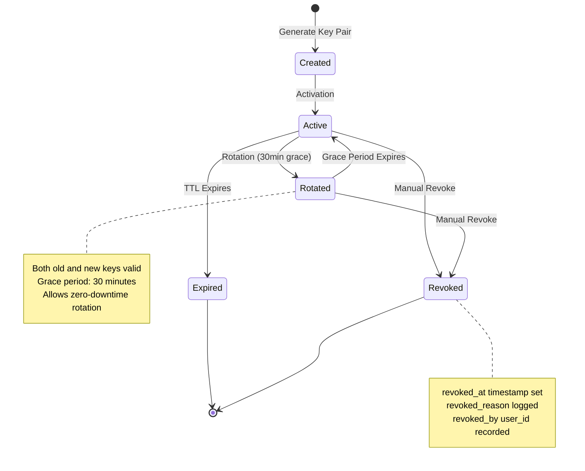
```mermaid
stateDiagram-v2
    [*] --> Created: Generate Key Pair

    Created --> Active: Activation
    Active --> Rotated: Rotation (30min grace)
    Rotated --> Active: Grace Period Expires
    Active --> Revoked: Manual Revoke
    Active --> Expired: TTL Expires
    Rotated --> Revoked: Manual Revoke
    Expired --> [*]
    Revoked --> [*]

    note right of Rotated
        Both old and new keys valid
        Grace period: 30 minutes
        Allows zero-downtime rotation
    end note

    note right of Revoked
        revoked_at timestamp set
        revoked_reason logged
        revoked_by user_id recorded
    end note
```

### API Key Authentication Flow

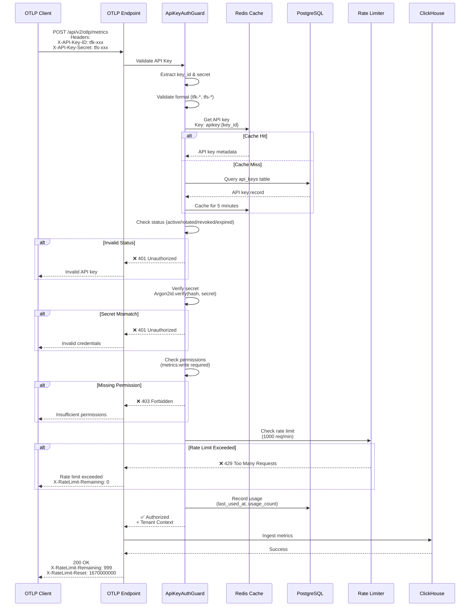
```mermaid
sequenceDiagram
    participant Client as OTLP Client
    participant API as OTLP Endpoint
    participant Guard as ApiKeyAuthGuard
    participant Cache as Redis Cache
    participant DB as PostgreSQL
    participant RL as Rate Limiter
    participant CH as ClickHouse

    Client->>API: POST /api/v2/otlp/metrics<br/>Headers:<br/>X-API-Key-ID: tfk-xxx<br/>X-API-Key-Secret: tfs-xxx

    API->>Guard: Validate API Key

    Guard->>Guard: Extract key_id & secret
    Guard->>Guard: Validate format (tfk-*, tfs-*)

    Guard->>Cache: Get API key<br/>Key: apikey:{key_id}

    alt Cache Hit
        Cache-->>Guard: API key metadata
    else Cache Miss
        Guard->>DB: Query api_keys table
        DB-->>Guard: API key record
        Guard->>Cache: Cache for 5 minutes
    end

    Guard->>Guard: Check status (active/rotated/revoked/expired)

    alt Invalid Status
        Guard-->>API: ❌ 401 Unauthorized
        API-->>Client: Invalid API key
    end

    Guard->>Guard: Verify secret<br/>Argon2id.verify(hash, secret)

    alt Secret Mismatch
        Guard-->>API: ❌ 401 Unauthorized
        API-->>Client: Invalid credentials
    end

    Guard->>Guard: Check permissions<br/>(metrics:write required)

    alt Missing Permission
        Guard-->>API: ❌ 403 Forbidden
        API-->>Client: Insufficient permissions
    end

    Guard->>RL: Check rate limit<br/>(1000 req/min)

    alt Rate Limit Exceeded
        RL-->>API: ❌ 429 Too Many Requests
        API-->>Client: Rate limit exceeded<br/>X-RateLimit-Remaining: 0
    end

    Guard->>DB: Record usage<br/>(last_used_at, usage_count)

    Guard-->>API: ✅ Authorized<br/>+ Tenant Context

    API->>CH: Ingest metrics
    CH-->>API: Success

    API-->>Client: 200 OK<br/>X-RateLimit-Remaining: 999<br/>X-RateLimit-Reset: 1670000000
```

### API Key Permissions

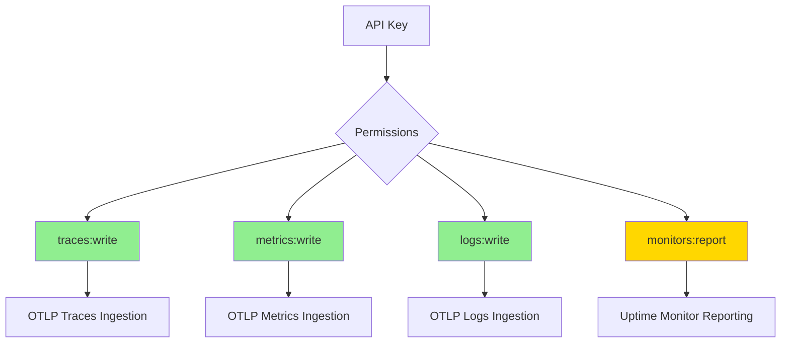
```mermaid
graph TD
    A[API Key] --> B{Permissions}

    B --> C[traces:write]
    B --> D[metrics:write]
    B --> E[logs:write]
    B --> F[monitors:report]

    C --> G[OTLP Traces Ingestion]
    D --> H[OTLP Metrics Ingestion]
    E --> I[OTLP Logs Ingestion]
    F --> J[Uptime Monitor Reporting]

    style C fill:#90EE90
    style D fill:#90EE90
    style E fill:#90EE90
    style F fill:#FFD700
```

---

## Multi-Factor Authentication

### MFA Setup Flow

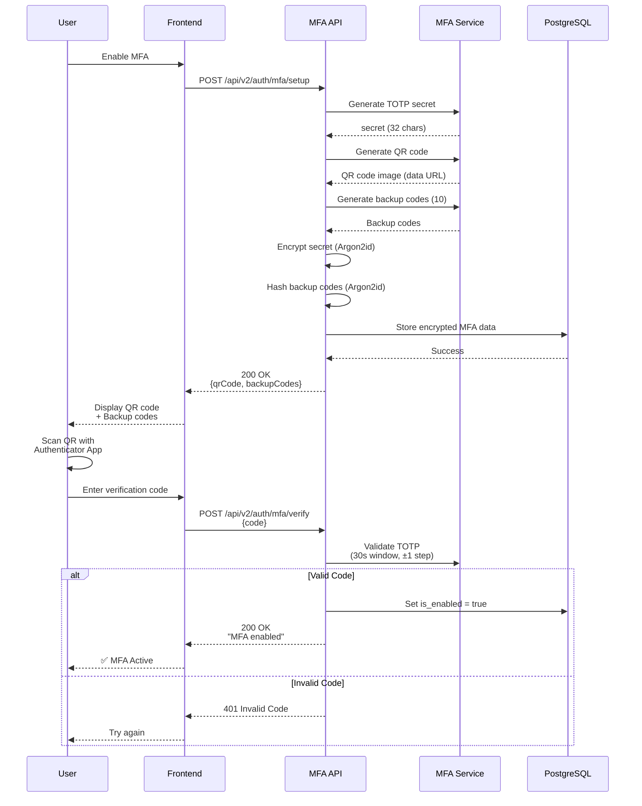
```mermaid
sequenceDiagram
    participant User as User
    participant Frontend as Frontend
    participant API as MFA API
    participant MFA as MFA Service
    participant DB as PostgreSQL

    User->>Frontend: Enable MFA
    Frontend->>API: POST /api/v2/auth/mfa/setup

    API->>MFA: Generate TOTP secret
    MFA-->>API: secret (32 chars)

    API->>MFA: Generate QR code
    MFA-->>API: QR code image (data URL)

    API->>MFA: Generate backup codes (10)
    MFA-->>API: Backup codes

    API->>API: Encrypt secret (Argon2id)
    API->>API: Hash backup codes (Argon2id)

    API->>DB: Store encrypted MFA data
    DB-->>API: Success

    API-->>Frontend: 200 OK<br/>{qrCode, backupCodes}
    Frontend-->>User: Display QR code<br/>+ Backup codes

    User->>User: Scan QR with<br/>Authenticator App

    User->>Frontend: Enter verification code
    Frontend->>API: POST /api/v2/auth/mfa/verify<br/>{code}

    API->>MFA: Validate TOTP<br/>(30s window, ±1 step)

    alt Valid Code
        API->>DB: Set is_enabled = true
        API-->>Frontend: 200 OK<br/>"MFA enabled"
        Frontend-->>User: ✅ MFA Active
    else Invalid Code
        API-->>Frontend: 401 Invalid Code
        Frontend-->>User: Try again
    end
```

### MFA Login State Machine

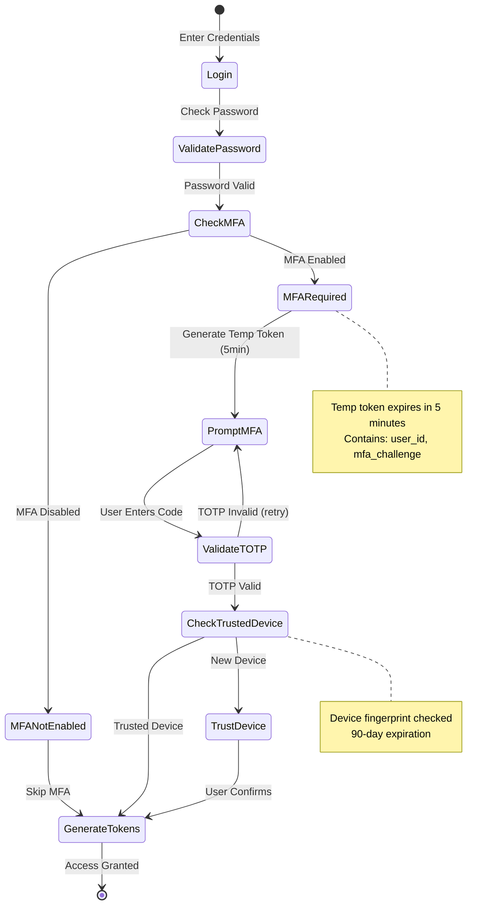
```mermaid
stateDiagram-v2
    [*] --> Login: Enter Credentials

    Login --> ValidatePassword: Check Password

    ValidatePassword --> CheckMFA: Password Valid

    CheckMFA --> MFANotEnabled: MFA Disabled
    CheckMFA --> MFARequired: MFA Enabled

    MFANotEnabled --> GenerateTokens: Skip MFA
    MFARequired --> PromptMFA: Generate Temp Token (5min)

    PromptMFA --> ValidateTOTP: User Enters Code

    ValidateTOTP --> CheckTrustedDevice: TOTP Valid
    ValidateTOTP --> PromptMFA: TOTP Invalid (retry)

    CheckTrustedDevice --> GenerateTokens: Trusted Device
    CheckTrustedDevice --> TrustDevice: New Device

    TrustDevice --> GenerateTokens: User Confirms

    GenerateTokens --> [*]: Access Granted

    note right of MFARequired
        Temp token expires in 5 minutes
        Contains: user_id, mfa_challenge
    end note

    note right of CheckTrustedDevice
        Device fingerprint checked
        90-day expiration
    end note
```

### TOTP Validation

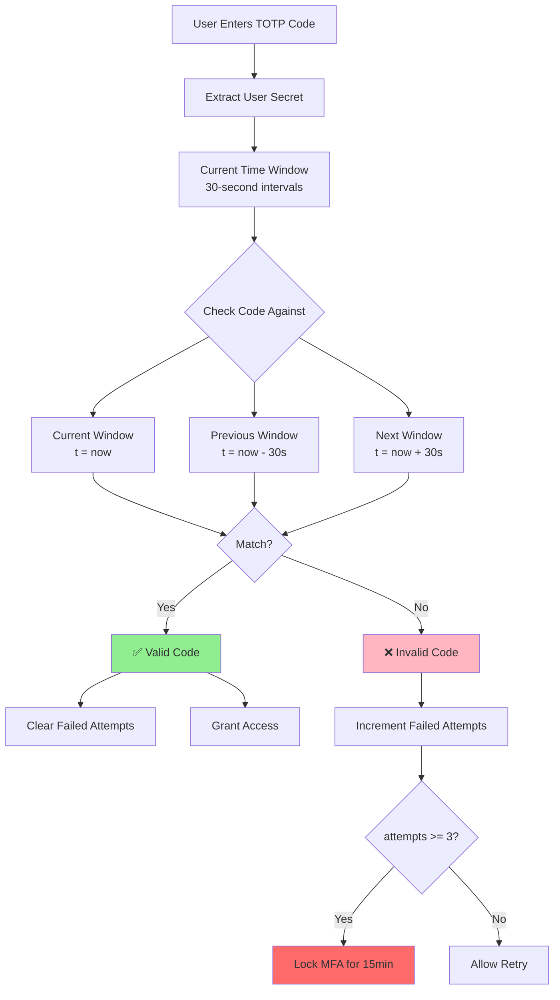
```mermaid
flowchart TD
    A[User Enters TOTP Code] --> B[Extract User Secret]
    B --> C[Current Time Window<br/>30-second intervals]

    C --> D{Check Code Against}

    D --> E[Current Window<br/>t = now]
    D --> F[Previous Window<br/>t = now - 30s]
    D --> G[Next Window<br/>t = now + 30s]

    E --> H{Match?}
    F --> H
    G --> H

    H -->|Yes| I[✅ Valid Code]
    H -->|No| J[❌ Invalid Code]

    I --> K[Clear Failed Attempts]
    I --> L[Grant Access]

    J --> M[Increment Failed Attempts]
    M --> N{attempts >= 3?}
    N -->|Yes| O[Lock MFA for 15min]
    N -->|No| P[Allow Retry]

    style I fill:#90EE90
    style J fill:#FFB6C1
    style O fill:#FF6B6B
```

---

## Single Sign-On

### SSO Providers Supported

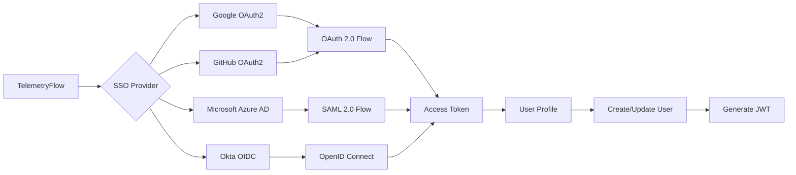
```mermaid
graph LR
    A[TelemetryFlow] --> B{SSO Provider}

    B --> C[Google OAuth2]
    B --> D[GitHub OAuth2]
    B --> E[Microsoft Azure AD]
    B --> F[Okta OIDC]

    C --> G[OAuth 2.0 Flow]
    D --> G
    E --> H[SAML 2.0 Flow]
    F --> I[OpenID Connect]

    G --> J[Access Token]
    H --> J
    I --> J

    J --> K[User Profile]
    K --> L[Create/Update User]
    L --> M[Generate JWT]
```

### OAuth2 SSO Flow (Google/GitHub)

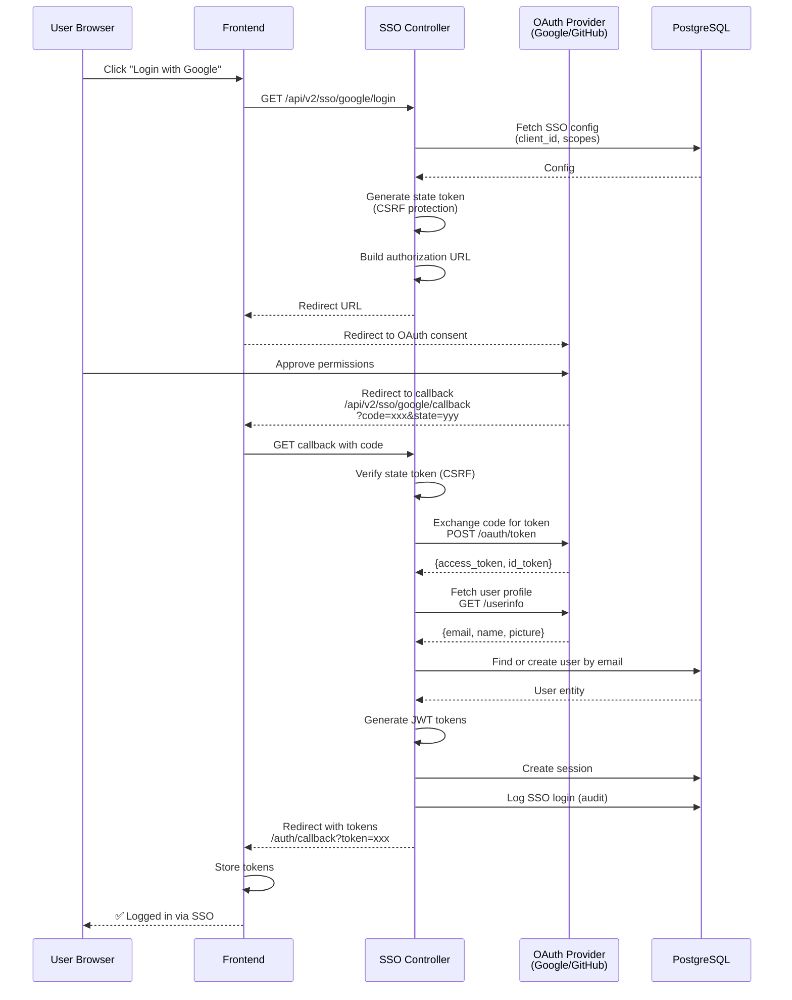
```mermaid
sequenceDiagram
    participant User as User Browser
    participant Frontend as Frontend
    participant Backend as SSO Controller
    participant Provider as OAuth Provider<br/>(Google/GitHub)
    participant DB as PostgreSQL

    User->>Frontend: Click "Login with Google"
    Frontend->>Backend: GET /api/v2/sso/google/login

    Backend->>DB: Fetch SSO config<br/>(client_id, scopes)
    DB-->>Backend: Config

    Backend->>Backend: Generate state token<br/>(CSRF protection)
    Backend->>Backend: Build authorization URL

    Backend-->>Frontend: Redirect URL
    Frontend-->>Provider: Redirect to OAuth consent

    User->>Provider: Approve permissions
    Provider-->>Frontend: Redirect to callback<br/>/api/v2/sso/google/callback<br/>?code=xxx&state=yyy

    Frontend->>Backend: GET callback with code

    Backend->>Backend: Verify state token (CSRF)

    Backend->>Provider: Exchange code for token<br/>POST /oauth/token
    Provider-->>Backend: {access_token, id_token}

    Backend->>Provider: Fetch user profile<br/>GET /userinfo
    Provider-->>Backend: {email, name, picture}

    Backend->>DB: Find or create user by email
    DB-->>Backend: User entity

    Backend->>Backend: Generate JWT tokens
    Backend->>DB: Create session
    Backend->>DB: Log SSO login (audit)

    Backend-->>Frontend: Redirect with tokens<br/>/auth/callback?token=xxx
    Frontend->>Frontend: Store tokens
    Frontend-->>User: ✅ Logged in via SSO
```

### SSO Configuration

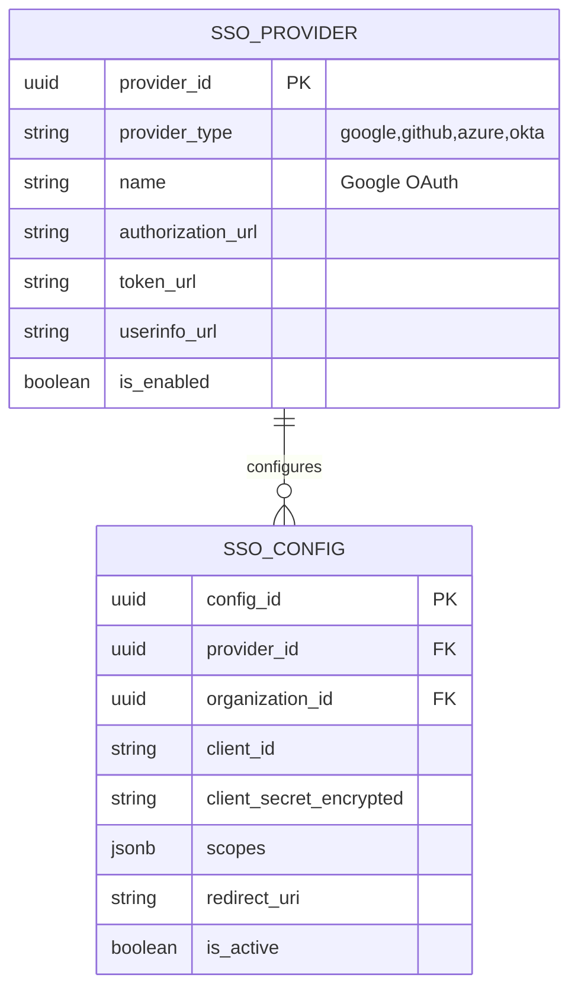
```mermaid
erDiagram
    SSO_PROVIDER ||--o{ SSO_CONFIG : configures

    SSO_PROVIDER {
        uuid provider_id PK
        string provider_type "google,github,azure,okta"
        string name "Google OAuth"
        string authorization_url
        string token_url
        string userinfo_url
        boolean is_enabled
    }

    SSO_CONFIG {
        uuid config_id PK
        uuid provider_id FK
        uuid organization_id FK
        string client_id
        string client_secret_encrypted
        jsonb scopes
        string redirect_uri
        boolean is_active
    }
```

---

## Audit Logging

### Audit Log Structure

```mermaid
erDiagram
    USER ||--o{ AUDIT_LOG : generates
    AUDIT_LOG {
        uuid audit_id PK
        uuid user_id FK
        uuid workspace_id FK
        uuid tenant_id FK
        datetime timestamp
        string action "login,logout,create,update,delete"
        string resource_type "user,dashboard,alert,apikey"
        string resource_id
        string ip_address
        string user_agent
        string result "success,failure,error"
        jsonb metadata
        string request_method "GET,POST,PUT,DELETE"
        string request_path
        int response_status
        int duration_ms
    }
```

### Audit Event Flow

```mermaid
sequenceDiagram
    participant User as User Action
    participant API as API Controller
    participant Handler as Command Handler
    participant Service as Domain Service
    participant DB as PostgreSQL
    participant CH as ClickHouse Audit

    User->>API: Request (e.g., Create Dashboard)
    API->>Handler: Dispatch command

    Handler->>Service: Execute business logic
    Service->>DB: Update/Insert data
    DB-->>Service: Success

    Service->>Service: Generate AuditLog event
    Note over Service: Immutable aggregate<br/>Records: who, what, when, where

    Service->>CH: Write to audit_logs table
    CH-->>Service: Acknowledged

    Service-->>Handler: Command result
    Handler-->>API: Success
    API-->>User: 200 OK

    Note over CH: Audit logs retained<br/>for 365 days (compliance)
```

### Audited Actions

```mermaid
mindmap
    root((Audit Events))
        Authentication
            login
            logout
            mfa_required
            mfa_complete
            password_change
            account_locked
            sso_login
        IAM
            user_created
            user_updated
            user_deleted
            role_assigned
            permission_granted
            workspace_created
            tenant_created
        Telemetry
            metrics_ingested
            logs_ingested
            traces_ingested
            data_queried
        Configuration
            dashboard_created
            dashboard_updated
            alert_rule_created
            alert_triggered
            apikey_created
            apikey_rotated
            apikey_revoked
        Admin
            cache_cleared
            queue_purged
            data_exported
            retention_applied
```

---

## Security Best Practices

### Password Policy

```mermaid
graph TD
    A[Password Requirements] --> B[Minimum Length: 12]
    A --> C[Uppercase: Required]
    A --> D[Lowercase: Required]
    A --> E[Numbers: Required]
    A --> F[Special Chars: Required]
    A --> G[History: Last 5 passwords]

    B --> H[Strength Calculator]
    C --> H
    D --> H
    E --> H
    F --> H

    H --> I{Score >= 60?}
    I -->|Yes| J[✅ Strong Password]
    I -->|No| K[❌ Weak Password<br/>Provide Suggestions]

    style J fill:#90EE90
    style K fill:#FFB6C1
```

### Session Management

```mermaid
stateDiagram-v2
    [*] --> Active: Login Success

    Active --> Active: Request within TTL
    Active --> Expired: 15 min idle (access token)
    Active --> Revoked: Manual logout
    Active --> Revoked: Password change
    Active --> Revoked: Admin action

    Expired --> Refreshed: Refresh token valid
    Refreshed --> Active: New access token

    Expired --> [*]: Refresh token expired
    Revoked --> [*]: Session terminated

    note right of Revoked
        Token added to blacklist
        Redis key: blacklist:{token}
        TTL: remaining token lifetime
    end note
```

### Rate Limiting

| Endpoint Type | Rate Limit | Window |
|---------------|------------|--------|
| **Login** | 5 attempts | 15 min |
| **API (Default)** | 100 req | 60 sec |
| **OTLP Ingestion** | 1000 req | 60 sec |
| **Query API** | 60 req | 60 sec |
| **Admin API** | 30 req | 60 sec |

---

## Security Checklist

- [x] **Authentication**
  - [x] JWT with RS256 (asymmetric encryption)
  - [x] Refresh token rotation
  - [x] Token blacklist on logout
  - [x] MFA with TOTP (30s window)
  - [x] Backup codes (Argon2id hashed)
  - [x] Account lockout (5 attempts, 15min)

- [x] **Authorization**
  - [x] 5-role RBAC system
  - [x] Permission-based access control
  - [x] Tenant context validation
  - [x] Cross-tenant access prevention

- [x] **API Security**
  - [x] API key authentication (Argon2id)
  - [x] Rate limiting per key (1000 req/min)
  - [x] Key rotation with grace period (30min)
  - [x] Permission scoping (traces:write, etc.)

- [x] **Data Protection**
  - [x] TLS/HTTPS encryption in transit
  - [x] Argon2id password hashing (64MB, 3 iterations)
  - [x] Encrypted secrets at rest (AES-256)
  - [x] Database encryption (PostgreSQL + ClickHouse)

- [x] **Compliance**
  - [x] Audit logging (365-day retention)
  - [x] GDPR data portability
  - [x] SOC 2 controls
  - [x] ISO 27001 alignment

---

## Next Steps

- [Multi-Tenancy Architecture](./03-MULTI-TENANCY.md)
- [Performance Optimizations](./05-PERFORMANCE.md)
- [API Reference](../shared/API-REFERENCE.md)
- [Database Schema](../shared/DATABASE-SCHEMA.md)

---

- **Last Updated:** December 12, 2025
- **Maintained By:** DevOpsCorner Indonesia
