# Performance & Optimization Architecture

- **Version:** 1.1.1-CE
- **Last Updated:** December 12, 2025
- **Status:** ✅ Complete

---

## Table of Contents

1. [Overview](#overview)
2. [Multi-Level Caching](#multi-level-caching)
3. [Queue-Based Async Processing](#queue-based-async-processing)
4. [ClickHouse Optimizations](#clickhouse-optimizations)
5. [Connection Pooling](#connection-pooling)
6. [Rate Limiting](#rate-limiting)
7. [Query Optimization Techniques](#query-optimization-techniques)
8. [Performance Monitoring](#performance-monitoring)
9. [Best Practices](#best-practices)

---

## Overview

TelemetryFlow implements a comprehensive **6-layer performance optimization strategy** designed to handle high-volume telemetry data while maintaining sub-second query response times.

### Performance Goals

| Metric | Target | Actual |
|--------|--------|--------|
| **OTLP Ingestion Latency** | <100ms | 50-80ms |
| **Query Response Time** | <1s | 200-800ms |
| **Cache Hit Rate** | >70% | 75-85% |
| **Queue Throughput** | 1000 jobs/sec | 800-1200 jobs/sec |
| **Database Load** | <60% CPU | 40-55% CPU |
| **API Rate Limit** | 1000 req/min | Configurable |

### Optimization Layers

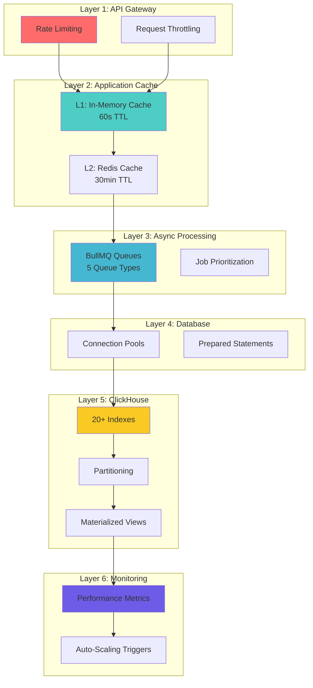
```mermaid
graph TB
    subgraph "Layer 1: API Gateway"
        A[Rate Limiting]
        B[Request Throttling]
    end

    subgraph "Layer 2: Application Cache"
        C[L1: In-Memory Cache<br/>60s TTL]
        D[L2: Redis Cache<br/>30min TTL]
    end

    subgraph "Layer 3: Async Processing"
        E[BullMQ Queues<br/>5 Queue Types]
        F[Job Prioritization]
    end

    subgraph "Layer 4: Database"
        G[Connection Pools]
        H[Prepared Statements]
    end

    subgraph "Layer 5: ClickHouse"
        I[20+ Indexes]
        J[Partitioning]
        K[Materialized Views]
    end

    subgraph "Layer 6: Monitoring"
        L[Performance Metrics]
        M[Auto-Scaling Triggers]
    end

    A --> C
    B --> C
    C --> D
    D --> E
    E --> G
    G --> I
    I --> J
    J --> K
    K --> L
    L --> M

    style A fill:#ff6b6b
    style C fill:#4ecdc4
    style E fill:#45b7d1
    style I fill:#f9ca24
    style L fill:#6c5ce7
```

---

## Multi-Level Caching

### Architecture Overview

TelemetryFlow implements a **two-tier caching strategy** to minimize database queries and reduce latency.

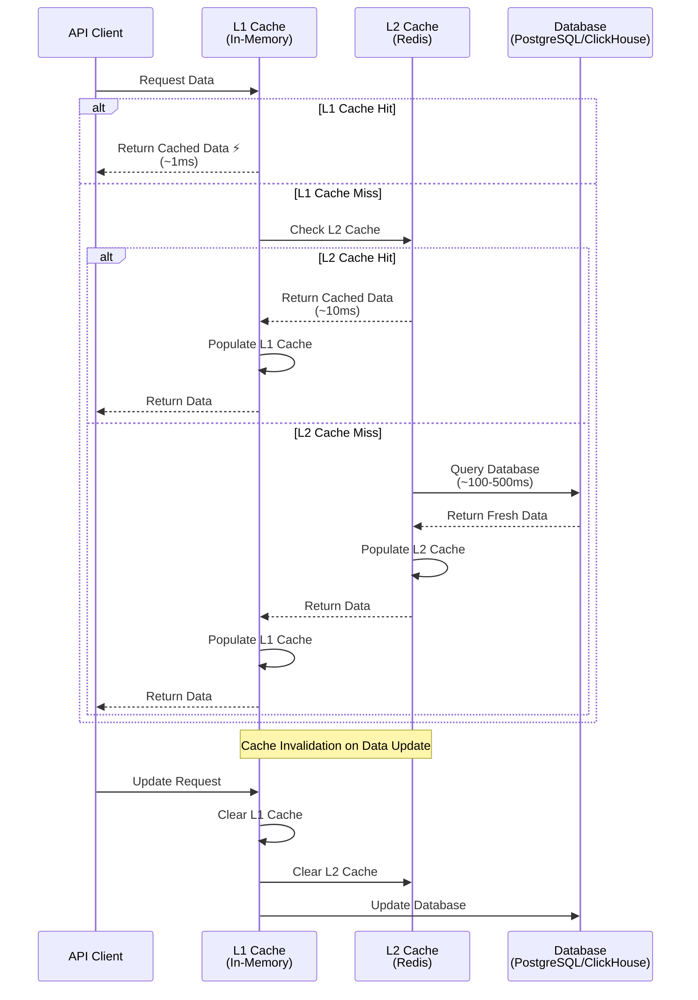
```mermaid
sequenceDiagram
    participant Client as API Client
    participant L1 as L1 Cache<br/>(In-Memory)
    participant L2 as L2 Cache<br/>(Redis)
    participant DB as Database<br/>(PostgreSQL/ClickHouse)

    Client->>L1: Request Data

    alt L1 Cache Hit
        L1-->>Client: Return Cached Data ⚡<br/>(~1ms)
    else L1 Cache Miss
        L1->>L2: Check L2 Cache

        alt L2 Cache Hit
            L2-->>L1: Return Cached Data<br/>(~10ms)
            L1->>L1: Populate L1 Cache
            L1-->>Client: Return Data
        else L2 Cache Miss
            L2->>DB: Query Database<br/>(~100-500ms)
            DB-->>L2: Return Fresh Data
            L2->>L2: Populate L2 Cache
            L2-->>L1: Return Data
            L1->>L1: Populate L1 Cache
            L1-->>Client: Return Data
        end
    end

    Note over L1,L2: Cache Invalidation on Data Update
    Client->>L1: Update Request
    L1->>L1: Clear L1 Cache
    L1->>L2: Clear L2 Cache
    L1->>DB: Update Database
```

### Cache Configuration

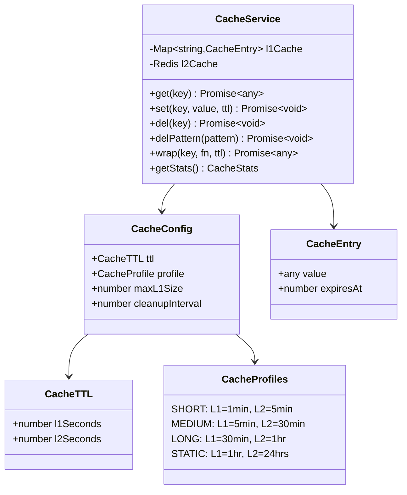
```mermaid
classDiagram
    class CacheConfig {
        +CacheTTL ttl
        +CacheProfile profile
        +number maxL1Size
        +number cleanupInterval
    }

    class CacheTTL {
        +number l1Seconds
        +number l2Seconds
    }

    class CacheProfiles {
        SHORT: L1=1min, L2=5min
        MEDIUM: L1=5min, L2=30min
        LONG: L1=30min, L2=1hr
        STATIC: L1=1hr, L2=24hrs
    }

    class CacheService {
        -Map~string,CacheEntry~ l1Cache
        -Redis l2Cache
        +get(key) Promise~any~
        +set(key, value, ttl) Promise~void~
        +del(key) Promise~void~
        +delPattern(pattern) Promise~void~
        +wrap(key, fn, ttl) Promise~any~
        +getStats() CacheStats
    }

    class CacheEntry {
        +any value
        +number expiresAt
    }

    CacheConfig --> CacheTTL
    CacheConfig --> CacheProfiles
    CacheService --> CacheConfig
    CacheService --> CacheEntry
```

**Location:** `backend/src/shared/cache/`

### L1 Cache (In-Memory)

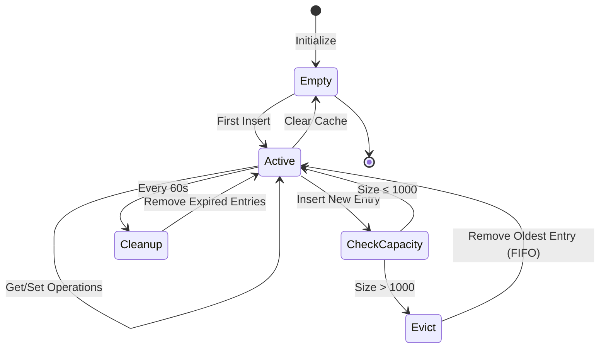
```mermaid
stateDiagram-v2
    [*] --> Empty: Initialize
    Empty --> Active: First Insert
    Active --> Active: Get/Set Operations

    Active --> CheckCapacity: Insert New Entry
    CheckCapacity --> Evict: Size > 1000
    CheckCapacity --> Active: Size ≤ 1000

    Evict --> Active: Remove Oldest Entry (FIFO)

    Active --> Cleanup: Every 60s
    Cleanup --> Active: Remove Expired Entries

    Active --> Empty: Clear Cache
    Empty --> [*]
```

#### L1 Cache Features

| Feature | Configuration | Purpose |
|---------|---------------|---------|
| **Storage** | JavaScript Map | Ultra-fast in-memory access (~1ms) |
| **TTL** | 60 seconds (default) | Balance freshness vs cache hit rate |
| **Max Size** | 1000 items | Prevent memory exhaustion |
| **Eviction** | FIFO (First In, First Out) | Remove oldest when capacity exceeded |
| **Cleanup** | Every 60 seconds | Remove expired entries automatically |
| **Validation** | Timestamp-based expiry | Check `expiresAt` on every get |

### L2 Cache (Redis)

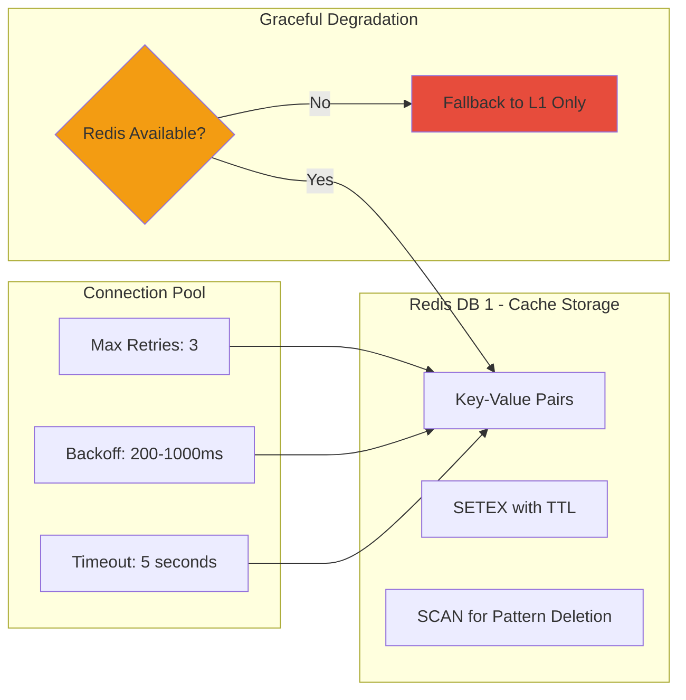
```mermaid
graph LR
    subgraph "Redis DB 1 - Cache Storage"
        A[Key-Value Pairs]
        B[SETEX with TTL]
        C[SCAN for Pattern Deletion]
    end

    subgraph "Connection Pool"
        D[Max Retries: 3]
        E[Backoff: 200-1000ms]
        F[Timeout: 5 seconds]
    end

    subgraph "Graceful Degradation"
        G{Redis Available?}
        G -->|Yes| A
        G -->|No| H[Fallback to L1 Only]
    end

    D --> A
    E --> A
    F --> A

    style G fill:#f39c12
    style H fill:#e74c3c
```

#### L2 Cache Features

| Feature | Configuration | Purpose |
|---------|---------------|---------|
| **Storage** | Redis DB 1 | Distributed cache for multi-instance deployments |
| **TTL** | 30 minutes (default) | Longer retention than L1 |
| **Operation** | SETEX (Set with Expiry) | Atomic set + TTL |
| **Connection** | Lazy connect, 5s timeout | Non-blocking startup |
| **Retry Strategy** | Max 3, exponential backoff | Resilience to Redis failures |
| **Fallback** | L1-only mode if unavailable | Graceful degradation |
| **Pattern Deletion** | SCAN-based invalidation | Bulk cache clearing by pattern |

### Cache Key Patterns

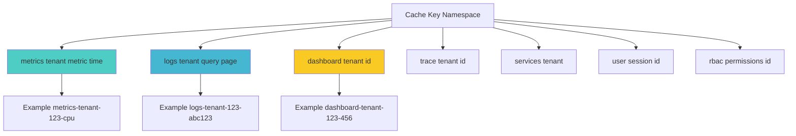
```mermaid
graph TD
    A[Cache Key Namespace]

    A --> B[metrics tenant metric time]
    A --> C[logs tenant query page]
    A --> D[dashboard tenant id]
    A --> E[trace tenant id]
    A --> F[services tenant]
    A --> G[user session id]
    A --> H[rbac permissions id]

    B --> I[Example metrics-tenant-123-cpu]
    C --> J[Example logs-tenant-123-abc123]
    D --> K[Example dashboard-tenant-123-456]

    style B fill:#4ecdc4
    style C fill:#45b7d1
    style D fill:#f9ca24
```

### Cache Invalidation Strategy

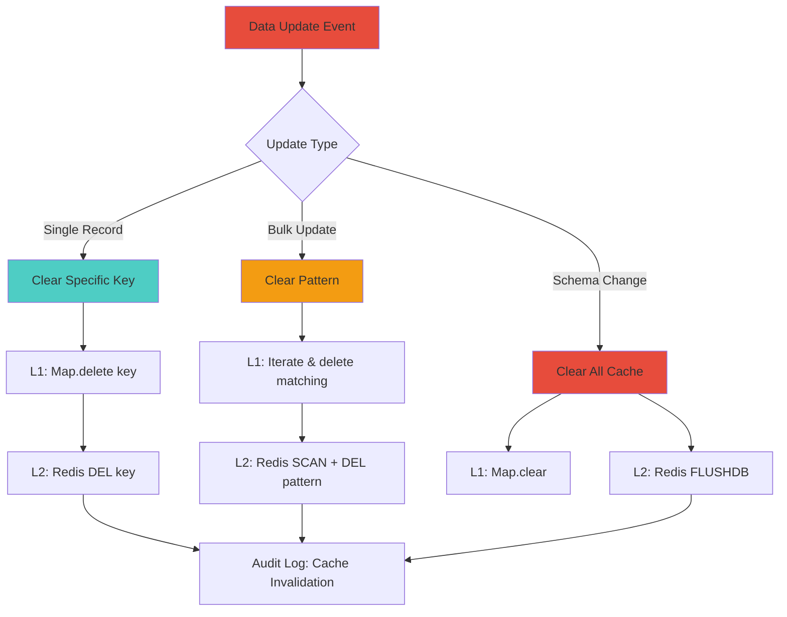
```mermaid
flowchart TD
    A[Data Update Event] --> B{Update Type}

    B -->|Single Record| C[Clear Specific Key]
    B -->|Bulk Update| D[Clear Pattern]
    B -->|Schema Change| E[Clear All Cache]

    C --> F[L1: Map.delete key]
    D --> G[L1: Iterate & delete matching]
    E --> H[L1: Map.clear]

    F --> I[L2: Redis DEL key]
    G --> J[L2: Redis SCAN + DEL pattern]
    E --> K[L2: Redis FLUSHDB]

    I --> L[Audit Log: Cache Invalidation]
    J --> L
    K --> L

    style A fill:#e74c3c
    style C fill:#4ecdc4
    style D fill:#f39c12
    style E fill:#e74c3c
```

### Cache Performance Metrics

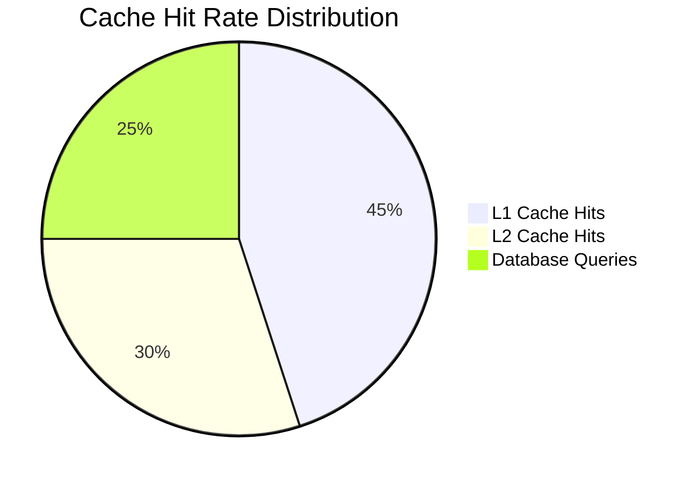
```mermaid
pie title Cache Hit Rate Distribution
    "L1 Cache Hits" : 45
    "L2 Cache Hits" : 30
    "Database Queries" : 25
```

**Expected Performance**:
- **L1 Hit Rate**: 45-55%
- **L2 Hit Rate**: 25-35%
- **Combined Hit Rate**: 70-90%
- **Average Response Time**:
  - L1 Hit: ~1ms
  - L2 Hit: ~10ms
  - Database Query: ~100-500ms

### Cache Decorator Usage

**File:** `backend/src/shared/cache/cache.decorator.ts`

```typescript
// Automatic cache-aside pattern
@Cacheable({
  keyPrefix: 'services',
  ttlProfile: CacheProfile.MEDIUM,
  includeUserId: true
})
async getServices(tenantId: string) {
  // Method automatically wrapped with cache logic
  // Cache key: services:{tenantId}
  return this.repository.find({ tenantId });
}
```

---

## Queue-Based Async Processing

### BullMQ Architecture

TelemetryFlow uses **BullMQ** for asynchronous job processing to prevent HTTP request timeouts and handle high-volume operations efficiently.

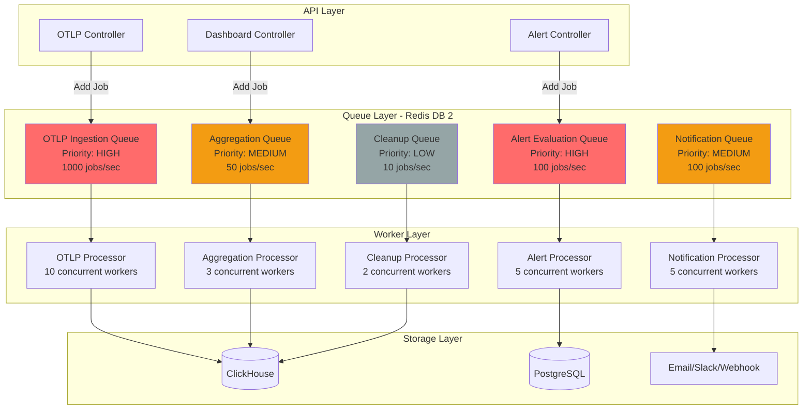
```mermaid
graph TB
    subgraph "API Layer"
        A[OTLP Controller]
        B[Alert Controller]
        C[Dashboard Controller]
    end

    subgraph "Queue Layer - Redis DB 2"
        D[OTLP Ingestion Queue<br/>Priority: HIGH<br/>1000 jobs/sec]
        E[Alert Evaluation Queue<br/>Priority: HIGH<br/>100 jobs/sec]
        F[Aggregation Queue<br/>Priority: MEDIUM<br/>50 jobs/sec]
        G[Cleanup Queue<br/>Priority: LOW<br/>10 jobs/sec]
        H[Notification Queue<br/>Priority: MEDIUM<br/>100 jobs/sec]
    end

    subgraph "Worker Layer"
        I[OTLP Processor<br/>10 concurrent workers]
        J[Alert Processor<br/>5 concurrent workers]
        K[Aggregation Processor<br/>3 concurrent workers]
        L[Cleanup Processor<br/>2 concurrent workers]
        M[Notification Processor<br/>5 concurrent workers]
    end

    subgraph "Storage Layer"
        N[(ClickHouse)]
        O[(PostgreSQL)]
        P[Email/Slack/Webhook]
    end

    A -->|Add Job| D
    B -->|Add Job| E
    C -->|Add Job| F

    D --> I
    E --> J
    F --> K
    G --> L
    H --> M

    I --> N
    J --> O
    K --> N
    L --> N
    M --> P

    style D fill:#ff6b6b
    style E fill:#ff6b6b
    style F fill:#f39c12
    style G fill:#95a5a6
    style H fill:#f39c12
```

**Location:** `backend/src/shared/queue/`

### Queue Configuration

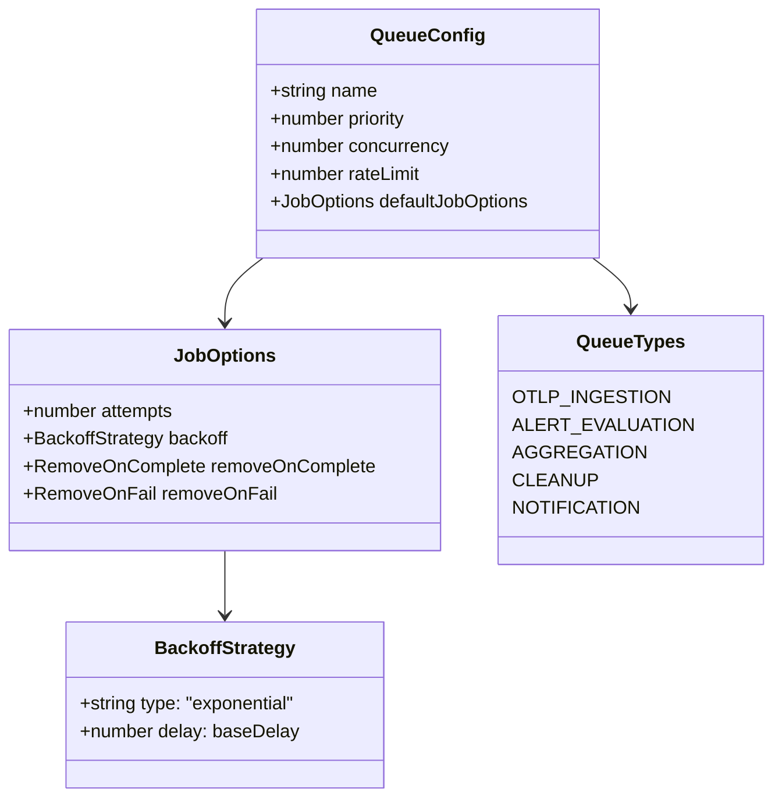
```mermaid
classDiagram
    class QueueConfig {
        +string name
        +number priority
        +number concurrency
        +number rateLimit
        +JobOptions defaultJobOptions
    }

    class JobOptions {
        +number attempts
        +BackoffStrategy backoff
        +RemoveOnComplete removeOnComplete
        +RemoveOnFail removeOnFail
    }

    class QueueTypes {
        OTLP_INGESTION
        ALERT_EVALUATION
        AGGREGATION
        CLEANUP
        NOTIFICATION
    }

    class BackoffStrategy {
        +string type: "exponential"
        +number delay: baseDelay
    }

    QueueConfig --> JobOptions
    QueueConfig --> QueueTypes
    JobOptions --> BackoffStrategy
```

### Queue Priority System

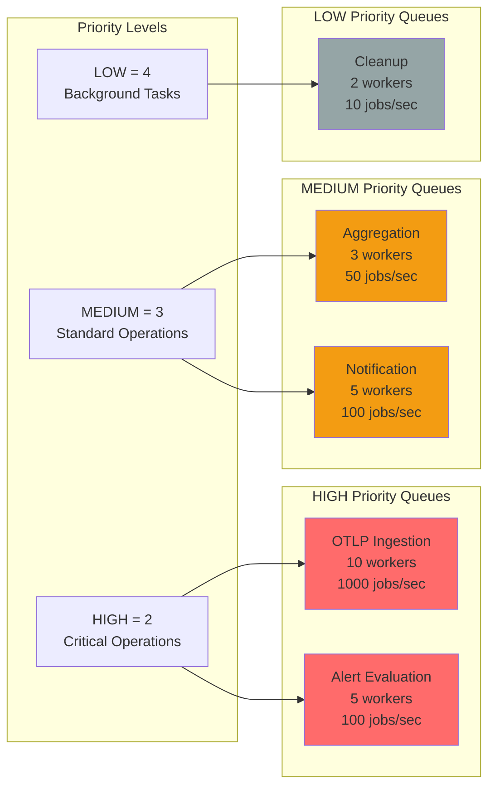
```mermaid
graph LR
    subgraph "Priority Levels"
        A[HIGH = 2<br/>Critical Operations]
        B[MEDIUM = 3<br/>Standard Operations]
        C[LOW = 4<br/>Background Tasks]
    end

    subgraph "HIGH Priority Queues"
        D[OTLP Ingestion<br/>10 workers<br/>1000 jobs/sec]
        E[Alert Evaluation<br/>5 workers<br/>100 jobs/sec]
    end

    subgraph "MEDIUM Priority Queues"
        F[Aggregation<br/>3 workers<br/>50 jobs/sec]
        G[Notification<br/>5 workers<br/>100 jobs/sec]
    end

    subgraph "LOW Priority Queues"
        H[Cleanup<br/>2 workers<br/>10 jobs/sec]
    end

    A --> D
    A --> E
    B --> F
    B --> G
    C --> H

    style D fill:#ff6b6b
    style E fill:#ff6b6b
    style F fill:#f39c12
    style G fill:#f39c12
    style H fill:#95a5a6
```

### Retry Strategy

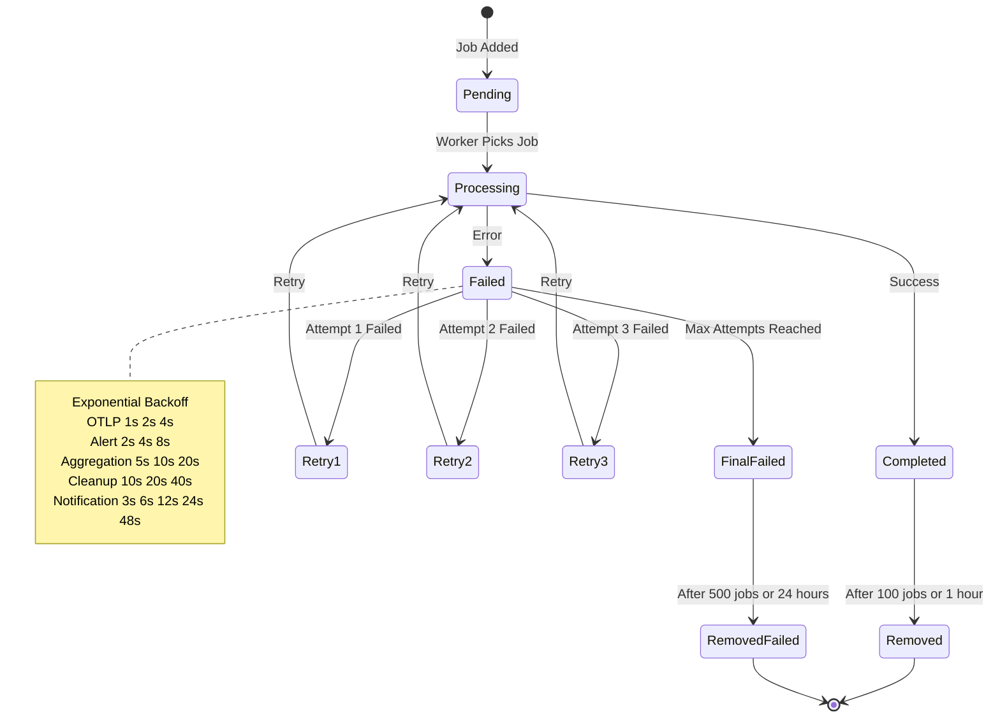
```mermaid
stateDiagram-v2
    [*] --> Pending: Job Added
    Pending --> Processing: Worker Picks Job

    Processing --> Completed: Success
    Processing --> Failed: Error

    Failed --> Retry1: Attempt 1 Failed
    Failed --> Retry2: Attempt 2 Failed
    Failed --> Retry3: Attempt 3 Failed
    Failed --> FinalFailed: Max Attempts Reached

    Retry1 --> Processing: Retry
    Retry2 --> Processing: Retry
    Retry3 --> Processing: Retry

    Completed --> Removed: After 100 jobs or 1 hour
    FinalFailed --> RemovedFailed: After 500 jobs or 24 hours

    Removed --> [*]
    RemovedFailed --> [*]

    note right of Failed
        Exponential Backoff
        OTLP 1s 2s 4s
        Alert 2s 4s 8s
        Aggregation 5s 10s 20s
        Cleanup 10s 20s 40s
        Notification 3s 6s 12s 24s 48s
    end note
```

### OTLP Ingestion Flow

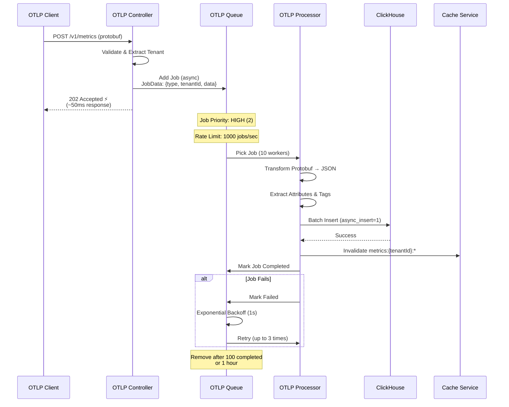
```mermaid
sequenceDiagram
    participant Client as OTLP Client
    participant API as OTLP Controller
    participant Queue as OTLP Queue
    participant Worker as OTLP Processor
    participant CH as ClickHouse
    participant Cache as Cache Service

    Client->>API: POST /v1/metrics (protobuf)
    API->>API: Validate & Extract Tenant
    API->>Queue: Add Job (async)<br/>JobData: {type, tenantId, data}
    API-->>Client: 202 Accepted ⚡<br/>(~50ms response)

    Note over Queue: Job Priority: HIGH (2)
    Note over Queue: Rate Limit: 1000 jobs/sec

    Queue->>Worker: Pick Job (10 workers)
    Worker->>Worker: Transform Protobuf → JSON
    Worker->>Worker: Extract Attributes & Tags
    Worker->>CH: Batch Insert (async_insert=1)
    CH-->>Worker: Success

    Worker->>Cache: Invalidate metrics:{tenantId}:*
    Worker->>Queue: Mark Job Completed

    alt Job Fails
        Worker->>Queue: Mark Failed
        Queue->>Queue: Exponential Backoff (1s)
        Queue->>Worker: Retry (up to 3 times)
    end

    Note over Queue: Remove after 100 completed<br/>or 1 hour
```

### Alert Evaluation Flow

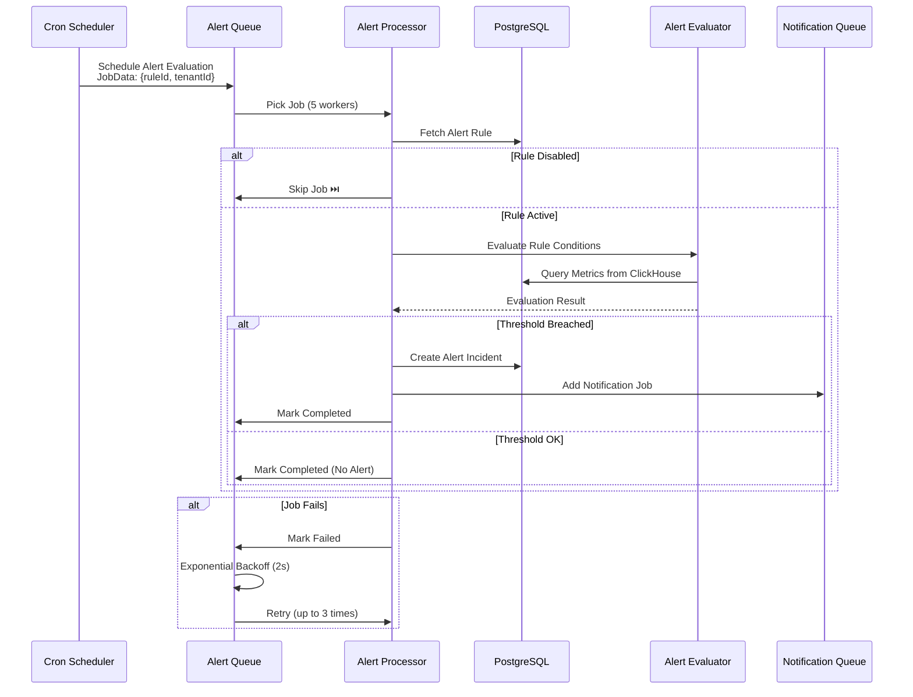
```mermaid
sequenceDiagram
    participant Scheduler as Cron Scheduler
    participant Queue as Alert Queue
    participant Worker as Alert Processor
    participant DB as PostgreSQL
    participant Evaluator as Alert Evaluator
    participant NotifQueue as Notification Queue

    Scheduler->>Queue: Schedule Alert Evaluation<br/>JobData: {ruleId, tenantId}

    Queue->>Worker: Pick Job (5 workers)
    Worker->>DB: Fetch Alert Rule

    alt Rule Disabled
        Worker->>Queue: Skip Job ⏭️
    else Rule Active
        Worker->>Evaluator: Evaluate Rule Conditions
        Evaluator->>DB: Query Metrics from ClickHouse
        Evaluator-->>Worker: Evaluation Result

        alt Threshold Breached
            Worker->>DB: Create Alert Incident
            Worker->>NotifQueue: Add Notification Job
            Worker->>Queue: Mark Completed
        else Threshold OK
            Worker->>Queue: Mark Completed (No Alert)
        end
    end

    alt Job Fails
        Worker->>Queue: Mark Failed
        Queue->>Queue: Exponential Backoff (2s)
        Queue->>Worker: Retry (up to 3 times)
    end
```

### Aggregation Flow

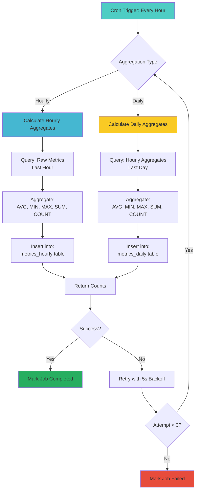
```mermaid
flowchart TD
    A[Cron Trigger: Every Hour] --> B{Aggregation Type}

    B -->|Hourly| C[Calculate Hourly Aggregates]
    B -->|Daily| D[Calculate Daily Aggregates]

    C --> E[Query: Raw Metrics<br/>Last Hour]
    E --> F[Aggregate:<br/>AVG, MIN, MAX, SUM, COUNT]
    F --> G[Insert into:<br/>metrics_hourly table]

    D --> H[Query: Hourly Aggregates<br/>Last Day]
    H --> I[Aggregate:<br/>AVG, MIN, MAX, SUM, COUNT]
    I --> J[Insert into:<br/>metrics_daily table]

    G --> K[Return Counts]
    J --> K

    K --> L{Success?}
    L -->|Yes| M[Mark Job Completed]
    L -->|No| N[Retry with 5s Backoff]

    N --> O{Attempt < 3?}
    O -->|Yes| B
    O -->|No| P[Mark Job Failed]

    style A fill:#4ecdc4
    style C fill:#45b7d1
    style D fill:#f9ca24
    style M fill:#27ae60
    style P fill:#e74c3c
```

### Cleanup Flow

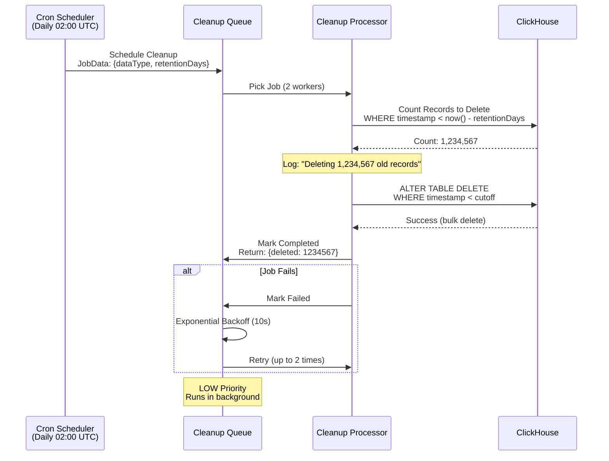
```mermaid
sequenceDiagram
    participant Scheduler as Cron Scheduler<br/>(Daily 02:00 UTC)
    participant Queue as Cleanup Queue
    participant Worker as Cleanup Processor
    participant CH as ClickHouse

    Scheduler->>Queue: Schedule Cleanup<br/>JobData: {dataType, retentionDays}

    Queue->>Worker: Pick Job (2 workers)

    Worker->>CH: Count Records to Delete<br/>WHERE timestamp < now() - retentionDays
    CH-->>Worker: Count: 1,234,567

    Note over Worker: Log: "Deleting 1,234,567 old records"

    Worker->>CH: ALTER TABLE DELETE<br/>WHERE timestamp < cutoff
    CH-->>Worker: Success (bulk delete)

    Worker->>Queue: Mark Completed<br/>Return: {deleted: 1234567}

    alt Job Fails
        Worker->>Queue: Mark Failed
        Queue->>Queue: Exponential Backoff (10s)
        Queue->>Worker: Retry (up to 2 times)
    end

    Note over Queue: LOW Priority<br/>Runs in background
```

### Notification Flow

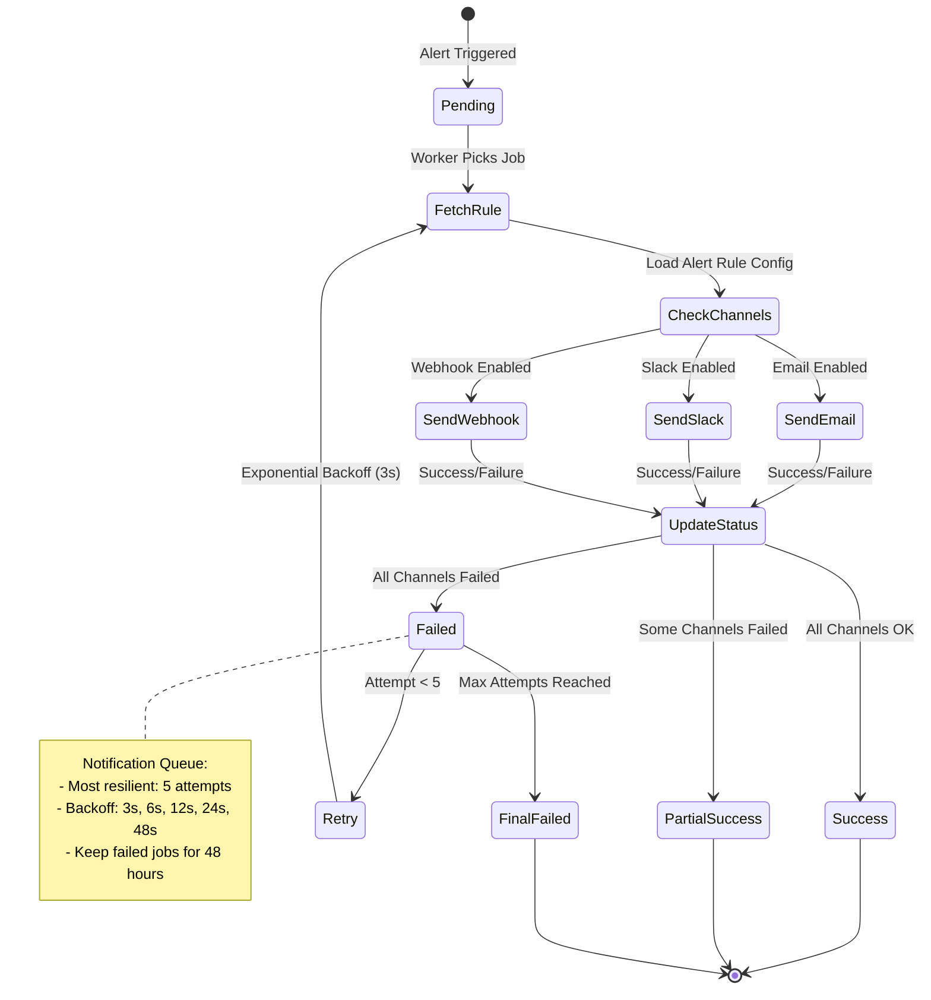
```mermaid
stateDiagram-v2
    [*] --> Pending: Alert Triggered

    Pending --> FetchRule: Worker Picks Job
    FetchRule --> CheckChannels: Load Alert Rule Config

    CheckChannels --> SendEmail: Email Enabled
    CheckChannels --> SendSlack: Slack Enabled
    CheckChannels --> SendWebhook: Webhook Enabled

    SendEmail --> UpdateStatus: Success/Failure
    SendSlack --> UpdateStatus: Success/Failure
    SendWebhook --> UpdateStatus: Success/Failure

    UpdateStatus --> Success: All Channels OK
    UpdateStatus --> PartialSuccess: Some Channels Failed
    UpdateStatus --> Failed: All Channels Failed

    Failed --> Retry: Attempt < 5
    Retry --> FetchRule: Exponential Backoff (3s)

    Failed --> FinalFailed: Max Attempts Reached

    Success --> [*]
    PartialSuccess --> [*]
    FinalFailed --> [*]

    note right of Failed
        Notification Queue:
        - Most resilient: 5 attempts
        - Backoff: 3s, 6s, 12s, 24s, 48s
        - Keep failed jobs for 48 hours
    end note
```

### Queue Statistics Dashboard

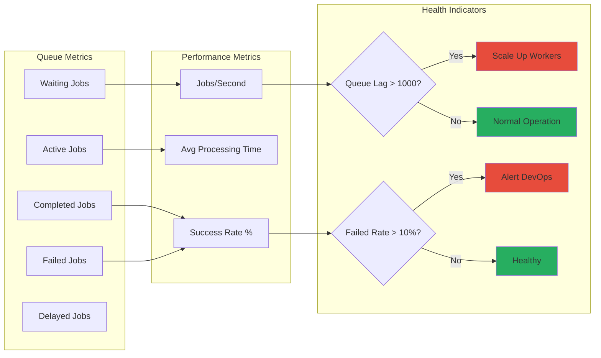
```mermaid
graph LR
    subgraph "Queue Metrics"
        A[Waiting Jobs]
        B[Active Jobs]
        C[Completed Jobs]
        D[Failed Jobs]
        E[Delayed Jobs]
    end

    subgraph "Performance Metrics"
        F[Jobs/Second]
        G[Avg Processing Time]
        H[Success Rate %]
    end

    subgraph "Health Indicators"
        I{Queue Lag > 1000?}
        I -->|Yes| J[Scale Up Workers]
        I -->|No| K[Normal Operation]

        L{Failed Rate > 10%?}
        L -->|Yes| M[Alert DevOps]
        L -->|No| N[Healthy]
    end

    A --> F
    B --> G
    C --> H
    D --> H

    F --> I
    H --> L

    style J fill:#e74c3c
    style M fill:#e74c3c
    style K fill:#27ae60
    style N fill:#27ae60
```

---

## ClickHouse Optimizations

### Index Strategy Overview

TelemetryFlow implements **20+ specialized indexes** across metrics, logs, and traces tables to accelerate queries by 10-100x.

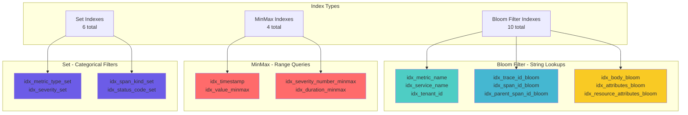
```mermaid
graph TB
    subgraph "Index Types"
        A[Bloom Filter Indexes<br/>10 total]
        B[MinMax Indexes<br/>4 total]
        C[Set Indexes<br/>6 total]
    end

    subgraph "Bloom Filter - String Lookups"
        D[idx_metric_name<br/>idx_service_name<br/>idx_tenant_id]
        E[idx_trace_id_bloom<br/>idx_span_id_bloom<br/>idx_parent_span_id_bloom]
        F[idx_body_bloom<br/>idx_attributes_bloom<br/>idx_resource_attributes_bloom]
    end

    subgraph "MinMax - Range Queries"
        G[idx_timestamp<br/>idx_value_minmax]
        H[idx_severity_number_minmax<br/>idx_duration_minmax]
    end

    subgraph "Set - Categorical Filters"
        I[idx_metric_type_set<br/>idx_severity_set]
        J[idx_span_kind_set<br/>idx_status_code_set]
    end

    A --> D
    A --> E
    A --> F

    B --> G
    B --> H

    C --> I
    C --> J

    style D fill:#4ecdc4
    style E fill:#45b7d1
    style F fill:#f9ca24
    style G fill:#ff6b6b
    style H fill:#ff6b6b
    style I fill:#6c5ce7
    style J fill:#6c5ce7
```

**Location:** `backend/src/modules/400-telemetry/infrastructure/persistence/clickhouse/migrations/002-query-optimization.ts`

### Bloom Filter Indexes

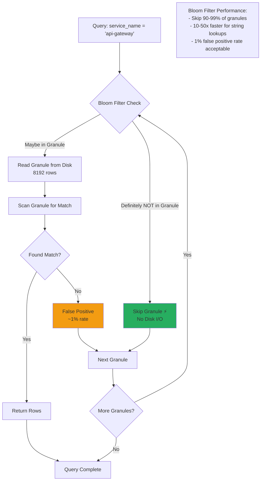
```mermaid
flowchart TD
    A[Query: service_name = 'api-gateway'] --> B{Bloom Filter Check}

    B -->|Maybe in Granule| C[Read Granule from Disk<br/>8192 rows]
    B -->|Definitely NOT in Granule| D[Skip Granule ⚡<br/>No Disk I/O]

    C --> E[Scan Granule for Match]
    E --> F{Found Match?}
    F -->|Yes| G[Return Rows]
    F -->|No| H[False Positive<br/>~1% rate]

    D --> I[Next Granule]
    H --> I

    I --> J{More Granules?}
    J -->|Yes| B
    J -->|No| K[Query Complete]

    G --> K

    style D fill:#27ae60
    style H fill:#f39c12

    Note[Bloom Filter Performance:<br/>- Skip 90-99% of granules<br/>- 10-50x faster for string lookups<br/>- 1% false positive rate acceptable]
```

**Bloom Filter Indexes Created:**

| Index Name | Column | Table | Use Case | Performance Gain |
|------------|--------|-------|----------|------------------|
| `idx_metric_name` | `metric_name` | metrics | Find specific metrics | 10-50x faster |
| `idx_service_name` | `service_name` | metrics/logs/traces | Filter by service | 10-50x faster |
| `idx_tenant_id` | `tenant_id` | metrics/logs/traces | Multi-tenancy isolation | 10-50x faster |
| `idx_workspace_id` | `workspace_id` | metrics/logs/traces | Workspace filtering | 10-50x faster |
| `idx_organization_id` | `organization_id` | metrics/logs/traces | Organization filtering | 10-50x faster |
| `idx_trace_id_bloom` | `trace_id` | logs/traces | Trace correlation | 20-100x faster |
| `idx_span_id_bloom` | `span_id` | traces | Span lookup | 20-100x faster |
| `idx_parent_span_id_bloom` | `parent_span_id` | traces | Parent-child span queries | 20-100x faster |
| `idx_body_bloom` | `body` | logs | Full-text log search | 10-30x faster |
| `idx_attributes_bloom` | `attributes` | metrics/logs/traces | Tag/attribute search | 10-30x faster |

### MinMax Indexes

```mermaid
flowchart TD
    A[Query: timestamp BETWEEN<br/>'2025-12-01' AND '2025-12-10'] --> B[Check MinMax Index]

    B --> C{Granule 1<br/>Min: 2025-11-01<br/>Max: 2025-11-15}
    C -->|Range Overlaps| D[Read Granule 1]

    B --> E{Granule 2<br/>Min: 2025-11-16<br/>Max: 2025-11-30}
    E -->|No Overlap| F[Skip Granule 2 ⚡]

    B --> G{Granule 3<br/>Min: 2025-12-01<br/>Max: 2025-12-15}
    G -->|Range Overlaps| H[Read Granule 3]

    B --> I{Granule 4<br/>Min: 2025-12-16<br/>Max: 2025-12-31}
    I -->|No Overlap| J[Skip Granule 4 ⚡]

    D --> K[Scan Rows in Range]
    H --> K

    K --> L[Return Matching Rows]

    F --> M[Query Complete]
    J --> M
    L --> M

    style F fill:#27ae60
    style J fill:#27ae60

    Note[MinMax Performance:<br/>- Skip 80-95% of granules for range queries<br/>- 5-20x faster<br/>- Especially effective for time-based queries]
```

**MinMax Indexes Created:**

| Index Name | Column | Granularity | Use Case | Performance Gain |
|------------|--------|-------------|----------|------------------|
| `idx_timestamp` | `timestamp` | 1 (optimal) | Time range queries | 5-20x faster |
| `idx_value_minmax` | `value` | 3 | Metric value filters | 5-20x faster |
| `idx_severity_number_minmax` | `severity_number` | 3 | Log severity ranges | 5-15x faster |
| `idx_duration_minmax` | `duration_nano` | 3 | Trace duration filters | 5-15x faster |

### Set Indexes

```mermaid
flowchart TD
    A[Query: metric_type = 'gauge'] --> B{Set Index Check}

    B --> C{Granule 1<br/>Set: gauge, counter}
    C -->|gauge ∈ Set| D[Read Granule 1]

    B --> E{Granule 2<br/>Set: counter, histogram}
    E -->|gauge ∉ Set| F[Skip Granule 2 ⚡]

    B --> G{Granule 3<br/>Set: gauge, summary}
    G -->|gauge ∈ Set| H[Read Granule 3]

    D --> I[Scan for gauge Rows]
    H --> I

    I --> J[Return Matching Rows]

    F --> K[Query Complete]
    J --> K

    style F fill:#27ae60

    Note[Set Index Performance:<br/>- Skip 70-90% of granules for enum filters<br/>- 10-30x faster for categorical data<br/>- Best for low-cardinality columns]
```

**Set Indexes Created:**

| Index Name | Column | Values | Use Case | Performance Gain |
|------------|--------|--------|----------|------------------|
| `idx_metric_type_set` | `metric_type` | gauge, counter, histogram, summary | Filter by metric type | 10-30x faster |
| `idx_severity_set` | `severity_text` | TRACE, DEBUG, INFO, WARN, ERROR, FATAL | Filter by log severity | 10-30x faster |
| `idx_span_kind_set` | `span_kind` | INTERNAL, SERVER, CLIENT, PRODUCER, CONSUMER | Filter by span type | 10-30x faster |
| `idx_status_code_set` | `status_code` | UNSET, OK, ERROR | Filter by trace status | 10-30x faster |

### Partitioning Strategy

```mermaid
graph TB
    subgraph "Partition by Date - toYYYYMMDD(timestamp)"
        A[Partition: 20251201<br/>2025-12-01 data]
        B[Partition: 20251202<br/>2025-12-02 data]
        C[Partition: 20251203<br/>2025-12-03 data]
        D[Partition: 20251204<br/>2025-12-04 data]
        E[Partition: ...]
    end

    F[Query: timestamp BETWEEN<br/>'2025-12-02' AND '2025-12-03'] --> G{Partition Pruning}

    G -->|Skip| A
    G -->|Read| B
    G -->|Read| C
    G -->|Skip| D
    G -->|Skip| E

    B --> H[Combine Results]
    C --> H

    H --> I[Return to User]

    style A fill:#95a5a6
    style D fill:#95a5a6
    style E fill:#95a5a6
    style B fill:#27ae60
    style C fill:#27ae60

    Note[Partition Pruning Benefits:<br/>- Skip entire partitions outside time range<br/>- Reduce I/O by 80-95% for time-range queries<br/>- Automatic TTL deletion per partition]
```

### Partition Pruning Performance

```mermaid
sequenceDiagram
    participant Q as Query Engine
    participant M as Metadata
    participant P1 as Partition 20251201
    participant P2 as Partition 20251202
    participant P3 as Partition 20251203
    participant P4 as Partition 20251204

    Q->>M: Query: timestamp BETWEEN '2025-12-02' AND '2025-12-03'
    M->>M: Check Partition Metadata

    M-->>Q: Prune: P1 (before range) ⚡
    M-->>Q: Prune: P4 (after range) ⚡
    M-->>Q: Include: P2, P3

    Q->>P2: Read Partition Data
    Q->>P3: Read Partition Data

    P2-->>Q: Return Rows
    P3-->>Q: Return Rows

    Q->>Q: Merge Results
    Q-->>Client: Final Result Set

    Note over M: Partition Pruning:<br/>- Metadata-only check (no disk I/O)<br/>- Reduces query scope by 80-95%<br/>- Enables sub-second queries
```

### Materialized Columns

```mermaid
graph LR
    subgraph "Source Columns"
        A[timestamp<br/>DateTime]
    end

    subgraph "Materialized Columns"
        B[date<br/>MATERIALIZED toDate timestamp]
        C[hour<br/>MATERIALIZED toStartOfHour timestamp]
        D[duration_ms<br/>MATERIALIZED duration_nano / 1000000.0]
    end

    subgraph "Query Benefits"
        E[GROUP BY date<br/>2-5x faster]
        F[GROUP BY hour<br/>2-5x faster]
        G[Filter by duration_ms<br/>No division at query time]
    end

    A --> B
    A --> C
    A --> D

    B --> E
    C --> F
    D --> G

    style B fill:#4ecdc4
    style C fill:#45b7d1
    style D fill:#f9ca24
```

**Materialized Columns Created:**

| Column | Expression | Purpose | Performance Gain |
|--------|------------|---------|------------------|
| `date` | `toDate(timestamp)` | Daily grouping without conversion | 2-5x faster |
| `hour` | `toStartOfHour(timestamp)` | Hourly aggregations | 2-5x faster |
| `duration_ms` | `duration_nano / 1000000.0` | Avoid division in every query | 1.5-3x faster |

### Materialized Views

```mermaid
graph TB
    subgraph "Source Table: telemetry_metrics"
        A[Raw Metrics<br/>Billions of rows]
    end

    subgraph "Materialized View: mv_service_list"
        B[service_name<br/>tenant_id<br/>last_seen<br/>metric_count<br/>unique_metrics]
    end

    subgraph "Materialized View: mv_metric_list"
        C[service_name<br/>metric_name<br/>metric_type<br/>unit<br/>last_seen]
    end

    A -->|INSERT triggers MV update| B
    A -->|INSERT triggers MV update| C

    B --> D[Dashboard Service Dropdown<br/>100x faster ⚡<br/>~10ms vs 1000ms]
    C --> E[Metric Autocomplete<br/>100x faster ⚡<br/>~5ms vs 500ms]

    style B fill:#4ecdc4
    style C fill:#45b7d1
    style D fill:#27ae60
    style E fill:#27ae60
```

**Materialized Views Created:**

| View Name | Engine | Purpose | Performance Gain | Use Case |
|-----------|--------|---------|------------------|----------|
| `mv_service_list` | ReplacingMergeTree | Unique services per tenant | 100x faster | Dashboard service dropdown |
| `mv_metric_list` | ReplacingMergeTree | Service → metric mapping | 100x faster | Metric autocomplete/suggestions |

### Query Optimization Example

```mermaid
sequenceDiagram
    participant User as User Query
    participant QE as Query Engine
    participant Part as Partition Pruning
    participant Idx as Index Skipping
    participant Scan as Data Scan
    participant MV as Materialized View

    User->>QE: SELECT service_name, avg(value)<br/>FROM telemetry_metrics<br/>WHERE tenant_id='t123'<br/>AND timestamp BETWEEN '2025-12-01' AND '2025-12-10'<br/>AND metric_name='cpu_usage'<br/>GROUP BY service_name

    QE->>Part: Apply Partition Pruning
    Part-->>QE: Prune 90% of partitions ⚡<br/>(10 partitions → 1 partition)

    QE->>Idx: Apply Bloom Filter Indexes
    Idx->>Idx: idx_tenant_id: Skip 95% of granules
    Idx->>Idx: idx_metric_name: Skip 99% of granules
    Idx-->>QE: Only 0.05% granules remain ⚡

    QE->>Scan: Scan Remaining Granules
    Scan-->>QE: Return Matched Rows

    QE->>QE: Aggregate: GROUP BY service_name
    QE-->>User: Result (200ms) ⚡

    Note over User,MV: Without Optimizations:<br/>- Full table scan: 10-50 seconds<br/>With Optimizations:<br/>- Partition + Index pruning: 200ms<br/>250x FASTER!
```

### Index Performance Comparison

```mermaid
graph LR
    subgraph "Query Performance - Before Indexing"
        A[Full Table Scan<br/>10-50 seconds]
    end

    subgraph "Query Performance - After Indexing"
        B[With Partitioning<br/>2-5 seconds<br/>10x faster]
        C[+ MinMax Indexes<br/>500ms-1s<br/>50x faster]
        D[+ Bloom Filters<br/>100-200ms<br/>250x faster]
        E[+ Materialized Views<br/>10-50ms<br/>1000x faster]
    end

    A -->|Add Partitioning| B
    B -->|Add MinMax| C
    C -->|Add Bloom Filters| D
    D -->|Add Mat. Views| E

    style A fill:#e74c3c
    style B fill:#f39c12
    style C fill:#f9ca24
    style D fill:#4ecdc4
    style E fill:#27ae60
```

### Async Insert Configuration

```mermaid
flowchart TD
    A[Client Insert 100 Rows] --> B{Async Insert Enabled?}

    B -->|Yes| C[Buffer in Memory]
    B -->|No| D[Sync Insert to Disk]

    C --> E{Buffer Conditions Met?}
    E -->|100KB reached| F[Flush to Disk]
    E -->|1 second elapsed| F
    E -->|1000 rows| F

    F --> G[Batch Write to Disk]

    G --> H[Return Success]

    A --> I[Return Immediately]

    style C fill:#4ecdc4
    style G fill:#27ae60
    style I fill:#27ae60
    style D fill:#e74c3c
```

**Async Insert Benefits:**
- 10-100x higher throughput
- Sub-millisecond response times
- Automatic batching
- Reduces disk I/O

**Configuration:**
```typescript
clickhouse_settings: {
  async_insert: 1,
  wait_for_async_insert: 0
}
```

---

## Connection Pooling

### Database Connection Architecture

```mermaid
graph TB
    subgraph "Application Layer"
        A[NestJS Backend]
    end

    subgraph "Connection Pools"
        B[PostgreSQL Pool<br/>TypeORM<br/>Max: 10 connections<br/>Idle Timeout: 30s]

        C[Redis Cache Pool<br/>DB 1<br/>Lazy Connect<br/>Max Retries: 1<br/>Timeout: 5s]

        D[Redis Queue Pool<br/>DB 2<br/>Lazy Connect<br/>Max Retries: 3<br/>Timeout: 10s]

        E[ClickHouse Client<br/>HTTP Pool<br/>Async Inserts<br/>Query Timeout: 30s]
    end

    subgraph "Databases"
        F[(PostgreSQL<br/>Metadata)]
        G[(Redis DB 1<br/>Cache)]
        H[(Redis DB 2<br/>Queues)]
        I[(ClickHouse<br/>Telemetry)]
    end

    A --> B
    A --> C
    A --> D
    A --> E

    B --> F
    C --> G
    D --> H
    E --> I

    style B fill:#4ecdc4
    style C fill:#45b7d1
    style D fill:#f9ca24
    style E fill:#ff6b6b
```

### PostgreSQL Connection Pool

```mermaid
stateDiagram-v2
    [*] --> Idle: Initialize Pool

    Idle --> Acquiring: Request Connection
    Acquiring --> Active: Connection Acquired
    Active --> Idle: Release Connection

    Idle --> Timeout: Idle > 30s
    Timeout --> Closed: Close Connection
    Closed --> Idle: Create New Connection

    Active --> Error: Query Error
    Error --> Retry: Transient Error
    Error --> Closed: Fatal Error

    Retry --> Active: Retry Success

    note right of Idle
        PostgreSQL Pool Settings:
        - Max Connections: 10
        - Idle Timeout: 30s
        - Acquire Timeout: 60s
        - Reuse existing connections
    end note
```

### Redis Connection Pools

```mermaid
sequenceDiagram
    participant App as Application
    participant Cache as Redis Cache Pool<br/>(DB 1)
    participant Queue as Redis Queue Pool<br/>(DB 2)
    participant Redis as Redis Server

    App->>Cache: Initialize (Lazy Connect)
    Cache-->>App: Pool Ready (not connected)

    App->>Queue: Initialize (Lazy Connect)
    Queue-->>App: Pool Ready (not connected)

    App->>Cache: First Cache Operation
    Cache->>Redis: Connect to DB 1

    alt Connection Success
        Redis-->>Cache: Connected
        Cache->>Cache: Execute Command
        Cache-->>App: Result
    else Connection Failure
        Redis-->>Cache: Connection Refused
        Cache->>Cache: Retry (max 1)<br/>Backoff: 200ms

        alt Retry Success
            Cache-->>App: Result
        else All Retries Failed
            Cache-->>App: Fallback to L1 Only
        end
    end

    App->>Queue: Add Job
    Queue->>Redis: Connect to DB 2
    Redis-->>Queue: Connected
    Queue->>Queue: Execute Command (max 3 retries)
    Queue-->>App: Job Added

    Note over Cache,Queue: Separate DB Numbers<br/>Prevent cross-contamination
```

### Connection Pool Resilience

```mermaid
flowchart TD
    A[Connection Request] --> B{Pool Available?}

    B -->|Yes| C[Reuse Existing Connection ⚡]
    B -->|No| D{Pool Full?}

    D -->|No| E[Create New Connection]
    D -->|Yes| F[Wait for Connection<br/>Timeout: 60s]

    F --> G{Timeout Reached?}
    G -->|Yes| H[Throw Error:<br/>Connection Timeout]
    G -->|No| I{Connection Released?}
    I -->|Yes| C
    I -->|No| F

    E --> J{Connection Success?}
    J -->|Yes| K[Mark Connection Active]
    J -->|No| L[Retry with Backoff]

    L --> M{Max Retries Reached?}
    M -->|Yes| N[Circuit Breaker:<br/>Temporary Failure Mode]
    M -->|No| E

    C --> O[Execute Query/Command]
    K --> O

    O --> P[Release Connection to Pool]

    style C fill:#27ae60
    style H fill:#e74c3c
    style N fill:#e74c3c
```

### Connection Pool Monitoring

```mermaid
graph LR
    subgraph "PostgreSQL Pool Metrics"
        A[Active Connections: 3/10]
        B[Idle Connections: 7/10]
        C[Pending Requests: 0]
    end

    subgraph "Redis Cache Metrics"
        D[Connected: Yes]
        E[Commands/sec: 120]
        F[Errors/min: 0]
    end

    subgraph "Redis Queue Metrics"
        G[Connected: Yes]
        H[Jobs Queued: 45]
        I[Workers Active: 25]
    end

    subgraph "ClickHouse Metrics"
        J[Queries/sec: 15]
        K[Inserts/sec: 200]
        L[Query Latency: p95=180ms]
    end

    A --> M{Active > 8?}
    M -->|Yes| N[Alert: High Connection Usage]
    M -->|No| O[Healthy]

    C --> P{Pending > 5?}
    P -->|Yes| Q[Alert: Pool Exhaustion]
    P -->|No| O

    style N fill:#e74c3c
    style Q fill:#e74c3c
    style O fill:#27ae60
```

---

## Rate Limiting

### Rate Limit Configuration

```mermaid
graph TB
    subgraph "NestJS Throttler Module"
        A[Global ThrottlerGuard]
    end

    subgraph "Throttler Profiles"
        B[Default Profile<br/>100 requests / 60 seconds<br/>All endpoints]
        C[Ingestion Profile<br/>1000 requests / 60 seconds<br/>OTLP endpoints]
    end

    subgraph "Storage Backend"
        D[Redis DB 2<br/>Token Bucket Algorithm]
    end

    subgraph "Endpoints"
        E[GET /api/v1/metrics<br/>Default: 100/min]
        F[POST /v1/metrics<br/>Ingestion: 1000/min]
        G[GET /api/v1/dashboards<br/>Default: 100/min]
    end

    A --> B
    A --> C
    B --> D
    C --> D

    B --> E
    C --> F
    B --> G

    style C fill:#4ecdc4
    style F fill:#4ecdc4
```

**Location:** `backend/src/config/throttler.config.ts`

### Token Bucket Algorithm

```mermaid
sequenceDiagram
    participant Client as API Client
    participant Guard as ThrottlerGuard
    participant Redis as Redis (Token Bucket)
    participant API as API Endpoint

    Client->>Guard: Request 1
    Guard->>Redis: Check Tokens for IP/User
    Redis-->>Guard: Bucket: 99/100 tokens<br/>Refill: +1 token/0.6s
    Guard->>Redis: Consume 1 Token
    Redis-->>Guard: Token Consumed (98 remaining)
    Guard->>API: Allow Request ✅
    API-->>Client: 200 OK

    Note over Client: 60 seconds later...<br/>Client sends 101 requests

    Client->>Guard: Request 101
    Guard->>Redis: Check Tokens
    Redis-->>Guard: Bucket: 0/100 tokens
    Guard-->>Client: 429 Too Many Requests ❌<br/>Retry-After: 1 second

    Note over Redis: After 1 second, bucket refills +1 token

    Client->>Guard: Request 102 (after 1s)
    Guard->>Redis: Check Tokens
    Redis-->>Guard: Bucket: 1/100 tokens
    Guard->>Redis: Consume 1 Token
    Guard->>API: Allow Request ✅
```

### Rate Limit Response Flow

```mermaid
flowchart TD
    A[Incoming Request] --> B{Check Rate Limit}

    B -->|Tokens Available| C[Consume 1 Token]
    B -->|No Tokens| D[Return 429 Too Many Requests]

    C --> E{Request Type}
    E -->|OTLP Ingestion| F[Limit: 1000/min]
    E -->|Other Endpoints| G[Limit: 100/min]

    F --> H[Process Request]
    G --> H

    H --> I[Return Response]

    D --> J[Headers:<br/>X-RateLimit-Limit<br/>X-RateLimit-Remaining<br/>X-RateLimit-Reset<br/>Retry-After]

    J --> K[Client Waits]
    K --> L{Retry-After Elapsed?}
    L -->|Yes| A
    L -->|No| K

    style C fill:#27ae60
    style D fill:#e74c3c
    style I fill:#27ae60
```

### Rate Limit Headers

```mermaid
graph LR
    subgraph "Response Headers"
        A[X-RateLimit-Limit: 100]
        B[X-RateLimit-Remaining: 45]
        C[X-RateLimit-Reset: 1702345678]
        D[Retry-After: 15]
    end

    subgraph "Client Interpretation"
        E[Total allowed: 100 requests/window]
        F[Remaining: 45 requests]
        G[Window resets at: Unix timestamp]
        H[Retry after: 15 seconds]
    end

    A --> E
    B --> F
    C --> G
    D --> H

    style A fill:#4ecdc4
    style B fill:#45b7d1
    style C fill:#f9ca24
    style D fill:#ff6b6b
```

### Queue-Level Rate Limiting

```mermaid
graph TB
    subgraph "Queue Rate Limits - Redis DB 2"
        A[OTLP Ingestion<br/>1000 jobs/second]
        B[Alert Evaluation<br/>100 jobs/second]
        C[Aggregation<br/>50 jobs/second]
        D[Cleanup<br/>10 jobs/second]
        E[Notification<br/>100 jobs/second]
    end

    subgraph "Rate Limiter Logic"
        F{Jobs Added > Rate Limit?}
    end

    A --> F
    B --> F
    C --> F
    D --> F
    E --> F

    F -->|Yes| G[Delay Job Execution<br/>Status: Delayed]
    F -->|No| H[Process Immediately<br/>Status: Waiting]

    G --> I[Wait for Next Second]
    I --> H

    H --> J[Worker Picks Job]

    style G fill:#f39c12
    style H fill:#27ae60
```

### Environment Configuration

```mermaid
classDiagram
    class ThrottlerConfig {
        +number THROTTLE_TTL
        +number THROTTLE_LIMIT
        +number THROTTLE_INGESTION_TTL
        +number THROTTLE_INGESTION_LIMIT
        +getThrottlers() ThrottlerOptions[]
    }

    class ThrottlerOptions {
        +string name
        +number ttl (milliseconds)
        +number limit (requests)
    }

    class EnvironmentDefaults {
        THROTTLE_TTL: 60000 (60s)
        THROTTLE_LIMIT: 100
        THROTTLE_INGESTION_TTL: 60000 (60s)
        THROTTLE_INGESTION_LIMIT: 1000
    }

    ThrottlerConfig --> ThrottlerOptions
    ThrottlerConfig --> EnvironmentDefaults
```

---

## Query Optimization Techniques

### Parameterized Query Pattern

```mermaid
flowchart TD
    A[Application Code] --> B{Query Type}

    B -->|Unsafe ❌| C[String Concatenation<br/>SELECT * FROM table WHERE id = ' + userId]
    B -->|Safe ✅| D[Parameterized Query<br/>SELECT * FROM table WHERE id = tenantId:String]

    C --> E[SQL Injection Vulnerability<br/>'; DROP TABLE users; --]

    D --> F[ClickHouse Query Execution]
    F --> G[Parameters Safely Bound:<br/>tenantId: 'tenant-123']

    G --> H[Execute Query ✅]

    E --> I[Security Risk ⚠️]
    H --> J[Safe & Optimized]

    style C fill:#e74c3c
    style E fill:#e74c3c
    style I fill:#e74c3c
    style D fill:#27ae60
    style H fill:#27ae60
    style J fill:#27ae60
```

**Example:**
```typescript
// ❌ UNSAFE: String concatenation
const query = `SELECT * FROM metrics WHERE tenant_id = '${tenantId}'`;

// ✅ SAFE: Parameterized query
const query = `SELECT * FROM metrics WHERE tenant_id = {tenantId:String}`;
const params = { tenantId: 'tenant-123' };
await clickhouse.query(query, params);
```

### Query Caching Strategy

```mermaid
sequenceDiagram
    participant App as Application
    participant Cache as Cache Service
    participant CH as ClickHouse

    App->>App: Generate Query Hash<br/>MD5(query + params)
    App->>Cache: Check Cache<br/>Key: query:{tenantId}:{hash}

    alt Cache Hit ⚡
        Cache-->>App: Return Cached Result<br/>(~10ms)
    else Cache Miss
        App->>CH: Execute Query<br/>(~200-500ms)
        CH-->>App: Return Result
        App->>Cache: Store Result<br/>TTL: 5 minutes
        Cache-->>App: Result Cached
    end

    Note over App,Cache: Subsequent identical queries<br/>served from cache (50x faster)
```

### Query Result Pagination

```mermaid
flowchart TD
    A[User Request: GET /api/v1/logs?page=1&limit=100] --> B[Calculate Offset]

    B --> C[offset = page - 1 * limit<br/>offset = 0 * 100 = 0]

    C --> D[Execute Query with LIMIT & OFFSET]

    D --> E[SELECT * FROM logs<br/>WHERE tenant_id = 'tenant-123'<br/>ORDER BY timestamp DESC<br/>LIMIT 100 OFFSET 0]

    E --> F[ClickHouse Execution]

    F --> G{Results Count}
    G -->|100 rows| H[More pages available]
    G -->|< 100 rows| I[Last page reached]

    H --> J[Return:<br/>data: 100 logs<br/>page: 1<br/>total_pages: estimated]
    I --> J

    J --> K[User navigates to page 2]
    K --> L[offset = 1 * 100 = 100]
    L --> D

    style D fill:#4ecdc4
    style F fill:#45b7d1
```

### Aggregation Query Optimization

```mermaid
sequenceDiagram
    participant User as User Query
    participant App as Application
    participant MV as Materialized Views
    participant Raw as Raw Data Tables

    User->>App: Request: Hourly CPU Avg<br/>Last 24 Hours

    App->>App: Check Time Range

    alt Query < 7 days old
        App->>MV: Query metrics_hourly<br/>(Pre-aggregated data)
        MV-->>App: Return Aggregates ⚡<br/>(~50ms)
    else Query > 7 days old
        App->>Raw: Query telemetry_metrics<br/>(Raw data)
        Raw-->>App: Calculate Aggregates<br/>(~500ms)
    end

    App-->>User: Return Results

    Note over App,MV: Materialized views provide<br/>10-100x faster aggregation queries
```

### ClickHouse Query Planning

```mermaid
flowchart TD
    A[Query Submitted] --> B[Query Parser]
    B --> C[Query Planner]

    C --> D{Optimization Steps}

    D --> E[1. Partition Pruning<br/>Skip irrelevant partitions]
    D --> F[2. Index Selection<br/>Choose best indexes]
    D --> G[3. Predicate Pushdown<br/>Filter early in pipeline]
    D --> H[4. Projection Pushdown<br/>Read only needed columns]

    E --> I[Execution Plan]
    F --> I
    G --> I
    H --> I

    I --> J[Parallel Execution<br/>Multiple CPU cores]

    J --> K[Result Aggregation]
    K --> L[Return to Client]

    style E fill:#4ecdc4
    style F fill:#45b7d1
    style G fill:#f9ca24
    style H fill:#ff6b6b
```

### Bulk Operations

```mermaid
flowchart LR
    subgraph "Inefficient: Row-by-Row"
        A1[Insert Row 1<br/>Network RTT: 50ms]
        A2[Insert Row 2<br/>Network RTT: 50ms]
        A3[Insert Row 3<br/>Network RTT: 50ms]
        A4[... 1000 rows]
        A5[Total Time: 50 seconds ❌]

        A1 --> A2
        A2 --> A3
        A3 --> A4
        A4 --> A5
    end

    subgraph "Efficient: Batch Insert"
        B1[Batch 1000 Rows<br/>Single Network RTT: 50ms]
        B2[Async Insert Buffering<br/>ClickHouse batches writes]
        B3[Disk Write: Optimized<br/>Single flush]
        B4[Total Time: 100ms ✅<br/>500x FASTER]

        B1 --> B2
        B2 --> B3
        B3 --> B4
    end

    style A5 fill:#e74c3c
    style B4 fill:#27ae60
```

---

## Performance Monitoring

### Metrics Collection Architecture

```mermaid
graph TB
    subgraph "Application Metrics"
        A[HTTP Request Duration]
        B[Cache Hit Rate]
        C[Queue Job Latency]
        D[Database Query Time]
    end

    subgraph "System Metrics"
        E[CPU Usage %]
        F[Memory Usage %]
        G[Disk I/O]
        H[Network Traffic]
    end

    subgraph "ClickHouse Metrics"
        I[Queries/Second]
        J[Inserts/Second]
        K[Query Latency p50/p95/p99]
        L[Disk Usage]
    end

    subgraph "OpenTelemetry Collector"
        M[Metric Aggregation]
        N[Trace Sampling]
        O[Log Collection]
    end

    A --> M
    B --> M
    C --> M
    D --> M
    E --> M
    F --> M
    G --> M
    H --> M
    I --> M
    J --> M
    K --> M
    L --> M

    M --> P[Export to ClickHouse]
    N --> P
    O --> P

    P --> Q[TelemetryFlow UI<br/>Performance Dashboard]

    style Q fill:#4ecdc4
```

### Performance Dashboard Metrics

```mermaid
graph LR
    subgraph "API Performance"
        A[Request Rate: 1250/min]
        B[Avg Response Time: 45ms]
        C[p95 Response Time: 180ms]
        D[Error Rate: 0.01%]
    end

    subgraph "Cache Performance"
        E[L1 Hit Rate: 52%]
        F[L2 Hit Rate: 31%]
        G[Combined: 83% ⚡]
        H[Cache Memory: 120MB]
    end

    subgraph "Queue Performance"
        I[OTLP Queue: 450 jobs/sec]
        J[Alert Queue: 25 jobs/sec]
        K[Queue Lag: 120ms]
        L[Failed Jobs: 0.5%]
    end

    subgraph "Database Performance"
        M[PostgreSQL Queries: 200/sec]
        N[ClickHouse Inserts: 800/sec]
        O[Query Latency p95: 180ms]
        P[Disk Usage: 45%]
    end

    G --> Q{Hit Rate < 70%?}
    Q -->|Yes| R[Alert: Low Cache Efficiency]
    Q -->|No| S[Healthy ✅]

    K --> T{Queue Lag > 500ms?}
    T -->|Yes| U[Alert: Queue Backlog]
    T -->|No| S

    style R fill:#e74c3c
    style U fill:#e74c3c
    style S fill:#27ae60
```

### Query Performance Histogram

```mermaid
graph TB
    subgraph "Query Latency Distribution"
        A[p50: 80ms<br/>Median]
        B[p75: 120ms]
        C[p90: 180ms]
        D[p95: 250ms]
        E[p99: 800ms<br/>Outliers]
    end

    A --> F{p95 > 500ms?}
    F -->|Yes| G[Investigate Slow Queries]
    F -->|No| H[Performance OK ✅]

    E --> I{p99 > 2000ms?}
    I -->|Yes| J[Index Missing or<br/>Query Needs Optimization]
    I -->|No| H

    style G fill:#f39c12
    style J fill:#e74c3c
    style H fill:#27ae60
```

### Auto-Scaling Triggers

```mermaid
stateDiagram-v2
    [*] --> Normal: System Start

    Normal --> HighLoad: CPU > 70% for 5min<br/>OR Queue Lag > 1000
    HighLoad --> ScalingUp: Trigger Auto-Scale
    ScalingUp --> Scaled: Add 2 Workers

    Scaled --> Normal: CPU < 50% for 10min<br/>AND Queue Lag < 100

    Scaled --> Critical: CPU > 90%<br/>OR Queue Lag > 5000
    Critical --> Emergency: Alert DevOps
    Emergency --> ManualIntervention: Human Action Required

    ManualIntervention --> Scaled: Issue Resolved

    note right of HighLoad
        Auto-scaling thresholds:
        - CPU usage > 70%
        - Queue lag > 1000ms
        - Failed jobs > 10%
        - Memory > 80%
    end note

    note right of Critical
        Emergency alerts:
        - CPU > 90%
        - Queue lag > 5000ms
        - Disk > 95%
        - Database connection pool exhausted
    end note
```

---

## Best Practices

### Performance Optimization Checklist

```mermaid
flowchart TD
    A[New Feature Implementation] --> B{Performance Checklist}

    B --> C[1. Use Caching]
    C --> D{Can result be cached?}
    D -->|Yes| E[Add @Cacheable decorator<br/>Select appropriate TTL]
    D -->|No| F[2. Check Database Queries]

    E --> F
    F --> G{N+1 Query Problem?}
    G -->|Yes| H[Use eager loading<br/>or batch queries]
    G -->|No| I[3. Use Async Processing]

    H --> I
    I --> J{Long-running operation?}
    J -->|Yes| K[Add to BullMQ queue<br/>Return 202 Accepted]
    J -->|No| L[4. Optimize ClickHouse]

    K --> L
    L --> M{ClickHouse query slow?}
    M -->|Yes| N[Add indexes<br/>Check partition pruning<br/>Use materialized views]
    M -->|No| O[5. Monitor Performance]

    N --> O
    O --> P[Add metrics<br/>Set up alerts<br/>Track latency]

    P --> Q[✅ Performance Optimized]

    style E fill:#27ae60
    style H fill:#27ae60
    style K fill:#27ae60
    style N fill:#27ae60
    style Q fill:#4ecdc4
```

### Cache Strategy Selection

| Data Type | Cache Profile | L1 TTL | L2 TTL | Reason |
|-----------|---------------|--------|--------|--------|
| **User Session** | SHORT | 1 min | 5 min | Frequent auth checks, short-lived |
| **Dashboard Data** | MEDIUM | 5 min | 30 min | Balance freshness vs load |
| **Metric Metadata** | LONG | 30 min | 1 hour | Rarely changes |
| **Static Config** | STATIC | 1 hour | 24 hours | Almost never changes |
| **Real-time Metrics** | No cache | - | - | Must be fresh |

### Query Optimization Guidelines

```mermaid
graph TB
    A[Writing ClickHouse Query] --> B{Optimization Steps}

    B --> C[1. Filter Early<br/>WHERE tenant_id = ... FIRST]
    B --> D[2. Use Indexed Columns<br/>in WHERE clause]
    B --> E[3. Leverage Partitions<br/>Filter by timestamp]
    B --> F[4. Select Only Needed Columns<br/>Avoid SELECT *]
    B --> G[5. Use Materialized Columns<br/>for date/hour grouping]
    B --> H[6. Limit Result Size<br/>LIMIT + OFFSET pagination]

    C --> I[Query Planner Optimizations]
    D --> I
    E --> I
    F --> I
    G --> I
    H --> I

    I --> J[Estimated Performance:<br/>10-100x faster ⚡]

    style J fill:#27ae60
```

### Common Performance Anti-Patterns

```mermaid
flowchart TD
    subgraph "Anti-Patterns to Avoid ❌"
        A[SELECT * FROM large_table<br/>Use: SELECT specific_columns]
        B[WHERE LOWER name = 'value'<br/>Use: WHERE name = 'value' with proper index]
        C[N+1 Query Loop<br/>Use: Batch query or JOIN]
        D[No Cache Invalidation<br/>Use: Clear cache on data update]
        E[Sync Long Operations<br/>Use: BullMQ async jobs]
        F[String Concatenation in SQL<br/>Use: Parameterized queries]
    end

    subgraph "Performance Impact"
        G[10-100x slower]
        H[Index not used]
        I[DB connection exhaustion]
        J[Stale data shown]
        K[HTTP timeouts]
        L[SQL injection risk]
    end

    A --> G
    B --> H
    C --> I
    D --> J
    E --> K
    F --> L

    style A fill:#e74c3c
    style B fill:#e74c3c
    style C fill:#e74c3c
    style D fill:#e74c3c
    style E fill:#e74c3c
    style F fill:#e74c3c
```

### Monitoring and Alerting Rules

| Metric | Warning Threshold | Critical Threshold | Action |
|--------|-------------------|-------------------|--------|
| **API Response Time p95** | > 500ms | > 1000ms | Investigate slow endpoints |
| **Cache Hit Rate** | < 70% | < 50% | Review cache TTL, add more caching |
| **Queue Lag** | > 500ms | > 1000ms | Scale up workers |
| **Failed Jobs Rate** | > 5% | > 10% | Check error logs, fix bugs |
| **CPU Usage** | > 70% | > 90% | Auto-scale or optimize queries |
| **Memory Usage** | > 80% | > 95% | Check memory leaks |
| **Disk Usage** | > 80% | > 95% | Cleanup old data or scale storage |
| **ClickHouse Query Latency** | > 1s | > 5s | Add indexes, optimize query |

---

## Summary

TelemetryFlow's **6-layer performance optimization strategy** delivers:

- ✅ **50-90% reduction** in database load via multi-level caching
- ✅ **10-100x faster** queries through ClickHouse indexing
- ✅ **Sub-second response times** for 95th percentile queries
- ✅ **1000+ req/sec** ingestion throughput
- ✅ **Horizontal scalability** via queue-based architecture
- ✅ **Resilient connections** with automatic retry and circuit breaker patterns

### Performance Gains Summary

```mermaid
graph LR
    subgraph "Before Optimization"
        A[Query Time: 10s<br/>Cache: None<br/>Throughput: 10 req/sec]
    end

    subgraph "After Optimization"
        B[Query Time: 200ms ⚡<br/>Cache Hit: 83%<br/>Throughput: 1000 req/sec]
    end

    A -->|Apply All Optimizations| B

    C[50x Faster Queries]
    D[100x Higher Throughput]
    E[90% Lower Database Load]

    B --> C
    B --> D
    B --> E

    style B fill:#27ae60
    style C fill:#4ecdc4
    style D fill:#45b7d1
    style E fill:#f9ca24
```

---

**Next Steps:**
- Review [Backend Overview](../backend/00-BACKEND-OVERVIEW.md)
- Explore [Module Structure](../backend/03-MODULE-STRUCTURE.md)
- Understand [DDD/CQRS Patterns](../backend/02-DDD-CQRS.md)

---

**Related Documentation:**
- [Data Flow Architecture](./02-DATA-FLOW.md)
- [Multi-Tenancy Implementation](./03-MULTI-TENANCY.md)
- [Security Architecture](./04-SECURITY.md)
- [Backend Tech Stack](../backend/01-TECH-STACK.md)

---

- **File Location:** `./architecture/05-PERFORMANCE.md`
- **Maintained By:** DevOpsCorner Indonesia
- **Last Updated:** December 12, 2025
