# 5-Tier RBAC System - Platform Documentation

- **Date**: 2025-12-05
- **Status**: ✅ Complete
- **Version**: 3.0 (Complete Platform + Core Integration)

---

## 📋 Overview

TelemetryFlow implements a **5-tier Role-Based Access Control (RBAC) system** with hierarchical permissions and organizational scoping. This document provides comprehensive visualization and comparison of all roles, permissions, and access patterns.

**This document combines:**
- ✅ Platform-level RBAC architecture and visualization
- ✅ Core implementation details from backend modules
- ✅ Complete permission matrices and comparison tables
- ✅ Security features and multi-tenancy isolation
- ✅ Implementation notes and best practices

---

## 🎯 Role Hierarchy

### Visual Hierarchy

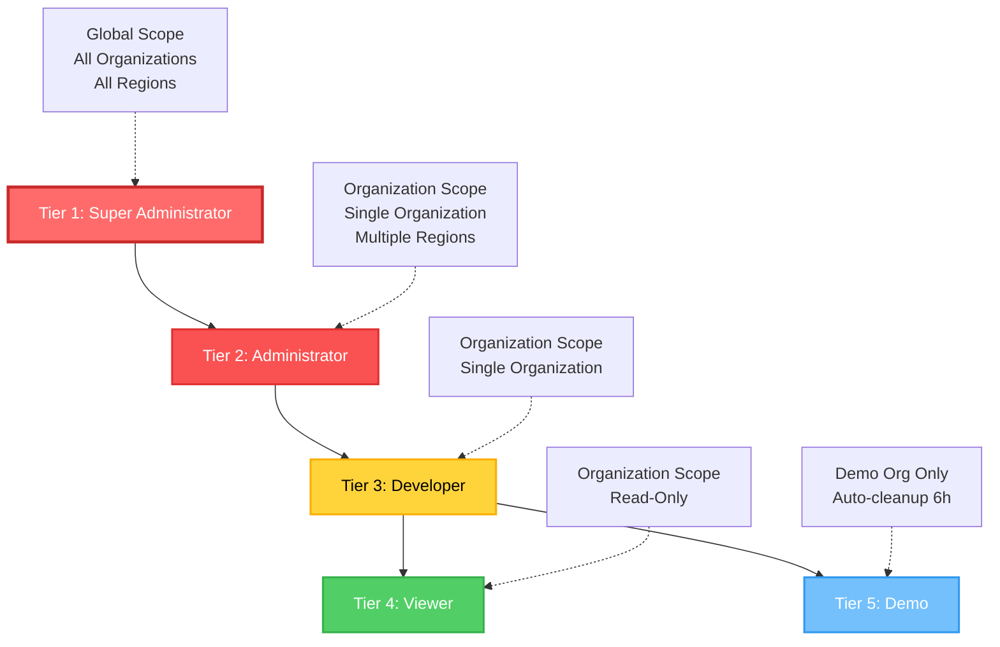

### Permission Flow Diagram

```mermaid
flowchart LR
    subgraph Global["🌍 Global (Super Admin)"]
        G1[All Organizations]
        G2[All Regions]
        G3[Platform Management]
        G4[System Admin]
    end

    subgraph Org["🏢 Organization (Admin/Dev/Viewer)"]
        O1[Single Organization]
        O2[Multiple Workspaces]
        O3[Multiple Tenants]
        O4[User Management]
    end

    subgraph Demo["🔬 Demo Environment (Demo)"]
        D1[Demo Organization]
        D2[Demo Workspace]
        D3[Demo Tenant]
        D4[Auto-cleanup 6h]
    end

    Global --> Org
    Org --> Demo

    style Global fill:#ff6b6b,stroke:#c92a2a,stroke-width:2px,color:#fff
    style Org fill:#ffd43b,stroke:#fab005,stroke-width:2px,color:#000
    style Demo fill:#74c0fc,stroke:#339af0,stroke-width:2px,color:#fff
```

### Detailed Hierarchy Diagram

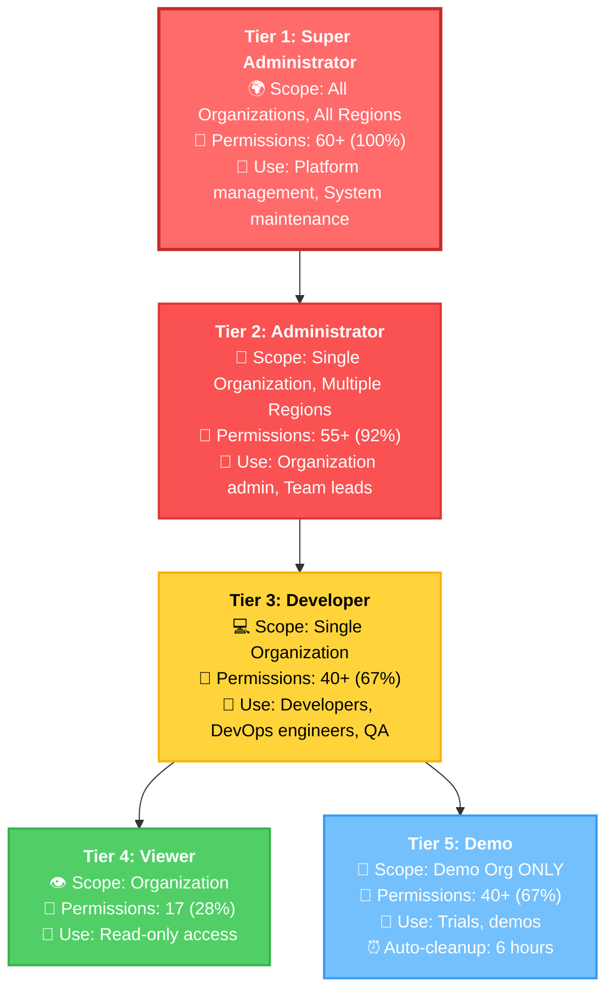

---

## 🔐 Role Details

### Tier 1: Super Administrator

**Scope**: 🌍 Global (all organizations, regions, workspaces, tenants)

**Description**: Can manage all the SaaS Platform across all organizations and regions

**Permission Count**: **60+** (100% of all permissions)

#### Permissions Breakdown

| Category | Permissions | Description |
|----------|-------------|-------------|
| **Platform** | platform:* | Full platform management |
| **IAM** | iam:*, users:*, roles:*, permissions:* | All identity and access operations |
| **Organizations** | organizations:* | All organization operations |
| **Regions** | regions:* | All region operations |
| **Workspaces** | workspaces:* | All workspace operations |
| **Tenants** | tenants:* | All tenant operations |
| **Telemetry** | metrics:*, logs:*, traces:* | All observability operations |
| **Dashboards** | dashboards:* | All dashboard operations |
| **Alerts** | alerts:*, alert-rule-groups:* | All alerting operations |
| **Monitoring** | monitoring:* | All monitoring operations |
| **Agents** | agents:* | All agent operations |
| **Uptime** | uptime:* | All uptime monitoring operations |
| **Audit** | audit-logs:read, audit-logs:export | Audit log access |
| **System** | system:* | System administration |

#### Use Cases

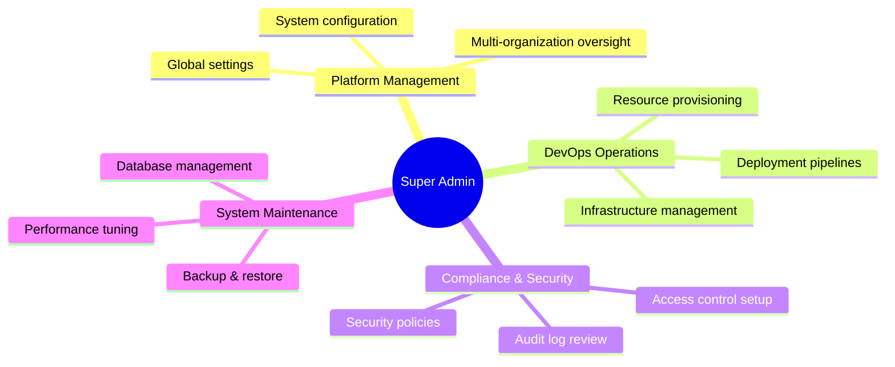

**Typical Users**:
- Platform administrators
- DevOps team managing infrastructure
- System maintenance engineers
- Security administrators

---

### Tier 2: Administrator

**Scope**: 🏢 Organization-scoped (single organization, multiple regions)

**Description**: Can manage all permissions within their organization across multiple regions

**Permission Count**: **55+** (92% of all permissions)

#### Permissions Breakdown

| Category | Permissions | Description |
|----------|-------------|-------------|
| **Platform** | ❌ None | No platform management |
| **Organizations** | organizations:read, organizations:update | Read/Update only (no create/delete) |
| **Users** | users:* | Full user CRUD within organization |
| **Roles** | roles:* | Full role CRUD within organization |
| **Permissions** | permissions:read | Read-only permission viewing |
| **Tenants** | tenants:* | Full tenant CRUD |
| **Workspaces** | workspaces:* | Full workspace CRUD |
| **Regions** | regions:read | Read-only region access |
| **Telemetry** | metrics:*, logs:*, traces:* | All observability operations |
| **Dashboards** | dashboards:* | All dashboard operations |
| **Alerts** | alerts:*, alert-rule-groups:* | All alerting operations |
| **Monitoring** | monitoring:* | All monitoring operations |
| **Agents** | agents:* | All agent operations |
| **Uptime** | uptime:* | All uptime operations |
| **Audit** | audit-logs:read, audit-logs:export | Audit log read/export |
| **System** | ❌ None | No system administration |

#### Capabilities vs Restrictions

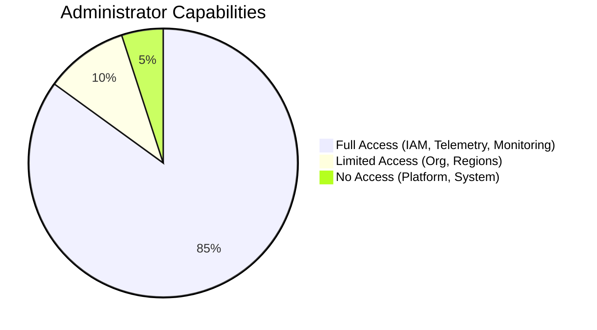

**Typical Users**:
- Organization administrators
- Team leads
- Department managers
- Workspace owners

---

### Tier 3: Developer

**Scope**: 💻 Organization-scoped (single organization)

**Description**: Can create and update resources within their organization, but cannot delete

**Permission Count**: **40+** (67% of all permissions)

#### Permissions Breakdown

| Category | Permissions | Description |
|----------|-------------|-------------|
| **Organizations** | organizations:read | Read-only |
| **Users** | users:create, users:read, users:update | No delete |
| **Roles** | roles:read | Read-only |
| **Permissions** | permissions:read | Read-only |
| **Tenants** | tenants:create, tenants:read, tenants:update | No delete |
| **Workspaces** | workspaces:create, workspaces:read, workspaces:update | No delete |
| **Regions** | regions:read | Read-only |
| **Metrics** | metrics:read, metrics:write | No delete |
| **Logs** | logs:read, logs:write | No delete |
| **Traces** | traces:read, traces:write | No delete |
| **Dashboards** | dashboards:create, dashboards:read, dashboards:update | No delete |
| **Alerts** | alerts:create, alerts:read, alerts:update | No delete/acknowledge |
| **Alert Rules** | alert-rule-groups:create, alert-rule-groups:read, alert-rule-groups:update | No delete |
| **Agents** | agents:create, agents:read, agents:update, agents:register | No delete |
| **Uptime** | uptime:create, uptime:read, uptime:update, uptime:check | No delete |
| **Audit** | audit-logs:read | Read-only |

#### Developer Workflow

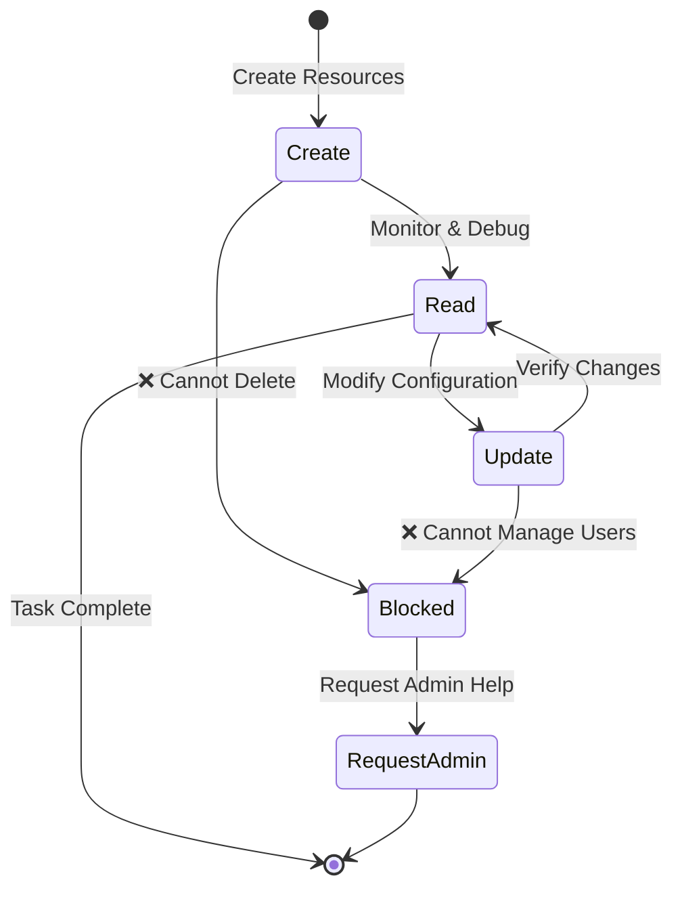

**Typical Users**:
- Software developers
- DevOps engineers
- QA engineers
- Site reliability engineers (SRE)

---

### Tier 4: Viewer

**Scope**: 👁️ Organization-scoped (single organization)

**Description**: Read-only access to resources within their organization

**Permission Count**: **17** (28% of all permissions)

#### Permissions Breakdown

| Category | Permissions | Description |
|----------|-------------|-------------|
| **All Resources** | *:read | Read-only for all resources |
| **Uptime** | uptime:read, uptime:check | Can check uptime status |
| **Write/Create/Update/Delete** | ❌ None | No modification allowed |

#### Read-Only Access Pattern

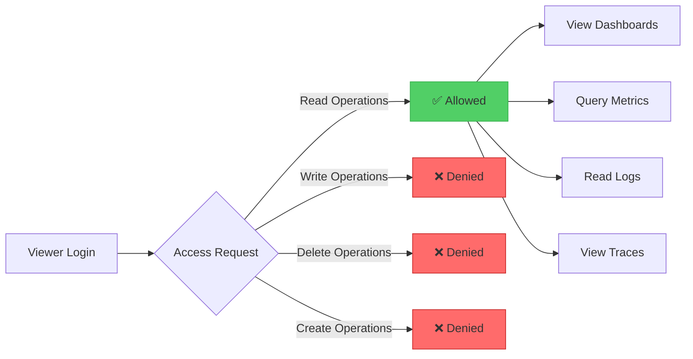

**Typical Users**:
- Business analysts
- Stakeholders
- External auditors
- Read-only monitoring users
- Customer support (viewing only)

---

### Tier 5: Demo (NEW)

**Scope**: 🔬 Demo Organization ONLY (org-demo, ws-demo, tn-demo)

**Description**: Developer access limited to Demo Organization, Demo Workspace, and Demo Tenant only

**Permission Count**: **40+** (67% - same as Developer)

**Auto-Cleanup**: ⏰ Every 6 hours

#### Permissions Breakdown

| Category | Permissions | Restrictions |
|----------|-------------|--------------|
| **All Developer Permissions** | Same as Tier 3 | 🔒 Demo Org ONLY |
| **Organization Access** | organizations:read | 🔒 `org-demo` only |
| **Workspace Access** | workspaces:* | 🔒 `ws-demo` only |
| **Tenant Access** | tenants:* | 🔒 `tn-demo` only |
| **Data Retention** | All operations | ⏰ Auto-deleted every 6 hours |
| **Production Access** | ❌ None | 🔒 Cannot access production |

#### Demo Environment Isolation

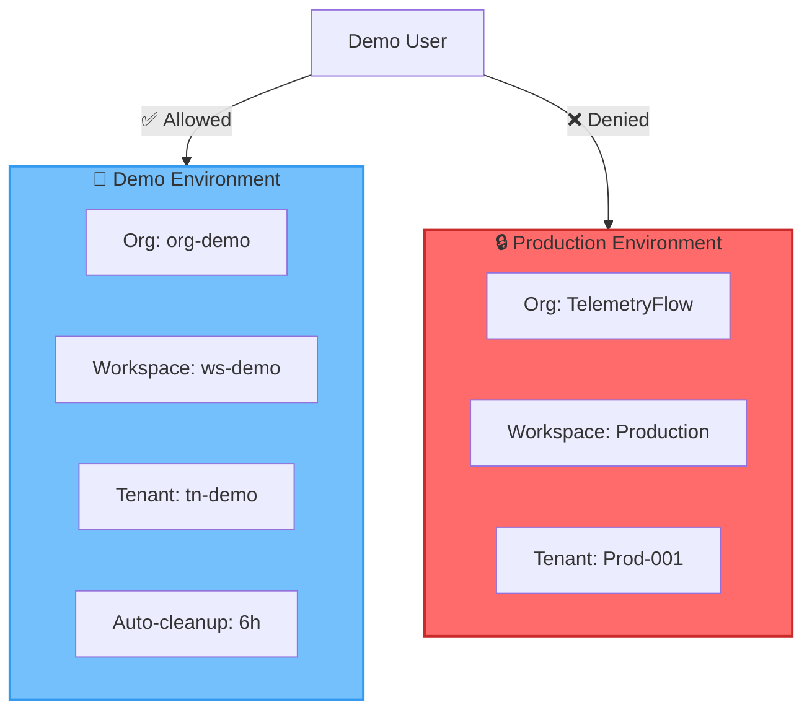

#### Demo Data Lifecycle

```mermaid
timeline
    title Demo Environment Data Lifecycle
    00:00 : Demo data created : User experiments : Data accumulates
    06:00 : Auto-cleanup triggered : All data deleted : Environment reset
    06:01 : Fresh seed data loaded : Ready for new demo : Cycle repeats
```

**Typical Users**:
- Product demonstration accounts
- Trial users (free tier)
- Training environments
- Feature testing
- Customer evaluations
- Proof-of-concept (POC) users

---

## 📊 Permission Comparison Matrices

### Complete Permission Matrix

| Permission Category | Super Admin | Administrator | Developer | Viewer | Demo |
|---------------------|-------------|---------------|-----------|--------|------|
| **Scope** | 🌍 Global | 🏢 Organization | 💻 Organization | 👁️ Organization | 🔬 Demo Org Only |
| **Permission Count** | 60+ (100%) | 55+ (92%) | 40+ (67%) | 17 (28%) | 40+ (67%) |
| **Platform Management** | ✅ Full | ❌ None | ❌ None | ❌ None | ❌ None |
| **System Administration** | ✅ Full | ❌ None | ❌ None | ❌ None | ❌ None |
| **Organization CRUD** | ✅ Full | 📖 Read/Update | 📖 Read | 📖 Read | 📖 Read (Demo only) |
| **User Management** | ✅ Full | ✅ Full | 📝 Create/Read/Update | 📖 Read | 📝 Create/Read/Update |
| **Role Management** | ✅ Full | ✅ Full | 📖 Read | 📖 Read | 📖 Read |
| **Permission Mgmt** | ✅ Full | 📖 Read | 📖 Read | 📖 Read | 📖 Read |
| **Tenant Management** | ✅ Full | ✅ Full | 📝 Create/Read/Update | 📖 Read | 📝 Create/Read/Update |
| **Workspace Mgmt** | ✅ Full | ✅ Full | 📝 Create/Read/Update | 📖 Read | 📝 Create/Read/Update |
| **Region Management** | ✅ Full | 📖 Read | 📖 Read | 📖 Read | 📖 Read |
| **Metrics** | ✅ Full | ✅ Full | 📊 Read/Write | 📖 Read | 📊 Read/Write |
| **Logs** | ✅ Full | ✅ Full | 📊 Read/Write | 📖 Read | 📊 Read/Write |
| **Traces** | ✅ Full | ✅ Full | 📊 Read/Write | 📖 Read | 📊 Read/Write |
| **Dashboards** | ✅ Full | ✅ Full | 📝 Create/Read/Update | 📖 Read | 📝 Create/Read/Update |
| **Alerts** | ✅ Full | ✅ Full | 📝 Create/Read/Update | 📖 Read | 📝 Create/Read/Update |
| **Alert Rule Groups** | ✅ Full | ✅ Full | 📝 Create/Read/Update | 📖 Read | 📝 Create/Read/Update |
| **Agents** | ✅ Full | ✅ Full | 📝 Create/Read/Update/Register | 📖 Read | 📝 Create/Read/Update/Register |
| **Uptime Monitoring** | ✅ Full | ✅ Full | 📝 Create/Read/Update/Check | 📖 Read/Check | 📝 Create/Read/Update/Check |
| **Audit Logs** | ✅ Read/Export | ✅ Read/Export | 📖 Read | 📖 Read | 📖 Read |
| **Delete Operations** | ✅ Yes | ✅ Yes | ❌ No | ❌ No | ❌ No |
| **Export Operations** | ✅ Yes | ✅ Yes | ❌ No | ❌ No | ❌ No |
| **Data Retention** | ♾️ Permanent | ♾️ Permanent | ♾️ Permanent | ♾️ Permanent | ⏰ 6 hours |
| **Multi-Org Access** | ✅ Yes | ❌ No | ❌ No | ❌ No | ❌ No |

**Legend**:
- ✅ Full = Full CRUD access
- 📝 Create/Read/Update = No delete
- 📊 Read/Write = No delete
- 📖 Read = Read-only
- ❌ None = No access

### CRUD Operations Matrix

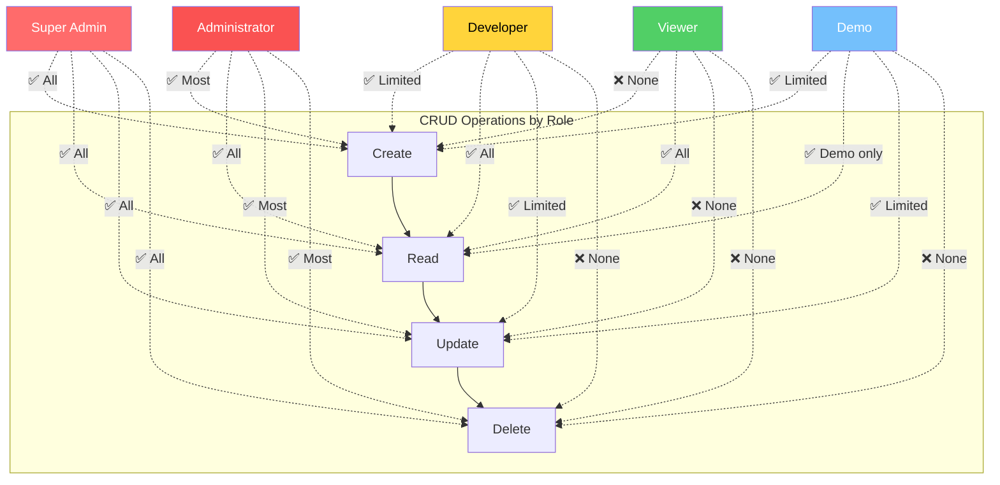

### Scope & Access Comparison

| Aspect | Super Admin | Administrator | Developer | Viewer | Demo |
|--------|-------------|---------------|-----------|--------|------|
| **Geographic Scope** | 🌍 All Regions | 🌍 Multiple Regions | 🗺️ Single Region | 🗺️ Single Region | 📍 Demo Region Only |
| **Org Access** | 🏢 All Organizations | 🏢 Single Org | 🏢 Single Org | 🏢 Single Org | 🏢 Demo Org ONLY |
| **Workspace Access** | 📁 All Workspaces | 📁 All in Org | 📁 All in Org | 📁 All in Org | 📁 Demo Workspace ONLY |
| **Tenant Access** | 🏷️ All Tenants | 🏷️ All in Org | 🏷️ All in Org | 🏷️ All in Org | 🏷️ Demo Tenant ONLY |
| **Cross-Org Access** | ✅ Yes | ❌ No | ❌ No | ❌ No | ❌ No |
| **Production Access** | ✅ Yes | ✅ Yes | ✅ Yes | ✅ Yes | ❌ No (Demo only) |
| **Multi-Tenancy** | ✅ All Tenants | ✅ Org Tenants | ✅ Org Tenants | ✅ Org Tenants | 🔒 Demo Tenant |
| **Data Isolation** | 🔓 None (Full access) | 🔒 Org-level | 🔒 Org-level | 🔒 Org-level | 🔒🔒 Demo-level |

### Permission Count Breakdown

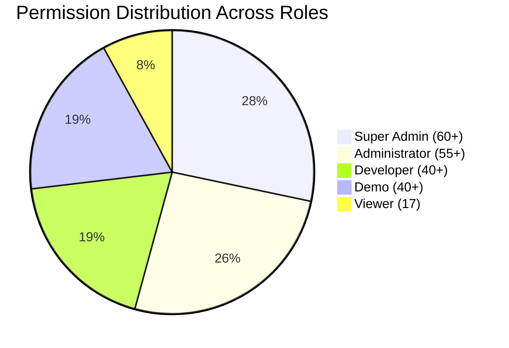

### Access Level Comparison

| Access Level | Super Admin | Administrator | Developer | Viewer | Demo |
|--------------|-------------|---------------|-----------|--------|------|
| **Global Platform** | ⭐⭐⭐⭐⭐ | ⚫⚫⚫⚫⚫ | ⚫⚫⚫⚫⚫ | ⚫⚫⚫⚫⚫ | ⚫⚫⚫⚫⚫ |
| **Organization Mgmt** | ⭐⭐⭐⭐⭐ | ⭐⭐⭐⭐⚫ | ⭐⚫⚫⚫⚫ | ⭐⚫⚫⚫⚫ | ⭐⚫⚫⚫⚫ |
| **User Management** | ⭐⭐⭐⭐⭐ | ⭐⭐⭐⭐⭐ | ⭐⭐⭐⚫⚫ | ⭐⚫⚫⚫⚫ | ⭐⭐⭐⚫⚫ |
| **Resource CRUD** | ⭐⭐⭐⭐⭐ | ⭐⭐⭐⭐⭐ | ⭐⭐⭐⚫⚫ | ⭐⚫⚫⚫⚫ | ⭐⭐⭐⚫⚫ |
| **Telemetry Write** | ⭐⭐⭐⭐⭐ | ⭐⭐⭐⭐⭐ | ⭐⭐⭐⭐⚫ | ⚫⚫⚫⚫⚫ | ⭐⭐⭐⭐⚫ |
| **Telemetry Read** | ⭐⭐⭐⭐⭐ | ⭐⭐⭐⭐⭐ | ⭐⭐⭐⭐⭐ | ⭐⭐⭐⭐⭐ | ⭐⭐⭐⭐⭐ |
| **Delete Operations** | ⭐⭐⭐⭐⭐ | ⭐⭐⭐⭐⭐ | ⚫⚫⚫⚫⚫ | ⚫⚫⚫⚫⚫ | ⚫⚫⚫⚫⚫ |
| **System Admin** | ⭐⭐⭐⭐⭐ | ⚫⚫⚫⚫⚫ | ⚫⚫⚫⚫⚫ | ⚫⚫⚫⚫⚫ | ⚫⚫⚫⚫⚫ |

**Legend**: ⭐ = Has access, ⚫ = No access

---

## 🔄 Role Assignment

### Default Users

| User | Email | Role | Organization | Workspace | Tenant | Password |
|------|-------|------|--------------|-----------|--------|----------|
| Super Administrator | super.administrator@telemetryflow.id | super_administrator | All | All | All | `TelemetryFlow@2025` |
| Administrator TelemetryFlow | admin.telemetryflow@telemetryflow.id | administrator | TelemetryFlow | All in Org | All in Org | `TelemetryFlow@2025` |
| Developer TelemetryFlow | developer.telemetryflow@telemetryflow.id | developer | TelemetryFlow | All in Org | All in Org | `TelemetryFlow@2025` |
| Viewer TelemetryFlow | viewer.telemetryflow@telemetryflow.id | viewer | TelemetryFlow | All in Org | All in Org | `TelemetryFlow@2025` |
| Demo TelemetryFlow | demo.telemetryflow@telemetryflow.id | demo | Demo Org | Demo WS | Demo Tenant | `TelemetryFlow@2025` |

### Role Assignment Flow

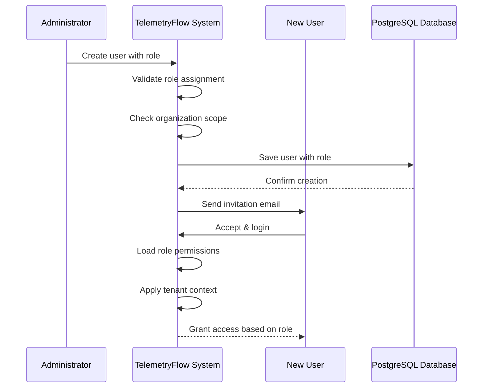

### Role Migration Path

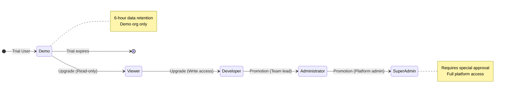

---

## 🛡️ Security Features

### Multi-Tenancy Isolation

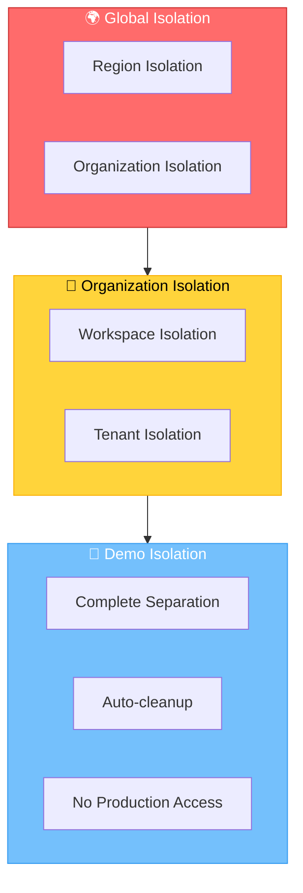

#### Isolation Layers

| Layer | Super Admin | Administrator | Developer | Viewer | Demo |
|-------|-------------|---------------|-----------|--------|------|
| **Region** | ✅ All regions | ✅ Org regions | ✅ Org regions | ✅ Org regions | 🔒 Demo region |
| **Organization** | ✅ All orgs | 🔒 Single org | 🔒 Single org | 🔒 Single org | 🔒 Demo org ONLY |
| **Workspace** | ✅ All workspaces | ✅ Org workspaces | ✅ Org workspaces | ✅ Org workspaces | 🔒 Demo workspace |
| **Tenant** | ✅ All tenants | ✅ Org tenants | ✅ Org tenants | ✅ Org tenants | 🔒 Demo tenant |
| **Data Isolation** | 🔓 None | 🔒 Org-level | 🔒 Org-level | 🔒 Org-level | 🔒🔒 Demo-level |

### Demo Environment Protection

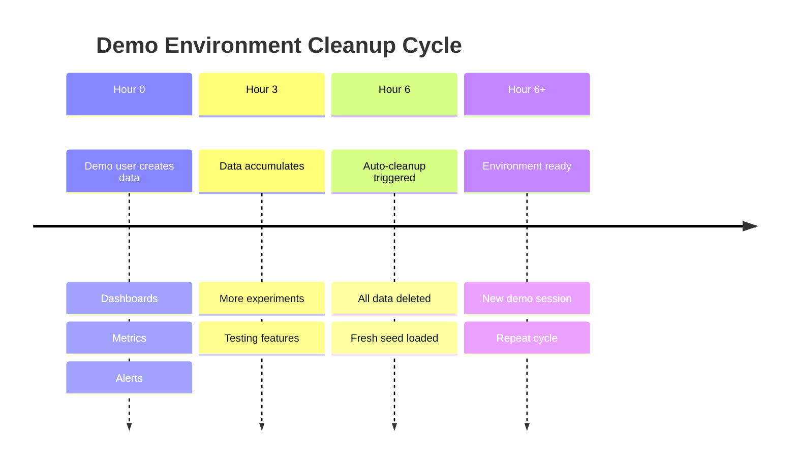

#### Demo Protection Mechanisms

| Protection | Status | Description |
|------------|--------|-------------|
| **Data Isolation** | ✅ Active | Cannot access production organizations |
| **Workspace Lock** | ✅ Active | Cannot access production workspaces |
| **Tenant Lock** | ✅ Active | Cannot access production tenants |
| **Auto-cleanup** | ✅ Active | Data deleted every 6 hours |
| **Separate Domain** | ✅ Active | `demo.telemetryflow.id` |
| **Read-only Production** | ✅ Active | No read access to production |
| **Rate Limiting** | ✅ Active | API rate limits enforced |
| **Resource Quotas** | ✅ Active | Limited metrics, logs, traces |

### Permission Enforcement Flow

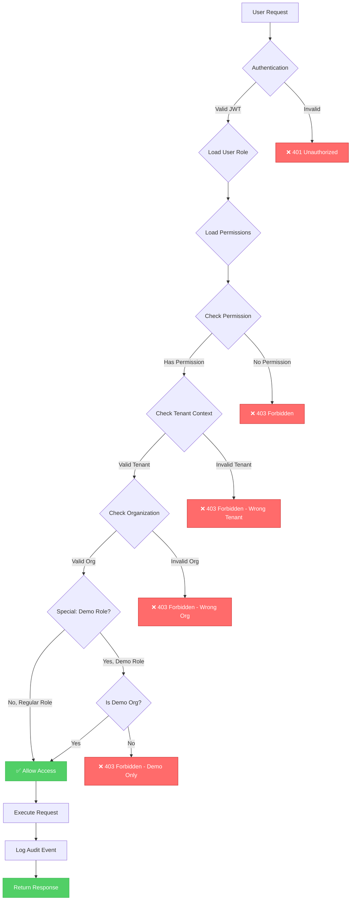

### Audit Logging

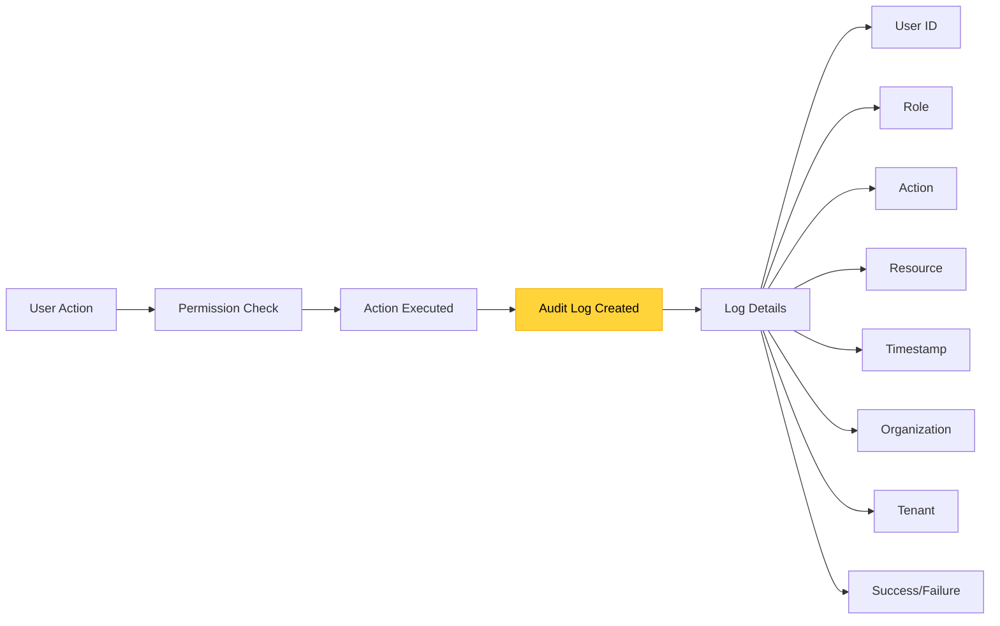

---

## 📝 Implementation Notes

### Architecture Overview

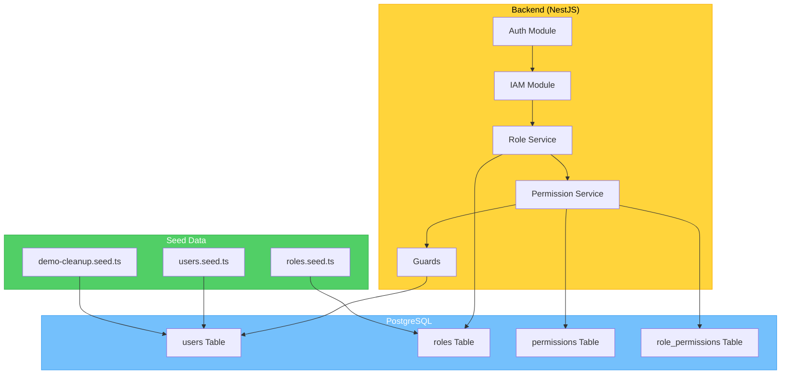

### Role Seeding Process

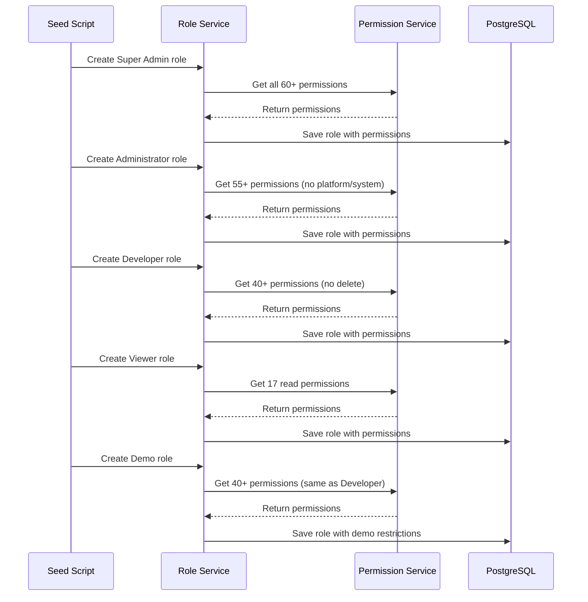

### User Assignment Process

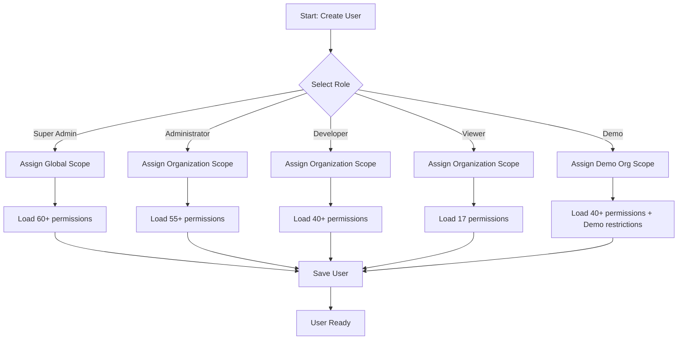

### Demo Cleanup Process

```mermaid
sequenceDiagram
    participant Cron as Cron Job (Every 6h)
    participant Cleanup as Cleanup Service
    participant DB as PostgreSQL
    participant ClickHouse as ClickHouse
    participant Seed as Seed Service

    Cron->>Cleanup: Trigger cleanup
    Cleanup->>DB: Delete demo users (except default)
    Cleanup->>DB: Delete demo dashboards
    Cleanup->>DB: Delete demo alerts
    Cleanup->>ClickHouse: Delete demo metrics
    Cleanup->>ClickHouse: Delete demo logs
    Cleanup->>ClickHouse: Delete demo traces

    Cleanup->>Seed: Re-seed demo data
    Seed->>DB: Create fresh demo user
    Seed->>DB: Create sample dashboards
    Seed->>ClickHouse: Insert sample metrics

    Seed-->>Cleanup: Seeding complete
    Cleanup-->>Cron: Cleanup complete
```

### Permission Expansion

**Before** (Wildcards):
```typescript
permissions: ['metrics:*', 'logs:*']
```

**After** (Explicit):
```typescript
permissions: [
  'metrics:read',
  'metrics:write',
  'metrics:delete',
  'metrics:export',
  'logs:read',
  'logs:write',
  'logs:delete',
  'logs:export'
]
```

**Why?**
- ✅ Explicit permissions for clarity
- ✅ Better security auditing
- ✅ Easier permission debugging
- ✅ No unexpected wildcard expansion

---

## 🎯 Best Practices

### Security Best Practices

```mermaid
mindmap
  root((RBAC Best Practices))
    Principle of Least Privilege
      Assign minimum required permissions
      Start with Viewer, upgrade as needed
      Review permissions quarterly
    Role Separation
      Use appropriate role for each user
      No shared accounts
      Separate prod and demo users
    Demo Isolation
      Keep demo users in demo org only
      Never grant production access
      Monitor demo usage patterns
    Regular Audits
      Review role assignments monthly
      Check audit logs weekly
      Identify permission anomalies
    Password Security
      Enforce 12+ character passwords
      Require uppercase + special chars
      Rotate passwords every 90 days
    MFA Enforcement
      Mandatory for Super Admin
      Mandatory for Administrator
      Optional but recommended for Developer
```

### Role Assignment Decision Tree

```mermaid
flowchart TD
    A[New User Needs Access] --> B{What is their primary role?}

    B -->|Platform Management| C[Super Administrator]
    B -->|Org Management| D[Administrator]
    B -->|Development Work| E[Developer]
    B -->|Monitoring Only| F[Viewer]
    B -->|Trial/Demo| G[Demo]

    C --> H{Do they need global access?}
    H -->|Yes| I[✅ Assign Super Admin]
    H -->|No| J[⚠️ Reconsider - Use Administrator instead]

    D --> K{Manage users and resources?}
    K -->|Yes| L[✅ Assign Administrator]
    K -->|No| M[⚠️ Reconsider - Use Developer instead]

    E --> N{Need to delete resources?}
    N -->|Yes| O[⚠️ Reconsider - Use Administrator instead]
    N -->|No| P[✅ Assign Developer]

    F --> Q{Need to create/modify?}
    Q -->|Yes| R[⚠️ Reconsider - Use Developer instead]
    Q -->|No| S[✅ Assign Viewer]

    G --> T{Production access needed?}
    T -->|Yes| U[⚠️ Reconsider - Use Developer instead]
    T -->|No| V[✅ Assign Demo]
```

### Permission Review Checklist

| Check | Frequency | Owner | Action |
|-------|-----------|-------|--------|
| **Review role assignments** | Monthly | Administrator | Remove inactive users |
| **Audit permission usage** | Quarterly | Super Admin | Identify over-privileged users |
| **Check demo cleanup** | Weekly | DevOps | Verify auto-cleanup working |
| **Review audit logs** | Weekly | Security Team | Identify suspicious activity |
| **Password rotation** | 90 days | All users | Enforce password changes |
| **MFA status check** | Monthly | Administrator | Ensure MFA enabled for admins |
| **Demo org isolation** | Daily | System | Verify no production access |

---

## 🔄 Core Implementation Details

### Database Structure

| Database | Purpose | Tables |
|----------|---------|--------|
| **PostgreSQL** | IAM data storage | users, roles, permissions, role_permissions, user_roles, organizations, tenants, workspaces, regions, groups |
| **ClickHouse** | Audit log storage | audit_logs, audit_logs_stats, audit_logs_user_activity |

### Seed Files

| Order | File | Purpose | Records |
|-------|------|---------|---------||
| 1 | `1704240000001-seed-iam-roles-permissions.ts` | Create 5 roles with explicit permissions | 5 roles, 22+ permissions |
| 2 | `1704240000002-seed-auth-test-users.ts` | Create test users for each role | 5 users |
| 3 | `1704240000003-seed-groups.ts` | Create user groups | 4 groups |

### Permission Enforcement Components

| Component | Location | Purpose |
|-----------|----------|---------||
| **Guards** | `@RequirePermissions()` decorator | Checks user permissions before controller execution |
| **Decorators** | `@CurrentUser()` | Extracts authenticated user from request |
| **Repositories** | Auto-scoping queries | Automatically filters by organization/tenant |
| **Audit** | ClickHouse service | Logs all actions to audit_logs table |

### Multi-Tenancy Implementation

| Level | Implementation | Example |
|-------|----------------|---------||
| **Organization** | Query filter | `WHERE organizationId = :orgId` |
| **Tenant** | Repository scoping | `findByTenant(tenantId)` |
| **Workspace** | Resource filtering | `WHERE workspaceId = :wsId` |
| **Demo** | Separate organization | `organizationId = 'org-demo'` |

### Security Request Flow

```mermaid
graph LR
    A[Request] --> B{Authentication}
    B -->|Valid JWT| C{Authorization}
    B -->|Invalid| X[401 Unauthorized]

    C --> D{Role Check}
    D -->|Has Role| E{Permission Check}
    D -->|No Role| Y[403 Forbidden]

    E -->|Has Permission| F{Scope Check}
    E -->|No Permission| Y

    F -->|Organization Match| G{Tenant Filter}
    F -->|No Match| Y

    G -->|Allowed| H[Execute Query]
    G -->|Denied| Y

    H --> I[Audit Log]
    I --> J[Response]

    style A fill:#e3f2fd
    style B fill:#fff3e0
    style C fill:#fff3e0
    style D fill:#f3e5f5
    style E fill:#f3e5f5
    style F fill:#e8f5e9
    style G fill:#e8f5e9
    style H fill:#e1f5fe
    style I fill:#fce4ec
    style J fill:#e8f5e9
    style X fill:#ffebee
    style Y fill:#ffebee
```

---

## 🚀 Usage & Testing

### Login Credentials

```bash
# Super Administrator
Email: super.administrator@telemetryflow.id
Password: SuperAdmin@123456

# Administrator
Email: admin.telemetryflow@telemetryflow.id
Password: Admin@123456

# Developer
Email: developer.telemetryflow@telemetryflow.id
Password: Developer@123456

# Viewer
Email: viewer.telemetryflow@telemetryflow.id
Password: Viewer@123456

# Demo
Email: demo.telemetryflow@telemetryflow.id
Password: Demo@123456
```

⚠️ **Security Warning:** Change these default passwords immediately in production!

### API Access

All users can access the API at: **http://localhost:3100/api/v2**

Use Swagger UI at **http://localhost:3100/docs** to test different permission levels and see which endpoints are accessible for each role.

### Testing Permissions

1. **Login with different roles** to see permission differences
2. **Try CRUD operations** to verify access control
3. **Check Swagger UI** for available endpoints per role
4. **Review audit logs** to track all actions

### Seeding RBAC System

The 5-tier RBAC system is automatically seeded when running:

```bash
# Seed IAM data only
pnpm db:seed:iam

# Seed all data (PostgreSQL + ClickHouse)
pnpm db:seed

# Run migrations + seeds
pnpm db:migrate:seed

# Full bootstrap (dependencies, Docker, migrations, seeds)
bash scripts/bootstrap.sh --dev
```

---

## 📊 Additional Permission Details

### Multi-Tenancy Isolation Features

| Feature | Description | Implementation |
|---------|-------------|----------------|
| **Organization-level** | Data isolated by organization | Query filters: `WHERE organizationId = :orgId` |
| **Tenant-level** | Query filtering per tenant | Automatic tenant scoping in repositories |
| **Workspace-level** | Resource scoping per workspace | Workspace-based access control |
| **Demo isolation** | Complete separation from production | Separate organization with auto-cleanup |

### Demo Environment Protection Details

| Feature | Description | Status |
|---------|-------------|--------|
| **Auto-cleanup** | Data deleted every 6 hours | ✅ Implemented |
| **Production isolation** | Cannot access production orgs | ✅ Enforced |
| **Workspace isolation** | Cannot access production workspaces | ✅ Enforced |
| **Tenant isolation** | Cannot access production tenants | ✅ Enforced |
| **Separate domain** | `demo.telemetryflow.id` | ✅ Configured |

### Permission Enforcement Layers

| Layer | Mechanism | Description |
|-------|-----------|-------------|
| **Authentication** | JWT tokens | Validates user identity |
| **Authorization** | `@RequirePermissions()` decorator | Checks user permissions before execution |
| **Scoping** | Query filters | Automatically filters by organization/tenant |
| **Audit** | ClickHouse audit_logs | Logs all actions with user context |
| **Validation** | Guards & Interceptors | Validates request data and permissions |

---

## 📚 Related Documentation

- **IAM Module**: `/backend/src/modules/iam/`
- **Auth Module**: `/backend/src/modules/auth/`
- **Role Seed**: `/backend/src/database/seeds/roles.seed.ts`
- **User Seed**: `/backend/src/database/seeds/users.seed.ts`
- **Demo Cleanup**: `/backend/src/database/seeds/demo-cleanup.seed.ts`
- **Guards**: `/backend/src/modules/iam/guards/`
- **Permissions**: `/backend/src/modules/iam/domain/permissions/`

---

## ✅ Summary

### RBAC System Highlights

```mermaid
pie title Permission Distribution
    "Super Admin (100%)" : 100
    "Administrator (92%)" : 92
    "Developer (67%)" : 67
    "Viewer (28%)" : 28
    "Demo (67% with restrictions)" : 67
```

### Key Features

| Feature | Status | Description |
|---------|--------|-------------|
| **5-Tier Hierarchy** | ✅ Complete | Super Admin → Admin → Developer → Viewer, Demo |
| **60+ Permissions** | ✅ Complete | Granular permission system |
| **Multi-Tenancy** | ✅ Complete | Organization, Workspace, Tenant isolation |
| **Demo Environment** | ✅ Complete | Isolated demo org with auto-cleanup |
| **Audit Logging** | ✅ Complete | All actions logged for compliance |
| **MFA Support** | ✅ Complete | Optional MFA for all roles |
| **Auto-Cleanup** | ✅ Complete | Demo data deleted every 6 hours |
| **Explicit Permissions** | ✅ Complete | No wildcards, all explicit |

---

- **Document**: 06-RBAC-SYSTEM-PLATFORM.md
- **Version**: 3.0 (Complete Platform + Core Integration)
- **Date**: 2025-12-12
- **Status**: ✅ Complete
