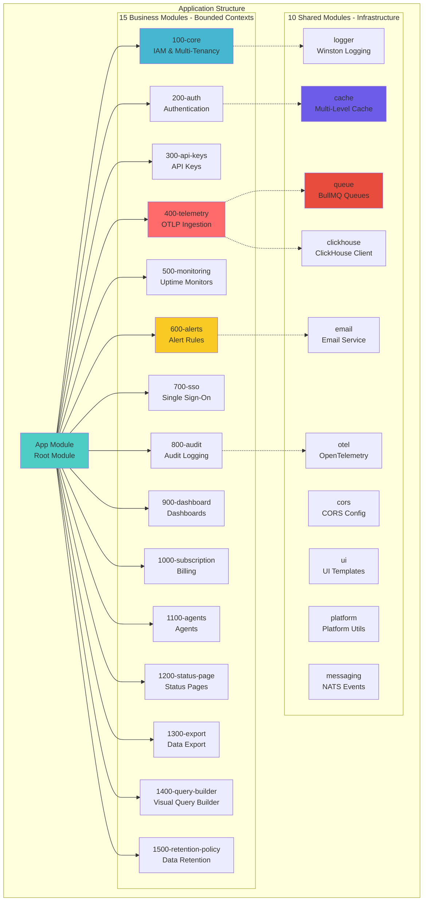

# Backend Architecture Overview

- **Version:** 1.0.0-CE
- **Last Updated:** December 12, 2025
- **Status:** ✅ Complete

---

## Table of Contents

1. [Introduction](#introduction)
2. [Technology Stack](#technology-stack)
3. [Architecture Principles](#architecture-principles)
4. [Module Organization](#module-organization)
5. [Shared Modules](#shared-modules)
6. [Layer Architecture](#layer-architecture)
7. [Module Structure (LEGO Pattern)](#module-structure-lego-pattern)
8. [Module Dependencies](#module-dependencies)
9. [Getting Started](#getting-started)

---

## Introduction

The TelemetryFlow backend is built as a **modular monolith** using **NestJS 11.x**, implementing **Domain-Driven Design (DDD)** and **CQRS** patterns. The architecture is designed for:

- **Modularity:** 15 bounded contexts (business modules) + 10 shared modules
- **Scalability:** Each module can be extracted into a microservice
- **Maintainability:** Clear separation of concerns with 4-layer architecture
- **Observability:** Built-in OpenTelemetry instrumentation
- **Multi-Tenancy:** Tenant isolation at database and application layers

### Key Characteristics


---

## Technology Stack

### Core Framework


### Key Dependencies

| Category | Technology | Version | Purpose |
|----------|------------|---------|---------|
| **Framework** | NestJS | 11.x | Enterprise application framework |
| **Language** | TypeScript | 5.9.3 | Type-safe development |
| **Runtime** | Node.js | 18-20.x | JavaScript runtime |
| **PostgreSQL ORM** | TypeORM | 0.3.x | Relational data persistence |
| **ClickHouse** | @clickhouse/client | 1.x | Time-series data client |
| **Redis** | ioredis | 5.x | Cache & queue backend |
| **Queue** | BullMQ | 5.x | Async job processing |
| **Validation** | class-validator | 0.14.x | DTO validation |
| **Transformation** | class-transformer | 0.5.x | DTO transformation |
| **CQRS** | @nestjs/cqrs | 11.x | Command/Query pattern |
| **Scheduling** | @nestjs/schedule | 4.x | Cron jobs |
| **Rate Limiting** | @nestjs/throttler | 6.x | API rate limiting |
| **Authentication** | @nestjs/jwt | 11.x | JWT token management |
| **Passport** | @nestjs/passport | 11.x | Auth strategies |
| **Logging** | winston | 3.x | Structured logging |
| **Telemetry** | @opentelemetry/api | 1.x | Observability |

---

## Architecture Principles

### 1. Modular Monolith Architecture



### 2. Domain-Driven Design (DDD)

**Core Concepts:**


**Example Aggregates:**

| Module | Aggregates | Value Objects |
|--------|-----------|---------------|
| **100-core** | User, Organization, Workspace, Tenant, Role | Email, TenantId, WorkspaceId, UserId |
| **400-telemetry** | Metric, Log, Trace, Span | MetricName, Timestamp, Attributes |
| **600-alerts** | AlertRule, Notification, Incident | Threshold, Channel, Severity |
| **900-dashboard** | Dashboard, Widget | Layout, Query, Visualization |

### 3. CQRS (Command Query Responsibility Segregation)


**Benefits:**
- ✅ Separate write and read optimization
- ✅ Independent scaling of commands and queries
- ✅ Event sourcing for audit trails
- ✅ Clearer business logic separation

### 4. Event-Driven Architecture


---

## Module Organization

### Module Numbering Convention

TelemetryFlow uses a **numerical prefix** for module organization:


### Module Categories


### Core Module Hierarchy


---

## Shared Modules

Shared modules provide **infrastructure services** used across all business modules.


### Shared Module Summary

| Module | Purpose | Key Features |
|--------|---------|--------------|
| **logger** | Structured logging with OTEL | Winston 3.x, JSON format, trace correlation |
| **cache** | Multi-level caching | L1 in-memory (60s), L2 Redis (30min) |
| **queue** | Async job processing | BullMQ, 5 queues, retry strategies |
| **clickhouse** | ClickHouse client | Query builder, connection pooling |
| **email** | Email notifications | Nodemailer, template engine |
| **cors** | CORS configuration | Environment-based CORS rules |
| **otel** | OpenTelemetry instrumentation | Auto-instrumentation, exporters |
| **ui** | UI template rendering | Handlebars templates |
| **platform** | Platform utilities | Common helpers, constants |
| **messaging** | Event streaming | NATS messaging system |

---

## Layer Architecture

TelemetryFlow implements a **4-layer architecture** per module:


### Dependency Flow


**Key Principle:** Dependencies point **INWARD** toward the domain layer. The domain layer has **zero dependencies** on outer layers.

---

## Module Structure (LEGO Pattern)

Each module follows a **standardized structure** (LEGO pattern) for consistency:


### Folder Structure Example

```
400-telemetry/
├── 400-telemetry.module.ts          # Module definition
├── presentation/                     # Layer 1: HTTP/REST
│   ├── controllers/
│   │   ├── metrics.controller.ts
│   │   ├── logs.controller.ts
│   │   └── traces.controller.ts
│   ├── dtos/
│   │   ├── ingest-metrics.dto.ts
│   │   └── query-metrics.dto.ts
│   └── guards/
│       └── api-key-auth.guard.ts
├── application/                      # Layer 2: Orchestration
│   ├── commands/
│   │   └── ingest-metrics.command.ts
│   ├── queries/
│   │   └── get-metrics.query.ts
│   ├── handlers/
│   │   ├── ingest-metrics.handler.ts
│   │   └── get-metrics.handler.ts
│   └── services/
│       └── telemetry.service.ts
├── domain/                           # Layer 3: Business Logic
│   ├── aggregates/
│   │   ├── metric.aggregate.ts
│   │   └── log.aggregate.ts
│   ├── value-objects/
│   │   ├── metric-name.vo.ts
│   │   └── timestamp.vo.ts
│   ├── events/
│   │   └── metric-ingested.event.ts
│   └── repositories/
│       └── metric.repository.interface.ts
└── infrastructure/                   # Layer 4: External Systems
    ├── persistence/
    │   ├── typeorm/
    │   │   └── entities/
    │   └── clickhouse/
    │       ├── schemas/
    │       │   └── metrics.schema.ts
    │       └── repositories/
    │           └── metric.repository.ts
    └── mappers/
        └── metric.mapper.ts
```

---

## Module Dependencies

### Dependency Graph


### Module Communication

**Modules communicate via:**

1. **Domain Events (EventBus)** - Preferred for async communication
2. **Shared Interfaces** - For direct method calls (discouraged)
3. **API Calls** - For cross-boundary communication


---

## Getting Started

### Prerequisites

- **Node.js** 18.x or 20.x
- **pnpm** 8.x or higher
- **PostgreSQL** 15+
- **ClickHouse** 23+
- **Redis** 7+

### Installation

```bash
# Clone repository
git clone https://github.com/telemetryflow/telemetryflow.git

# Navigate to backend
cd telemetryflow/backend

# Install dependencies
pnpm install

# Copy environment variables
cp .env.example .env

# Run database migrations
pnpm migration:run

# Start development server
pnpm start:dev
```

### Project Scripts

```bash
# Development
pnpm start:dev          # Start dev server with hot reload
pnpm start:debug        # Start with debugging

# Build
pnpm build              # Build for production
pnpm start:prod         # Start production server

# Testing
pnpm test               # Run unit tests
pnpm test:e2e           # Run end-to-end tests
pnpm test:cov           # Generate coverage report

# Database
pnpm migration:generate # Generate new migration
pnpm migration:run      # Run pending migrations
pnpm migration:revert   # Revert last migration

# Linting
pnpm lint               # Run ESLint
pnpm format             # Format code with Prettier
```

### Environment Variables

```env
# Application
NODE_ENV=development
PORT=3000
API_PREFIX=api/v2

# Database - PostgreSQL
DB_HOST=localhost
DB_PORT=5432
DB_USERNAME=postgres
DB_PASSWORD=password
DB_DATABASE=telemetryflow

# Database - ClickHouse
CLICKHOUSE_HOST=localhost
CLICKHOUSE_PORT=8123
CLICKHOUSE_DATABASE=telemetry
CLICKHOUSE_USERNAME=default
CLICKHOUSE_PASSWORD=

# Redis
REDIS_HOST=localhost
REDIS_PORT=6379
REDIS_PASSWORD=

# JWT
JWT_SECRET=your-secret-key-change-in-production
JWT_EXPIRATION=15m
REFRESH_TOKEN_EXPIRATION=7d

# Rate Limiting
THROTTLE_TTL=60
THROTTLE_LIMIT=100
THROTTLE_INGESTION_LIMIT=1000

# OpenTelemetry
OTEL_EXPORTER_OTLP_ENDPOINT=http://localhost:4318
OTEL_SERVICE_NAME=telemetryflow-backend
```

---

## Module Development Guide

### Creating a New Module

```bash
# 1. Create module directory
mkdir -p src/modules/1600-new-feature

# 2. Create LEGO structure
mkdir -p src/modules/1600-new-feature/{presentation,application,domain,infrastructure}
mkdir -p src/modules/1600-new-feature/presentation/{controllers,dtos,guards}
mkdir -p src/modules/1600-new-feature/application/{commands,queries,handlers,services}
mkdir -p src/modules/1600-new-feature/domain/{aggregates,value-objects,events,repositories}
mkdir -p src/modules/1600-new-feature/infrastructure/{persistence,mappers,clients}

# 3. Create module file
touch src/modules/1600-new-feature/1600-new-feature.module.ts
```

### Module Template

```typescript
// 1600-new-feature.module.ts
import { Module } from '@nestjs/common';
import { CqrsModule } from '@nestjs/cqrs';

// Presentation Layer
import { NewFeatureController } from './presentation/controllers/new-feature.controller';

// Application Layer
import { CreateFeatureHandler } from './application/handlers/create-feature.handler';
import { GetFeatureHandler } from './application/handlers/get-feature.handler';

// Infrastructure Layer
import { FeatureRepository } from './infrastructure/persistence/typeorm/repositories/feature.repository';

const CommandHandlers = [CreateFeatureHandler];
const QueryHandlers = [GetFeatureHandler];
const EventHandlers = [];

@Module({
  imports: [CqrsModule],
  controllers: [NewFeatureController],
  providers: [
    ...CommandHandlers,
    ...QueryHandlers,
    ...EventHandlers,
    FeatureRepository,
  ],
  exports: [FeatureRepository],
})
export class NewFeatureModule {}
```

---

## Testing Strategy


### Test Coverage Goals

| Layer | Target Coverage | Current |
|-------|----------------|---------|
| **Domain Layer** | 90% | 85% |
| **Application Layer** | 80% | 75% |
| **Infrastructure Layer** | 70% | 65% |
| **Presentation Layer** | 60% | 55% |
| **Overall** | 75% | 70% |

---

## Best Practices

### 1. Module Independence

✅ **Good:**
```typescript
// Module communicates via events
this.eventBus.publish(new MetricIngested(metric));
```

❌ **Bad:**
```typescript
// Direct cross-module dependency
import { AlertService } from '../600-alerts/application/services/alert.service';
```

### 2. Domain-First Development

✅ **Good:**
```typescript
// Start with domain aggregate
class Metric {
  validate() {
    if (this.value < 0) throw new InvalidMetricError();
  }
}
```

❌ **Bad:**
```typescript
// Start with database schema
@Entity()
class MetricEntity {
  @Column() value: number;
}
```

### 3. Use Value Objects

✅ **Good:**
```typescript
class Email {
  private readonly value: string;

  constructor(email: string) {
    if (!this.isValid(email)) throw new InvalidEmailError();
    this.value = email;
  }
}
```

❌ **Bad:**
```typescript
// Primitive obsession
function createUser(email: string) {
  // No validation
}
```

---

## Performance Considerations


---

## Documentation Index

### Architecture Docs
- [System Architecture](../architecture/01-SYSTEM-ARCHITECTURE.md) - High-level platform overview
- [Data Flow](../architecture/02-DATA-FLOW.md) - Request/response flows
- [Multi-Tenancy](../architecture/03-MULTI-TENANCY.md) - Tenant isolation
- [Security](../architecture/04-SECURITY.md) - Auth, RBAC, audit
- [Performance](../architecture/05-PERFORMANCE.md) - Optimization strategies

### Backend Docs
- **00-BACKEND-OVERVIEW.md** ← You are here
- [01-TECH-STACK.md](./01-TECH-STACK.md) - Technology stack details
- [02-DDD-CQRS.md](./02-DDD-CQRS.md) - DDD/CQRS implementation
- [03-MODULE-STRUCTURE.md](./03-MODULE-STRUCTURE.md) - LEGO pattern guide

### Module Docs
- [100-core](./modules/100-core.md) - IAM & Multi-Tenancy
- [200-auth](./modules/200-auth.md) - Authentication
- [400-telemetry](./modules/400-telemetry.md) - OTLP Ingestion
- [600-alerts](./modules/600-alerts.md) - Alert Rules
- [900-dashboard](./modules/900-dashboard.md) - Dashboards

---

- **File Location:** `./backend/00-BACKEND-OVERVIEW.md`
- **Maintained By:** DevOpsCorner Indonesia
- **Last Updated:** December 12, 2025
