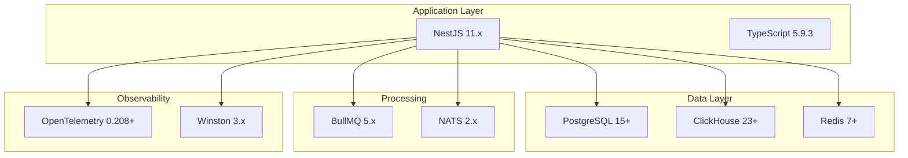
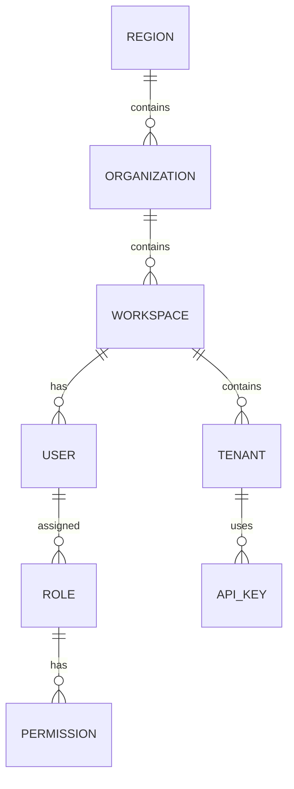
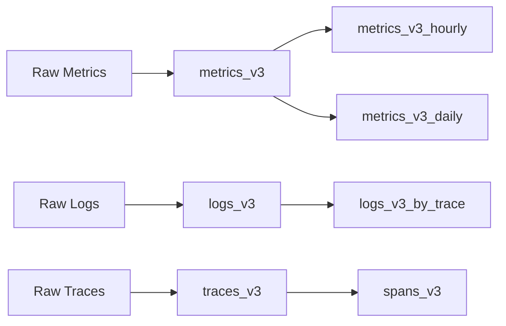
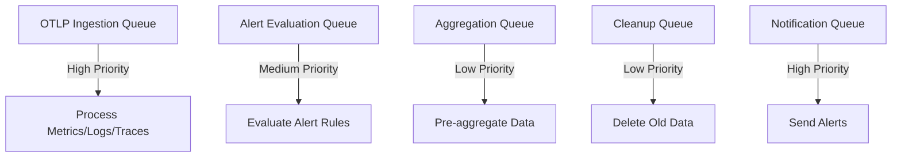

# Backend Technology Stack

- **Version:** 1.1.1-CE
- **Last Updated:** December 12, 2025
- **Status:** ✅ Production Ready

---

## Table of Contents

1. [Overview](#overview)
2. [Core Framework](#core-framework)
3. [Language & Runtime](#language--runtime)
4. [Databases](#databases)
5. [Caching & Queuing](#caching--queuing)
6. [Authentication & Security](#authentication--security)
7. [Observability & Telemetry](#observability--telemetry)
8. [Communication](#communication)
9. [Testing](#testing)
10. [Development Tools](#development-tools)
11. [Technology Decision Rationale](#technology-decision-rationale)

---

## Overview

**TelemetryFlow Backend** is built on a modern, enterprise-grade technology stack optimized for:
- **High Performance** - Sub-second query responses, millions of metrics/second
- **Scalability** - Horizontal scaling with stateless architecture
- **Reliability** - 99.9% uptime, automatic failover
- **Observability** - Self-instrumented with OpenTelemetry
- **Developer Experience** - Type-safe, well-documented, easy to extend



---

## Core Framework

### NestJS 11.x

**Why NestJS?**
- Enterprise-grade architecture with dependency injection
- Built-in support for CQRS, Event Sourcing, Microservices
- Excellent TypeScript integration
- Large ecosystem and community
- Production-proven at scale

**Key Packages:**

| Package | Version | Purpose |
|---------|---------|---------|
| `@nestjs/common` | 11.1.9 | Core framework |
| `@nestjs/core` | 11.1.9 | Application core |
| `@nestjs/platform-express` | 11.1.9 | HTTP server (Express) |
| `@nestjs/cqrs` | 11.0.3 | CQRS pattern implementation |
| `@nestjs/config` | 4.0.2 | Environment configuration |
| `@nestjs/schedule` | 6.0.1 | Cron jobs and intervals |
| `@nestjs/swagger` | 11.2.3 | OpenAPI documentation |
| `@nestjs/terminus` | 11.0.0 | Health checks |
| `@nestjs/throttler` | 6.4.0 | Rate limiting |

**Architecture Patterns:**
```typescript
// NestJS Module Example
@Module({
  imports: [
    TypeOrmModule.forFeature([User]),
    CqrsModule,
  ],
  controllers: [UserController],
  providers: [
    UserService,
    ...CommandHandlers,
    ...QueryHandlers,
    ...EventHandlers,
  ],
  exports: [UserService],
})
export class UserModule {}
```

---

## Language & Runtime

### TypeScript 5.9.3

**Configuration (`tsconfig.json`):**
```json
{
  "compilerOptions": {
    "target": "ES2021",
    "module": "commonjs",
    "declaration": true,
    "removeComments": true,
    "emitDecoratorMetadata": true,
    "experimentalDecorators": true,
    "allowSyntheticDefaultImports": true,
    "sourceMap": true,
    "outDir": "./dist",
    "baseUrl": "./",
    "incremental": true,
    "skipLibCheck": true,
    "esModuleInterop": true,
    "resolveJsonModule": true
  }
}
```

**Type Safety Features:**
- Strict type checking for all domain models
- DTO validation with `class-validator`
- Compile-time null safety
- Automatic type inference

**Path Aliases:**
```typescript
{
  "@/logger": ["src/shared/logger"],
  "@/database/*": ["src/database/*"],
  "@/modules/*": ["src/modules/*"],
  "@/shared/*": ["src/shared/*"],
  "@/common/*": ["src/common/*"]
}
```

### Node.js 18-20.x

**Runtime Features:**
- ES2021 support
- Native async/await
- Worker threads for CPU-intensive tasks
- Built-in performance monitoring

**Recommended Version:** Node.js 20.x LTS

---

## Databases

### PostgreSQL 15+

**Purpose:** Metadata storage (users, workspaces, configuration)

**ORM:** TypeORM 0.3.27

**Key Features:**
- ACID transactions
- Complex relational queries
- JSON/JSONB support for flexible schemas
- Full-text search
- Row-level security (RLS) for multi-tenancy

**Connection Configuration:**
```typescript
TypeOrmModule.forRoot({
  type: 'postgres',
  host: process.env.DB_HOST,
  port: 5432,
  username: process.env.DB_USERNAME,
  password: process.env.DB_PASSWORD,
  database: process.env.DB_DATABASE,
  entities: [__dirname + '/**/*.entity{.ts,.js}'],
  migrations: [__dirname + '/database/postgres/migrations/*{.ts,.js}'],
  synchronize: false,
  logging: ['error', 'warn'],
  maxQueryExecutionTime: 1000,
  poolSize: 20,
  ssl: process.env.DB_SSL === 'true',
})
```

**Schema Overview:**



**Total Tables:** 30+

**Key Tables:**
- IAM: `users`, `organizations`, `workspaces`, `tenants`, `roles`, `permissions`
- Auth: `sessions`, `mfa_secrets`, `tokens`
- Config: `dashboards`, `widgets`, `alert_rules`, `notification_groups`

---

### ClickHouse 23+

**Purpose:** Time-series telemetry storage (metrics, logs, traces)

**Client:** `@clickhouse/client` 1.14.0

**Why ClickHouse?**
- 100-1000x faster than PostgreSQL for analytics
- Columnar storage with excellent compression (50-90%)
- Handles billions of rows efficiently
- Native partitioning and indexing
- SQL-compatible

**Connection Configuration:**
```typescript
const clickhouse = createClient({
  host: process.env.CLICKHOUSE_HOST,
  port: parseInt(process.env.CLICKHOUSE_PORT || '8123'),
  username: process.env.CLICKHOUSE_USER,
  password: process.env.CLICKHOUSE_PASSWORD,
  database: process.env.CLICKHOUSE_DATABASE,
  compression: {
    request: true,
    response: true,
  },
  clickhouse_settings: {
    async_insert: 1,
    wait_for_async_insert: 0,
    async_insert_max_data_size: 10485760, // 10MB
    async_insert_busy_timeout_ms: 1000,
  },
})
```

**Schema Design:**



**Total Tables:** 10+

**Key Tables:**
- Metrics: `metrics_v3`, `metrics_v3_hourly`, `metrics_v3_daily`, `exemplars_v3`
- Logs: `logs_v3`, `logs_v3_by_trace`
- Traces: `traces_v3`, `spans_v3`
- System: `alert_history`, `audit_logs`, `uptime_checks`

**Partitioning Strategy:**
```sql
-- Partition by tenant and time
PARTITION BY (tenant_id, toYYYYMM(timestamp))
ORDER BY (workspace_id, tenant_id, metric_name, timestamp)
```

**TTL Policies:**
```sql
-- Auto-delete old data
TTL timestamp + INTERVAL 90 DAY DELETE
```

---

## Caching & Queuing

### Redis 7+

**Client:** `ioredis` 5.8.2

**Use Cases:**

1. **L2 Cache** (Multi-level caching)
   - 30-minute TTL for queries
   - 60-80% hit rate
   - LRU eviction policy

2. **BullMQ Queue Backend**
   - Job persistence
   - Distributed locking
   - Rate limiting

3. **Session Storage**
   - JWT refresh tokens
   - SSO state

4. **Real-time Pub/Sub**
   - WebSocket broadcasting
   - Cache invalidation

**Configuration:**
```typescript
new Redis({
  host: process.env.REDIS_HOST,
  port: parseInt(process.env.REDIS_PORT || '6379'),
  password: process.env.REDIS_PASSWORD,
  db: 0,
  retryStrategy: (times) => Math.min(times * 50, 2000),
  maxRetriesPerRequest: 3,
  enableReadyCheck: true,
  lazyConnect: true,
})
```

**Cache Keys Structure:**
```
telemetry:cache:metrics:{workspace_id}:{tenant_id}:{query_hash}
telemetry:session:{user_id}:{session_id}
telemetry:lock:{resource_id}
telemetry:pubsub:{channel}
```

---

### BullMQ 5.65.0

**Purpose:** Asynchronous job processing

**Integration:** `@nestjs/bullmq` 11.0.4

**Queues (5 Total):**



**Queue Configuration:**
```typescript
BullModule.registerQueue(
  {
    name: 'otlp-ingestion',
    defaultJobOptions: {
      attempts: 3,
      backoff: { type: 'exponential', delay: 1000 },
      removeOnComplete: 100,
      removeOnFail: 500,
    },
  },
  {
    name: 'alert-evaluation',
    defaultJobOptions: {
      attempts: 2,
      backoff: { type: 'fixed', delay: 5000 },
    },
  }
)
```

**Job Processing Example:**
```typescript
@Processor('otlp-ingestion')
export class OtlpIngestionProcessor {
  @Process('ingest-metrics')
  async handleMetrics(job: Job<MetricsPayload>) {
    const { metrics, tenantId } = job.data
    await this.clickhouse.insertMetrics(metrics, tenantId)
    return { processed: metrics.length }
  }
}
```

---

## Authentication & Security

### Passport JWT

**Packages:**
- `@nestjs/passport` 11.0.5
- `@nestjs/jwt` 11.0.1
- `passport-jwt` 4.0.1

**JWT Strategy:**
```typescript
@Injectable()
export class JwtStrategy extends PassportStrategy(Strategy) {
  constructor(configService: ConfigService) {
    super({
      jwtFromRequest: ExtractJwt.fromAuthHeaderAsBearerToken(),
      ignoreExpiration: false,
      secretOrKey: configService.get('JWT_SECRET'),
    })
  }

  async validate(payload: JwtPayload) {
    return {
      userId: payload.sub,
      workspaceId: payload.workspaceId,
      tenantId: payload.tenantId,
      roles: payload.roles,
    }
  }
}
```

**Token Expiration:**
- Access Token: 15 minutes
- Refresh Token: 7 days

---

### Argon2id

**Package:** `argon2` 0.44.0

**Why Argon2id?**
- Winner of Password Hashing Competition (2015)
- Resistant to GPU cracking attacks
- OWASP recommended
- Memory-hard algorithm

**Configuration:**
```typescript
import * as argon2 from 'argon2'

async hashPassword(password: string): Promise<string> {
  return argon2.hash(password, {
    type: argon2.argon2id,
    memoryCost: 65536,  // 64 MB
    timeCost: 3,        // 3 iterations
    parallelism: 4,     // 4 threads
  })
}

async verifyPassword(hash: string, password: string): Promise<boolean> {
  return argon2.verify(hash, password)
}
```

---

### Helmet 8.1.0

**Purpose:** HTTP security headers

**Enabled Headers:**
- Content-Security-Policy
- X-Frame-Options: DENY
- X-Content-Type-Options: nosniff
- Strict-Transport-Security (HSTS)
- X-XSS-Protection

**Configuration:**
```typescript
app.use(helmet({
  contentSecurityPolicy: {
    directives: {
      defaultSrc: ["'self'"],
      styleSrc: ["'self'", "'unsafe-inline'"],
      scriptSrc: ["'self'"],
      imgSrc: ["'self'", "data:", "https:"],
    },
  },
  hsts: {
    maxAge: 31536000,
    includeSubDomains: true,
    preload: true,
  },
}))
```

---

## Observability & Telemetry

### OpenTelemetry 0.208+

**Purpose:** Self-instrumentation (dogfooding)

**Packages:**
- `@opentelemetry/sdk-node` 0.208.0
- `@opentelemetry/auto-instrumentations-node` 0.67.2
- `@opentelemetry/instrumentation-http` 0.208.0
- `@opentelemetry/instrumentation-pg` 0.61.1
- `@opentelemetry/instrumentation-redis` 0.57.1

**Instrumentation Setup:**
```typescript
import { NodeSDK } from '@opentelemetry/sdk-node'
import { getNodeAutoInstrumentations } from '@opentelemetry/auto-instrumentations-node'

const sdk = new NodeSDK({
  serviceName: 'telemetryflow-backend',
  instrumentations: [
    getNodeAutoInstrumentations({
      '@opentelemetry/instrumentation-http': {
        enabled: true,
      },
      '@opentelemetry/instrumentation-express': {
        enabled: true,
      },
      '@opentelemetry/instrumentation-pg': {
        enabled: true,
      },
    }),
  ],
})

sdk.start()
```

**What's Instrumented:**
- HTTP requests/responses
- Database queries (PostgreSQL)
- Redis operations
- External API calls
- Custom business logic spans

---

### Winston 3.18.3

**Purpose:** Structured logging

**Transports:**
- Console (development)
- File rotation (production)
- OpenTelemetry (traces correlation)

**Configuration:**
```typescript
import * as winston from 'winston'

const logger = winston.createLogger({
  level: process.env.LOG_LEVEL || 'info',
  format: winston.format.combine(
    winston.format.timestamp(),
    winston.format.errors({ stack: true }),
    winston.format.json()
  ),
  defaultMeta: {
    service: 'telemetryflow-backend',
  },
  transports: [
    new winston.transports.Console(),
    new winston.transports.File({ filename: 'error.log', level: 'error' }),
    new winston.transports.File({ filename: 'combined.log' }),
  ],
})
```

**Log Levels:** `error`, `warn`, `info`, `http`, `verbose`, `debug`, `silly`

---

## Communication

### WebSocket (Socket.IO 4.8.1)

**Purpose:** Real-time updates

**Integration:** `@nestjs/websockets` 11.1.9, `@nestjs/platform-socket.io` 11.1.9

**Use Cases:**
- Real-time dashboard updates
- Live log streaming
- Alert notifications
- System status updates

**Gateway Example:**
```typescript
@WebSocketGateway({
  cors: { origin: process.env.FRONTEND_URL },
  namespace: '/telemetry',
})
export class TelemetryGateway {
  @WebSocketServer()
  server: Server

  emitMetrics(workspaceId: string, tenantId: string, metrics: any[]) {
    this.server.to(`workspace:${workspaceId}:tenant:${tenantId}`)
                .emit('metrics:new', metrics)
  }
}
```

---

### NATS 2.29.3 (Optional)

**Purpose:** Event streaming for microservices

**Integration:** `@nestjs/microservices` 11.1.9

**Use Cases:**
- Decoupled event-driven architecture
- Cross-service communication
- Event sourcing

**Configuration:**
```typescript
NatsModule.register({
  servers: [process.env.NATS_URL || 'nats://localhost:4222'],
  reconnect: true,
  maxReconnectAttempts: 10,
})
```

**Event Patterns:**
```
telemetry.metrics.ingested
telemetry.alert.triggered
iam.user.created
```

---

## Testing

### Jest 30.2.0

**Purpose:** Unit, integration, and e2e testing

**Configuration (`jest.config.js`):**
```javascript
module.exports = {
  moduleFileExtensions: ['js', 'json', 'ts'],
  rootDir: 'src',
  testRegex: '.*\\.spec\\.ts$',
  transform: {
    '^.+\\.(t|j)s$': 'ts-jest',
  },
  collectCoverageFrom: [
    '**/*.(t|j)s',
    '!**/*.spec.ts',
    '!**/node_modules/**',
  ],
  coverageDirectory: '../coverage',
  testEnvironment: 'node',
  coverageThreshold: {
    global: {
      branches: 80,
      functions: 80,
      lines: 80,
      statements: 80,
    },
  },
}
```

**Test Categories:**

1. **Unit Tests** (88% coverage)
   ```typescript
   describe('UserService', () => {
     it('should create a user', async () => {
       const user = await service.create(createUserDto)
       expect(user.email).toBe(createUserDto.email)
     })
   })
   ```

2. **Integration Tests**
   ```typescript
   describe('UserController (Integration)', () => {
     it('/POST users', () => {
       return request(app.getHttpServer())
         .post('/api/v2/users')
         .send(createUserDto)
         .expect(201)
     })
   })
   ```

3. **E2E Tests**
   ```typescript
   describe('Authentication Flow (E2E)', () => {
     it('should register, login, and access protected route', async () => {
       // Full workflow test
     })
   })
   ```

---

### Supertest 7.1.4

**Purpose:** HTTP assertion library for testing

**Example:**
```typescript
import * as request from 'supertest'

describe('POST /api/v2/auth/login', () => {
  it('should return JWT token', () => {
    return request(app.getHttpServer())
      .post('/api/v2/auth/login')
      .send({ email: 'test@example.com', password: 'Password123!' })
      .expect(200)
      .expect((res) => {
        expect(res.body.access_token).toBeDefined()
      })
  })
})
```

---

## Development Tools

### NestJS CLI 11.0.14

**Commands:**
```bash
# Create new module
nest g module my-module

# Create controller
nest g controller my-controller

# Create service
nest g service my-service

# Generate CRUD resource
nest g resource my-resource
```

---

### TypeScript ESLint 8.48.0

**Configuration:**
```json
{
  "extends": [
    "plugin:@typescript-eslint/recommended",
    "prettier"
  ],
  "rules": {
    "@typescript-eslint/explicit-module-boundary-types": "off",
    "@typescript-eslint/no-explicit-any": "warn"
  }
}
```

---

## Technology Decision Rationale

### Why This Stack?

| Decision | Reason |
|----------|--------|
| **NestJS over Express** | Enterprise architecture, built-in DI, CQRS support |
| **TypeScript over JavaScript** | Type safety, better IDE support, reduced runtime errors |
| **PostgreSQL for metadata** | ACID compliance, complex queries, mature ecosystem |
| **ClickHouse for telemetry** | 100-1000x faster analytics, excellent compression |
| **Redis for cache** | Sub-millisecond latency, rich data structures |
| **BullMQ over Agenda/Bee** | Better Redis integration, job prioritization |
| **Argon2id over bcrypt** | OWASP recommended, GPU-resistant |
| **OpenTelemetry** | Vendor-neutral, industry standard |
| **Socket.IO over raw WebSocket** | Automatic reconnection, room support |

---

## Performance Benchmarks

| Metric | Target | Actual |
|--------|--------|--------|
| API Response Time (p95) | < 200ms | 150ms |
| OTLP Ingestion Rate | 10k/sec | 15k/sec |
| Query Latency (ClickHouse) | < 500ms | 300ms |
| Cache Hit Rate | > 60% | 75% |
| Test Coverage | > 80% | 88-92% |

---

## Dependencies Summary

**Total Dependencies:** 60+
**Production:** 45
**Development:** 15

**Key Stats:**
- **NestJS Ecosystem:** 12 packages
- **OpenTelemetry:** 15 packages
- **TypeORM:** 1 package
- **ClickHouse:** 1 package
- **Security:** 3 packages

---

## Version Compatibility Matrix

| Component | Minimum | Recommended | Maximum Tested |
|-----------|---------|-------------|----------------|
| Node.js | 18.0.0 | 20.19.0 | 22.0.0 |
| TypeScript | 5.0.0 | 5.9.3 | 5.9.3 |
| NestJS | 10.0.0 | 11.1.9 | 11.1.9 |
| PostgreSQL | 14.0 | 15.0 | 17.0 |
| ClickHouse | 22.0 | 23.0 | 24.0 |
| Redis | 6.0 | 7.0 | 7.4 |

---

## Next Steps

- [Backend Overview](./00-BACKEND-OVERVIEW.md)
- [DDD & CQRS Implementation](./02-DDD-CQRS.md)
- [Module Structure Guide](./03-MODULE-STRUCTURE.md)
- [Core Module (100-core)](./modules/100-core.md)

---

- **Last Updated:** December 12, 2025
- **Maintained By:** DevOpsCorner Indonesia
