# Domain-Driven Design & CQRS Implementation

- **Version:** 1.1.2-CE
- **Last Updated:** January 01st, 2026
- **Status:** ✅ Complete

---

## Table of Contents

1. [Introduction](#introduction)
2. [Domain-Driven Design (DDD)](#domain-driven-design-ddd)
3. [CQRS Pattern](#cqrs-pattern)
4. [Aggregates](#aggregates)
5. [Value Objects](#value-objects)
6. [Domain Events](#domain-events)
7. [Repositories](#repositories)
8. [Domain Services](#domain-services)
9. [Commands & Queries](#commands--queries)
10. [Event Handlers](#event-handlers)
11. [Best Practices](#best-practices)

---

## Introduction

TelemetryFlow implements **Domain-Driven Design (DDD)** and **Command Query Responsibility Segregation (CQRS)** to achieve:

- **Clear Separation of Concerns**: Business logic isolated from infrastructure
- **Ubiquitous Language**: Domain concepts expressed in code
- **Testability**: Pure domain logic with minimal dependencies
- **Scalability**: Independent scaling of reads and writes
- **Auditability**: Event sourcing for complete audit trails

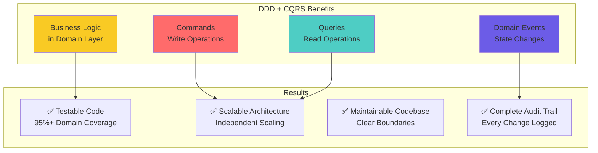

---

## Domain-Driven Design (DDD)

### Core Building Blocks

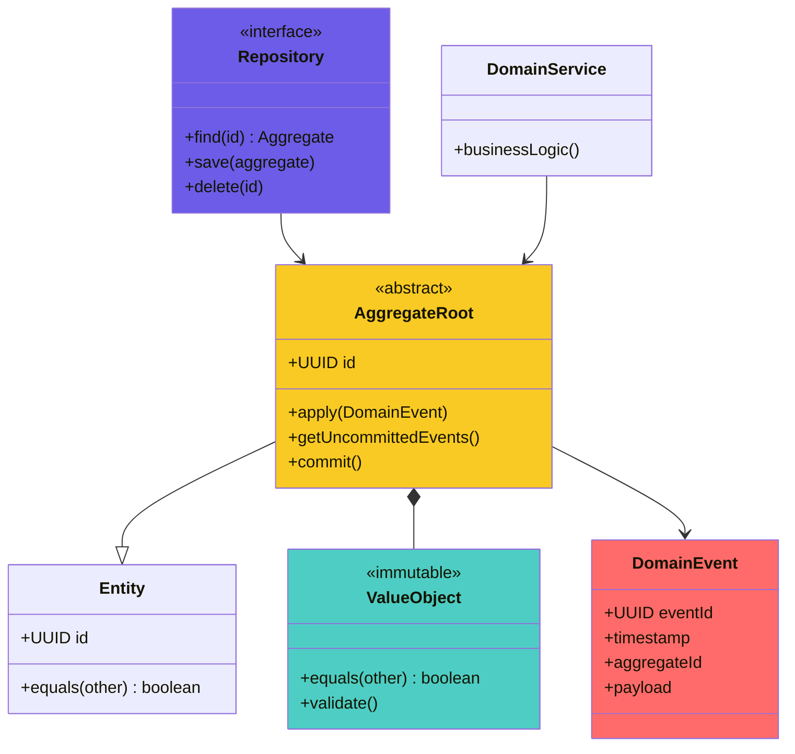

### DDD Layers

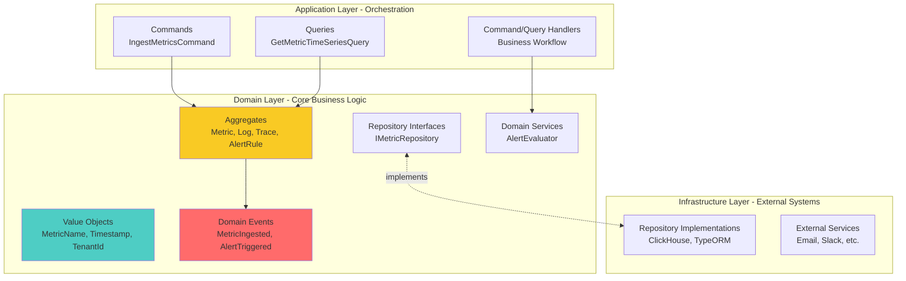

---

## CQRS Pattern

### Command-Query Separation

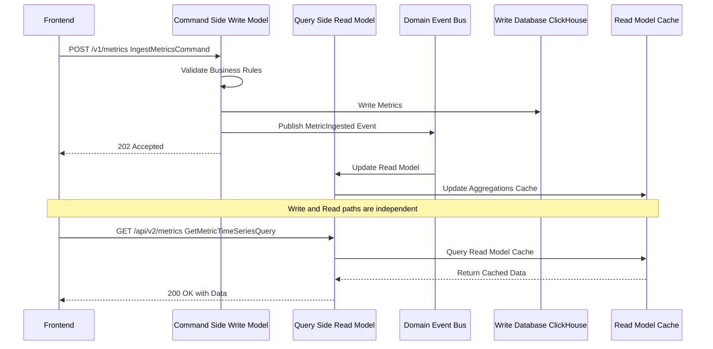

### CQRS Benefits

| Aspect | Traditional CRUD | CQRS |
|--------|-----------------|------|
| **Read/Write** | Same model | Separate models |
| **Optimization** | Compromise | Optimized independently |
| **Scalability** | Vertical | Horizontal (independent) |
| **Complexity** | Simple | Higher (justified for complex domains) |
| **Audit Trail** | Difficult | Built-in via events |
| **Cache Strategy** | Basic | Advanced (read-optimized) |

---

## Aggregates

### What is an Aggregate?

An **Aggregate** is a cluster of domain objects that can be treated as a single unit for data changes. Each aggregate has a **root entity** (Aggregate Root) and a boundary.

**Rules:**
1. ✅ External objects can only reference the Aggregate Root
2. ✅ Aggregates enforce business invariants
3. ✅ One transaction = One aggregate

### Metric Aggregate Example

**File:** `backend/src/modules/400-telemetry/domain/aggregates/Metric.aggregate.ts`

```typescript
import { AggregateRoot } from '@nestjs/cqrs';
import { MetricId } from '../value-objects/MetricId.vo';
import { MetricName } from '../value-objects/MetricName.vo';
import { MetricType } from '../value-objects/MetricType.vo';
import { MetricValue } from '../value-objects/MetricValue.vo';
import { TenantContext } from '../value-objects/TenantContext.vo';
import { ServiceName } from '../value-objects/ServiceName.vo';
import { Timestamp } from '../value-objects/Timestamp.vo';
import { MetricIngested } from '../events/MetricIngested.event';

export interface MetricProps {
  id: MetricId;
  timestamp: Timestamp;
  serviceName: ServiceName;
  metricName: MetricName;
  metricType: MetricType;
  value: MetricValue;
  tenantContext: TenantContext;
  unit?: string;
  isMonotonic?: boolean;
  attributes?: Record<string, any>;
  resourceAttributes?: Record<string, any>;
}

export class Metric extends AggregateRoot {
  private readonly _id: MetricId;
  private readonly _timestamp: Timestamp;
  private readonly _serviceName: ServiceName;
  private readonly _metricName: MetricName;
  private readonly _metricType: MetricType;
  private _value: MetricValue;
  private readonly _tenantContext: TenantContext;
  // ... other properties

  private constructor(props: MetricProps) {
    super();
    this._id = props.id;
    this._timestamp = props.timestamp;
    this._serviceName = props.serviceName;
    this._metricName = props.metricName;
    this._metricType = props.metricType;
    this._value = props.value;
    this._tenantContext = props.tenantContext;
    // ... initialize other properties
  }

  /**
   * Factory method to create a new metric with business rule validation
   */
  static create(props: Omit<MetricProps, 'id'>): Metric {
    // Business Rule: Counter metrics must be monotonic
    if (props.metricType.isCounter() && props.isMonotonic === false) {
      throw new Error('Counter metrics must be monotonic');
    }

    // Business Rule: Counter metrics cannot have negative values
    if (props.metricType.isCounter() && props.value.isNegative()) {
      throw new Error('Counter metrics cannot have negative values');
    }

    const metric = new Metric({
      ...props,
      id: MetricId.generate(),
    });

    // Publish domain event
    metric.apply(new MetricIngested(metric));

    return metric;
  }

  // Getters for all properties
  get id(): MetricId { return this._id; }
  get metricName(): MetricName { return this._metricName; }
  get value(): MetricValue { return this._value; }

  // Business methods
  updateValue(newValue: MetricValue): void {
    if (this._metricType.isCounter() && newValue.isLessThan(this._value)) {
      throw new Error('Counter values cannot decrease');
    }
    this._value = newValue;
  }
}
```

### Aggregate Lifecycle

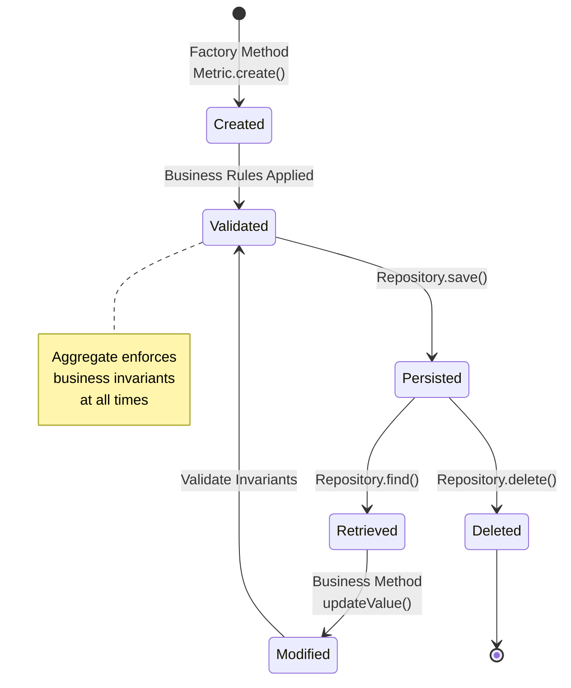

### Common Aggregates in TelemetryFlow

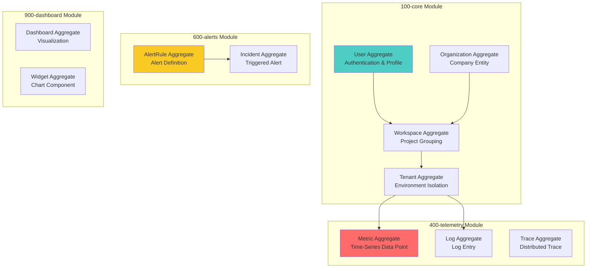

---

## Value Objects

### What is a Value Object?

A **Value Object** is an immutable object that represents a descriptive aspect of the domain with no conceptual identity.

**Characteristics:**
1. ✅ **Immutable** - Cannot change after creation
2. ✅ **Value Equality** - Two VOs with same values are equal
3. ✅ **Self-Validating** - Validation in constructor/factory
4. ✅ **No Identity** - Defined by attributes, not ID

### MetricName Value Object Example

**File:** `backend/src/modules/400-telemetry/domain/value-objects/MetricName.vo.ts`

```typescript
export class MetricName {
  private readonly _value: string;

  private constructor(value: string) {
    this._value = value;
  }

  static create(name: string): MetricName {
    // Validation: Cannot be empty
    if (!name || name.trim() === '') {
      throw new Error('MetricName cannot be empty');
    }

    // Validation: Max length
    if (name.length > 255) {
      throw new Error('MetricName cannot exceed 255 characters');
    }

    // Validation: OTEL metric naming convention
    if (!/^[a-zA-Z][a-zA-Z0-9._-]*$/.test(name)) {
      throw new Error('MetricName must follow OTEL naming convention');
    }

    return new MetricName(name);
  }

  get value(): string {
    return this._value;
  }

  equals(other: MetricName): boolean {
    return this._value === other._value;
  }

  toString(): string {
    return this._value;
  }
}
```

### Value Object Pattern

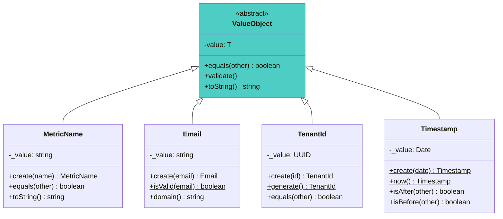

### Common Value Objects

| Value Object | Module | Purpose | Validation Rules |
|--------------|--------|---------|------------------|
| **Email** | 100-core | User email | RFC 5322 compliant |
| **TenantId** | 100-core | Tenant identifier | Valid UUID |
| **WorkspaceId** | 100-core | Workspace identifier | Valid UUID |
| **MetricName** | 400-telemetry | Metric identifier | OTEL naming convention |
| **MetricValue** | 400-telemetry | Metric measurement | Numeric, range validation |
| **Timestamp** | 400-telemetry | Time point | Valid Date, timezone-aware |
| **Threshold** | 600-alerts | Alert threshold | Numeric, comparative operator |
| **Severity** | 600-alerts | Alert severity | Enum: INFO, WARN, ERROR, CRITICAL |

---

## Domain Events

### What is a Domain Event?

A **Domain Event** represents something that happened in the domain that domain experts care about.

**Characteristics:**
1. ✅ **Immutable** - Past facts cannot change
2. ✅ **Named in Past Tense** - MetricIngested, AlertTriggered
3. ✅ **Contains Context** - Who, what, when, where
4. ✅ **Triggers Side Effects** - Event handlers react

### Domain Event Flow

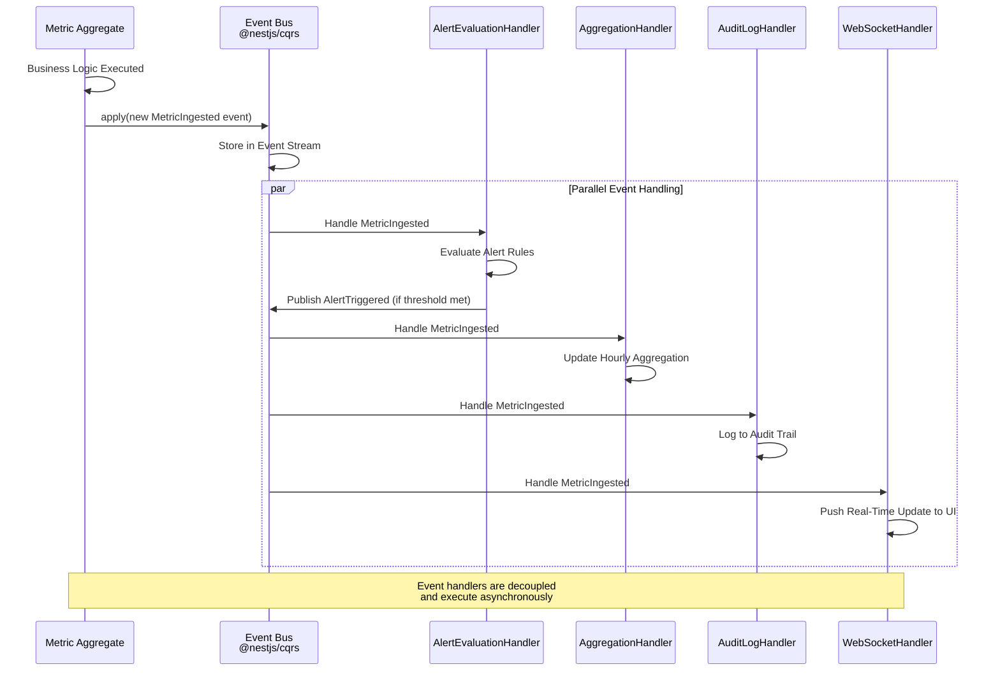

### MetricIngested Event Example

```typescript
// backend/src/modules/400-telemetry/domain/events/MetricIngested.event.ts

export class MetricIngested implements IEvent {
  constructor(
    public readonly metricId: string,
    public readonly tenantId: string,
    public readonly workspaceId: string,
    public readonly serviceName: string,
    public readonly metricName: string,
    public readonly value: number,
    public readonly timestamp: Date,
    public readonly attributes: Record<string, any>,
  ) {}
}
```

### Event Types Hierarchy

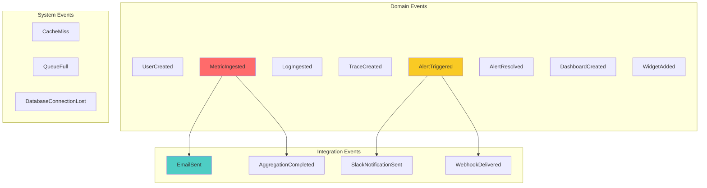

---

## Repositories

### Repository Pattern

**Repositories** provide an abstraction over data persistence, keeping the domain layer independent of infrastructure concerns.

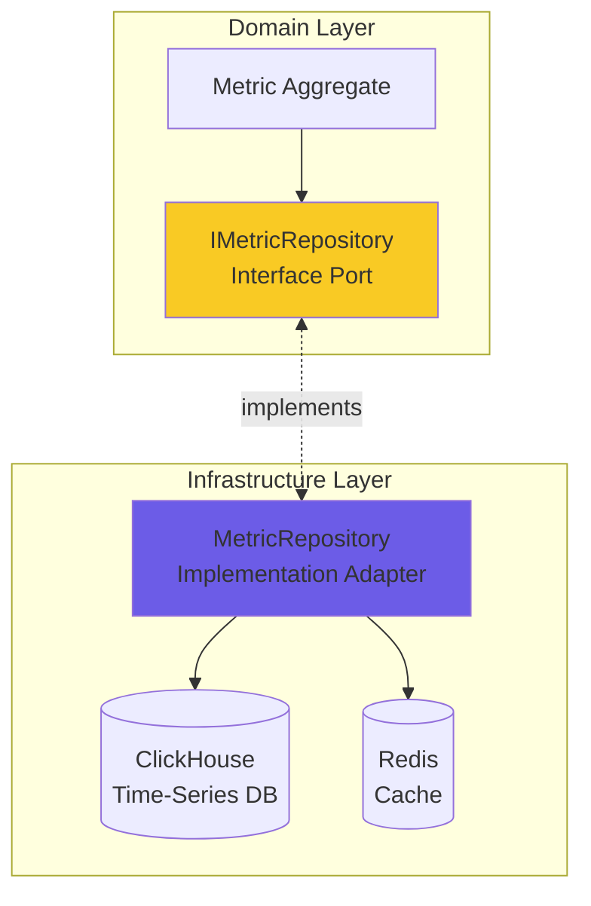

### Repository Interface Example

```typescript
// backend/src/modules/400-telemetry/domain/repositories/metric.repository.interface.ts

export interface IMetricRepository {
  // Command side (writes)
  save(metric: Metric): Promise<void>;
  saveBatch(metrics: Metric[]): Promise<void>;
  delete(id: MetricId): Promise<void>;

  // Query side (reads)
  findById(id: MetricId): Promise<Metric | null>;
  findByFilters(filters: MetricFilters, tenantContext: TenantContext): Promise<Metric[]>;
  findTimeSeries(query: TimeSeriesQuery): Promise<MetricTimeSeries>;

  // Aggregations
  count(filters: MetricFilters): Promise<number>;
  aggregate(query: AggregationQuery): Promise<AggregationResult>;
}
```

### Repository Implementation Example

```typescript
// backend/src/modules/400-telemetry/infrastructure/persistence/clickhouse/repositories/metric.repository.ts

@Injectable()
export class MetricRepository implements IMetricRepository {
  constructor(
    private readonly clickhouse: ClickHouseService,
    private readonly cache: CacheService,
    private readonly mapper: MetricMapper,
  ) {}

  async save(metric: Metric): Promise<void> {
    const schema = this.mapper.toSchema(metric);
    await this.clickhouse.insert('telemetry_metrics', [schema]);
    await this.invalidateCache(metric.tenantContext.tenantId);
  }

  async findByFilters(
    filters: MetricFilters,
    tenantContext: TenantContext,
  ): Promise<Metric[]> {
    // Check cache first
    const cacheKey = this.buildCacheKey(filters, tenantContext);
    const cached = await this.cache.get(cacheKey);
    if (cached) return this.mapper.toDomain(cached);

    // Query ClickHouse
    const query = this.buildQuery(filters, tenantContext);
    const results = await this.clickhouse.query(query);

    // Cache results
    await this.cache.set(cacheKey, results, 300); // 5min TTL

    return results.map(row => this.mapper.toDomain(row));
  }

  private buildCacheKey(filters: MetricFilters, context: TenantContext): string {
    return `metrics:${context.tenantId}:${JSON.stringify(filters)}`;
  }
}
```

---

## Domain Services

### What is a Domain Service?

A **Domain Service** contains domain logic that doesn't naturally fit within a single aggregate.

**Use Cases:**
- Business logic spanning multiple aggregates
- Calculations involving multiple entities
- Domain operations without natural home in any aggregate

### AlertEvaluator Domain Service Example

```typescript
// backend/src/modules/600-alerts/domain/services/alert-evaluator.service.ts

@Injectable()
export class AlertEvaluatorService {
  constructor(
    private readonly metricRepository: IMetricRepository,
  ) {}

  /**
   * Domain Service: Evaluate if a metric triggers an alert rule
   * Spans multiple aggregates: Metric + AlertRule
   */
  async evaluateRule(
    rule: AlertRule,
    tenantContext: TenantContext,
  ): Promise<AlertEvaluationResult> {
    // Fetch metrics based on rule conditions
    const metrics = await this.metricRepository.findByFilters(
      {
        metricName: rule.metricName.value,
        startTime: rule.evaluationWindow.start,
        endTime: rule.evaluationWindow.end,
      },
      tenantContext,
    );

    // Domain logic: Calculate aggregation based on rule
    const aggregatedValue = this.calculateAggregation(
      metrics,
      rule.aggregationType,
    );

    // Domain logic: Check threshold
    const thresholdBreached = rule.threshold.isBreached(aggregatedValue);

    return new AlertEvaluationResult({
      ruleId: rule.id,
      thresholdBreached,
      actualValue: aggregatedValue,
      threshold: rule.threshold,
      evaluatedAt: new Date(),
    });
  }

  private calculateAggregation(
    metrics: Metric[],
    type: AggregationType,
  ): number {
    // Domain logic for different aggregation types
    switch (type) {
      case 'AVG':
        return metrics.reduce((sum, m) => sum + m.value.raw, 0) / metrics.length;
      case 'MAX':
        return Math.max(...metrics.map(m => m.value.raw));
      case 'MIN':
        return Math.min(...metrics.map(m => m.value.raw));
      case 'SUM':
        return metrics.reduce((sum, m) => sum + m.value.raw, 0);
      default:
        throw new Error(`Unknown aggregation type: ${type}`);
    }
  }
}
```

---

## Commands & Queries

### Commands (Write Operations)

**Commands** represent intentions to change state. They encapsulate all data needed to perform the operation.

#### Command Example

**File:** `backend/src/modules/400-telemetry/application/aggregation/commands/calculate-hourly-aggregation.command.ts`

```typescript
export class CalculateHourlyAggregationCommand {
  constructor(
    public readonly dataType: 'metrics' | 'logs' | 'traces',
    public readonly startTime: Date,
    public readonly endTime: Date,
  ) {}
}
```

#### Command Handler Example

```typescript
// backend/src/modules/400-telemetry/application/aggregation/handlers/calculate-hourly-aggregation.handler.ts

@CommandHandler(CalculateHourlyAggregationCommand)
export class CalculateHourlyAggregationHandler
  implements ICommandHandler<CalculateHourlyAggregationCommand> {

  constructor(
    private readonly aggregationService: AggregationService,
    private readonly logger: WinstonLogger,
  ) {}

  async execute(command: CalculateHourlyAggregationCommand): Promise<void> {
    this.logger.info('Calculating hourly aggregation', {
      dataType: command.dataType,
      startTime: command.startTime,
      endTime: command.endTime,
    });

    try {
      // Application layer orchestrates domain services
      await this.aggregationService.calculateHourly(
        command.dataType,
        command.startTime,
        command.endTime,
      );

      this.logger.info('Hourly aggregation completed successfully');
    } catch (error) {
      this.logger.error('Hourly aggregation failed', error);
      throw error;
    }
  }
}
```

### Queries (Read Operations)

**Queries** represent requests for data without changing state.

#### Query Example

**File:** `backend/src/modules/400-telemetry/application/queries/GetMetricTimeSeries.query.ts`

```typescript
export interface TimeSeriesFilters {
  serviceName?: string;
  metricName: string;
  startTime: Date;
  endTime: Date;
  aggregation?: 'avg' | 'sum' | 'min' | 'max' | 'count';
  interval?: string; // e.g., '1m', '5m', '1h'
}

export class GetMetricTimeSeriesQuery {
  public readonly serviceName?: ServiceName;
  public readonly metricName: MetricName;
  public readonly startTime: Date;
  public readonly endTime: Date;
  public readonly aggregation: 'avg' | 'sum' | 'min' | 'max' | 'count';
  public readonly interval: string;

  constructor(
    filters: TimeSeriesFilters,
    public readonly tenantContext: TenantContext,
  ) {
    if (filters.serviceName) {
      this.serviceName = ServiceName.create(filters.serviceName);
    }
    this.metricName = MetricName.create(filters.metricName);
    this.startTime = filters.startTime;
    this.endTime = filters.endTime;
    this.aggregation = filters.aggregation || 'avg';
    this.interval = filters.interval || '5m';
  }
}
```

#### Query Handler Example

```typescript
// backend/src/modules/400-telemetry/application/handlers/get-metric-timeseries.handler.ts

@QueryHandler(GetMetricTimeSeriesQuery)
export class GetMetricTimeSeriesHandler
  implements IQueryHandler<GetMetricTimeSeriesQuery> {

  constructor(
    private readonly metricRepository: IMetricRepository,
    private readonly cache: CacheService,
  ) {}

  async execute(query: GetMetricTimeSeriesQuery): Promise<TimeSeriesResult> {
    // Build cache key
    const cacheKey = `timeseries:${query.tenantContext.tenantId}:${query.metricName.value}:${query.interval}`;

    // Check cache first
    const cached = await this.cache.get(cacheKey);
    if (cached) {
      return cached;
    }

    // Query repository (optimized read model)
    const result = await this.metricRepository.findTimeSeries({
      serviceName: query.serviceName,
      metricName: query.metricName,
      startTime: query.startTime,
      endTime: query.endTime,
      aggregation: query.aggregation,
      interval: query.interval,
      tenantContext: query.tenantContext,
    });

    // Cache result
    await this.cache.set(cacheKey, result, 300); // 5min TTL

    return result;
  }
}
```

### Command vs Query Flow

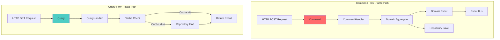

---

## Event Handlers

### Event Handler Pattern

Event Handlers react to Domain Events asynchronously, enabling loose coupling between modules.

```typescript
// backend/src/modules/600-alerts/application/handlers/metric-ingested.handler.ts

@EventsHandler(MetricIngested)
export class MetricIngestedHandler implements IEventHandler<MetricIngested> {
  constructor(
    private readonly alertEvaluator: AlertEvaluatorService,
    private readonly alertRuleRepository: IAlertRuleRepository,
    private readonly queueService: QueueService,
  ) {}

  async handle(event: MetricIngested): Promise<void> {
    // Find all alert rules for this metric
    const rules = await this.alertRuleRepository.findByMetricName(
      event.metricName,
      event.tenantId,
    );

    // Evaluate each rule asynchronously via queue
    for (const rule of rules) {
      await this.queueService.addJob('alert-evaluation', {
        ruleId: rule.id.value,
        metricName: event.metricName,
        tenantId: event.tenantId,
        timestamp: event.timestamp,
      });
    }
  }
}
```

### Event Handler Registration

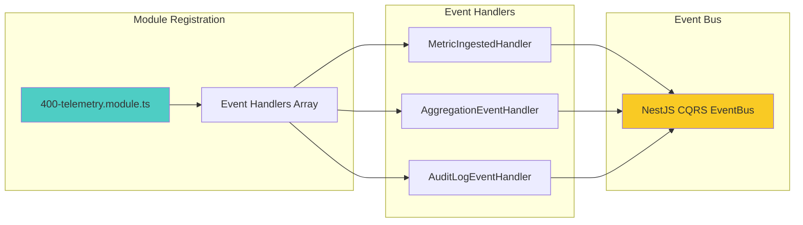

---

## Best Practices

### 1. Aggregate Design

✅ **Good:**
```typescript
class Metric extends AggregateRoot {
  // Business rule enforced at aggregate level
  updateValue(newValue: MetricValue): void {
    if (this._metricType.isCounter() && newValue.isLessThan(this._value)) {
      throw new Error('Counter values cannot decrease');
    }
    this._value = newValue;
    this.apply(new MetricValueUpdated(this));
  }
}
```

❌ **Bad:**
```typescript
// Business rule in application layer (wrong layer!)
class UpdateMetricHandler {
  async execute(command: UpdateMetricCommand) {
    const metric = await this.repository.find(command.id);
    if (metric.type === 'counter' && command.value < metric.value) {
      throw new Error('Counter cannot decrease');
    }
    metric.value = command.value; // Direct property mutation
    await this.repository.save(metric);
  }
}
```

### 2. Value Object Usage

✅ **Good:**
```typescript
class Metric {
  constructor(
    private readonly metricName: MetricName,  // Value Object
    private readonly timestamp: Timestamp,     // Value Object
  ) {}
}

// Usage with validation
const name = MetricName.create('cpu_usage_percent'); // Throws if invalid
```

❌ **Bad:**
```typescript
class Metric {
  constructor(
    private readonly metricName: string,  // Primitive obsession
    private readonly timestamp: Date,     // No validation
  ) {}
}

// Usage without validation
const metric = new Metric('invalid metric name!', new Date());
```

### 3. Domain Events

✅ **Good:**
```typescript
class Metric extends AggregateRoot {
  static create(props: MetricProps): Metric {
    const metric = new Metric(props);
    metric.apply(new MetricIngested(metric)); // Event published
    return metric;
  }
}
```

❌ **Bad:**
```typescript
class Metric {
  // No domain events - side effects handled imperatively
  static create(props: MetricProps): Metric {
    const metric = new Metric(props);
    // Direct coupling to alert evaluation
    AlertService.evaluateRules(metric);
    return metric;
  }
}
```

### 4. Repository Pattern

✅ **Good:**
```typescript
// Domain layer defines interface (port)
interface IMetricRepository {
  save(metric: Metric): Promise<void>;
  findById(id: MetricId): Promise<Metric | null>;
}

// Infrastructure layer implements interface (adapter)
class ClickHouseMetricRepository implements IMetricRepository {
  async save(metric: Metric): Promise<void> {
    const schema = this.mapper.toSchema(metric);
    await this.clickhouse.insert('metrics', [schema]);
  }
}
```

❌ **Bad:**
```typescript
// Domain depends on infrastructure
import { ClickHouse } from '@clickhouse/client';

class Metric {
  async save(clickhouse: ClickHouse) {
    // Direct infrastructure dependency in domain!
    await clickhouse.insert('metrics', [this.toJSON()]);
  }
}
```

### 5. CQRS Separation

✅ **Good:**
```typescript
// Separate command and query
@CommandHandler(IngestMetricsCommand)
class IngestMetricsHandler { }

@QueryHandler(GetMetricTimeSeriesQuery)
class GetMetricTimeSeriesHandler { }
```

❌ **Bad:**
```typescript
// Mixed read/write in same handler
class MetricService {
  async ingestAndQuery(data: any) {
    await this.save(data);          // Write
    return await this.find(data.id); // Read
  }
}
```

---

## Summary

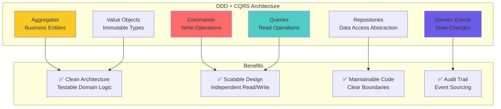

### Key Takeaways

| Concept | Purpose | Example |
|---------|---------|---------|
| **Aggregates** | Enforce business invariants | `Metric.create()` validates counter rules |
| **Value Objects** | Encapsulate validation | `MetricName.create()` enforces OTEL naming |
| **Domain Events** | Decouple modules | `MetricIngested` triggers alert evaluation |
| **Repositories** | Abstract data access | `IMetricRepository` interface in domain |
| **Commands** | Represent write intentions | `IngestMetricsCommand` |
| **Queries** | Represent read requests | `GetMetricTimeSeriesQuery` |
| **CQRS** | Separate read/write | Optimized independently |
| **Event Handlers** | React to domain events | `MetricIngestedHandler` evaluates alerts |

---

## Related Documentation

- [Backend Overview](./00-BACKEND-OVERVIEW.md) - Architecture principles
- [Module Structure](./03-MODULE-STRUCTURE.md) - LEGO pattern implementation
- [System Architecture](../architecture/01-SYSTEM-ARCHITECTURE.md) - High-level overview
- [Data Flow](../architecture/02-DATA-FLOW.md) - Request/response flows

---

- **File Location:** `./backend/02-DDD-CQRS.md`
- **Maintained By:** DevOpsCorner Indonesia
- **Last Updated:** January 01st, 2026
