# Module Structure Guide (LEGO Pattern)

- **Version:** 1.0.0-CE
- **Last Updated:** December 12, 2025
- **Status:** ✅ Complete

---

## Table of Contents

1. [Introduction](#introduction)
2. [LEGO Pattern Philosophy](#lego-pattern-philosophy)
3. [Standard Module Structure](#standard-module-structure)
4. [Layer Breakdown](#layer-breakdown)
5. [File Naming Conventions](#file-naming-conventions)
6. [Module Template](#module-template)
7. [Creating a New Module](#creating-a-new-module)
8. [Module Communication](#module-communication)
9. [Testing Structure](#testing-structure)
10. [Best Practices](#best-practices)

---

## Introduction

TelemetryFlow uses a **standardized module structure** called the **LEGO Pattern** to ensure consistency, maintainability, and scalability across all 15 business modules.

### Why LEGO Pattern?

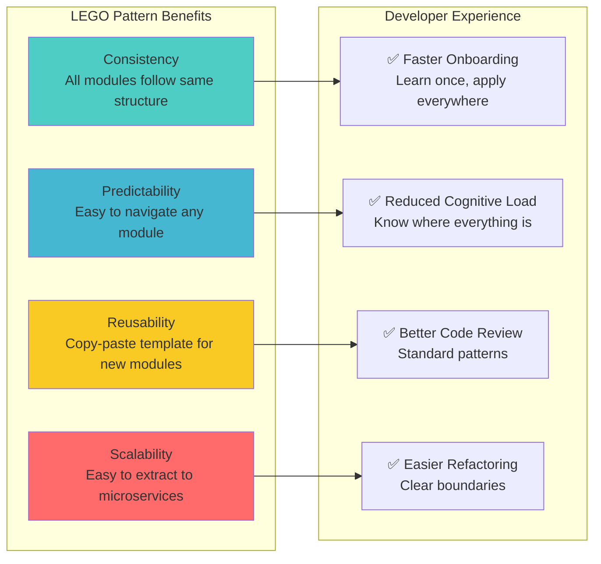

---

## LEGO Pattern Philosophy

### Building Block Metaphor

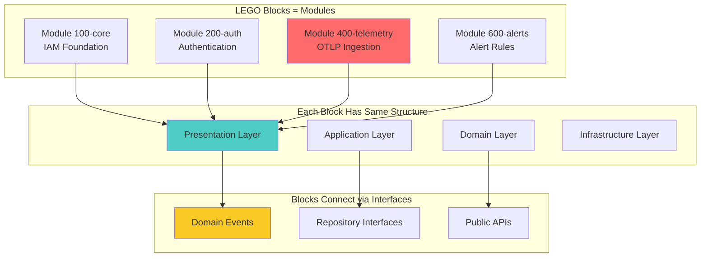

**Key Principles:**
1. ✅ **Uniform Structure** - Every module looks the same
2. ✅ **Clear Boundaries** - Explicit interfaces between layers
3. ✅ **Loose Coupling** - Modules communicate via events
4. ✅ **High Cohesion** - Related code stays together

---

## Standard Module Structure

### Complete Folder Structure

```
400-telemetry/
├── 400-telemetry.module.ts              # Module definition & registration
│
├── presentation/                         # Layer 1: HTTP/REST Interface
│   ├── controllers/
│   │   ├── metrics.controller.ts
│   │   ├── logs.controller.ts
│   │   └── traces.controller.ts
│   ├── dtos/
│   │   ├── ingest-metrics.dto.ts
│   │   ├── query-metrics.dto.ts
│   │   └── metric-filters.dto.ts
│   ├── guards/
│   │   └── api-key-auth.guard.ts
│   └── decorators/
│       └── tenant-context.decorator.ts
│
├── application/                          # Layer 2: Business Workflows
│   ├── commands/
│   │   ├── ingest-metrics-from-otlp.command.ts
│   │   └── delete-old-metrics.command.ts
│   ├── queries/
│   │   ├── get-metric-timeseries.query.ts
│   │   ├── get-metric-names.query.ts
│   │   └── get-logs-paginated.query.ts
│   ├── handlers/
│   │   ├── ingest-metrics-from-otlp.handler.ts
│   │   ├── get-metric-timeseries.handler.ts
│   │   └── index.ts
│   ├── services/
│   │   ├── metrics.service.ts
│   │   ├── logs.service.ts
│   │   └── aggregation.service.ts
│   └── events/
│       └── metric-ingested.handler.ts
│
├── domain/                               # Layer 3: Business Logic
│   ├── aggregates/
│   │   ├── Metric.aggregate.ts
│   │   ├── Log.aggregate.ts
│   │   └── Trace.aggregate.ts
│   ├── value-objects/
│   │   ├── MetricName.vo.ts
│   │   ├── MetricValue.vo.ts
│   │   ├── MetricType.vo.ts
│   │   ├── Timestamp.vo.ts
│   │   └── TenantContext.vo.ts
│   ├── events/
│   │   ├── MetricIngested.event.ts
│   │   ├── MetricValueUpdated.event.ts
│   │   └── ExemplarLinked.event.ts
│   ├── repositories/
│   │   ├── metric.repository.interface.ts
│   │   ├── log.repository.interface.ts
│   │   └── trace.repository.interface.ts
│   └── services/
│       └── metric-validator.service.ts
│
└── infrastructure/                       # Layer 4: External Systems
    ├── persistence/
    │   ├── typeorm/
    │   │   └── entities/
    │   │       └── (if needed for metadata)
    │   └── clickhouse/
    │       ├── schemas/
    │       │   ├── 001-metrics.schema.ts
    │       │   ├── 002-logs.schema.ts
    │       │   └── 003-traces.schema.ts
    │       ├── repositories/
    │       │   ├── metric.repository.ts
    │       │   ├── log.repository.ts
    │       │   └── trace.repository.ts
    │       └── migrations/
    │           ├── 001-create-tables.ts
    │           └── 002-query-optimization.ts
    ├── mappers/
    │   ├── metric.mapper.ts
    │   ├── log.mapper.ts
    │   └── otlp-to-domain.mapper.ts
    └── clients/
        └── otlp-transformer.client.ts
```

### Visual Structure

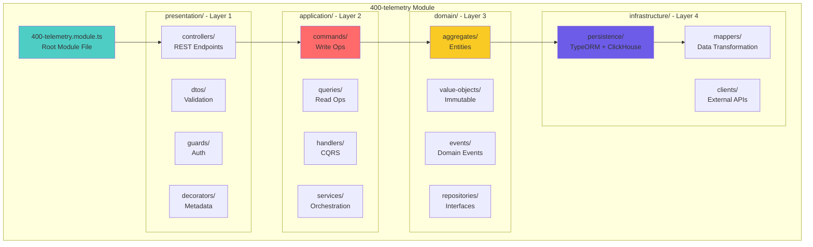

---

## Layer Breakdown

### Layer 1: Presentation

**Responsibility:** HTTP request handling, validation, authentication

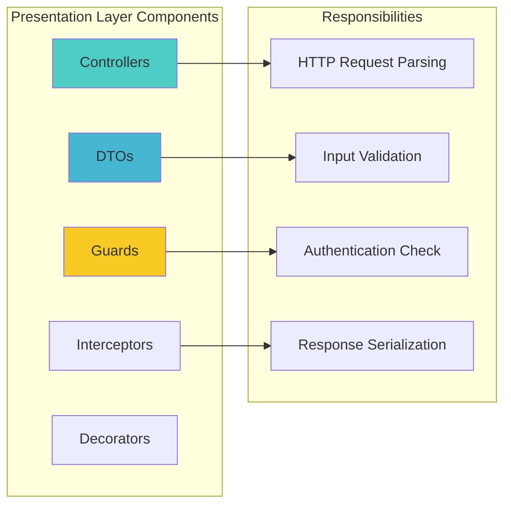

**Example Controller:**
```typescript
// presentation/controllers/metrics.controller.ts
@Controller('api/v2/telemetry/metrics')
@UseGuards(JwtAuthGuard, TenantContextGuard)
export class MetricsController {
  constructor(
    private readonly commandBus: CommandBus,
    private readonly queryBus: QueryBus,
  ) {}

  @Post()
  @ApiOperation({ summary: 'Ingest metrics via OTLP' })
  async ingestMetrics(
    @Body() dto: IngestMetricsDto,
    @TenantContext() tenantContext: TenantContext,
  ): Promise<{ accepted: boolean }> {
    const command = new IngestMetricsFromOtlpCommand(dto, tenantContext);
    await this.commandBus.execute(command);
    return { accepted: true };
  }

  @Get()
  @ApiOperation({ summary: 'Query metrics time series' })
  async queryMetrics(
    @Query() dto: QueryMetricsDto,
    @TenantContext() tenantContext: TenantContext,
  ): Promise<MetricTimeSeries> {
    const query = new GetMetricTimeSeriesQuery(dto, tenantContext);
    return this.queryBus.execute(query);
  }
}
```

### Layer 2: Application

**Responsibility:** Business workflow orchestration, CQRS implementation

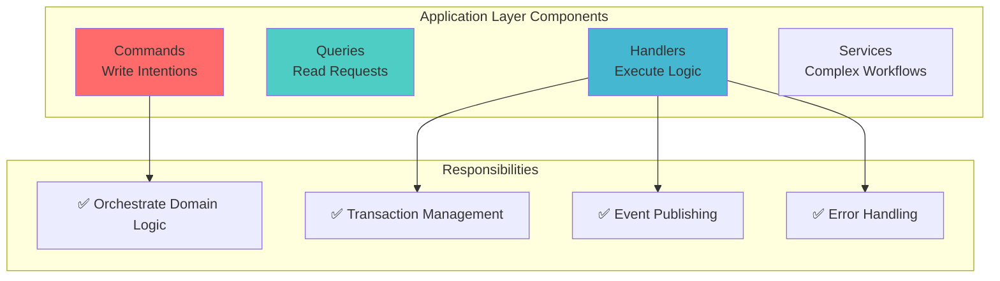

**Example Command Handler:**
```typescript
// application/handlers/ingest-metrics-from-otlp.handler.ts
@CommandHandler(IngestMetricsFromOtlpCommand)
export class IngestMetricsFromOtlpHandler
  implements ICommandHandler<IngestMetricsFromOtlpCommand> {

  constructor(
    private readonly queueService: QueueService,
    private readonly logger: WinstonLogger,
  ) {}

  async execute(command: IngestMetricsFromOtlpCommand): Promise<void> {
    this.logger.info('Ingesting metrics from OTLP', {
      tenantId: command.tenantContext.tenantId.value,
      metricCount: command.metrics.length,
    });

    // Queue for async processing (prevents HTTP timeout)
    await this.queueService.addJob('otlp-ingestion', {
      type: 'metrics',
      data: command.metrics,
      tenantContext: command.tenantContext,
    });
  }
}
```

### Layer 3: Domain

**Responsibility:** Business rules, domain logic, pure functions

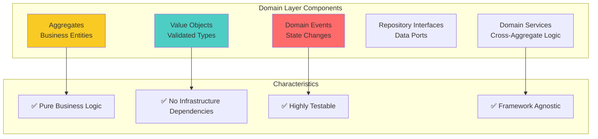

**Example Aggregate:**
```typescript
// domain/aggregates/Metric.aggregate.ts
export class Metric extends AggregateRoot {
  private readonly _id: MetricId;
  private readonly _metricName: MetricName;
  private _value: MetricValue;

  static create(props: MetricProps): Metric {
    // Business Rule: Counter metrics must be monotonic
    if (props.metricType.isCounter() && props.isMonotonic === false) {
      throw new DomainError('Counter metrics must be monotonic');
    }

    const metric = new Metric(props);
    metric.apply(new MetricIngested(metric));
    return metric;
  }

  updateValue(newValue: MetricValue): void {
    // Business Rule: Counters cannot decrease
    if (this._metricType.isCounter() && newValue.isLessThan(this._value)) {
      throw new DomainError('Counter values cannot decrease');
    }
    this._value = newValue;
    this.apply(new MetricValueUpdated(this));
  }
}
```

### Layer 4: Infrastructure

**Responsibility:** External systems, database, third-party APIs

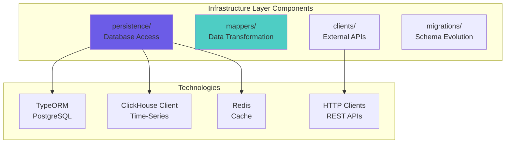

**Example Repository:**
```typescript
// infrastructure/persistence/clickhouse/repositories/metric.repository.ts
@Injectable()
export class MetricRepository implements IMetricRepository {
  constructor(
    private readonly clickhouse: ClickHouseService,
    private readonly cache: CacheService,
    private readonly mapper: MetricMapper,
  ) {}

  async save(metric: Metric): Promise<void> {
    const schema = this.mapper.toClickHouseSchema(metric);
    await this.clickhouse.insert('telemetry_metrics', [schema]);
    await this.cache.invalidate(`metrics:${metric.tenantId}`);
  }

  async findById(id: MetricId): Promise<Metric | null> {
    const row = await this.clickhouse.query(
      'SELECT * FROM telemetry_metrics WHERE id = {id:String}',
      { id: id.value },
    );
    return row ? this.mapper.toDomain(row) : null;
  }
}
```

---

## File Naming Conventions

### Naming Patterns

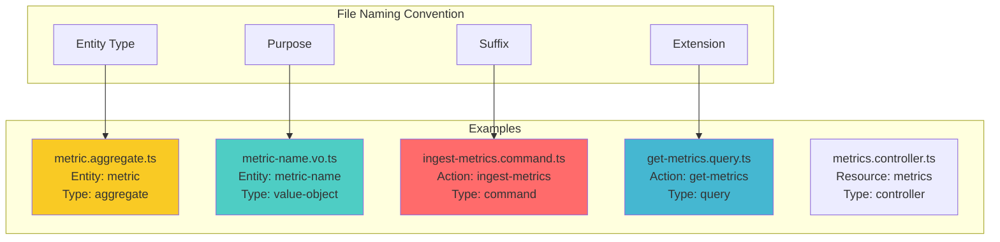

### File Suffix Guide

| Suffix | Usage | Example |
|--------|-------|---------|
| `.aggregate.ts` | Aggregate Roots | `Metric.aggregate.ts` |
| `.vo.ts` | Value Objects | `MetricName.vo.ts` |
| `.event.ts` | Domain Events | `MetricIngested.event.ts` |
| `.command.ts` | CQRS Commands | `IngestMetrics.command.ts` |
| `.query.ts` | CQRS Queries | `GetMetrics.query.ts` |
| `.handler.ts` | Command/Query/Event Handlers | `IngestMetrics.handler.ts` |
| `.controller.ts` | REST Controllers | `metrics.controller.ts` |
| `.dto.ts` | Data Transfer Objects | `ingest-metrics.dto.ts` |
| `.service.ts` | Application/Domain Services | `metrics.service.ts` |
| `.repository.ts` | Repository Implementations | `metric.repository.ts` |
| `.interface.ts` | Repository Interfaces | `metric.repository.interface.ts` |
| `.mapper.ts` | Data Mappers | `metric.mapper.ts` |
| `.guard.ts` | Auth Guards | `api-key-auth.guard.ts` |
| `.decorator.ts` | Custom Decorators | `tenant-context.decorator.ts` |
| `.schema.ts` | Database Schemas | `001-metrics.schema.ts` |
| `.module.ts` | NestJS Modules | `400-telemetry.module.ts` |

---

## Module Template

### Complete Module File

```typescript
// 400-telemetry/400-telemetry.module.ts
import { Module } from '@nestjs/common';
import { CqrsModule } from '@nestjs/cqrs';

// Presentation Layer
import { MetricsController } from './presentation/controllers/metrics.controller';
import { LogsController } from './presentation/controllers/logs.controller';
import { TracesController } from './presentation/controllers/traces.controller';

// Application Layer - Commands
import { IngestMetricsFromOtlpHandler } from './application/handlers/ingest-metrics-from-otlp.handler';
import { DeleteOldMetricsHandler } from './application/handlers/delete-old-metrics.handler';

// Application Layer - Queries
import { GetMetricTimeSeriesHandler } from './application/handlers/get-metric-timeseries.handler';
import { GetMetricNamesHandler } from './application/handlers/get-metric-names.handler';
import { GetLogsPaginatedHandler } from './application/handlers/get-logs-paginated.handler';

// Application Layer - Event Handlers
import { MetricIngestedHandler } from './application/events/metric-ingested.handler';

// Application Layer - Services
import { MetricsService } from './application/services/metrics.service';
import { LogsService } from './application/services/logs.service';
import { AggregationService } from './application/services/aggregation.service';

// Infrastructure Layer
import { MetricRepository } from './infrastructure/persistence/clickhouse/repositories/metric.repository';
import { LogRepository } from './infrastructure/persistence/clickhouse/repositories/log.repository';
import { TraceRepository } from './infrastructure/persistence/clickhouse/repositories/trace.repository';
import { MetricMapper } from './infrastructure/mappers/metric.mapper';
import { OtlpTransformer } from './infrastructure/clients/otlp-transformer.client';

// Shared Modules
import { CacheModule } from '@/shared/cache/cache.module';
import { QueueModule } from '@/shared/queue/queue.module';
import { ClickHouseModule } from '@/shared/clickhouse/clickhouse.module';

const CommandHandlers = [
  IngestMetricsFromOtlpHandler,
  DeleteOldMetricsHandler,
];

const QueryHandlers = [
  GetMetricTimeSeriesHandler,
  GetMetricNamesHandler,
  GetLogsPaginatedHandler,
];

const EventHandlers = [
  MetricIngestedHandler,
];

const ApplicationServices = [
  MetricsService,
  LogsService,
  AggregationService,
];

const Repositories = [
  MetricRepository,
  LogRepository,
  TraceRepository,
];

const Mappers = [
  MetricMapper,
];

const Clients = [
  OtlpTransformer,
];

@Module({
  imports: [
    CqrsModule,
    CacheModule,
    QueueModule,
    ClickHouseModule,
  ],
  controllers: [
    MetricsController,
    LogsController,
    TracesController,
  ],
  providers: [
    ...CommandHandlers,
    ...QueryHandlers,
    ...EventHandlers,
    ...ApplicationServices,
    ...Repositories,
    ...Mappers,
    ...Clients,
  ],
  exports: [
    ...Repositories,
    ...ApplicationServices,
  ],
})
export class TelemetryModule {}
```

---

## Creating a New Module

### Step-by-Step Guide

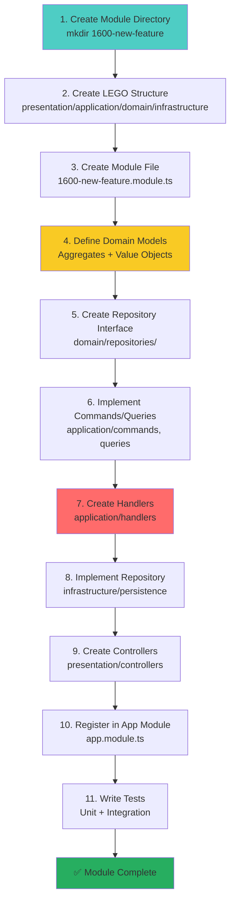

### CLI Commands

```bash
# 1. Create module directory
mkdir -p src/modules/1600-new-feature

# 2. Create LEGO structure
mkdir -p src/modules/1600-new-feature/presentation/{controllers,dtos,guards,decorators}
mkdir -p src/modules/1600-new-feature/application/{commands,queries,handlers,services,events}
mkdir -p src/modules/1600-new-feature/domain/{aggregates,value-objects,events,repositories,services}
mkdir -p src/modules/1600-new-feature/infrastructure/{persistence,mappers,clients}

# 3. Create module file
touch src/modules/1600-new-feature/1600-new-feature.module.ts

# 4. Create test directory
mkdir -p src/modules/1600-new-feature/__tests__/{unit,integration,e2e}
```

---

## Module Communication

### Event-Driven Communication (Preferred)

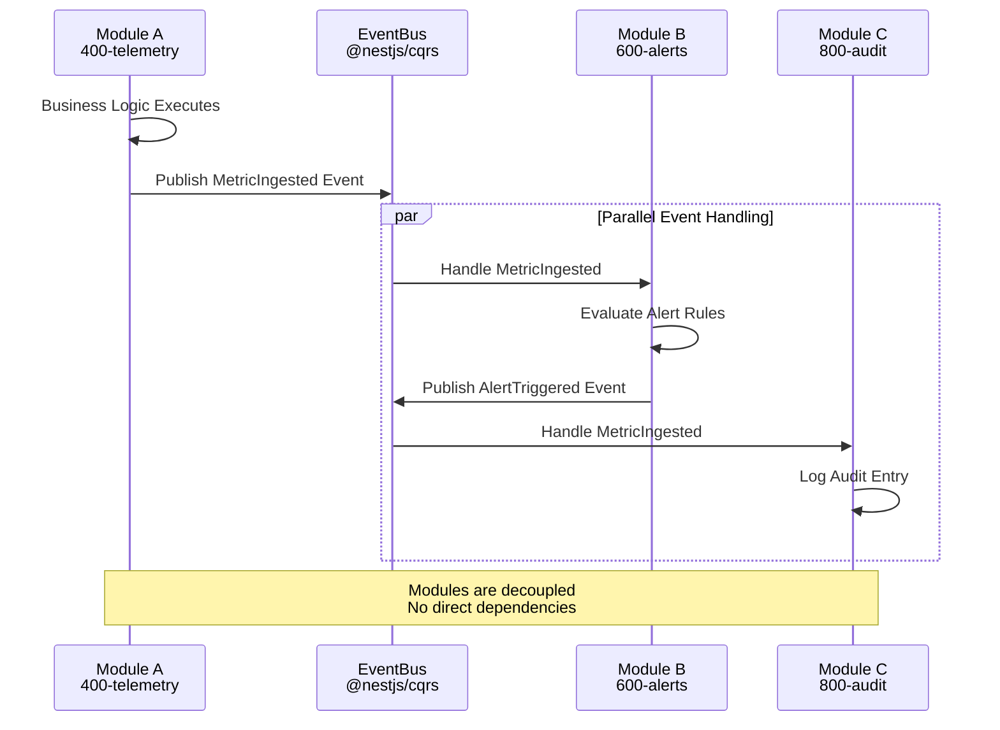

### Direct Communication (Discouraged)

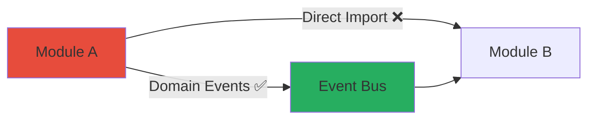

---

## Testing Structure

### Test Organization

```
400-telemetry/
├── __tests__/
│   ├── unit/
│   │   ├── domain/
│   │   │   ├── Metric.aggregate.spec.ts
│   │   │   └── MetricName.vo.spec.ts
│   │   ├── application/
│   │   │   └── IngestMetrics.handler.spec.ts
│   │   └── infrastructure/
│   │       └── metric.repository.spec.ts
│   ├── integration/
│   │   ├── metrics.controller.spec.ts
│   │   └── metric-ingestion.spec.ts
│   └── e2e/
│       └── otlp-ingestion.e2e.spec.ts
```

### Test Pyramid

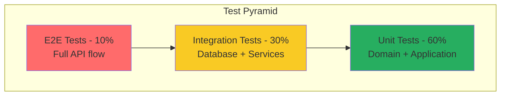

---

## Best Practices

### ✅ Do's

```typescript
// ✅ Use Value Objects for validation
const metricName = MetricName.create('cpu_usage_percent');

// ✅ Emit domain events
metric.apply(new MetricIngested(metric));

// ✅ Use repository interfaces in domain
interface IMetricRepository {
  save(metric: Metric): Promise<void>;
}

// ✅ Keep controllers thin
@Post()
async create(@Body() dto: CreateDto) {
  const command = new CreateCommand(dto);
  return this.commandBus.execute(command);
}

// ✅ Use CQRS for complex operations
@CommandHandler(IngestMetricsCommand)
class IngestMetricsHandler { }

// ✅ Separate read and write models
class GetMetricsQuery { }
class IngestMetricsCommand { }
```

### ❌ Don'ts

```typescript
// ❌ Don't use primitives everywhere (primitive obsession)
class Metric {
  constructor(public name: string) {} // Use MetricName.vo.ts
}

// ❌ Don't put business logic in controllers
@Post()
async create(@Body() dto: CreateDto) {
  if (dto.value < 0) throw new Error(); // Move to domain
  await this.repository.save(dto);
}

// ❌ Don't directly import other modules
import { AlertService } from '../600-alerts'; // Use events instead

// ❌ Don't mix layers
class Metric {
  async save(clickhouse: ClickHouse) { } // Infrastructure in domain!
}

// ❌ Don't skip validation
const metric = new Metric(userInput); // Use factory with validation
```

---

## Summary

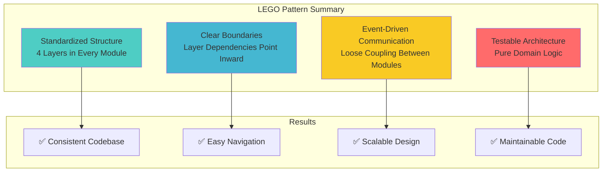

---

## Related Documentation

- [Backend Overview](./00-BACKEND-OVERVIEW.md) - Architecture principles
- [DDD & CQRS](./02-DDD-CQRS.md) - Domain-driven design patterns
- [System Architecture](../architecture/01-SYSTEM-ARCHITECTURE.md) - High-level overview

---

- **File Location:** `./backend/03-MODULE-STRUCTURE.md`
- **Maintained By:** DevOpsCorner Indonesia
- **Last Updated:** December 12, 2025
