# Module: 100-core (IAM & Multi-Tenancy Foundation)

- **Module**: `100-core`
- **Category**: Backend / Business Modules
- **Status**: Production Ready
- **Priority:** 🔥 CRITICAL - Platform Foundation
- **Version**: 3.10.0

---

## Module Overview

```mermaid
graph TB
    subgraph "100-core Module"
        A[IAM<br/>Identity & Access]
        B[Multi-Tenancy<br/>Isolation]
        C[RBAC<br/>Role-Based Access]
        D[Hierarchical Model<br/>Region→Org→Workspace→Tenant]
    end

    subgraph "Core Entities"
        E[User]
        F[Organization]
        G[Workspace]
        H[Tenant]
        I[Role]
        J[Permission]
    end

    A --> E
    B --> F
    B --> G
    B --> H
    C --> I
    C --> J

    style A fill:#4ecdc4
    style B fill:#ff6b6b
    style C fill:#f9ca24
    style D fill:#6c5ce7
```



**Purpose:** Foundation module providing Identity & Access Management (IAM), multi-tenancy hierarchy, and role-based access control (RBAC) for the entire platform.

**Location:** `backend/src/modules/100-core/`

---

## Multi-Tenancy Hierarchy

### 4-Level Tenant Model


**Hierarchy Levels:**

| Level | Purpose | Scope | Example |
|-------|---------|-------|---------|
| **Region** | Geographic/regulatory isolation | Infrastructure | `us-east-1`, `eu-central-1` |
| **Organization** | Company/legal entity | Billing, SSO config | `acme-corp`, `devopscorner` |
| **Workspace** | Project/team grouping | Collaboration | `production-ops`, `dev-team` |
| **Tenant** | Environment isolation | Data segregation | `prod`, `staging`, `dev` |

---

## Core Entities

### Entity Relationship Diagram


---

## IAM Implementation

### User Management

```typescript
// domain/aggregates/User.aggregate.ts
export class User extends AggregateRoot {
  private readonly _id: UserId;
  private readonly _email: Email;        // Value Object with validation
  private _passwordHash: PasswordHash;
  private _isActive: boolean;
  private readonly _roles: Role[];
  private readonly _permissions: Permission[];

  static create(props: CreateUserProps): User {
    // Business Rule: Email must be unique
    const email = Email.create(props.email);

    // Business Rule: Password must meet security requirements
    const passwordHash = PasswordHash.fromPlaintext(
      props.password,
      { minLength: 12, requireSpecialChar: true }
    );

    const user = new User({ email, passwordHash, ...props });
    user.apply(new UserCreated(user));
    return user;
  }

  assignRole(role: Role): void {
    // Business Rule: Cannot assign duplicate roles
    if (this._roles.some(r => r.id.equals(role.id))) {
      throw new DomainError('User already has this role');
    }
    this._roles.push(role);
    this.apply(new RoleAssignedToUser(this._id, role.id));
  }

  hasPermission(permission: Permission): boolean {
    // Check direct permissions
    if (this._permissions.some(p => p.equals(permission))) {
      return true;
    }
    // Check role-based permissions
    return this._roles.some(role => role.hasPermission(permission));
  }
}
```

### Role-Based Access Control (RBAC)


**Role Hierarchy:**

| Role | Level | Permissions | Use Case |
|------|-------|-------------|----------|
| **Super Admin** | 1 | All (`*:*:*`) | Platform administrators |
| **Administrator** | 2 | Organization management | Org owners, billing admins |
| **Developer** | 3 | Data read/write, dashboard create | Engineers, DevOps |
| **Viewer** | 4 | Read-only access | Stakeholders, managers |
| **Demo** | 5 | Limited read (sample data only) | Trial users, demos |

---

## Permission System

### Permission Format

```
resource:action:scope

Examples:
- metrics:read:tenant      → Read metrics in current tenant
- logs:write:workspace     → Write logs in current workspace
- users:manage:organization → Manage users in organization
- dashboards:delete:tenant  → Delete dashboards in tenant
- alerts:create:workspace   → Create alerts in workspace
```

### Permission Check Flow

```mermaid
sequenceDiagram
    participant User as User Request
    participant Guard as PermissionsGuard
    participant Cache as Redis Cache
    participant DB as PostgreSQL
    participant Decision as Authorization Decision

    User->>Guard: HTTP Request with JWT
    Guard->>Guard: Extract User ID from JWT
    Guard->>Cache: Check Permission Cache<br/>Key: perms:userId

    alt Cache Hit
        Cache-->>Guard: Return Cached Permissions ⚡<br/>~1ms
    else Cache Miss
        Guard->>DB: Query User Roles & Permissions
        DB-->>Guard: Return Roles + Permissions
        Guard->>Cache: Store in Cache (5min TTL)
    end

    Guard->>Decision: Check Required Permission<br/>Against User Permissions

    alt Has Permission
        Decision-->>Guard: Authorized ✅
        Guard-->>User: Continue to Controller
    else Missing Permission
        Decision-->>Guard: Forbidden ❌
        Guard-->>User: 403 Forbidden
    end
```



**Performance:**
- Cache Hit: ~1ms
- Cache Miss: ~50ms (includes DB query)
- Cache TTL: 5 minutes

---

## Tenant Context Propagation

### Context Extraction


### Usage in Controllers

```typescript
// Presentation layer - controller
@Get()
@UseGuards(JwtAuthGuard, TenantContextGuard)
@RequirePermissions('metrics:read:tenant')
async query(
  @TenantContext() tenantContext: TenantContext,
  @Query() filters: QueryDto,
) {
  const query = new GetMetricsQuery(filters, tenantContext);
  return this.queryBus.execute(query);
}
```

### Automatic Database Filtering

```typescript
// Infrastructure layer - repository
async findAll(tenantContext: TenantContext): Promise<Metric[]> {
  // Automatic tenant filtering
  return this.clickhouse.query(
    `SELECT * FROM telemetry_metrics
     WHERE tenant_id = {tenantId:String}
     AND workspace_id = {workspaceId:String}`,
    {
      tenantId: tenantContext.tenantId.value,
      workspaceId: tenantContext.workspaceId.value,
    }
  );
}
```

---

## API Endpoints

### User Management


### Role Management

| Endpoint | Method | Permission | Description |
|----------|--------|------------|-------------|
| `/api/v2/roles` | POST | `role:write` | Create new role |
| `/api/v2/roles` | GET | `role:read` | List all roles |
| `/api/v2/roles/:id` | GET | `role:read` | Get role details |
| `/api/v2/roles/:id` | PUT | `role:write` | Update role |
| `/api/v2/roles/:id` | DELETE | `role:delete` | Delete role |
| `/api/v2/users/:id/roles` | POST | `user:write` | Assign role to user |
| `/api/v2/users/:id/roles/:roleId` | DELETE | `user:write` | Revoke role from user |

### Permission Management

| Endpoint | Method | Permission | Description |
|----------|--------|------------|-------------|
| `/api/v2/permissions` | GET | `permission:read` | List all permissions |
| `/api/v2/users/:id/permissions` | GET | `user:read` | Get user permissions |
| `/api/v2/users/:id/permissions` | POST | `user:write` | Grant permission |
| `/api/v2/users/:id/permissions/:permId` | DELETE | `user:write` | Revoke permission |

---

## Database Schema

### PostgreSQL Tables

```sql
-- Users table
CREATE TABLE users (
  id UUID PRIMARY KEY DEFAULT gen_random_uuid(),
  organization_id UUID NOT NULL REFERENCES organizations(id),
  email VARCHAR(255) UNIQUE NOT NULL,
  password_hash VARCHAR(255) NOT NULL,
  first_name VARCHAR(100),
  last_name VARCHAR(100),
  is_active BOOLEAN DEFAULT true,
  is_email_verified BOOLEAN DEFAULT false,
  last_login TIMESTAMP,
  created_at TIMESTAMP DEFAULT NOW(),
  updated_at TIMESTAMP DEFAULT NOW(),
  deleted_at TIMESTAMP
);

CREATE INDEX idx_users_email ON users(email);
CREATE INDEX idx_users_organization ON users(organization_id);
CREATE INDEX idx_users_active ON users(is_active) WHERE deleted_at IS NULL;

-- Roles table
CREATE TABLE roles (
  id UUID PRIMARY KEY DEFAULT gen_random_uuid(),
  name VARCHAR(100) UNIQUE NOT NULL,
  description TEXT,
  level INTEGER NOT NULL, -- 1-5 (lower = more powerful)
  is_system BOOLEAN DEFAULT false,
  created_at TIMESTAMP DEFAULT NOW()
);

-- Permissions table
CREATE TABLE permissions (
  id UUID PRIMARY KEY DEFAULT gen_random_uuid(),
  resource VARCHAR(100) NOT NULL,
  action VARCHAR(50) NOT NULL,
  scope VARCHAR(50) NOT NULL,
  description TEXT,
  UNIQUE(resource, action, scope)
);

-- User-Role junction
CREATE TABLE user_roles (
  user_id UUID REFERENCES users(id) ON DELETE CASCADE,
  role_id UUID REFERENCES roles(id) ON DELETE CASCADE,
  assigned_at TIMESTAMP DEFAULT NOW(),
  assigned_by UUID REFERENCES users(id),
  PRIMARY KEY (user_id, role_id)
);

-- Role-Permission junction
CREATE TABLE role_permissions (
  role_id UUID REFERENCES roles(id) ON DELETE CASCADE,
  permission_id UUID REFERENCES permissions(id) ON DELETE CASCADE,
  PRIMARY KEY (role_id, permission_id)
);
```

---

## Domain Events


**Domain Events:**
- `UserCreated` - New user registered
- `UserUpdated` - User profile updated
- `UserDeleted` - User account deleted
- `RoleAssignedToUser` - Role granted
- `RoleRevokedFromUser` - Role removed
- `PermissionGranted` - Direct permission added
- `PermissionRevoked` - Permission removed
- `OrganizationCreated` - New organization
- `WorkspaceCreated` - New workspace
- `TenantCreated` - New tenant environment

---

## Security Features

### Password Security

```typescript
// Argon2id hashing with secure defaults
export class PasswordHash {
  static async fromPlaintext(password: string): Promise<PasswordHash> {
    // Validate password strength
    if (password.length < 12) {
      throw new Error('Password must be at least 12 characters');
    }

    // Argon2id parameters (OWASP recommended)
    const hash = await argon2.hash(password, {
      type: argon2.argon2id,
      memoryCost: 65536,  // 64 MB
      timeCost: 3,        // 3 iterations
      parallelism: 4,     // 4 threads
    });

    return new PasswordHash(hash);
  }

  async verify(plaintext: string): Promise<boolean> {
    return argon2.verify(this._hash, plaintext);
  }
}
```

### Account Lockout


---

## Performance Optimizations

### Permission Caching


**Results:**
- Authorization check: 1ms (cached) vs 50ms (uncached)
- 50x performance improvement
- Minimal staleness (5min max)

---

## Testing

### Unit Tests
- `User.aggregate.spec.ts` - Business rule validation
- `Email.vo.spec.ts` - Email validation
- `PasswordHash.vo.spec.ts` - Password hashing

### Integration Tests
- `user-management.spec.ts` - CRUD operations
- `rbac.spec.ts` - Permission checking
- `tenant-isolation.spec.ts` - Multi-tenancy enforcement

---

## Related Modules


---

- **File Location:** `./backend/modules/100-core.md`
- **Maintained By:** DevOpsCorner Indonesia
