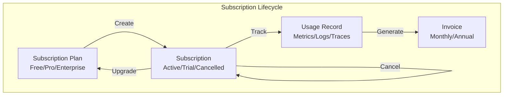
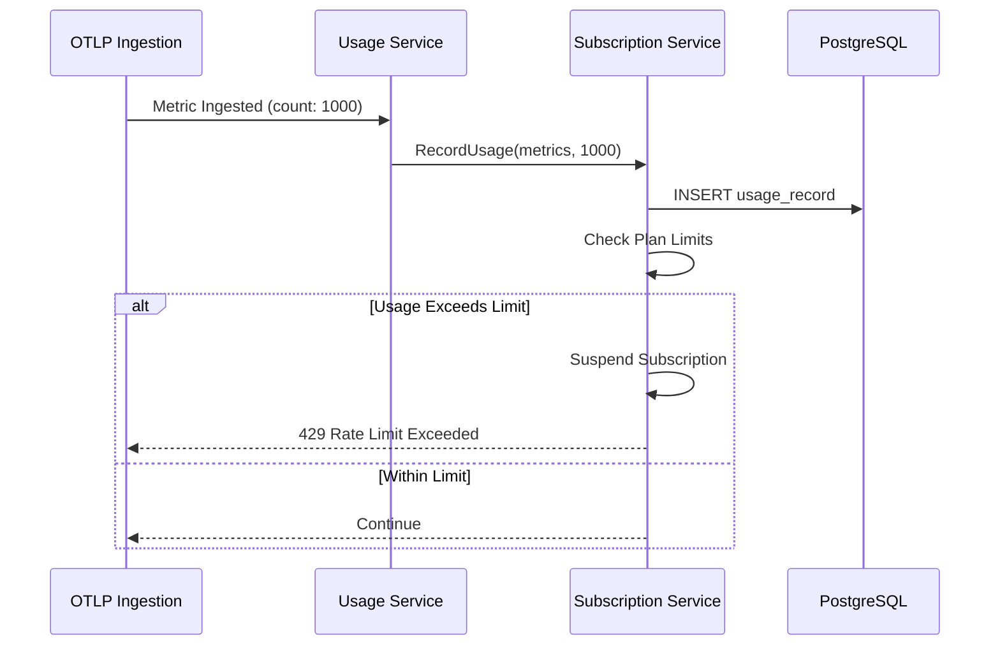

# Module 1000: Subscription Management

- **Module**: `1000-subscription`
- **Category**: Backend / Business Modules
- **Status**: Production Ready
- **Priority:** 🔥 HIGH - Core SaaS Billing
- **Version**: 1.1.2-CE

---

## Overview

The **Subscription module** manages **billing, plans, and usage tracking** for the TelemetryFlow platform. It provides:

- **Tiered plans**: Free, Pro, Enterprise tiers
- **Usage tracking**: Metrics, logs, traces consumption
- **Billing cycles**: Monthly and annual billing
- **Invoice generation**: Automated invoicing
- **Upgrade/downgrade**: Seamless plan transitions
- **Usage limits**: Enforce plan quotas

---

## Architecture



---

## Domain Model

### Subscription Aggregate

```typescript
// domain/aggregates/Subscription.ts
export enum SubscriptionStatus {
  ACTIVE = 'ACTIVE',
  CANCELLED = 'CANCELLED',
  EXPIRED = 'EXPIRED',
  TRIAL = 'TRIAL',
  SUSPENDED = 'SUSPENDED',
}

export class Subscription extends AggregateRoot<SubscriptionId> {
  private constructor(
    id: SubscriptionId,
    public organizationId: string,
    public planId: SubscriptionPlanId,
    public status: SubscriptionStatus,
    public billingCycle: BillingCycle | null,
    public currentPeriodStart: Date,
    public currentPeriodEnd: Date,
    public cancelledAt: Date | null,
  ) {
    super(id);
  }

  static create(
    organizationId: string,
    planId: SubscriptionPlanId,
    billingCycle: BillingCycle,
    isTrial: boolean = false,
  ): Subscription {
    const id = SubscriptionId.create();
    const status = isTrial ? SubscriptionStatus.TRIAL : SubscriptionStatus.ACTIVE;

    const now = new Date();
    const periodEnd = new Date(now);
    periodEnd.setMonth(periodEnd.getMonth() + (billingCycle.isAnnual() ? 12 : 1));

    const subscription = new Subscription(
      id,
      organizationId,
      planId,
      status,
      billingCycle,
      now,
      periodEnd,
      null,
    );

    subscription.addDomainEvent(new SubscriptionCreatedEvent(subscription));
    return subscription;
  }

  upgrade(newPlanId: SubscriptionPlanId): void {
    const oldPlanId = this.planId;
    this.planId = newPlanId;
    this.addDomainEvent(new SubscriptionUpgradedEvent(this, oldPlanId, newPlanId));
  }

  downgrade(newPlanId: SubscriptionPlanId): void {
    const oldPlanId = this.planId;
    this.planId = newPlanId;
    this.addDomainEvent(new SubscriptionDowngradedEvent(this, oldPlanId, newPlanId));
  }

  cancel(): void {
    this.status = SubscriptionStatus.CANCELLED;
    this.cancelledAt = new Date();
    this.addDomainEvent(new SubscriptionCancelledEvent(this.id));
  }

  suspend(): void {
    this.status = SubscriptionStatus.SUSPENDED;
    this.addDomainEvent(new SubscriptionSuspendedEvent(this.id));
  }

  isActive(): boolean {
    return this.status === SubscriptionStatus.ACTIVE;
  }
}
```

### Subscription Plans

```typescript
// domain/aggregates/SubscriptionPlan.ts
export enum PlanTier {
  FREE = 'FREE',
  PRO = 'PRO',
  ENTERPRISE = 'ENTERPRISE',
}

export class SubscriptionPlan extends AggregateRoot<SubscriptionPlanId> {
  constructor(
    id: SubscriptionPlanId,
    public name: string,
    public tier: PlanTier,
    public monthlyPrice: PriceAmount,
    public annualPrice: PriceAmount,
    public features: PlanFeatures,
    public limits: PlanLimits,
  ) {
    super(id);
  }
}

export interface PlanLimits {
  maxMetricsPerMonth: number;
  maxLogsPerMonth: number;
  maxTracesPerMonth: number;
  maxRetentionDays: number;
  maxUsers: number;
  maxWorkspaces: number;
  maxAlertRules: number;
  maxDashboards: number;
}
```

---

## Database Schema

```sql
CREATE TABLE subscription_plans (
  plan_id UUID PRIMARY KEY DEFAULT gen_random_uuid(),

  name VARCHAR(100) NOT NULL,
  tier VARCHAR(20) NOT NULL, -- FREE, PRO, ENTERPRISE

  monthly_price DECIMAL(10, 2) NOT NULL,
  annual_price DECIMAL(10, 2) NOT NULL,
  currency VARCHAR(3) DEFAULT 'USD',

  -- Limits (JSONB for flexibility)
  limits JSONB NOT NULL,

  -- Features
  features JSONB NOT NULL,

  is_active BOOLEAN DEFAULT true,
  created_at TIMESTAMP DEFAULT NOW(),

  CHECK (tier IN ('FREE', 'PRO', 'ENTERPRISE'))
);

CREATE TABLE subscriptions (
  subscription_id UUID PRIMARY KEY DEFAULT gen_random_uuid(),

  organization_id UUID REFERENCES organizations(organization_id) ON DELETE CASCADE,
  plan_id UUID REFERENCES subscription_plans(plan_id),

  status VARCHAR(20) NOT NULL DEFAULT 'ACTIVE',
  billing_cycle VARCHAR(20), -- MONTHLY, ANNUAL

  current_period_start TIMESTAMP NOT NULL,
  current_period_end TIMESTAMP NOT NULL,

  cancelled_at TIMESTAMP,

  created_at TIMESTAMP DEFAULT NOW(),
  updated_at TIMESTAMP DEFAULT NOW(),

  CHECK (status IN ('ACTIVE', 'CANCELLED', 'EXPIRED', 'TRIAL', 'SUSPENDED')),
  CHECK (billing_cycle IN ('MONTHLY', 'ANNUAL'))
);

CREATE TABLE usage_records (
  usage_id UUID PRIMARY KEY DEFAULT gen_random_uuid(),

  subscription_id UUID REFERENCES subscriptions(subscription_id) ON DELETE CASCADE,
  organization_id UUID REFERENCES organizations(organization_id),

  metric_type VARCHAR(50) NOT NULL, -- metrics, logs, traces
  quantity BIGINT NOT NULL,

  recorded_at TIMESTAMP DEFAULT NOW(),

  INDEX idx_usage_subscription (subscription_id, recorded_at),
  INDEX idx_usage_org (organization_id, recorded_at)
);

CREATE TABLE invoices (
  invoice_id UUID PRIMARY KEY DEFAULT gen_random_uuid(),

  subscription_id UUID REFERENCES subscriptions(subscription_id),
  organization_id UUID REFERENCES organizations(organization_id),

  amount DECIMAL(10, 2) NOT NULL,
  currency VARCHAR(3) DEFAULT 'USD',

  status VARCHAR(20) DEFAULT 'PENDING', -- PENDING, PAID, FAILED

  period_start TIMESTAMP NOT NULL,
  period_end TIMESTAMP NOT NULL,

  due_date TIMESTAMP NOT NULL,
  paid_at TIMESTAMP,

  created_at TIMESTAMP DEFAULT NOW(),

  CHECK (status IN ('PENDING', 'PAID', 'FAILED', 'REFUNDED'))
);
```

---

## Subscription Plans

| Plan | Metrics/Month | Logs/Month | Traces/Month | Retention | Users | Price |
|------|---------------|------------|--------------|-----------|-------|-------|
| **Free** | 1M | 100K | 50K | 7 days | 1 | $0 |
| **Pro** | 100M | 10M | 5M | 30 days | 10 | $99/mo |
| **Enterprise** | Unlimited | Unlimited | Unlimited | 365 days | Unlimited | Custom |

---

## Usage Tracking Flow



---

## API Endpoints

| Method | Endpoint | Description | Required Permission |
|--------|----------|-------------|---------------------|
| `GET` | `/api/v1/subscription/plans` | List available plans | Public |
| `GET` | `/api/v1/subscription` | Get current subscription | `subscription:read:org` |
| `POST` | `/api/v1/subscription` | Create subscription | `subscription:write:org` |
| `POST` | `/api/v1/subscription/upgrade` | Upgrade plan | `subscription:write:org` |
| `POST` | `/api/v1/subscription/downgrade` | Downgrade plan | `subscription:write:org` |
| `POST` | `/api/v1/subscription/cancel` | Cancel subscription | `subscription:write:org` |
| `GET` | `/api/v1/subscription/usage` | Get current usage | `subscription:read:org` |
| `GET` | `/api/v1/subscription/invoices` | List invoices | `subscription:read:org` |

---

## Configuration

```bash
# Subscription Settings
SUBSCRIPTION_FREE_TRIAL_DAYS=14
SUBSCRIPTION_GRACE_PERIOD_DAYS=7

# Usage Limits
FREE_TIER_METRICS_PER_MONTH=1000000
PRO_TIER_METRICS_PER_MONTH=100000000
FREE_TIER_RETENTION_DAYS=7
PRO_TIER_RETENTION_DAYS=30

# Billing
STRIPE_SECRET_KEY=sk_live_xxx
STRIPE_WEBHOOK_SECRET=whsec_xxx
INVOICE_DUE_DAYS=7
```

---

## Related Documentation

- [Module 100: Core](./100-core.md) - Organization management

---

- **Last Updated**: January 01st, 2026
- **Maintained By**: DevOpsCorner Indonesia
