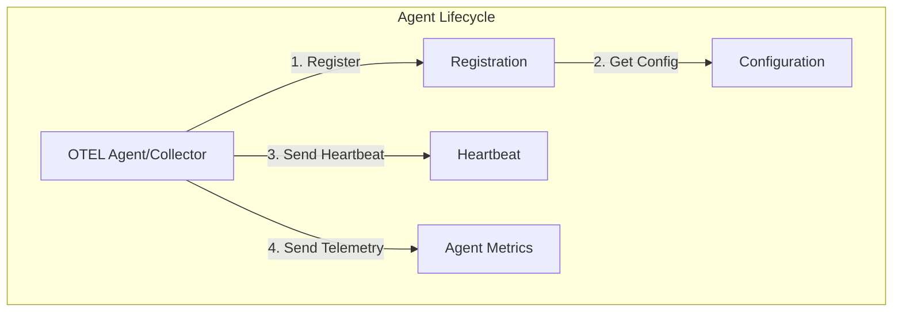

# Module 1100: Agent Management

- **Module**: `1100-agents`
- **Category**: Backend / Business Modules
- **Status**: Production Ready
- **Priority:** 🔥 HIGH - Core Monitoring Functionality
- **Version**: 3.10.0

---

## Overview

The **Agent Management module** handles **OTEL collector and agent registration, configuration, and health tracking**. It provides:

- **Agent registration**: Auto-register OTEL collectors
- **Configuration management**: Centralized agent config
- **Health monitoring**: Track agent status and heartbeats
- **Version tracking**: Monitor agent versions
- **Remote configuration**: Push config updates to agents

---

## Architecture



---

## Domain Model

```typescript
// domain/aggregates/Agent.ts
export class Agent extends AggregateRoot<AgentId> {
  constructor(
    id: AgentId,
    public name: string,
    public hostname: string,
    public ipAddress: string,
    public version: string,
    public status: AgentStatus,
    public lastHeartbeat: Date,
    public organizationId: OrganizationId,
    public workspaceId: WorkspaceId,
    public tenantId: TenantId,
  ) {
    super(id);
  }

  static register(
    name: string,
    hostname: string,
    ipAddress: string,
    version: string,
    organizationId: OrganizationId,
  ): Agent {
    const agent = new Agent(
      AgentId.create(),
      name,
      hostname,
      ipAddress,
      version,
      AgentStatus.ONLINE,
      new Date(),
      organizationId,
      null,
      null,
    );

    agent.addDomainEvent(new AgentRegisteredEvent(agent));
    return agent;
  }

  updateHeartbeat(): void {
    this.lastHeartbeat = new Date();
    this.status = AgentStatus.ONLINE;
  }

  markOffline(): void {
    this.status = AgentStatus.OFFLINE;
    this.addDomainEvent(new AgentOfflineEvent(this.id));
  }
}

export enum AgentStatus {
  ONLINE = 'ONLINE',
  OFFLINE = 'OFFLINE',
  DEGRADED = 'DEGRADED',
}
```

---

## Database Schema

```sql
CREATE TABLE agents (
  agent_id UUID PRIMARY KEY DEFAULT gen_random_uuid(),

  name VARCHAR(255) NOT NULL,
  hostname VARCHAR(255) NOT NULL,
  ip_address INET,
  version VARCHAR(50),

  status VARCHAR(20) DEFAULT 'ONLINE',
  last_heartbeat TIMESTAMP DEFAULT NOW(),

  -- Multi-tenancy
  organization_id UUID REFERENCES organizations(organization_id),
  workspace_id UUID REFERENCES workspaces(workspace_id),
  tenant_id UUID REFERENCES tenants(tenant_id),

  -- Configuration
  config JSONB DEFAULT '{}',

  -- Timestamps
  registered_at TIMESTAMP DEFAULT NOW(),
  updated_at TIMESTAMP DEFAULT NOW(),
  deleted_at TIMESTAMP,

  CHECK (status IN ('ONLINE', 'OFFLINE', 'DEGRADED'))
);

CREATE INDEX idx_agents_status ON agents(status);
CREATE INDEX idx_agents_last_heartbeat ON agents(last_heartbeat);
```

---

## API Endpoints

| Method | Endpoint | Description |
|--------|----------|-------------|
| `POST` | `/api/v1/agents/register` | Register new agent |
| `POST` | `/api/v1/agents/:id/heartbeat` | Send heartbeat |
| `GET` | `/api/v1/agents` | List agents |
| `GET` | `/api/v1/agents/:id` | Get agent details |
| `DELETE` | `/api/v1/agents/:id` | Deregister agent |

---

- **Last Updated**: December 12, 2025
- **Maintained By**: DevOpsCorner Indonesia
