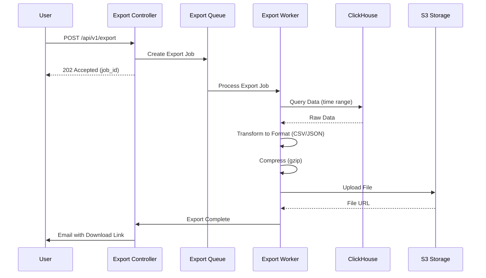

# Module 1300: Data Export

- **Module**: `1300-export`
- **Category**: Backend / Business Modules
- **Status**: Production Ready
- **Priority:** 🔥 HIGH - Core Platform Functionality
- **Version**: 3.10.0

---

## Overview

The **Data Export module** enables **exporting telemetry data** in multiple formats for analysis and compliance. Features:

- **Multiple formats**: CSV, JSON, Parquet
- **Time-range selection**: Export specific time windows
- **Async processing**: Large exports via background jobs
- **Compression**: Gzip compression for large files
- **Download links**: Temporary signed URLs

---

## Export Flow



---

## Database Schema

```sql
CREATE TABLE export_jobs (
  job_id UUID PRIMARY KEY DEFAULT gen_random_uuid(),

  -- User Info
  user_id UUID REFERENCES users(user_id),
  organization_id UUID REFERENCES organizations(organization_id),

  -- Export Configuration
  data_type VARCHAR(50) NOT NULL, -- metrics, logs, traces
  format VARCHAR(20) NOT NULL, -- csv, json, parquet

  start_time TIMESTAMP NOT NULL,
  end_time TIMESTAMP NOT NULL,

  filters JSONB,

  -- Status
  status VARCHAR(20) DEFAULT 'PENDING',
  progress INTEGER DEFAULT 0,

  -- Output
  file_url TEXT,
  file_size BIGINT,

  error_message TEXT,

  created_at TIMESTAMP DEFAULT NOW(),
  completed_at TIMESTAMP,

  CHECK (status IN ('PENDING', 'PROCESSING', 'COMPLETED', 'FAILED')),
  CHECK (format IN ('csv', 'json', 'parquet'))
);
```

---

## API Endpoints

| Method | Endpoint | Description |
|--------|----------|-------------|
| `POST` | `/api/v1/export` | Create export job |
| `GET` | `/api/v1/export/:id` | Get export status |
| `GET` | `/api/v1/export/:id/download` | Download export file |

---

- **Last Updated**: December 12, 2025
- **Maintained By**: DevOpsCorner Indonesia
