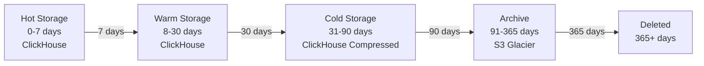

# Module 1500: Data Retention Policy

- **Module**: `1500-retention-policy`
- **Category**: Backend / Business Modules
- **Status**: Production Ready
- **Priority:** 🔥 HIGH - Core Platform Functionality
- **Version**: 1.1.2-CE

---

## Overview

The **Data Retention Policy module** manages **automatic data cleanup and archival** based on configurable policies. Features:

- **TTL-based deletion**: Automatic data expiration
- **Tiered storage**:
  - Hot
  - Warm
  - Cold
  - Archived
- **Compliance policies**: GDPR, HIPAA retention requirements
- **Custom policies**: Per-tenant retention settings
- **Audit trail**: Log all deletion activities

---

## Retention Tiers



---

## Default Retention Policies

| Data Type | Hot (Fast Query) | Warm | Cold | Archive | Total |
|-----------|------------------|------|------|---------|-------|
| **Metrics** | 7 days | 30 days | 90 days | 365 days | 492 days |
| **Logs** | 7 days | 14 days | 30 days | 90 days | 141 days |
| **Traces** | 7 days | 14 days | 30 days | - | 51 days |

---

## Database Schema

```sql
CREATE TABLE retention_policies (
  policy_id UUID PRIMARY KEY DEFAULT gen_random_uuid(),

  name VARCHAR(255) NOT NULL,
  data_type VARCHAR(50) NOT NULL,

  hot_retention_days INTEGER DEFAULT 7,
  warm_retention_days INTEGER DEFAULT 30,
  cold_retention_days INTEGER DEFAULT 90,
  archive_retention_days INTEGER DEFAULT 365,

  -- Multi-tenancy (null = global default)
  organization_id UUID REFERENCES organizations(organization_id),
  workspace_id UUID REFERENCES workspaces(workspace_id),
  tenant_id UUID REFERENCES tenants(tenant_id),

  is_active BOOLEAN DEFAULT true,
  created_at TIMESTAMP DEFAULT NOW(),

  CHECK (data_type IN ('metrics', 'logs', 'traces'))
);
```

---

## ClickHouse TTL Configuration

```sql
-- Metrics table with TTL
CREATE TABLE telemetry_metrics (
  ...
  timestamp DateTime64(3),
  ...
)
ENGINE = MergeTree()
TTL timestamp + INTERVAL 90 DAY; -- Auto-delete after 90 days

-- Compressed storage for warm data
ALTER TABLE telemetry_metrics
MODIFY TTL
  timestamp + INTERVAL 7 DAY TO VOLUME 'hot',
  timestamp + INTERVAL 30 DAY TO VOLUME 'warm',
  timestamp + INTERVAL 90 DAY DELETE;
```

---

## API Endpoints

| Method | Endpoint | Description |
|--------|----------|-------------|
| `POST` | `/api/v1/retention-policies` | Create policy |
| `GET` | `/api/v1/retention-policies` | List policies |
| `GET` | `/api/v1/retention-policies/:id` | Get policy |
| `PATCH` | `/api/v1/retention-policies/:id` | Update policy |

---

- **Last Updated**: January 01st, 2026
- **Maintained By**: DevOpsCorner Indonesia
