# Module: 200-auth (Authentication & Authorization)

- **Module**: `200-auth`
- **Category**: Backend / Business Modules
- **Status**: Production Ready
- **Priority:** 🔥 CRITICAL - Security Foundation
- **Version**: 3.10.0

---

## Module Overview

```mermaid
graph TB
    subgraph "200-auth Module"
        A[JWT Authentication<br/>Access + Refresh Tokens]
        B[Multi-Factor Auth<br/>TOTP-based MFA]
        C[Session Management<br/>Redis-backed Sessions]
        D[Password Security<br/>Argon2id Hashing]
    end

    subgraph "Key Features"
        E[✅ JWT with 15min Expiry]
        F[✅ TOTP MFA Support]
        G[✅ Account Lockout Protection]
        H[✅ Token Blacklisting]
    end

    A --> E
    B --> F
    C --> G
    D --> H

    style A fill:#ff6b6b
    style B fill:#4ecdc4
    style C fill:#45b7d1
    style D fill:#f9ca24
```



**Purpose:** Comprehensive authentication and authorization system with JWT, MFA, session management, and security controls.

**Location:** `backend/src/modules/200-auth/`

---

## Architecture

### Module Structure


---

## Authentication Flows

### Complete Login Flow


### Registration Flow


### Token Refresh Flow


---

## Domain Model

### Auth Aggregate

```typescript
// domain/aggregates/Auth.aggregate.ts
export class Auth extends AggregateRoot {
  private readonly _id: AuthId;
  private readonly _userId: UserId;
  private _credentials: Credentials;  // Value Object with password hash
  private _mfaEnabled: boolean;
  private _mfaSecret?: MFASecret;
  private _emailVerified: boolean;
  private _verificationToken?: string;
  private _verificationTokenExpiry?: Date;

  static create(
    userId: UserId,
    email: string,
    password: string,
    passwordPolicyService: PasswordPolicyService
  ): Auth {
    // Business Rule: Password must meet strength requirements
    const validationResult = passwordPolicyService.validatePassword(password);
    if (!validationResult.isValid) {
      throw new DomainError(validationResult.errors.join(', '));
    }

    // Business Rule: Email must be unique (checked in handler)
    const hashedPassword = await passwordPolicyService.hashPassword(password);
    const credentials = Credentials.create(email, hashedPassword);

    const auth = new Auth({
      id: AuthId.create(),
      userId,
      credentials,
      mfaEnabled: false,
      emailVerified: false,
    });

    auth.apply(new AuthCreated(auth));
    return auth;
  }

  validatePassword(
    plainPassword: string,
    passwordPolicyService: PasswordPolicyService
  ): boolean {
    return passwordPolicyService.verifyPassword(
      plainPassword,
      this._credentials.passwordHash
    );
  }

  enableMfa(secret: MFASecret): void {
    this._mfaEnabled = true;
    this._mfaSecret = secret;
    this.apply(new MfaEnabled(this._userId));
  }

  verifyEmail(token: string): void {
    // Business Rule: Token must match and not be expired
    if (this._verificationToken !== token) {
      throw new DomainError('Invalid verification token');
    }
    if (!this._verificationTokenExpiry || new Date() > this._verificationTokenExpiry) {
      throw new DomainError('Verification token expired');
    }

    this._emailVerified = true;
    this._verificationToken = undefined;
    this._verificationTokenExpiry = undefined;
  }
}
```

### Security Services


---

## Security Features

### Password Policy


**Password Requirements:**
- ✅ Minimum 12 characters
- ✅ At least 1 uppercase letter
- ✅ At least 1 lowercase letter
- ✅ At least 1 number
- ✅ At least 1 special character
- ✅ Not in common password list
- ✅ Hashed using Argon2id (OWASP recommended)

**Argon2id Configuration:**
```typescript
{
  type: argon2.argon2id,
  memoryCost: 65536,  // 64 MB
  timeCost: 3,        // 3 iterations
  parallelism: 4      // 4 threads
}
```

### Account Lockout


**Lockout Rules:**
- 🔒 Lock after 5 failed attempts
- ⏱️ Lockout duration: 15 minutes (900 seconds)
- ✅ Reset counter on successful login
- 🔓 Admin can manually unlock

### Token Security

| Token Type | Lifetime | Storage | Revocation |
|------------|----------|---------|------------|
| **Access Token** | 15 minutes | Client (memory) | Blacklist on logout |
| **Refresh Token** | 7 days | Client (secure cookie) | Blacklist on refresh |
| **Verification Token** | 24 hours | Database | Single-use |
| **Reset Token** | 1 hour | Database | Single-use |
| **MFA Temp Token** | 5 minutes | Client | Blacklist after MFA |

---

## Database Schema

### Auth Table (PostgreSQL)

```sql
CREATE TABLE auth (
  id UUID PRIMARY KEY DEFAULT gen_random_uuid(),
  user_id UUID NOT NULL UNIQUE,
  email VARCHAR(255) NOT NULL UNIQUE,
  password_hash VARCHAR(255) NOT NULL,  -- Argon2id hash

  -- Email Verification
  email_verified BOOLEAN NOT NULL DEFAULT false,
  verification_token VARCHAR(255),
  verification_token_expiry TIMESTAMP,

  -- Password Reset
  reset_token VARCHAR(255),
  reset_token_expiry TIMESTAMP,

  -- MFA
  mfa_enabled BOOLEAN NOT NULL DEFAULT false,
  mfa_secret VARCHAR(255),  -- Encrypted TOTP secret

  -- Security
  failed_login_attempts INT NOT NULL DEFAULT 0,
  locked_until TIMESTAMP,
  last_login_at TIMESTAMP,
  last_login_ip VARCHAR(45),

  -- Password Management
  password_changed_at TIMESTAMP,
  password_expires_at TIMESTAMP,
  must_change_password BOOLEAN DEFAULT false,

  -- Timestamps
  created_at TIMESTAMP NOT NULL DEFAULT NOW(),
  updated_at TIMESTAMP NOT NULL DEFAULT NOW(),

  CONSTRAINT fk_user FOREIGN KEY (user_id)
    REFERENCES users(id) ON DELETE CASCADE
);

-- Indexes
CREATE UNIQUE INDEX idx_auth_email ON auth(email);
CREATE UNIQUE INDEX idx_auth_user_id ON auth(user_id);
CREATE INDEX idx_auth_verification_token ON auth(verification_token);
CREATE INDEX idx_auth_reset_token ON auth(reset_token);
```

### Session Table (Redis)

```
Key Pattern: session:{userId}:{sessionId}

Value (JSON):
{
  "userId": "uuid",
  "sessionId": "uuid",
  "accessToken": "jwt-token",
  "refreshToken": "jwt-token",
  "ipAddress": "192.168.1.1",
  "userAgent": "Mozilla/5.0...",
  "createdAt": "2025-01-15T10:00:00Z",
  "lastAccessedAt": "2025-01-15T10:30:00Z",
  "expiresAt": "2025-01-22T10:00:00Z"
}

TTL: 7 days (604800 seconds)
```

---

## API Endpoints

### Endpoint Summary

| Endpoint | Method | Auth | Description |
|----------|--------|------|-------------|
| `/auth/login` | POST | Public | Email/password login |
| `/auth/register` | POST | Public | Create account |
| `/auth/verify-email` | POST | Public | Verify email with token |
| `/auth/forgot-password` | POST | Public | Request password reset |
| `/auth/reset-password` | POST | Public | Reset password with token |
| `/auth/mfa/validate` | POST | Public | Complete MFA challenge |
| `/auth/refresh` | POST | Public | Refresh access token |
| `/auth/logout` | POST | JWT | Invalidate session |
| `/auth/me` | GET | JWT | Get current user |
| `/auth/change-password` | POST | JWT | Change password |
| `/auth/password/status` | GET | JWT | Check password expiry |
| `/auth/settings/mfa/enable` | POST | JWT | Enable MFA |
| `/auth/settings/mfa/disable` | POST | JWT | Disable MFA |

---

## Configuration

### Environment Variables

```bash
# JWT Configuration
JWT_SECRET=your-secret-key-min-32-chars
JWT_ACCESS_TOKEN_EXPIRY=15m
JWT_REFRESH_TOKEN_EXPIRY=7d

# Password Policy
PASSWORD_MIN_LENGTH=12
PASSWORD_REQUIRE_UPPERCASE=true
PASSWORD_REQUIRE_LOWERCASE=true
PASSWORD_REQUIRE_NUMBER=true
PASSWORD_REQUIRE_SYMBOL=true
PASSWORD_EXPIRY_DAYS=90

# Account Lockout
ACCOUNT_LOCKOUT_ATTEMPTS=5
ACCOUNT_LOCKOUT_DURATION=900  # seconds

# MFA
MFA_ISSUER=TelemetryFlow
MFA_WINDOW=1  # Allow 1 step before/after current time
```

---

## API Examples

### Login

```bash
curl -X POST http://localhost:3000/api/v2/auth/login \
  -H "Content-Type: application/json" \
  -d '{
    "email": "user@example.com",
    "password": "SecurePassword123!"
  }'

# Response:
{
  "accessToken": "eyJhbGc...",
  "refreshToken": "eyJhbGc...",
  "expiresIn": 900,
  "mfaRequired": false
}
```

### Register

```bash
curl -X POST http://localhost:3000/api/v2/auth/register \
  -H "Content-Type: application/json" \
  -d '{
    "email": "newuser@example.com",
    "password": "SecurePassword123!",
    "first_name": "John",
    "last_name": "Doe"
  }'

# Response:
{
  "message": "Registration successful. Please check your email to verify your account."
}
```

---

## Related Modules


---

## Testing

### Unit Tests
- `Auth.aggregate.spec.ts` - Domain logic
- `PasswordPolicyService.spec.ts` - Password validation
- `AccountLockoutService.spec.ts` - Lockout logic

### Integration Tests
- `auth-flow.spec.ts` - Complete login flow
- `mfa-flow.spec.ts` - MFA validation

### E2E Tests
- `authentication.e2e.spec.ts` - Full auth lifecycle

---

- **File Location:** `./backend/modules/200-auth.md`
- **Maintained By:** DevOpsCorner Indonesia
