# Module: 400-telemetry (OTLP Ingestion Engine)

- **Module**: `400-telemetry`
- **Category**: Backend / Business Modules
- **Status**: Production Ready
- **Priority:** 🔥 CRITICAL - Core Platform Functionality
- **Version**: 1.1.1-CE

---

## Module Overview

```mermaid
graph TB
    subgraph "400-telemetry Module"
        A[OTLP Ingestion<br/>Protobuf/JSON]
        B[Metrics Storage<br/>Time-Series]
        C[Logs Storage<br/>Structured Logs]
        D[Traces Storage<br/>Distributed Tracing]
    end

    subgraph "Key Features"
        E[✅ OTLP 1.0 Compliant]
        F[✅ 1000+ req/min Ingestion]
        G[✅ Multi-Tenant Isolation]
        H[✅ Async Processing]
    end

    A --> E
    B --> F
    C --> G
    D --> H

    style A fill:#ff6b6b
    style B fill:#4ecdc4
    style C fill:#45b7d1
    style D fill:#f9ca24
```



**Purpose:** OTLP-compliant telemetry ingestion engine for metrics, logs, and traces from OpenTelemetry SDKs and Collectors.

**Location:** `backend/src/modules/400-telemetry/`

---

## Architecture

### Module Structure


---

## OTLP Ingestion Flow

### Complete Ingestion Pipeline

```mermaid
sequenceDiagram
    participant SDK as OTEL SDK/Collector
    participant API as OtlpController
    participant Guard as ApiKeyAuthGuard
    participant Queue as BullMQ Queue
    participant Worker as OTLP Processor
    participant Mapper as Domain Mapper
    participant CH as ClickHouse
    participant Bus as EventBus

    SDK->>API: POST /v2/otlp/metrics<br/>Protobuf/JSON
    API->>Guard: Validate API Key
    Guard->>Guard: Check logs:write permission
    Guard-->>API: Authorized ✅

    API->>API: Extract Tenant Context<br/>Headers > Attributes
    API->>Queue: Add Job (async)<br/>Prevent HTTP timeout
    API-->>SDK: 202 Accepted (50ms)

    Queue->>Worker: Process Job<br/>10 concurrent workers
    Worker->>Mapper: Transform OTLP → Domain
    Mapper->>Mapper: Validate Business Rules<br/>Counter must be monotonic
    Mapper-->>Worker: Metric Aggregate

    Worker->>CH: Batch Insert<br/>async_insert=1
    CH-->>Worker: Success

    Worker->>Bus: Publish MetricIngested Event
    Bus->>Bus: Trigger Alert Evaluation
    Bus->>Bus: Update Aggregations
    Bus->>Bus: Audit Logging

    Note over SDK,Bus: High-throughput async pipeline<br/>1000+ req/min capability
```



### Endpoint Details

| Endpoint | Method | Auth | Rate Limit | Purpose |
|----------|--------|------|------------|---------|
| `/v2/otlp/metrics` | POST | API Key | 1000/min | OTLP metrics ingestion |
| `/v2/otlp/logs` | POST | API Key | 1000/min | OTLP logs ingestion |
| `/v2/otlp/traces` | POST | API Key | 1000/min | OTLP traces ingestion |
| `/v2/telemetry/metrics` | GET | JWT | 100/min | Query metrics |
| `/v2/telemetry/logs` | GET | JWT | 100/min | Query logs |
| `/v2/telemetry/traces` | GET | JWT | 100/min | Query traces |

---

## Domain Model

### Metric Aggregate

```typescript
// domain/aggregates/Metric.aggregate.ts
export class Metric extends AggregateRoot {
  private readonly _id: MetricId;
  private readonly _metricName: MetricName;  // Value Object
  private readonly _metricType: MetricType;  // gauge, counter, histogram
  private _value: MetricValue;
  private readonly _timestamp: Timestamp;
  private readonly _tenantContext: TenantContext;

  static create(props: MetricProps): Metric {
    // Business Rule: Counter metrics must be monotonic
    if (props.metricType.isCounter() && props.isMonotonic === false) {
      throw new DomainError('Counter metrics must be monotonic');
    }

    // Business Rule: Counter values cannot be negative
    if (props.metricType.isCounter() && props.value.isNegative()) {
      throw new DomainError('Counter values cannot be negative');
    }

    const metric = new Metric(props);
    metric.apply(new MetricIngested(metric));
    return metric;
  }

  updateValue(newValue: MetricValue): void {
    if (this._metricType.isCounter() && newValue.isLessThan(this._value)) {
      throw new DomainError('Counter values cannot decrease');
    }
    this._value = newValue;
    this.apply(new MetricValueUpdated(this));
  }
}
```

### Value Objects


---

## ClickHouse Schema

### Metrics Table

```sql
CREATE TABLE telemetry_metrics (
  id String,
  timestamp DateTime64(3),
  service_name String,
  metric_name String,
  metric_type Enum8('gauge' = 1, 'counter' = 2, 'histogram' = 3, 'summary' = 4),
  value Float64,
  unit String,

  -- Multi-tenancy
  tenant_id String,
  workspace_id String,
  organization_id String,

  -- Attributes
  attributes Map(String, String),
  resource_attributes Map(String, String),

  -- Metadata
  scope_name String,
  scope_version String,

  -- Materialized columns for fast aggregation
  date Date MATERIALIZED toDate(timestamp),
  hour DateTime MATERIALIZED toStartOfHour(timestamp)
)
ENGINE = MergeTree()
PARTITION BY toYYYYMMDD(timestamp)
ORDER BY (service_name, metric_name, timestamp)
TTL timestamp + INTERVAL 30 DAY;
```

### Indexes for Performance


**Performance Results:**
- Bloom Filters: 10-50x faster for string searches
- MinMax: 5-20x faster for range queries
- Partitioning: Skip 80-95% of data for time-range queries

---

## Query Patterns

### Time Series Query

```typescript
// application/queries/GetMetricTimeSeries.query.ts
@QueryHandler(GetMetricTimeSeriesQuery)
export class GetMetricTimeSeriesHandler {
  async execute(query: GetMetricTimeSeriesQuery): Promise<TimeSeriesResult> {
    // 1. Check cache
    const cacheKey = `timeseries:${query.tenantContext.tenantId}:${query.metricName}`;
    const cached = await this.cache.get(cacheKey);
    if (cached) return cached;

    // 2. Query ClickHouse with optimizations
    const result = await this.repository.findTimeSeries({
      metricName: query.metricName,
      startTime: query.startTime,
      endTime: query.endTime,
      aggregation: query.aggregation, // avg, sum, min, max
      interval: query.interval,       // 1m, 5m, 1h
      tenantContext: query.tenantContext,
    });

    // 3. Cache result
    await this.cache.set(cacheKey, result, 300); // 5min TTL
    return result;
  }
}
```

### Query Flow Diagram


---

## Key Features

### 1. OTLP Format Support

**Supported Formats:**
- ✅ Protobuf (application/x-protobuf)
- ✅ JSON (application/json)

**OTLP Versions:**
- ✅ OTLP 1.0 (Stable)
- ✅ OTLP 0.x (Legacy compatibility)

### 2. Tenant Context Extraction


**Priority Order:**
1. HTTP Headers (`X-Tenant-ID`, `X-Workspace-ID`)
2. OTLP Resource Attributes (`telemetryflow.tenant.id`)
3. Default Tenant from API Key

### 3. Async Processing

**Queue Configuration:**
```typescript
{
  name: 'otlp-ingestion',
  concurrency: 10,        // 10 workers
  rateLimit: 1000,        // 1000 jobs/sec
  priority: 2,            // HIGH priority
  attempts: 3,            // Retry 3 times
  backoff: 'exponential', // 1s, 2s, 4s
}
```

### 4. Data Transformation


---

## Performance Metrics

### Ingestion Performance

```mermaid
graph LR
    subgraph "Ingestion Pipeline"
        A[HTTP Request<br/>50ms]
        B[Queue Add<br/>10ms]
        C[Worker Process<br/>100ms]
        D[CH Insert<br/>50ms]
    end

    subgraph "Total Latency"
        E[Client Response: 60ms ⚡<br/>Queue handles rest async]
        F[End-to-End: 210ms<br/>From SDK to stored]
    end

    A --> B
    B --> C
    C --> D

    B --> E
    D --> F

    style E fill:#27ae60
    style F fill:#4ecdc4
```



**Throughput:** 800-1200 jobs/sec (10 workers × ~100 jobs/sec each)

### Query Performance

| Query Type | Cache Hit | Cache Miss | Optimization |
|------------|-----------|------------|--------------|
| **Time Series (1h)** | 10ms | 200ms | Partition pruning |
| **Time Series (24h)** | 15ms | 500ms | Hourly aggregations |
| **Service List** | 5ms | 100ms | Materialized view |
| **Metric Names** | 5ms | 150ms | Bloom filter index |

---

## Configuration

### Environment Variables

```bash
# ClickHouse Configuration
CLICKHOUSE_HOST=localhost
CLICKHOUSE_PORT=8123
CLICKHOUSE_DATABASE=telemetry
CLICKHOUSE_USERNAME=default
CLICKHOUSE_PASSWORD=

# Queue Configuration
QUEUE_OTLP_CONCURRENCY=10
QUEUE_OTLP_RATE_LIMIT=1000

# Cache Configuration
CACHE_METRICS_TTL=300  # 5 minutes
```

---

## API Examples

### Ingest Metrics (OTLP)

```bash
curl -X POST http://localhost:3000/api/v2/otlp/metrics \
  -H "X-API-Key-ID: tfk-abc123..." \
  -H "X-API-Key-Secret: tfs-xyz789..." \
  -H "Content-Type: application/json" \
  -d '{
    "resourceMetrics": [{
      "resource": {
        "attributes": [
          {"key": "service.name", "value": {"stringValue": "api-gateway"}},
          {"key": "telemetryflow.tenant.id", "value": {"stringValue": "tenant-123"}}
        ]
      },
      "scopeMetrics": [{
        "metrics": [{
          "name": "http_requests_total",
          "unit": "1",
          "sum": {
            "dataPoints": [{
              "timeUnixNano": "1704067200000000000",
              "asInt": "1500"
            }]
          }
        }]
      }]
    }]
  }'
```

### Query Metrics

```bash
curl -X GET "http://localhost:3000/api/v2/telemetry/metrics/query?metricName=cpu_usage&startTime=2025-01-01T00:00:00Z&endTime=2025-01-02T00:00:00Z" \
  -H "Authorization: Bearer <jwt-token>"
```

---

## Related Modules


---

## Testing

### Unit Tests
- `Metric.aggregate.spec.ts` - Business rule validation
- `MetricName.vo.spec.ts` - Value object validation
- `IngestMetrics.handler.spec.ts` - Command handler logic

### Integration Tests
- `otlp-ingestion.spec.ts` - Full ingestion pipeline
- `metric-query.spec.ts` - Query performance

### E2E Tests
- `otlp-ingestion.e2e.spec.ts` - End-to-end OTLP flow

---

- **File Location:** `./backend/modules/400-telemetry.md`
- **Maintained By:** DevOpsCorner Indonesia
