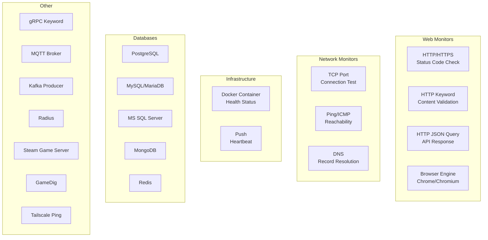
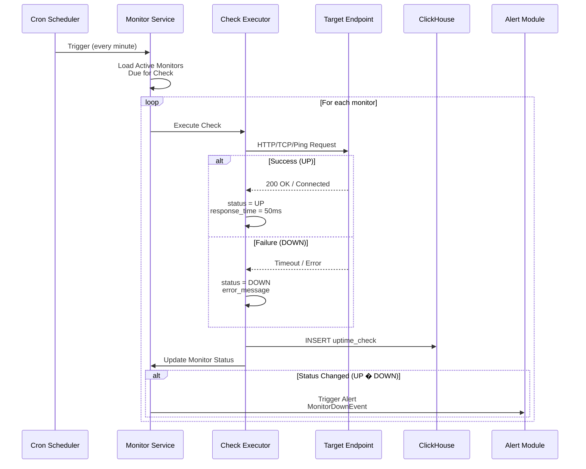

# Module 500: Monitoring (Uptime Checks)

- **Module**: `500-monitoring`
- **Category**: Backend / Business Modules
- **Status**: Production Ready
- **Priority:** 🔥 HIGH - Platform Foundation
- **Version**: 3.10.0

---

## Overview

The **Monitoring module** provides **uptime monitoring and health checks** for external services and endpoints. It supports:

- **14 monitor types**: HTTP, TCP, Ping, DNS, Docker, Databases, and more
- **Real-time status tracking**: UP, DOWN, PAUSED, UNKNOWN states
- **Automated checks**: Configurable heartbeat intervals (10s - 24h)
- **Multi-tenant aware**: Organization, workspace, and tenant scoping
- **Status pages**: Public status page generation
- **Alert integration**: Triggers alerts on status changes

---

## Monitor Types



---

## Domain Model

### Monitor Aggregate

```typescript
// domain/aggregates/Monitor.ts
export enum MonitorType {
  HTTP = 'HTTP(s)',
  TCP_PORT = 'TCP Port',
  PING = 'Ping',
  DNS = 'DNS',
  DOCKER_CONTAINER = 'Docker Container',
  POSTGRES = 'PostgreSQL',
  MYSQL_MARIADB = 'MySQL/MariaDB',
  REDIS = 'Redis',
  // ... 14 total types
}

export enum MonitorStatus {
  UP = 'UP',
  DOWN = 'DOWN',
  PAUSED = 'PAUSED',
  UNKNOWN = 'UNKNOWN',
}

export class Monitor extends AggregateRoot<MonitorId> {
  private constructor(
    id: MonitorId,
    public friendlyName: string,
    public url: string,
    public monitorType: MonitorType,
    public status: MonitorStatus,
    public heartbeatInterval: number, // seconds
    public retries: number,
    public isActive: boolean,
    public organizationId: OrganizationId,
    public workspaceId: WorkspaceId | null,
    public tenantId: TenantId | null,
  ) {
    super(id);
  }

  static create(
    friendlyName: string,
    url: string,
    monitorType: MonitorType,
    organizationId: OrganizationId,
    heartbeatInterval: number = 60,
  ): Monitor {
    const monitor = new Monitor(
      MonitorId.create(),
      friendlyName,
      url,
      monitorType,
      MonitorStatus.UNKNOWN,
      heartbeatInterval,
      0, // initial retries
      true,
      organizationId,
      null,
      null,
    );

    monitor.addDomainEvent(new MonitorCreatedEvent(monitor));
    return monitor;
  }

  changeStatus(newStatus: MonitorStatus): void {
    if (this.status !== newStatus) {
      const oldStatus = this.status;
      this.status = newStatus;
      this.addDomainEvent(new MonitorStatusChangedEvent(this, oldStatus, newStatus));
    }
  }

  pause(): void {
    this.isActive = false;
    this.status = MonitorStatus.PAUSED;
    this.addDomainEvent(new MonitorPausedEvent(this.id));
  }

  resume(): void {
    this.isActive = true;
    this.status = MonitorStatus.UNKNOWN;
    this.addDomainEvent(new MonitorResumedEvent(this.id));
  }
}
```

---

## Database Schema

### PostgreSQL

```sql
CREATE TABLE monitors (
  monitor_id UUID PRIMARY KEY DEFAULT gen_random_uuid(),

  -- Basic Info
  friendly_name VARCHAR(255) NOT NULL,
  url TEXT NOT NULL,
  monitor_type VARCHAR(50) NOT NULL,
  description TEXT,

  -- Multi-tenancy
  organization_id UUID REFERENCES organizations(organization_id) ON DELETE CASCADE,
  workspace_id UUID REFERENCES workspaces(workspace_id) ON DELETE CASCADE,
  tenant_id UUID REFERENCES tenants(tenant_id) ON DELETE CASCADE,

  -- Configuration
  heartbeat_interval INTEGER DEFAULT 60, -- seconds
  retries INTEGER DEFAULT 0,
  timeout INTEGER DEFAULT 30, -- seconds

  -- Status
  status VARCHAR(20) DEFAULT 'UNKNOWN', -- UP, DOWN, PAUSED, UNKNOWN
  is_active BOOLEAN DEFAULT true,

  -- Grouping
  monitor_group VARCHAR(255),
  tags TEXT[],

  -- Timestamps
  created_at TIMESTAMP DEFAULT NOW(),
  updated_at TIMESTAMP DEFAULT NOW(),
  deleted_at TIMESTAMP,

  CHECK (status IN ('UP', 'DOWN', 'PAUSED', 'UNKNOWN')),
  CHECK (heartbeat_interval >= 10 AND heartbeat_interval <= 86400)
);

CREATE INDEX idx_monitors_organization ON monitors(organization_id);
CREATE INDEX idx_monitors_status ON monitors(status);
CREATE INDEX idx_monitors_active ON monitors(is_active) WHERE deleted_at IS NULL;
```

### ClickHouse (Uptime Checks)

```sql
CREATE TABLE uptime_checks (
  check_id String,
  monitor_id String,

  timestamp DateTime64(3),
  status Enum8('UP'=1, 'DOWN'=2),
  response_time UInt32, -- milliseconds

  -- HTTP specific
  http_status_code Nullable(UInt16),
  http_response_body Nullable(String),

  -- Error info
  error_message Nullable(String),

  -- Multi-tenancy
  tenant_id String,
  workspace_id String,
  organization_id String
)
ENGINE = MergeTree()
PARTITION BY (toYYYYMM(timestamp), tenant_id)
ORDER BY (monitor_id, timestamp)
TTL timestamp + INTERVAL 90 DAY;
```

---

## Check Execution Flow



---

## API Endpoints

| Method | Endpoint | Description | Required Permission |
|--------|----------|-------------|---------------------|
| `POST` | `/api/v1/monitors` | Create monitor | `monitors:write:workspace` |
| `GET` | `/api/v1/monitors` | List monitors | `monitors:read:workspace` |
| `GET` | `/api/v1/monitors/:id` | Get monitor details | `monitors:read:workspace` |
| `PATCH` | `/api/v1/monitors/:id` | Update monitor | `monitors:write:workspace` |
| `DELETE` | `/api/v1/monitors/:id` | Delete monitor | `monitors:delete:workspace` |
| `POST` | `/api/v1/monitors/:id/pause` | Pause monitoring | `monitors:write:workspace` |
| `POST` | `/api/v1/monitors/:id/resume` | Resume monitoring | `monitors:write:workspace` |
| `GET` | `/api/v1/monitors/:id/checks` | Get check history | `monitors:read:workspace` |
| `GET` | `/api/v1/monitors/:id/uptime` | Calculate uptime % | `monitors:read:workspace` |

---

## Configuration

```bash
# Monitoring
MONITOR_CHECK_INTERVAL=60          # Default heartbeat (seconds)
MONITOR_MAX_TIMEOUT=30             # Max timeout per check (seconds)
MONITOR_MAX_RETRIES=3              # Retry attempts before DOWN
MONITOR_CLEANUP_DAYS=90            # Delete old check data

# Check Storage
UPTIME_CHECK_RETENTION_DAYS=90     # ClickHouse retention
```

---

## Related Documentation

- [Module 600: Alerts](./600-alerts.md) - Alert integration
- [Module 1200: Status Page](./1200-status-page.md) - Public status pages

---

- **Last Updated**: December 12, 2025
- **Maintained By**: DevOpsCorner Indonesia
