# Module: 600-alerts (Alert Engine)

- **Module**: `600-alert`
- **Category**: Backend / Business Modules
- **Status**: Production Ready
- **Priority:** 🔥 HIGH - Core Monitoring Functionality
- **Version**: 1.1.1-CE

---

## Module Overview

```mermaid
graph TB
    subgraph "600-alerts Module"
        A[Alert Rule Engine<br/>Metric/Log/Trace Alerts]
        B[Real-time Evaluation<br/>Window-based Detection]
        C[Multi-Channel Notifications<br/>Email/Slack/Webhook]
        D[Alert History<br/>ClickHouse Storage]
    end

    subgraph "Key Features"
        E[✅ Real-time Alert Evaluation]
        F[✅ Alert Fatigue Prevention]
        G[✅ Multi-Channel Notifications]
        H[✅ Alert Grouping]
    end

    A --> E
    B --> F
    C --> G
    D --> H

    style A fill:#ff6b6b
    style B fill:#4ecdc4
    style C fill:#45b7d1
    style D fill:#f9ca24
```



**Purpose:** Real-time alert engine for detecting anomalies in metrics, logs, and traces with intelligent notification delivery.

**Location:** `backend/src/modules/600-alerts/`

---

## Architecture

### Module Structure


---

## Alert Evaluation Flow

### Complete Alert Pipeline


### Endpoint Details

| Endpoint | Method | Auth | Permission | Description |
|----------|--------|------|------------|-------------|
| `/alert-rules` | POST | JWT | `alerts:write` | Create alert rule |
| `/alert-rules` | GET | JWT | `alerts:read` | List alert rules |
| `/alert-rules/:id` | GET | JWT | `alerts:read` | Get rule details |
| `/alert-rules/:id` | PUT | JWT | `alerts:write` | Update rule |
| `/alert-rules/:id` | DELETE | JWT | `alerts:delete` | Delete rule |
| `/alert-rules/:id/trigger` | POST | JWT | `alerts:write` | Manual trigger |
| `/alert-rules/:id/pause` | POST | JWT | `alerts:write` | Pause rule |
| `/alert-rules/:id/resume` | POST | JWT | `alerts:write` | Resume rule |
| `/alert-history` | GET | JWT | `alerts:read` | Query alert history |

---

## Domain Model

### AlertRule Aggregate

```typescript
// domain/aggregates/AlertRule.aggregate.ts
export class AlertRule extends AggregateRoot {
  private readonly _id: AlertRuleId;
  private _name: string;
  private _type: AlertRuleType;  // metric, log, trace
  private _severity: AlertSeverity;  // critical, warning, info
  private _status: AlertStatus;  // active, paused, disabled

  // Query filters
  private _serviceName?: string;
  private _metricName?: string;
  private _condition: AlertCondition;  // above, below, equals
  private _thresholdValue?: number;

  // Time window
  private _evaluationWindow: number;  // 300 seconds
  private _evaluationInterval: number;  // 60 seconds

  // Alert fatigue prevention
  private _cooldownPeriod: number;  // 300 seconds
  private _maxAlertsPerHour: number;  // 10
  private _deduplicationWindow: number;  // 600 seconds
  private _alertGroupingEnabled: boolean;

  static create(props: AlertRuleProps): AlertRule {
    const alertRule = new AlertRule(props);
    alertRule.apply(new AlertRuleCreated(alertRule));
    return alertRule;
  }

  trigger(value?: number, context?: Record<string, any>): void {
    // Business Rule: Cannot trigger inactive alert
    if (this._status !== 'active') {
      throw new DomainError('Cannot trigger an inactive alert rule');
    }

    const now = new Date();

    // Business Rule: Cooldown period enforcement
    if (this._lastTriggeredAt) {
      const timeSinceLastTrigger =
        (now.getTime() - this._lastTriggeredAt.getTime()) / 1000;

      if (timeSinceLastTrigger < this._cooldownPeriod) {
        throw new DomainError('Alert rule is in cooldown period');
      }
    }

    // Business Rule: Suppression check
    if (this._suppressUntil && now < this._suppressUntil) {
      throw new DomainError('Alert rule is suppressed');
    }

    this._lastTriggeredAt = now;
    this._triggerCount += 1;
    this.apply(new AlertRuleTriggered(this, value, context));
  }

  pause(): void {
    if (this._status === 'disabled') {
      throw new DomainError('Cannot pause a disabled alert rule');
    }
    this._status = 'paused';
  }

  resume(): void {
    if (this._status === 'disabled') {
      throw new DomainError('Cannot resume a disabled alert rule');
    }
    this._status = 'active';
  }
}
```

### Value Objects


---

## Database Schema

### Alert Rules Table (PostgreSQL)

```sql
CREATE TABLE alert_rules (
  id UUID PRIMARY KEY DEFAULT gen_random_uuid(),
  name VARCHAR(255) NOT NULL,
  description TEXT,
  type VARCHAR(50) NOT NULL,  -- metric, log, trace
  severity VARCHAR(50) NOT NULL DEFAULT 'warning',  -- critical, warning, info
  status VARCHAR(50) NOT NULL DEFAULT 'active',  -- active, paused, disabled

  -- Query Filters
  service_name VARCHAR(255),
  metric_name VARCHAR(255),
  log_severity VARCHAR(100),
  search_text TEXT,

  -- Condition
  condition VARCHAR(50) NOT NULL,  -- above, below, equals, contains
  threshold_value FLOAT,
  threshold_text VARCHAR(255),

  -- Time Window
  evaluation_window INT NOT NULL DEFAULT 300,  -- seconds
  evaluation_interval INT NOT NULL DEFAULT 60,  -- seconds

  -- Notification Settings
  notification_channels JSONB DEFAULT '[]'::jsonb,
  notification_config JSONB,
  notify_users JSONB DEFAULT '[]'::jsonb,

  -- Multi-Tenancy
  organization_id UUID,
  workspace_id UUID,
  tenant_id UUID,
  created_by UUID NOT NULL,

  -- Alert Fatigue Prevention
  cooldown_period INT NOT NULL DEFAULT 300,  -- seconds
  max_alerts_per_hour INT NOT NULL DEFAULT 10,
  deduplication_window INT NOT NULL DEFAULT 600,  -- seconds
  auto_resolve_timeout INT NOT NULL DEFAULT 3600,  -- seconds
  alert_grouping_enabled BOOLEAN DEFAULT false,
  alert_grouping_key VARCHAR(100),
  suppress_until TIMESTAMP,

  -- Timestamps and Counters
  created_at TIMESTAMP NOT NULL DEFAULT NOW(),
  updated_at TIMESTAMP NOT NULL DEFAULT NOW(),
  last_evaluated_at TIMESTAMP,
  last_triggered_at TIMESTAMP,
  trigger_count INT NOT NULL DEFAULT 0,

  CONSTRAINT fk_workspace FOREIGN KEY (workspace_id)
    REFERENCES workspaces(id) ON DELETE CASCADE,
  CONSTRAINT fk_created_by FOREIGN KEY (created_by)
    REFERENCES users(id) ON DELETE CASCADE
);

-- Indexes for performance
CREATE INDEX idx_alert_rules_workspace ON alert_rules(workspace_id);
CREATE INDEX idx_alert_rules_tenant ON alert_rules(tenant_id);
CREATE INDEX idx_alert_rules_status ON alert_rules(status);
CREATE INDEX idx_alert_rules_type ON alert_rules(type);
CREATE INDEX idx_alert_rules_metric_name ON alert_rules(metric_name);
```

### Alert History Table (ClickHouse)

```sql
CREATE TABLE alert_history (
  id String,
  timestamp DateTime64(3),
  alert_rule_id String,
  alert_rule_name String,

  -- Alert Details
  severity Enum8('critical' = 1, 'warning' = 2, 'info' = 3),
  type Enum8('metric' = 1, 'log' = 2, 'trace' = 3),
  condition String,
  threshold_value Float64,
  actual_value Float64,

  -- Context
  service_name String,
  metric_name String,
  message String,
  context Map(String, String),

  -- Multi-Tenancy
  tenant_id String,
  workspace_id String,
  organization_id String,

  -- Notification Status
  notification_sent Boolean DEFAULT false,
  notification_channels Array(String),

  -- Timestamps
  date Date MATERIALIZED toDate(timestamp),
  hour DateTime MATERIALIZED toStartOfHour(timestamp)
)
ENGINE = MergeTree()
PARTITION BY toYYYYMMDD(timestamp)
ORDER BY (tenant_id, alert_rule_id, timestamp)
TTL timestamp + INTERVAL 90 DAY;

-- Indexes
CREATE INDEX idx_alert_history_rule_id
  ON alert_history(alert_rule_id) TYPE bloom_filter();
CREATE INDEX idx_alert_history_tenant_id
  ON alert_history(tenant_id) TYPE bloom_filter();
CREATE INDEX idx_alert_history_severity
  ON alert_history(severity) TYPE set(0);
```

---

## Alert Fatigue Prevention

```mermaid
flowchart TD
    A[Alert Triggered] --> B{Check Cooldown Period}
    B -->|In Cooldown| Z[Skip Alert ⛔]
    B -->|Not in Cooldown| C{Check Suppression}

    C -->|Suppressed| Z
    C -->|Not Suppressed| D{Check Deduplication}

    D -->|Duplicate within Window| Z
    D -->|Not Duplicate| E{Check Max Alerts/Hour}

    E -->|Limit Exceeded| F[Suppress for 1 Hour]
    F --> Z
    E -->|Within Limit| G{Alert Grouping Enabled?}

    G -->|Yes| H[Add to Group]
    G -->|No| I[Send Individual Alert]

    H --> J[Send Grouped Alert<br/>Every 5 minutes]
    I --> K[Deliver Notification ✅]
    J --> K

    style K fill:#27ae60
    style Z fill:#e74c3c
    style F fill:#f39c12
```



### Prevention Features

| Feature | Configuration | Behavior |
|---------|---------------|----------|
| **Cooldown Period** | Default: 300s (5 min) | Minimum time between consecutive triggers |
| **Max Alerts/Hour** | Default: 10 | Auto-suppress if limit exceeded |
| **Deduplication** | Window: 600s (10 min) | Suppress duplicate alerts |
| **Auto-Resolve** | Timeout: 3600s (1 hour) | Auto-resolve inactive alerts |
| **Alert Grouping** | Optional | Group similar alerts together |
| **Manual Suppression** | Until timestamp | User-controlled silence period |

**Example Configuration:**

```typescript
{
  name: "High CPU Alert",
  metricName: "cpu_usage",
  condition: "above",
  thresholdValue: 80,
  evaluationWindow: 300,  // 5 minutes
  evaluationInterval: 60,  // Check every minute

  // Alert Fatigue Prevention
  cooldownPeriod: 300,  // 5 minutes between alerts
  maxAlertsPerHour: 5,  // Max 5 alerts per hour
  deduplicationWindow: 600,  // 10 minutes
  alertGroupingEnabled: true,
  alertGroupingKey: "service_name"  // Group by service
}
```

---

## Notification Channels


### Channel Configuration

**Email:**
```typescript
{
  channel: "email",
  config: {
    to: ["ops-team@company.com"],
    subject: "🚨 {{ severity }} Alert: {{ alert_name }}",
    template: "alert-notification"
  }
}
```

**Slack:**
```typescript
{
  channel: "slack",
  config: {
    webhookUrl: "https://hooks.slack.com/services/...",
    channel: "#alerts",
    mentionUsers: ["@oncall"]
  }
}
```

**Webhook:**
```typescript
{
  channel: "webhook",
  config: {
    url: "https://api.pagerduty.com/incidents",
    method: "POST",
    headers: {
      "Authorization": "Token token=...",
      "Content-Type": "application/json"
    }
  }
}
```

---

## Performance Metrics

### Evaluation Performance


| Metric | Performance | Notes |
|--------|-------------|-------|
| **Rule Evaluation** | 100-200ms | Depends on ClickHouse query |
| **Notification Delivery** | 500ms-2s | Varies by channel |
| **Max Rules per Tenant** | 1000+ | No practical limit |
| **Evaluation Throughput** | 100 rules/sec | With 5 workers |

---

## Configuration

### Environment Variables

```bash
# Alert Evaluation
ALERT_EVALUATION_INTERVAL=60  # seconds
ALERT_EVALUATION_WORKERS=5
ALERT_DEFAULT_COOLDOWN=300  # seconds

# Notification
NOTIFICATION_RETRY_ATTEMPTS=3
NOTIFICATION_WORKERS=5
```

---

## API Examples

### Create Alert Rule

```bash
curl -X POST http://localhost:3000/api/v2/alert-rules \
  -H "Authorization: Bearer <jwt-token>" \
  -H "Content-Type: application/json" \
  -d '{
    "name": "High CPU Alert",
    "description": "Alert when CPU usage exceeds 80%",
    "type": "metric",
    "severity": "warning",
    "metricName": "cpu_usage",
    "condition": "above",
    "thresholdValue": 80,
    "evaluationWindow": 300,
    "evaluationInterval": 60,
    "notificationChannels": ["email", "slack"],
    "notifyUsers": ["user-uuid-1", "user-uuid-2"],
    "cooldownPeriod": 300,
    "maxAlertsPerHour": 5
  }'
```

### Query Alert History

```bash
curl -X GET "http://localhost:3000/api/v2/alert-history?severity=critical&startTime=2025-01-01T00:00:00Z&limit=50" \
  -H "Authorization: Bearer <jwt-token>"
```

---

## Related Modules


---

## Testing

### Unit Tests
- `AlertRule.aggregate.spec.ts` - Business rule validation
- `AlertSeverity.vo.spec.ts` - Value object validation
- `CreateAlertRule.handler.spec.ts` - Command handler logic

### Integration Tests
- `alert-evaluation.spec.ts` - Full evaluation pipeline
- `notification-delivery.spec.ts` - Multi-channel delivery

### E2E Tests
- `alert-lifecycle.e2e.spec.ts` - Complete alert flow

---

- **File Location:** `./backend/modules/600-alerts.md`
- **Maintained By:** DevOpsCorner Indonesia
