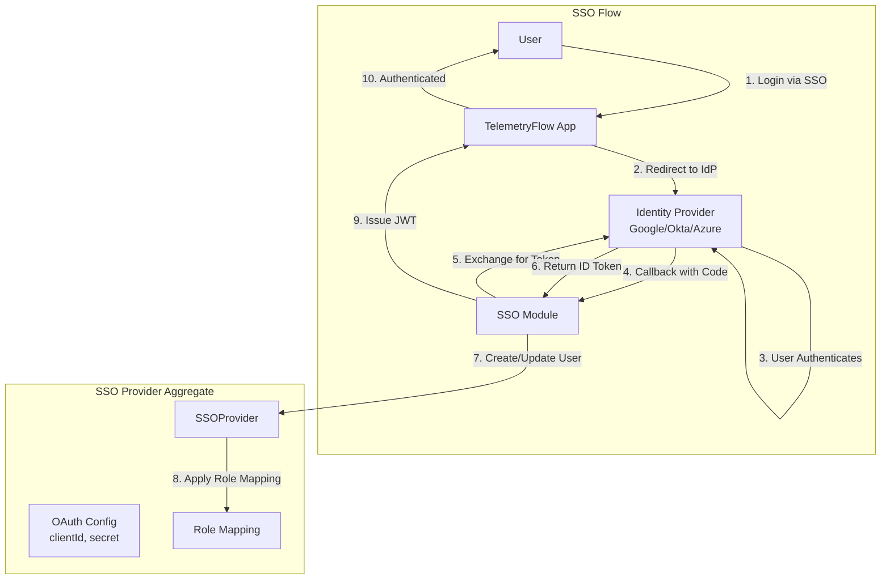
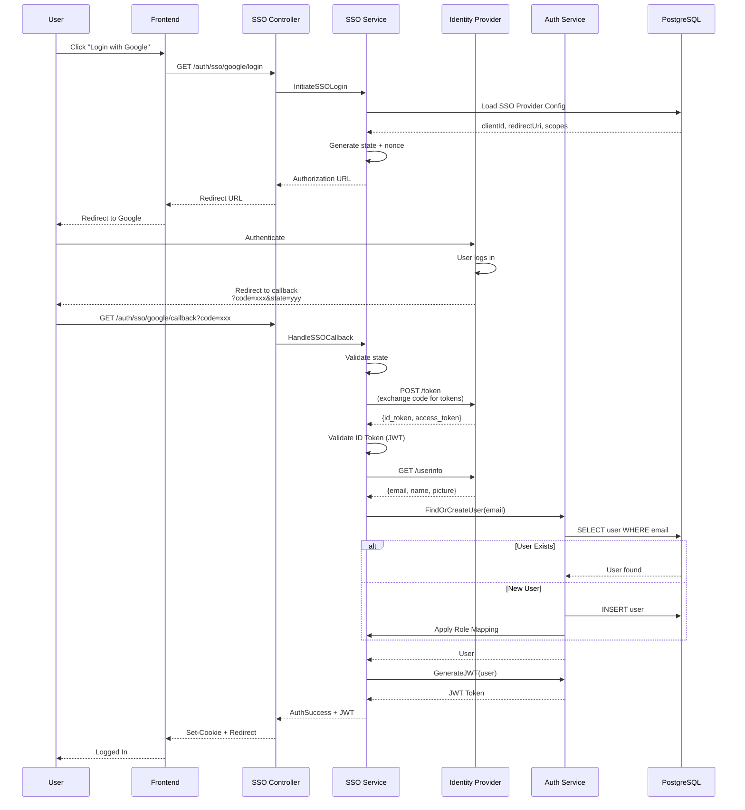

# Module 700: SSO (Single Sign-On)

- **Module**: `700-sso`
- **Category**: Backend / Business Modules
- **Status**: Production Ready
- **Priority:** 🔥 HIGH - Platform Foundation
- **Version**: 3.10.0

---

## Overview

The **SSO module** provides **enterprise Single Sign-On** integration for seamless authentication. It supports:

- **OAuth 2.0 / OpenID Connect**: Industry-standard protocols
- **Multiple providers**: Google, Microsoft, Okta, Auth0, Custom OIDC
- **Organization-level config**: Per-organization SSO settings
- **Automatic user provisioning**: Create users on first login
- **Role mapping**: Map IdP groups to platform roles
- **Session management**: Unified session handling

---

## Architecture



---

## Domain Model

### SSOProvider Aggregate

```typescript
// domain/aggregates/SSO.ts
export class SSOProvider extends AggregateRoot<SSOId> {
  private constructor(
    id: SSOId,
    private name: string,
    private type: string, // 'google', 'microsoft', 'okta', 'oidc'
    private clientId: string,
    private clientSecret: string,
    private redirectUri: string,
    private scopes: string[],
    private additionalConfig: Record<string, any>,
    private enabled: boolean,
    private organizationId?: string,
    private workspaceId?: string,
    private tenantId?: string,
  ) {
    super(id);
  }

  static create(
    name: string,
    type: string,
    clientId: string,
    clientSecret: string,
    redirectUri: string,
    organizationId: string,
  ): SSOProvider {
    const provider = new SSOProvider(
      SSOId.create(),
      name,
      type,
      clientId,
      clientSecret,
      redirectUri,
      ['openid', 'profile', 'email'],
      {},
      true,
      organizationId,
    );

    provider.addDomainEvent(new SSOCreatedEvent(provider));
    return provider;
  }

  update(
    name?: string,
    clientId?: string,
    clientSecret?: string,
    redirectUri?: string,
    scopes?: string[],
  ): void {
    if (name) this.name = name;
    if (clientId) this.clientId = clientId;
    if (clientSecret) this.clientSecret = clientSecret;
    if (redirectUri) this.redirectUri = redirectUri;
    if (scopes) this.scopes = scopes;

    this.addDomainEvent(new SSOUpdatedEvent(this));
  }

  disable(): void {
    this.enabled = false;
    this.addDomainEvent(new SSODisabledEvent(this.id));
  }
}
```

---

## Database Schema

```sql
CREATE TABLE sso_providers (
  sso_id UUID PRIMARY KEY DEFAULT gen_random_uuid(),

  -- Provider Info
  name VARCHAR(255) NOT NULL,
  type VARCHAR(50) NOT NULL, -- 'google', 'microsoft', 'okta', 'oidc'

  -- OAuth Configuration
  client_id VARCHAR(255) NOT NULL,
  client_secret TEXT NOT NULL, -- Encrypted
  redirect_uri TEXT NOT NULL,
  scopes TEXT[] DEFAULT ARRAY['openid', 'profile', 'email'],

  -- Provider Endpoints (for custom OIDC)
  auth_endpoint TEXT,
  token_endpoint TEXT,
  userinfo_endpoint TEXT,
  jwks_uri TEXT,

  -- Multi-tenancy
  organization_id UUID REFERENCES organizations(organization_id) ON DELETE CASCADE,
  workspace_id UUID REFERENCES workspaces(workspace_id) ON DELETE SET NULL,
  tenant_id UUID REFERENCES tenants(tenant_id) ON DELETE SET NULL,

  -- Status
  enabled BOOLEAN DEFAULT true,

  -- Role Mapping (JSON)
  role_mapping JSONB DEFAULT '{}',

  -- Timestamps
  created_at TIMESTAMP DEFAULT NOW(),
  updated_at TIMESTAMP DEFAULT NOW(),
  deleted_at TIMESTAMP,

  CHECK (type IN ('google', 'microsoft', 'okta', 'auth0', 'oidc'))
);

CREATE INDEX idx_sso_providers_org ON sso_providers(organization_id);
CREATE INDEX idx_sso_providers_type ON sso_providers(type);
CREATE INDEX idx_sso_providers_enabled ON sso_providers(enabled) WHERE deleted_at IS NULL;
```

---

## SSO Login Flow



---

## Supported Providers

### 1. Google OAuth 2.0

```typescript
// Google SSO Configuration
{
  type: 'google',
  clientId: 'xxx.apps.googleusercontent.com',
  clientSecret: 'GOCSPX-xxx',
  redirectUri: 'https://telemetryflow.id/auth/sso/google/callback',
  scopes: ['openid', 'profile', 'email'],
  authEndpoint: 'https://accounts.google.com/o/oauth2/v2/auth',
  tokenEndpoint: 'https://oauth2.googleapis.com/token',
  userinfoEndpoint: 'https://openidconnect.googleapis.com/v1/userinfo',
}
```

### 2. Microsoft Azure AD

```typescript
{
  type: 'microsoft',
  clientId: 'app-id',
  clientSecret: 'client-secret',
  redirectUri: 'https://telemetryflow.id/auth/sso/microsoft/callback',
  scopes: ['openid', 'profile', 'email'],
  authEndpoint: 'https://login.microsoftonline.com/{tenant}/oauth2/v2.0/authorize',
  tokenEndpoint: 'https://login.microsoftonline.com/{tenant}/oauth2/v2.0/token',
}
```

### 3. Okta

```typescript
{
  type: 'okta',
  clientId: 'okta-client-id',
  clientSecret: 'okta-secret',
  redirectUri: 'https://telemetryflow.id/auth/sso/okta/callback',
  scopes: ['openid', 'profile', 'email', 'groups'],
  authEndpoint: 'https://{domain}.okta.com/oauth2/v1/authorize',
  tokenEndpoint: 'https://{domain}.okta.com/oauth2/v1/token',
  userinfoEndpoint: 'https://{domain}.okta.com/oauth2/v1/userinfo',
}
```

### 4. Custom OIDC

```typescript
{
  type: 'oidc',
  clientId: 'custom-client-id',
  clientSecret: 'custom-secret',
  redirectUri: 'https://telemetryflow.id/auth/sso/custom/callback',
  scopes: ['openid', 'profile', 'email'],
  authEndpoint: 'https://idp.example.com/oauth/authorize',
  tokenEndpoint: 'https://idp.example.com/oauth/token',
  userinfoEndpoint: 'https://idp.example.com/oauth/userinfo',
  jwksUri: 'https://idp.example.com/.well-known/jwks.json',
}
```

---

## Role Mapping

Map IdP groups/claims to platform roles:

```json
{
  "role_mapping": {
    "admin@example.com": "administrator",
    "groups": {
      "Engineering": "developer",
      "Management": "viewer",
      "DevOps": "administrator"
    },
    "default": "viewer"
  }
}
```

**Mapping Logic:**
1. Check if user email matches admin list � assign `administrator`
2. Check user's IdP groups � map to corresponding role
3. Fallback to `default` role if no match

---

## API Endpoints

| Method | Endpoint | Description |
|--------|----------|-------------|
| `GET` | `/auth/sso/:provider/login` | Initiate SSO login |
| `GET` | `/auth/sso/:provider/callback` | Handle OAuth callback |
| `POST` | `/api/v1/sso/providers` | Create SSO provider config |
| `GET` | `/api/v1/sso/providers` | List SSO providers |
| `GET` | `/api/v1/sso/providers/:id` | Get provider details |
| `PATCH` | `/api/v1/sso/providers/:id` | Update provider config |
| `DELETE` | `/api/v1/sso/providers/:id` | Delete provider |

---

## Configuration

```bash
# SSO Settings
SSO_ENABLED=true
SSO_SESSION_TIMEOUT=3600            # 1 hour

# JWT Settings
JWT_SECRET=your-secret-key
JWT_EXPIRATION=3600                 # 1 hour
REFRESH_TOKEN_EXPIRATION=604800     # 7 days

# Provider Defaults
SSO_DEFAULT_SCOPES=openid,profile,email
SSO_STATE_TTL=300                   # 5 minutes
```

---

## Security Best Practices

1. **Validate state parameter**: Prevent CSRF attacks
2. **Verify ID token signature**: Use JWKS endpoint
3. **Encrypt client secrets**: Use encryption at rest
4. **Use HTTPS only**: Enforce TLS for callbacks
5. **Short-lived tokens**: Implement token rotation
6. **Audit SSO events**: Log all SSO authentication attempts

---

## Related Documentation

- [Module 200: Auth](./200-auth.md) - Authentication flows
- [Module 100: Core](./100-core.md) - User and role management

---

- **Last Updated**: December 12, 2025
- **Maintained By**: DevOpsCorner Indonesia
