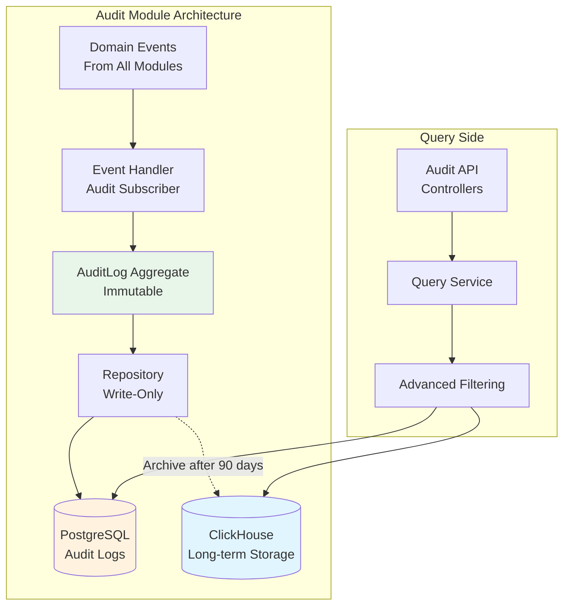
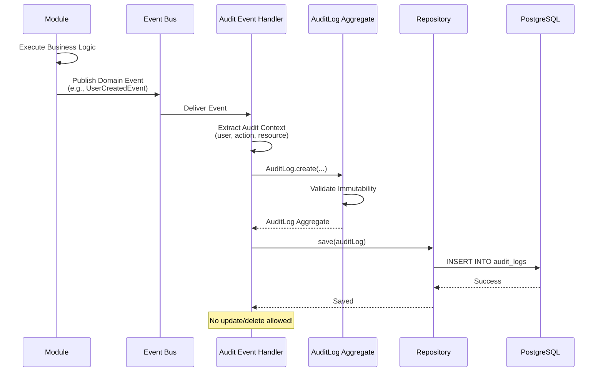

# Module 800: Audit Logging

- **Module**: `800-audit`
- **Category**: Backend / Business Modules
- **Status**: Production Ready
- **Priority:** 🔥 CRITICAL - Security Foundation
- **Version**: 1.1.2-CE

---

## Overview

The **Audit module** provides **comprehensive audit logging** for security, compliance, and forensic analysis. It creates an **immutable audit trail** of all critical actions within the TelemetryFlow platform.

Key features:
- **Immutable logs**: No updates or deletes allowed
- **Compliance support**: SOC2, ISO 27001, GDPR, HIPAA
- **Event sourcing**: Domain events → Audit logs
- **Multi-tenant aware**: Workspace and tenant context
- **Long-term retention**: 7+ years for compliance

This module is essential for security audits, compliance certifications, and incident investigation.

---

## Table of Contents

1. [Architecture Overview](#architecture-overview)
2. [Domain Model](#domain-model)
3. [Database Schema](#database-schema)
4. [Audit Event Types](#audit-event-types)
5. [API Endpoints](#api-endpoints)
6. [Event Flow](#event-flow)
7. [Querying Audit Logs](#querying-audit-logs)
8. [Compliance Features](#compliance-features)
9. [Configuration](#configuration)
10. [Best Practices](#best-practices)

---

## Architecture Overview



**Key Principles:**
- **Immutability**: Audit logs can never be updated or deleted
- **Event-driven**: Automatically capture domain events
- **Write-only repository**: No delete operations
- **Dual storage**: PostgreSQL (hot) + ClickHouse (cold archive)

---

## Domain Model

### AuditLog Aggregate

```typescript
// /backend/src/modules/800-audit/domain/aggregates/AuditLog.ts

export interface AuditLogProps {
  workspaceId: WorkspaceId | null;
  tenantId: TenantId | null;
  userId: UserId;
  action: AuditAction;
  resource: AuditResource;
  context: AuditContext;
  timestamp: Date;
}

export class AuditLog extends AggregateRoot<AuditLogId> {
  private readonly _props: Readonly<AuditLogProps>;

  // Factory method
  static create(
    userId: string,
    action: AuditAction,
    resource: AuditResource,
    context: AuditContext = AuditContext.empty(),
    workspaceId: string | null = null,
    tenantId: string | null = null,
  ): AuditLog {
    const id = AuditLogId.generate();

    const auditLog = new AuditLog(id, {
      workspaceId: workspaceId ? new WorkspaceId(workspaceId) : null,
      tenantId: tenantId ? new TenantId(tenantId) : null,
      userId: new UserId(userId),
      action,
      resource,
      context,
      timestamp: new Date(),
    });

    // Publish domain event
    auditLog.addDomainEvent(
      new AuditLogCreatedEvent(id, userId, action, resource)
    );

    return auditLog;
  }

  // Immutability enforcement
  isImmutable(): boolean {
    return true; // Audit logs are ALWAYS immutable
  }

  // Getters only (no setters!)
  get workspaceId(): WorkspaceId | null { return this._props.workspaceId; }
  get tenantId(): TenantId | null { return this._props.tenantId; }
  get userId(): UserId { return this._props.userId; }
  get action(): AuditAction { return this._props.action; }
  get resource(): AuditResource { return this._props.resource; }
  get context(): AuditContext { return this._props.context; }
  get timestamp(): Date { return this._props.timestamp; }
}
```

### Value Objects

#### AuditAction

```typescript
// /backend/src/modules/800-audit/domain/value-objects/AuditAction.ts

export class AuditAction extends ValueObject<string> {
  private static readonly VALID_ACTIONS = [
    // Authentication
    'auth.login',
    'auth.logout',
    'auth.login_failed',
    'auth.mfa_enabled',
    'auth.mfa_disabled',
    'auth.password_changed',
    'auth.account_locked',

    // User Management
    'user.created',
    'user.updated',
    'user.deleted',
    'user.role_assigned',
    'user.role_removed',

    // API Keys
    'api_key.created',
    'api_key.rotated',
    'api_key.revoked',

    // Alerts
    'alert.created',
    'alert.updated',
    'alert.deleted',
    'alert.triggered',

    // Dashboards
    'dashboard.created',
    'dashboard.updated',
    'dashboard.deleted',
    'dashboard.shared',

    // Data Export
    'export.requested',
    'export.downloaded',

    // Organization
    'organization.created',
    'organization.updated',
    'organization.settings_changed',

    // Workspace
    'workspace.created',
    'workspace.updated',
    'workspace.deleted',

    // Tenant
    'tenant.created',
    'tenant.updated',
    'tenant.deleted',

    // Security
    'security.suspicious_activity',
    'security.access_denied',
    'security.rate_limit_exceeded',
  ];

  static create(value: string): AuditAction {
    if (!this.VALID_ACTIONS.includes(value)) {
      throw new Error(`Invalid audit action: ${value}`);
    }
    return new AuditAction(value);
  }

  // Helper factory methods
  static authLogin(): AuditAction { return new AuditAction('auth.login'); }
  static authLogout(): AuditAction { return new AuditAction('auth.logout'); }
  static userCreated(): AuditAction { return new AuditAction('user.created'); }
  static apiKeyRotated(): AuditAction { return new AuditAction('api_key.rotated'); }
  // ... more helpers
}
```

#### AuditResource

```typescript
// /backend/src/modules/800-audit/domain/value-objects/AuditResource.ts

export interface AuditResourceProps {
  type: string;      // 'user', 'api_key', 'alert', 'dashboard'
  id: string | null; // Resource ID (null for collection operations)
  name?: string;     // Human-readable resource name
}

export class AuditResource extends ValueObject<AuditResourceProps> {
  static create(type: string, id: string | null = null, name?: string): AuditResource {
    return new AuditResource({ type, id, name });
  }

  get type(): string { return this.props.type; }
  get id(): string | null { return this.props.id; }
  get name(): string | undefined { return this.props.name; }

  toString(): string {
    if (this.props.name) {
      return `${this.props.type}:${this.props.name}`;
    }
    return this.props.id
      ? `${this.props.type}:${this.props.id}`
      : this.props.type;
  }
}
```

#### AuditContext

```typescript
// /backend/src/modules/800-audit/domain/value-objects/AuditContext.ts

export interface AuditContextProps {
  ipAddress: string | null;
  userAgent: string | null;
  requestId: string | null;
  sessionId: string | null;
  metadata: Record<string, any>;
}

export class AuditContext extends ValueObject<AuditContextProps> {
  static create(props: Partial<AuditContextProps>): AuditContext {
    return new AuditContext({
      ipAddress: props.ipAddress ?? null,
      userAgent: props.userAgent ?? null,
      requestId: props.requestId ?? null,
      sessionId: props.sessionId ?? null,
      metadata: props.metadata ?? {},
    });
  }

  static empty(): AuditContext {
    return new AuditContext({
      ipAddress: null,
      userAgent: null,
      requestId: null,
      sessionId: null,
      metadata: {},
    });
  }

  static fromRequest(req: Request): AuditContext {
    return new AuditContext({
      ipAddress: req.ip ?? req.socket.remoteAddress ?? null,
      userAgent: req.headers['user-agent'] ?? null,
      requestId: req.headers['x-request-id'] as string ?? null,
      sessionId: req.session?.id ?? null,
      metadata: {},
    });
  }

  withMetadata(key: string, value: any): AuditContext {
    return new AuditContext({
      ...this.props,
      metadata: { ...this.props.metadata, [key]: value },
    });
  }

  get ipAddress(): string | null { return this.props.ipAddress; }
  get userAgent(): string | null { return this.props.userAgent; }
  get requestId(): string | null { return this.props.requestId; }
  get sessionId(): string | null { return this.props.sessionId; }
  get metadata(): Record<string, any> { return this.props.metadata; }
}
```

---

## Database Schema

### PostgreSQL (Hot Storage - Last 90 Days)

```sql
-- /backend/src/modules/800-audit/infrastructure/persistence/postgres/entities/AuditLog.entity.ts

CREATE TABLE audit_logs (
  audit_id UUID PRIMARY KEY DEFAULT gen_random_uuid(),

  -- Multi-Tenancy
  workspace_id UUID REFERENCES workspaces(workspace_id),
  tenant_id UUID REFERENCES tenants(tenant_id),

  -- Actor
  user_id UUID REFERENCES users(user_id),

  -- Action
  action VARCHAR(100) NOT NULL, -- 'user.created', 'auth.login', etc.

  -- Resource
  resource_type VARCHAR(100) NOT NULL, -- 'user', 'api_key', 'alert'
  resource_id UUID,
  resource_name VARCHAR(255),

  -- Context
  ip_address INET,
  user_agent TEXT,
  request_id VARCHAR(100),
  session_id VARCHAR(100),

  -- Metadata (flexible JSON for additional data)
  metadata JSONB DEFAULT '{}'::jsonb,

  -- Timestamp (IMMUTABLE)
  timestamp TIMESTAMP NOT NULL DEFAULT NOW(),

  -- Prevent updates/deletes (enforced by repository)
  -- No updated_at or deleted_at columns!

  -- Constraints
  CHECK (action ~ '^[a-z_]+\.[a-z_]+$') -- Enforce format: resource.action
);

-- Indexes for common queries
CREATE INDEX idx_audit_logs_workspace ON audit_logs(workspace_id, timestamp DESC);
CREATE INDEX idx_audit_logs_tenant ON audit_logs(tenant_id, timestamp DESC);
CREATE INDEX idx_audit_logs_user ON audit_logs(user_id, timestamp DESC);
CREATE INDEX idx_audit_logs_action ON audit_logs(action, timestamp DESC);
CREATE INDEX idx_audit_logs_resource ON audit_logs(resource_type, resource_id);
CREATE INDEX idx_audit_logs_timestamp ON audit_logs(timestamp DESC);
CREATE INDEX idx_audit_logs_ip ON audit_logs(ip_address);

-- GIN index for metadata queries
CREATE INDEX idx_audit_logs_metadata ON audit_logs USING GIN (metadata);

-- Partition by month for performance
CREATE TABLE audit_logs_2025_12 PARTITION OF audit_logs
  FOR VALUES FROM ('2025-12-01') TO ('2026-01-01');
```

### ClickHouse (Cold Archive - 7+ Years)

```sql
-- Long-term storage for compliance

CREATE TABLE audit_logs_archive (
  audit_id UUID,
  workspace_id UUID,
  tenant_id UUID,
  user_id UUID,
  action String,
  resource_type String,
  resource_id Nullable(UUID),
  resource_name Nullable(String),
  ip_address Nullable(String),
  user_agent Nullable(String),
  request_id Nullable(String),
  session_id Nullable(String),
  metadata String, -- JSON string
  timestamp DateTime
) ENGINE = MergeTree()
PARTITION BY (toYYYYMM(timestamp), tenant_id)
ORDER BY (tenant_id, timestamp, action)
TTL timestamp + INTERVAL 7 YEAR; -- Auto-delete after 7 years

-- Indexes
ALTER TABLE audit_logs_archive ADD INDEX idx_action action TYPE bloom_filter GRANULARITY 1;
ALTER TABLE audit_logs_archive ADD INDEX idx_resource resource_type TYPE bloom_filter GRANULARITY 1;
```

---

## Audit Event Types

### Authentication Events

| Action | Description | Compliance |
|--------|-------------|------------|
| `auth.login` | Successful login | SOC2, ISO27001 |
| `auth.logout` | User logout | SOC2 |
| `auth.login_failed` | Failed login attempt | SOC2, ISO27001 |
| `auth.mfa_enabled` | MFA enabled | SOC2, ISO27001 |
| `auth.mfa_disabled` | MFA disabled | SOC2, ISO27001 |
| `auth.password_changed` | Password changed | SOC2 |
| `auth.account_locked` | Account locked (brute force) | SOC2, ISO27001 |

### User Management Events

| Action | Description | Compliance |
|--------|-------------|------------|
| `user.created` | New user created | SOC2, GDPR |
| `user.updated` | User profile updated | GDPR |
| `user.deleted` | User deleted | SOC2, GDPR |
| `user.role_assigned` | Role assigned to user | SOC2, ISO27001 |
| `user.role_removed` | Role removed from user | SOC2, ISO27001 |

### API Key Events

| Action | Description | Compliance |
|--------|-------------|------------|
| `api_key.created` | API key created | SOC2, ISO27001 |
| `api_key.rotated` | API key rotated | SOC2 |
| `api_key.revoked` | API key revoked | SOC2, ISO27001 |

### Data Access Events

| Action | Description | Compliance |
|--------|-------------|------------|
| `export.requested` | Data export requested | GDPR, HIPAA |
| `export.downloaded` | Data export downloaded | GDPR, HIPAA |
| `dashboard.shared` | Dashboard shared externally | SOC2 |

### Security Events

| Action | Description | Compliance |
|--------|-------------|------------|
| `security.suspicious_activity` | Suspicious activity detected | SOC2, ISO27001 |
| `security.access_denied` | Access denied (403) | SOC2 |
| `security.rate_limit_exceeded` | Rate limit exceeded | SOC2 |

---

## API Endpoints

### Query Audit Logs

| Method | Endpoint | Description | Required Permission |
|--------|----------|-------------|---------------------|
| `GET` | `/api/v1/audit-logs` | List audit logs (paginated) | `audit:read:workspace` |
| `GET` | `/api/v1/audit-logs/:id` | Get audit log details | `audit:read:workspace` |
| `GET` | `/api/v1/audit-logs/export` | Export audit logs (CSV/JSON) | `audit:export:workspace` |

### List Audit Logs

**Request:**
```http
GET /api/v1/audit-logs?page=1&limit=50&action=auth.login&startDate=2025-12-01&endDate=2025-12-31
Authorization: Bearer <JWT>
```

**Query Parameters:**
- `page`: Page number (default: 1)
- `limit`: Items per page (max: 100)
- `action`: Filter by action (e.g., `auth.login`)
- `userId`: Filter by user ID
- `resourceType`: Filter by resource type
- `resourceId`: Filter by resource ID
- `startDate`: Start date (ISO 8601)
- `endDate`: End date (ISO 8601)
- `ipAddress`: Filter by IP address

**Response:**
```json
{
  "data": [
    {
      "auditId": "uuid",
      "workspaceId": "uuid",
      "tenantId": "uuid",
      "userId": "uuid",
      "action": "auth.login",
      "resource": {
        "type": "user",
        "id": "uuid",
        "name": "john.doe@example.com"
      },
      "context": {
        "ipAddress": "192.168.1.1",
        "userAgent": "Mozilla/5.0...",
        "requestId": "req-123",
        "sessionId": "sess-456"
      },
      "metadata": {
        "loginMethod": "password",
        "mfaUsed": true
      },
      "timestamp": "2025-12-12T10:30:00Z"
    }
  ],
  "pagination": {
    "page": 1,
    "limit": 50,
    "total": 1234,
    "totalPages": 25
  }
}
```

---

## Event Flow

### Automatic Audit Log Creation



### Event Handler Implementation

```typescript
// /backend/src/modules/800-audit/application/event-handlers/AuditEventHandler.ts

@EventsHandler(UserCreatedEvent, UserDeletedEvent, AuthLoginEvent, /* ... */)
export class AuditEventHandler implements IEventHandler {
  constructor(
    @Inject('AUDIT_LOG_REPOSITORY') private auditLogRepository: IAuditLogRepository,
    @Inject('CURRENT_USER_SERVICE') private currentUserService: ICurrentUserService,
  ) {}

  async handle(event: DomainEvent): Promise<void> {
    const auditLog = this.mapEventToAuditLog(event);
    await this.auditLogRepository.save(auditLog);
  }

  private mapEventToAuditLog(event: DomainEvent): AuditLog {
    if (event instanceof UserCreatedEvent) {
      return AuditLog.create(
        event.userId,
        AuditAction.userCreated(),
        AuditResource.create('user', event.userId, event.email),
        AuditContext.fromRequest(this.currentUserService.getRequest()),
        this.currentUserService.getWorkspaceId(),
        this.currentUserService.getTenantId(),
      );
    }

    if (event instanceof AuthLoginEvent) {
      return AuditLog.create(
        event.userId,
        AuditAction.authLogin(),
        AuditResource.create('user', event.userId),
        AuditContext.fromRequest(event.request).withMetadata('loginMethod', event.method),
        event.workspaceId,
        event.tenantId,
      );
    }

    // ... handle other events
  }
}
```

---

## Querying Audit Logs

### Advanced Filtering

```typescript
// /backend/src/modules/800-audit/application/queries/FindAuditLogsQuery.ts

export interface FindAuditLogsFilters {
  workspaceId?: string;
  tenantId?: string;
  userId?: string;
  action?: string;
  resourceType?: string;
  resourceId?: string;
  ipAddress?: string;
  startDate?: Date;
  endDate?: Date;
  metadata?: Record<string, any>; // JSON metadata search
}

@QueryHandler(FindAuditLogsQuery)
export class FindAuditLogsQueryHandler {
  async execute(query: FindAuditLogsQuery): Promise<AuditLogListResult> {
    const filters = query.filters;

    const queryBuilder = this.repository
      .createQueryBuilder('audit')
      .where('audit.workspaceId = :workspaceId', { workspaceId: filters.workspaceId });

    if (filters.tenantId) {
      queryBuilder.andWhere('audit.tenantId = :tenantId', { tenantId: filters.tenantId });
    }

    if (filters.userId) {
      queryBuilder.andWhere('audit.userId = :userId', { userId: filters.userId });
    }

    if (filters.action) {
      queryBuilder.andWhere('audit.action = :action', { action: filters.action });
    }

    if (filters.startDate && filters.endDate) {
      queryBuilder.andWhere('audit.timestamp BETWEEN :startDate AND :endDate', {
        startDate: filters.startDate,
        endDate: filters.endDate,
      });
    }

    if (filters.metadata) {
      // JSONB query: metadata @> '{"key": "value"}'
      queryBuilder.andWhere('audit.metadata @> :metadata', {
        metadata: JSON.stringify(filters.metadata),
      });
    }

    queryBuilder.orderBy('audit.timestamp', 'DESC');
    queryBuilder.skip((query.page - 1) * query.limit);
    queryBuilder.take(query.limit);

    const [results, total] = await queryBuilder.getManyAndCount();

    return {
      data: results,
      pagination: {
        page: query.page,
        limit: query.limit,
        total,
        totalPages: Math.ceil(total / query.limit),
      },
    };
  }
}
```

### Compliance Report Example

```typescript
// Generate SOC2 compliance report: All privileged actions in Q4 2025

const report = await auditLogService.find({
  action: ['user.role_assigned', 'user.deleted', 'api_key.created'],
  startDate: new Date('2025-10-01'),
  endDate: new Date('2025-12-31'),
  workspaceId: 'production-workspace',
});

// Export to CSV for auditors
await auditLogService.exportToCsv(report, 'soc2-q4-2025.csv');
```

---

## Compliance Features

### 1. Immutability Enforcement

**Repository Pattern:**
```typescript
// /backend/src/modules/800-audit/infrastructure/persistence/postgres/AuditLogRepository.ts

export class AuditLogRepository implements IAuditLogRepository {
  async save(auditLog: AuditLog): Promise<void> {
    // Only INSERT, never UPDATE
    await this.repository.insert(auditLog);
  }

  // ❌ NOT IMPLEMENTED (immutability)
  // async update(auditLog: AuditLog): Promise<void> { ... }
  // async delete(id: AuditLogId): Promise<void> { ... }

  async findById(id: AuditLogId): Promise<AuditLog | null> {
    return this.repository.findOne({ where: { id: id.value } });
  }

  async findAll(filters: AuditLogFilters): Promise<AuditLog[]> {
    // Read-only queries
    return this.repository.find({ where: filters });
  }
}
```

### 2. GDPR Right to Access

Users can request all audit logs related to their account:

```typescript
@Get('me/audit-logs')
async getMyAuditLogs(@CurrentUser() user: User) {
  return this.auditLogService.findByUserId(user.id, {
    includeMetadata: true,
    format: 'json',
  });
}
```

### 3. Retention Policy

- **PostgreSQL**: 90 days (hot storage)
- **ClickHouse**: 7 years (cold archive)
- **Automatic archival**: Cron job moves logs from PG → CH after 90 days

```sql
-- Cron job: Archive logs older than 90 days
INSERT INTO clickhouse.audit_logs_archive
SELECT * FROM postgres.audit_logs
WHERE timestamp < NOW() - INTERVAL '90 days';

DELETE FROM postgres.audit_logs
WHERE timestamp < NOW() - INTERVAL '90 days';
```

### 4. Tamper-Proof Logging

**Cryptographic Hashing (Optional Enhancement):**
```typescript
// Each audit log includes hash of previous log (blockchain-style)
export class AuditLog {
  private _previousHash: string;
  private _currentHash: string;

  static create(...): AuditLog {
    const previousHash = await this.getLastAuditLogHash();
    const currentHash = sha256(previousHash + JSON.stringify(props));

    const auditLog = new AuditLog({ ...props, previousHash, currentHash });
    return auditLog;
  }
}
```

---

## Configuration

### Environment Variables

```bash
# Audit Logging
AUDIT_ENABLED=true                        # Enable audit logging
AUDIT_LOG_RETENTION_DAYS=90               # PostgreSQL retention
AUDIT_ARCHIVE_ENABLED=true                # Enable ClickHouse archival
AUDIT_ARCHIVE_RETENTION_YEARS=7           # ClickHouse retention

# Performance
AUDIT_ASYNC_LOGGING=true                  # Async event handling
AUDIT_BATCH_SIZE=100                      # Batch insert size
AUDIT_FLUSH_INTERVAL_MS=5000              # Flush every 5 seconds

# Compliance
AUDIT_INCLUDE_IP_ADDRESS=true             # Log IP addresses
AUDIT_INCLUDE_USER_AGENT=true             # Log user agents
AUDIT_INCLUDE_REQUEST_BODY=false          # Log request bodies (PII risk!)
AUDIT_REDACT_SENSITIVE_FIELDS=true        # Redact passwords, tokens
```

---

## Best Practices

### 1. Always Capture Context

```typescript
// ❌ BAD: No context
AuditLog.create(userId, action, resource);

// ✅ GOOD: Include IP, user agent, request ID
AuditLog.create(
  userId,
  action,
  resource,
  AuditContext.fromRequest(req),
  workspaceId,
  tenantId,
);
```

### 2. Use Metadata for Additional Details

```typescript
// Log password change with additional context
const context = AuditContext.fromRequest(req).withMetadata('passwordStrength', 'strong');

AuditLog.create(
  user.id,
  AuditAction.create('auth.password_changed'),
  AuditResource.create('user', user.id),
  context,
);
```

### 3. Redact Sensitive Data

```typescript
// ❌ BAD: Log plaintext password
metadata: { oldPassword: 'secret123', newPassword: 'newsecret456' }

// ✅ GOOD: Never log passwords
metadata: { passwordChanged: true, timestamp: new Date() }
```

### 4. Query Optimization

```sql
-- Use indexes for common queries
CREATE INDEX idx_audit_logs_user_date ON audit_logs(user_id, timestamp DESC);

-- Partition by month for large datasets
CREATE TABLE audit_logs_2025_12 PARTITION OF audit_logs
  FOR VALUES FROM ('2025-12-01') TO ('2026-01-01');
```

### 5. Regular Compliance Reports

```typescript
// Scheduled job: Generate monthly compliance report
@Cron('0 0 1 * *') // 1st day of each month
async generateMonthlyComplianceReport() {
  const lastMonth = {
    startDate: startOfMonth(subMonths(new Date(), 1)),
    endDate: endOfMonth(subMonths(new Date(), 1)),
  };

  const report = await this.auditLogService.find(lastMonth);
  await this.emailService.sendComplianceReport(report, 'compliance@company.com');
}
```

---

## Related Documentation

- [Module 200: Auth](./200-auth.md) - Authentication events
- [Module 300: API Keys](./300-api-keys.md) - API key lifecycle events
- [Module 100: Core](./100-core.md) - User and role events
- [Architecture: Security](../../04-SECURITY.md) - Security best practices

---

**Last Updated**: January 01st, 2026
**Maintained By**: DevOpsCorner Indonesia
