# Module: 900-dashboard (Dashboard Management)

- **Module**: `900-dashboard`
- **Category**: Backend / Business Modules
- **Status**: Production Ready
- **Priority:** 🔥 HIGH - Core Visualization
- **Version**: 1.1.2-CE

---

## Module Overview

```mermaid
graph TB
    subgraph "900-dashboard Module"
        A[Dashboard Management<br/>Custom & Template-based]
        B[Widget System<br/>Metrics/Logs/Traces]
        C[Template Library<br/>Pre-built Dashboards]
        D[Real-time Updates<br/>WebSocket Support]
    end

    subgraph "Key Features"
        E[✅ Drag & Drop Layout]
        F[✅ 6 Built-in Templates]
        G[✅ Widget Customization]
        H[✅ Favorite Dashboards]
    end

    A --> E
    B --> F
    C --> G
    D --> H

    style A fill:#ff6b6b
    style B fill:#4ecdc4
    style C fill:#45b7d1
    style D fill:#f9ca24
```



**Purpose:** Complete dashboard management system with templates, widgets, and real-time visualizations for metrics, logs, and traces.

**Location:** `backend/src/modules/900-dashboard/`

---

## Architecture

### Module Structure


---

## Dashboard Creation Flow

### Complete Dashboard Lifecycle


### Widget Management Flow


---

## Domain Model

### Dashboard Aggregate

```typescript
// domain/aggregates/Dashboard.aggregate.ts
export class Dashboard extends AggregateRoot {
  private readonly _id: DashboardId;
  private _name: string;
  private _description?: string;
  private readonly _workspaceId: WorkspaceId;
  private readonly _tenantId: TenantId;
  private readonly _createdBy: UserId;
  private _widgets: Widget[] = [];
  private _layout: DashboardLayout;
  private _isFavorite: boolean = false;
  private _templateId?: DashboardTemplateId;

  static create(
    name: string,
    workspaceId: WorkspaceId,
    tenantId: TenantId,
    createdBy: UserId,
    description?: string,
    templateId?: DashboardTemplateId
  ): Dashboard {
    // Business Rule: Name cannot be empty
    if (!name || name.trim() === '') {
      throw new DomainError('Dashboard name cannot be empty');
    }

    const dashboard = new Dashboard({
      id: DashboardId.create(),
      name,
      workspaceId,
      tenantId,
      createdBy,
      description,
      templateId,
      widgets: [],
      layout: DashboardLayout.createDefault(),
      createdAt: new Date(),
      updatedAt: new Date(),
    });

    dashboard.apply(new DashboardCreated(dashboard));
    return dashboard;
  }

  static createFromTemplate(
    template: DashboardTemplate,
    workspaceId: WorkspaceId,
    tenantId: TenantId,
    createdBy: UserId
  ): Dashboard {
    const dashboard = Dashboard.create(
      template.name,
      workspaceId,
      tenantId,
      createdBy,
      template.description,
      template.id
    );

    // Clone all widgets from template
    template.widgets.forEach(templateWidget => {
      const widget = Widget.createFromTemplate(templateWidget);
      dashboard.addWidget(widget);
    });

    dashboard._layout = DashboardLayout.create(template.layout);
    return dashboard;
  }

  addWidget(widget: Widget): void {
    // Business Rule: Widget position must not overlap with existing widgets
    if (this._layout.hasOverlap(widget.position)) {
      throw new DomainError('Widget position overlaps with existing widget');
    }

    // Business Rule: Widget must be within grid bounds
    if (!this._layout.isWithinBounds(widget.position)) {
      throw new DomainError('Widget position is outside grid bounds');
    }

    this._widgets.push(widget);
    this._layout.addWidget(widget.id, widget.position);
    this.apply(new WidgetAdded(this._id, widget.id));
  }

  removeWidget(widgetId: WidgetId): void {
    const widgetIndex = this._widgets.findIndex(w => w.id.equals(widgetId));
    if (widgetIndex === -1) {
      throw new DomainError('Widget not found');
    }

    this._widgets.splice(widgetIndex, 1);
    this._layout.removeWidget(widgetId);
    this.apply(new WidgetRemoved(this._id, widgetId));
  }

  toggleFavorite(): void {
    this._isFavorite = !this._isFavorite;
  }
}
```

### Widget Types


---

## Built-in Dashboard Templates


### Template Details

**1. System Monitoring Template**
```json
{
  "name": "System Monitoring",
  "description": "Monitor system-level metrics",
  "widgets": [
    {
      "type": "TIME_SERIES_CHART",
      "config": {
        "title": "CPU Usage",
        "metricName": "system.cpu.utilization",
        "aggregation": "avg",
        "timeRange": "1h"
      },
      "position": {"x": 0, "y": 0, "width": 6, "height": 4}
    },
    {
      "type": "TIME_SERIES_CHART",
      "config": {
        "title": "Memory Usage",
        "metricName": "system.memory.usage",
        "aggregation": "avg",
        "timeRange": "1h"
      },
      "position": {"x": 6, "y": 0, "width": 6, "height": 4}
    },
    {
      "type": "GAUGE",
      "config": {
        "title": "Disk Usage",
        "metricName": "system.disk.usage",
        "unit": "%",
        "thresholds": {"warning": 70, "critical": 90}
      },
      "position": {"x": 0, "y": 4, "width": 4, "height": 3}
    }
  ]
}
```

**2. Application Performance Template**
- Response Time (P50, P95, P99)
- Request Throughput
- Error Rate
- Active Connections

**3. Logs Explorer Template**
- Live Log Stream
- Log Level Distribution
- Error Log Table
- Search & Filter Panel

---

## Database Schema

### Dashboards Table (PostgreSQL)

```sql
CREATE TABLE dashboards (
  id UUID PRIMARY KEY DEFAULT gen_random_uuid(),
  name VARCHAR(255) NOT NULL,
  description TEXT,

  -- Multi-Tenancy
  organization_id UUID,
  workspace_id UUID NOT NULL,
  tenant_id UUID,

  -- Template Reference
  template_id UUID,

  -- Layout Configuration
  layout JSONB NOT NULL DEFAULT '{
    "grid": {"columns": 12, "rowHeight": 30},
    "widgets": []
  }'::jsonb,

  -- User Preferences
  is_favorite BOOLEAN DEFAULT false,
  is_public BOOLEAN DEFAULT false,

  -- Ownership
  created_by UUID NOT NULL,

  -- Timestamps
  created_at TIMESTAMP NOT NULL DEFAULT NOW(),
  updated_at TIMESTAMP NOT NULL DEFAULT NOW(),
  last_viewed_at TIMESTAMP,

  CONSTRAINT fk_workspace FOREIGN KEY (workspace_id)
    REFERENCES workspaces(id) ON DELETE CASCADE,
  CONSTRAINT fk_template FOREIGN KEY (template_id)
    REFERENCES dashboard_templates(id) ON DELETE SET NULL,
  CONSTRAINT fk_created_by FOREIGN KEY (created_by)
    REFERENCES users(id) ON DELETE CASCADE
);

-- Indexes
CREATE INDEX idx_dashboards_workspace ON dashboards(workspace_id);
CREATE INDEX idx_dashboards_tenant ON dashboards(tenant_id);
CREATE INDEX idx_dashboards_created_by ON dashboards(created_by);
CREATE INDEX idx_dashboards_is_favorite ON dashboards(is_favorite);
CREATE INDEX idx_dashboards_template ON dashboards(template_id);
```

### Widgets Table (PostgreSQL)

```sql
CREATE TABLE widgets (
  id UUID PRIMARY KEY DEFAULT gen_random_uuid(),
  dashboard_id UUID NOT NULL,

  -- Widget Type
  type VARCHAR(50) NOT NULL,  -- TIME_SERIES_CHART, LOG_STREAM, etc.

  -- Widget Configuration
  title VARCHAR(255) NOT NULL,
  configuration JSONB NOT NULL,  -- Widget-specific config

  -- Layout Position
  position JSONB NOT NULL DEFAULT '{
    "x": 0, "y": 0, "width": 6, "height": 4
  }'::jsonb,

  -- Display Settings
  refresh_interval INT DEFAULT 30,  -- seconds
  show_legend BOOLEAN DEFAULT true,

  -- Timestamps
  created_at TIMESTAMP NOT NULL DEFAULT NOW(),
  updated_at TIMESTAMP NOT NULL DEFAULT NOW(),

  CONSTRAINT fk_dashboard FOREIGN KEY (dashboard_id)
    REFERENCES dashboards(id) ON DELETE CASCADE
);

-- Indexes
CREATE INDEX idx_widgets_dashboard ON widgets(dashboard_id);
CREATE INDEX idx_widgets_type ON widgets(type);
```

### Dashboard Templates Table (PostgreSQL)

```sql
CREATE TABLE dashboard_templates (
  id UUID PRIMARY KEY DEFAULT gen_random_uuid(),
  name VARCHAR(255) NOT NULL UNIQUE,
  description TEXT,
  category VARCHAR(100),  -- system, application, infrastructure

  -- Template Content
  layout JSONB NOT NULL,
  widgets JSONB NOT NULL,  -- Pre-configured widgets

  -- Metadata
  is_system BOOLEAN DEFAULT false,  -- Built-in templates
  icon VARCHAR(100),
  tags JSONB DEFAULT '[]'::jsonb,

  -- Usage Tracking
  usage_count INT DEFAULT 0,

  -- Timestamps
  created_at TIMESTAMP NOT NULL DEFAULT NOW(),
  updated_at TIMESTAMP NOT NULL DEFAULT NOW()
);

-- Indexes
CREATE INDEX idx_templates_category ON dashboard_templates(category);
CREATE INDEX idx_templates_is_system ON dashboard_templates(is_system);
```

---

## Widget Configuration Examples

### Time Series Chart Widget

```json
{
  "type": "TIME_SERIES_CHART",
  "title": "HTTP Request Rate",
  "configuration": {
    "metricName": "http_requests_total",
    "aggregation": "rate",
    "interval": "1m",
    "timeRange": "1h",
    "filters": {
      "service_name": "api-gateway",
      "status_code": "200"
    },
    "visualization": {
      "chartType": "line",
      "colors": ["#4ecdc4"],
      "yAxis": {
        "label": "Requests/sec",
        "min": 0
      }
    }
  },
  "position": {
    "x": 0,
    "y": 0,
    "width": 6,
    "height": 4
  },
  "refreshInterval": 30
}
```

### Log Stream Widget

```json
{
  "type": "LOG_STREAM",
  "title": "Error Logs",
  "configuration": {
    "query": "severity:ERROR",
    "limit": 100,
    "timeRange": "15m",
    "autoScroll": true,
    "highlightKeywords": ["error", "exception", "failed"],
    "columns": ["timestamp", "service_name", "message", "trace_id"]
  },
  "position": {
    "x": 0,
    "y": 4,
    "width": 12,
    "height": 6
  },
  "refreshInterval": 10
}
```

### Gauge Widget

```json
{
  "type": "GAUGE",
  "title": "Memory Usage",
  "configuration": {
    "metricName": "system.memory.usage",
    "aggregation": "latest",
    "unit": "%",
    "thresholds": {
      "low": 50,
      "warning": 70,
      "critical": 90
    },
    "colors": {
      "low": "#27ae60",
      "warning": "#f39c12",
      "critical": "#e74c3c"
    }
  },
  "position": {
    "x": 0,
    "y": 0,
    "width": 3,
    "height": 3
  },
  "refreshInterval": 60
}
```

---

## Performance

### Caching Strategy


| Operation | Cache TTL | Performance |
|-----------|-----------|-------------|
| **Dashboard List** | 5 minutes | 10ms (cached) |
| **Dashboard Details** | 1 minute | 50ms (cached) |
| **Widget Data** | 30 seconds | 100-500ms |
| **Template List** | 1 hour | 5ms (cached) |

---

## API Examples

### Create Dashboard from Template

```bash
curl -X POST http://localhost:3000/api/v2/dashboards \
  -H "Authorization: Bearer <jwt-token>" \
  -H "Content-Type: application/json" \
  -d '{
    "name": "My System Dashboard",
    "templateId": "template-system-monitoring-uuid",
    "workspaceId": "workspace-uuid",
    "tenantId": "tenant-uuid"
  }'
```

### Add Widget to Dashboard

```bash
curl -X POST http://localhost:3000/api/v2/dashboards/:dashboardId/widgets \
  -H "Authorization: Bearer <jwt-token>" \
  -H "Content-Type: application/json" \
  -d '{
    "type": "TIME_SERIES_CHART",
    "title": "Custom CPU Chart",
    "configuration": {
      "metricName": "system.cpu.utilization",
      "aggregation": "avg",
      "timeRange": "1h"
    },
    "position": {
      "x": 6,
      "y": 4,
      "width": 6,
      "height": 4
    }
  }'
```

### List Dashboards

```bash
curl -X GET "http://localhost:3000/api/v2/dashboards?workspaceId=workspace-uuid&favorite=true" \
  -H "Authorization: Bearer <jwt-token>"
```

---

## Related Modules


---

## Testing

### Unit Tests
- `Dashboard.aggregate.spec.ts` - Dashboard logic
- `Widget.aggregate.spec.ts` - Widget validation
- `DashboardLayout.vo.spec.ts` - Layout calculations

### Integration Tests
- `dashboard-creation.spec.ts` - Template cloning
- `widget-management.spec.ts` - Widget CRUD

### E2E Tests
- `dashboard-lifecycle.e2e.spec.ts` - Complete flow

---

- **File Location:** `./backend/modules/900-dashboard.md`
- **Maintained By:** DevOpsCorner Indonesia
