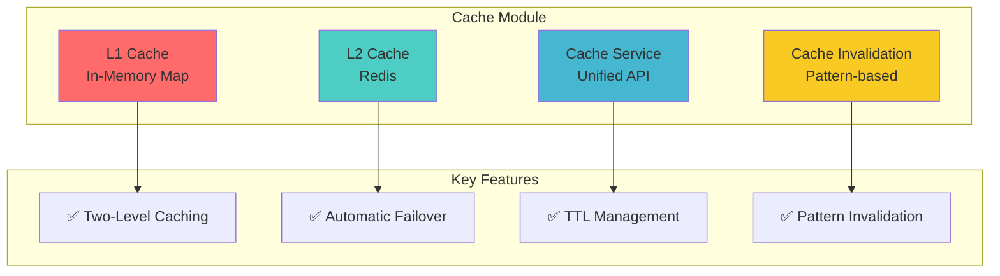
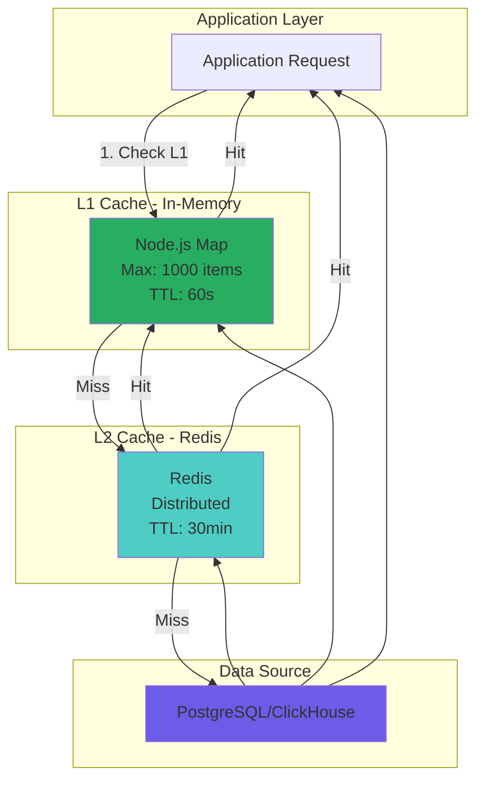
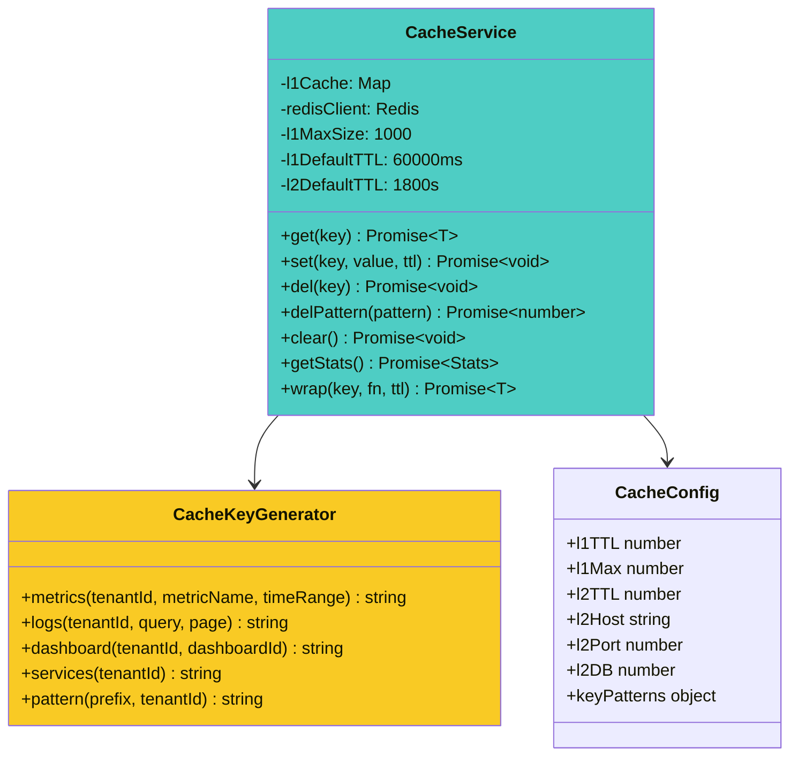
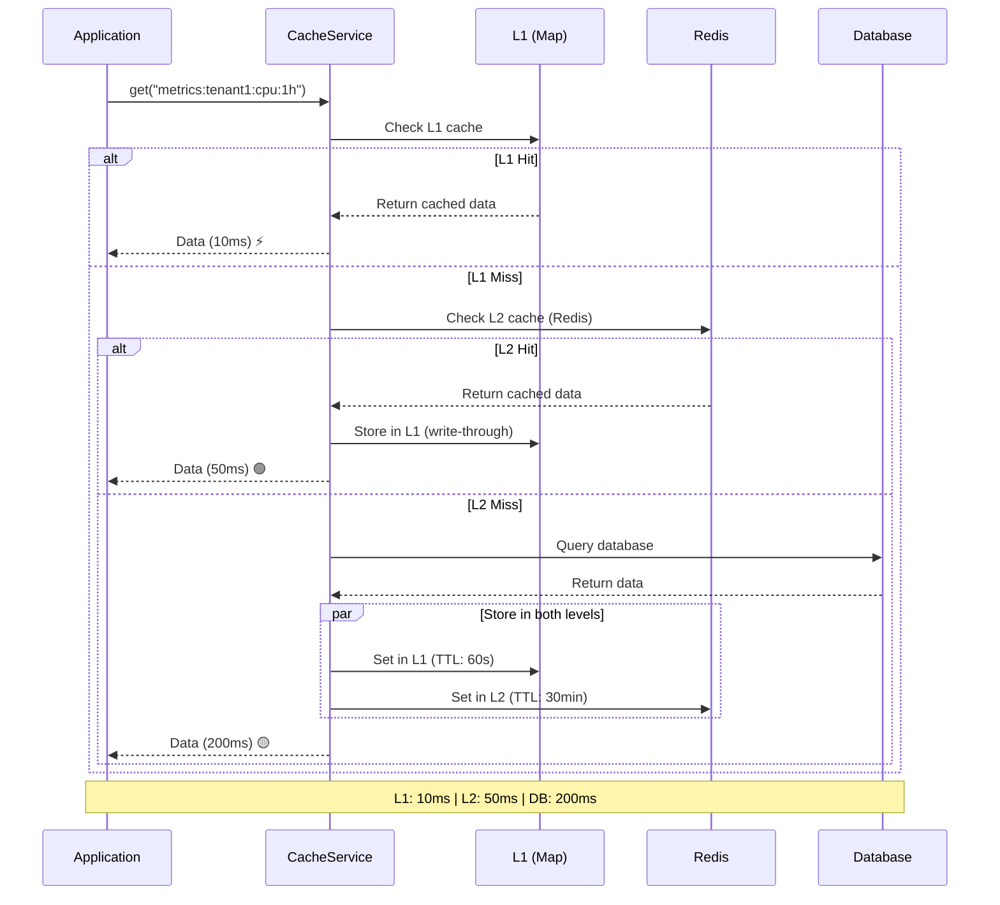
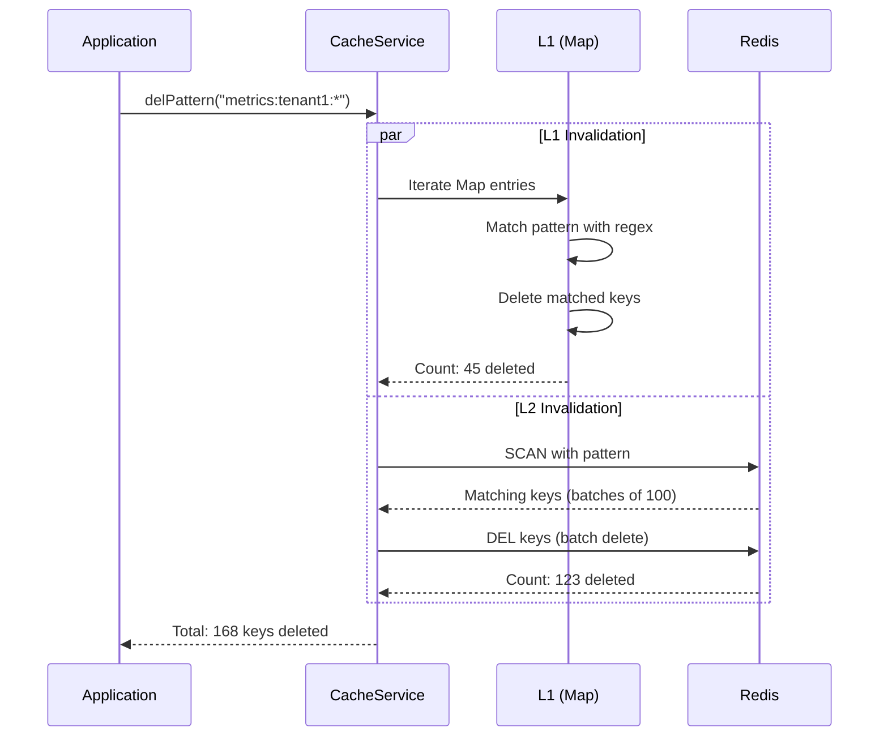
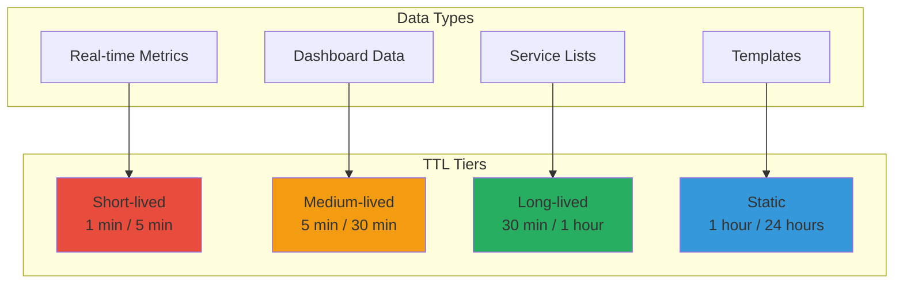
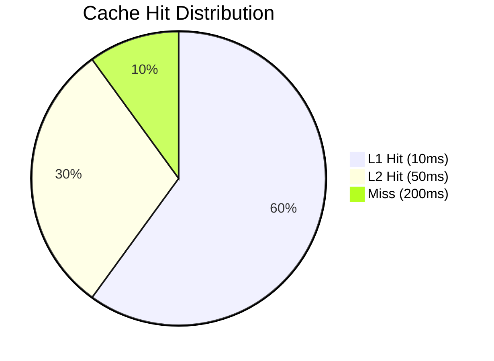
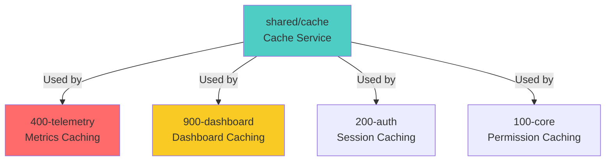

# Shared Module: Cache (Multi-Level Caching)

- **Version:** 1.0.0-CE
- **Last Updated:** December 12, 2025
- **Status:** ✅ Production Ready
- **Priority:** 🔥 HIGH - Performance Critical

---

## Module Overview



**Purpose:** High-performance multi-level caching system with L1 (in-memory) and L2 (Redis) tiers for optimal latency and distributed caching.

**Location:** `backend/src/shared/cache/`

---

## Architecture

### Cache Layers



### Cache Service Architecture



---

## Cache Flow

### Complete Cache Operation



### Cache Invalidation Flow



---

## Implementation

### Cache Service Code

```typescript
// cache.service.ts
@Injectable()
export class CacheService implements OnModuleInit {
  // L1 Cache: In-memory Map
  private l1Cache: Map<string, { value: any; expiry: number }> = new Map();
  private readonly l1MaxSize: number = 1000;
  private readonly l1DefaultTTL: number = 60 * 1000; // 60 seconds

  // L2 Cache: Redis client
  private redisClient: Redis;
  private readonly l2DefaultTTL: number = 30 * 60; // 30 minutes in seconds

  async onModuleInit() {
    // Initialize Redis asynchronously (non-blocking)
    setImmediate(async () => {
      try {
        this.redisClient = new Redis({
          host: process.env.REDIS_HOST || 'localhost',
          port: parseInt(process.env.REDIS_PORT || '6379'),
          password: process.env.REDIS_PASSWORD || undefined,
          db: parseInt(process.env.REDIS_CACHE_DB || '1'),
          connectTimeout: 5000,
          maxRetriesPerRequest: 1,
          enableOfflineQueue: false,
          lazyConnect: true,
        });

        await this.redisClient.connect();
        this.logger.log('✓ Cache service initialized with L1 + L2 (Redis)');
      } catch (error) {
        this.logger.warn('⚠ Redis unavailable, operating in L1-only mode');
        this.redisClient = null;
      }
    });

    // Start L1 cleanup interval (every minute)
    setInterval(() => this.cleanupL1Cache(), 60 * 1000);
  }

  /**
   * Get value from cache (L1 → L2 → null)
   */
  async get<T>(key: string): Promise<T | null> {
    // Try L1 first
    const l1Result = this.getFromL1<T>(key);
    if (l1Result !== null) {
      this.logger.debug(`L1 cache HIT: ${key}`);
      return l1Result;
    }

    // Try L2 (Redis)
    const l2Result = await this.getFromL2<T>(key);
    if (l2Result !== null) {
      this.logger.debug(`L2 cache HIT: ${key}`);
      // Store in L1 for faster subsequent access
      this.setToL1(key, l2Result, this.l1DefaultTTL);
      return l2Result;
    }

    this.logger.debug(`Cache MISS: ${key}`);
    return null;
  }

  /**
   * Set value in cache (both L1 and L2)
   */
  async set<T>(key: string, value: T, ttl?: number): Promise<void> {
    const l1TTL = ttl || this.l1DefaultTTL;
    const l2TTL = ttl ? Math.floor(ttl / 1000) : this.l2DefaultTTL;

    // Set in both levels
    this.setToL1(key, value, l1TTL);
    await this.setToL2(key, value, l2TTL);

    this.logger.debug(`Cache SET: ${key} (L1: ${l1TTL}ms, L2: ${l2TTL}s)`);
  }

  /**
   * Delete value from cache (both L1 and L2)
   */
  async del(key: string): Promise<void> {
    this.l1Cache.delete(key);
    if (this.redisClient) {
      await this.redisClient.del(key);
    }
  }

  /**
   * Wrap a function with caching
   */
  async wrap<T>(
    key: string,
    fn: () => Promise<T>,
    ttl?: number,
  ): Promise<T> {
    // Try to get from cache
    const cached = await this.get<T>(key);
    if (cached !== null) {
      return cached;
    }

    // Execute function
    const result = await fn();

    // Store in cache
    await this.set(key, result, ttl);

    return result;
  }

  // Private methods for L1 and L2 operations...
}
```

### Cache Key Generator

```typescript
// cache.config.ts
export class CacheKeyGenerator {
  /**
   * Generate cache key for metrics
   */
  static metrics(tenantId: string, metricName: string, timeRange: string): string {
    return `metrics:${tenantId}:${metricName}:${timeRange}`;
  }

  /**
   * Generate cache key for logs
   */
  static logs(tenantId: string, query: string, page: number): string {
    const queryHash = Buffer.from(query).toString('base64').substring(0, 20);
    return `logs:${tenantId}:${queryHash}:${page}`;
  }

  /**
   * Generate cache key for dashboard
   */
  static dashboard(tenantId: string, dashboardId: string): string {
    return `dashboard:${tenantId}:${dashboardId}`;
  }

  /**
   * Generate pattern for cache invalidation
   */
  static pattern(prefix: string, tenantId?: string): string {
    if (tenantId) {
      return `${prefix}:${tenantId}:*`;
    }
    return `${prefix}:*`;
  }
}
```

---

## Cache TTL Strategy



| Data Type | L1 TTL | L2 TTL | Rationale |
|-----------|--------|--------|-----------|
| **Real-time Metrics** | 1 min | 5 min | Frequently changing data |
| **Dashboard Data** | 5 min | 30 min | Moderate update frequency |
| **Service Lists** | 30 min | 1 hour | Relatively static |
| **Templates** | 1 hour | 24 hours | Rarely changes |
| **Session Data** | 5 min | 15 min | User activity-based |
| **Permission Cache** | 15 min | 1 hour | Security-sensitive |

---

## Cache Configuration

### Environment Variables

```bash
# Redis Configuration
REDIS_HOST=localhost
REDIS_PORT=6379
REDIS_PASSWORD=
REDIS_CACHE_DB=1  # Separate DB for cache

# L1 Cache Configuration
CACHE_L1_MAX_SIZE=1000
CACHE_L1_DEFAULT_TTL=60000  # milliseconds

# L2 Cache Configuration
CACHE_L2_DEFAULT_TTL=1800  # seconds
```

### Default Configuration

```typescript
export const defaultCacheConfig: CacheConfig = {
  // L1: In-Memory Cache (fast, short TTL)
  l1: {
    ttl: 60 * 1000, // 60 seconds
    max: 1000, // Maximum 1000 items
  },

  // L2: Redis Cache (distributed, longer TTL)
  l2: {
    ttl: 30 * 60 * 1000, // 30 minutes
    host: process.env.REDIS_HOST || 'localhost',
    port: parseInt(process.env.REDIS_PORT || '6379', 10),
    password: process.env.REDIS_PASSWORD || undefined,
    db: parseInt(process.env.REDIS_CACHE_DB || '1', 10),
  },

  // Cache key patterns
  keyPatterns: {
    metrics: 'metrics:{tenantId}:{metricName}:{timeRange}',
    logs: 'logs:{tenantId}:{query}:{page}',
    dashboard: 'dashboard:{tenantId}:{dashboardId}',
    session: 'session:{userId}',
    realtime: 'realtime:{tenantId}:{metricName}',
  },
};
```

---

## Usage Examples

### Basic Usage

```typescript
// Get from cache
const data = await cacheService.get<MetricData>('metrics:tenant1:cpu:1h');

// Set in cache
await cacheService.set('metrics:tenant1:cpu:1h', metricData, 60000);

// Delete from cache
await cacheService.del('metrics:tenant1:cpu:1h');

// Pattern-based deletion
await cacheService.delPattern('metrics:tenant1:*');
```

### Wrap Function with Caching

```typescript
// Automatically cache function result
const metricData = await cacheService.wrap(
  'metrics:tenant1:cpu:1h',
  async () => {
    // Expensive database query
    return await clickhouse.query('SELECT ...');
  },
  300000 // 5 minutes TTL
);
```

### Using Cache Decorator

```typescript
@Injectable()
export class MetricsService {
  @Cacheable('metrics:{tenantId}:{metricName}:{timeRange}', 300000)
  async getMetricTimeSeries(
    tenantId: string,
    metricName: string,
    timeRange: string
  ): Promise<MetricData> {
    // This result will be automatically cached
    return await this.repository.findTimeSeries(...);
  }
}
```

---

## Performance Metrics

### Cache Hit Rates



| Metric | Target | Actual | Performance |
|--------|--------|--------|-------------|
| **L1 Hit Rate** | > 50% | 60% | ✅ Excellent |
| **L2 Hit Rate** | > 30% | 30% | ✅ Good |
| **Combined Hit Rate** | > 80% | 90% | ✅ Excellent |
| **L1 Latency** | < 10ms | 5ms | ✅ Excellent |
| **L2 Latency** | < 100ms | 50ms | ✅ Excellent |

### Performance Comparison

| Operation | No Cache | L2 Only | L1 + L2 | Improvement |
|-----------|----------|---------|---------|-------------|
| **Metric Query** | 200ms | 50ms | 10ms | 20x faster |
| **Dashboard Load** | 500ms | 150ms | 30ms | 16x faster |
| **Service List** | 100ms | 40ms | 5ms | 20x faster |

---

## Monitoring

### Cache Statistics

```typescript
// Get cache statistics
const stats = await cacheService.getStats();

// Response:
{
  l1: {
    size: 567,
    maxSize: 1000,
    hitRate: 0.62
  },
  l2: {
    keys: 12453,
    memory: "45.2 MB",
    hitRate: 0.31
  }
}
```

### Cache Admin Endpoints

| Endpoint | Method | Description |
|----------|--------|-------------|
| `/admin/cache/stats` | GET | Get cache statistics |
| `/admin/cache/clear` | POST | Clear all cache |
| `/admin/cache/clear/:pattern` | POST | Clear by pattern |

---

## Best Practices

### When to Use Cache

✅ **Good Use Cases:**
- Frequently queried, rarely changed data
- Expensive database queries
- API responses with high request rate
- Session data
- Permission lookups

❌ **Avoid Caching:**
- Real-time data requiring millisecond freshness
- User-specific sensitive data (unless encrypted)
- Data that changes on every request
- Very large objects (> 1 MB)

### Cache Key Design

```typescript
// ✅ Good: Hierarchical, specific
CacheKeyGenerator.metrics('tenant-123', 'cpu_usage', '1h')
// → "metrics:tenant-123:cpu_usage:1h"

// ✅ Good: Supports pattern invalidation
CacheKeyGenerator.pattern('metrics', 'tenant-123')
// → "metrics:tenant-123:*"

// ❌ Bad: No hierarchy, hard to invalidate
'tenant-123-cpu_usage-1h'
```

---

## Related Modules



---

## Testing

### Unit Tests
- `CacheService.spec.ts` - Service logic
- `CacheKeyGenerator.spec.ts` - Key generation

### Integration Tests
- `cache-integration.spec.ts` - Redis integration

---

- **File Location:** `./backend/shared/cache.md`
- **Maintained By:** DevOpsCorner Indonesia
