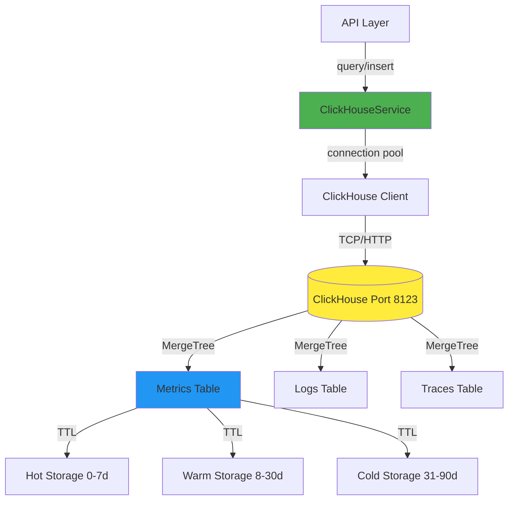

# Shared Module: ClickHouse Service

- **Module**: `shared/clickhouse`
- **Category**: Backend / Shared Modules
- **Status**: Production Ready
- **Priority:** 🔥 CRITICAL - Time-Series Database
- **Version**: 3.10.0

---

## Overview

The **ClickHouse Service module** provides **high-performance time-series data storage** for telemetry data. Features:

- **Official client**: @clickhouse/client integration
- **Async inserts**: High-throughput batch writes
- **Connection pooling**: Reusable connections
- **Type-safe queries**: TypeScript query execution
- **Health monitoring**: Connection health checks
- **Graceful degradation**: Continues if ClickHouse unavailable

---

## Architecture



---

## ClickHouseService Implementation

```typescript
// shared/clickhouse/infrastructure/clickhouse.service.ts
import { Injectable, OnModuleInit, OnModuleDestroy } from '@nestjs/common';
import { LoggerService } from '@/logger/logger.service';
import { createClient, ClickHouseClient } from '@clickhouse/client';

@Injectable()
export class ClickHouseService implements OnModuleInit, OnModuleDestroy {
  private readonly context = ClickHouseService.name;
  private client: ClickHouseClient;

  constructor(private readonly logger: LoggerService) {}

  async onModuleInit() {
    try {
      this.client = createClient({
        host: process.env.CLICKHOUSE_HOST || 'http://localhost:8123',
        username: process.env.CLICKHOUSE_USER || 'default',
        password: process.env.CLICKHOUSE_PASSWORD || '',
        database: process.env.CLICKHOUSE_DATABASE || 'telemetryflow',
        clickhouse_settings: {
          // Recommended settings for optimal performance
          async_insert: 1,
          wait_for_async_insert: 0,
        },
      });

      // Test connection
      const result = await this.client.ping();
      if (result.success) {
        this.logger.log('[ClickHouse] ✓ Connected successfully', this.context);
      }
    } catch (error) {
      this.logger.error(
        `[ClickHouse] ✗ Failed to initialize: ${error.message}`,
        error.stack,
        this.context,
      );
      // Don't throw - allow app to start even if ClickHouse is unavailable
    }
  }

  async onModuleDestroy() {
    if (this.client) {
      await this.client.close();
      this.logger.log('[ClickHouse] Connection closed', this.context);
    }
  }

  getClient(): ClickHouseClient {
    if (!this.client) {
      throw new Error('ClickHouse client not initialized');
    }
    return this.client;
  }

  async query<T = any>(query: string, params?: Record<string, any>): Promise<T[]> {
    try {
      const resultSet = await this.client.query({
        query,
        query_params: params,
        format: 'JSONEachRow',
      });

      const data = await resultSet.json<T>();
      return data;
    } catch (error) {
      this.logger.error(
        `[ClickHouse] Query failed: ${error.message}`,
        error.stack,
        this.context,
      );
      throw error;
    }
  }

  async insert(table: string, data: any[]): Promise<void> {
    try {
      await this.client.insert({
        table,
        values: data,
        format: 'JSONEachRow',
      });
      this.logger.debug(
        `[ClickHouse] Inserted ${data.length} rows into ${table}`,
        this.context,
      );
    } catch (error) {
      this.logger.error(
        `[ClickHouse] Insert failed for table ${table}: ${error.message}`,
        error.stack,
        this.context,
      );
      throw error;
    }
  }

  async execute(query: string): Promise<void> {
    try {
      await this.client.exec({ query });
      this.logger.debug('[ClickHouse] Query executed successfully', this.context);
    } catch (error) {
      this.logger.error(
        `[ClickHouse] Execute failed: ${error.message}`,
        error.stack,
        this.context,
      );
      throw error;
    }
  }

  isConnected(): boolean {
    return this.client !== undefined && this.client !== null;
  }
}
```

---

## Configuration

**Environment Variables:**
```bash
# ClickHouse Connection
CLICKHOUSE_HOST=http://localhost:8123
CLICKHOUSE_USER=default
CLICKHOUSE_PASSWORD=secret
CLICKHOUSE_DATABASE=telemetryflow

# Performance Settings
CLICKHOUSE_MAX_INSERT_BLOCK_SIZE=1048576
CLICKHOUSE_ASYNC_INSERT=1
CLICKHOUSE_WAIT_FOR_ASYNC_INSERT=0
```

**Client Settings:**
```typescript
const clickhouseSettings = {
  // Async inserts (recommended for high throughput)
  async_insert: 1,
  wait_for_async_insert: 0,
  async_insert_max_data_size: 10485760, // 10MB

  // Query optimization
  max_threads: 8,
  max_memory_usage: 10000000000, // 10GB

  // Compression
  enable_http_compression: 1,
  http_zlib_compression_level: 3,
};
```

---

## Table Schemas

**Metrics Table:**
```sql
CREATE TABLE telemetry_metrics (
  -- Time
  timestamp DateTime64(3) CODEC(Delta, ZSTD),

  -- Identification
  metric_name LowCardinality(String),
  metric_id UUID,

  -- Multi-tenancy
  tenant_id UUID,
  workspace_id UUID,
  organization_id UUID,
  region_id UUID,

  -- Metric data
  value Float64,
  unit String,

  -- Labels (resource attributes)
  labels Map(String, String),

  -- Resource attributes
  service_name LowCardinality(String),
  service_version LowCardinality(String),
  deployment_environment LowCardinality(String),

  -- Metadata
  created_at DateTime DEFAULT now()
)
ENGINE = MergeTree()
PARTITION BY toYYYYMM(timestamp)
ORDER BY (tenant_id, metric_name, timestamp)
TTL timestamp + INTERVAL 90 DAY
SETTINGS index_granularity = 8192;

-- Materialized view for aggregations
CREATE MATERIALIZED VIEW metrics_1m
ENGINE = SummingMergeTree()
PARTITION BY toYYYYMM(timestamp)
ORDER BY (tenant_id, metric_name, toStartOfMinute(timestamp))
AS SELECT
  tenant_id,
  metric_name,
  toStartOfMinute(timestamp) as timestamp,
  avg(value) as value_avg,
  max(value) as value_max,
  min(value) as value_min,
  count() as count
FROM telemetry_metrics
GROUP BY tenant_id, metric_name, toStartOfMinute(timestamp);
```

---

## Query Examples

**Insert Metrics:**
```typescript
const metrics = [
  {
    timestamp: new Date(),
    metric_name: 'http_requests_total',
    metric_id: uuid(),
    tenant_id: 'tenant_123',
    value: 150,
    unit: 'count',
    labels: { method: 'GET', path: '/api/users' },
    service_name: 'api-gateway',
  },
];

await clickhouseService.insert('telemetry_metrics', metrics);
```

**Query Metrics:**
```typescript
const query = `
  SELECT
    toStartOfHour(timestamp) as time,
    metric_name,
    avg(value) as avg_value,
    max(value) as max_value
  FROM telemetry_metrics
  WHERE
    tenant_id = {tenantId:UUID}
    AND metric_name = {metricName:String}
    AND timestamp >= {startTime:DateTime64}
    AND timestamp <= {endTime:DateTime64}
  GROUP BY time, metric_name
  ORDER BY time DESC
`;

const results = await clickhouseService.query(query, {
  tenantId: 'tenant_123',
  metricName: 'cpu_usage',
  startTime: new Date('2025-12-12T00:00:00Z'),
  endTime: new Date('2025-12-12T23:59:59Z'),
});
```

**Parameterized Queries:**
```typescript
// Safe from SQL injection
const results = await clickhouseService.query(
  'SELECT * FROM telemetry_metrics WHERE tenant_id = {tenantId:UUID} LIMIT {limit:UInt32}',
  {
    tenantId: 'tenant_123',
    limit: 100,
  },
);
```

---

## Performance Optimizations

**1. Async Inserts:**
```typescript
// High-throughput inserts with async_insert
const settings = {
  async_insert: 1,
  wait_for_async_insert: 0, // Don't wait for insert
};

// ClickHouse buffers inserts and writes in batches
await clickhouseService.insert('telemetry_metrics', largeDataset);
```

**2. Batch Inserts:**
```typescript
// Batch inserts for better performance
const batchSize = 10000;
for (let i = 0; i < data.length; i += batchSize) {
  const batch = data.slice(i, i + batchSize);
  await clickhouseService.insert('telemetry_metrics', batch);
}
```

**3. Compression:**
```typescript
// Use CODEC for better compression
CREATE TABLE telemetry_metrics (
  timestamp DateTime64(3) CODEC(Delta, ZSTD),  // Delta + ZSTD
  value Float64 CODEC(Gorilla, ZSTD),          // Gorilla + ZSTD
  ...
);
```

**4. Materialized Views:**
```typescript
// Pre-aggregate data for faster queries
CREATE MATERIALIZED VIEW metrics_hourly
AS SELECT
  toStartOfHour(timestamp) as time,
  metric_name,
  avg(value) as avg_value
FROM telemetry_metrics
GROUP BY time, metric_name;
```

---

## Connection Pooling

```typescript
// Client maintains internal connection pool
const client = createClient({
  host: 'http://localhost:8123',
  max_open_connections: 10,  // Max concurrent connections
  request_timeout: 30000,     // 30 seconds
  compression: {
    request: true,
    response: true,
  },
});
```

---

## Health Checks

```typescript
@Injectable()
export class ClickHouseHealthIndicator extends HealthIndicator {
  constructor(private readonly clickhouse: ClickHouseService) {
    super();
  }

  async isHealthy(key: string): Promise<HealthIndicatorResult> {
    try {
      const result = await this.clickhouse.getClient().ping();

      if (result.success) {
        return this.getStatus(key, true, { message: 'ClickHouse is up' });
      }

      return this.getStatus(key, false, { message: 'ClickHouse ping failed' });
    } catch (error) {
      return this.getStatus(key, false, {
        message: `ClickHouse is down: ${error.message}`
      });
    }
  }
}
```

---

## Error Handling

```typescript
async safeQuery<T>(query: string, params?: Record<string, any>): Promise<T[] | null> {
  try {
    return await this.clickhouseService.query<T>(query, params);
  } catch (error) {
    this.logger.error(`Query failed: ${error.message}`, error.stack);

    // Return empty result instead of throwing
    return null;
  }
}
```

---

## Monitoring Metrics

```typescript
// Track ClickHouse performance
- clickhouse.queries.total (counter)
- clickhouse.queries.duration (histogram)
- clickhouse.queries.errors (counter)
- clickhouse.inserts.total (counter)
- clickhouse.inserts.rows (counter)
- clickhouse.inserts.duration (histogram)
- clickhouse.connection.active (gauge)
- clickhouse.connection.errors (counter)
```

---

## Related Modules

- **400-telemetry.md** - OTLP ingestion to ClickHouse
- **1400-query-builder.md** - Visual query builder
- **1500-retention-policy.md** - TTL and data retention

---

**Last Updated**: December 12, 2025
**Maintained By**: DevOpsCorner Indonesia
