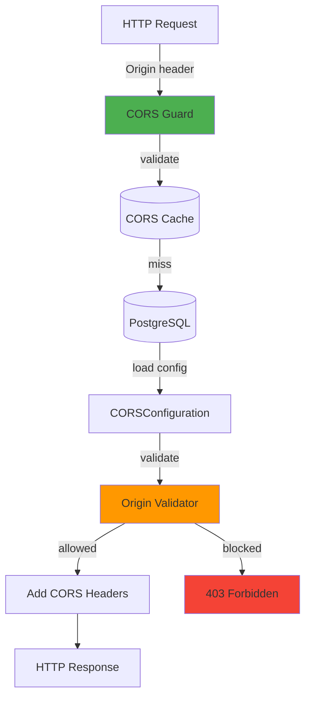
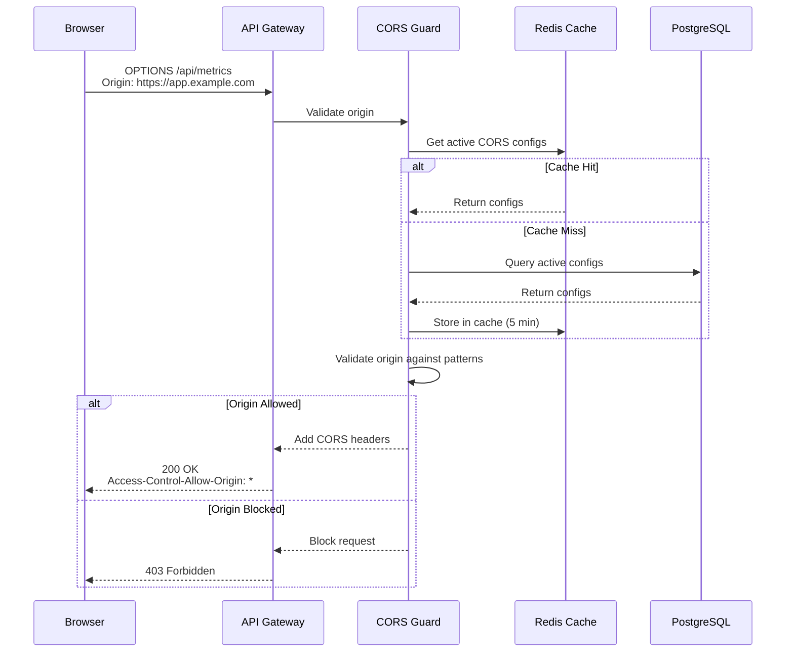

# Shared Module: CORS Configuration

- **Module**: `shared/cors`
- **Category**: Backend / Shared Modules
- **Status**: Production Ready
- **Priority:** 🔥 HIGH - Security
- **Version**: 3.10.0

---

## Overview

The **CORS Configuration module** provides **dynamic CORS management** for API security. Features:

- **Dynamic origin validation**: Real-time CORS validation
- **Multi-tenant CORS**: Per-tenant origin whitelisting
- **CRUD operations**: Create, update, activate, deactivate CORS configs
- **Wildcard support**: Domain pattern matching
- **Secure defaults**: Credentials, max-age, allowed methods/headers

---

## Architecture



---

## Domain Model

```typescript
// shared/cors/domain/aggregates/CORSConfiguration.ts
export class CORSConfiguration extends AggregateRoot<CORSConfigId> {
  constructor(
    id: CORSConfigId,
    private readonly _tenantId: TenantId,
    private _name: string,
    private _origins: string[],
    private _methods: string[],
    private _headers: string[],
    private _credentials: boolean = false,
    private _maxAge: number = 86400,
    private _isActive: boolean = true,
  ) {
    super(id);
  }

  static create(
    tenantId: TenantId,
    name: string,
    origins: string[],
    methods: string[],
    headers: string[],
  ): CORSConfiguration {
    const id = CORSConfigId.generate();
    const config = new CORSConfiguration(
      id,
      tenantId,
      name,
      origins,
      methods,
      headers,
    );

    config.addDomainEvent(
      new CORSConfigCreatedEvent(id.value, tenantId.getValue(), name, new Date()),
    );

    return config;
  }

  update(
    name: string,
    origins: string[],
    methods: string[],
    headers: string[],
  ): void {
    this._name = name;
    this._origins = origins;
    this._methods = methods;
    this._headers = headers;
    this._updatedAt = new Date();

    this.addDomainEvent(
      new CORSConfigUpdatedEvent(this.id.value, this._tenantId.getValue(), name, new Date()),
    );
  }

  activate(): void {
    this._isActive = true;
  }

  deactivate(): void {
    this._isActive = false;
  }
}
```

---

## Database Schema

```sql
CREATE TABLE cors_configurations (
  cors_config_id UUID PRIMARY KEY DEFAULT gen_random_uuid(),

  name VARCHAR(255) NOT NULL,

  -- Allowed origins (can use wildcards like *.example.com)
  origins TEXT[] NOT NULL,

  -- Allowed HTTP methods
  methods TEXT[] DEFAULT ARRAY['GET', 'POST', 'PUT', 'DELETE', 'PATCH'],

  -- Allowed headers
  headers TEXT[] DEFAULT ARRAY['Content-Type', 'Authorization'],

  -- Allow credentials (cookies, authorization headers)
  credentials BOOLEAN DEFAULT false,

  -- Max age for preflight cache (seconds)
  max_age INTEGER DEFAULT 86400,

  -- Active status
  is_active BOOLEAN DEFAULT true,

  -- Multi-tenancy
  tenant_id UUID REFERENCES tenants(tenant_id),

  created_at TIMESTAMP DEFAULT NOW(),
  updated_at TIMESTAMP DEFAULT NOW(),
  deleted_at TIMESTAMP,

  -- Constraints
  CONSTRAINT origins_not_empty CHECK (array_length(origins, 1) > 0)
);

CREATE INDEX idx_cors_tenant_active
ON cors_configurations(tenant_id, is_active)
WHERE deleted_at IS NULL;

CREATE INDEX idx_cors_origins
ON cors_configurations USING gin(origins);
```

---

## CORS Validation Flow



---

## Origin Pattern Matching

```typescript
// shared/cors/application/handlers/validate-origin.handler.ts
export class ValidateOriginHandler {
  async execute(query: ValidateOriginQuery): Promise<boolean> {
    const { origin, tenantId } = query;

    // Get active CORS configs for tenant
    const configs = await this.repository.findActiveByTenant(tenantId);

    // Check if origin matches any allowed pattern
    for (const config of configs) {
      if (this.matchesPattern(origin, config.origins)) {
        return true;
      }
    }

    return false;
  }

  private matchesPattern(origin: string, patterns: string[]): boolean {
    for (const pattern of patterns) {
      // Exact match
      if (pattern === origin) return true;

      // Wildcard match (*.example.com)
      if (pattern.startsWith('*')) {
        const domain = pattern.substring(1); // Remove *
        if (origin.endsWith(domain)) return true;
      }

      // Allow all (*)
      if (pattern === '*') return true;
    }

    return false;
  }
}
```

---

## API Endpoints

| Method | Endpoint | Description | Permission |
|--------|----------|-------------|------------|
| `POST` | `/api/v1/cors` | Create CORS config | `CORS_CREATE` |
| `GET` | `/api/v1/cors` | List CORS configs | `CORS_READ` |
| `GET` | `/api/v1/cors/:id` | Get CORS config | `CORS_READ` |
| `PATCH` | `/api/v1/cors/:id` | Update CORS config | `CORS_UPDATE` |
| `DELETE` | `/api/v1/cors/:id` | Delete CORS config | `CORS_DELETE` |
| `POST` | `/api/v1/cors/:id/activate` | Activate config | `CORS_UPDATE` |
| `POST` | `/api/v1/cors/:id/deactivate` | Deactivate config | `CORS_UPDATE` |

---

## Request/Response Examples

**Create CORS Configuration:**
```http
POST /api/v1/cors
Authorization: Bearer <jwt_token>
X-Tenant-ID: tenant_123

{
  "name": "Production Frontend",
  "origins": [
    "https://app.example.com",
    "https://*.example.com",
    "http://localhost:3000"
  ],
  "methods": ["GET", "POST", "PUT", "DELETE"],
  "headers": ["Content-Type", "Authorization", "X-Tenant-ID"],
  "credentials": true,
  "maxAge": 86400
}
```

**Response:**
```json
{
  "corsConfigId": "550e8400-e29b-41d4-a716-446655440000",
  "name": "Production Frontend",
  "origins": [
    "https://app.example.com",
    "https://*.example.com",
    "http://localhost:3000"
  ],
  "methods": ["GET", "POST", "PUT", "DELETE"],
  "headers": ["Content-Type", "Authorization", "X-Tenant-ID"],
  "credentials": true,
  "maxAge": 86400,
  "isActive": true,
  "createdAt": "2025-12-12T10:00:00Z"
}
```

---

## Default CORS Configuration

```typescript
// Default CORS for development
const developmentCORS = {
  name: 'Development',
  origins: ['http://localhost:3000', 'http://localhost:5173'],
  methods: ['GET', 'POST', 'PUT', 'DELETE', 'PATCH', 'OPTIONS'],
  headers: ['Content-Type', 'Authorization', 'X-Tenant-ID'],
  credentials: true,
  maxAge: 86400,
};

// Default CORS for production
const productionCORS = {
  name: 'Production',
  origins: ['https://app.telemetryflow.io'],
  methods: ['GET', 'POST', 'PUT', 'DELETE'],
  headers: ['Content-Type', 'Authorization', 'X-Tenant-ID'],
  credentials: true,
  maxAge: 86400,
};
```

---

## CORS Guard Implementation

```typescript
@Injectable()
export class CORSGuard implements CanActivate {
  constructor(
    private readonly corsService: CorsConfigService,
    private readonly cacheService: CacheService,
  ) {}

  async canActivate(context: ExecutionContext): Promise<boolean> {
    const request = context.switchToHttp().getRequest();
    const origin = request.headers.origin;
    const tenantId = request.headers['x-tenant-id'];

    if (!origin) return true; // No origin header = same-origin request

    // Check cache first
    const cacheKey = `cors:${tenantId}:${origin}`;
    const cached = await this.cacheService.get(cacheKey);
    if (cached !== null) return cached === 'allowed';

    // Validate origin
    const allowed = await this.corsService.validateOrigin(origin, tenantId);

    // Cache result for 5 minutes
    await this.cacheService.set(cacheKey, allowed ? 'allowed' : 'blocked', 300);

    return allowed;
  }
}
```

---

## Caching Strategy

```typescript
// CORS validation results cached in Redis
const cacheConfig = {
  keyPattern: 'cors:{tenantId}:{origin}',
  ttl: 300, // 5 minutes

  // Cache invalidation on CORS config changes
  invalidateOn: [
    'CORSConfigCreatedEvent',
    'CORSConfigUpdatedEvent',
    'CORSConfigDeletedEvent',
  ],
};
```

---

## Security Best Practices

1. **Never use wildcard (*) in production** for credentials=true
2. **Validate origin strictly** - exact match or pattern match only
3. **Limit allowed methods** - only enable what's needed
4. **Restrict allowed headers** - whitelist only required headers
5. **Set appropriate max-age** - balance between performance and security
6. **Enable credentials only when needed** - increases security risk
7. **Use HTTPS origins in production** - HTTP origins are insecure

---

## Testing

```typescript
describe('CORSConfiguration', () => {
  it('should allow valid origin', async () => {
    const config = CORSConfiguration.create(
      tenantId,
      'Test Config',
      ['https://app.example.com'],
      ['GET', 'POST'],
      ['Content-Type'],
    );

    const allowed = config.validateOrigin('https://app.example.com');
    expect(allowed).toBe(true);
  });

  it('should block invalid origin', async () => {
    const config = CORSConfiguration.create(
      tenantId,
      'Test Config',
      ['https://app.example.com'],
      ['GET', 'POST'],
      ['Content-Type'],
    );

    const allowed = config.validateOrigin('https://malicious.com');
    expect(allowed).toBe(false);
  });

  it('should support wildcard patterns', async () => {
    const config = CORSConfiguration.create(
      tenantId,
      'Test Config',
      ['https://*.example.com'],
      ['GET', 'POST'],
      ['Content-Type'],
    );

    expect(config.validateOrigin('https://app.example.com')).toBe(true);
    expect(config.validateOrigin('https://api.example.com')).toBe(true);
    expect(config.validateOrigin('https://example.com')).toBe(false);
  });
});
```

---

## Related Modules

- **200-auth.md** - Authentication (CORS for auth endpoints)
- **cache.md** - Redis caching for CORS validation
- **logger.md** - Audit logging for CORS violations

---

- **Last Updated**: December 12, 2025
- **Maintained By**: DevOpsCorner Indonesia
