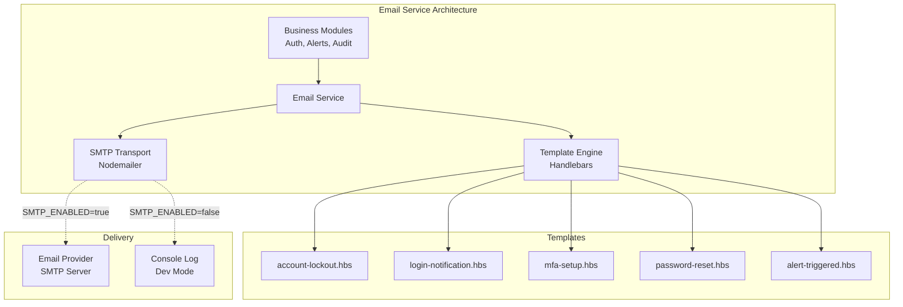

# Shared Module: Email Service

- **Module**: `shared/email`
- **Category**: Backend / Shared Infrastructure
- **Status**: Production Ready
- **Version**: 3.10.0

---

## Overview

The **Email Service** provides **comprehensive email notification** capabilities across the TelemetryFlow platform. It supports:

- **Transactional emails**: Account verification, password resets, MFA setup
- **Security notifications**: Login alerts, suspicious activity, account lockout
- **Alert notifications**: Alert triggers, escalations
- **Template engine**: Handlebars templates for HTML emails
- **Development mode**: Console logging fallback when SMTP is disabled

This shared module is used by Auth, Alerts, Audit, and other modules for email communications.

---

## Table of Contents

1. [Architecture Overview](#architecture-overview)
2. [Email Service Implementation](#email-service-implementation)
3. [Template System](#template-system)
4. [Email Types](#email-types)
5. [Configuration](#configuration)
6. [Usage Examples](#usage-examples)
7. [Testing](#testing)
8. [Best Practices](#best-practices)

---

## Architecture Overview



**Key Principles:**
- **Template-based**: Reusable Handlebars templates
- **Feature-flagged**: Enable/disable SMTP dynamically
- **Type-safe**: TypeScript interfaces for all email types
- **Testable**: Mock SMTP in tests, console log in dev

---

## Email Service Implementation

### Core Service

```typescript
// /backend/src/shared/email/email.service.ts

import * as nodemailer from 'nodemailer';
import * as handlebars from 'handlebars';
import * as fs from 'fs/promises';
import * as path from 'path';

export interface SendEmailOptions {
  to: string | string[];
  subject: string;
  template: string;
  context: Record<string, any>;
  attachments?: nodemailer.Attachment[];
}

export interface EmailConfig {
  host: string;
  port: number;
  secure: boolean;
  auth?: {
    user: string;
    pass: string;
  };
  from: string;
}

@Injectable()
export class EmailService {
  private transporter: nodemailer.Transporter | null = null;
  private readonly emailEnabled: boolean;
  private readonly emailConfig: EmailConfig;
  private templateCache: Map<string, handlebars.TemplateDelegate> = new Map();

  constructor(
    private logger: LoggerService,
    private configService: ConfigService,
  ) {
    this.emailEnabled = this.configService.get<boolean>('SMTP_ENABLED', false);

    this.emailConfig = {
      host: this.configService.get<string>('SMTP_HOST', 'localhost'),
      port: this.configService.get<number>('SMTP_PORT', 587),
      secure: this.configService.get<boolean>('SMTP_SECURE', false),
      auth: this.getSmtpAuth(),
      from: this.configService.get<string>('SMTP_FROM', 'TelemetryFlow <noreply@telemetryflow.id>'),
    };

    if (this.emailEnabled) {
      this.initializeTransporter();
    } else {
      this.logger.warn('📧 Email service DISABLED (SMTP_ENABLED=false). Emails will be logged to console.');
    }
  }

  private initializeTransporter(): void {
    this.transporter = nodemailer.createTransport({
      host: this.emailConfig.host,
      port: this.emailConfig.port,
      secure: this.emailConfig.secure,
      auth: this.emailConfig.auth,
    });

    this.logger.log(`📧 Email service initialized: ${this.emailConfig.host}:${this.emailConfig.port}`);
  }

  private getSmtpAuth(): { user: string; pass: string } | undefined {
    const user = this.configService.get<string>('SMTP_USER');
    const pass = this.configService.get<string>('SMTP_PASS');

    if (user && pass) {
      return { user, pass };
    }

    return undefined;
  }

  async sendEmail(options: SendEmailOptions): Promise<boolean> {
    try {
      const html = await this.renderTemplate(options.template, options.context);

      const mailOptions: nodemailer.SendMailOptions = {
        from: this.emailConfig.from,
        to: options.to,
        subject: options.subject,
        html,
        attachments: options.attachments,
      };

      if (this.emailEnabled && this.transporter) {
        const info = await this.transporter.sendMail(mailOptions);
        this.logger.log(`📧 Email sent: ${options.subject} → ${options.to} [${info.messageId}]`);
        return true;
      } else {
        // Development mode: log to console
        this.logger.log(`📧 [DEV MODE] Email NOT sent (SMTP disabled):`);
        this.logger.log(`   To: ${options.to}`);
        this.logger.log(`   Subject: ${options.subject}`);
        this.logger.log(`   Template: ${options.template}`);
        this.logger.log(`   Context: ${JSON.stringify(options.context, null, 2)}`);
        return false;
      }
    } catch (error) {
      this.logger.error(`📧 Failed to send email: ${error.message}`, error.stack);
      throw new EmailSendException(error.message);
    }
  }

  private async renderTemplate(templateName: string, context: Record<string, any>): Promise<string> {
    // Check cache first
    let template = this.templateCache.get(templateName);

    if (!template) {
      // Load template from file
      const templatePath = path.join(__dirname, 'templates', `${templateName}.hbs`);
      const templateSource = await fs.readFile(templatePath, 'utf-8');
      template = handlebars.compile(templateSource);

      // Cache compiled template
      this.templateCache.set(templateName, template);
    }

    return template(context);
  }

  private async loadTemplate(templateName: string): Promise<handlebars.TemplateDelegate> {
    const cached = this.templateCache.get(templateName);
    if (cached) return cached;

    const templatePath = path.join(__dirname, 'templates', `${templateName}.hbs`);
    const templateSource = await fs.readFile(templatePath, 'utf-8');
    const compiled = handlebars.compile(templateSource);

    this.templateCache.set(templateName, compiled);
    return compiled;
  }

  // === Specific Email Methods ===

  async sendAccountLockoutNotification(
    email: string,
    lockoutDuration: number,
    unlockTime: Date,
  ): Promise<boolean> {
    return this.sendEmail({
      to: email,
      subject: '🔒 Account Locked - TelemetryFlow',
      template: 'account-lockout',
      context: {
        lockoutDuration,
        unlockTime: unlockTime.toISOString(),
        supportEmail: this.configService.get('SUPPORT_EMAIL', 'support@telemetryflow.id'),
      },
    });
  }

  async sendLoginNotification(
    email: string,
    ipAddress: string,
    userAgent: string,
    timestamp: Date,
  ): Promise<boolean> {
    return this.sendEmail({
      to: email,
      subject: '🔐 New Login Detected - TelemetryFlow',
      template: 'login-notification',
      context: {
        ipAddress,
        userAgent,
        timestamp: timestamp.toISOString(),
        accountUrl: this.configService.get('APP_URL', 'https://telemetryflow.id') + '/account',
      },
    });
  }

  async sendPasswordResetEmail(email: string, resetToken: string, expiresIn: number): Promise<boolean> {
    const resetUrl = `${this.configService.get('APP_URL')}/auth/reset-password?token=${resetToken}`;

    return this.sendEmail({
      to: email,
      subject: '🔑 Password Reset Request - TelemetryFlow',
      template: 'password-reset',
      context: {
        resetUrl,
        expiresIn,
        email,
      },
    });
  }

  async sendMfaSetupEmail(email: string, qrCodeUrl: string, backupCodes: string[]): Promise<boolean> {
    return this.sendEmail({
      to: email,
      subject: '🔐 MFA Setup - TelemetryFlow',
      template: 'mfa-setup',
      context: {
        qrCodeUrl,
        backupCodes,
      },
    });
  }

  async sendSuspiciousActivityAlert(
    email: string,
    activityType: string,
    details: Record<string, any>,
  ): Promise<boolean> {
    return this.sendEmail({
      to: email,
      subject: '⚠️ Suspicious Activity Detected - TelemetryFlow',
      template: 'suspicious-activity',
      context: {
        activityType,
        details,
        timestamp: new Date().toISOString(),
        supportEmail: this.configService.get('SUPPORT_EMAIL'),
      },
    });
  }

  async sendAlertNotification(
    email: string,
    alertName: string,
    severity: string,
    message: string,
    dashboardUrl: string,
  ): Promise<boolean> {
    return this.sendEmail({
      to: email,
      subject: `🚨 Alert Triggered: ${alertName} - TelemetryFlow`,
      template: 'alert-triggered',
      context: {
        alertName,
        severity,
        message,
        dashboardUrl,
        timestamp: new Date().toISOString(),
      },
    });
  }

  async sendPasswordChangedNotification(email: string): Promise<boolean> {
    return this.sendEmail({
      to: email,
      subject: '🔒 Password Changed - TelemetryFlow',
      template: 'password-changed',
      context: {
        timestamp: new Date().toISOString(),
        supportEmail: this.configService.get('SUPPORT_EMAIL'),
      },
    });
  }

  async sendWelcomeEmail(email: string, name: string, verificationUrl: string): Promise<boolean> {
    return this.sendEmail({
      to: email,
      subject: '👋 Welcome to TelemetryFlow!',
      template: 'welcome',
      context: {
        name,
        verificationUrl,
        appUrl: this.configService.get('APP_URL'),
      },
    });
  }
}
```

---

## Template System

### Template Structure

Templates are stored in `/backend/src/shared/email/templates/` with `.hbs` extension.

**Directory Layout:**
```
/backend/src/shared/email/templates/
├── account-lockout.hbs
├── alert-triggered.hbs
├── login-notification.hbs
├── mfa-setup.hbs
├── password-changed.hbs
├── password-reset.hbs
├── suspicious-activity.hbs
├── welcome.hbs
└── partials/
    ├── footer.hbs
    └── header.hbs
```

### Example Template: Account Lockout

```html
<!-- /backend/src/shared/email/templates/account-lockout.hbs -->

<!DOCTYPE html>
<html>
<head>
  <meta charset="utf-8">
  <meta name="viewport" content="width=device-width, initial-scale=1.0">
  <title>Account Locked</title>
  <style>
    body {
      font-family: Arial, sans-serif;
      line-height: 1.6;
      color: #333;
      max-width: 600px;
      margin: 0 auto;
      padding: 20px;
    }
    .header {
      background-color: #f44336;
      color: white;
      padding: 20px;
      text-align: center;
      border-radius: 5px 5px 0 0;
    }
    .content {
      background-color: #f9f9f9;
      padding: 30px;
      border-radius: 0 0 5px 5px;
    }
    .button {
      display: inline-block;
      background-color: #2196f3;
      color: white;
      padding: 12px 24px;
      text-decoration: none;
      border-radius: 4px;
      margin-top: 20px;
    }
    .footer {
      text-align: center;
      margin-top: 20px;
      font-size: 12px;
      color: #999;
    }
  </style>
</head>
<body>
  <div class="header">
    <h1>🔒 Account Locked</h1>
  </div>

  <div class="content">
    <p>Hello,</p>

    <p>Your TelemetryFlow account has been temporarily locked due to multiple failed login attempts.</p>

    <p><strong>Lockout Details:</strong></p>
    <ul>
      <li><strong>Duration:</strong> {{lockoutDuration}} minutes</li>
      <li><strong>Unlock Time:</strong> {{unlockTime}}</li>
    </ul>

    <p>This is a security measure to protect your account from unauthorized access attempts.</p>

    <p><strong>What to do:</strong></p>
    <ul>
      <li>Wait until the lockout period expires</li>
      <li>If you didn't attempt to log in, <a href="mailto:{{supportEmail}}">contact support immediately</a></li>
      <li>Once unlocked, you can log in normally</li>
    </ul>

    <p>If you need immediate assistance, please contact our support team.</p>

    <a href="mailto:{{supportEmail}}" class="button">Contact Support</a>
  </div>

  <div class="footer">
    <p>TelemetryFlow | DevOpsCorner Indonesia</p>
    <p>This is an automated security notification.</p>
  </div>
</body>
</html>
```

### Example Template: Alert Triggered

```html
<!-- /backend/src/shared/email/templates/alert-triggered.hbs -->

<!DOCTYPE html>
<html>
<head>
  <meta charset="utf-8">
  <title>Alert Triggered</title>
  <style>
    /* Same base styles as above */
    .severity-critical { background-color: #f44336; }
    .severity-warning { background-color: #ff9800; }
    .severity-info { background-color: #2196f3; }
  </style>
</head>
<body>
  <div class="header severity-{{severity}}">
    <h1>🚨 Alert Triggered</h1>
  </div>

  <div class="content">
    <h2>{{alertName}}</h2>

    <p><strong>Severity:</strong> <span style="text-transform: uppercase;">{{severity}}</span></p>
    <p><strong>Time:</strong> {{timestamp}}</p>

    <p><strong>Message:</strong></p>
    <div style="background: white; padding: 15px; border-left: 4px solid #f44336; margin: 10px 0;">
      {{message}}
    </div>

    <p>View the full details and metrics in your dashboard:</p>

    <a href="{{dashboardUrl}}" class="button">View Dashboard</a>
  </div>

  <div class="footer">
    <p>TelemetryFlow Alert System</p>
  </div>
</body>
</html>
```

---

## Email Types

### 1. Account Security

| Email Type | Template | Use Case |
|------------|----------|----------|
| Account Lockout | `account-lockout.hbs` | 5 failed login attempts |
| Password Reset | `password-reset.hbs` | User requested password reset |
| Password Changed | `password-changed.hbs` | Password successfully changed |
| Login Notification | `login-notification.hbs` | New device/location login |
| Suspicious Activity | `suspicious-activity.hbs` | Unusual behavior detected |

### 2. MFA & Authentication

| Email Type | Template | Use Case |
|------------|----------|----------|
| MFA Setup | `mfa-setup.hbs` | User enabled MFA |
| MFA Disabled | `mfa-disabled.hbs` | User disabled MFA |

### 3. Alerts & Monitoring

| Email Type | Template | Use Case |
|------------|----------|----------|
| Alert Triggered | `alert-triggered.hbs` | Alert condition met |
| Alert Resolved | `alert-resolved.hbs` | Alert condition cleared |

### 4. User Lifecycle

| Email Type | Template | Use Case |
|------------|----------|----------|
| Welcome | `welcome.hbs` | New user registration |
| Email Verification | `email-verification.hbs` | Verify email address |

---

## Configuration

### Environment Variables

```bash
# SMTP Configuration
SMTP_ENABLED=true                  # Enable/disable email sending
SMTP_HOST=smtp.gmail.com           # SMTP server hostname
SMTP_PORT=587                      # SMTP port (587 for TLS, 465 for SSL)
SMTP_SECURE=false                  # Use SSL (true for port 465)
SMTP_USER=noreply@telemetryflow.id # SMTP username
SMTP_PASS=your-smtp-password       # SMTP password
SMTP_FROM=TelemetryFlow <noreply@telemetryflow.id> # From address

# Application URLs
APP_URL=https://telemetryflow.id   # Base app URL for links
SUPPORT_EMAIL=support@telemetryflow.id # Support contact email

# Email Features
EMAIL_TEMPLATE_CACHE=true          # Cache compiled templates
EMAIL_ASYNC_SEND=true              # Send emails asynchronously
```

### SMTP Provider Examples

#### Gmail

```bash
SMTP_HOST=smtp.gmail.com
SMTP_PORT=587
SMTP_SECURE=false
SMTP_USER=your-email@gmail.com
SMTP_PASS=your-app-password  # Use App Password, not regular password
```

#### AWS SES

```bash
SMTP_HOST=email-smtp.us-east-1.amazonaws.com
SMTP_PORT=587
SMTP_SECURE=false
SMTP_USER=your-ses-smtp-username
SMTP_PASS=your-ses-smtp-password
```

#### SendGrid

```bash
SMTP_HOST=smtp.sendgrid.net
SMTP_PORT=587
SMTP_SECURE=false
SMTP_USER=apikey
SMTP_PASS=your-sendgrid-api-key
```

---

## Usage Examples

### 1. Account Lockout Notification

```typescript
// /backend/src/modules/200-auth/application/services/AuthService.ts

async handleFailedLogin(email: string, ipAddress: string): Promise<void> {
  const user = await this.userRepository.findByEmail(email);
  user.recordFailedLogin();

  if (user.isLocked()) {
    // Send lockout notification
    await this.emailService.sendAccountLockoutNotification(
      user.email,
      30, // lockout duration in minutes
      user.lockedUntil,
    );
  }

  await this.userRepository.save(user);
}
```

### 2. Alert Notification

```typescript
// /backend/src/modules/600-alerts/application/services/AlertService.ts

async triggerAlert(alert: Alert, metrics: Metric[]): Promise<void> {
  // Send email to configured recipients
  for (const recipient of alert.notificationConfig.emailRecipients) {
    await this.emailService.sendAlertNotification(
      recipient,
      alert.name,
      alert.severity,
      `Threshold exceeded: ${metrics.length} violations detected`,
      `https://telemetryflow.id/dashboards/${alert.dashboardId}`,
    );
  }
}
```

### 3. Password Reset

```typescript
// /backend/src/modules/200-auth/application/services/PasswordResetService.ts

async requestPasswordReset(email: string): Promise<void> {
  const user = await this.userRepository.findByEmail(email);

  if (!user) {
    // Don't reveal if email exists (security)
    return;
  }

  const resetToken = this.tokenService.generateResetToken(user.id);

  await this.emailService.sendPasswordResetEmail(
    user.email,
    resetToken,
    30, // expires in 30 minutes
  );
}
```

---

## Testing

### Unit Tests

```typescript
// /backend/src/shared/email/email.service.spec.ts

describe('EmailService', () => {
  let emailService: EmailService;
  let mockConfigService: ConfigService;

  beforeEach(() => {
    mockConfigService = {
      get: jest.fn((key, defaultValue) => {
        if (key === 'SMTP_ENABLED') return false; // Disable SMTP for tests
        return defaultValue;
      }),
    } as any;

    emailService = new EmailService(mockLogger, mockConfigService);
  });

  it('should send account lockout email', async () => {
    const result = await emailService.sendAccountLockoutNotification(
      'user@example.com',
      30,
      new Date(),
    );

    // In dev mode (SMTP_ENABLED=false), email is logged but not sent
    expect(result).toBe(false);
  });

  it('should render template correctly', async () => {
    const html = await emailService['renderTemplate']('account-lockout', {
      lockoutDuration: 30,
      unlockTime: new Date().toISOString(),
      supportEmail: 'support@telemetryflow.id',
    });

    expect(html).toContain('Account Locked');
    expect(html).toContain('30 minutes');
  });
});
```

### Integration Tests (with Real SMTP)

```typescript
describe('EmailService Integration', () => {
  let emailService: EmailService;

  beforeAll(() => {
    process.env.SMTP_ENABLED = 'true';
    process.env.SMTP_HOST = 'smtp.mailtrap.io'; // Use Mailtrap for testing
    process.env.SMTP_PORT = '587';
    process.env.SMTP_USER = 'test-user';
    process.env.SMTP_PASS = 'test-pass';

    emailService = new EmailService(logger, configService);
  });

  it('should send real email via SMTP', async () => {
    const result = await emailService.sendAccountLockoutNotification(
      'test@example.com',
      30,
      new Date(),
    );

    expect(result).toBe(true);
  });
});
```

---

## Best Practices

### 1. Always Use Templates

```typescript
// ❌ BAD: Inline HTML
await transporter.sendMail({
  to: email,
  subject: 'Alert',
  html: '<h1>Alert triggered</h1><p>Check dashboard</p>',
});

// ✅ GOOD: Template-based
await emailService.sendAlertNotification(email, alertName, severity, message, dashboardUrl);
```

### 2. Handle Failures Gracefully

```typescript
try {
  await emailService.sendAccountLockoutNotification(...);
} catch (error) {
  // Log error but don't fail the request
  logger.error('Failed to send email', error);
}
```

### 3. Use Feature Flags

```typescript
if (!this.emailEnabled) {
  this.logger.log('[DEV MODE] Email not sent (SMTP disabled)');
  return false;
}
```

### 4. Sanitize Context Data

```typescript
// ❌ BAD: User input directly in template
context: { message: userInput }

// ✅ GOOD: Sanitize HTML
context: { message: sanitizeHtml(userInput) }
```

### 5. Async Email Sending

```typescript
// Don't block the response waiting for email to send
await this.eventBus.publish(new SendEmailEvent(emailOptions));

// Email is sent asynchronously by event handler
@EventsHandler(SendEmailEvent)
export class SendEmailEventHandler {
  async handle(event: SendEmailEvent) {
    await this.emailService.sendEmail(event.options);
  }
}
```

---

## Related Documentation

- [Module 200: Auth](../modules/200-auth.md) - Authentication emails
- [Module 600: Alerts](../modules/600-alerts.md) - Alert notifications
- [Module 800: Audit](../modules/800-audit.md) - Security notifications
- [Shared Module: Logger](./logger.md) - Logging email operations

---

- **Last Updated**: December 12, 2025
- **Maintained By**: DevOpsCorner Indonesia
