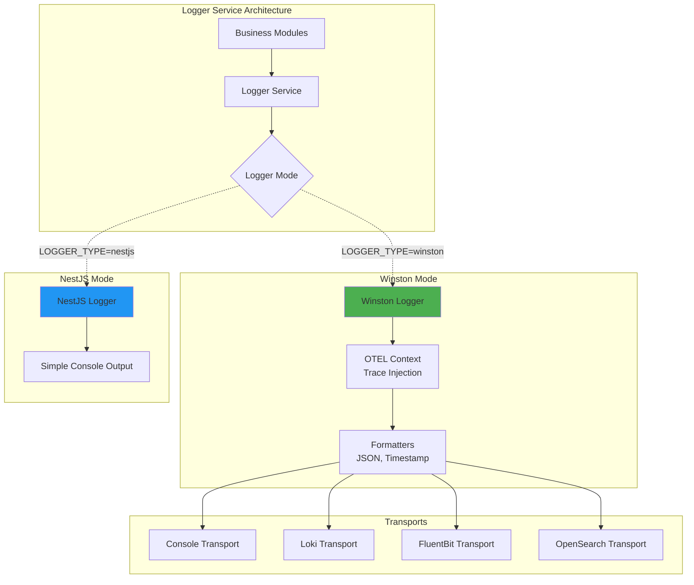
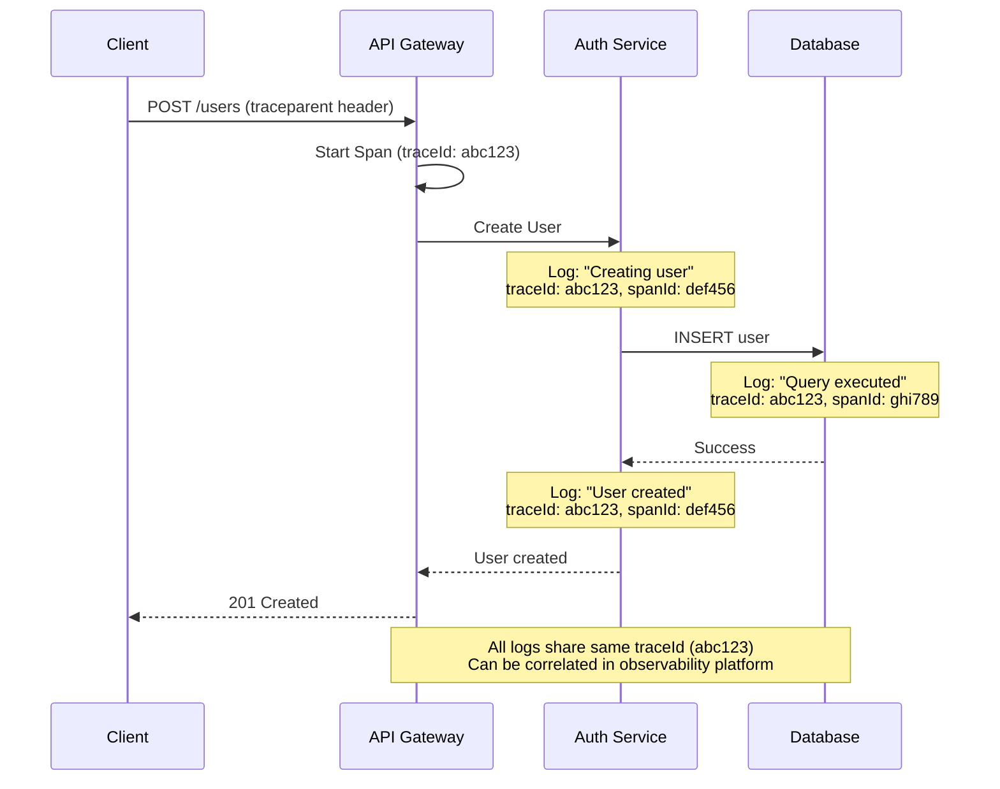

# Shared Module: Logger Service

- **Module**: `shared/logger`
- **Category**: Backend / Shared Infrastructure
- **Status**: Production Ready
- **Version**: 1.1.2-CE

---

## Overview

The **Logger Service** provides **comprehensive logging** capabilities with **OpenTelemetry integration** for the entire TelemetryFlow platform. It supports:

- **Dual mode**: NestJS simple logger or Winston full-featured logger
- **OpenTelemetry trace context**: Automatic injection of trace IDs into logs
- **Multiple transports**: Console, Loki, FluentBit, OpenSearch
- **Environment-based configuration**: Different log levels per environment
- **Structured logging**: JSON format for machine parsing

This shared module is used by all modules for consistent logging across the platform.

---

## Table of Contents

1. [Architecture Overview](#architecture-overview)
2. [Logger Implementation](#logger-implementation)
3. [OpenTelemetry Integration](#opentelemetry-integration)
4. [Log Levels](#log-levels)
5. [Transports](#transports)
6. [Configuration](#configuration)
7. [Usage Examples](#usage-examples)
8. [Best Practices](#best-practices)

---

## Architecture Overview



**Key Principles:**
- **Dual mode**: Choose between simple NestJS logger or full-featured Winston
- **OTEL integration**: Automatically correlate logs with traces
- **Flexible transports**: Send logs to multiple destinations
- **Environment-aware**: Different configurations per environment

---

## Logger Implementation

### Core Service

```typescript
// /backend/src/shared/logger/logger.service.ts

import { Injectable, LoggerService as NestLoggerService, Inject } from '@nestjs/common';
import * as winston from 'winston';
import { trace, context as otelContext } from '@opentelemetry/api';

export type LogLevel = 'error' | 'warn' | 'info' | 'debug' | 'verbose';

export interface LoggerConfig {
  type: 'nestjs' | 'winston';
  level: LogLevel;
  json: boolean;
  timestamp: boolean;
  colorize: boolean;
  transports: {
    console: boolean;
    loki?: {
      enabled: boolean;
      host: string;
      labels?: Record<string, string>;
    };
    fluentbit?: {
      enabled: boolean;
      host: string;
      port: number;
    };
    opensearch?: {
      enabled: boolean;
      node: string;
      index: string;
    };
  };
}

@Injectable()
export class LoggerService implements NestLoggerService {
  private config: LoggerConfig;
  private winstonLogger: winston.Logger | null = null;
  private context: string = 'Application';

  constructor(@Inject('LOGGER_CONFIG') config: LoggerConfig) {
    this.config = config;
  }

  async onModuleInit() {
    if (this.config.type === 'winston') {
      await this.initializeWinston();
    }
  }

  private async initializeWinston() {
    const transports = await this.createTransports();

    this.winstonLogger = winston.createLogger({
      level: this.config.level,
      format: winston.format.combine(
        winston.format.timestamp(),
        this.createOtelContextFormat(),
        winston.format.errors({ stack: true }),
        this.config.json ? winston.format.json() : winston.format.simple(),
      ),
      transports,
    });

    this.log(`🔧 Winston logger initialized (level: ${this.config.level})`);
  }

  private createOtelContextFormat(): winston.Logform.Format {
    return winston.format((info) => {
      const span = trace.getSpan(otelContext.active());
      if (span) {
        const spanContext = span.spanContext();
        info.traceId = spanContext.traceId;
        info.spanId = spanContext.spanId;
        info.traceFlags = spanContext.traceFlags;
      }
      return info;
    })();
  }

  private async createTransports(): Promise<winston.transport[]> {
    const transports: winston.transport[] = [];

    // Console transport
    if (this.config.transports.console) {
      transports.push(
        new winston.transports.Console({
          format: winston.format.combine(
            winston.format.colorize({ all: this.config.colorize }),
            winston.format.printf(({ timestamp, level, message, context, traceId, ...meta }) => {
              const traceInfo = traceId ? ` [trace:${traceId.substring(0, 8)}]` : '';
              const ctx = context ? `[${context}]` : '';
              return `${timestamp} ${level} ${ctx}${traceInfo}: ${message} ${
                Object.keys(meta).length ? JSON.stringify(meta) : ''
              }`;
            }),
          ),
        }),
      );
    }

    // Loki transport
    if (this.config.transports.loki?.enabled) {
      const LokiTransport = (await import('winston-loki')).default;
      transports.push(
        new LokiTransport({
          host: this.config.transports.loki.host,
          labels: {
            app: 'telemetryflow',
            environment: process.env.NODE_ENV || 'development',
            ...this.config.transports.loki.labels,
          },
          json: true,
          format: winston.format.json(),
        }),
      );
    }

    // FluentBit transport
    if (this.config.transports.fluentbit?.enabled) {
      const FluentTransport = (await import('fluent-logger')).support.winstonTransport();
      transports.push(
        new FluentTransport('telemetryflow', {
          host: this.config.transports.fluentbit.host,
          port: this.config.transports.fluentbit.port,
          timeout: 3.0,
          requireAckResponse: false,
        }),
      );
    }

    // OpenSearch transport
    if (this.config.transports.opensearch?.enabled) {
      const { Client } = await import('@opensearch-project/opensearch');
      const client = new Client({ node: this.config.transports.opensearch.node });

      const OpenSearchTransport = (await import('winston-opensearch')).default;
      transports.push(
        new OpenSearchTransport({
          client,
          index: this.config.transports.opensearch.index,
        }),
      );
    }

    return transports;
  }

  setContext(context: string) {
    this.context = context;
  }

  // NestJS LoggerService interface methods
  log(message: string, context?: string) {
    const ctx = context || this.context;
    if (this.winstonLogger) {
      this.winstonLogger.info(message, { context: ctx });
    } else {
      console.log(`[${ctx}] ${message}`);
    }
  }

  error(message: string, trace?: string, context?: string) {
    const ctx = context || this.context;
    if (this.winstonLogger) {
      this.winstonLogger.error(message, { context: ctx, trace });
    } else {
      console.error(`[${ctx}] ${message}`, trace);
    }
  }

  warn(message: string, context?: string) {
    const ctx = context || this.context;
    if (this.winstonLogger) {
      this.winstonLogger.warn(message, { context: ctx });
    } else {
      console.warn(`[${ctx}] ${message}`);
    }
  }

  debug(message: string, context?: string) {
    const ctx = context || this.context;
    if (this.winstonLogger) {
      this.winstonLogger.debug(message, { context: ctx });
    } else {
      if (this.config.level === 'debug' || this.config.level === 'verbose') {
        console.debug(`[${ctx}] ${message}`);
      }
    }
  }

  verbose(message: string, context?: string) {
    const ctx = context || this.context;
    if (this.winstonLogger) {
      this.winstonLogger.verbose(message, { context: ctx });
    } else {
      if (this.config.level === 'verbose') {
        console.log(`[${ctx}] ${message}`);
      }
    }
  }

  // Additional Winston-specific methods
  logWithMetadata(level: LogLevel, message: string, metadata: Record<string, any>, context?: string) {
    const ctx = context || this.context;
    if (this.winstonLogger) {
      this.winstonLogger.log(level, message, { context: ctx, ...metadata });
    } else {
      console.log(`[${ctx}] ${message}`, metadata);
    }
  }

  // Structured logging
  logStructured(data: {
    level: LogLevel;
    message: string;
    context?: string;
    userId?: string;
    tenantId?: string;
    requestId?: string;
    duration?: number;
    metadata?: Record<string, any>;
  }) {
    if (this.winstonLogger) {
      this.winstonLogger.log(data.level, data.message, {
        context: data.context || this.context,
        userId: data.userId,
        tenantId: data.tenantId,
        requestId: data.requestId,
        duration: data.duration,
        ...data.metadata,
      });
    } else {
      console.log(JSON.stringify(data));
    }
  }

  // HTTP request logging
  logHttpRequest(req: any, res: any, duration: number) {
    this.logStructured({
      level: 'info',
      message: `${req.method} ${req.url}`,
      context: 'HTTP',
      requestId: req.id,
      duration,
      metadata: {
        method: req.method,
        url: req.url,
        statusCode: res.statusCode,
        userAgent: req.headers['user-agent'],
        ip: req.ip,
      },
    });
  }

  // Query logging (database queries)
  logQuery(query: string, params: any[], duration: number) {
    if (this.config.level === 'debug' || this.config.level === 'verbose') {
      this.logStructured({
        level: 'debug',
        message: 'Database query executed',
        context: 'Database',
        duration,
        metadata: {
          query,
          params,
        },
      });
    }
  }
}
```

---

## OpenTelemetry Integration

### Automatic Trace Context Injection

```typescript
// Trace context is automatically added to every log entry

const otelContextFormat = winston.format((info) => {
  const span = trace.getSpan(otelContext.active());
  if (span) {
    const spanContext = span.spanContext();
    info.traceId = spanContext.traceId;
    info.spanId = spanContext.spanId;
    info.traceFlags = spanContext.traceFlags;
  }
  return info;
});
```

### Log Output with Trace Context

```json
{
  "timestamp": "2025-12-12T10:30:00.000Z",
  "level": "info",
  "message": "User created successfully",
  "context": "UserService",
  "traceId": "a1b2c3d4e5f6g7h8i9j0k1l2m3n4o5p6",
  "spanId": "x1y2z3a4b5c6d7e8",
  "traceFlags": 1,
  "userId": "uuid",
  "tenantId": "uuid"
}
```

### Correlation with Distributed Traces



---

## Log Levels

| Level | Description | Use Case | Environment |
|-------|-------------|----------|-------------|
| **error** | Critical errors that need immediate attention | Exceptions, failures | All |
| **warn** | Warning conditions that should be reviewed | Deprecated API usage, high latency | All |
| **info** | Informational messages | User login, job completion | Production, Staging |
| **debug** | Detailed debugging information | Function entry/exit, variable values | Development, Staging |
| **verbose** | Very detailed information | Request/response bodies | Development only |

### Environment-Based Log Levels

```typescript
// Recommended log levels per environment

const LOG_LEVELS = {
  production: 'info',
  staging: 'debug',
  development: 'verbose',
  test: 'error',
};

const logLevel = LOG_LEVELS[process.env.NODE_ENV] || 'info';
```

---

## Transports

### 1. Console Transport

Default transport for local development.

```typescript
new winston.transports.Console({
  format: winston.format.combine(
    winston.format.colorize({ all: true }),
    winston.format.printf(({ timestamp, level, message, context, traceId }) => {
      const trace = traceId ? `[trace:${traceId.substring(0, 8)}]` : '';
      return `${timestamp} ${level} [${context}]${trace}: ${message}`;
    }),
  ),
})
```

**Output:**
```
2025-12-12T10:30:00.000Z info [UserService][trace:a1b2c3d4]: User created successfully
```

### 2. Loki Transport

Send logs to Grafana Loki for centralized log aggregation.

```typescript
new LokiTransport({
  host: 'http://loki:3100',
  labels: {
    app: 'telemetryflow',
    environment: 'production',
    service: 'backend',
  },
  json: true,
  format: winston.format.json(),
})
```

### 3. FluentBit Transport

Forward logs to FluentBit for processing and routing.

```typescript
new FluentTransport('telemetryflow', {
  host: 'fluentbit',
  port: 24224,
  timeout: 3.0,
  requireAckResponse: false,
})
```

### 4. OpenSearch Transport

Index logs in OpenSearch for advanced search and analytics.

```typescript
new OpenSearchTransport({
  client: opensearchClient,
  index: 'telemetryflow-logs-{YYYY.MM.DD}',
})
```

---

## Configuration

### Environment Variables

```bash
# Logger Type
LOGGER_TYPE=winston                    # 'nestjs' or 'winston'
LOG_LEVEL=info                         # error, warn, info, debug, verbose

# Output Format
LOG_JSON=true                          # JSON format for machine parsing
LOG_TIMESTAMP=true                     # Include timestamp
LOG_COLORIZE=false                     # Colorize output (disable in production)

# Console Transport
LOG_CONSOLE_ENABLED=true               # Enable console logging

# Loki Transport
LOG_LOKI_ENABLED=false                 # Enable Loki transport
LOG_LOKI_HOST=http://loki:3100         # Loki host URL
LOG_LOKI_LABELS=app:telemetryflow      # Additional Loki labels

# FluentBit Transport
LOG_FLUENTBIT_ENABLED=false            # Enable FluentBit transport
LOG_FLUENTBIT_HOST=fluentbit           # FluentBit host
LOG_FLUENTBIT_PORT=24224               # FluentBit port

# OpenSearch Transport
LOG_OPENSEARCH_ENABLED=false           # Enable OpenSearch transport
LOG_OPENSEARCH_NODE=http://opensearch:9200 # OpenSearch node URL
LOG_OPENSEARCH_INDEX=telemetryflow-logs    # Index pattern
```

### Module Configuration

```typescript
// /backend/src/shared/logger/logger.module.ts

import { Module, Global } from '@nestjs/common';
import { LoggerService } from './logger.service';
import { ConfigService } from '@nestjs/config';

@Global()
@Module({
  providers: [
    {
      provide: 'LOGGER_CONFIG',
      useFactory: (configService: ConfigService) => ({
        type: configService.get('LOGGER_TYPE', 'winston'),
        level: configService.get('LOG_LEVEL', 'info'),
        json: configService.get('LOG_JSON', 'true') === 'true',
        timestamp: configService.get('LOG_TIMESTAMP', 'true') === 'true',
        colorize: configService.get('LOG_COLORIZE', 'false') === 'true',
        transports: {
          console: configService.get('LOG_CONSOLE_ENABLED', 'true') === 'true',
          loki: {
            enabled: configService.get('LOG_LOKI_ENABLED', 'false') === 'true',
            host: configService.get('LOG_LOKI_HOST', 'http://loki:3100'),
            labels: configService.get('LOG_LOKI_LABELS', '')
              .split(',')
              .reduce((acc, pair) => {
                const [key, value] = pair.split(':');
                if (key && value) acc[key] = value;
                return acc;
              }, {}),
          },
          fluentbit: {
            enabled: configService.get('LOG_FLUENTBIT_ENABLED', 'false') === 'true',
            host: configService.get('LOG_FLUENTBIT_HOST', 'fluentbit'),
            port: parseInt(configService.get('LOG_FLUENTBIT_PORT', '24224'), 10),
          },
          opensearch: {
            enabled: configService.get('LOG_OPENSEARCH_ENABLED', 'false') === 'true',
            node: configService.get('LOG_OPENSEARCH_NODE', 'http://opensearch:9200'),
            index: configService.get('LOG_OPENSEARCH_INDEX', 'telemetryflow-logs'),
          },
        },
      }),
      inject: [ConfigService],
    },
    LoggerService,
  ],
  exports: [LoggerService],
})
export class LoggerModule {}
```

---

## Usage Examples

### 1. Basic Logging

```typescript
import { Injectable } from '@nestjs/common';
import { LoggerService } from '@shared/logger/logger.service';

@Injectable()
export class UserService {
  constructor(private logger: LoggerService) {
    this.logger.setContext('UserService');
  }

  async createUser(dto: CreateUserDto) {
    this.logger.log(`Creating user: ${dto.email}`);

    try {
      const user = await this.userRepository.create(dto);
      this.logger.log(`User created successfully: ${user.id}`);
      return user;
    } catch (error) {
      this.logger.error(`Failed to create user: ${error.message}`, error.stack);
      throw error;
    }
  }
}
```

### 2. Structured Logging with Metadata

```typescript
this.logger.logStructured({
  level: 'info',
  message: 'User login successful',
  context: 'AuthService',
  userId: user.id,
  tenantId: user.tenantId,
  metadata: {
    loginMethod: 'password',
    mfaUsed: user.mfaEnabled,
    ipAddress: req.ip,
  },
});
```

### 3. HTTP Request Logging

```typescript
// /backend/src/shared/interceptors/LoggingInterceptor.ts

@Injectable()
export class LoggingInterceptor implements NestInterceptor {
  constructor(private logger: LoggerService) {}

  intercept(context: ExecutionContext, next: CallHandler): Observable<any> {
    const req = context.switchToHttp().getRequest();
    const res = context.switchToHttp().getResponse();
    const startTime = Date.now();

    return next.handle().pipe(
      tap(() => {
        const duration = Date.now() - startTime;
        this.logger.logHttpRequest(req, res, duration);
      }),
    );
  }
}
```

### 4. Database Query Logging

```typescript
// /backend/src/shared/database/QueryLogger.ts

export class QueryLogger implements Logger {
  constructor(private logger: LoggerService) {}

  logQuery(query: string, parameters?: any[]) {
    const startTime = Date.now();

    return () => {
      const duration = Date.now() - startTime;
      this.logger.logQuery(query, parameters, duration);
    };
  }

  logQueryError(error: string, query: string, parameters?: any[]) {
    this.logger.error(`Query failed: ${error}`, query);
  }
}
```

### 5. Performance Monitoring

```typescript
async processLargeDataset(data: any[]) {
  const startTime = Date.now();

  this.logger.debug(`Starting to process ${data.length} items`);

  try {
    const result = await this.heavyComputation(data);

    const duration = Date.now() - startTime;
    this.logger.logStructured({
      level: 'info',
      message: 'Dataset processed successfully',
      duration,
      metadata: {
        itemCount: data.length,
        resultSize: result.length,
      },
    });

    return result;
  } catch (error) {
    const duration = Date.now() - startTime;
    this.logger.logStructured({
      level: 'error',
      message: 'Dataset processing failed',
      duration,
      metadata: {
        itemCount: data.length,
        error: error.message,
      },
    });
    throw error;
  }
}
```

---

## Best Practices

### 1. Always Set Context

```typescript
// ❌ BAD: No context
this.logger.log('User created');

// ✅ GOOD: Context set in constructor
constructor(private logger: LoggerService) {
  this.logger.setContext('UserService');
}
this.logger.log('User created');
```

### 2. Use Appropriate Log Levels

```typescript
// ❌ BAD: Everything is 'info'
this.logger.log('Starting process');
this.logger.log('Process failed: Connection refused');

// ✅ GOOD: Use appropriate levels
this.logger.debug('Starting process');
this.logger.error('Process failed: Connection refused');
```

### 3. Include Useful Metadata

```typescript
// ❌ BAD: Vague message
this.logger.error('Failed');

// ✅ GOOD: Detailed context
this.logger.logStructured({
  level: 'error',
  message: 'Failed to create user',
  userId: dto.email,
  tenantId: context.tenantId,
  metadata: {
    error: error.message,
    stack: error.stack,
  },
});
```

### 4. Don't Log Sensitive Data

```typescript
// ❌ BAD: Logging password
this.logger.log(`User login: ${email}, password: ${password}`);

// ✅ GOOD: Redact sensitive data
this.logger.log(`User login: ${email}`);
```

### 5. Use Structured Logging

```typescript
// ❌ BAD: Concatenated string
this.logger.log(`Query took ${duration}ms with ${rowCount} rows`);

// ✅ GOOD: Structured data
this.logger.logStructured({
  level: 'debug',
  message: 'Database query completed',
  duration,
  metadata: { rowCount },
});
```

### 6. Log at Boundaries

```typescript
// Log at service boundaries (API entry/exit, external calls)

// API entry
this.logger.log(`API called: POST /users`);

// External service call
this.logger.log(`Calling external API: ${apiUrl}`);
const result = await this.httpClient.post(apiUrl, data);
this.logger.log(`External API responded: ${result.status}`);

// API exit
this.logger.log(`API response: 201 Created`);
```

---

## Related Documentation

- [Shared Module: OTEL](./otel.md) - OpenTelemetry instrumentation
- [Architecture: Performance](../../05-PERFORMANCE.md) - Performance monitoring
- [Backend Overview](../00-BACKEND-OVERVIEW.md) - Backend architecture

---

- **Last Updated**: January 01st, 2026
- **Maintained By**: DevOpsCorner Indonesia
