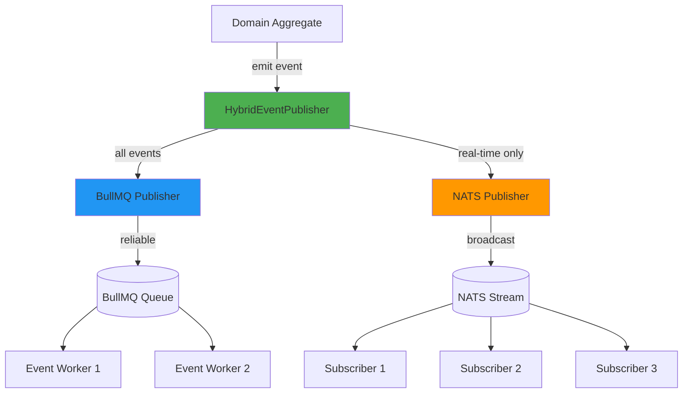
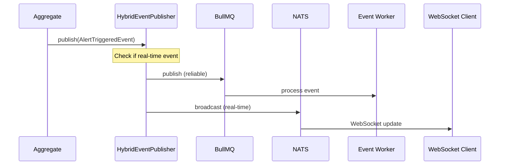

# Shared Module: Messaging

- **Module**: `shared/messaging`
- **Category**: Backend / Shared Modules
- **Status**: Production Ready
- **Priority:** 🔥 HIGH - Core Infrastructure
- **Version**: 1.0.0-CE

---

## Overview

The **Messaging module** provides **hybrid event publishing** for domain events using both **NATS** (real-time broadcasting) and **BullMQ** (reliable processing). Features:

- **Hybrid publishing**: NATS for real-time + BullMQ for reliability
- **Smart routing**: Auto-detect real-time vs batch events
- **Graceful degradation**: Falls back if one publisher fails
- **Domain event support**: Publishes DDD domain events
- **Batch publishing**: Efficient bulk event publishing

---

## Architecture



---

## Event Publishing Flow



---

## HybridEventPublisher

```typescript
// shared/messaging/hybrid-event-publisher.ts
@Injectable()
export class HybridEventPublisher implements IDomainEventPublisher {
  private readonly realTimeEvents = [
    'AlertTriggeredEvent',
    'MetricReceivedEvent',
    'DashboardUpdatedEvent',
    'UserStatusChangedEvent',
    'TraceCompletedEvent',
    'AuthLoginEvent',
    'AuthLogoutEvent',
    'MfaValidatedEvent',
    'AuditLogCreatedEvent',
    'SsoLoginEvent',
    'RolePermissionChangedEvent',
    'SecurityEventDetected',
    'SuspiciousActivityDetected',
  ];

  constructor(
    private readonly logger: LoggerService,
    @Optional() private readonly bullmq: BullMQEventPublisher,
    private readonly nats: NatsEventPublisher,
  ) {}

  async publish(event: DomainEvent | DomainEventData): Promise<void> {
    // BullMQ: Always (reliable processing)
    if (this.bullmq) {
      await this.bullmq.publish(event);
    }

    // NATS: Conditional (real-time broadcast)
    if (this.nats && this.shouldBroadcast(event)) {
      await this.nats.broadcast(event);
    }
  }

  async publishBatch(events: DomainEvent[]): Promise<void> {
    // BullMQ: Batch publish
    if (this.bullmq) {
      await this.bullmq.publishBatch(events);
    }

    // NATS: Real-time broadcast
    if (this.nats) {
      const realTimeEvents = events.filter(e => this.shouldBroadcast(e));
      await Promise.all(realTimeEvents.map(e => this.nats.broadcast(e)));
    }
  }

  private shouldBroadcast(event: DomainEvent): boolean {
    return this.realTimeEvents.includes(event.constructor.name);
  }
}
```

---

## Real-Time Event Types

| Event Type | Description | Use Case |
|------------|-------------|----------|
| **AlertTriggeredEvent** | Alert rule triggered | Real-time notification |
| **MetricReceivedEvent** | New metric data | Live dashboard updates |
| **DashboardUpdatedEvent** | Dashboard modified | Collaborative editing |
| **UserStatusChangedEvent** | User online/offline | Presence tracking |
| **TraceCompletedEvent** | Trace span completed | Live trace viewer |
| **AuthLoginEvent** | User logged in | Security monitoring |
| **AuthLogoutEvent** | User logged out | Session tracking |
| **MfaValidatedEvent** | MFA verification | Auth flow updates |
| **AuditLogCreatedEvent** | Audit log entry | Compliance monitoring |
| **SsoLoginEvent** | SSO authentication | SSO flow tracking |
| **RolePermissionChangedEvent** | RBAC updated | Permission refresh |
| **SecurityEventDetected** | Security anomaly | Security alerts |
| **SuspiciousActivityDetected** | Suspicious behavior | Fraud detection |

---

## NATS Event Publisher

```typescript
// shared/messaging/nats/nats-event-publisher.ts
@Injectable()
export class NatsEventPublisher {
  private client: NatsConnection;

  async broadcast(event: DomainEvent): Promise<void> {
    const subject = `events.${event.constructor.name}`;
    const payload = JSON.stringify({
      type: event.constructor.name,
      data: event,
      timestamp: new Date().toISOString(),
    });

    await this.client.publish(subject, payload);
  }
}
```

**NATS Configuration:**
```typescript
const natsConfig = {
  servers: process.env.NATS_URL || 'nats://localhost:4222',
  name: 'telemetryflow-publisher',
  maxReconnectAttempts: -1, // Infinite
  reconnectTimeWait: 2000,
};
```

---

## BullMQ Event Publisher

```typescript
// shared/messaging/bullmq/bullmq-event-publisher.ts
@Injectable()
export class BullMQEventPublisher {
  private queue: Queue;

  async publish(event: DomainEvent): Promise<void> {
    await this.queue.add(
      event.constructor.name,
      {
        type: event.constructor.name,
        data: event,
        timestamp: new Date().toISOString(),
      },
      {
        removeOnComplete: 1000,
        removeOnFail: 5000,
      },
    );
  }

  async publishBatch(events: DomainEvent[]): Promise<void> {
    const jobs = events.map(event => ({
      name: event.constructor.name,
      data: {
        type: event.constructor.name,
        data: event,
        timestamp: new Date().toISOString(),
      },
    }));

    await this.queue.addBulk(jobs);
  }
}
```

---

## Graceful Degradation

The messaging system handles failures gracefully:

```typescript
async publish(event: DomainEvent): Promise<void> {
  // Try BullMQ (reliable)
  if (this.bullmq) {
    try {
      await this.bullmq.publish(event);
    } catch (err) {
      this.logger.error(`BullMQ publish failed: ${err.message}`);
      // Continue to NATS fallback
    }
  }

  // Try NATS (real-time)
  if (this.nats && this.shouldBroadcast(event)) {
    try {
      await this.nats.broadcast(event);
    } catch (err) {
      this.logger.warn(`NATS broadcast failed: ${err.message}`);
      // Log warning but don't fail
    }
  }
}
```

**Degradation Scenarios:**
- If NATS fails: Events still processed via BullMQ
- If BullMQ fails: Real-time events still broadcast via NATS
- If both fail: Errors logged, application continues

---

## Usage Example

```typescript
// In a domain aggregate
export class Alert extends AggregateRoot<AlertId> {
  trigger(value: number): void {
    this.status = AlertStatus.TRIGGERED;

    // Emit domain event
    this.addDomainEvent(new AlertTriggeredEvent(
      this.id.value,
      this.name,
      value,
      this.threshold,
    ));
  }
}

// Event is automatically published by AggregateRoot
// when saved via repository
await alertRepository.save(alert); // Publishes AlertTriggeredEvent
```

---

## Event Processors

Event processors subscribe to events and execute business logic:

```typescript
@Processor('domain-events')
export class AlertEventProcessor {
  @Process('AlertTriggeredEvent')
  async handleAlertTriggered(job: Job<AlertTriggeredEvent>) {
    const event = job.data;

    // Send notifications
    await this.notificationService.sendAlertNotification(event);

    // Create audit log
    await this.auditService.logAlertTriggered(event);

    // Update dashboard
    await this.dashboardService.updateAlertStatus(event);
  }
}
```

---

## Configuration

```typescript
// MessagingModule configuration
@Module({
  imports: [
    BullModule.registerQueue({
      name: 'domain-events',
      defaultJobOptions: {
        removeOnComplete: 1000,
        removeOnFail: 5000,
        attempts: 3,
        backoff: {
          type: 'exponential',
          delay: 2000,
        },
      },
    }),
  ],
  providers: [
    NatsEventPublisher,
    BullMQEventPublisher,
    HybridEventPublisher,
  ],
  exports: [HybridEventPublisher],
})
export class MessagingModule {}
```

**Environment Variables:**
```bash
# NATS Configuration
NATS_URL=nats://localhost:4222

# BullMQ Configuration
REDIS_HOST=localhost
REDIS_PORT=6379
REDIS_PASSWORD=
```

---

## Performance

**Publishing Performance:**
- Single event: ~1-2ms (BullMQ) + ~0.5ms (NATS)
- Batch publish (100 events): ~10-15ms (BullMQ) + ~5ms (NATS)
- Real-time latency: <5ms from publish to subscriber

**Reliability:**
- BullMQ: At-least-once delivery with retries
- NATS: At-most-once delivery (fire-and-forget)
- Combined: Reliable processing + real-time notifications

---

## Monitoring

```typescript
// Metrics tracked
- messaging.events.published.total (counter)
- messaging.events.published.by_type (counter with labels)
- messaging.events.failed.total (counter)
- messaging.publish.duration (histogram)
- messaging.nats.broadcast.duration (histogram)
- messaging.bullmq.publish.duration (histogram)
```

---

## Related Modules

- **queue.md** - BullMQ queue implementation
- **logger.md** - Winston logger integration
- **400-telemetry.md** - OTLP event publishing
- **600-alerts.md** - Alert event handling

---

- **Last Updated**: December 12, 2025
- **Maintained By**: DevOpsCorner Indonesia
