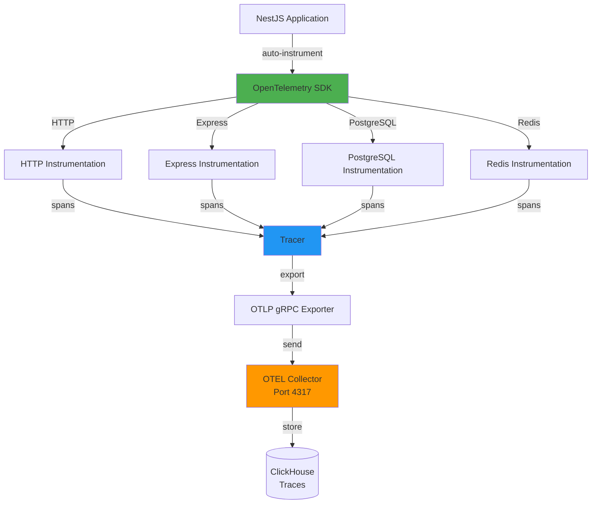
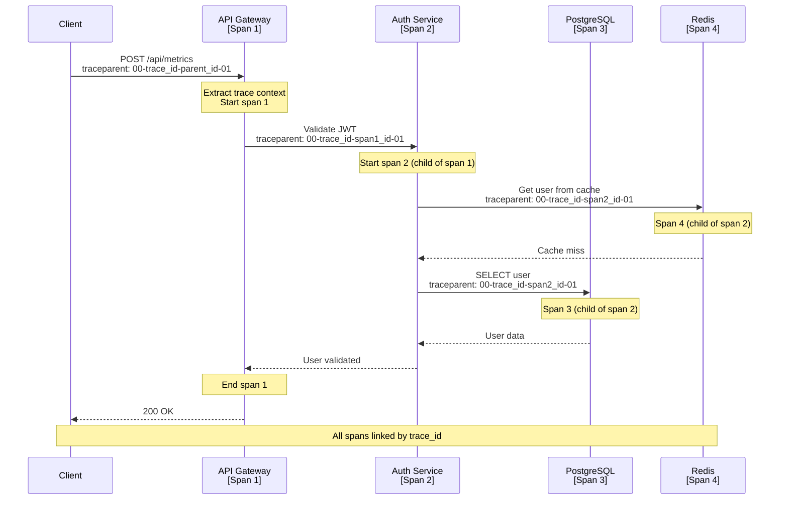

# Shared Module: OpenTelemetry (OTEL)

- **Module**: `shared/otel`
- **Category**: Backend / Shared Modules
- **Status**: Production Ready
- **Priority:** 🔥 HIGH - Observability
- **Version**: 3.10.0

---

## Overview

The **OpenTelemetry module** provides **self-instrumentation** for the TelemetryFlow platform. Features:

- **Auto-instrumentation**: Automatic tracing for HTTP, Express, PostgreSQL, Redis
- **Custom spans**: Manual span creation for business logic
- **OTLP export**: Traces and metrics exported via OTLP gRPC
- **Context propagation**: Distributed tracing across services
- **Performance monitoring**: Real-time performance insights

---

## Architecture



---

## OtelService Implementation

```typescript
// shared/otel/otel.service.ts
import { Injectable, OnModuleDestroy } from '@nestjs/common';
import { NodeSDK } from '@opentelemetry/sdk-node';
import { getNodeAutoInstrumentations } from '@opentelemetry/auto-instrumentations-node';
import { OTLPTraceExporter } from '@opentelemetry/exporter-trace-otlp-grpc';
import { OTLPMetricExporter } from '@opentelemetry/exporter-metrics-otlp-grpc';
import { PeriodicExportingMetricReader } from '@opentelemetry/sdk-metrics';
import { trace, Span, SpanStatusCode } from '@opentelemetry/api';

@Injectable()
export class OtelService implements OnModuleDestroy {
  private sdk: NodeSDK | null = null;
  private initialized = false;

  async initializeOpenTelemetry(): Promise<{ sdk: NodeSDK }> {
    if (this.initialized) {
      console.warn('[OTEL] Already initialized, skipping...');
      return { sdk: this.sdk! };
    }

    const otlpEndpoint = process.env.OTEL_EXPORTER_OTLP_ENDPOINT || 'http://localhost:4317';
    const serviceName = process.env.OTEL_SERVICE_NAME || 'telemetryflow-backend';
    const serviceVersion = process.env.OTEL_SERVICE_VERSION || '3.10.0';
    const environment = process.env.NODE_ENV || 'development';

    // Create resource with service information
    const resource = resourceFromAttributes({
      [ATTR_SERVICE_NAME]: serviceName,
      [ATTR_SERVICE_VERSION]: serviceVersion,
      'deployment.environment': environment,
    });

    // Configure trace exporter (OTLP gRPC)
    const traceExporter = new OTLPTraceExporter({
      url: otlpEndpoint,
    });

    // Configure metrics exporter (OTLP gRPC)
    const metricExporter = new OTLPMetricExporter({
      url: otlpEndpoint,
    });

    // Create metric reader with 60-second export interval
    const metricReader = new PeriodicExportingMetricReader({
      exporter: metricExporter,
      exportIntervalMillis: 60000,
    });

    // Initialize OpenTelemetry SDK
    this.sdk = new NodeSDK({
      resource,
      traceExporter,
      metricReader,
      instrumentations: [
        getNodeAutoInstrumentations({
          '@opentelemetry/instrumentation-fs': {
            enabled: false, // Too verbose
          },
          '@opentelemetry/instrumentation-http': {
            enabled: true,
            ignoreIncomingRequestHook: (request) => {
              const ignorePaths = ['/health', '/metrics'];
              return ignorePaths.some((path) => request.url?.includes(path));
            },
          },
          '@opentelemetry/instrumentation-express': {
            enabled: true,
          },
          '@opentelemetry/instrumentation-pg': {
            enabled: true,
            enhancedDatabaseReporting: true,
          },
          '@opentelemetry/instrumentation-ioredis': {
            enabled: true,
          },
        }),
      ],
    });

    await this.sdk.start();
    this.initialized = true;
    console.log('[OTEL] OpenTelemetry SDK initialized successfully');

    return { sdk: this.sdk };
  }

  getTracer(name: string = 'telemetryflow'): Tracer {
    return trace.getTracer(name);
  }

  recordSpanException(span: Span, error: Error): void {
    if (span) {
      span.recordException(error);
      span.setStatus({
        code: SpanStatusCode.ERROR,
        message: error.message,
      });
    }
  }

  setSpanAttributes(span: Span, attributes: Record<string, any>): void {
    if (span) {
      span.setAttributes(attributes);
    }
  }

  async onModuleDestroy(): Promise<void> {
    if (this.sdk && this.initialized) {
      await this.sdk.shutdown();
      console.log('[OTEL] SDK shut down successfully');
    }
  }
}
```

---

## Initialization

**Bootstrap Initialization:**
```typescript
// main.ts
async function bootstrap() {
  // IMPORTANT: Initialize OTEL first, before any other imports
  const otelService = new OtelService();
  await otelService.initializeOpenTelemetry();

  const app = await NestFactory.create(AppModule);

  // ... rest of application setup

  await app.listen(3000);
}
```

---

## Auto-Instrumentation

**Supported Instrumentations:**

| Library | Instrumentation | Enabled | Notes |
|---------|----------------|---------|-------|
| **HTTP** | `@opentelemetry/instrumentation-http` | ✅ | Traces all HTTP requests |
| **Express** | `@opentelemetry/instrumentation-express` | ✅ | Traces Express routes |
| **NestJS** | `@opentelemetry/instrumentation-nestjs-core` | ✅ | Traces NestJS controllers |
| **PostgreSQL** | `@opentelemetry/instrumentation-pg` | ✅ | Traces database queries |
| **Redis** | `@opentelemetry/instrumentation-ioredis` | ✅ | Traces Redis operations |
| **gRPC** | `@opentelemetry/instrumentation-grpc` | ✅ | Traces gRPC calls |
| **File System** | `@opentelemetry/instrumentation-fs` | ❌ | Too verbose |

---

## Manual Instrumentation

**Create Custom Spans:**
```typescript
import { OtelService } from '@/otel/otel.service';
import { trace, context } from '@opentelemetry/api';

@Injectable()
export class MetricsService {
  constructor(private readonly otelService: OtelService) {}

  async processMetrics(metrics: Metric[]): Promise<void> {
    const tracer = this.otelService.getTracer('metrics-service');

    // Create span
    const span = tracer.startSpan('processMetrics', {
      attributes: {
        'metrics.count': metrics.length,
        'metrics.type': 'gauge',
      },
    });

    try {
      // Run in span context
      await context.with(trace.setSpan(context.active(), span), async () => {
        // Business logic
        await this.validateMetrics(metrics);
        await this.transformMetrics(metrics);
        await this.saveMetrics(metrics);
      });

      // Set success status
      span.setStatus({ code: SpanStatusCode.OK });
    } catch (error) {
      // Record exception
      this.otelService.recordSpanException(span, error);
      throw error;
    } finally {
      // End span
      span.end();
    }
  }
}
```

---

## Distributed Tracing



---

## Configuration

**Environment Variables:**
```bash
# OpenTelemetry Configuration
OTEL_EXPORTER_OTLP_ENDPOINT=http://localhost:4317
OTEL_SERVICE_NAME=telemetryflow-backend
OTEL_SERVICE_VERSION=3.10.0
NODE_ENV=production

# Sampling (optional)
OTEL_TRACES_SAMPLER=parentbased_traceidratio
OTEL_TRACES_SAMPLER_ARG=0.1  # Sample 10% of traces
```

---

## Trace Context Propagation

**W3C Trace Context:**
```http
GET /api/metrics HTTP/1.1
Host: api.telemetryflow.io
traceparent: 00-0af7651916cd43dd8448eb211c80319c-b7ad6b7169203331-01
tracestate: congo=t61rcWkgMzE

# traceparent format:
# version-trace_id-parent_id-trace_flags
# 00-{trace_id}-{parent_id}-01
```

---

## Semantic Conventions

```typescript
// Use semantic conventions for consistent attributes
import { SEMATTRS_HTTP_METHOD, SEMATTRS_HTTP_STATUS_CODE } from '@opentelemetry/semantic-conventions';

span.setAttributes({
  [SEMATTRS_HTTP_METHOD]: 'POST',
  [SEMATTRS_HTTP_STATUS_CODE]: 200,
  'http.route': '/api/metrics',
  'tenant.id': 'tenant_123',
  'user.id': 'user_456',
});
```

---

## Span Events

```typescript
// Add events to spans
span.addEvent('cache_miss', {
  'cache.key': 'user:123',
  'cache.ttl': 300,
});

span.addEvent('validation_failed', {
  'validation.error': 'Invalid email format',
  'validation.field': 'email',
});
```

---

## Metrics

**OpenTelemetry Metrics:**
```typescript
import { metrics } from '@opentelemetry/api';

const meter = metrics.getMeter('telemetryflow');

// Counter
const requestCounter = meter.createCounter('http.server.requests', {
  description: 'Total HTTP requests',
  unit: '1',
});

requestCounter.add(1, {
  method: 'POST',
  route: '/api/metrics',
  status: 200,
});

// Histogram
const requestDuration = meter.createHistogram('http.server.duration', {
  description: 'HTTP request duration',
  unit: 'ms',
});

requestDuration.record(150, {
  method: 'POST',
  route: '/api/metrics',
});
```

---

## Performance Impact

**Overhead:**
- Auto-instrumentation: ~2-5% CPU overhead
- Manual spans: ~0.1-0.5ms per span
- Export: Async, minimal blocking

**Optimization:**
- Use sampling for high-traffic endpoints
- Disable verbose instrumentations (fs)
- Batch export for better performance

---

## Troubleshooting

**Common Issues:**

1. **No traces appearing:**
   - Check OTLP endpoint is reachable
   - Verify OTEL_EXPORTER_OTLP_ENDPOINT is correct
   - Check collector logs

2. **High memory usage:**
   - Reduce sampling rate
   - Increase export interval
   - Disable unnecessary instrumentations

3. **Missing context propagation:**
   - Ensure traceparent header is forwarded
   - Check async context is preserved
   - Use `context.with()` for manual spans

---

## Related Modules

- **400-telemetry.md** - OTLP ingestion (receives traces)
- **logger.md** - Winston logger with trace context
- **clickhouse.md** - Trace storage

---

- **Last Updated**: December 12, 2025
- **Maintained By**: DevOpsCorner Indonesia
