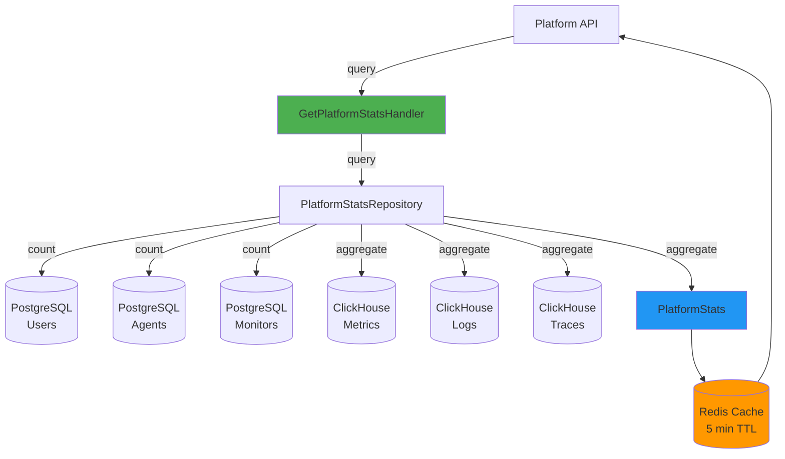

# Shared Module: Platform Utilities

- **Module**: `shared/platform`
- **Category**: Backend / Shared Modules
- **Status**: Production Ready
- **Priority:** 🔥 MEDIUM - Platform Statistics
- **Version**: 3.10.0

---

## Overview

The **Platform Utilities module** provides **platform-wide statistics** and **health metrics**. Features:

- **Platform statistics**: Real-time platform metrics
- **Telemetry counts**: Total traces, logs, metrics
- **Resource counts**: Users, agents, monitors
- **Health aggregation**: System-wide health status
- **Performance metrics**: Platform performance insights

---

## Architecture



---

## Domain Model

```typescript
// shared/platform/domain/aggregates/PlatformStats.ts
export interface TelemetryStats {
  traces: number;
  logs: number;
  metrics: number;
}

export interface PlatformInfo {
  users: number;
  agents: number;
  uptime_checks: number;
}

export class PlatformStats {
  private readonly telemetry: TelemetryStats;
  private readonly platform: PlatformInfo;
  private readonly timestamp: Date;

  constructor(
    telemetry: TelemetryStats,
    platform: PlatformInfo,
    timestamp?: Date,
  ) {
    this.telemetry = telemetry;
    this.platform = platform;
    this.timestamp = timestamp || new Date();
  }

  getTelemetryStats(): TelemetryStats {
    return { ...this.telemetry };
  }

  getPlatformInfo(): PlatformInfo {
    return { ...this.platform };
  }

  getTimestamp(): Date {
    return this.timestamp;
  }

  getTotalTelemetryCount(): number {
    return this.telemetry.traces + this.telemetry.logs + this.telemetry.metrics;
  }

  toJSON() {
    return {
      telemetry: this.telemetry,
      platform: this.platform,
      timestamp: this.timestamp.toISOString(),
    };
  }
}
```

---

## Query Handler

```typescript
// shared/platform/application/handlers/GetPlatformStats.handler.ts
@Injectable()
export class GetPlatformStatsHandler {
  constructor(
    private readonly repository: PlatformStatsRepository,
    private readonly cacheService: CacheService,
  ) {}

  async execute(query: GetPlatformStatsQuery): Promise<PlatformStats> {
    // Check cache first
    const cached = await this.cacheService.get<PlatformStats>('platform:stats');
    if (cached) {
      return cached;
    }

    // Fetch fresh stats
    const stats = await this.repository.getPlatformStats();

    // Cache for 5 minutes
    await this.cacheService.set('platform:stats', stats, 300);

    return stats;
  }
}
```

---

## Repository

```typescript
// shared/platform/infrastructure/persistence/PlatformStatsRepository.ts
@Injectable()
export class PlatformStatsRepository implements IPlatformStatsRepository {
  constructor(
    @InjectRepository(UserEntity)
    private readonly userRepo: Repository<UserEntity>,
    @InjectRepository(AgentEntity)
    private readonly agentRepo: Repository<AgentEntity>,
    @InjectRepository(MonitorEntity)
    private readonly monitorRepo: Repository<MonitorEntity>,
    private readonly clickhouse: ClickHouseService,
  ) {}

  async getPlatformStats(): Promise<PlatformStats> {
    // Fetch platform counts from PostgreSQL
    const [users, agents, monitors] = await Promise.all([
      this.userRepo.count({ where: { is_active: true } }),
      this.agentRepo.count({ where: { status: 'ACTIVE' } }),
      this.monitorRepo.count({ where: { is_active: true } }),
    ]);

    // Fetch telemetry counts from ClickHouse
    const telemetryStats = await this.getTelemetryStats();

    return new PlatformStats(
      telemetryStats,
      {
        users,
        agents,
        uptime_checks: monitors,
      },
      new Date(),
    );
  }

  private async getTelemetryStats(): Promise<TelemetryStats> {
    // Query ClickHouse for telemetry counts
    const metricsCount = await this.clickhouse.query<{ count: number }>(
      'SELECT COUNT(*) as count FROM telemetry_metrics',
    );

    const logsCount = await this.clickhouse.query<{ count: number }>(
      'SELECT COUNT(*) as count FROM telemetry_logs',
    );

    const tracesCount = await this.clickhouse.query<{ count: number }>(
      'SELECT COUNT(*) as count FROM telemetry_traces',
    );

    return {
      metrics: metricsCount[0]?.count || 0,
      logs: logsCount[0]?.count || 0,
      traces: tracesCount[0]?.count || 0,
    };
  }
}
```

---

## API Endpoint

| Method | Endpoint | Description | Permission |
|--------|----------|-------------|------------|
| `GET` | `/api/v1/platform/stats` | Get platform statistics | `PLATFORM_READ` |

---

## Request/Response Example

**Request:**
```http
GET /api/v1/platform/stats
Authorization: Bearer <jwt_token>
```

**Response:**
```json
{
  "telemetry": {
    "traces": 1500000,
    "logs": 5000000,
    "metrics": 10000000
  },
  "platform": {
    "users": 150,
    "agents": 45,
    "uptime_checks": 230
  },
  "timestamp": "2025-12-12T10:00:00Z"
}
```

---

## Controller

```typescript
// shared/platform/presentation/controllers/PlatformStats.controller.ts
@Controller('platform')
export class PlatformStatsController {
  constructor(private readonly commandBus: CommandBus) {}

  @Get('stats')
  @RequirePermissions('PLATFORM_READ')
  async getStats(): Promise<PlatformStatsResponse> {
    const query = new GetPlatformStatsQuery();
    const stats = await this.commandBus.execute(query);

    return PlatformStatsResponseMapper.toDTO(stats);
  }
}
```

---

## Caching Strategy

```typescript
// Cache platform stats for 5 minutes
const CACHE_KEY = 'platform:stats';
const CACHE_TTL = 300; // 5 minutes

// Cache invalidation on entity changes
const invalidateEvents = [
  'UserCreatedEvent',
  'UserDeletedEvent',
  'AgentCreatedEvent',
  'AgentDeletedEvent',
  'MonitorCreatedEvent',
  'MonitorDeletedEvent',
  'MetricReceivedEvent', // High frequency - invalidate on batch
];
```

---

## Performance Optimization

**Materialized Views in ClickHouse:**
```sql
-- Pre-aggregate telemetry counts
CREATE MATERIALIZED VIEW telemetry_counts_hourly
ENGINE = SummingMergeTree()
ORDER BY (hour)
AS SELECT
  toStartOfHour(timestamp) as hour,
  'metrics' as type,
  count() as count
FROM telemetry_metrics
GROUP BY hour

UNION ALL

SELECT
  toStartOfHour(timestamp) as hour,
  'logs' as type,
  count() as count
FROM telemetry_logs
GROUP BY hour

UNION ALL

SELECT
  toStartOfHour(timestamp) as hour,
  'traces' as type,
  count() as count
FROM telemetry_traces
GROUP BY hour;

-- Query materialized view instead of raw tables
SELECT
  type,
  sum(count) as total
FROM telemetry_counts_hourly
WHERE hour >= now() - INTERVAL 30 DAY
GROUP BY type;
```

---

## Health Endpoint

```typescript
@Get('health')
async getHealth(): Promise<HealthResponse> {
  const checks = await Promise.all([
    this.checkPostgreSQL(),
    this.checkClickHouse(),
    this.checkRedis(),
    this.checkNATS(),
  ]);

  const isHealthy = checks.every((check) => check.status === 'up');

  return {
    status: isHealthy ? 'healthy' : 'degraded',
    timestamp: new Date().toISOString(),
    checks: {
      postgresql: checks[0],
      clickhouse: checks[1],
      redis: checks[2],
      nats: checks[3],
    },
  };
}
```

---

## Monitoring Metrics

```typescript
// Platform metrics tracked
- platform.users.total (gauge)
- platform.users.active (gauge)
- platform.agents.total (gauge)
- platform.agents.active (gauge)
- platform.monitors.total (gauge)
- platform.telemetry.metrics.total (counter)
- platform.telemetry.logs.total (counter)
- platform.telemetry.traces.total (counter)
- platform.stats.query.duration (histogram)
```

---

## Related Modules

- **100-core.md** - User and organization management
- **1100-agents.md** - Agent management
- **500-monitoring.md** - Monitor management
- **clickhouse.md** - Telemetry data storage
- **cache.md** - Statistics caching

---

- **Last Updated**: December 12, 2025
- **Maintained By**: DevOpsCorner Indonesia
