# Shared Module: Queue (BullMQ Job Processing)

- **Version:** 1.1.1-CE
- **Last Updated:** December 12, 2025
- **Status:** ✅ Production Ready
- **Priority:** 🔥 CRITICAL - Async Processing Infrastructure

---

## Module Overview

```mermaid
graph TB
    subgraph "Queue Module"
        A[BullMQ Queues<br/>5 Specialized Queues]
        B[Worker Pool<br/>Concurrent Processing]
        C[Job Retry Logic<br/>Exponential Backoff]
        D[Queue Management<br/>Admin & Monitoring]
    end

    subgraph "Key Features"
        E[✅ 5 Dedicated Queues]
        F[✅ 1000+ jobs/sec]
        G[✅ Priority Scheduling]
        H[✅ Dead Letter Queue]
    end

    A --> E
    B --> F
    C --> G
    D --> H

    style A fill:#ff6b6b
    style B fill:#4ecdc4
    style C fill:#45b7d1
    style D fill:#f9ca24
```



**Purpose:** High-performance async job processing system using BullMQ for OTLP ingestion, alert evaluation, aggregations, cleanup, and notifications.

**Location:** `backend/src/shared/queue/`

---

## Architecture

### Queue Structure


### Queue Service Architecture


---

## Queue Types & Configuration

### 1. OTLP Ingestion Queue


**Configuration:**
```typescript
{
  name: 'otlp-ingestion',
  concurrency: 10,           // 10 parallel workers
  rateLimit: {
    max: 1000,               // 1000 jobs
    duration: 1000           // per second
  },
  priority: QueuePriority.HIGH,
  attempts: 3,
  backoff: {
    type: 'exponential',
    delay: 1000              // 1s, 2s, 4s
  },
  removeOnComplete: {
    count: 100,              // Keep last 100
    age: 3600                // Keep for 1 hour
  },
  removeOnFail: {
    count: 500,              // Keep last 500 failed
    age: 86400               // Keep for 24 hours
  }
}
```

**Job Data:**
```typescript
interface OtlpIngestionJobData {
  type: 'metrics' | 'logs' | 'traces' | 'profiler' | 'exemplars';
  workspaceId: string;
  tenantId: string;
  data: any;  // OTLP payload
  timestamp: Date;
}
```

### 2. Alert Evaluation Queue


**Configuration:**
```typescript
{
  name: 'alert-evaluation',
  concurrency: 5,            // 5 parallel workers
  rateLimit: {
    max: 100,                // 100 jobs
    duration: 1000           // per second
  },
  priority: QueuePriority.HIGH,
  attempts: 3,
  backoff: {
    type: 'exponential',
    delay: 2000              // 2s, 4s, 8s
  }
}
```

**Job Data:**
```typescript
interface AlertEvaluationJobData {
  ruleId: string;
  tenantId: string;
  timestamp: Date;
}
```

### 3. Aggregation Queue

**Configuration:**
```typescript
{
  name: 'aggregation',
  concurrency: 3,            // 3 parallel workers
  rateLimit: {
    max: 50,                 // 50 jobs
    duration: 1000           // per second
  },
  priority: QueuePriority.MEDIUM,
  attempts: 3,
  backoff: {
    type: 'exponential',
    delay: 5000              // 5s, 10s, 20s
  }
}
```

**Job Data:**
```typescript
interface AggregationJobData {
  type: 'hourly' | 'daily';
  tableName: string;
  startTime: Date;
  endTime: Date;
  tenantId?: string;
}
```

### 4. Cleanup Queue

**Configuration:**
```typescript
{
  name: 'cleanup',
  concurrency: 2,            // 2 parallel workers
  rateLimit: {
    max: 10,                 // 10 jobs
    duration: 1000           // per second
  },
  priority: QueuePriority.LOW,
  attempts: 2,
  backoff: {
    type: 'exponential',
    delay: 10000             // 10s, 20s
  }
}
```

**Job Data:**
```typescript
interface CleanupJobData {
  dataType?: string;
  tableName: string;
  retentionDays: number;
  tenantId?: string;
}
```

### 5. Notification Queue

**Configuration:**
```typescript
{
  name: 'notification',
  concurrency: 5,            // 5 parallel workers
  rateLimit: {
    max: 100,                // 100 jobs
    duration: 1000           // per second
  },
  priority: QueuePriority.MEDIUM,
  attempts: 5,               // More retries for notifications
  backoff: {
    type: 'exponential',
    delay: 3000              // 3s, 6s, 12s, 24s, 48s
  },
  removeOnFail: {
    count: 500,
    age: 172800              // Keep for 48 hours
  }
}
```

**Job Data:**
```typescript
interface NotificationJobData {
  alertRuleId?: string;
  alertHistoryId?: string;
  channels?: string[];
  type?: 'email' | 'slack' | 'webhook' | 'audit_event';
  to?: string;
  subject?: string;
  message?: string;
  severity?: string;
  metadata?: Record<string, any>;
}
```

---

## Queue Priority System


| Queue | Priority | Justification |
|-------|----------|---------------|
| **OTLP Ingestion** | HIGH (2) | Real-time data ingestion, core functionality |
| **Alert Evaluation** | HIGH (2) | Time-sensitive, user-facing alerts |
| **Aggregation** | MEDIUM (3) | Can tolerate slight delay |
| **Notification** | MEDIUM (3) | Important but not time-critical |
| **Cleanup** | LOW (4) | Background task, can run during off-peak |

---

## Retry Strategy

### Exponential Backoff

```mermaid
graph LR
    A[Job Fails] --> B{Attempt 1}
    B -->|Wait 1s| C{Attempt 2}
    C -->|Wait 2s| D{Attempt 3}
    D -->|Wait 4s| E[Move to Failed Queue]

    B -->|Success| F[Complete ✅]
    C -->|Success| F
    D -->|Success| F

    style F fill:#27ae60
    style E fill:#e74c3c
```



**Backoff Configuration:**

| Queue | Initial Delay | Max Attempts | Total Wait |
|-------|---------------|--------------|------------|
| **OTLP Ingestion** | 1s | 3 | 7s |
| **Alert Evaluation** | 2s | 3 | 14s |
| **Aggregation** | 5s | 3 | 35s |
| **Cleanup** | 10s | 2 | 30s |
| **Notification** | 3s | 5 | 93s |

---

## Implementation

### Queue Service Code

```typescript
// queue.service.ts
@Injectable()
export class QueueService implements OnModuleInit, OnModuleDestroy {
  private queues: Map<QueueName, Queue> = new Map();
  private workers: Map<QueueName, Worker> = new Map();
  private readonly connection = getQueueConnectionConfig();

  async onModuleInit() {
    setImmediate(async () => {
      await this.initializeQueues();
    });
  }

  /**
   * Initialize all queues
   */
  private async initializeQueues(): Promise<void> {
    for (const queueName of Object.values(QueueName)) {
      const queue = new Queue(queueName, {
        connection: this.connection,
        defaultJobOptions: defaultJobOptions[queueName],
      });

      await queue.waitUntilReady();
      this.queues.set(queueName, queue);
      this.logger.log(`✓ Queue initialized: ${queueName}`);
    }
  }

  /**
   * Register a worker for a queue
   */
  registerWorker(
    queueName: QueueName,
    processor: (job: Job) => Promise<any>,
  ): void {
    const config = defaultWorkerConfig[queueName];

    const worker = new Worker(queueName, processor, {
      connection: this.connection,
      concurrency: config.concurrency,
      limiter: config.limiter,
    });

    // Worker event handlers
    worker.on('completed', (job) => {
      this.logger.debug(`Job completed: ${queueName}/${job.id}`);
    });

    worker.on('failed', (job, err) => {
      this.logger.error(`Job failed: ${queueName}/${job?.id} - ${err.message}`);
    });

    this.workers.set(queueName, worker);
    this.logger.log(`✓ Worker registered: ${queueName} (concurrency: ${config.concurrency})`);
  }

  /**
   * Add OTLP ingestion job
   */
  async addOtlpIngestionJob(
    data: OtlpIngestionJobData,
    options?: JobsOptions,
  ): Promise<Job> {
    const queue = this.queues.get(QueueName.OTLP_INGESTION);
    return queue.add('ingest', data, options);
  }

  /**
   * Get queue statistics
   */
  async getQueueStats(queueName: QueueName) {
    const queue = this.queues.get(queueName);

    const [waiting, active, completed, failed, delayed] = await Promise.all([
      queue.getWaitingCount(),
      queue.getActiveCount(),
      queue.getCompletedCount(),
      queue.getFailedCount(),
      queue.getDelayedCount(),
    ]);

    return {
      queueName,
      waiting,
      active,
      completed,
      failed,
      delayed,
      total: waiting + active + completed + failed + delayed,
    };
  }
}
```

### Worker Registration

```typescript
// otlp-ingestion.processor.ts
@Processor(QueueName.OTLP_INGESTION)
export class OtlpIngestionProcessor {
  @Process('ingest')
  async processOtlpIngestion(job: Job<OtlpIngestionJobData>) {
    const { type, workspaceId, tenantId, data } = job.data;

    // Transform OTLP data to domain model
    const metrics = await this.otlpMapper.mapToDomain(data, tenantId);

    // Store in ClickHouse
    await this.metricsRepository.bulkInsert(metrics);

    // Publish events
    await this.eventBus.publish(new MetricsIngested(metrics));

    return { processed: metrics.length };
  }
}
```

---

## Performance Metrics

### Throughput

```mermaid
graph LR
    subgraph "Queue Throughput"
        A[OTLP: 1000 jobs/sec]
        B[Alerts: 100 jobs/sec]
        C[Aggregation: 50 jobs/sec]
        D[Cleanup: 10 jobs/sec]
        E[Notification: 100 jobs/sec]
    end

    subgraph "Total Capacity"
        F[1260 jobs/sec ⚡]
    end

    A --> F
    B --> F
    C --> F
    D --> F
    E --> F

    style F fill:#27ae60
```



| Queue | Workers | Rate Limit | Actual Throughput |
|-------|---------|------------|-------------------|
| **OTLP Ingestion** | 10 | 1000/sec | 800-1200/sec |
| **Alert Evaluation** | 5 | 100/sec | 80-120/sec |
| **Aggregation** | 3 | 50/sec | 40-60/sec |
| **Cleanup** | 2 | 10/sec | 5-10/sec |
| **Notification** | 5 | 100/sec | 50-100/sec |

### Latency

| Queue | Job Wait | Processing | Total Latency |
|-------|----------|------------|---------------|
| **OTLP Ingestion** | 10ms | 100ms | 110ms |
| **Alert Evaluation** | 50ms | 150ms | 200ms |
| **Aggregation** | 200ms | 5s | 5.2s |
| **Cleanup** | 1s | 10s | 11s |
| **Notification** | 100ms | 2s | 2.1s |

---

## Queue Management

### Admin Endpoints

| Endpoint | Method | Description |
|----------|--------|-------------|
| `/admin/queues` | GET | List all queues with stats |
| `/admin/queues/:name/stats` | GET | Get queue statistics |
| `/admin/queues/:name/pause` | POST | Pause queue |
| `/admin/queues/:name/resume` | POST | Resume queue |
| `/admin/queues/:name/clean` | POST | Clean old jobs |
| `/admin/queues/:name/failed` | GET | List failed jobs |
| `/admin/queues/:name/retry/:jobId` | POST | Retry failed job |

### Queue Statistics Response

```json
{
  "queues": [
    {
      "queueName": "otlp-ingestion",
      "waiting": 45,
      "active": 10,
      "completed": 125849,
      "failed": 123,
      "delayed": 0,
      "total": 126027
    }
  ],
  "summary": {
    "totalQueues": 5,
    "totalJobs": 543210,
    "totalWaiting": 150,
    "totalActive": 25,
    "totalCompleted": 540000,
    "totalFailed": 3035
  }
}
```

---

## Configuration

### Environment Variables

```bash
# Redis Configuration (Queue Backend)
REDIS_HOST=localhost
REDIS_PORT=6379
REDIS_PASSWORD=
REDIS_QUEUE_DB=2  # Separate DB for queues

# Queue Configuration
QUEUE_OTLP_CONCURRENCY=10
QUEUE_OTLP_RATE_LIMIT=1000
QUEUE_ALERT_CONCURRENCY=5
QUEUE_ALERT_RATE_LIMIT=100
```

### Redis Connection Config

```typescript
export function getQueueConnectionConfig(): QueueConnectionConfig {
  return {
    host: process.env.REDIS_HOST || 'localhost',
    port: parseInt(process.env.REDIS_PORT || '6379', 10),
    password: process.env.REDIS_PASSWORD || undefined,
    db: parseInt(process.env.REDIS_QUEUE_DB || '2', 10),
    connectTimeout: 10000,
    maxRetriesPerRequest: 3,
    enableOfflineQueue: false,
    lazyConnect: true,
  };
}
```

---

## Best Practices

### When to Use Queues

✅ **Good Use Cases:**
- Long-running operations (> 1 second)
- External API calls (email, webhooks)
- Batch processing
- Rate-limited operations
- Retryable operations

❌ **Avoid Queues For:**
- Simple, fast operations (< 100ms)
- Real-time responses required
- Operations requiring immediate feedback
- Stateful workflows

### Queue Design Patterns

```typescript
// ✅ Good: Specific job types
await queueService.addOtlpIngestionJob({
  type: 'metrics',
  workspaceId: 'ws-123',
  tenantId: 'tenant-123',
  data: otlpPayload,
  timestamp: new Date()
});

// ❌ Bad: Generic job type
await queueService.addJob('process-data', {
  stuff: 'unclear what this is'
});
```

---

## Related Modules


---

## Testing

### Unit Tests
- `QueueService.spec.ts` - Service logic
- `queue.config.spec.ts` - Configuration

### Integration Tests
- `queue-processing.spec.ts` - Job processing
- `queue-retry.spec.ts` - Retry logic

---

- **File Location:** `./backend/shared/queue.md`
- **Maintained By:** DevOpsCorner Indonesia
