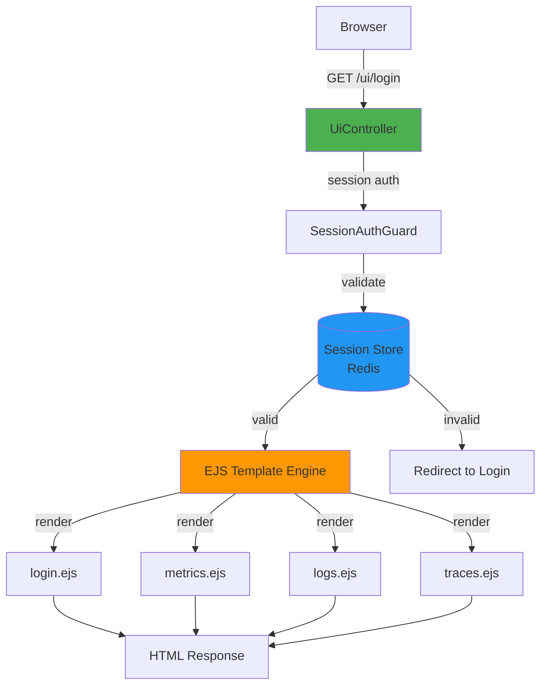

# Shared Module: UI Templates

- **Module**: `shared/ui`
- **Category**: Backend / Shared Modules
- **Status**: Production Ready
- **Priority:** 🔥 MEDIUM - Web Interface
- **Version**: 1.1.2-CE

---

## Overview

The **UI Templates module** provides **server-side rendered views** using **EJS templates** for the TelemetryFlow web interface. Features:

- **EJS templates**: Server-side rendering for dashboard pages
- **Session authentication**: Session-based auth (not JWT)
- **Responsive layouts**: Mobile-friendly dashboard
- **Multi-page dashboard**: Metrics, Logs, Traces, Alerts, Settings, Admin
- **Login/Register**: Authentication pages

---

## Architecture



---

## UiController

```typescript
// shared/ui/ui.controller.ts
@Controller('ui')
@UseGuards(SessionAuthGuard)
export class UiController {
  constructor(
    private readonly authService: AuthService,
    @InjectRepository(UserEntity)
    private userRepository: Repository<UserEntity>,
  ) {}

  /**
   * Login page (public)
   */
  @Public()
  @Get('login')
  @Render('pages/login')
  loginPage(@Session() session: Record<string, any>) {
    const error = session.error || null;
    const success = session.success || null;
    session.error = null;
    session.success = null;

    return {
      error,
      success,
      title: 'Login',
      config: this.getConfig(),
    };
  }

  /**
   * Login form submission
   */
  @Public()
  @Post('login')
  async login(
    @Body() body: { email: string; password: string },
    @Res() res: Response,
    @Session() session: Record<string, any>,
  ) {
    try {
      const result = await this.authService.login(body.email, body.password);
      session.token = result.access_token;
      session.user = result.user;
      return res.redirect('/ui/dashboard/metrics');
    } catch (error) {
      session.error = 'Invalid email or password';
      return res.redirect('/ui/login');
    }
  }

  /**
   * Metrics dashboard (protected)
   */
  @Public()  // Bypass JWT, SessionAuthGuard still applies
  @Get('dashboard/metrics')
  @Render('pages/metrics')
  metricsPage(@Session() session: Record<string, any>) {
    return {
      user: session.user,
      token: session.token,
      title: 'Metrics',
      config: this.getConfig(),
    };
  }

  /**
   * Logs dashboard (protected)
   */
  @Public()
  @Get('dashboard/logs')
  @Render('pages/logs')
  logsPage(@Session() session: Record<string, any>) {
    return {
      user: session.user,
      token: session.token,
      title: 'Logs',
      config: this.getConfig(),
    };
  }

  /**
   * Traces dashboard (protected)
   */
  @Public()
  @Get('dashboard/traces')
  @Render('pages/traces')
  tracesPage(@Session() session: Record<string, any>) {
    return {
      user: session.user,
      token: session.token,
      title: 'Traces',
      config: this.getConfig(),
    };
  }
}
```

---

## Session Management

**Session Configuration:**
```typescript
// app.module.ts
import * as session from 'express-session';
import * as RedisStore from 'connect-redis';
import { createClient } from 'redis';

const redisClient = createClient({
  host: process.env.REDIS_HOST || 'localhost',
  port: parseInt(process.env.REDIS_PORT) || 6379,
});

app.use(
  session({
    store: new RedisStore({ client: redisClient }),
    secret: process.env.SESSION_SECRET || 'secret',
    resave: false,
    saveUninitialized: false,
    cookie: {
      secure: process.env.NODE_ENV === 'production', // HTTPS only in production
      httpOnly: true,
      maxAge: 1000 * 60 * 60 * 24, // 24 hours
      sameSite: 'lax',
    },
  }),
);
```

---

## SessionAuthGuard

```typescript
// presentation/guards/session-auth.guard.ts
@Injectable()
export class SessionAuthGuard implements CanActivate {
  canActivate(context: ExecutionContext): boolean {
    const request = context.switchToHttp().getRequest();
    const session = request.session;

    // Check if user is logged in
    if (!session || !session.user || !session.token) {
      const response = context.switchToHttp().getResponse();
      response.redirect('/ui/login');
      return false;
    }

    return true;
  }
}
```

---

## Routes

| Route | Page | Access | Description |
|-------|------|--------|-------------|
| `GET /ui/login` | Login | Public | Login form |
| `POST /ui/login` | - | Public | Login submission |
| `GET /ui/register` | Register | Public | Registration form |
| `POST /ui/register` | - | Public | Registration submission |
| `GET /ui/logout` | - | Public | Logout |
| `GET /ui/dashboard/metrics` | Metrics | Protected | Metrics dashboard |
| `GET /ui/dashboard/logs` | Logs | Protected | Logs dashboard |
| `GET /ui/dashboard/traces` | Traces | Protected | Traces dashboard |
| `GET /ui/dashboard/alerts` | Alerts | Protected | Alerts dashboard |
| `GET /ui/dashboard/custom` | Dashboards | Protected | Custom dashboards |
| `GET /ui/settings/account` | Account | Protected | Account settings |
| `GET /ui/admin/users` | Users | Protected | User management |
| `GET /ui/admin/roles` | Roles | Protected | Role management |

---

## EJS Templates

**Template Structure:**
```
views/
├── layouts/
│   ├── base.ejs         # Base layout with header/footer
│   └── dashboard.ejs    # Dashboard layout with sidebar
├── partials/
│   ├── header.ejs       # Header navigation
│   ├── sidebar.ejs      # Dashboard sidebar
│   └── footer.ejs       # Footer
├── pages/
│   ├── login.ejs        # Login page
│   ├── register.ejs     # Registration page
│   ├── metrics.ejs      # Metrics dashboard
│   ├── logs.ejs         # Logs dashboard
│   ├── traces.ejs       # Traces dashboard
│   └── alerts.ejs       # Alerts dashboard
```

**Base Layout Example:**
```html
<!-- views/layouts/base.ejs -->
<!DOCTYPE html>
<html lang="en">
<head>
  <meta charset="UTF-8">
  <meta name="viewport" content="width=device-width, initial-scale=1.0">
  <title><%= title %> - TelemetryFlow</title>
  <link rel="stylesheet" href="/css/app.css">
</head>
<body>
  <%- include('../partials/header') %>

  <main>
    <%- body %>
  </main>

  <%- include('../partials/footer') %>

  <script src="/js/app.js"></script>
</body>
</html>
```

**Metrics Dashboard Example:**
```html
<!-- views/pages/metrics.ejs -->
<% layout('layouts/dashboard') %>

<div class="dashboard-header">
  <h1>Metrics</h1>
  <p>Real-time metrics monitoring</p>
</div>

<div class="metrics-grid">
  <div class="metric-card">
    <h3>CPU Usage</h3>
    <div id="cpu-chart"></div>
  </div>

  <div class="metric-card">
    <h3>Memory Usage</h3>
    <div id="memory-chart"></div>
  </div>

  <div class="metric-card">
    <h3>Network I/O</h3>
    <div id="network-chart"></div>
  </div>
</div>

<script>
  // Use token from session for API calls
  const token = '<%= token %>';
  const user = JSON.parse('<%- JSON.stringify(user) %>');

  // Fetch metrics data
  fetch('/api/v1/metrics', {
    headers: {
      'Authorization': `Bearer ${token}`,
      'X-Tenant-ID': user.tenantId,
    }
  })
  .then(res => res.json())
  .then(data => {
    // Render charts
    renderCPUChart(data.cpu);
    renderMemoryChart(data.memory);
    renderNetworkChart(data.network);
  });
</script>
```

---

## Frontend Configuration

```typescript
// config/frontend.config.ts
export class FrontendConfig {
  static getConfig() {
    return {
      apiUrl: process.env.API_URL || 'http://localhost:3000',
      wsUrl: process.env.WS_URL || 'ws://localhost:3000',
      appName: 'TelemetryFlow',
      version: '1.1.2-CE',
      environment: process.env.NODE_ENV || 'development',
    };
  }
}
```

---

## Error Pages

**Error Test Routes:**
```typescript
@Public()
@Get('error/404')
error404() {
  throw new HttpException(
    'Page Not Found - The requested page does not exist',
    HttpStatus.NOT_FOUND,
  );
}

@Public()
@Get('error/500')
error500() {
  throw new HttpException(
    'Internal Server Error - Something went wrong',
    HttpStatus.INTERNAL_SERVER_ERROR,
  );
}
```

**Error Template:**
```html
<!-- views/pages/error.ejs -->
<div class="error-page">
  <h1><%= statusCode %></h1>
  <h2><%= message %></h2>
  <p><%= description %></p>
  <a href="/ui/dashboard" class="btn btn-primary">Go to Dashboard</a>
</div>
```

---

## Static Assets

```typescript
// Serve static files
app.useStaticAssets(join(__dirname, '..', 'public'));

// File structure
public/
├── css/
│   ├── app.css
│   └── dashboard.css
├── js/
│   ├── app.js
│   ├── charts.js
│   └── websocket.js
├── images/
│   ├── logo.png
│   └── favicon.ico
```

---

## Related Modules

- **200-auth.md** - Authentication service
- **cache.md** - Session storage (Redis)
- **logger.md** - Request logging

---

- **Last Updated**: January 01st, 2026
- **Maintained By**: DevOpsCorner Indonesia
