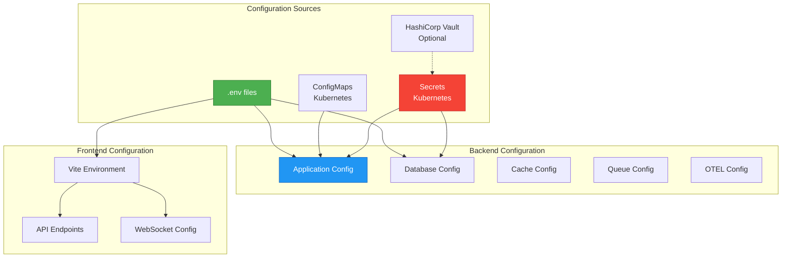

# Environment Configuration Guide

- **Version:** 1.0.0-CE
- **Last Updated:** December 13, 2025
- **Status:** ✅ Production Ready

---

## Table of Contents

1. [Overview](#overview)
2. [Configuration Files](#configuration-files)
3. [Application Configuration](#application-configuration)
4. [Database Configuration](#database-configuration)
5. [Security Configuration](#security-configuration)
6. [Logging Configuration](#logging-configuration)
7. [Caching & Queuing](#caching--queuing)
8. [Telemetry Configuration](#telemetry-configuration)
9. [Email Configuration](#email-configuration)
10. [Docker Compose Configuration](#docker-compose-configuration)
11. [Environment-Specific Settings](#environment-specific-settings)
12. [Security Checklist](#security-checklist)

---

## Overview

**TelemetryFlow Platform** uses environment variables for configuration across all components. This guide covers all configuration options for development, staging, and production environments.

###  Configuration Architecture



---

## Configuration Files

### File Locations

| File | Location | Purpose |
|------|----------|---------|
| `.env.example` | `/backend/.env.example` | Backend configuration template |
| `.env` | `/backend/.env` | Backend environment variables (DO NOT commit) |
| `.env.example` | `/frontend/.env.example` | Frontend configuration template |
| `.env` | `/frontend/.env` | Frontend environment variables (DO NOT commit) |
| `docker-compose.yml` | `/docker-compose.yml` | Docker services configuration |

### Creating Configuration Files

```bash
# Backend
cd backend
cp .env.example .env
# Edit .env with your values
vim .env

# Frontend
cd frontend
cp .env.example .env
# Edit .env with your values
vim .env
```

---

## Application Configuration

### Basic Settings

```bash
#================================================================================================
# APPLICATION CONFIGURATION
#================================================================================================
NODE_ENV=development              # Environment: development | staging | production
PORT=3100                         # Backend API port
FRONTEND_PORT=3101                # Frontend dev server port
LOG_LEVEL=info                    # Logging level: error | warn | info | debug | verbose
TZ="UTC"                          # Timezone (UTC recommended for consistency)
```

### CORS Configuration

```bash
# 🔒 SECURITY: Configure allowed origins for Cross-Origin Resource Sharing
#
# Development: Use * to allow all origins
# Production: MUST specify comma-separated list of trusted origins (no wildcards)
#
# Examples:
#   Development:  CORS_ORIGIN=*
#   Production:   CORS_ORIGIN=https://app.telemetryflow.id,https://dashboard.telemetryflow.id
#   Staging:      CORS_ORIGIN=https://staging.telemetryflow.id
CORS_ORIGIN=*
```

### Rate Limiting

```bash
#================================================================================================
# RATE LIMITING CONFIGURATION
#================================================================================================
# Default rate limit for authenticated endpoints (requests per minute)
THROTTLE_TTL=60000                # Time window in milliseconds (60 seconds)
THROTTLE_LIMIT=100                # Max requests per window (100 req/min)

# Ingestion rate limit for OTEL collector endpoints
THROTTLE_INGESTION_TTL=60000      # Time window (60 seconds)
THROTTLE_INGESTION_LIMIT=1000     # Max requests per window (1000 req/min)
```

---

## Database Configuration

### PostgreSQL Configuration

```bash
#================================================================================================
# POSTGRESQL CONFIGURATION
#================================================================================================
# 🔒 SECURITY: Change default credentials for production
#
# Development: Default postgres user acceptable for local testing
# Production: Create dedicated user with restricted permissions, strong password

POSTGRES_HOST=172.150.150.20      # PostgreSQL host (Docker IP or hostname)
POSTGRES_PORT=5432                # PostgreSQL port
POSTGRES_DB=telemetryflow_db      # Database name
POSTGRES_USER=telemetryflow       # Database user
POSTGRES_PASSWORD=telemetryflow123 # Database password (CHANGE IN PRODUCTION!)
```

**Production Security:**
- Use separate read/write users
- Enable SSL/TLS connections
- Restrict network access with `pg_hba.conf`
- Use strong passwords (20+ characters)
- Enable audit logging

### ClickHouse Configuration

```bash
#================================================================================================
# CLICKHOUSE CONFIGURATION
#================================================================================================
# IMPORTANT: ClickHouse configuration is managed in config/clickhouse/
#            - config.xml: Server settings (memory, compression, logging)
#            - users.xml: User accounts and access control
#
# 🔒 SECURITY: Change default database credentials for production
#   Development: Default credentials acceptable for local testing
#   Production:
#     - Create dedicated users in config/clickhouse/users.xml
#     - Use SHA256 password hashing (not plain text)
#     - Separate users for: application, OTLP ingestion, read-only access
#     - Restrict network access to specific IP ranges

CLICKHOUSE_HOST=http://0.0.0.0:8123  # ClickHouse HTTP interface
CLICKHOUSE_DB=telemetryflow_db        # Database name
CLICKHOUSE_USER=default               # Username
CLICKHOUSE_PASSWORD=telemetryflow     # Password (CHANGE IN PRODUCTION!)

# Performance Settings (configured in config/clickhouse/config.xml):
#   - Max Memory Per Query: 10GB
#   - Max Concurrent Queries: 100
#   - Compression: LZ4 (optimized for telemetry data)
#   - TTL: 90 days (metrics), 30 days (logs), 14 days (traces)
```

**ClickHouse Best Practices:**
- Enable compression (LZ4 for speed, ZSTD for storage)
- Set appropriate TTL for data retention
- Configure max memory per query
- Use materialized views for common queries
- Monitor disk usage and query performance

### Redis Configuration

```
#================================================================================================
# REDIS CONFIGURATION
#================================================================================================
# IMPORTANT: Redis eviction policy is set to 'noeviction' in config/redis/redis.conf
#            This is CRITICAL for BullMQ to prevent job data loss.

REDIS_HOST=172.150.150.30         # Redis host (Docker IP or hostname)
REDIS_PORT=6379                   # Redis port
REDIS_PASSWORD=                   # Password (empty for dev, REQUIRED in production)
REDIS_MAX_MEMORY=512mb            # Memory limit (increase for production)

# Redis Database Separation (0-15 available)
REDIS_SESSION_DB=0                # Session storage
REDIS_CACHE_DB=1                  # L2 cache storage
REDIS_QUEUE_DB=2                  # BullMQ queue storage
```

**Production Redis:**
- Enable password authentication (`requirepass`)
- Set eviction policy to `noeviction` (critical for BullMQ)
- Configure persistence (RDB + AOF)
- Monitor memory usage
- Use Redis Cluster for high availability

### NATS Configuration

```
#================================================================================================
# NATS CONFIGURATION (Event Streaming)
#================================================================================================
# NATS is used for real-time event streaming alongside BullMQ
# BullMQ: Reliable processing with retries
# NATS: Real-time broadcasting (<1ms latency)

NATS_URL=nats://localhost:4222    # NATS server URL

# Features:
#   - JetStream enabled for optional persistence
#   - Monitoring available at http://0.0.0.0:8222
#   - Used for: real-time dashboards, alert broadcasts, live telemetry
```

---

## Security Configuration

### JWT & Session

```
#================================================================================================
# JWT & SESSION CONFIGURATION
#================================================================================================
# 🔒 SECURITY CRITICAL: These secrets MUST be changed in production
#
# Requirements:
#   - Minimum 32 characters length
#   - Use cryptographically secure random strings
#   - NEVER commit production secrets to version control
#   - Different secrets for each environment (dev, staging, prod)
#
# Generate secure secrets:
#   npm run security:generate-secrets
#
# Or manually with Node.js:
#   node -e "console.log(require('crypto').randomBytes(32).toString('base64'))"
#   openssl rand -base64 32

JWT_SECRET=your-secret-key-change-in-production-min-32-chars
JWT_EXPIRES_IN=24h                # Token expiration (e.g., 1h, 24h, 7d)

SESSION_SECRET=your-session-secret-change-in-production-32-chars
```

### MFA (Multi-Factor Authentication)

```
#================================================================================================
# MFA (MULTI-FACTOR AUTHENTICATION) CONFIGURATION
#================================================================================================
# MFA Encryption Key - Used to encrypt TOTP secrets stored in database
#
# Requirements:
#   - Minimum 32 characters length
#   - Use cryptographically secure random string
#   - NEVER commit production keys to version control
#   - If key is lost, users will need to re-enroll MFA
#
# Generate secure key:
#   openssl rand -base64 32 | tr -d '/+=' | cut -c -32

MFA_ENCRYPTION_KEY=your-mfa-encryption-key-change-in-production-32-chars
```

---

## Logging Configuration

### Logger Selection

```bash
#================================================================================================
# LOGGING CONFIGURATION (Winston Logging Standardization)
#================================================================================================
# TelemetryFlow supports two logging modes:
#   1. Native NestJS Logger (default) - Simple console logging
#   2. Winston Logger - Advanced logging with multiple transports
#
# Winston provides:
#   - OpenTelemetry trace correlation (traceId, spanId)
#   - Multiple transports (Console, Loki, FluentBit, OpenSearch, ClickHouse)
#   - Structured JSON logging
#   - Log aggregation and search capabilities

# Logger Selection
LOGGER_TYPE=winston               # nestjs | winston

# Console Transport
LOG_PRETTY_PRINT=true             # Pretty print for development, JSON for production
```

### File Transport

```bash
#------------------------------------------------------------------------------------------------
# File Transport (Daily Rotation)
#------------------------------------------------------------------------------------------------
LOG_FILE_ENABLED=false            # Enable file transport (true in production)
LOG_FILE_DIRNAME=logs             # Directory for log files
LOG_FILE_FILENAME=app-%DATE%.log  # Filename pattern (%DATE% = date)
LOG_FILE_DATE_PATTERN=YYYY-MM-DD  # Date pattern for rotation (daily)
LOG_FILE_ZIPPED=true              # Compress old logs with gzip
LOG_FILE_MAX_SIZE=20m             # Max file size before rotation
LOG_FILE_MAX_FILES=14d            # Keep logs for 14 days
LOG_FILE_JSON=true                # Use JSON format
```

### Grafana Loki Integration

```bash
#------------------------------------------------------------------------------------------------
# Grafana Loki Integration (Log Aggregation)
#------------------------------------------------------------------------------------------------
LOKI_ENABLED=false                # Enable Loki transport
LOKI_HOST=http://loki:3100        # Loki server endpoint
LOKI_LABELS_APP=telemetryflow     # App label
LOKI_LABELS_ENV=development       # Environment label
```

### FluentBit Integration

```bash
#------------------------------------------------------------------------------------------------
# FluentBit Integration (Log Forwarding)
#------------------------------------------------------------------------------------------------
FLUENTBIT_ENABLED=false           # Enable FluentBit transport
FLUENTBIT_HOST=fluentbit          # FluentBit server host
FLUENTBIT_PORT=24224              # Forward protocol port
FLUENTBIT_TAG=telemetryflow.logs  # Log tag for routing
```

### OpenSearch Integration

```bash
#------------------------------------------------------------------------------------------------
# OpenSearch Integration (Full-Text Log Search)
#------------------------------------------------------------------------------------------------
OPENSEARCH_ENABLED=false          # Enable OpenSearch transport
OPENSEARCH_NODE=http://opensearch:9200
OPENSEARCH_USERNAME=admin         # Change in production!
OPENSEARCH_PASSWORD=admin         # Change in production!
OPENSEARCH_INDEX=telemetryflow-logs
OPENSEARCH_JAVA_OPTS=-Xms512m -Xmx512m
```

### ClickHouse Logs

```bash
#------------------------------------------------------------------------------------------------
# ClickHouse Integration (High-Performance Log Analytics)
#------------------------------------------------------------------------------------------------
CLICKHOUSE_LOGS_ENABLED=false     # Enable ClickHouse log transport
CLICKHOUSE_LOGS_TABLE=logs        # Table name for application logs
CLICKHOUSE_FLUSH_INTERVAL=2000    # Flush interval in ms
CLICKHOUSE_BUFFER_LIMIT=100       # Buffer size (N logs)
```

---

## Caching & Queuing

### Cache Configuration

```bash
#================================================================================================
# CACHE CONFIGURATION (Multi-Level L1/L2)
#================================================================================================

# L1 Cache (In-Memory) Configuration
CACHE_L1_TTL=60000                # L1 TTL in milliseconds (60 seconds)
CACHE_L1_MAX_SIZE=1000            # Maximum items in L1 cache

# L2 Cache (Redis) Configuration
CACHE_L2_TTL=1800                 # L2 TTL in seconds (30 minutes)

# Cache Feature Flags
CACHE_ENABLED=true                # Enable/disable caching
CACHE_DEBUG=false                 # Enable cache debug logging
```

### Queue Configuration

```bash
#================================================================================================
# QUEUE CONFIGURATION (BullMQ Message Queues)
#================================================================================================

# Queue Worker Concurrency
QUEUE_OTLP_CONCURRENCY=10         # OTLP ingestion workers
QUEUE_ALERT_CONCURRENCY=5         # Alert evaluation workers
QUEUE_AGGREGATION_CONCURRENCY=3   # Aggregation workers
QUEUE_CLEANUP_CONCURRENCY=2       # Cleanup workers
QUEUE_NOTIFICATION_CONCURRENCY=5  # Notification workers

# Queue Rate Limits (jobs per second)
QUEUE_OTLP_RATE_LIMIT=1000        # OTLP ingestion rate limit
QUEUE_ALERT_RATE_LIMIT=100        # Alert evaluation rate limit
QUEUE_AGGREGATION_RATE_LIMIT=50   # Aggregation rate limit

# Queue Retry Configuration
QUEUE_MAX_ATTEMPTS=3              # Maximum retry attempts
QUEUE_BACKOFF_DELAY=1000          # Initial backoff delay in ms

# Queue Job Cleanup
QUEUE_KEEP_COMPLETED=100          # Keep last N completed jobs
QUEUE_KEEP_FAILED=500             # Keep last N failed jobs
QUEUE_COMPLETED_AGE=3600          # Keep completed jobs for N seconds (1 hour)
QUEUE_FAILED_AGE=86400            # Keep failed jobs for N seconds (24 hours)

# Queue Feature Flags
QUEUE_ENABLED=true                # Enable/disable queues
QUEUE_DEBUG=false                 # Enable queue debug logging
```

---

## Telemetry Configuration

### OpenTelemetry

```bash
#================================================================================================
# OPENTELEMETRY CONFIGURATION
#================================================================================================
OTEL_SERVICE_NAME=telemetryflow_platform
SERVICE_VERSION=1.0.0-CE
SERVICE_NAMESPACE=devopscorner
SERVICE_TEAM=platform

# OTEL Collector Endpoint
OTEL_EXPORTER_OTLP_ENDPOINT=http://0.0.0.0:4317
```

### Telemetry Data Configuration

```bash
#================================================================================================
# TELEMETRY DATA CONFIGURATION
#================================================================================================

# Data Retention (in days)
TELEMETRY_METRICS_RETENTION_DAYS=90
TELEMETRY_LOGS_RETENTION_DAYS=30
TELEMETRY_TRACES_RETENTION_DAYS=14

# Aggregation Configuration
TELEMETRY_AGGREGATION_ENABLED=true
TELEMETRY_AGGREGATION_INTERVALS=1m,5m,15m,1h,1d

# Batch Processing
TELEMETRY_BATCH_SIZE=1000         # Records per batch
TELEMETRY_FLUSH_INTERVAL=5000     # Flush interval in ms

# Real-time Streaming
TELEMETRY_REALTIME_TYPES=metrics,logs,traces

# Agent Configuration
AGENT_HEARTBEAT_INTERVAL=60       # Seconds between heartbeats
AGENT_INACTIVE_THRESHOLD=15       # Minutes before marking inactive
AGENT_CLEANUP_DAYS=30             # Days before deleting inactive agents
```

### Default Tenant Configuration

```bash
#================================================================================================
# DEFAULT DEMO CONFIGURATION (OTEL Collector)
#================================================================================================
# Default region, workspace, and tenant for internal OTEL collector
DEFAULT_REGION_CODE=APS3
DEFAULT_WORKSPACE_CODE=TELEMETRYFLOW-POC
DEFAULT_TENANT_CODE=DEVOPSCORNER

# Human-readable names (for reference)
# Region: ap-southeast-3 (Asia Pacific - Jakarta)
# Workspace: telemetryflow-poc
# Tenant: devopscorner

DEFAULT_WORKSPACE_ID=
DEFAULT_TENANT_ID=
```

---

## Email Configuration

```bash
#================================================================================================
# SMTP / EMAIL NOTIFICATION CONFIGURATION
#================================================================================================
# Email notification system for security alerts and account notifications
#
# Enable/Disable Features:
#   SMTP_ENABLED=false (Development: Logs to console)
#   SMTP_ENABLED=true  (Production: Sends actual emails)
#
# SMTP Configuration Examples:
#   Gmail:      host=smtp.gmail.com, port=587, secure=false
#   SendGrid:   host=smtp.sendgrid.net, port=587, secure=false
#   AWS SES:    host=email-smtp.region.amazonaws.com, port=587, secure=false
#   Mailgun:    host=smtp.mailgun.org, port=587, secure=false

SMTP_ENABLED=false
SMTP_HOST=smtp.example.com
SMTP_PORT=587
SMTP_SECURE=false                 # true for port 465, false for other ports
SMTP_USER=
SMTP_PASSWORD=
SMTP_FROM="TelemetryFlow <noreply@telemetryflow.id>"

# Application URL (used in email templates)
APP_URL=http://0.0.0.0:3100
```

---

## Docker Compose Configuration

### Volume Configuration

```bash
#================================================================================================
# DOCKER-COMPOSE CONFIGURATION
#================================================================================================

#------------------------------------------------------------------------------------------------
# Volume Configuration
#------------------------------------------------------------------------------------------------
VOLUMES_DRIVER=local

#------------------------------------------------------------------------------------------------
# Data Paths (for bind mounts)
#------------------------------------------------------------------------------------------------
# Core Services
DATA_POSTGRESQL=/opt/data/docker/telemetryflow-platform/postgresql
DATA_CLICKHOUSE=/opt/data/docker/telemetryflow-platform/clickhouse
DATA_REDIS=/opt/data/docker/telemetryflow-platform/redis

# Monitoring Services
DATA_PROMETHEUS=/opt/data/docker/telemetryflow-platform/prometheus
DATA_OTEL=/opt/data/docker/telemetryflow-platform/otel

# Dev Tools
DATA_PGADMIN=/opt/data/docker/telemetryflow-platform/pgadmin4
DATA_PORTAINER=/opt/data/docker/telemetryflow-platform/portainer
```

### Service Versions

```bash
#------------------------------------------------------------------------------------------------
# Service Versions
#------------------------------------------------------------------------------------------------
# Application
VERSION=latest
NODE_VERSION=22

# Infrastructure
POSTGRES_VERSION=15-alpine
CLICKHOUSE_VERSION=23-alpine
REDIS_VERSION=7-alpine
NATS_VERSION=2.10-alpine

# Monitoring
OTEL_VERSION=0.88.0
PROMETHEUS_VERSION=latest

# Logging Infrastructure
LOKI_VERSION=2.9.0
OPENSEARCH_VERSION=2.11.0
OPENSEARCH_DASHBOARDS_VERSION=2.11.0
FLUENTBIT_VERSION=2.2

# Dev Tools
PGADMIN_VERSION=latest
PORTAINER_VERSION=latest
```

### Container Names

```bash
#------------------------------------------------------------------------------------------------
# Container Names
#------------------------------------------------------------------------------------------------
# Core Services
CONTAINER_BACKEND=telemetryflow_backend
CONTAINER_FRONTEND=telemetryflow_frontend
CONTAINER_POSTGRES=telemetryflow_postgres
CONTAINER_CLICKHOUSE=telemetryflow_clickhouse
CONTAINER_REDIS=telemetryflow_redis
CONTAINER_NATS=telemetryflow_nats

# Monitoring Services
CONTAINER_OTEL=telemetryflow_otel_collector
CONTAINER_PROMETHEUS=telemetryflow_prometheus

# Logging Infrastructure
CONTAINER_LOKI=telemetryflow_loki
CONTAINER_OPENSEARCH=telemetryflow_opensearch
CONTAINER_FLUENTBIT=telemetryflow_fluentbit

# Dev Tools
CONTAINER_PGADMIN=telemetryflow_pgadmin
CONTAINER_PORTAINER=telemetryflow_portainer
```

### Port Mappings

```bash
#------------------------------------------------------------------------------------------------
# Port Mappings
#------------------------------------------------------------------------------------------------
# Core Services
PORT_BACKEND=3100
PORT_FRONTEND=3101
PORT_POSTGRES=5432
PORT_CLICKHOUSE_HTTP=8123
PORT_CLICKHOUSE_TCP=9000
PORT_REDIS=6379
PORT_NATS=4222
PORT_NATS_MONITORING=8222

# Monitoring Services
PORT_OTEL_GRPC=4317
PORT_OTEL_HTTP=4318
PORT_OTEL_METRICS=8888
PORT_OTEL_PROMETHEUS=8889
PORT_OTEL_HEALTH=13133
PORT_PROMETHEUS=9090

# Logging Infrastructure
PORT_LOKI=3110
PORT_OPENSEARCH_HTTP=9200
PORT_OPENSEARCH_DASHBOARDS=5601
PORT_FLUENTBIT_FORWARD=24224
PORT_FLUENTBIT_HTTP=2020

# Dev Tools
PORT_PGADMIN=8114
PORT_PORTAINER=5212
```

### Static IP Addresses

```bash
#------------------------------------------------------------------------------------------------
# Static IP Addresses (Optional - for fixed internal networking)
#------------------------------------------------------------------------------------------------
# Network Subnet: 172.150.0.0/16

# Core Services
CONTAINER_IP_BACKEND=172.150.150.50
CONTAINER_IP_FRONTEND=172.150.150.60
CONTAINER_IP_POSTGRES=172.150.150.20
CONTAINER_IP_CLICKHOUSE=172.150.150.10
CONTAINER_IP_REDIS=172.150.150.30
CONTAINER_IP_NATS=172.150.150.35

# Monitoring Services
CONTAINER_IP_OTEL=172.150.150.70
CONTAINER_IP_PROMETHEUS=172.150.150.40

# Logging Infrastructure
CONTAINER_IP_LOKI=172.150.150.71
CONTAINER_IP_OPENSEARCH=172.150.150.72
CONTAINER_IP_FLUENTBIT=172.150.150.74

# Dev Tools
CONTAINER_IP_PGADMIN=172.150.150.21
CONTAINER_IP_PORTAINER=172.150.150.5
```

---

## Environment-Specific Settings

### Development Environment

```bash
NODE_ENV=development
LOG_LEVEL=debug
LOG_PRETTY_PRINT=true
CORS_ORIGIN=*
SMTP_ENABLED=false
CACHE_DEBUG=true
QUEUE_DEBUG=true
```

### Staging Environment

```bash
NODE_ENV=staging
LOG_LEVEL=info
LOG_PRETTY_PRINT=false
CORS_ORIGIN=https://staging.telemetryflow.id
SMTP_ENABLED=true
CACHE_DEBUG=false
QUEUE_DEBUG=false
# Use strong secrets
JWT_SECRET=<32+ character random string>
SESSION_SECRET=<32+ character random string>
MFA_ENCRYPTION_KEY=<32+ character random string>
```

### Production Environment

```bash
NODE_ENV=production
LOG_LEVEL=warn
LOG_PRETTY_PRINT=false
LOG_FILE_ENABLED=true
CORS_ORIGIN=https://app.telemetryflow.id,https://dashboard.telemetryflow.id
SMTP_ENABLED=true
CACHE_DEBUG=false
QUEUE_DEBUG=false

# Production-grade logging
LOKI_ENABLED=true
OPENSEARCH_ENABLED=true
CLICKHOUSE_LOGS_ENABLED=true

# Strong secrets (REQUIRED!)
JWT_SECRET=<GENERATED-32+-CHARACTER-STRING>
SESSION_SECRET=<GENERATED-32+-CHARACTER-STRING>
MFA_ENCRYPTION_KEY=<GENERATED-32+-CHARACTER-STRING>

# Strong database passwords
POSTGRES_PASSWORD=<STRONG-PASSWORD>
CLICKHOUSE_PASSWORD=<STRONG-PASSWORD>
REDIS_PASSWORD=<STRONG-PASSWORD>
```

---

## Security Checklist

### Production Deployment Security Checklist

Before deploying to production, ensure **ALL** items are checked:

```bash
# [ ] JWT_SECRET changed to 32+ character random string
# [ ] SESSION_SECRET changed to 32+ character random string (different from JWT_SECRET)
# [ ] MFA_ENCRYPTION_KEY changed to 32+ character random string
# [ ] CORS_ORIGIN set to specific trusted domains (no wildcard)
# [ ] POSTGRES_PASSWORD changed from default
# [ ] CLICKHOUSE_PASSWORD changed from default
# [ ] REDIS_PASSWORD set (not empty)
# [ ] PGADMIN_PASSWORD changed from default
# [ ] All database users have restricted permissions
# [ ] HTTPS/TLS enabled at reverse proxy
# [ ] Security headers validated (run: npm run test:security)
# [ ] Application default user passwords changed
# [ ] Environment variables stored securely (secrets manager, not in git)
# [ ] Backup and disaster recovery plan in place
# [ ] Monitoring and alerting configured
# [ ] Security documentation reviewed
```

### Generate Secure Secrets

```bash
# Using Node.js crypto module
node -e "console.log(require('crypto').randomBytes(32).toString('base64'))"

# Using OpenSSL
openssl rand -base64 32

# Using NPM script (if available)
npm run security:generate-secrets
```

### Test Security Configuration

```bash
# Run security tests
npm run test:security

# Validate environment configuration
npm run config:validate
```

---

## Additional Resources

- **Main Documentation:** [README.md](../README.md)
- **Docker Compose Guide:** [DOCKER-COMPOSE.md](DOCKER-COMPOSE.md)
- **Kubernetes Guide:** [KUBERNETES.md](KUBERNETES.md)
- **Production Checklist:** [PRODUCTION-CHECKLIST.md](PRODUCTION-CHECKLIST.md)
- **Security Architecture:** [../architecture/04-SECURITY.md](../architecture/04-SECURITY.md)

---

**Version:** 1.0.0-CE | **Maintained By:** DevOpsCorner Indonesia
