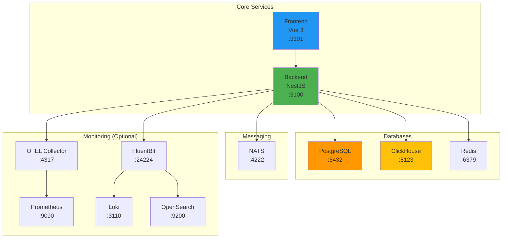

# Docker Compose Deployment

- **Version**: 1.1.1-CE
- **Docker Compose**: 3.4.0
- **Status**: ✅ Production Ready

---

## Table of Contents

1. [Overview](#overview)
2. [Prerequisites](#prerequisites)
3. [Quick Start](#quick-start)
4. [Service Profiles](#service-profiles)
5. [Environment Configuration](#environment-configuration)
6. [Service Architecture](#service-architecture)
7. [Port Mapping](#port-mapping)
8. [Volume Management](#volume-management)
9. [Common Operations](#common-operations)
10. [Troubleshooting](#troubleshooting)

---

## Overview

TelemetryFlow uses **Docker Compose** for local development and production deployment with the following architecture:



---

## Prerequisites

**Required:**
- Docker Engine 20.10+
- Docker Compose 2.0+
- 8GB RAM minimum
- 20GB disk space

**Recommended:**
- Docker Engine 24.0+
- Docker Compose 2.20+
- 16GB RAM
- 50GB SSD storage

**Installation:**
```bash
# Install Docker (Ubuntu/Debian)
curl -fsSL https://get.docker.com | bash

# Install Docker Compose Plugin
sudo apt-get update
sudo apt-get install docker-compose-plugin

# Verify installation
docker --version
docker compose version
```

---

## Quick Start

### 1. Clone Repository

```bash
git clone https://github.com/your-org/telemetryflow-platform.git
cd telemetryflow-platform
```

### 2. Create Environment File

```bash
# Copy example environment file
cp .env.example .env

# Edit environment variables
nano .env
```

**Minimal `.env` for development:**
```bash
# Application
NODE_ENV=development
TZ=UTC

# PostgreSQL
POSTGRES_USER=telemetryflow
POSTGRES_PASSWORD=telemetryflow123
POSTGRES_DB=telemetryflow

# ClickHouse
CLICKHOUSE_USER=default
CLICKHOUSE_PASSWORD=telemetryflow123
CLICKHOUSE_DB=telemetryflow_db

# Security (CHANGE IN PRODUCTION!)
JWT_SECRET=your-super-secret-jwt-key-change-this
SESSION_SECRET=your-super-secret-session-key-change-this
MFA_ENCRYPTION_KEY=your-32-char-encryption-key-here
```

### 3. Start Services

**Development (Core + Monitoring):**
```bash
docker compose --profile dev --profile monitoring up -d
```

**Production (Core Only):**
```bash
docker compose up -d
```

### 4. Verify Services

```bash
# Check all services
docker compose ps

# View logs
docker compose logs -f backend

# Check health
curl http://localhost:3100/health
```

### 5. Access Application

| Service | URL | Credentials |
|---------|-----|-------------|
| **Frontend** | http://localhost:3101 | - |
| **Backend API** | http://localhost:3100 | - |
| **PostgreSQL** | localhost:5432 | telemetryflow / telemetryflow123 |
| **ClickHouse** | http://localhost:8123 | default / telemetryflow123 |
| **Redis** | localhost:6379 | (no password) |
| **PgAdmin** (dev) | http://localhost:8114 | admin@telemetryflow.id / Admin@123456 |
| **Portainer** (dev) | http://localhost:5212 | (create on first login) |
| **OpenSearch** (mon) | http://localhost:9200 | - |
| **Prometheus** (mon) | http://localhost:9090 | - |

---

## Service Profiles

Docker Compose uses **profiles** to organize services:

### Core Services (Always Running)

No profile required:
- `backend` - NestJS API
- `frontend` - Vue 3 SPA
- `postgres` - PostgreSQL database
- `clickhouse` - Time-series database
- `redis` - Cache & queue
- `nats` - Event streaming

**Start core services:**
```bash
docker compose up -d
```

### Development Profile

Profile: `dev`
- `pgadmin` - PostgreSQL management UI
- `portainer` - Docker management UI

**Start with dev tools:**
```bash
docker compose --profile dev up -d
```

### Monitoring Profile

Profile: `monitoring`
- `otel-collector` - OpenTelemetry collector
- `prometheus` - Metrics monitoring
- `loki` - Log aggregation
- `opensearch` - Full-text log search
- `opensearch-dashboards` - OpenSearch UI
- `fluentbit` - Log forwarding

**Start with monitoring:**
```bash
docker compose --profile monitoring up -d
```

### All Services

```bash
docker compose --profile dev --profile monitoring up -d
```

---

## Environment Configuration

### Essential Variables

```bash
# .env file
#================================================================================================
# APPLICATION
#================================================================================================
NODE_ENV=production                    # development | production
TZ=UTC                                 # Timezone
VERSION=1.1.1-CE                       # Platform version

#================================================================================================
# POSTGRESQL
#================================================================================================
POSTGRES_VERSION=15-alpine
POSTGRES_USER=telemetryflow
POSTGRES_PASSWORD=ChangeMeInProduction123!
POSTGRES_DB=telemetryflow
POSTGRES_HOST=172.150.150.20
PORT_POSTGRES=5432

# Data volume path
DATA_POSTGRESQL=/opt/data/docker/telemetryflow-platform/postgresql

#================================================================================================
# CLICKHOUSE
#================================================================================================
CLICKHOUSE_VERSION=23
CLICKHOUSE_USER=default
CLICKHOUSE_PASSWORD=ChangeMeInProduction123!
CLICKHOUSE_DB=telemetryflow_db
PORT_CLICKHOUSE_HTTP=8123
PORT_CLICKHOUSE_TCP=9000

#================================================================================================
# REDIS
#================================================================================================
REDIS_VERSION=7-alpine
REDIS_PASSWORD=                       # Empty for dev, set for production
REDIS_MAX_MEMORY=512mb                # Adjust based on workload
PORT_REDIS=6379

# Data volume path
DATA_REDIS=/opt/data/docker/telemetryflow-platform/redis

#================================================================================================
# NATS
#================================================================================================
NATS_VERSION=2.10-alpine
PORT_NATS=4222
PORT_NATS_MONITORING=8222

#================================================================================================
# BACKEND (NestJS)
#================================================================================================
PORT_BACKEND=3100
CONTAINER_BACKEND=telemetryflow_backend
CONTAINER_IP_BACKEND=172.150.150.50

# Security (CRITICAL: Change in production!)
JWT_SECRET=your-super-secret-jwt-key-min-32-chars-change-this-in-production
SESSION_SECRET=your-super-secret-session-key-min-32-chars-change-this-in-production
MFA_ENCRYPTION_KEY=your-32-char-encryption-key-change-this-production

# CORS
CORS_ORIGIN=*                         # Change to specific origin in production

# Cache
CACHE_ENABLED=true
CACHE_L1_TTL=60000                    # 60 seconds
CACHE_L1_MAX_SIZE=1000
CACHE_L2_TTL=1800                     # 30 minutes
CACHE_DEBUG=false

# Queue
QUEUE_ENABLED=true
QUEUE_OTLP_CONCURRENCY=10
QUEUE_ALERT_CONCURRENCY=5
QUEUE_AGGREGATION_CONCURRENCY=3
QUEUE_CLEANUP_CONCURRENCY=2
QUEUE_NOTIFICATION_CONCURRENCY=5
QUEUE_DEBUG=false

# Logging
LOG_LEVEL=info                        # debug | info | warn | error
LOKI_ENABLED=false
OPENSEARCH_ENABLED=false
FLUENTBIT_ENABLED=false

#================================================================================================
# FRONTEND (Vue 3)
#================================================================================================
PORT_FRONTEND=3101
CONTAINER_FRONTEND=telemetryflow_frontend
CONTAINER_IP_FRONTEND=172.150.150.60
VITE_API_BASE_URL=http://localhost:3100/api/v1

#================================================================================================
# MONITORING (Optional - Profile: monitoring)
#================================================================================================
# OTEL Collector
OTEL_VERSION=0.88.0
PORT_OTEL_GRPC=4317
PORT_OTEL_HTTP=4318
PORT_OTEL_METRICS=8888
PORT_OTEL_PROMETHEUS=8889
PORT_OTEL_HEALTH=13133

# Prometheus
PROMETHEUS_VERSION=latest
PORT_PROMETHEUS=9090
PROMETHEUS_RETENTION=30d
DATA_PROMETHEUS=/opt/data/docker/telemetryflow-platform/prometheus

# Loki
LOKI_VERSION=2.9.0
PORT_LOKI=3110

# OpenSearch
OPENSEARCH_VERSION=2.11.0
OPENSEARCH_DASHBOARDS_VERSION=2.11.0
PORT_OPENSEARCH_HTTP=9200
PORT_OPENSEARCH_TRANSPORT=9300
PORT_OPENSEARCH_ANALYZER=9600
PORT_OPENSEARCH_DASHBOARDS=5601
OPENSEARCH_JAVA_OPTS=-Xms512m -Xmx512m

# FluentBit
FLUENTBIT_VERSION=2.2
PORT_FLUENTBIT_FORWARD=24224
PORT_FLUENTBIT_TCP=5170
PORT_FLUENTBIT_HTTP=2020

#================================================================================================
# DEV TOOLS (Optional - Profile: dev)
#================================================================================================
# PgAdmin
PGADMIN_VERSION=latest
PORT_PGADMIN=8114
PGADMIN_EMAIL=admin@telemetryflow.id
PGADMIN_PASSWORD=Admin@123456
DATA_PGADMIN=/opt/data/docker/telemetryflow-platform/pgadmin4

# Portainer
PORTAINER_VERSION=latest
PORT_PORTAINER=5212
PORT_PORTAINER_HTTPS=9443
DATA_PORTAINER=/opt/data/docker/telemetryflow-platform/portainer
```

---

## Service Architecture

### Core Services

**Backend (NestJS):**
- **Image**: Built from `deploy/docker/Dockerfile.backend`
- **Port**: 3100
- **Dependencies**: postgres, clickhouse, redis
- **Health Check**: `GET /health` (30s interval)
- **Restart**: unless-stopped

**Frontend (Vue 3):**
- **Image**: Built from `deploy/docker/Dockerfile.frontend`
- **Port**: 3101 (mapped to 80 inside container)
- **Dependencies**: backend
- **Health Check**: HTTP GET (30s interval)
- **Restart**: unless-stopped

**PostgreSQL:**
- **Image**: postgres:15-alpine
- **Port**: 5432
- **Volume**: vol_postgres_data
- **Health Check**: pg_isready (10s interval)
- **Data**: User accounts, RBAC, configuration

**ClickHouse:**
- **Image**: clickhouse/clickhouse-server:23
- **Ports**: 8123 (HTTP), 9000 (Native)
- **Volume**: vol_clickhouse
- **Health Check**: `SELECT 1` (30s interval)
- **Data**: Metrics, logs, traces

**Redis:**
- **Image**: redis:7-alpine
- **Port**: 6379
- **Volume**: vol_redis_data
- **Config**: `config/redis/redis.conf`
- **Usage**: Session (DB 0), Cache (DB 1), Queue (DB 2)

**NATS:**
- **Image**: nats:2.10-alpine
- **Ports**: 4222 (client), 8222 (monitoring)
- **Config**: `config/nats/nats-server.conf`
- **Usage**: Real-time event streaming

---

## Port Mapping

| Service | Internal Port | External Port | Protocol | Description |
|---------|---------------|---------------|----------|-------------|
| **Backend** | 3100 | 3100 | HTTP | REST API |
| **Frontend** | 80 | 3101 | HTTP | Web UI |
| **PostgreSQL** | 5432 | 5432 | TCP | Database |
| **ClickHouse HTTP** | 8123 | 8123 | HTTP | Query API |
| **ClickHouse TCP** | 9000 | 9000 | TCP | Native protocol |
| **Redis** | 6379 | 6379 | TCP | Cache/Queue |
| **NATS Client** | 4222 | 4222 | TCP | Event streaming |
| **NATS Monitor** | 8222 | 8222 | HTTP | Health/metrics |
| **OTEL gRPC** | 4317 | 4317 | gRPC | OTLP receiver |
| **OTEL HTTP** | 4318 | 4318 | HTTP | OTLP receiver |
| **Prometheus** | 9090 | 9090 | HTTP | Metrics UI |
| **Loki** | 3100 | 3110 | HTTP | Log API |
| **OpenSearch** | 9200 | 9200 | HTTP | Search API |
| **OpenSearch Dashboard** | 5601 | 5601 | HTTP | UI |
| **FluentBit** | 24224 | 24224 | TCP | Log receiver |
| **PgAdmin** | 80 | 8114 | HTTP | DB admin |
| **Portainer** | 9000 | 5212 | HTTP | Docker UI |

---

## Volume Management

### Volume Paths

```bash
# Create volume directories
sudo mkdir -p /opt/data/docker/telemetryflow-platform/{postgresql,redis,prometheus,otel,pgadmin4,portainer}
sudo chown -R $USER:$USER /opt/data/docker/telemetryflow-platform
```

### Backup Volumes

```bash
# Backup PostgreSQL
docker compose exec postgres pg_dump -U telemetryflow telemetryflow > backup.sql

# Backup ClickHouse (specific table)
docker compose exec clickhouse clickhouse-client --query="SELECT * FROM telemetryflow_db.telemetry_metrics FORMAT TabSeparated" > metrics_backup.tsv

# Backup Redis
docker compose exec redis redis-cli --rdb /data/dump.rdb
docker cp telemetryflow_redis:/data/dump.rdb ./redis_backup.rdb

# Backup all volumes
docker run --rm \
  -v vol_postgres_data:/source \
  -v $(pwd)/backups:/backup \
  alpine tar czf /backup/postgres_$(date +%Y%m%d).tar.gz -C /source .
```

### Restore Volumes

```bash
# Restore PostgreSQL
cat backup.sql | docker compose exec -T postgres psql -U telemetryflow telemetryflow

# Restore Redis
docker cp ./redis_backup.rdb telemetryflow_redis:/data/dump.rdb
docker compose restart redis
```

---

## Common Operations

### Start Services

```bash
# Core services only
docker compose up -d

# With development tools
docker compose --profile dev up -d

# With monitoring
docker compose --profile monitoring up -d

# All services
docker compose --profile dev --profile monitoring up -d
```

### Stop Services

```bash
# Stop all
docker compose down

# Stop specific service
docker compose stop backend

# Stop and remove volumes (⚠️ DATA LOSS)
docker compose down -v
```

### View Logs

```bash
# All services
docker compose logs

# Specific service
docker compose logs -f backend

# Last 100 lines
docker compose logs --tail=100 backend

# Logs since timestamp
docker compose logs --since 2025-12-12T10:00:00 backend
```

### Restart Services

```bash
# Restart all
docker compose restart

# Restart specific service
docker compose restart backend

# Force recreate (rebuild)
docker compose up -d --force-recreate backend
```

### Scale Services

```bash
# Scale backend to 3 instances
docker compose up -d --scale backend=3
```

### Update Services

```bash
# Pull latest images
docker compose pull

# Rebuild and restart
docker compose up -d --build

# Update specific service
docker compose up -d --build backend
```

### Execute Commands

```bash
# Backend shell
docker compose exec backend sh

# PostgreSQL shell
docker compose exec postgres psql -U telemetryflow

# ClickHouse shell
docker compose exec clickhouse clickhouse-client

# Redis CLI
docker compose exec redis redis-cli

# Run migration
docker compose exec backend npm run migration:run
```

---

## Troubleshooting

### Service Won't Start

```bash
# Check logs
docker compose logs backend

# Check health status
docker compose ps

# Verify dependencies
docker compose exec backend ping postgres

# Check network
docker network inspect telemetryflow_net
```

### Out of Memory

```bash
# Check container memory
docker stats

# Increase Docker memory limit (Docker Desktop)
# Settings → Resources → Memory → Increase to 8GB+

# Reduce service memory
# Edit .env:
OPENSEARCH_JAVA_OPTS=-Xms256m -Xmx256m
REDIS_MAX_MEMORY=256mb
```

### Port Conflicts

```bash
# Check port usage
sudo lsof -i :3100

# Change port in .env
PORT_BACKEND=3200

# Restart
docker compose up -d
```

### Database Connection Errors

```bash
# Check PostgreSQL is running
docker compose ps postgres

# Test connection
docker compose exec postgres pg_isready

# Check credentials
docker compose exec backend env | grep POSTGRES

# Reset database (⚠️ DATA LOSS)
docker compose down postgres
docker volume rm vol_postgres_data
docker compose up -d postgres
```

### ClickHouse Issues

```bash
# Check ClickHouse logs
docker compose logs clickhouse

# Test connection
curl http://localhost:8123/ping

# Run query
docker compose exec clickhouse clickhouse-client --query="SELECT 1"

# Check disk space
docker compose exec clickhouse df -h
```

### Clean Everything

```bash
# Stop all containers
docker compose down

# Remove all volumes (⚠️ DATA LOSS)
docker compose down -v

# Remove all images
docker compose down --rmi all

# Clean Docker system
docker system prune -a --volumes
```

---

## Production Deployment

### Security Checklist

- [ ] Change all default passwords
- [ ] Set strong JWT_SECRET and SESSION_SECRET
- [ ] Use specific CORS_ORIGIN (not *)
- [ ] Enable Redis password
- [ ] Enable ClickHouse authentication
- [ ] Use HTTPS for frontend
- [ ] Enable firewall rules
- [ ] Disable dev profile services
- [ ] Enable audit logging
- [ ] Set up monitoring

### Performance Tuning

```bash
# Increase worker processes
QUEUE_OTLP_CONCURRENCY=20
QUEUE_ALERT_CONCURRENCY=10

# Increase cache size
REDIS_MAX_MEMORY=2gb
CACHE_L1_MAX_SIZE=5000

# Tune ClickHouse memory
# Edit config/clickhouse/config.xml:
<max_memory_usage>20000000000</max_memory_usage>

# Scale backend
docker compose up -d --scale backend=3
```

---

## Related Documentation

- **[KUBERNETES.md](./KUBERNETES.md)** - Kubernetes deployment
- **[CONFIGURATION.md](./CONFIGURATION.md)** - Configuration guide
- **[PRODUCTION-CHECKLIST.md](./PRODUCTION-CHECKLIST.md)** - Production checklist

---

- **Last Updated:** December 12, 2025
- **Maintained By:** DevOpsCorner Indonesia
