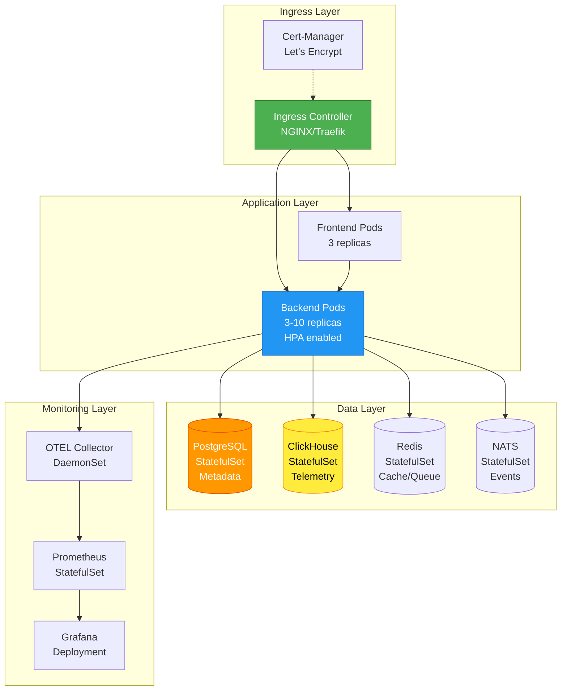
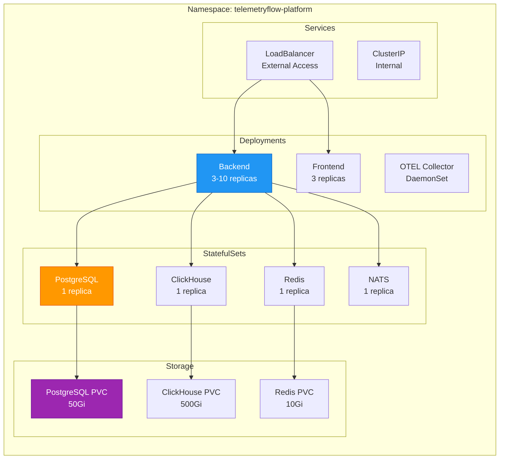

# Kubernetes Deployment Guide

- **Version:** 1.0.0-CE
- **Last Updated:** December 13, 2025
- **Status:** ✅ Production Ready

---

## Table of Contents

1. [Overview](#overview)
2. [Prerequisites](#prerequisites)
3. [Architecture](#architecture)
4. [Quick Start](#quick-start)
5. [Deployment Components](#deployment-components)
6. [Configuration](#configuration)
7. [Scaling](#scaling)
8. [Monitoring](#monitoring)
9. [Security](#security)
10. [Troubleshooting](#troubleshooting)
11. [Best Practices](#best-practices)

---

## Overview

**TelemetryFlow Platform** can be deployed on Kubernetes for production-grade, scalable, and highly available observability infrastructure. This guide covers deployment using both raw Kubernetes manifests and Helm charts.

### Deployment Options

| Method | Best For | Complexity | Customization |
|--------|---------|------------|---------------|
| **Raw Manifests** | Quick deployment, learning | Low | Medium |
| **Helm Charts** | Production, multiple environments | Medium | High |
| **Operators** | Advanced automation | High | Very High |

---

## Prerequisites

### Required Tools

```bash
# Kubernetes CLI
kubectl version --client
# Client Version: v1.28+

# Helm (for Helm deployment)
helm version
# Version: v3.12+

# Docker (for building images)
docker version
# Version: 24.0+
```

### Cluster Requirements

| Resource | Minimum | Recommended | Production |
|----------|---------|-------------|------------|
| **Kubernetes Version** | 1.25+ | 1.28+ | 1.28+ |
| **Nodes** | 3 | 5 | 10+ |
| **Total CPU** | 8 cores | 16 cores | 32+ cores |
| **Total Memory** | 16 GB | 32 GB | 64+ GB |
| **Storage** | 100 GB | 500 GB | 2+ TB |

### Cluster Features

- **Ingress Controller:** NGINX, Traefik, or cloud-specific (ALB, GCE)
- **Storage Class:** Dynamic provisioning (gp3, standard-rwo, etc.)
- **Metrics Server:** For HPA (Horizontal Pod Autoscaler)
- **Cert-Manager:** For automatic TLS certificate management (optional)

---

## Architecture

### High-Level Kubernetes Architecture



### Resource Distribution



---

## Quick Start

### Option 1: Raw Kubernetes Manifests

**1. Clone Repository:**
```bash
git clone https://github.com/telemetryflow/telemetryflow-platform.git
cd telemetryflow-platform
```

**2. Review and Update Configuration:**
```bash
# Edit the manifest to update domain, secrets, etc.
vim manifest/k8s-deployment.yaml
```

**3. Deploy:**
```bash
# Create namespace
kubectl create namespace telemetryflow-platform

# Deploy all resources
kubectl apply -f manifest/k8s-deployment.yaml

# Verify deployment
kubectl get all -n telemetryflow-platform
```

### Option 2: Helm Chart (Recommended)

**1. Add Helm Repository:**
```bash
# (When available)
helm repo add telemetryflow https://charts.telemetryflow.id
helm repo update
```

**2. Customize Values:**
```bash
# Create custom values file
cat > custom-values.yaml <<EOF
# Backend configuration
backend:
  replicaCount: 3
  resources:
    requests:
      memory: "512Mi"
      cpu: "500m"
    limits:
      memory: "1Gi"
      cpu: "1000m"

# Database configuration
postgresql:
  enabled: true
  persistence:
    size: 50Gi

clickhouse:
  enabled: true
  persistence:
    size: 500Gi

# Ingress configuration
ingress:
  enabled: true
  className: nginx
  hosts:
    - host: api.yourdomain.com
      paths:
        - path: /
          pathType: Prefix
  tls:
    - secretName: telemetryflow-tls
      hosts:
        - api.yourdomain.com
EOF
```

**3. Install:**
```bash
helm install telemetryflow telemetryflow/telemetryflow-platform \\
  --namespace telemetryflow-platform \\
  --create-namespace \\
  --values custom-values.yaml
```

**4. Verify Installation:**
```bash
# Check all pods are running
kubectl get pods -n telemetryflow-platform

# Check services
kubectl get svc -n telemetryflow-platform

# Get ingress details
kubectl get ingress -n telemetryflow-platform
```

---

## Deployment Components

### 1. Namespace

```yaml
apiVersion: v1
kind: Namespace
metadata:
  name: telemetryflow-platform
  labels:
    name: telemetryflow-platform
    environment: production
```

### 2. ConfigMap

```yaml
apiVersion: v1
kind: ConfigMap
metadata:
  name: telemetryflow-platform-config
  namespace: telemetryflow-platform
data:
  NODE_ENV: "production"
  LOG_LEVEL: "info"
  OTEL_SERVICE_NAME: "telemetryflow-platform"
  SERVICE_VERSION: "1.0.0-CE"
  OTEL_EXPORTER_OTLP_ENDPOINT: "http://otel-collector:4317"
  CORS_ORIGIN: "https://app.yourdomain.com"
```

### 3. Secrets

```bash
# Create secrets from environment file
kubectl create secret generic telemetryflow-secrets \\
  --from-literal=jwt-secret="$(openssl rand -base64 32)" \\
  --from-literal=session-secret="$(openssl rand -base64 32)" \\
  --from-literal=mfa-encryption-key="$(openssl rand -base64 32)" \\
  --from-literal=postgres-password="$(openssl rand -base64 24)" \\
  --from-literal=clickhouse-password="$(openssl rand -base64 24)" \\
  --namespace telemetryflow-platform
```

Or using a YAML file:
```yaml
apiVersion: v1
kind: Secret
metadata:
  name: telemetryflow-secrets
  namespace: telemetryflow-platform
type: Opaque
stringData:
  jwt-secret: "CHANGE-ME-32-CHARS-MIN"
  session-secret: "CHANGE-ME-32-CHARS-MIN"
  mfa-encryption-key: "CHANGE-ME-32-CHARS-MIN"
  postgres-password: "CHANGE-ME"
  clickhouse-password: "CHANGE-ME"
  redis-password: "CHANGE-ME"
```

### 4. Backend Deployment

```yaml
apiVersion: apps/v1
kind: Deployment
metadata:
  name: telemetryflow-backend
  namespace: telemetryflow-platform
  labels:
    app: telemetryflow
    component: backend
    version: v1.0.0-CE
spec:
  replicas: 3
  selector:
    matchLabels:
      app: telemetryflow
      component: backend
  strategy:
    type: RollingUpdate
    rollingUpdate:
      maxSurge: 1
      maxUnavailable: 0
  template:
    metadata:
      labels:
        app: telemetryflow
        component: backend
        version: v1.0.0-CE
      annotations:
        prometheus.io/scrape: "true"
        prometheus.io/port: "3100"
        prometheus.io/path: "/metrics"
    spec:
      containers:
      - name: backend
        image: devopscorner/telemetryflow-backend:1.0.0-CE
        imagePullPolicy: IfNotPresent
        ports:
        - containerPort: 3100
          name: http
          protocol: TCP
        env:
        - name: NODE_ENV
          value: "production"
        - name: PORT
          value: "3100"
        - name: JWT_SECRET
          valueFrom:
            secretKeyRef:
              name: telemetryflow-secrets
              key: jwt-secret
        - name: POSTGRES_HOST
          value: "postgresql"
        - name: POSTGRES_PORT
          value: "5432"
        - name: POSTGRES_PASSWORD
          valueFrom:
            secretKeyRef:
              name: telemetryflow-secrets
              key: postgres-password
        - name: CLICKHOUSE_HOST
          value: "http://clickhouse:8123"
        - name: REDIS_HOST
          value: "redis"
        - name: REDIS_PORT
          value: "6379"
        - name: NATS_URL
          value: "nats://nats:4222"
        # Kubernetes metadata injection
        - name: K8S_NAMESPACE
          valueFrom:
            fieldRef:
              fieldPath: metadata.namespace
        - name: K8S_POD_NAME
          valueFrom:
            fieldRef:
              fieldPath: metadata.name
        - name: K8S_NODE_NAME
          valueFrom:
            fieldRef:
              fieldPath: spec.nodeName
        resources:
          requests:
            memory: "512Mi"
            cpu: "500m"
          limits:
            memory: "1Gi"
            cpu: "1000m"
        livenessProbe:
          httpGet:
            path: /health
            port: 3100
          initialDelaySeconds: 30
          periodSeconds: 10
          timeoutSeconds: 5
          failureThreshold: 3
        readinessProbe:
          httpGet:
            path: /health
            port: 3100
          initialDelaySeconds: 10
          periodSeconds: 5
          timeoutSeconds: 3
          failureThreshold: 3
        lifecycle:
          preStop:
            exec:
              command: ["/bin/sh", "-c", "sleep 15"]
      terminationGracePeriodSeconds: 30
      affinity:
        podAntiAffinity:
          preferredDuringSchedulingIgnoredDuringExecution:
          - weight: 100
            podAffinityTerm:
              labelSelector:
                matchExpressions:
                - key: app
                  operator: In
                  values:
                  - telemetryflow
                - key: component
                  operator: In
                  values:
                  - backend
              topologyKey: kubernetes.io/hostname
```

### 5. Frontend Deployment

```yaml
apiVersion: apps/v1
kind: Deployment
metadata:
  name: telemetryflow-frontend
  namespace: telemetryflow-platform
spec:
  replicas: 3
  selector:
    matchLabels:
      app: telemetryflow
      component: frontend
  template:
    metadata:
      labels:
        app: telemetryflow
        component: frontend
    spec:
      containers:
      - name: frontend
        image: devopscorner/telemetryflow-frontend:1.0.0-CE
        ports:
        - containerPort: 80
          name: http
        resources:
          requests:
            memory: "128Mi"
            cpu: "100m"
          limits:
            memory: "256Mi"
            cpu: "200m"
```

### 6. Services

```yaml
---
apiVersion: v1
kind: Service
metadata:
  name: telemetryflow-backend
  namespace: telemetryflow-platform
spec:
  type: ClusterIP
  ports:
  - port: 3100
    targetPort: 3100
    protocol: TCP
    name: http
  selector:
    app: telemetryflow
    component: backend

---
apiVersion: v1
kind: Service
metadata:
  name: telemetryflow-frontend
  namespace: telemetryflow-platform
spec:
  type: ClusterIP
  ports:
  - port: 80
    targetPort: 80
    protocol: TCP
    name: http
  selector:
    app: telemetryflow
    component: frontend
```

### 7. Ingress

```yaml
apiVersion: networking.k8s.io/v1
kind: Ingress
metadata:
  name: telemetryflow-platform
  namespace: telemetryflow-platform
  annotations:
    kubernetes.io/ingress.class: "nginx"
    cert-manager.io/cluster-issuer: "letsencrypt-prod"
    nginx.ingress.kubernetes.io/ssl-redirect: "true"
    nginx.ingress.kubernetes.io/proxy-body-size: "10m"
    nginx.ingress.kubernetes.io/rate-limit: "100"
spec:
  tls:
  - hosts:
    - api.yourdomain.com
    - app.yourdomain.com
    secretName: telemetryflow-tls
  rules:
  - host: api.yourdomain.com
    http:
      paths:
      - path: /
        pathType: Prefix
        backend:
          service:
            name: telemetryflow-backend
            port:
              number: 3100
  - host: app.yourdomain.com
    http:
      paths:
      - path: /
        pathType: Prefix
        backend:
          service:
            name: telemetryflow-frontend
            port:
              number: 80
```

### 8. Horizontal Pod Autoscaler (HPA)

```yaml
apiVersion: autoscaling/v2
kind: HorizontalPodAutoscaler
metadata:
  name: telemetryflow-backend-hpa
  namespace: telemetryflow-platform
spec:
  scaleTargetRef:
    apiVersion: apps/v1
    kind: Deployment
    name: telemetryflow-backend
  minReplicas: 3
  maxReplicas: 10
  metrics:
  - type: Resource
    resource:
      name: cpu
      target:
        type: Utilization
        averageUtilization: 70
  - type: Resource
    resource:
      name: memory
      target:
        type: Utilization
        averageUtilization: 80
  behavior:
    scaleDown:
      stabilizationWindowSeconds: 300
      policies:
      - type: Percent
        value: 50
        periodSeconds: 60
    scaleUp:
      stabilizationWindowSeconds: 60
      policies:
      - type: Percent
        value: 100
        periodSeconds: 15
```

### 9. Pod Disruption Budget

```yaml
apiVersion: policy/v1
kind: PodDisruptionBudget
metadata:
  name: telemetryflow-backend-pdb
  namespace: telemetryflow-platform
spec:
  minAvailable: 2
  selector:
    matchLabels:
      app: telemetryflow
      component: backend
```

### 10. Network Policy

```yaml
apiVersion: networking.k8s.io/v1
kind: NetworkPolicy
metadata:
  name: telemetryflow-backend-netpol
  namespace: telemetryflow-platform
spec:
  podSelector:
    matchLabels:
      app: telemetryflow
      component: backend
  policyTypes:
  - Ingress
  - Egress
  ingress:
  - from:
    - namespaceSelector:
        matchLabels:
          name: ingress-nginx
    - podSelector:
        matchLabels:
          app: telemetryflow
          component: frontend
    ports:
    - protocol: TCP
      port: 3100
  egress:
  # DNS
  - to:
    - namespaceSelector:
        matchLabels:
          name: kube-system
    ports:
    - protocol: UDP
      port: 53
  # PostgreSQL
  - to:
    - podSelector:
        matchLabels:
          app: postgresql
    ports:
    - protocol: TCP
      port: 5432
  # ClickHouse
  - to:
    - podSelector:
        matchLabels:
          app: clickhouse
    ports:
    - protocol: TCP
      port: 8123
  # Redis
  - to:
    - podSelector:
        matchLabels:
          app: redis
    ports:
    - protocol: TCP
      port: 6379
  # NATS
  - to:
    - podSelector:
        matchLabels:
          app: nats
    ports:
    - protocol: TCP
      port: 4222
  # External HTTPS
  - to:
    - namespaceSelector: {}
    ports:
    - protocol: TCP
      port: 443
```

---

## Configuration

### Environment Variables

**Required Configuration:**

| Variable | Description | Default | Production Value |
|----------|-------------|---------|------------------|
| `NODE_ENV` | Environment | development | production |
| `PORT` | Backend port | 3100 | 3100 |
| `JWT_SECRET` | JWT signing key | - | **REQUIRED (32+ chars)** |
| `SESSION_SECRET` | Session key | - | **REQUIRED (32+ chars)** |
| `POSTGRES_HOST` | PostgreSQL host | localhost | postgresql |
| `CLICKHOUSE_HOST` | ClickHouse host | localhost | http://clickhouse:8123 |
| `REDIS_HOST` | Redis host | localhost | redis |
| `NATS_URL` | NATS URL | - | nats://nats:4222 |

**Optional Configuration:**

| Variable | Description | Default |
|----------|-------------|---------|
| `LOG_LEVEL` | Logging level | info |
| `CORS_ORIGIN` | Allowed origins | * |
| `OTEL_EXPORTER_OTLP_ENDPOINT` | OTEL endpoint | - |
| `CACHE_ENABLED` | Enable caching | true |
| `QUEUE_ENABLED` | Enable queues | true |

### ConfigMap vs Secrets

**Use ConfigMap for:**
- Non-sensitive configuration (log levels, URLs, feature flags)
- Service names and ports
- Application metadata

**Use Secrets for:**
- Passwords and API keys
- JWT signing keys
- Database credentials
- TLS certificates

---

## Scaling

### Horizontal Scaling

**Backend Scaling:**
```bash
# Manual scaling
kubectl scale deployment telemetryflow-backend \\
  --replicas=5 \\
  -n telemetryflow-platform

# Auto-scaling is enabled via HPA
# Scales between 3-10 replicas based on CPU/Memory
```

**Database Scaling:**
For production, use managed database services:
- **PostgreSQL:** AWS RDS, Google Cloud SQL, Azure Database
- **ClickHouse:** ClickHouse Cloud, Altinity.Cloud
- **Redis:** AWS ElastiCache, Google Memorystore, Azure Cache

### Vertical Scaling

Update resource requests/limits:
```bash
kubectl set resources deployment telemetryflow-backend \\
  --requests=cpu=1000m,memory=1Gi \\
  --limits=cpu=2000m,memory=2Gi \\
  -n telemetryflow-platform
```

---

## Monitoring

### Prometheus Integration

**ServiceMonitor (for Prometheus Operator):**
```yaml
apiVersion: monitoring.coreos.com/v1
kind: ServiceMonitor
metadata:
  name: telemetryflow-backend
  namespace: telemetryflow-platform
spec:
  selector:
    matchLabels:
      app: telemetryflow
      component: backend
  endpoints:
  - port: http
    path: /metrics
    interval: 30s
```

**Check Metrics:**
```bash
# Port-forward to access metrics
kubectl port-forward svc/telemetryflow-backend 3100:3100 -n telemetryflow-platform

# Access metrics
curl http://localhost:3100/metrics
```

### Logging

**Centralized Logging with Loki:**
```bash
# View logs from all backend pods
kubectl logs -l app=telemetryflow,component=backend \\
  -n telemetryflow-platform \\
  --tail=100 \\
  -f
```

---

## Security

### RBAC (Kubernetes)

```yaml
apiVersion: v1
kind: ServiceAccount
metadata:
  name: telemetryflow-backend
  namespace: telemetryflow-platform

---
apiVersion: rbac.authorization.k8s.io/v1
kind: Role
metadata:
  name: telemetryflow-backend
  namespace: telemetryflow-platform
rules:
- apiGroups: [""]
  resources: ["configmaps", "secrets"]
  verbs: ["get", "list"]

---
apiVersion: rbac.authorization.k8s.io/v1
kind: RoleBinding
metadata:
  name: telemetryflow-backend
  namespace: telemetryflow-platform
subjects:
- kind: ServiceAccount
  name: telemetryflow-backend
roleRef:
  kind: Role
  name: telemetryflow-backend
  apiGroup: rbac.authorization.k8s.io
```

### Security Best Practices

1. **Use Secrets for sensitive data**
2. **Enable Network Policies** to restrict pod-to-pod communication
3. **Run as non-root user** in container
4. **Enable Pod Security Standards** (restricted profile)
5. **Use TLS for all external communication**
6. **Rotate secrets regularly**
7. **Enable audit logging**

---

## Troubleshooting

### Common Issues

**1. Pods Not Starting:**
```bash
# Check pod status
kubectl get pods -n telemetryflow-platform

# Describe pod for events
kubectl describe pod <pod-name> -n telemetryflow-platform

# Check logs
kubectl logs <pod-name> -n telemetryflow-platform
```

**2. Database Connection Issues:**
```bash
# Test PostgreSQL connection
kubectl run -it --rm debug \\
  --image=postgres:15-alpine \\
  --restart=Never \\
  -n telemetryflow-platform \\
  -- psql -h postgresql -U telemetryflow -d telemetryflow_db
```

**3. High Memory Usage:**
```bash
# Check resource usage
kubectl top pods -n telemetryflow-platform

# Increase memory limits if needed
kubectl set resources deployment telemetryflow-backend \\
  --limits=memory=2Gi \\
  -n telemetryflow-platform
```

**4. HPA Not Scaling:**
```bash
# Check HPA status
kubectl get hpa -n telemetryflow-platform

# Check metrics-server
kubectl top nodes
kubectl top pods -n telemetryflow-platform
```

---

## Best Practices

### 1. Resource Management

- Set appropriate resource requests and limits
- Use HPA for automatic scaling
- Monitor resource usage with Prometheus

### 2. High Availability

- Run at least 3 replicas in production
- Use Pod Disruption Budgets
- Deploy across multiple availability zones
- Use pod anti-affinity rules

### 3. Security

- Use Secrets for sensitive data
- Enable Network Policies
- Run containers as non-root
- Keep images updated
- Use image scanning tools

### 4. Monitoring & Logging

- Integrate with Prometheus for metrics
- Use centralized logging (Loki, ELK)
- Set up alerting for critical issues
- Monitor resource usage continuously

### 5. Backup & Disaster Recovery

- Regular database backups (PostgreSQL, ClickHouse)
- Test restore procedures
- Use PersistentVolumeClaims with proper backup policies
- Document recovery procedures

---

## Additional Resources

- **Main Documentation:** [README.md](../README.md)
- **Docker Compose Guide:** [DOCKER-COMPOSE.md](DOCKER-COMPOSE.md)
- **Configuration Guide:** [CONFIGURATION.md](CONFIGURATION.md)
- **Production Checklist:** [PRODUCTION-CHECKLIST.md](PRODUCTION-CHECKLIST.md)
- **Security Guide:** [../architecture/04-SECURITY.md](../architecture/04-SECURITY.md)

---

**Version:** 1.0.0-CE | **Maintained By:** DevOpsCorner Indonesia
