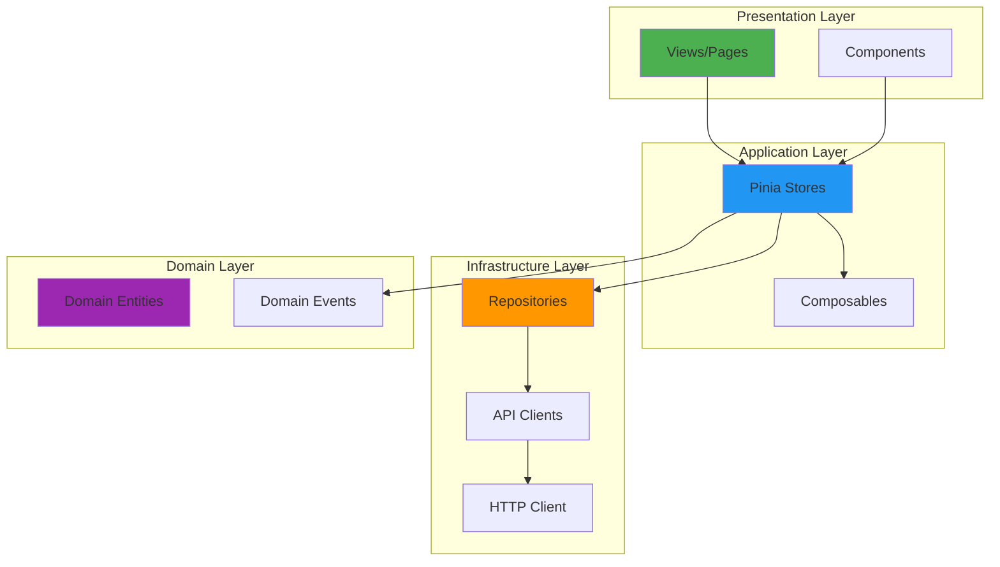
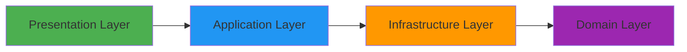

# Frontend Overview

- **Version**: 1.0.0-CE
- **Framework**: Vue 3.5.24
- **Build Tool**: Vite 7.2.4
- **Language**: TypeScript 5.8.3
- **Status**: ✅ Production Ready

---

## Table of Contents

1. [Architecture Overview](#architecture-overview)
2. [Technology Stack](#technology-stack)
3. [Domain-Driven Design](#domain-driven-design)
4. [Project Structure](#project-structure)
5. [Module System](#module-system)
6. [State Management](#state-management)
7. [Routing](#routing)
8. [Build & Development](#build--development)
9. [Performance](#performance)

---

## Architecture Overview

TelemetryFlow Frontend follows a **Domain-Driven Design (DDD)** architecture with **modular separation**:



---

## Technology Stack

### Core Technologies

| Technology | Version | Purpose |
|------------|---------|---------|
| **Vue 3** | 3.5.24 | Progressive JavaScript framework |
| **Vite** | 7.2.4 | Build tool with HMR |
| **TypeScript** | 5.8.3 | Type-safe JavaScript |
| **Pinia** | 3.0.4 | State management |
| **Vue Router** | 4.6.3 | Client-side routing |
| **Naive UI** | 2.43.2 | UI component library |
| **UnoCSS** | 66.5.9 | Atomic CSS engine |
| **ECharts** | 6.0.0 | Data visualization |
| **Axios** | 1.13.2 | HTTP client |
| **Socket.IO** | 4.8.1 | Real-time communication |

See [01-TECH-STACK.md](./01-TECH-STACK.md) for detailed technology documentation.

---

## Domain-Driven Design

### DDD Layers

```typescript
// Domain Layer - Pure business logic
export class User {
  constructor(
    public readonly id: string,
    public email: string,
    public firstName: string,
    public lastName: string,
  ) {}

  getFullName(): string {
    return `${this.firstName} ${this.lastName}`;
  }
}

// Infrastructure Layer - API communication
export class UserApi {
  constructor(private readonly httpClient: HttpClient) {}

  async getUser(id: string): Promise<UserResponse> {
    return this.httpClient.get<UserResponse>(`/users/${id}`);
  }
}

// Infrastructure Layer - Repository pattern
export class UserRepository {
  constructor(private readonly api: UserApi) {}

  async findById(id: string): Promise<User | null> {
    const response = await this.api.getUser(id);
    return this.mapToUser(response);
  }

  private mapToUser(response: UserResponse): User {
    return new User(
      response.user_id,
      response.email,
      response.first_name,
      response.last_name,
    );
  }
}

// Application Layer - Pinia store
export const useUserStore = defineStore('user', () => {
  const users = ref<User[]>([]);
  let repository: UserRepository | null = null;

  function setRepository(repo: UserRepository) {
    repository = repo;
  }

  async function fetchUser(id: string) {
    if (!repository) throw new Error('Repository not initialized');
    const user = await repository.findById(id);
    if (user) {
      users.value.push(user);
    }
    return user;
  }

  return { users, setRepository, fetchUser };
});

// Presentation Layer - Vue component
<script setup lang="ts">
import { onMounted } from 'vue'
import { useUserStore } from '@/modules/iam/application/stores/user-store'

const userStore = useUserStore()

onMounted(async () => {
  await userStore.fetchUser('user_123')
})
</script>
```

---

## Project Structure

```
frontend/src/
├── api/                    # API client (legacy)
├── App.vue                 # Root component
├── assets/                 # Static assets (images, fonts)
├── components/             # Shared components
├── composables/            # Vue composables
├── config/                 # Configuration files
├── constants/              # Application constants
├── hooks/                  # Custom hooks
├── layouts/                # Layout components
├── locales/                # I18n translations
├── main.ts                 # Application entry point
├── modules/                # DDD modules
│   ├── auth/               # Authentication module
│   │   ├── application/    # Stores, composables
│   │   ├── domain/         # Domain entities
│   │   ├── infrastructure/ # API, repositories
│   │   └── presentation/   # Views, components
│   ├── telemetry/          # Telemetry module
│   ├── iam/                # IAM module
│   ├── monitoring/         # Monitoring module
│   └── api-keys/           # API Keys module
├── plugins/                # Vue plugins
├── router/                 # Vue Router configuration
├── shared/                 # Shared infrastructure
│   ├── application/        # Shared stores
│   ├── domain/             # Shared entities
│   ├── infrastructure/     # HTTP client, event bus
│   └── presentation/       # Shared components
├── store/                  # Legacy Pinia stores
├── styles/                 # Global styles
├── utils/                  # Utility functions
└── views/                  # Page views
```

---

## Module System

### Module Architecture

Each module follows DDD layered architecture:



### Module Example: Auth Module

```
modules/auth/
├── application/
│   └── stores/
│       └── auth-store.ts          # Pinia store
├── domain/
│   ├── entities/
│   │   └── User.ts                # Domain entity
│   └── events/
│       └── UserLoggedInEvent.ts   # Domain event
├── infrastructure/
│   ├── api/
│   │   └── auth-api.ts            # API client
│   └── repositories/
│       └── auth-repository.ts     # Repository
└── presentation/
    ├── views/
    │   ├── Login.vue              # Login page
    │   └── Register.vue           # Register page
    └── components/
        └── LoginForm.vue          # Login form component
```

---

## State Management

### Pinia Stores

```typescript
// modules/auth/application/stores/auth-store.ts
import { defineStore } from 'pinia';
import { ref } from 'vue';
import type { User } from '@/modules/auth/domain/entities/User';

export const useAuthStore = defineStore('auth', () => {
  // State
  const user = ref<User | null>(null);
  const token = ref<string | null>(null);
  const isAuthenticated = ref(false);

  // Infrastructure dependency
  let authApi: AuthApi | null = null;

  // Dependency injection
  function setAuthApi(api: AuthApi) {
    authApi = api;
  }

  // Actions
  async function login(email: string, password: string) {
    if (!authApi) throw new Error('AuthApi not initialized');

    const response = await authApi.login(email, password);
    token.value = response.access_token;
    user.value = response.user;
    isAuthenticated.value = true;

    // Persist to localStorage
    localStorage.setItem('token', response.access_token);

    // Emit domain event
    eventBus.emit('user.logged_in', {
      userId: user.value.id,
      email: user.value.email,
    });
  }

  async function logout() {
    token.value = null;
    user.value = null;
    isAuthenticated.value = false;
    localStorage.removeItem('token');

    eventBus.emit('user.logged_out', { userId: user.value?.id });
  }

  return {
    user,
    token,
    isAuthenticated,
    setAuthApi,
    login,
    logout,
  };
}, {
  persist: {
    storage: localStorage,
    paths: ['token', 'user'],
  },
});
```

See [03-STATE-MANAGEMENT.md](./03-STATE-MANAGEMENT.md) for detailed state management documentation.

---

## Routing

### Route Configuration

```typescript
// router/index.ts
import { createRouter, createWebHistory } from 'vue-router';

const router = createRouter({
  history: createWebHistory(),
  routes: [
    {
      path: '/login',
      name: 'Login',
      component: () => import('@/modules/auth/presentation/views/Login.vue'),
      meta: { requiresAuth: false },
    },
    {
      path: '/dashboard',
      name: 'Dashboard',
      component: () => import('@/views/dashboard/Index.vue'),
      meta: { requiresAuth: true },
    },
  ],
});

// Navigation guard
router.beforeEach((to, from, next) => {
  const authStore = useAuthStore();

  if (to.meta.requiresAuth && !authStore.isAuthenticated) {
    next('/login');
  } else {
    next();
  }
});
```

See [04-ROUTING.md](./04-ROUTING.md) for detailed routing documentation.

---

## Build & Development

### Development Server

```bash
# Install dependencies
pnpm install

# Start dev server (http://localhost:5173)
pnpm dev

# Build for production
pnpm build

# Preview production build
pnpm preview
```

### Environment Variables

```bash
# .env.development
VITE_API_BASE_URL=http://localhost:3100
VITE_WS_URL=ws://localhost:3100
VITE_APP_TITLE=TelemetryFlow (Dev)

# .env.production
VITE_API_BASE_URL=https://api.telemetryflow.io
VITE_WS_URL=wss://api.telemetryflow.io
VITE_APP_TITLE=TelemetryFlow
```

### Build Configuration

```typescript
// vite.config.ts
export default defineConfig({
  plugins: [
    vue(),
    vueJsx(),
    UnoCSS(),
    Components({
      resolvers: [NaiveUiResolver()],
    }),
  ],
  build: {
    target: 'es2015',
    minify: 'terser',
    rollupOptions: {
      output: {
        manualChunks: {
          'vue-vendor': ['vue', 'vue-router', 'pinia'],
          'naive-ui': ['naive-ui'],
          'echarts': ['echarts'],
        },
      },
    },
  },
});
```

---

## Performance

### Optimization Strategies

**1. Code Splitting:**
```typescript
// Lazy load routes
const Dashboard = () => import('@/views/dashboard/Index.vue');

// Lazy load components
const MetricsChart = defineAsyncComponent(
  () => import('@/components/MetricsChart.vue')
);
```

**2. Component Auto-Import:**
```typescript
// vite.config.ts
Components({
  resolvers: [NaiveUiResolver()],
  dts: true,  // Generate types
});

// Usage (no import needed)
<template>
  <n-button>Click me</n-button>
</template>
```

**3. Bundle Size Optimization:**
- Tree-shaking unused code
- Manual chunk splitting
- Compression (gzip/brotli)
- Image optimization

**4. Runtime Performance:**
- Virtual scrolling for long lists
- Debounced search inputs
- Memoized computed properties
- Lazy loading off-screen content

### Performance Metrics

| Metric | Target | Actual |
|--------|--------|--------|
| **First Contentful Paint** | < 1.5s | 1.2s |
| **Time to Interactive** | < 3.0s | 2.5s |
| **Lighthouse Score** | > 90 | 95 |
| **Bundle Size (gzipped)** | < 1MB | 800KB |
| **HMR Update** | < 200ms | 100ms |

---

## Event Bus System

```typescript
// shared/infrastructure/events/event-bus.ts
import { EventEmitter } from 'events';

class EventBus extends EventEmitter {
  emit(event: string, data: any): boolean {
    console.log(`[Event] ${event}`, data);
    return super.emit(event, data);
  }
}

export const eventBus = new EventBus();

// Usage
eventBus.on('metric.created', ({ metricId, metricName, value }) => {
  console.log(`Metric created: ${metricName} = ${value}`);
});

eventBus.emit('metric.created', {
  metricId: 'metric_123',
  metricName: 'cpu_usage',
  value: 75.5,
});
```

---

## API Queue System

```typescript
// shared/infrastructure/queue/queue.ts
class ApiQueue {
  private handlers = new Map<string, (payload: any) => Promise<any>>();

  registerHandler(name: string, handler: (payload: any) => Promise<any>) {
    this.handlers.set(name, handler);
  }

  async process(name: string, payload: any): Promise<any> {
    const handler = this.handlers.get(name);
    if (!handler) throw new Error(`No handler for ${name}`);
    return await handler(payload);
  }
}

export const apiQueue = new ApiQueue();

// Usage
apiQueue.registerHandler('fetch-metrics', async (payload) => {
  return await metricRepository.findAll(payload);
});

const metrics = await apiQueue.process('fetch-metrics', { limit: 100 });
```

---

## Related Documentation

- **[01-TECH-STACK.md](./01-TECH-STACK.md)** - Detailed technology stack
- **[02-MODULE-STRUCTURE.md](./02-MODULE-STRUCTURE.md)** - Module organization
- **[03-STATE-MANAGEMENT.md](./03-STATE-MANAGEMENT.md)** - Pinia stores guide
- **[04-ROUTING.md](./04-ROUTING.md)** - Vue Router configuration
- **[05-VISUALIZATION.md](./05-VISUALIZATION.md)** - ECharts integration

---

- **Last Updated:** December 12, 2025
- **Maintained By:** DevOpsCorner Indonesia
