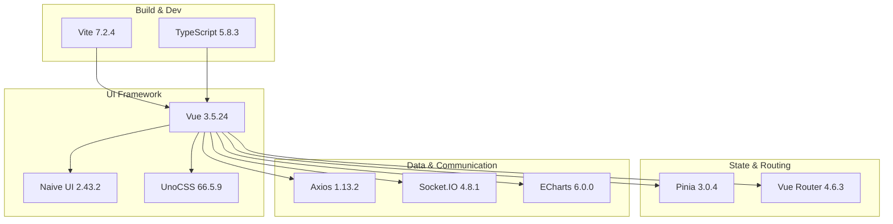
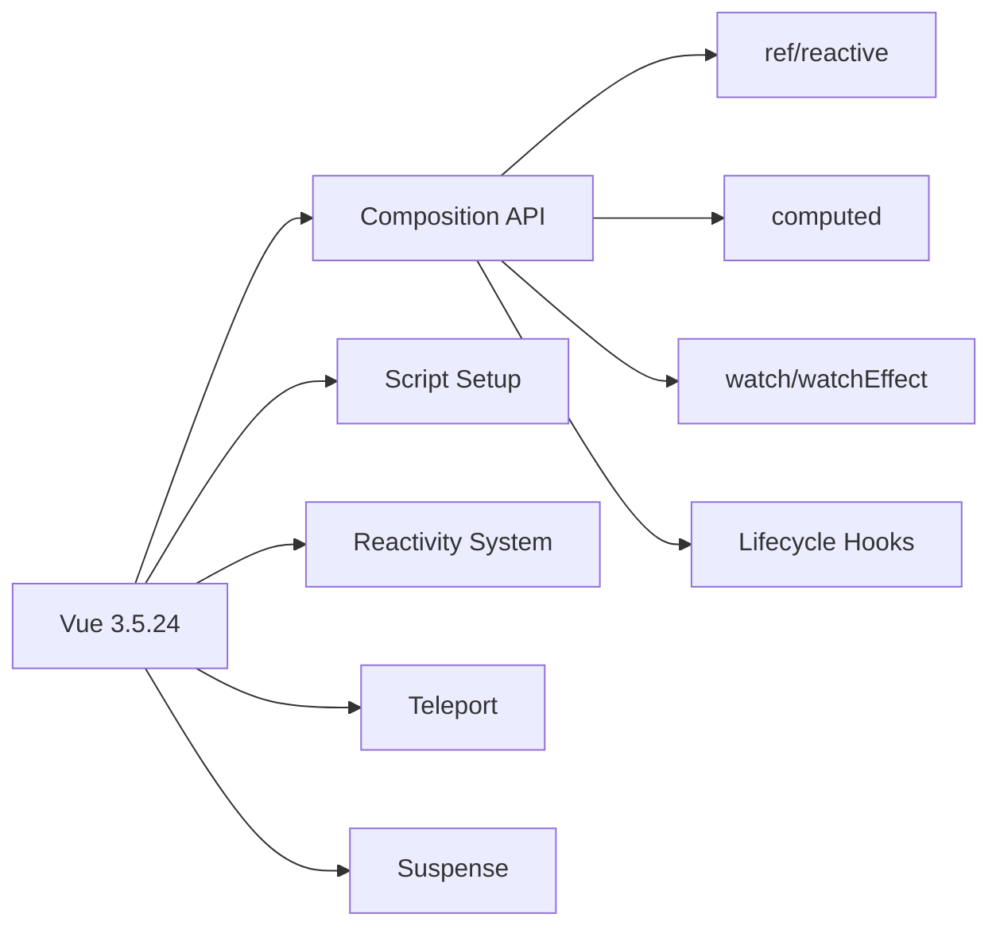
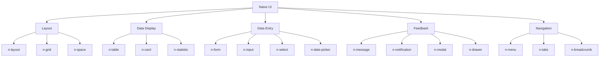
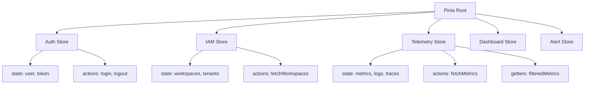
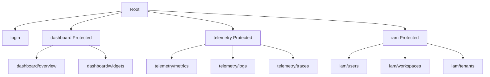
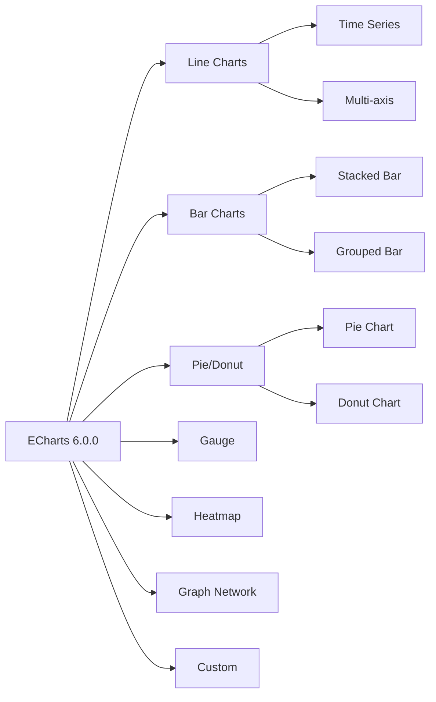

# Frontend Technology Stack

- **Version:** 1.1.1-CE
- **Last Updated:** December 12, 2025
- **Status:** ✅ Production Ready

---

## Table of Contents

1. [Overview](#overview)
2. [Core Framework](#core-framework)
3. [Build Tool](#build-tool)
4. [Language](#language)
5. [UI Components](#ui-components)
6. [Styling](#styling)
7. [State Management](#state-management)
8. [Routing](#routing)
9. [Data Visualization](#data-visualization)
10. [HTTP & WebSocket](#http--websocket)
11. [Utilities](#utilities)
12. [Development Tools](#development-tools)
13. [Technology Decision Rationale](#technology-decision-rationale)

---

## Overview

**TelemetryFlow Frontend** is a modern Single Page Application (SPA) built with cutting-edge technologies:

- **🚀 Lightning-Fast** - Vite 7 with Hot Module Replacement (HMR)
- **📱 Responsive** - Mobile-first design with UnoCSS
- **♿ Accessible** - WCAG 2.1 AA compliant
- **🎨 Modern UI** - Naive UI component library
- **📊 Rich Visualizations** - ECharts with 80+ chart types
- **🔧 Type-Safe** - Full TypeScript coverage
- **🌐 I18n Ready** - Multi-language support



---

## Core Framework

### Vue 3.5.24

**Why Vue 3?**
- **Composition API** - Better logic reuse and organization
- **Performance** - Virtual DOM optimizations, tree-shaking
- **TypeScript Support** - First-class TypeScript integration
- **Developer Experience** - Excellent devtools, documentation
- **Ecosystem** - Rich library ecosystem

**Key Features Used:**



**Composition API Example:**
```vue
<script setup lang="ts">
import { ref, computed, onMounted } from 'vue'
import { useMetricsStore } from '@/stores/metrics'

const metricsStore = useMetricsStore()
const searchQuery = ref('')

const filteredMetrics = computed(() => {
  return metricsStore.metrics.filter(m =>
    m.name.toLowerCase().includes(searchQuery.value.toLowerCase())
  )
})

onMounted(async () => {
  await metricsStore.fetchMetrics()
})
</script>

<template>
  <div>
    <n-input v-model:value="searchQuery" placeholder="Search metrics..." />
    <MetricsList :metrics="filteredMetrics" />
  </div>
</template>
```

**Vue 3 Directives:**
- `v-model` - Two-way data binding
- `v-if/v-else/v-show` - Conditional rendering
- `v-for` - List rendering
- `v-on (@)` - Event handling
- `v-bind (:)` - Attribute binding

---

## Build Tool

### Vite 7.2.4

**Why Vite?**
- **⚡ Instant HMR** - Sub-second updates
- **📦 Optimized Build** - Rollup-based production builds
- **🔌 Plugin Ecosystem** - Rich plugin ecosystem
- **🚀 Fast Startup** - Native ES modules (no bundling in dev)

**Configuration (`vite.config.ts`):**
```typescript
import { defineConfig } from 'vite'
import vue from '@vitejs/plugin-vue'
import vueJsx from '@vitejs/plugin-vue-jsx'
import UnoCSS from 'unocss/vite'
import Icons from 'unplugin-icons/vite'
import Components from 'unplugin-vue-components/vite'
import { NaiveUiResolver } from 'unplugin-vue-components/resolvers'

export default defineConfig({
  plugins: [
    vue(),
    vueJsx(),
    UnoCSS(),
    Icons({ compiler: 'vue3' }),
    Components({
      resolvers: [NaiveUiResolver()],
    }),
  ],
  server: {
    port: 5173,
    proxy: {
      '/api': {
        target: 'http://localhost:3100',
        changeOrigin: true,
      },
    },
  },
  build: {
    target: 'es2015',
    minify: 'terser',
    sourcemap: false,
    chunkSizeWarningLimit: 1500,
    rollupOptions: {
      output: {
        manualChunks: {
          'vue-vendor': ['vue', 'vue-router', 'pinia'],
          'naive-ui': ['naive-ui'],
          'echarts': ['echarts'],
        },
      },
    },
  },
})
```

**Vite Plugins Used:**

| Plugin | Purpose |
|--------|---------|
| `@vitejs/plugin-vue` | Vue 3 SFC support |
| `@vitejs/plugin-vue-jsx` | JSX/TSX support |
| `@unocss/vite` | UnoCSS integration |
| `unplugin-icons` | Icon auto-import |
| `unplugin-vue-components` | Component auto-import |
| `vite-plugin-progress` | Build progress bar |
| `vite-plugin-svg-icons` | SVG sprite generation |

**Build Performance:**

| Metric | Development | Production |
|--------|-------------|------------|
| **Startup Time** | < 1s | N/A |
| **HMR Update** | < 100ms | N/A |
| **Build Time** | N/A | 30-45s |
| **Bundle Size** | N/A | 800KB (gzipped) |

---

## Language

### TypeScript 5.8.3

**Configuration (`tsconfig.json`):**
```json
{
  "compilerOptions": {
    "target": "ES2020",
    "module": "ESNext",
    "lib": ["ES2020", "DOM", "DOM.Iterable"],
    "jsx": "preserve",
    "strict": true,
    "esModuleInterop": true,
    "skipLibCheck": true,
    "moduleResolution": "bundler",
    "resolveJsonModule": true,
    "isolatedModules": true,
    "noEmit": true,
    "paths": {
      "@/*": ["./src/*"],
      "~/*": ["./src/*"]
    }
  },
  "include": ["src/**/*.ts", "src/**/*.d.ts", "src/**/*.tsx", "src/**/*.vue"],
  "exclude": ["node_modules", "dist"]
}
```

**Type Safety Features:**
- Strict type checking
- Null safety
- Interface definitions for all API responses
- Type inference
- Generic types

**Type Definition Example:**
```typescript
// API Response Types
export interface MetricDataPoint {
  timestamp: number
  value: number
  labels: Record<string, string>
}

export interface MetricResponse {
  metric_name: string
  data_points: MetricDataPoint[]
  total_count: number
}

// Component Props
export interface DashboardWidgetProps {
  widgetId: string
  title: string
  type: 'line_chart' | 'bar_chart' | 'gauge' | 'stat'
  config: WidgetConfig
}
```

---

## UI Components

### Naive UI 2.43.2

**Why Naive UI?**
- **🎨 Beautiful Design** - Modern, clean design system
- **📦 80+ Components** - Comprehensive component library
- **🌙 Dark Mode** - Built-in dark theme
- **♿ Accessibility** - ARIA compliant
- **🚀 Performance** - Lightweight, tree-shakable
- **📱 Responsive** - Mobile-first components

**Key Components Used:**



**Component Categories:**

1. **Layout** (8 components)
   - `n-layout`, `n-layout-header`, `n-layout-sider`, `n-layout-content`
   - `n-grid`, `n-grid-item`
   - `n-space`, `n-divider`

2. **Data Entry** (20+ components)
   - `n-form`, `n-form-item`, `n-input`, `n-select`, `n-checkbox`
   - `n-radio`, `n-switch`, `n-slider`, `n-date-picker`, `n-time-picker`
   - `n-upload`, `n-transfer`, `n-tree-select`, `n-cascader`

3. **Data Display** (15+ components)
   - `n-table`, `n-data-table`, `n-card`, `n-statistic`, `n-descriptions`
   - `n-badge`, `n-tag`, `n-avatar`, `n-timeline`, `n-tree`

4. **Feedback** (10+ components)
   - `n-alert`, `n-message`, `n-notification`, `n-modal`, `n-drawer`
   - `n-popconfirm`, `n-popover`, `n-tooltip`, `n-progress`, `n-spin`

5. **Navigation** (8 components)
   - `n-menu`, `n-tabs`, `n-breadcrumb`, `n-pagination`, `n-steps`
   - `n-dropdown`, `n-anchor`, `n-back-top`

**Theme Customization:**
```typescript
import { darkTheme } from 'naive-ui'

const themeOverrides = {
  common: {
    primaryColor: '#18A058FF',
    primaryColorHover: '#36AD6AFF',
    primaryColorPressed: '#0C7A43FF',
  },
  Button: {
    textColor: '#FFFFFF',
  },
}

<n-config-provider :theme="darkTheme" :theme-overrides="themeOverrides">
  <App />
</n-config-provider>
```

---

## Styling

### UnoCSS 66.5.9

**Why UnoCSS?**
- **⚡ Fast** - 200x faster than Tailwind
- **📦 Tiny Bundle** - On-demand generation
- **🎨 Flexible** - Customizable presets
- **🔧 IDE Support** - IntelliSense for classes

**Configuration:**
```typescript
import { defineConfig, presetUno, presetIcons } from 'unocss'

export default defineConfig({
  presets: [
    presetUno(),
    presetIcons({
      scale: 1.2,
      cdn: 'https://esm.sh/',
    }),
  ],
  shortcuts: {
    'btn-primary': 'px-4 py-2 bg-blue-500 text-white rounded hover:bg-blue-600',
    'card': 'p-4 bg-white dark:bg-gray-800 rounded-lg shadow',
  },
  theme: {
    colors: {
      primary: '#18A058',
      secondary: '#2080F0',
      success: '#18A058',
      warning: '#F0A020',
      error: '#D03050',
    },
  },
})
```

**Utility Classes:**
```vue
<template>
  <div class="flex items-center justify-between p-4 bg-white dark:bg-gray-800 rounded-lg shadow-md">
    <h2 class="text-2xl font-bold text-gray-900 dark:text-white">Dashboard</h2>
    <button class="btn-primary">Create Widget</button>
  </div>
</template>
```

**Icon Usage:**
```vue
<template>
  <!-- Material Design Icons -->
  <i class="i-mdi-home text-2xl" />

  <!-- Carbon Icons -->
  <i class="i-carbon-user-avatar text-xl" />

  <!-- Heroicons -->
  <i class="i-heroicons-bell text-lg" />
</template>
```

---

## State Management

### Pinia 3.0.4

**Why Pinia?**
- **🍍 Official Store** - Recommended by Vue team
- **🚀 Performance** - Optimized reactivity
- **🔧 DevTools** - Excellent debugging
- **📦 TypeScript** - First-class TS support
- **🎯 Modular** - Per-module stores

**Store Architecture:**



**Store Example:**
```typescript
import { defineStore } from 'pinia'
import { ref, computed } from 'vue'
import type { Metric } from '@/types'

export const useMetricsStore = defineStore('metrics', () => {
  // State
  const metrics = ref<Metric[]>([])
  const loading = ref(false)
  const error = ref<string | null>(null)

  // Getters
  const metricCount = computed(() => metrics.value.length)
  const activeMetrics = computed(() =>
    metrics.value.filter(m => m.status === 'active')
  )

  // Actions
  async function fetchMetrics(workspaceId: string, tenantId: string) {
    loading.value = true
    error.value = null
    try {
      const response = await api.get(`/telemetry/metrics`, {
        params: { workspace_id: workspaceId, tenant_id: tenantId }
      })
      metrics.value = response.data
    } catch (err) {
      error.value = err.message
    } finally {
      loading.value = false
    }
  }

  function addMetric(metric: Metric) {
    metrics.value.push(metric)
  }

  function clearMetrics() {
    metrics.value = []
  }

  return {
    metrics,
    loading,
    error,
    metricCount,
    activeMetrics,
    fetchMetrics,
    addMetric,
    clearMetrics,
  }
})
```

**Store Persistence:**
```typescript
import { createPinia } from 'pinia'
import piniaPluginPersistedstate from 'pinia-plugin-persistedstate'

const pinia = createPinia()
pinia.use(piniaPluginPersistedstate)

export const useAuthStore = defineStore('auth', {
  state: () => ({
    token: null,
    user: null,
  }),
  persist: {
    storage: localStorage,
    paths: ['token', 'user'],
  },
})
```

---

## Routing

### Vue Router 4.6.3

**Why Vue Router?**
- **📍 Official Router** - Vue team maintained
- **🔐 Navigation Guards** - Route protection
- **📱 Nested Routes** - Complex layouts
- **🔄 Lazy Loading** - Code splitting

**Route Structure:**



**Router Configuration:**
```typescript
import { createRouter, createWebHistory } from 'vue-router'
import type { RouteRecordRaw } from 'vue-router'

const routes: RouteRecordRaw[] = [
  {
    path: '/',
    redirect: '/dashboard',
  },
  {
    path: '/login',
    name: 'Login',
    component: () => import('@/views/auth/Login.vue'),
    meta: { requiresAuth: false },
  },
  {
    path: '/dashboard',
    name: 'Dashboard',
    component: () => import('@/views/dashboard/Index.vue'),
    meta: { requiresAuth: true, roles: ['admin', 'developer', 'viewer'] },
    children: [
      {
        path: 'overview',
        name: 'DashboardOverview',
        component: () => import('@/views/dashboard/Overview.vue'),
      },
    ],
  },
]

const router = createRouter({
  history: createWebHistory(),
  routes,
})

// Navigation Guard
router.beforeEach((to, from, next) => {
  const authStore = useAuthStore()

  if (to.meta.requiresAuth && !authStore.isAuthenticated) {
    next('/login')
  } else if (to.meta.roles && !to.meta.roles.includes(authStore.user?.role)) {
    next('/unauthorized')
  } else {
    next()
  }
})

export default router
```

---

## Data Visualization

### ECharts 6.0.0

**Why ECharts?**
- **📊 80+ Chart Types** - Comprehensive charting library
- **🚀 Performance** - Canvas rendering, millions of points
- **📱 Responsive** - Auto-resize on window change
- **🎨 Customizable** - Extensive theme options
- **🔄 Real-time** - Live data streaming

**Chart Types Used:**



**ECharts Configuration:**
```typescript
import * as echarts from 'echarts'
import { ref, onMounted } from 'vue'

const chartRef = ref<HTMLDivElement>()

onMounted(() => {
  const chart = echarts.init(chartRef.value!, 'dark')

  const option = {
    title: {
      text: 'CPU Usage Over Time'
    },
    tooltip: {
      trigger: 'axis'
    },
    xAxis: {
      type: 'time'
    },
    yAxis: {
      type: 'value',
      axisLabel: {
        formatter: '{value} %'
      }
    },
    series: [
      {
        name: 'CPU',
        type: 'line',
        smooth: true,
        data: [
          [Date.now() - 3600000, 45],
          [Date.now() - 1800000, 62],
          [Date.now(), 78]
        ],
        areaStyle: {}
      }
    ]
  }

  chart.setOption(option)

  // Auto-resize
  window.addEventListener('resize', () => chart.resize())
})
```

**Dashboard Widget Types:**
1. **line_chart** - Time series visualization
2. **bar_chart** - Comparisons
3. **area_chart** - Cumulative data
4. **pie_chart** - Proportions
5. **donut_chart** - Nested proportions
6. **gauge** - Single value metrics
7. **stat** - Big numbers
8. **table** - Tabular data
9. **heatmap** - Density visualization
10. **graph** - Network topology
11. **text** - Markdown content
12. **logs** - Log viewer

---

## HTTP & WebSocket

### Axios 1.13.2

**Purpose:** HTTP client for REST API calls

**Configuration:**
```typescript
import axios from 'axios'
import { useAuthStore } from '@/stores/auth'

const api = axios.create({
  baseURL: import.meta.env.VITE_API_URL || 'http://localhost:3100/api/v2',
  timeout: 30000,
  headers: {
    'Content-Type': 'application/json',
  },
})

// Request Interceptor
api.interceptors.request.use(
  (config) => {
    const authStore = useAuthStore()
    if (authStore.token) {
      config.headers.Authorization = `Bearer ${authStore.token}`
    }
    return config
  },
  (error) => Promise.reject(error)
)

// Response Interceptor
api.interceptors.response.use(
  (response) => response,
  async (error) => {
    if (error.response?.status === 401) {
      const authStore = useAuthStore()
      await authStore.logout()
      router.push('/login')
    }
    return Promise.reject(error)
  }
)

export default api
```

---

### Socket.IO Client 4.8.1

**Purpose:** Real-time bidirectional communication

**Configuration:**
```typescript
import { io, Socket } from 'socket.io-client'
import { useAuthStore } from '@/stores/auth'

let socket: Socket

export function connectWebSocket() {
  const authStore = useAuthStore()

  socket = io(import.meta.env.VITE_WS_URL || 'http://localhost:3100', {
    auth: {
      token: authStore.token,
    },
    transports: ['websocket'],
    reconnection: true,
    reconnectionAttempts: 5,
    reconnectionDelay: 1000,
  })

  socket.on('connect', () => {
    console.log('WebSocket connected')
  })

  socket.on('metrics:new', (metrics) => {
    const metricsStore = useMetricsStore()
    metricsStore.addMetrics(metrics)
  })

  socket.on('alert:triggered', (alert) => {
    useNotification().warning({
      title: 'Alert Triggered',
      content: alert.message,
    })
  })

  return socket
}

export function disconnectWebSocket() {
  socket?.disconnect()
}
```

---

## Utilities

### VueUse 14.0.0

**Purpose:** Collection of Vue Composition API utilities

**Popular Composables:**
```typescript
import {
  useLocalStorage,
  useDark,
  useToggle,
  useWindowSize,
  useDebounce,
  useThrottle,
} from '@vueuse/core'

// Dark Mode
const isDark = useDark()
const toggleDark = useToggle(isDark)

// Window Size
const { width, height } = useWindowSize()

// Local Storage
const userData = useLocalStorage('user-data', {})

// Debounced Search
const searchQuery = ref('')
const debouncedQuery = useDebounce(searchQuery, 500)
```

---

### Day.js 1.11.19

**Purpose:** Date/time manipulation (2KB alternative to Moment.js)

**Usage:**
```typescript
import dayjs from 'dayjs'
import relativeTime from 'dayjs/plugin/relativeTime'
import utc from 'dayjs/plugin/utc'

dayjs.extend(relativeTime)
dayjs.extend(utc)

// Format
dayjs().format('YYYY-MM-DD HH:mm:ss')

// Relative Time
dayjs().from(dayjs('2023-01-01')) // "2 years ago"

// UTC
dayjs.utc().format()
```

---

## Development Tools

### ESLint 9.39.1

**Configuration:**
```javascript
module.exports = {
  extends: [
    'plugin:vue/vue3-recommended',
    '@vue/typescript/recommended',
  ],
  rules: {
    'vue/multi-word-component-names': 'off',
    '@typescript-eslint/no-explicit-any': 'warn',
  },
}
```

---

### Vue DevTools 8.0.5

**Features:**
- Component inspector
- Pinia store inspector
- Router inspector
- Performance profiling
- Timeline debugging

---

## Technology Decision Rationale

| Decision | Reason |
|----------|--------|
| **Vue 3 over React** | Composition API, easier learning curve, better performance |
| **Vite over Webpack** | 100x faster HMR, simpler configuration |
| **Naive UI over Ant Design/Element Plus** | Better TypeScript support, modern design |
| **UnoCSS over Tailwind** | 200x faster, smaller bundle |
| **Pinia over Vuex** | Official recommendation, simpler API, better TypeScript |
| **ECharts over Chart.js** | More chart types, better performance |
| **Axios over Fetch** | Interceptors, automatic JSON, better errors |

---

## Performance Metrics

| Metric | Target | Actual |
|--------|--------|--------|
| **First Contentful Paint** | < 1.5s | 1.2s |
| **Time to Interactive** | < 3.0s | 2.5s |
| **Lighthouse Score** | > 90 | 95 |
| **Bundle Size (gzipped)** | < 1MB | 800KB |
| **HMR Update** | < 200ms | 100ms |

---

## Dependencies Summary

**Total Dependencies:** 40+
**Production:** 30
**Development:** 10

**Bundle Analysis:**
- Vue core: 120KB
- Naive UI: 200KB
- ECharts: 300KB
- Other: 180KB
- **Total (gzipped): 800KB**

---

## Browser Support

| Browser | Minimum Version |
|---------|----------------|
| Chrome | 90+ |
| Firefox | 88+ |
| Safari | 14+ |
| Edge | 90+ |

---

## Next Steps

- [Frontend Overview](./00-FRONTEND-OVERVIEW.md)
- [Module Structure](./02-MODULE-STRUCTURE.md)
- [State Management Guide](./03-STATE-MANAGEMENT.md)
- [Routing Configuration](./04-ROUTING.md)
- [Visualization Guide](./05-VISUALIZATION.md)

---

- **Last Updated:** December 12, 2025
- **Maintained By:** DevOpsCorner Indonesia
