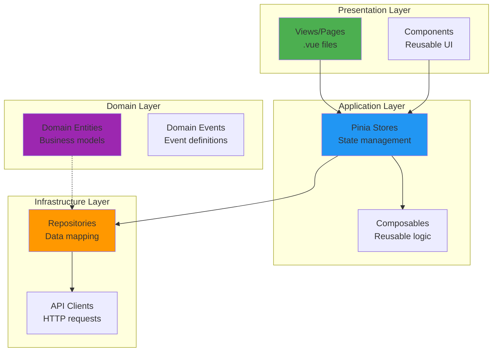

# Frontend Module Structure

- **Version**: 1.0.0-CE
- **Architecture**: Domain-Driven Design (DDD)
- **Pattern**: Modular Frontend with Dependency Injection
- **Status**: ✅ Production Ready

---

## Table of Contents

1. [Module Architecture](#module-architecture)
2. [Module Structure](#module-structure)
3. [Available Modules](#available-modules)
4. [Dependency Injection](#dependency-injection)
5. [Module Registration](#module-registration)
6. [Creating a New Module](#creating-a-new-module)

---

## Module Architecture

Each module follows a **4-layer DDD architecture**:



---

## Module Structure

### Standard Module Template

```
modules/{module-name}/
├── application/
│   ├── stores/
│   │   └── {module}-store.ts      # Pinia store
│   └── composables/
│       └── use-{module}.ts        # Composable hooks
├── domain/
│   ├── entities/
│   │   └── {Entity}.ts            # Domain entity
│   ├── value-objects/
│   │   └── {ValueObject}.ts       # Value object
│   └── events/
│       └── {Event}.ts             # Domain event
├── infrastructure/
│   ├── api/
│   │   └── {module}-api.ts        # API client
│   ├── repositories/
│   │   └── {module}-repository.ts # Repository
│   └── mappers/
│       └── {module}-mapper.ts     # DTO ↔ Entity mapper
└── presentation/
    ├── views/
    │   └── {Page}.vue             # Page views
    └── components/
        └── {Component}.vue        # Module-specific components
```

---

## Available Modules

### 1. Auth Module

**Purpose**: Authentication and user management

```
modules/auth/
├── application/
│   └── stores/
│       └── auth-store.ts
├── domain/
│   ├── entities/
│   │   └── User.ts
│   └── events/
│       ├── UserLoggedInEvent.ts
│       └── UserLoggedOutEvent.ts
├── infrastructure/
│   ├── api/
│   │   └── auth-api.ts
│   └── repositories/
│       └── auth-repository.ts
└── presentation/
    ├── views/
    │   ├── Login.vue
    │   ├── Register.vue
    │   └── ForgotPassword.vue
    └── components/
        ├── LoginForm.vue
        └── MfaInput.vue
```

**Key Features:**
- JWT authentication
- MFA support
- Session persistence
- Password reset

---

### 2. Telemetry Module

**Purpose**: Metrics, logs, and traces visualization

```
modules/telemetry/
├── application/
│   └── stores/
│       ├── metric-store.ts
│       ├── log-store.ts
│       └── trace-store.ts
├── domain/
│   ├── entities/
│   │   ├── Metric.ts
│   │   ├── Log.ts
│   │   └── Trace.ts
│   └── events/
│       ├── MetricCreatedEvent.ts
│       └── LogReceivedEvent.ts
├── infrastructure/
│   ├── api/
│   │   ├── metric-api.ts
│   │   ├── log-api.ts
│   │   └── trace-api.ts
│   └── repositories/
│       ├── metric-repository.ts
│       ├── log-repository.ts
│       └── trace-repository.ts
└── presentation/
    ├── views/
    │   ├── Metrics.vue
    │   ├── Logs.vue
    │   └── Traces.vue
    └── components/
        ├── MetricChart.vue
        ├── LogViewer.vue
        └── TraceTimeline.vue
```

**Key Features:**
- Real-time metric charts
- Log streaming
- Trace visualization
- Filters and search

---

### 3. IAM Module

**Purpose**: Identity and Access Management

```
modules/iam/
├── application/
│   └── stores/
│       ├── user-store.ts
│       ├── role-store.ts
│       ├── permission-store.ts
│       ├── organization-store.ts
│       ├── workspace-store.ts
│       └── tenant-store.ts
├── domain/
│   ├── entities/
│   │   ├── User.ts
│   │   ├── Role.ts
│   │   ├── Permission.ts
│   │   ├── Organization.ts
│   │   ├── Workspace.ts
│   │   └── Tenant.ts
│   └── events/
│       ├── UserCreatedEvent.ts
│       └── RoleAssignedEvent.ts
├── infrastructure/
│   ├── api/
│   │   ├── user-api.ts
│   │   ├── role-api.ts
│   │   ├── permission-api.ts
│   │   ├── organization-api.ts
│   │   ├── workspace-api.ts
│   │   └── tenant-api.ts
│   └── repositories/
│       ├── user-repository.ts
│       ├── role-repository.ts
│       ├── permission-repository.ts
│       ├── organization-repository.ts
│       ├── workspace-repository.ts
│       └── tenant-repository.ts
└── presentation/
    ├── views/
    │   ├── Users.vue
    │   ├── Roles.vue
    │   ├── Organizations.vue
    │   ├── Workspaces.vue
    │   └── Tenants.vue
    └── components/
        ├── UserForm.vue
        ├── RoleForm.vue
        └── PermissionMatrix.vue
```

**Key Features:**
- User management (CRUD)
- Role-based access control
- Permission management
- Multi-tenancy hierarchy

---

### 4. Monitoring Module

**Purpose**: Uptime monitoring and health checks

```
modules/monitoring/
├── application/
│   └── stores/
│       └── monitor-store.ts
├── domain/
│   ├── entities/
│   │   └── Monitor.ts
│   └── events/
│       └── MonitorTriggeredEvent.ts
├── infrastructure/
│   ├── api/
│   │   └── monitor-api.ts
│   └── repositories/
│       └── monitor-repository.ts
└── presentation/
    ├── views/
    │   └── Monitors.vue
    └── components/
        ├── MonitorCard.vue
        └── MonitorForm.vue
```

**Key Features:**
- 14 monitor types (HTTP, TCP, Ping, etc.)
- Status visualization
- Health checks
- Uptime tracking

---

### 5. API Keys Module

**Purpose**: API key management

```
modules/api-keys/
├── application/
│   └── stores/
│       └── api-key-store.ts
├── domain/
│   ├── entities/
│   │   └── ApiKey.ts
│   └── events/
│       └── ApiKeyCreatedEvent.ts
├── infrastructure/
│   ├── api/
│   │   └── api-key-api.ts
│   └── repositories/
│       └── api-key-repository.ts
└── presentation/
    ├── views/
    │   └── ApiKeys.vue
    └── components/
        └── ApiKeyForm.vue
```

**Key Features:**
- Create/revoke API keys
- Scoped permissions
- Usage tracking
- Expiration management

---

## Dependency Injection

### Main.ts - Module Registration

```typescript
// main.ts - Module initialization with dependency injection
import { createApp } from 'vue';
import App from './App.vue';

async function setupApp() {
  const app = createApp(App);

  // Setup Pinia store
  setupStore(app);

  // ========================================
  // Initialize Shared Infrastructure
  // ========================================
  const httpClientInstance = new HttpClient(
    import.meta.env.VITE_API_BASE_URL || 'http://localhost:3100'
  );

  app.provide('httpClient', httpClientInstance);
  console.log('[App] Shared infrastructure initialized');

  // ========================================
  // Initialize Auth Module
  // ========================================
  const authApi = new AuthApi(httpClientInstance);
  const authStore = useAuthStore();
  authStore.setAuthApi(authApi);
  await authStore.initializeFromStorage();

  console.log('[App] Auth module registered');

  // Setup router (after auth store is ready)
  await setupRouter(app);

  // ========================================
  // Register Telemetry Module
  // ========================================
  const metricApi = new MetricApi(httpClientInstance);
  const metricRepository = new MetricRepository(metricApi);
  app.provide('metricRepository', metricRepository);

  const metricStore = useMetricStore();
  metricStore.setRepository(metricRepository);

  console.log('[App] Telemetry module registered');

  // ========================================
  // Register IAM Module
  // ========================================
  const userApi = new UserApi(httpClientInstance);
  const userRepository = new UserRepository(userApi);
  app.provide('userRepository', userRepository);

  const userStore = useUserStore();
  userStore.setRepository(userRepository);

  console.log('[App] IAM module registered');

  // Mount app
  app.mount('#app');
}

setupApp();
```

---

## Module Registration

### Store with Dependency Injection

```typescript
// modules/telemetry/application/stores/metric-store.ts
import { defineStore } from 'pinia';
import { ref } from 'vue';
import type { Metric } from '@/modules/telemetry/domain/entities/Metric';
import type { MetricRepository } from '@/modules/telemetry/infrastructure/repositories/metric-repository';

export const useMetricStore = defineStore('metric', () => {
  // State
  const metrics = ref<Metric[]>([]);
  const loading = ref(false);

  // Infrastructure dependency (injected)
  let repository: MetricRepository | null = null;

  // Dependency injection setter
  function setRepository(repo: MetricRepository) {
    repository = repo;
    console.log('[MetricStore] Repository injected');
  }

  // Actions
  async function fetchMetrics(filters: MetricFilters) {
    if (!repository) {
      throw new Error('MetricRepository not initialized');
    }

    loading.value = true;
    try {
      metrics.value = await repository.findAll(filters);
    } catch (error) {
      console.error('[MetricStore] Failed to fetch metrics:', error);
      throw error;
    } finally {
      loading.value = false;
    }
  }

  return {
    metrics,
    loading,
    setRepository,
    fetchMetrics,
  };
});
```

---

## Creating a New Module

### Step 1: Create Module Structure

```bash
mkdir -p modules/{module-name}/{application/stores,domain/entities,infrastructure/{api,repositories},presentation/{views,components}}
```

### Step 2: Define Domain Entity

```typescript
// modules/{module-name}/domain/entities/{Entity}.ts
export class {Entity} {
  constructor(
    public readonly id: string,
    public name: string,
    // ... other properties
  ) {}

  // Business logic methods
  isValid(): boolean {
    return this.name.length > 0;
  }
}
```

### Step 3: Create API Client

```typescript
// modules/{module-name}/infrastructure/api/{module}-api.ts
import type { HttpClient } from '@/shared/infrastructure/http/http-client';

export class {Module}Api {
  constructor(private readonly httpClient: HttpClient) {}

  async getAll(filters: any): Promise<{Module}Response[]> {
    return this.httpClient.get<{Module}Response[]>('/{module}', { params: filters });
  }

  async getById(id: string): Promise<{Module}Response> {
    return this.httpClient.get<{Module}Response>(`/{module}/${id}`);
  }

  async create(data: Create{Module}Dto): Promise<{Module}Response> {
    return this.httpClient.post<{Module}Response>('/{module}', data);
  }

  async update(id: string, data: Update{Module}Dto): Promise<{Module}Response> {
    return this.httpClient.patch<{Module}Response>(`/{module}/${id}`, data);
  }

  async delete(id: string): Promise<void> {
    return this.httpClient.delete(`/{module}/${id}`);
  }
}
```

### Step 4: Create Repository

```typescript
// modules/{module-name}/infrastructure/repositories/{module}-repository.ts
import type { {Module}Api } from '../api/{module}-api';
import { {Entity} } from '@/modules/{module-name}/domain/entities/{Entity}';

export class {Module}Repository {
  constructor(private readonly api: {Module}Api) {}

  async findAll(filters: any): Promise<{Entity}[]> {
    const response = await this.api.getAll(filters);
    return response.map(this.mapToEntity);
  }

  async findById(id: string): Promise<{Entity} | null> {
    try {
      const response = await this.api.getById(id);
      return this.mapToEntity(response);
    } catch (error) {
      return null;
    }
  }

  async save(entity: {Entity}): Promise<{Entity}> {
    if (entity.id) {
      const response = await this.api.update(entity.id, this.mapToDto(entity));
      return this.mapToEntity(response);
    } else {
      const response = await this.api.create(this.mapToDto(entity));
      return this.mapToEntity(response);
    }
  }

  private mapToEntity(response: {Module}Response): {Entity} {
    return new {Entity}(
      response.id,
      response.name,
      // ... map other fields
    );
  }

  private mapToDto(entity: {Entity}): Create{Module}Dto {
    return {
      name: entity.name,
      // ... map other fields
    };
  }
}
```

### Step 5: Create Pinia Store

```typescript
// modules/{module-name}/application/stores/{module}-store.ts
import { defineStore } from 'pinia';
import { ref } from 'vue';
import type { {Entity} } from '@/modules/{module-name}/domain/entities/{Entity}';
import type { {Module}Repository } from '@/modules/{module-name}/infrastructure/repositories/{module}-repository';

export const use{Module}Store = defineStore('{module}', () => {
  // State
  const items = ref<{Entity}[]>([]);
  const loading = ref(false);

  // Infrastructure dependency
  let repository: {Module}Repository | null = null;

  // Dependency injection
  function setRepository(repo: {Module}Repository) {
    repository = repo;
  }

  // Actions
  async function fetchAll(filters: any) {
    if (!repository) throw new Error('Repository not initialized');

    loading.value = true;
    try {
      items.value = await repository.findAll(filters);
    } finally {
      loading.value = false;
    }
  }

  async function fetchById(id: string) {
    if (!repository) throw new Error('Repository not initialized');

    return await repository.findById(id);
  }

  async function save(entity: {Entity}) {
    if (!repository) throw new Error('Repository not initialized');

    return await repository.save(entity);
  }

  return {
    items,
    loading,
    setRepository,
    fetchAll,
    fetchById,
    save,
  };
});
```

### Step 6: Register Module in main.ts

```typescript
// main.ts
import { {Module}Api } from './modules/{module-name}/infrastructure/api/{module}-api';
import { {Module}Repository } from './modules/{module-name}/infrastructure/repositories/{module}-repository';
import { use{Module}Store } from './modules/{module-name}/application/stores/{module}-store';

// Register {Module} Module
const {module}Api = new {Module}Api(httpClientInstance);
const {module}Repository = new {Module}Repository({module}Api);
app.provide('{module}Repository', {module}Repository);

const {module}Store = use{Module}Store();
{module}Store.setRepository({module}Repository);

console.log('[App] {Module} module registered');
```

### Step 7: Create View Component

```vue
<!-- modules/{module-name}/presentation/views/{Module}.vue -->
<script setup lang="ts">
import { onMounted } from 'vue';
import { use{Module}Store } from '@/modules/{module-name}/application/stores/{module}-store';

const {module}Store = use{Module}Store();

onMounted(async () => {
  await {module}Store.fetchAll({});
});
</script>

<template>
  <div class="p-4">
    <h1 class="text-2xl font-bold mb-4">{Module}</h1>

    <n-spin :show="{module}Store.loading">
      <n-data-table
        :columns="columns"
        :data="{module}Store.items"
      />
    </n-spin>
  </div>
</template>
```

---

## Best Practices

1. **Dependency Injection**: Always inject dependencies through setters, not constructors
2. **Error Handling**: Handle errors at the store level, not the component level
3. **Type Safety**: Use TypeScript interfaces for all DTOs and entities
4. **Repository Pattern**: Abstract API calls behind repositories
5. **Domain Events**: Emit events for important business actions
6. **Composables**: Extract reusable logic into composables
7. **Code Splitting**: Lazy load module views and components

---

## Related Documentation

- **[00-FRONTEND-OVERVIEW.md](./00-FRONTEND-OVERVIEW.md)** - Frontend architecture
- **[03-STATE-MANAGEMENT.md](./03-STATE-MANAGEMENT.md)** - Pinia stores
- **[04-ROUTING.md](./04-ROUTING.md)** - Vue Router

---

- **Last Updated:** December 12, 2025
- **Maintained By:** DevOpsCorner Indonesia
