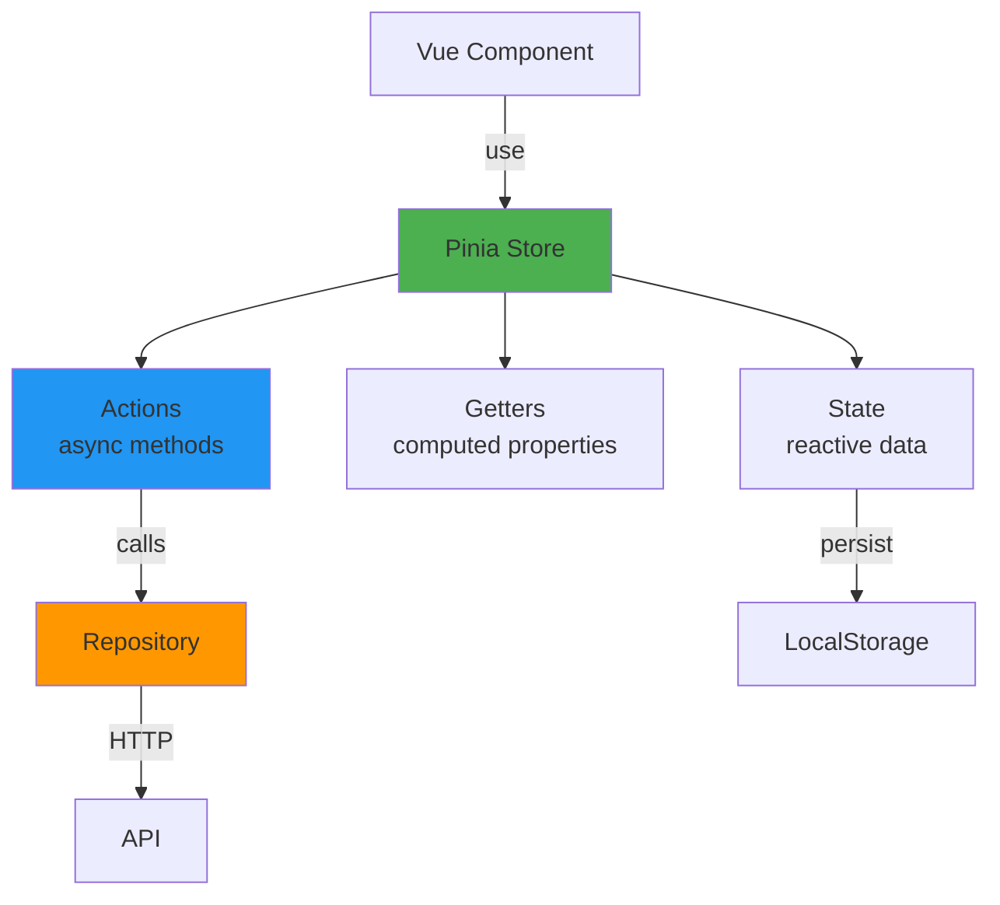

# State Management with Pinia

- **Version**: 1.1.2-CE
- **Library**: Pinia 3.0.4
- **Pattern**: Composition API Stores
- **Status**: ✅ Production Ready

---

## Table of Contents

1. [Overview](#overview)
2. [Store Architecture](#store-architecture)
3. [Available Stores](#available-stores)
4. [Creating a Store](#creating-a-store)
5. [State Persistence](#state-persistence)
6. [Best Practices](#best-practices)

---

## Overview

**Pinia** is the official state management library for Vue 3, replacing Vuex. It provides:

- **Type Safety**: Full TypeScript support
- **Devtools**: Excellent debugging experience
- **Modular**: Per-module stores
- **Composition API**: Modern reactive system
- **SSR Support**: Server-side rendering ready



---

## Store Architecture

### Composition API Style

```typescript
import { defineStore } from 'pinia';
import { ref, computed } from 'vue';

export const useMyStore = defineStore('myStore', () => {
  // State (ref)
  const count = ref(0);
  const name = ref('John');

  // Getters (computed)
  const doubleCount = computed(() => count.value * 2);
  const greeting = computed(() => `Hello, ${name.value}`);

  // Actions (functions)
  function increment() {
    count.value++;
  }

  async function fetchData() {
    const data = await api.get('/data');
    count.value = data.count;
  }

  return {
    count,
    name,
    doubleCount,
    greeting,
    increment,
    fetchData,
  };
});
```

---

## Available Stores

### 1. Auth Store

**Purpose**: Authentication and user session management

```typescript
// modules/auth/application/stores/auth-store.ts
import { defineStore } from 'pinia';
import { ref, computed } from 'vue';
import type { User } from '@/modules/auth/domain/entities/User';
import type { AuthApi } from '@/modules/auth/infrastructure/api/auth-api';

export const useAuthStore = defineStore('auth', () => {
  // ========================================
  // State
  // ========================================
  const user = ref<User | null>(null);
  const token = ref<string | null>(null);
  const refreshToken = ref<string | null>(null);
  const isAuthenticated = ref(false);
  const loading = ref(false);

  // Infrastructure dependency
  let authApi: AuthApi | null = null;

  // ========================================
  // Getters
  // ========================================
  const userFullName = computed(() => {
    if (!user.value) return '';
    return `${user.value.firstName} ${user.value.lastName}`;
  });

  const userId = computed(() => user.value?.id || null);

  // ========================================
  // Actions
  // ========================================
  function setAuthApi(api: AuthApi) {
    authApi = api;
  }

  async function login(email: string, password: string) {
    if (!authApi) throw new Error('AuthApi not initialized');

    loading.value = true;
    try {
      const response = await authApi.login(email, password);

      token.value = response.access_token;
      refreshToken.value = response.refresh_token;
      user.value = response.user;
      isAuthenticated.value = true;

      // Persist tokens
      localStorage.setItem('token', response.access_token);
      localStorage.setItem('refreshToken', response.refresh_token);

      // Emit domain event
      eventBus.emit('user.logged_in', {
        userId: user.value.id,
        email: user.value.email,
      });

      return true;
    } catch (error) {
      console.error('[AuthStore] Login failed:', error);
      throw error;
    } finally {
      loading.value = false;
    }
  }

  async function logout() {
    if (!authApi) throw new Error('AuthApi not initialized');

    try {
      await authApi.logout();
    } catch (error) {
      console.error('[AuthStore] Logout failed:', error);
    } finally {
      // Clear state regardless
      token.value = null;
      refreshToken.value = null;
      user.value = null;
      isAuthenticated.value = false;

      localStorage.removeItem('token');
      localStorage.removeItem('refreshToken');

      eventBus.emit('user.logged_out', {});
    }
  }

  async function initializeFromStorage() {
    const storedToken = localStorage.getItem('token');
    if (storedToken) {
      token.value = storedToken;
      isAuthenticated.value = true;

      // Fetch user profile
      try {
        const profile = await authApi!.getProfile();
        user.value = profile;
      } catch (error) {
        // Token invalid, clear state
        await logout();
      }
    }
  }

  return {
    // State
    user,
    token,
    isAuthenticated,
    loading,

    // Getters
    userFullName,
    userId,

    // Actions
    setAuthApi,
    login,
    logout,
    initializeFromStorage,
  };
}, {
  persist: {
    storage: localStorage,
    paths: ['token', 'refreshToken', 'user'],
  },
});
```

---

### 2. Metric Store

**Purpose**: Telemetry metrics management

```typescript
// modules/telemetry/application/stores/metric-store.ts
import { defineStore } from 'pinia';
import { ref, computed } from 'vue';
import type { Metric } from '@/modules/telemetry/domain/entities/Metric';
import type { MetricRepository } from '@/modules/telemetry/infrastructure/repositories/metric-repository';

export const useMetricStore = defineStore('metric', () => {
  // ========================================
  // State
  // ========================================
  const metrics = ref<Metric[]>([]);
  const selectedMetric = ref<Metric | null>(null);
  const loading = ref(false);
  const error = ref<string | null>(null);

  // Filters
  const filters = ref({
    metricName: '',
    startTime: null as Date | null,
    endTime: null as Date | null,
    labels: {} as Record<string, string>,
  });

  // Infrastructure dependency
  let repository: MetricRepository | null = null;

  // ========================================
  // Getters
  // ========================================
  const metricCount = computed(() => metrics.value.length);

  const filteredMetrics = computed(() => {
    return metrics.value.filter((metric) => {
      if (filters.value.metricName && !metric.name.includes(filters.value.metricName)) {
        return false;
      }
      return true;
    });
  });

  const metricNames = computed(() => {
    return [...new Set(metrics.value.map((m) => m.name))];
  });

  // ========================================
  // Actions
  // ========================================
  function setRepository(repo: MetricRepository) {
    repository = repo;
    console.log('[MetricStore] Repository injected');
  }

  async function fetchMetrics(query: MetricQuery) {
    if (!repository) throw new Error('MetricRepository not initialized');

    loading.value = true;
    error.value = null;

    try {
      metrics.value = await repository.findAll(query);
    } catch (err) {
      error.value = err instanceof Error ? err.message : 'Failed to fetch metrics';
      console.error('[MetricStore] Fetch failed:', err);
      throw err;
    } finally {
      loading.value = false;
    }
  }

  async function fetchMetricById(id: string) {
    if (!repository) throw new Error('MetricRepository not initialized');

    loading.value = true;
    try {
      const metric = await repository.findById(id);
      selectedMetric.value = metric;
      return metric;
    } catch (err) {
      error.value = err instanceof Error ? err.message : 'Failed to fetch metric';
      throw err;
    } finally {
      loading.value = false;
    }
  }

  function addMetric(metric: Metric) {
    metrics.value.push(metric);
  }

  function clearMetrics() {
    metrics.value = [];
    selectedMetric.value = null;
  }

  function setFilters(newFilters: Partial<typeof filters.value>) {
    filters.value = { ...filters.value, ...newFilters };
  }

  return {
    // State
    metrics,
    selectedMetric,
    loading,
    error,
    filters,

    // Getters
    metricCount,
    filteredMetrics,
    metricNames,

    // Actions
    setRepository,
    fetchMetrics,
    fetchMetricById,
    addMetric,
    clearMetrics,
    setFilters,
  };
});
```

---

### 3. User Store (IAM)

**Purpose**: User management

```typescript
// modules/iam/application/stores/user-store.ts
import { defineStore } from 'pinia';
import { ref, computed } from 'vue';
import type { User } from '@/modules/iam/domain/entities/User';
import type { UserRepository } from '@/modules/iam/infrastructure/repositories/user-repository';

export const useUserStore = defineStore('user', () => {
  // State
  const users = ref<User[]>([]);
  const loading = ref(false);
  const totalCount = ref(0);

  // Pagination
  const page = ref(1);
  const pageSize = ref(20);

  // Infrastructure dependency
  let repository: UserRepository | null = null;

  // Getters
  const activeUsers = computed(() => users.value.filter((u) => u.isActive));
  const totalPages = computed(() => Math.ceil(totalCount.value / pageSize.value));

  // Actions
  function setRepository(repo: UserRepository) {
    repository = repo;
  }

  async function fetchUsers(query: UserQuery = {}) {
    if (!repository) throw new Error('UserRepository not initialized');

    loading.value = true;
    try {
      const result = await repository.findAll({
        ...query,
        page: page.value,
        pageSize: pageSize.value,
      });

      users.value = result.items;
      totalCount.value = result.totalCount;
    } finally {
      loading.value = false;
    }
  }

  async function createUser(userData: CreateUserDto) {
    if (!repository) throw new Error('UserRepository not initialized');

    const user = await repository.create(userData);
    users.value.push(user);
    return user;
  }

  async function updateUser(id: string, userData: UpdateUserDto) {
    if (!repository) throw new Error('UserRepository not initialized');

    const updated = await repository.update(id, userData);
    const index = users.value.findIndex((u) => u.id === id);
    if (index !== -1) {
      users.value[index] = updated;
    }
    return updated;
  }

  async function deleteUser(id: string) {
    if (!repository) throw new Error('UserRepository not initialized');

    await repository.delete(id);
    users.value = users.value.filter((u) => u.id !== id);
  }

  function setPage(newPage: number) {
    page.value = newPage;
  }

  return {
    users,
    loading,
    totalCount,
    page,
    pageSize,
    activeUsers,
    totalPages,
    setRepository,
    fetchUsers,
    createUser,
    updateUser,
    deleteUser,
    setPage,
  };
});
```

---

## Creating a Store

### 1. Basic Store Template

```typescript
import { defineStore } from 'pinia';
import { ref, computed } from 'vue';

export const useMyStore = defineStore('myStore', () => {
  // ========================================
  // State
  // ========================================
  const items = ref<Item[]>([]);
  const loading = ref(false);
  const error = ref<string | null>(null);

  // Infrastructure dependency (optional)
  let repository: MyRepository | null = null;

  // ========================================
  // Getters
  // ========================================
  const itemCount = computed(() => items.value.length);

  const activeItems = computed(() => {
    return items.value.filter((item) => item.isActive);
  });

  // ========================================
  // Actions
  // ========================================
  function setRepository(repo: MyRepository) {
    repository = repo;
  }

  async function fetchItems(query: QueryParams) {
    if (!repository) throw new Error('Repository not initialized');

    loading.value = true;
    error.value = null;

    try {
      items.value = await repository.findAll(query);
    } catch (err) {
      error.value = err instanceof Error ? err.message : 'Fetch failed';
      throw err;
    } finally {
      loading.value = false;
    }
  }

  function addItem(item: Item) {
    items.value.push(item);
  }

  function removeItem(id: string) {
    items.value = items.value.filter((item) => item.id !== id);
  }

  function clearItems() {
    items.value = [];
  }

  return {
    // State
    items,
    loading,
    error,

    // Getters
    itemCount,
    activeItems,

    // Actions
    setRepository,
    fetchItems,
    addItem,
    removeItem,
    clearItems,
  };
});
```

---

### 2. Using the Store in Components

```vue
<script setup lang="ts">
import { onMounted } from 'vue';
import { useMyStore } from '@/stores/my-store';

const myStore = useMyStore();

onMounted(async () => {
  await myStore.fetchItems({ limit: 100 });
});

async function handleCreate() {
  const newItem = { name: 'New Item', isActive: true };
  myStore.addItem(newItem);
}

function handleDelete(id: string) {
  myStore.removeItem(id);
}
</script>

<template>
  <div>
    <h1>Items ({{ myStore.itemCount }})</h1>

    <n-spin :show="myStore.loading">
      <n-list>
        <n-list-item v-for="item in myStore.items" :key="item.id">
          {{ item.name }}
          <n-button @click="handleDelete(item.id)">Delete</n-button>
        </n-list-item>
      </n-list>
    </n-spin>

    <n-button @click="handleCreate">Create Item</n-button>
  </div>
</template>
```

---

## State Persistence

### Using pinia-plugin-persistedstate

```typescript
// store/index.ts
import { createPinia } from 'pinia';
import piniaPluginPersistedstate from 'pinia-plugin-persistedstate';

const pinia = createPinia();
pinia.use(piniaPluginPersistedstate);

export default pinia;

// Usage in store
export const useAuthStore = defineStore('auth', () => {
  const token = ref<string | null>(null);
  const user = ref<User | null>(null);

  return { token, user };
}, {
  persist: {
    storage: localStorage,
    paths: ['token', 'user'], // Only persist these fields
  },
});
```

---

## Best Practices

### 1. Dependency Injection

**✅ Good:**
```typescript
export const useMyStore = defineStore('myStore', () => {
  let repository: MyRepository | null = null;

  function setRepository(repo: MyRepository) {
    repository = repo;
  }

  async function fetchData() {
    if (!repository) throw new Error('Repository not initialized');
    return await repository.findAll();
  }

  return { setRepository, fetchData };
});
```

**❌ Bad:**
```typescript
import { myRepository } from '@/repositories'; // Direct import

export const useMyStore = defineStore('myStore', () => {
  async function fetchData() {
    return await myRepository.findAll(); // Tight coupling
  }

  return { fetchData };
});
```

---

### 2. Error Handling

**✅ Good:**
```typescript
async function fetchData() {
  loading.value = true;
  error.value = null;

  try {
    data.value = await repository.findAll();
  } catch (err) {
    error.value = err instanceof Error ? err.message : 'Unknown error';
    console.error('[Store] Fetch failed:', err);
    throw err; // Re-throw for component to handle
  } finally {
    loading.value = false;
  }
}
```

**❌ Bad:**
```typescript
async function fetchData() {
  data.value = await repository.findAll(); // No error handling
}
```

---

### 3. Type Safety

**✅ Good:**
```typescript
interface User {
  id: string;
  email: string;
  firstName: string;
  lastName: string;
}

const users = ref<User[]>([]);
```

**❌ Bad:**
```typescript
const users = ref([]); // No type information
```

---

### 4. Computed Properties for Derived State

**✅ Good:**
```typescript
const items = ref<Item[]>([]);

const activeItems = computed(() => {
  return items.value.filter((item) => item.isActive);
});

const itemCount = computed(() => items.value.length);
```

**❌ Bad:**
```typescript
const items = ref<Item[]>([]);
const activeItems = ref<Item[]>([]); // Duplicate state

function updateActiveItems() {
  activeItems.value = items.value.filter((item) => item.isActive);
}
```

---

### 5. Store Composition

```typescript
// Using multiple stores together
export const useCartStore = defineStore('cart', () => {
  const authStore = useAuthStore(); // Access other stores
  const productStore = useProductStore();

  async function addToCart(productId: string) {
    if (!authStore.isAuthenticated) {
      throw new Error('User not authenticated');
    }

    const product = await productStore.fetchProduct(productId);
    // ... add to cart logic
  }

  return { addToCart };
});
```

---

## Related Documentation

- **[00-FRONTEND-OVERVIEW.md](./00-FRONTEND-OVERVIEW.md)** - Frontend architecture
- **[02-MODULE-STRUCTURE.md](./02-MODULE-STRUCTURE.md)** - Module organization
- **[04-ROUTING.md](./04-ROUTING.md)** - Vue Router

---

- **Last Updated:** January 01st, 2026
- **Maintained By:** DevOpsCorner Indonesia
