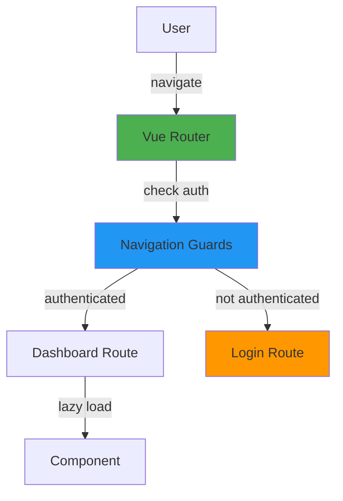
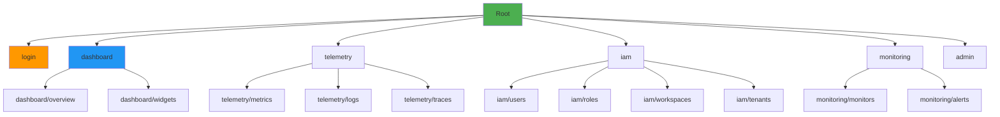

# Vue Router Configuration

- **Version**: 1.0.0-CE
- **Library**: Vue Router 4.6.3
- **Mode**: History (HTML5)
- **Status**: ✅ Production Ready

---

## Table of Contents

1. [Overview](#overview)
2. [Router Setup](#router-setup)
3. [Route Structure](#route-structure)
4. [Navigation Guards](#navigation-guards)
5. [Route Meta Fields](#route-meta-fields)
6. [Lazy Loading](#lazy-loading)
7. [Dynamic Routes](#dynamic-routes)
8. [Best Practices](#best-practices)

---

## Overview

Vue Router provides **client-side routing** for single-page applications:



---

## Router Setup

### Installation and Configuration

```typescript
// router/index.ts
import { createRouter, createWebHistory, type RouteRecordRaw } from 'vue-router';
import { setupRouterGuard } from './guard/route';
import { createRouteModules } from './routes/modules';

const routes: RouteRecordRaw[] = [
  {
    path: '/',
    redirect: '/dashboard',
  },
  ...createRouteModules(),
];

const router = createRouter({
  history: createWebHistory(import.meta.env.VITE_BASE_URL || '/'),
  routes,
  scrollBehavior: () => ({ left: 0, top: 0 }),
});

// Setup navigation guards
setupRouterGuard(router);

export default router;
```

---

## Route Structure

### Main Routes



### Route Definitions

```typescript
// router/routes/modules/index.ts
export function createRouteModules(): RouteRecordRaw[] {
  return [
    // Auth Routes
    {
      path: '/login',
      name: 'Login',
      component: () => import('@/modules/auth/presentation/views/Login.vue'),
      meta: {
        title: 'Login',
        requiresAuth: false,
        layout: 'blank',
      },
    },
    {
      path: '/register',
      name: 'Register',
      component: () => import('@/modules/auth/presentation/views/Register.vue'),
      meta: {
        title: 'Register',
        requiresAuth: false,
        layout: 'blank',
      },
    },

    // Dashboard Routes
    {
      path: '/dashboard',
      name: 'Dashboard',
      component: () => import('@/views/dashboard/Index.vue'),
      meta: {
        title: 'Dashboard',
        requiresAuth: true,
        permissions: ['DASHBOARD_READ'],
      },
      children: [
        {
          path: 'overview',
          name: 'DashboardOverview',
          component: () => import('@/views/dashboard/Overview.vue'),
          meta: {
            title: 'Dashboard Overview',
            requiresAuth: true,
          },
        },
        {
          path: 'widgets',
          name: 'DashboardWidgets',
          component: () => import('@/views/dashboard/Widgets.vue'),
          meta: {
            title: 'Dashboard Widgets',
            requiresAuth: true,
          },
        },
      ],
    },

    // Telemetry Routes
    {
      path: '/telemetry',
      name: 'Telemetry',
      component: () => import('@/layouts/TelemetryLayout.vue'),
      meta: {
        title: 'Telemetry',
        requiresAuth: true,
      },
      children: [
        {
          path: 'metrics',
          name: 'Metrics',
          component: () => import('@/modules/telemetry/presentation/views/Metrics.vue'),
          meta: {
            title: 'Metrics',
            requiresAuth: true,
            permissions: ['TELEMETRY_READ'],
          },
        },
        {
          path: 'logs',
          name: 'Logs',
          component: () => import('@/modules/telemetry/presentation/views/Logs.vue'),
          meta: {
            title: 'Logs',
            requiresAuth: true,
            permissions: ['TELEMETRY_READ'],
          },
        },
        {
          path: 'traces',
          name: 'Traces',
          component: () => import('@/modules/telemetry/presentation/views/Traces.vue'),
          meta: {
            title: 'Traces',
            requiresAuth: true,
            permissions: ['TELEMETRY_READ'],
          },
        },
      ],
    },

    // IAM Routes
    {
      path: '/iam',
      name: 'IAM',
      component: () => import('@/layouts/AdminLayout.vue'),
      meta: {
        title: 'IAM',
        requiresAuth: true,
        roles: ['ADMIN', 'DEVELOPER'],
      },
      children: [
        {
          path: 'users',
          name: 'Users',
          component: () => import('@/modules/iam/presentation/views/Users.vue'),
          meta: {
            title: 'Users',
            requiresAuth: true,
            permissions: ['USER_READ'],
          },
        },
        {
          path: 'roles',
          name: 'Roles',
          component: () => import('@/modules/iam/presentation/views/Roles.vue'),
          meta: {
            title: 'Roles',
            requiresAuth: true,
            permissions: ['ROLE_READ'],
          },
        },
        {
          path: 'workspaces',
          name: 'Workspaces',
          component: () => import('@/modules/iam/presentation/views/Workspaces.vue'),
          meta: {
            title: 'Workspaces',
            requiresAuth: true,
            permissions: ['WORKSPACE_READ'],
          },
        },
        {
          path: 'tenants',
          name: 'Tenants',
          component: () => import('@/modules/iam/presentation/views/Tenants.vue'),
          meta: {
            title: 'Tenants',
            requiresAuth: true,
            permissions: ['TENANT_READ'],
          },
        },
      ],
    },

    // Monitoring Routes
    {
      path: '/monitoring',
      name: 'Monitoring',
      component: () => import('@/layouts/DashboardLayout.vue'),
      meta: {
        title: 'Monitoring',
        requiresAuth: true,
      },
      children: [
        {
          path: 'monitors',
          name: 'Monitors',
          component: () => import('@/modules/monitoring/presentation/views/Monitors.vue'),
          meta: {
            title: 'Uptime Monitors',
            requiresAuth: true,
            permissions: ['MONITOR_READ'],
          },
        },
        {
          path: 'alerts',
          name: 'Alerts',
          component: () => import('@/views/monitoring/Alerts.vue'),
          meta: {
            title: 'Alerts',
            requiresAuth: true,
            permissions: ['ALERT_READ'],
          },
        },
      ],
    },

    // 404 Not Found
    {
      path: '/:pathMatch(.*)*',
      name: 'NotFound',
      component: () => import('@/views/errors/NotFound.vue'),
      meta: {
        title: '404 Not Found',
        requiresAuth: false,
      },
    },
  ];
}
```

---

## Navigation Guards

### Route Guard Setup

```typescript
// router/guard/route.ts
import { Router } from 'vue-router';
import { useAuthStore } from '@/modules/auth/application/stores/auth-store';
import { usePermissionStore } from '@/modules/iam/application/stores/permission-store';

export function setupRouterGuard(router: Router) {
  router.beforeEach(async (to, from, next) => {
    const authStore = useAuthStore();
    const permissionStore = usePermissionStore();

    // 1. Check authentication
    if (to.meta.requiresAuth && !authStore.isAuthenticated) {
      console.log('[Router] Redirecting to login - not authenticated');
      next({
        path: '/login',
        query: { redirect: to.fullPath }, // Save intended destination
      });
      return;
    }

    // 2. Check role-based access
    if (to.meta.roles && authStore.user) {
      const userRole = authStore.user.role;
      const allowedRoles = to.meta.roles as string[];

      if (!allowedRoles.includes(userRole)) {
        console.log('[Router] Access denied - insufficient role');
        next('/403'); // Forbidden
        return;
      }
    }

    // 3. Check permission-based access
    if (to.meta.permissions && authStore.isAuthenticated) {
      const requiredPermissions = to.meta.permissions as string[];
      const hasPermission = permissionStore.hasPermissions(requiredPermissions);

      if (!hasPermission) {
        console.log('[Router] Access denied - missing permissions');
        next('/403'); // Forbidden
        return;
      }
    }

    // 4. Update page title
    if (to.meta.title) {
      document.title = `${to.meta.title} - TelemetryFlow`;
    }

    // 5. Allow navigation
    next();
  });

  router.afterEach((to, from) => {
    console.log(`[Router] Navigated from ${from.path} to ${to.path}`);

    // Track page view (analytics)
    if (window.gtag) {
      window.gtag('config', 'GA_MEASUREMENT_ID', {
        page_path: to.path,
      });
    }
  });

  router.onError((error) => {
    console.error('[Router] Navigation error:', error);
  });
}
```

---

## Route Meta Fields

### Meta Field Definitions

```typescript
// typings/router.d.ts
import 'vue-router';

declare module 'vue-router' {
  interface RouteMeta {
    /** Page title */
    title?: string;

    /** Requires authentication */
    requiresAuth?: boolean;

    /** Allowed roles */
    roles?: string[];

    /** Required permissions */
    permissions?: string[];

    /** Layout to use */
    layout?: 'default' | 'blank' | 'admin';

    /** Hide in breadcrumbs */
    hideBreadcrumb?: boolean;

    /** Icon for menu */
    icon?: string;

    /** Order in menu */
    order?: number;

    /** Keep alive */
    keepAlive?: boolean;
  }
}
```

### Usage Example

```typescript
{
  path: '/dashboard',
  name: 'Dashboard',
  component: () => import('@/views/dashboard/Index.vue'),
  meta: {
    title: 'Dashboard',
    requiresAuth: true,
    permissions: ['DASHBOARD_READ'],
    layout: 'default',
    icon: 'i-mdi-view-dashboard',
    order: 1,
    keepAlive: true,
  },
}
```

---

## Lazy Loading

### Component Lazy Loading

```typescript
// Lazy load route component
{
  path: '/dashboard',
  component: () => import('@/views/dashboard/Index.vue'),
}

// Preload for faster navigation
{
  path: '/dashboard',
  component: () => import(
    /* webpackPrefetch: true */
    '@/views/dashboard/Index.vue'
  ),
}

// Chunk naming for better debugging
{
  path: '/dashboard',
  component: () => import(
    /* webpackChunkName: "dashboard" */
    '@/views/dashboard/Index.vue'
  ),
}
```

---

## Dynamic Routes

### Route with Parameters

```typescript
{
  path: '/users/:userId',
  name: 'UserDetail',
  component: () => import('@/views/users/Detail.vue'),
  props: true, // Pass route params as props
}

// Usage in component
<script setup lang="ts">
const props = defineProps<{
  userId: string
}>();

onMounted(() => {
  console.log('User ID:', props.userId);
});
</script>
```

### Programmatic Navigation

```typescript
import { useRouter, useRoute } from 'vue-router';

const router = useRouter();
const route = useRoute();

// Navigate to route
router.push('/dashboard');
router.push({ name: 'Dashboard' });
router.push({ path: '/users/123' });

// Navigate with query params
router.push({
  path: '/search',
  query: { q: 'vue' },
});

// Navigate with params
router.push({
  name: 'UserDetail',
  params: { userId: '123' },
});

// Replace current route (no history entry)
router.replace('/dashboard');

// Go back/forward
router.back();
router.forward();
router.go(-1); // Go back 1 step

// Access current route
console.log(route.path); // /dashboard
console.log(route.params); // { userId: '123' }
console.log(route.query); // { q: 'vue' }
```

---

## Best Practices

### 1. Use Named Routes

**✅ Good:**
```typescript
router.push({ name: 'Dashboard' });
```

**❌ Bad:**
```typescript
router.push('/dashboard');
```

---

### 2. Lazy Load Routes

**✅ Good:**
```typescript
{
  path: '/dashboard',
  component: () => import('@/views/dashboard/Index.vue'),
}
```

**❌ Bad:**
```typescript
import Dashboard from '@/views/dashboard/Index.vue';

{
  path: '/dashboard',
  component: Dashboard,
}
```

---

### 3. Use Route Props

**✅ Good:**
```typescript
{
  path: '/users/:userId',
  component: UserDetail,
  props: true,
}

// Component
const props = defineProps<{ userId: string }>();
```

**❌ Bad:**
```typescript
// Component
const route = useRoute();
const userId = route.params.userId; // Tight coupling
```

---

### 4. Centralize Navigation Guards

**✅ Good:**
```typescript
// router/guard/route.ts
export function setupRouterGuard(router: Router) {
  router.beforeEach(async (to, from, next) => {
    // Centralized auth check
    if (to.meta.requiresAuth && !authStore.isAuthenticated) {
      next('/login');
      return;
    }
    next();
  });
}
```

**❌ Bad:**
```vue
<!-- Every component -->
<script setup>
onMounted(() => {
  if (!authStore.isAuthenticated) {
    router.push('/login');
  }
});
</script>
```

---

### 5. Handle 404s Properly

```typescript
{
  path: '/:pathMatch(.*)*',
  name: 'NotFound',
  component: () => import('@/views/errors/NotFound.vue'),
}
```

---

## Route Transitions

```vue
<template>
  <router-view v-slot="{ Component, route }">
    <transition :name="route.meta.transition || 'fade'" mode="out-in">
      <component :is="Component" :key="route.path" />
    </transition>
  </router-view>
</template>

<style scoped>
.fade-enter-active, .fade-leave-active {
  transition: opacity 0.3s;
}
.fade-enter-from, .fade-leave-to {
  opacity: 0;
}
</style>
```

---

## Scroll Behavior

```typescript
const router = createRouter({
  history: createWebHistory(),
  routes,
  scrollBehavior(to, from, savedPosition) {
    // Restore saved position (back/forward buttons)
    if (savedPosition) {
      return savedPosition;
    }

    // Scroll to anchor
    if (to.hash) {
      return { el: to.hash, behavior: 'smooth' };
    }

    // Scroll to top
    return { left: 0, top: 0 };
  },
});
```

---

## Related Documentation

- **[00-FRONTEND-OVERVIEW.md](./00-FRONTEND-OVERVIEW.md)** - Frontend architecture
- **[02-MODULE-STRUCTURE.md](./02-MODULE-STRUCTURE.md)** - Module organization
- **[03-STATE-MANAGEMENT.md](./03-STATE-MANAGEMENT.md)** - Pinia stores

---

- **Last Updated:** December 12, 2025
- **Maintained By:** DevOpsCorner Indonesia
