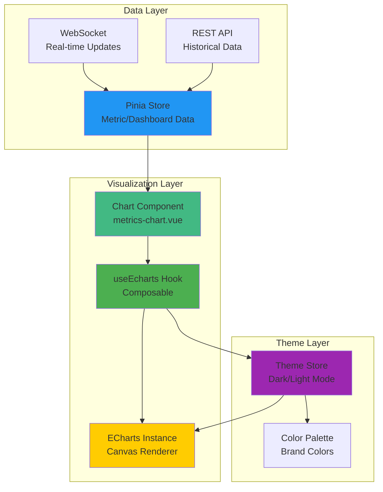
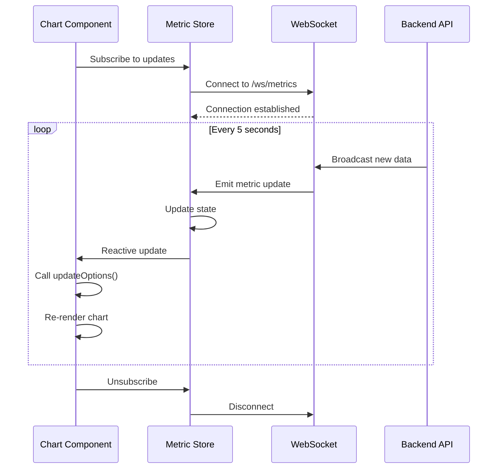

# Frontend Module: Data Visualization

- **Module**: `frontend/visualization`
- **Category**: Frontend / Presentation
- **Status**: Production Ready
- **Priority:** 🔥 HIGH - User Experience
- **Version**: 1.1.1-CE

---

## Overview

The **Data Visualization module** provides comprehensive charting and visualization capabilities using **ECharts 6.0.0**. Features:

- **12+ chart types**: Line, Bar, Pie, Gauge, Radar, Scatter, and more
- **Real-time updates**: WebSocket-powered live data streaming
- **Responsive design**: Auto-resize on window/container changes
- **Theme support**: Automatic dark/light mode switching
- **Performance optimized**: Tree-shaking, lazy loading, canvas rendering
- **Type-safe**: Full TypeScript support with ECOption types
- **Composable architecture**: Reusable `useEcharts` hook

---

## Architecture



---

## ECharts Integration

### Installation & Setup

**Package Installation:**
```json
{
  "dependencies": {
    "echarts": "^6.0.0",
    "@vueuse/core": "^11.5.0"
  }
}
```

**Tree-Shaking Configuration:**
```typescript
// hooks/common/echarts.ts
import * as echarts from 'echarts/core';
import {
  BarChart,
  GaugeChart,
  LineChart,
  PictorialBarChart,
  PieChart,
  RadarChart,
  ScatterChart
} from 'echarts/charts';

import {
  DatasetComponent,
  GridComponent,
  LegendComponent,
  TitleComponent,
  ToolboxComponent,
  TooltipComponent,
  TransformComponent
} from 'echarts/components';

import { LabelLayout, UniversalTransition } from 'echarts/features';
import { CanvasRenderer } from 'echarts/renderers';

// Register components (tree-shaking)
echarts.use([
  TitleComponent,
  LegendComponent,
  TooltipComponent,
  GridComponent,
  DatasetComponent,
  TransformComponent,
  ToolboxComponent,
  BarChart,
  LineChart,
  PieChart,
  ScatterChart,
  PictorialBarChart,
  RadarChart,
  GaugeChart,
  LabelLayout,
  UniversalTransition,
  CanvasRenderer
]);
```

---

## useEcharts Composable

### API Reference

```typescript
// Type Definition
export type ECOption = echarts.ComposeOption<
  | BarSeriesOption
  | LineSeriesOption
  | PieSeriesOption
  | ScatterSeriesOption
  | PictorialBarSeriesOption
  | RadarSeriesOption
  | GaugeSeriesOption
  | TitleComponentOption
  | LegendComponentOption
  | TooltipComponentOption
  | GridComponentOption
  | ToolboxComponentOption
  | DatasetComponentOption
>;

interface ChartHooks {
  onRender?: (chart: echarts.ECharts) => void | Promise<void>;
  onUpdated?: (chart: echarts.ECharts) => void | Promise<void>;
  onDestroy?: (chart: echarts.ECharts) => void | Promise<void>;
}

function useEcharts<T extends ECOption>(
  optionsFactory: () => T,
  hooks?: ChartHooks
): {
  domRef: Ref<HTMLElement | null>;
  chart: Ref<echarts.ECharts | null>;
  updateOptions: (callback: (opts: T) => ECOption) => Promise<void>;
  setOptions: (options: T) => void;
}
```

### Features

**1. Automatic Resize:**
- Watches container size changes using `@vueuse/core`
- Auto-resizes chart on window/container resize
- No manual resize handling required

**2. Theme Support:**
- Automatically switches between light/dark themes
- Destroys and re-initializes chart on theme change
- Custom color palette integration

**3. Lifecycle Hooks:**
- `onRender`: Called when chart is first rendered (show loading)
- `onUpdated`: Called when chart options are updated (hide loading)
- `onDestroy`: Called when chart is destroyed (cleanup)

**4. Performance Optimization:**
- Uses `shallowRef` for reactive chart instance
- Debounced resize handling
- Canvas renderer (hardware acceleration)
- Transparent background for better integration

---

## Chart Types

### 1. Line Chart (Time Series)

```vue
<script setup lang="ts">
import { useEcharts } from '@/hooks/common/echarts';
import { watch } from 'vue';

const { domRef, updateOptions } = useEcharts(() => ({
  title: {
    text: 'Metrics Time Series',
    left: 'center'
  },
  tooltip: {
    trigger: 'axis',
    axisPointer: {
      type: 'cross'
    }
  },
  legend: {
    data: ['CPU Usage'],
    top: 40
  },
  grid: {
    left: '3%',
    right: '4%',
    bottom: '3%',
    top: '100px',
    containLabel: true
  },
  xAxis: {
    type: 'category',
    boundaryGap: false,
    data: [],
    axisLabel: {
      formatter: (value: string) => dayjs(value).format('HH:mm:ss')
    }
  },
  yAxis: {
    type: 'value',
    name: 'Usage (%)',
    axisLabel: {
      formatter: '{value}%'
    }
  },
  dataZoom: [
    {
      type: 'inside',
      start: 0,
      end: 100
    },
    {
      start: 0,
      end: 100
    }
  ],
  series: [
    {
      name: 'CPU Usage',
      type: 'line',
      smooth: true,
      symbol: 'circle',
      symbolSize: 6,
      lineStyle: {
        width: 2,
        color: '#8e9dff'
      },
      itemStyle: {
        color: '#8e9dff'
      },
      areaStyle: {
        color: {
          type: 'linear',
          x: 0,
          y: 0,
          x2: 0,
          y2: 1,
          colorStops: [
            {
              offset: 0,
              color: 'rgba(142, 157, 255, 0.3)'
            },
            {
              offset: 1,
              color: 'rgba(142, 157, 255, 0.05)'
            }
          ]
        }
      },
      data: []
    }
  ]
}));

// Watch for data changes
watch(
  () => metricStore.timeSeriesData,
  (data) => {
    updateOptions(opts => {
      opts.xAxis.data = data.map(d => d.timestamp);
      opts.series[0].data = data.map(d => d.value);
      return opts;
    });
  },
  { immediate: true, deep: true }
);
</script>

<template>
  <div ref="domRef" class="h-400px"></div>
</template>
```

**Use Cases:**
- Metric time series (CPU, memory, network, latency)
- Request rate over time
- Error rate tracking
- SLA/SLO monitoring

---

### 2. Bar Chart (Comparison)

```typescript
const { domRef, updateOptions } = useEcharts(() => ({
  title: {
    text: 'Top 10 Services by Request Count'
  },
  tooltip: {
    trigger: 'axis',
    axisPointer: {
      type: 'shadow'
    }
  },
  grid: {
    left: '3%',
    right: '4%',
    bottom: '3%',
    top: '60px',
    containLabel: true
  },
  xAxis: {
    type: 'category',
    data: ['api-gateway', 'auth-service', 'user-service', 'payment-service', 'notification-service'],
    axisLabel: {
      rotate: 45
    }
  },
  yAxis: {
    type: 'value',
    name: 'Request Count'
  },
  series: [
    {
      name: 'Requests',
      type: 'bar',
      data: [12500, 9800, 7600, 5400, 3200],
      itemStyle: {
        color: {
          type: 'linear',
          x: 0,
          y: 0,
          x2: 0,
          y2: 1,
          colorStops: [
            { offset: 0, color: '#8e9dff' },
            { offset: 1, color: '#3c5afe' }
          ]
        }
      }
    }
  ]
}));
```

**Use Cases:**
- Service comparison (request count, error rate)
- Top N queries (endpoints, users, tenants)
- Resource usage comparison
- Alert frequency by rule

---

### 3. Pie Chart (Distribution)

```typescript
const { domRef, updateOptions } = useEcharts(() => ({
  title: {
    text: 'Traffic Distribution by Service',
    left: 'center'
  },
  tooltip: {
    trigger: 'item',
    formatter: '{a} <br/>{b}: {c} ({d}%)'
  },
  legend: {
    orient: 'vertical',
    left: 'left',
    top: '20%'
  },
  series: [
    {
      name: 'Service Traffic',
      type: 'pie',
      radius: ['40%', '70%'],
      avoidLabelOverlap: false,
      itemStyle: {
        borderRadius: 10,
        borderColor: '#fff',
        borderWidth: 2
      },
      label: {
        show: false,
        position: 'center'
      },
      emphasis: {
        label: {
          show: true,
          fontSize: 20,
          fontWeight: 'bold'
        }
      },
      labelLine: {
        show: false
      },
      data: [
        { value: 1048, name: 'API Gateway' },
        { value: 735, name: 'Auth Service' },
        { value: 580, name: 'User Service' },
        { value: 484, name: 'Payment Service' },
        { value: 300, name: 'Notification Service' }
      ]
    }
  ]
}));
```

**Use Cases:**
- Traffic distribution by service/endpoint
- Error distribution by type
- Resource allocation (CPU, memory, disk)
- Alert distribution by severity

---

### 4. Gauge Chart (Single Metric)

```typescript
const { domRef, updateOptions } = useEcharts(() => ({
  series: [
    {
      type: 'gauge',
      startAngle: 180,
      endAngle: 0,
      min: 0,
      max: 100,
      splitNumber: 10,
      axisLine: {
        lineStyle: {
          width: 6,
          color: [
            [0.7, '#67e0e3'],
            [0.9, '#ffc107'],
            [1, '#ff5252']
          ]
        }
      },
      pointer: {
        itemStyle: {
          color: 'auto'
        }
      },
      axisTick: {
        distance: -30,
        length: 8,
        lineStyle: {
          color: '#fff',
          width: 2
        }
      },
      splitLine: {
        distance: -30,
        length: 30,
        lineStyle: {
          color: '#fff',
          width: 4
        }
      },
      axisLabel: {
        color: 'inherit',
        distance: 40,
        fontSize: 12
      },
      detail: {
        valueAnimation: true,
        formatter: '{value}%',
        color: 'inherit',
        fontSize: 30,
        offsetCenter: [0, '70%']
      },
      data: [
        {
          value: 68.5,
          name: 'CPU Usage'
        }
      ]
    }
  ]
}));
```

**Use Cases:**
- Real-time CPU/Memory usage
- SLA percentage
- Cache hit ratio
- Uptime percentage

---

### 5. Radar Chart (Multi-dimensional)

```typescript
const { domRef, updateOptions } = useEcharts(() => ({
  title: {
    text: 'Service Health Score'
  },
  legend: {
    data: ['api-gateway', 'auth-service']
  },
  radar: {
    indicator: [
      { name: 'Availability', max: 100 },
      { name: 'Performance', max: 100 },
      { name: 'Error Rate', max: 100 },
      { name: 'Latency', max: 100 },
      { name: 'Throughput', max: 100 }
    ]
  },
  series: [
    {
      name: 'Service Health',
      type: 'radar',
      data: [
        {
          value: [99.5, 85, 98, 90, 95],
          name: 'api-gateway',
          areaStyle: {
            color: 'rgba(142, 157, 255, 0.3)'
          }
        },
        {
          value: [99.8, 92, 99, 95, 88],
          name: 'auth-service',
          areaStyle: {
            color: 'rgba(76, 175, 80, 0.3)'
          }
        }
      ]
    }
  ]
}));
```

**Use Cases:**
- Service health score
- Multi-metric comparison
- Performance benchmarking
- Quality metrics

---

### 6. Scatter Chart (Correlation)

```typescript
const { domRef, updateOptions } = useEcharts(() => ({
  title: {
    text: 'Request Latency vs Throughput'
  },
  tooltip: {
    trigger: 'item',
    formatter: 'Latency: {c}ms<br/>Throughput: {value[1]} req/s'
  },
  xAxis: {
    name: 'Latency (ms)',
    type: 'value'
  },
  yAxis: {
    name: 'Throughput (req/s)',
    type: 'value'
  },
  series: [
    {
      symbolSize: 10,
      data: [
        [10.0, 8.04],
        [8.07, 6.95],
        [13.0, 7.58],
        [9.05, 8.81],
        [11.0, 8.33]
      ],
      type: 'scatter',
      itemStyle: {
        color: '#8e9dff'
      }
    }
  ]
}));
```

**Use Cases:**
- Latency vs throughput analysis
- Error rate correlation
- Resource usage patterns
- Performance bottleneck identification

---

## Real-Time Updates

### WebSocket Integration



### Implementation

```vue
<script setup lang="ts">
import { useEcharts } from '@/hooks/common/echarts';
import { useWebSocket } from '@/composables/use-websocket';
import { watch } from 'vue';

const metricStore = useMetricStore();
const { domRef, updateOptions } = useEcharts(() => ({
  // ... chart options
}));

// Connect to WebSocket
const { data: wsData, isConnected } = useWebSocket('/ws/metrics', {
  autoConnect: true,
  heartbeat: true
});

// Watch WebSocket data
watch(wsData, (newData) => {
  if (!newData) return;

  updateOptions(opts => {
    // Append new data point
    opts.xAxis.data.push(newData.timestamp);
    opts.series[0].data.push(newData.value);

    // Keep only last 100 data points
    if (opts.xAxis.data.length > 100) {
      opts.xAxis.data.shift();
      opts.series[0].data.shift();
    }

    return opts;
  });
});
</script>

<template>
  <div ref="domRef" class="h-400px">
    <div v-if="!isConnected" class="absolute top-2 right-2">
      <NTag type="error">Disconnected</NTag>
    </div>
  </div>
</template>
```

---

## Theme Support

### Dark/Light Mode Switching

```typescript
// useEcharts automatically handles theme switching
const themeStore = useThemeStore();
const darkMode = computed(() => themeStore.darkMode);

// When darkMode changes:
// 1. Destroy existing chart
// 2. Reinitialize with new theme ('dark' or 'light')
// 3. Apply chart options
// 4. Call onUpdated hook

watch(darkMode, async () => {
  await destroy();
  await render();
  await onUpdated?.(chart.value!);
});
```

### Custom Color Palette

```typescript
// Theme colors
const themeColors = {
  light: {
    primary: '#8e9dff',
    success: '#52c41a',
    warning: '#ffc107',
    error: '#ff5252',
    info: '#2196f3'
  },
  dark: {
    primary: '#8e9dff',
    success: '#73d13d',
    warning: '#ffa940',
    error: '#ff7875',
    info: '#40a9ff'
  }
};

// Apply to chart
const { domRef } = useEcharts(() => ({
  series: [{
    type: 'line',
    itemStyle: {
      color: darkMode.value
        ? themeColors.dark.primary
        : themeColors.light.primary
    }
  }]
}));
```

---

## Dashboard Widget Types

### Widget Configurations

```typescript
export const WIDGET_TYPES = {
  LINE_CHART: {
    type: 'line_chart',
    name: 'Line Chart',
    icon: 'mdi:chart-line',
    minWidth: 2,
    minHeight: 2,
    defaultConfig: {
      metricQuery: '',
      aggregation: 'avg',
      timeRange: '1h',
      refreshInterval: 30
    }
  },
  BAR_CHART: {
    type: 'bar_chart',
    name: 'Bar Chart',
    icon: 'mdi:chart-bar',
    minWidth: 2,
    minHeight: 2
  },
  PIE_CHART: {
    type: 'pie_chart',
    name: 'Pie Chart',
    icon: 'mdi:chart-pie',
    minWidth: 2,
    minHeight: 2
  },
  GAUGE: {
    type: 'gauge',
    name: 'Gauge',
    icon: 'mdi:gauge',
    minWidth: 1,
    minHeight: 1
  },
  STAT: {
    type: 'stat',
    name: 'Stat Panel',
    icon: 'mdi:counter',
    minWidth: 1,
    minHeight: 1
  },
  TABLE: {
    type: 'table',
    name: 'Table',
    icon: 'mdi:table',
    minWidth: 2,
    minHeight: 2
  },
  HEATMAP: {
    type: 'heatmap',
    name: 'Heatmap',
    icon: 'mdi:chart-heatmap',
    minWidth: 2,
    minHeight: 2
  },
  GRAPH: {
    type: 'graph',
    name: 'Network Graph',
    icon: 'mdi:graph',
    minWidth: 3,
    minHeight: 3
  },
  LOGS_VIEWER: {
    type: 'logs_viewer',
    name: 'Logs Viewer',
    icon: 'mdi:text-box-multiple',
    minWidth: 3,
    minHeight: 2
  },
  TRACE_VIEWER: {
    type: 'trace_viewer',
    name: 'Trace Viewer',
    icon: 'mdi:timeline',
    minWidth: 3,
    minHeight: 3
  },
  ALERT_LIST: {
    type: 'alert_list',
    name: 'Alert List',
    icon: 'mdi:alert',
    minWidth: 2,
    minHeight: 2
  },
  TEXT_PANEL: {
    type: 'text_panel',
    name: 'Text Panel',
    icon: 'mdi:text',
    minWidth: 1,
    minHeight: 1
  }
};
```

---

## Performance Optimization

### 1. Tree-Shaking

**Before (Bundle size: ~3MB):**
```typescript
import * as echarts from 'echarts';
```

**After (Bundle size: ~600KB):**
```typescript
import * as echarts from 'echarts/core';
import { LineChart, BarChart } from 'echarts/charts';
import { GridComponent, TooltipComponent } from 'echarts/components';
import { CanvasRenderer } from 'echarts/renderers';

echarts.use([LineChart, BarChart, GridComponent, TooltipComponent, CanvasRenderer]);
```

**Savings: ~80% reduction**

---

### 2. Lazy Loading

```typescript
// Lazy load heavy chart types
const HeatmapChart = defineAsyncComponent(() =>
  import('./components/charts/HeatmapChart.vue')
);

const NetworkGraph = defineAsyncComponent(() =>
  import('./components/charts/NetworkGraph.vue')
);
```

---

### 3. Data Sampling

```typescript
// For large datasets, use sampling
const { domRef, updateOptions } = useEcharts(() => ({
  series: [{
    type: 'line',
    sampling: 'lttb',  // Largest-Triangle-Three-Buckets algorithm
    data: largeDataset  // 10,000+ points
  }]
}));
```

---

### 4. Canvas Rendering

```typescript
// Use CanvasRenderer (hardware accelerated)
import { CanvasRenderer } from 'echarts/renderers';
echarts.use([CanvasRenderer]);

// Avoid SVGRenderer for large datasets
// import { SVGRenderer } from 'echarts/renderers';
```

---

### 5. Debounced Updates

```typescript
import { useDebounceFn } from '@vueuse/core';

const debouncedUpdate = useDebounceFn((data) => {
  updateOptions(opts => {
    opts.series[0].data = data;
    return opts;
  });
}, 300);

watch(() => metricStore.data, debouncedUpdate);
```

---

## Best Practices

### 1. Responsive Design

```vue
<template>
  <!-- Use percentage heights for responsiveness -->
  <div ref="domRef" class="h-full min-h-400px"></div>
</template>

<style scoped>
.chart-container {
  width: 100%;
  height: 100%;
  min-height: 400px;
  max-height: 800px;
}
</style>
```

---

### 2. Loading States

```typescript
const { domRef, updateOptions } = useEcharts(
  () => ({ /* options */ }),
  {
    onRender: async (chart) => {
      chart.showLoading({
        text: 'Loading...',
        color: '#8e9dff',
        textColor: darkMode.value ? '#fff' : '#000',
        maskColor: darkMode.value ? 'rgba(0,0,0,0.4)' : 'rgba(255,255,255,0.8)'
      });
    },
    onUpdated: async (chart) => {
      chart.hideLoading();
    }
  }
);
```

---

### 3. Error Handling

```vue
<script setup lang="ts">
const hasError = ref(false);
const errorMessage = ref('');

watch(() => metricStore.error, (error) => {
  if (error) {
    hasError.value = true;
    errorMessage.value = error.message;
  }
});
</script>

<template>
  <div v-if="hasError" class="error-state">
    <NAlert type="error" :title="errorMessage">
      Failed to load chart data
    </NAlert>
  </div>
  <div v-else ref="domRef" class="h-400px"></div>
</template>
```

---

### 4. Accessibility

```vue
<template>
  <div
    ref="domRef"
    class="h-400px"
    role="img"
    :aria-label="`Chart showing ${chartTitle}`"
  >
    <!-- Screen reader description -->
    <span class="sr-only">
      {{ accessibleDescription }}
    </span>
  </div>
</template>

<script setup lang="ts">
const chartTitle = computed(() => 'CPU Usage over time');
const accessibleDescription = computed(() => {
  const current = metricStore.currentValue;
  const avg = metricStore.averageValue;
  return `Current CPU usage is ${current}%, average is ${avg}%`;
});
</script>
```

---

## Testing

### Unit Tests

```typescript
import { mount } from '@vue/test-utils';
import { describe, it, expect, vi } from 'vitest';
import MetricsChart from '@/views/metrics/modules/metrics-chart.vue';

describe('MetricsChart', () => {
  it('renders chart container', () => {
    const wrapper = mount(MetricsChart);
    expect(wrapper.find('.h-400px').exists()).toBe(true);
  });

  it('updates chart when data changes', async () => {
    const wrapper = mount(MetricsChart);
    const updateOptions = vi.fn();

    // Simulate data change
    await wrapper.vm.metricStore.setTimeSeriesData([
      { timestamp: '2025-12-12T10:00:00Z', value: 75 }
    ]);

    expect(updateOptions).toHaveBeenCalled();
  });

  it('shows empty state when no data', () => {
    const wrapper = mount(MetricsChart);
    expect(wrapper.find('.n-empty').exists()).toBe(true);
  });
});
```

---

## Troubleshooting

### Common Issues

**1. Chart not rendering:**
```typescript
// Ensure container has defined dimensions
<div ref="domRef" class="h-400px w-full"></div>

// Not this:
<div ref="domRef"></div>  // No height!
```

**2. Chart not updating:**
```typescript
// Use updateOptions, not setOptions
updateOptions(opts => {
  opts.series[0].data = newData;
  return opts;  // Must return opts
});
```

**3. Theme not switching:**
```typescript
// Ensure theme store is properly imported
import { useThemeStore } from '@/store/modules/theme';
const themeStore = useThemeStore();
```

**4. Memory leaks:**
```typescript
// Always cleanup on component unmount
onUnmounted(() => {
  chart.value?.dispose();
});

// Or use onScopeDispose in composable
onScopeDispose(() => {
  destroy();
  scope.stop();
});
```

---

## Related Documentation

- **[00-FRONTEND-OVERVIEW.md](./00-FRONTEND-OVERVIEW.md)** - Vue 3 architecture
- **[03-STATE-MANAGEMENT.md](./03-STATE-MANAGEMENT.md)** - Pinia stores for data
- **[900-dashboard.md](../backend/modules/900-dashboard.md)** - Dashboard backend
- **[400-telemetry.md](../backend/modules/400-telemetry.md)** - Data source

---

## References

- **ECharts Documentation:** https://echarts.apache.org/en/index.html
- **ECharts Examples:** https://echarts.apache.org/examples/en/index.html
- **VueUse:** https://vueuse.org/
- **Vue 3 Composition API:** https://vuejs.org/guide/extras/composition-api-faq.html

---

- **Last Updated**: December 12, 2025
- **Maintained By**: DevOpsCorner Indonesia
