# TelemetryFlow MCP Server Architecture

- **Version:** 1.1.2
- **MCP Protocol:** 2024-11-05
- **Last Updated:** January 2026
- **Status:** Production Ready

---

## Table of Contents

1. [Overview](#overview)
2. [System Architecture](#system-architecture)
3. [Layer Architecture](#layer-architecture)
4. [Domain-Driven Design](#domain-driven-design)
5. [CQRS Pattern](#cqrs-pattern)
6. [MCP Protocol Flow](#mcp-protocol-flow)
7. [Claude AI Integration](#claude-ai-integration)
8. [Tool System](#tool-system)
9. [Session Management](#session-management)
10. [Cache and Queue](#cache-and-queue)
11. [Configuration Architecture](#configuration-architecture)
12. [Database Layer](#database-layer)
13. [Migrations and Seeding](#migrations-and-seeding)
14. [Observability](#observability)
15. [Package Structure](#package-structure)

---

## Overview

TelemetryFlow MCP Server (TFO-MCP) is an enterprise-grade Model Context Protocol server implementation that provides seamless integration between MCP clients and Anthropic's Claude AI. Built with Go and following Domain-Driven Design (DDD) patterns, it offers a robust, maintainable, and extensible architecture.

### Key Architectural Principles

- **Domain-Driven Design (DDD)**: Business logic encapsulated in domain aggregates
- **CQRS**: Separation of read and write operations
- **Clean Architecture**: Clear separation of concerns across layers
- **Event-Driven**: Domain events for cross-aggregate communication
- **Protocol Compliance**: Full MCP 2024-11-05 specification support

---

## System Architecture

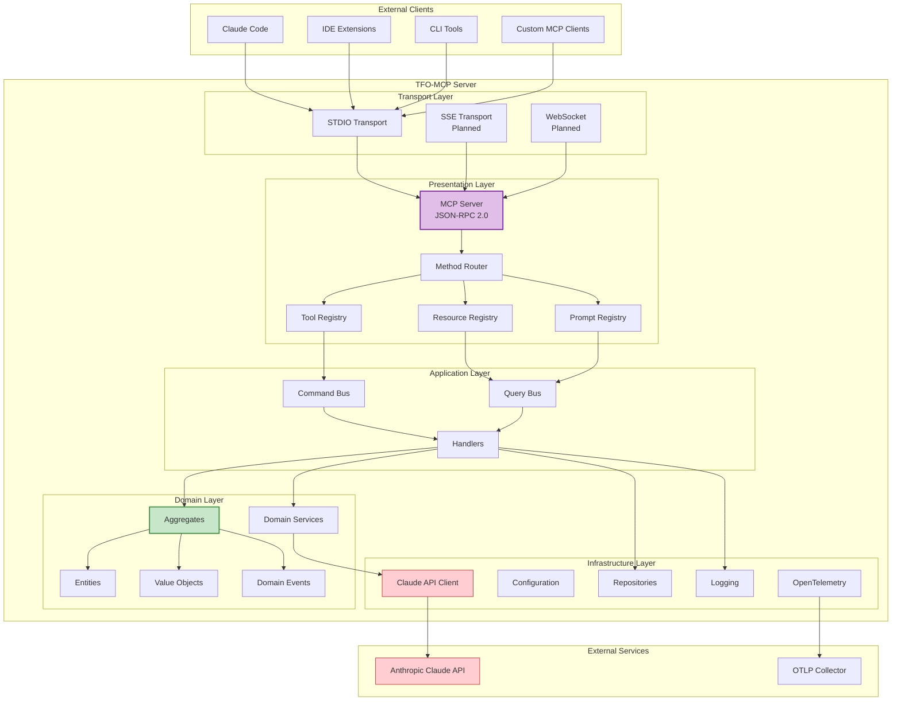
```mermaid
graph TB
    subgraph "External Clients"
        CC[Claude Code]
        IDE[IDE Extensions]
        CLI[CLI Tools]
        CUSTOM[Custom MCP Clients]
    end

    subgraph "TFO-MCP Server"
        subgraph "Transport Layer"
            STDIO[STDIO Transport]
            SSE[SSE Transport<br/>Planned]
            WS[WebSocket<br/>Planned]
        end

        subgraph "Presentation Layer"
            SERVER[MCP Server<br/>JSON-RPC 2.0]
            ROUTER[Method Router]
            TOOLS[Tool Registry]
            RESOURCES[Resource Registry]
            PROMPTS[Prompt Registry]
        end

        subgraph "Application Layer"
            CMD_BUS[Command Bus]
            QRY_BUS[Query Bus]
            HANDLERS[Handlers]
        end

        subgraph "Domain Layer"
            AGGREGATES[Aggregates]
            ENTITIES[Entities]
            VALUE_OBJ[Value Objects]
            EVENTS[Domain Events]
            DOM_SVC[Domain Services]
        end

        subgraph "Infrastructure Layer"
            CLAUDE_CLIENT[Claude API Client]
            CONFIG[Configuration]
            REPOS[Repositories]
            LOGGING[Logging]
            TELEMETRY[OpenTelemetry]
        end
    end

    subgraph "External Services"
        ANTHROPIC[Anthropic Claude API]
        OTLP_COLLECTOR[OTLP Collector]
    end

    CC --> STDIO
    IDE --> STDIO
    CLI --> STDIO
    CUSTOM --> STDIO

    STDIO --> SERVER
    SSE --> SERVER
    WS --> SERVER

    SERVER --> ROUTER
    ROUTER --> TOOLS
    ROUTER --> RESOURCES
    ROUTER --> PROMPTS

    TOOLS --> CMD_BUS
    RESOURCES --> QRY_BUS
    PROMPTS --> QRY_BUS

    CMD_BUS --> HANDLERS
    QRY_BUS --> HANDLERS

    HANDLERS --> AGGREGATES
    HANDLERS --> DOM_SVC
    AGGREGATES --> ENTITIES
    AGGREGATES --> VALUE_OBJ
    AGGREGATES --> EVENTS

    DOM_SVC --> CLAUDE_CLIENT
    HANDLERS --> REPOS
    HANDLERS --> LOGGING

    CLAUDE_CLIENT --> ANTHROPIC
    TELEMETRY --> OTLP_COLLECTOR

    style SERVER fill:#E1BEE7,stroke:#7B1FA2,stroke-width:2px
    style AGGREGATES fill:#C8E6C9,stroke:#388E3C,stroke-width:2px
    style CLAUDE_CLIENT fill:#FFCDD2,stroke:#C62828
    style ANTHROPIC fill:#FFCDD2,stroke:#C62828
```

---

## Layer Architecture

The architecture follows Clean Architecture principles with four distinct layers:

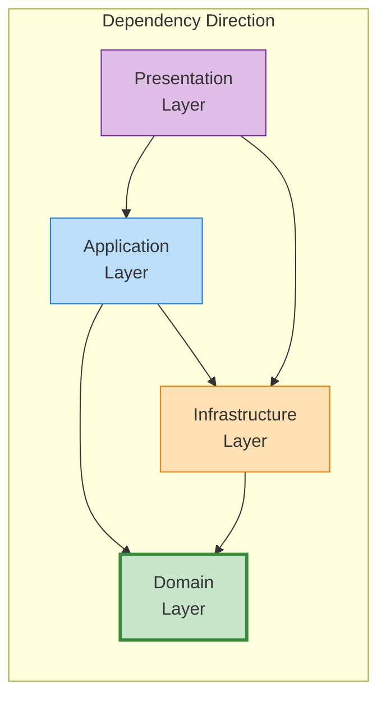
```mermaid
graph LR
    subgraph "Dependency Direction"
        PRES[Presentation<br/>Layer] --> APP[Application<br/>Layer]
        APP --> DOM[Domain<br/>Layer]
        INFRA[Infrastructure<br/>Layer] --> DOM
        PRES --> INFRA
        APP --> INFRA
    end

    style DOM fill:#C8E6C9,stroke:#388E3C,stroke-width:3px
    style APP fill:#BBDEFB,stroke:#1976D2
    style PRES fill:#E1BEE7,stroke:#7B1FA2
    style INFRA fill:#FFE0B2,stroke:#F57C00
```

### Layer Responsibilities

| Layer              | Responsibility                      | Components                                   |
| ------------------ | ----------------------------------- | -------------------------------------------- |
| **Presentation**   | Protocol handling, request/response | MCP Server, Tools, Resources, Prompts        |
| **Application**    | Use case orchestration, CQRS        | Commands, Queries, Handlers                  |
| **Domain**         | Business logic, invariants          | Aggregates, Entities, Value Objects, Events  |
| **Infrastructure** | External integrations, persistence  | Claude Client, Repositories, Config, Logging |

---

## Domain-Driven Design

### Aggregate Structure

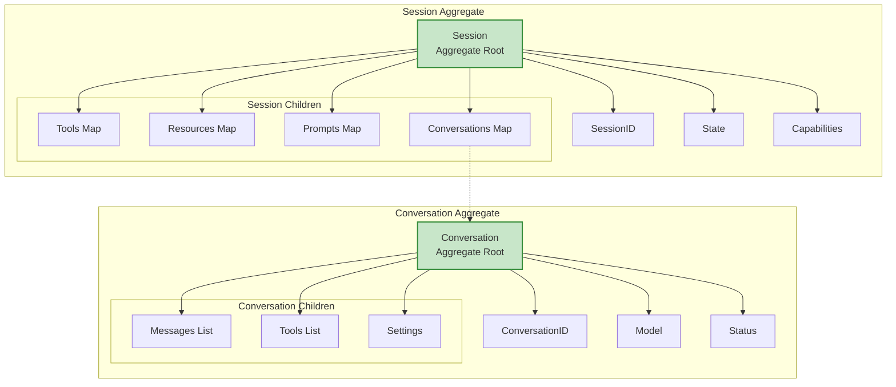
```mermaid
graph TB
    subgraph "Session Aggregate"
        SESSION[Session<br/>Aggregate Root]
        SESSION_ID[SessionID]
        SESSION_STATE[State]
        SESSION_CAPS[Capabilities]

        subgraph "Session Children"
            TOOLS_MAP[Tools Map]
            RES_MAP[Resources Map]
            PROMPTS_MAP[Prompts Map]
            CONV_MAP[Conversations Map]
        end
    end

    subgraph "Conversation Aggregate"
        CONV[Conversation<br/>Aggregate Root]
        CONV_ID[ConversationID]
        CONV_MODEL[Model]
        CONV_STATUS[Status]

        subgraph "Conversation Children"
            MESSAGES[Messages List]
            CONV_TOOLS[Tools List]
            SETTINGS[Settings]
        end
    end

    SESSION --> SESSION_ID
    SESSION --> SESSION_STATE
    SESSION --> SESSION_CAPS
    SESSION --> TOOLS_MAP
    SESSION --> RES_MAP
    SESSION --> PROMPTS_MAP
    SESSION --> CONV_MAP

    CONV --> CONV_ID
    CONV --> CONV_MODEL
    CONV --> CONV_STATUS
    CONV --> MESSAGES
    CONV --> CONV_TOOLS
    CONV --> SETTINGS

    CONV_MAP -.-> CONV

    style SESSION fill:#C8E6C9,stroke:#388E3C,stroke-width:2px
    style CONV fill:#C8E6C9,stroke:#388E3C,stroke-width:2px
```

### Entity Diagram

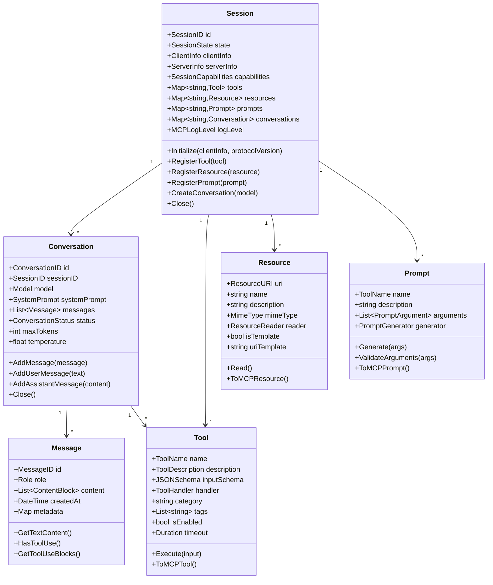
```mermaid
classDiagram
    class Session {
        +SessionID id
        +SessionState state
        +ClientInfo clientInfo
        +ServerInfo serverInfo
        +SessionCapabilities capabilities
        +Map~string,Tool~ tools
        +Map~string,Resource~ resources
        +Map~string,Prompt~ prompts
        +Map~string,Conversation~ conversations
        +MCPLogLevel logLevel
        +Initialize(clientInfo, protocolVersion)
        +RegisterTool(tool)
        +RegisterResource(resource)
        +RegisterPrompt(prompt)
        +CreateConversation(model)
        +Close()
    }

    class Conversation {
        +ConversationID id
        +SessionID sessionID
        +Model model
        +SystemPrompt systemPrompt
        +List~Message~ messages
        +ConversationStatus status
        +int maxTokens
        +float temperature
        +AddMessage(message)
        +AddUserMessage(text)
        +AddAssistantMessage(content)
        +Close()
    }

    class Message {
        +MessageID id
        +Role role
        +List~ContentBlock~ content
        +DateTime createdAt
        +Map metadata
        +GetTextContent()
        +HasToolUse()
        +GetToolUseBlocks()
    }

    class Tool {
        +ToolName name
        +ToolDescription description
        +JSONSchema inputSchema
        +ToolHandler handler
        +string category
        +List~string~ tags
        +bool isEnabled
        +Duration timeout
        +Execute(input)
        +ToMCPTool()
    }

    class Resource {
        +ResourceURI uri
        +string name
        +string description
        +MimeType mimeType
        +ResourceReader reader
        +bool isTemplate
        +string uriTemplate
        +Read()
        +ToMCPResource()
    }

    class Prompt {
        +ToolName name
        +string description
        +List~PromptArgument~ arguments
        +PromptGenerator generator
        +Generate(args)
        +ValidateArguments(args)
        +ToMCPPrompt()
    }

    Session "1" --> "*" Conversation
    Session "1" --> "*" Tool
    Session "1" --> "*" Resource
    Session "1" --> "*" Prompt
    Conversation "1" --> "*" Message
    Conversation "1" --> "*" Tool
```

### Value Objects

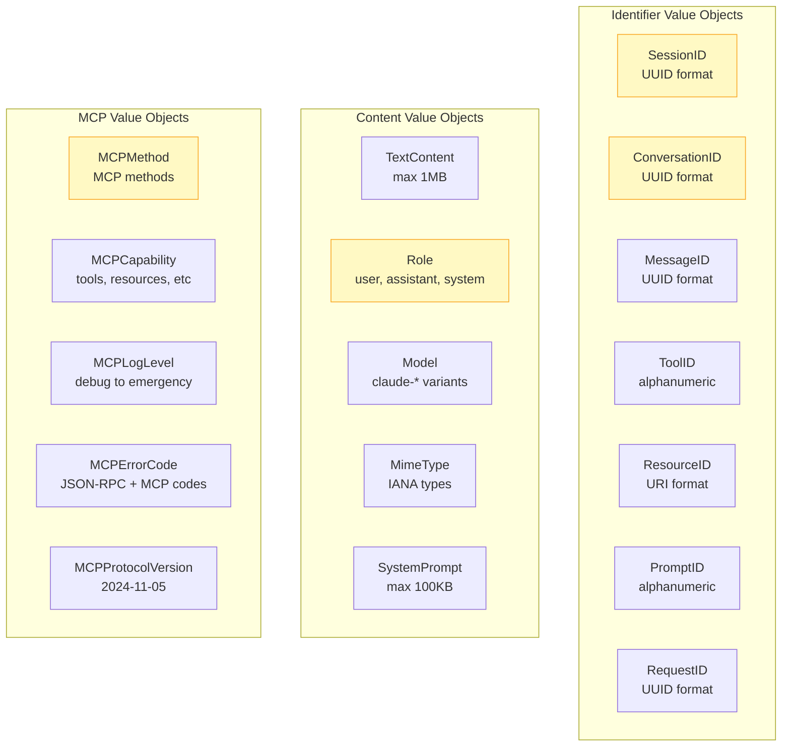
```mermaid
graph TB
    subgraph "Identifier Value Objects"
        SID[SessionID<br/>UUID format]
        CID[ConversationID<br/>UUID format]
        MID[MessageID<br/>UUID format]
        TID[ToolID<br/>alphanumeric]
        RID[ResourceID<br/>URI format]
        PID[PromptID<br/>alphanumeric]
        REQID[RequestID<br/>UUID format]
    end

    subgraph "Content Value Objects"
        TEXT[TextContent<br/>max 1MB]
        ROLE[Role<br/>user, assistant, system]
        MODEL[Model<br/>claude-* variants]
        MIME[MimeType<br/>IANA types]
        SYSPROMPT[SystemPrompt<br/>max 100KB]
    end

    subgraph "MCP Value Objects"
        METHOD[MCPMethod<br/>MCP methods]
        CAP[MCPCapability<br/>tools, resources, etc]
        LEVEL[MCPLogLevel<br/>debug to emergency]
        ERR[MCPErrorCode<br/>JSON-RPC + MCP codes]
        VER[MCPProtocolVersion<br/>2024-11-05]
    end

    style SID fill:#FFF9C4,stroke:#F9A825
    style CID fill:#FFF9C4,stroke:#F9A825
    style ROLE fill:#FFF9C4,stroke:#F9A825
    style METHOD fill:#FFF9C4,stroke:#F9A825
```

### Domain Events

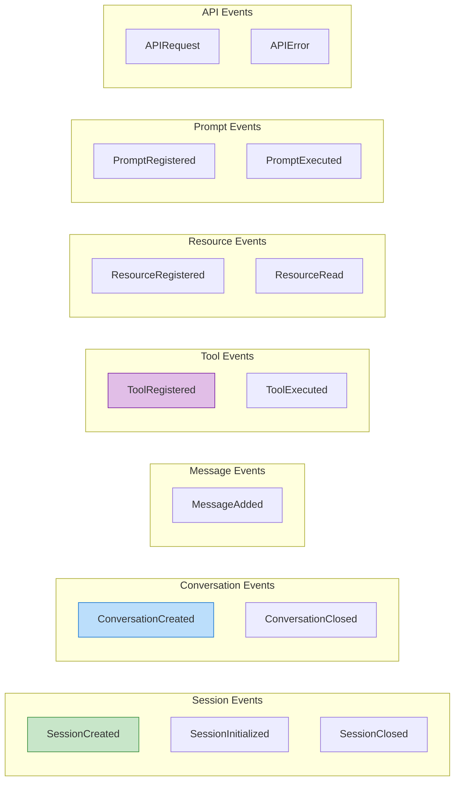
```mermaid
graph LR
    subgraph "Session Events"
        SE1[SessionCreated]
        SE2[SessionInitialized]
        SE3[SessionClosed]
    end

    subgraph "Conversation Events"
        CE1[ConversationCreated]
        CE2[ConversationClosed]
    end

    subgraph "Message Events"
        ME1[MessageAdded]
    end

    subgraph "Tool Events"
        TE1[ToolRegistered]
        TE2[ToolExecuted]
    end

    subgraph "Resource Events"
        RE1[ResourceRegistered]
        RE2[ResourceRead]
    end

    subgraph "Prompt Events"
        PE1[PromptRegistered]
        PE2[PromptExecuted]
    end

    subgraph "API Events"
        AE1[APIRequest]
        AE2[APIError]
    end

    style SE1 fill:#C8E6C9,stroke:#388E3C
    style CE1 fill:#BBDEFB,stroke:#1976D2
    style TE1 fill:#E1BEE7,stroke:#7B1FA2
```

---

## CQRS Pattern

### Command Flow

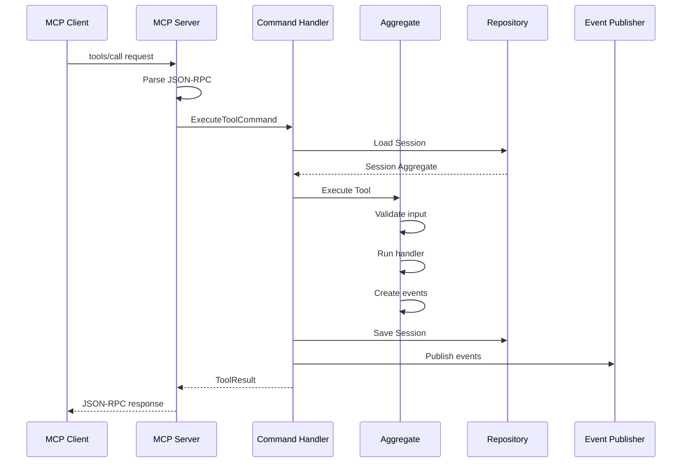
```mermaid
sequenceDiagram
    participant Client as MCP Client
    participant Server as MCP Server
    participant Handler as Command Handler
    participant Aggregate as Aggregate
    participant Repo as Repository
    participant Events as Event Publisher

    Client->>Server: tools/call request
    Server->>Server: Parse JSON-RPC
    Server->>Handler: ExecuteToolCommand

    Handler->>Repo: Load Session
    Repo-->>Handler: Session Aggregate

    Handler->>Aggregate: Execute Tool
    Aggregate->>Aggregate: Validate input
    Aggregate->>Aggregate: Run handler
    Aggregate->>Aggregate: Create events

    Handler->>Repo: Save Session
    Handler->>Events: Publish events

    Handler-->>Server: ToolResult
    Server-->>Client: JSON-RPC response
```

### Query Flow

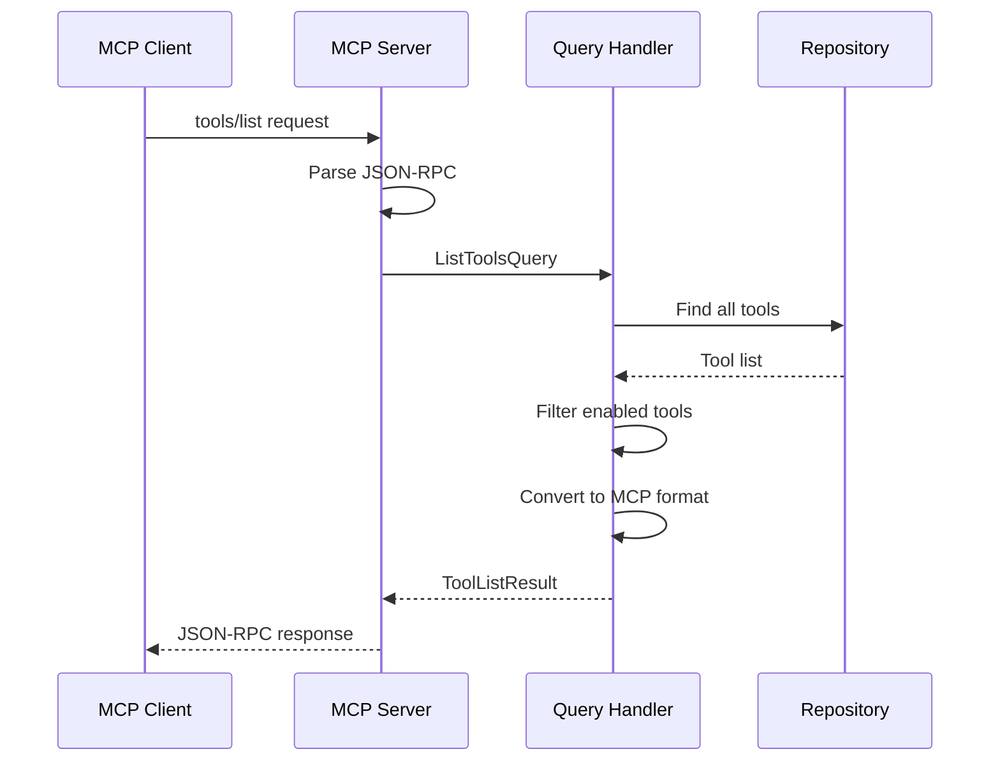
```mermaid
sequenceDiagram
    participant Client as MCP Client
    participant Server as MCP Server
    participant Handler as Query Handler
    participant Repo as Repository

    Client->>Server: tools/list request
    Server->>Server: Parse JSON-RPC
    Server->>Handler: ListToolsQuery

    Handler->>Repo: Find all tools
    Repo-->>Handler: Tool list

    Handler->>Handler: Filter enabled tools
    Handler->>Handler: Convert to MCP format

    Handler-->>Server: ToolListResult
    Server-->>Client: JSON-RPC response
```

### Commands and Queries

| Type        | Name                      | Description              |
| ----------- | ------------------------- | ------------------------ |
| **Command** | InitializeSessionCommand  | Initialize MCP session   |
| **Command** | CloseSessionCommand       | Close MCP session        |
| **Command** | SetLogLevelCommand        | Set session log level    |
| **Command** | CreateConversationCommand | Create new conversation  |
| **Command** | SendMessageCommand        | Send message to Claude   |
| **Command** | RegisterToolCommand       | Register new tool        |
| **Command** | ExecuteToolCommand        | Execute a tool           |
| **Command** | RegisterResourceCommand   | Register new resource    |
| **Command** | RegisterPromptCommand     | Register new prompt      |
| **Query**   | GetSessionQuery           | Get session by ID        |
| **Query**   | ListToolsQuery            | List available tools     |
| **Query**   | GetToolQuery              | Get tool by name         |
| **Query**   | ListResourcesQuery        | List available resources |
| **Query**   | ReadResourceQuery         | Read resource content    |
| **Query**   | ListPromptsQuery          | List available prompts   |
| **Query**   | GetPromptQuery            | Get prompt messages      |

---

## MCP Protocol Flow

### Session Lifecycle

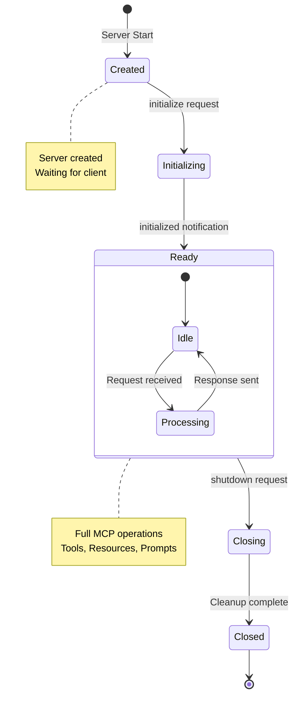
```mermaid
stateDiagram-v2
    [*] --> Created: Server Start
    Created --> Initializing: initialize request
    Initializing --> Ready: initialized notification

    state Ready {
        [*] --> Idle
        Idle --> Processing: Request received
        Processing --> Idle: Response sent
    }

    Ready --> Closing: shutdown request
    Closing --> Closed: Cleanup complete
    Closed --> [*]

    note right of Created
        Server created
        Waiting for client
    end note

    note right of Ready
        Full MCP operations
        Tools, Resources, Prompts
    end note
```

### Request Processing

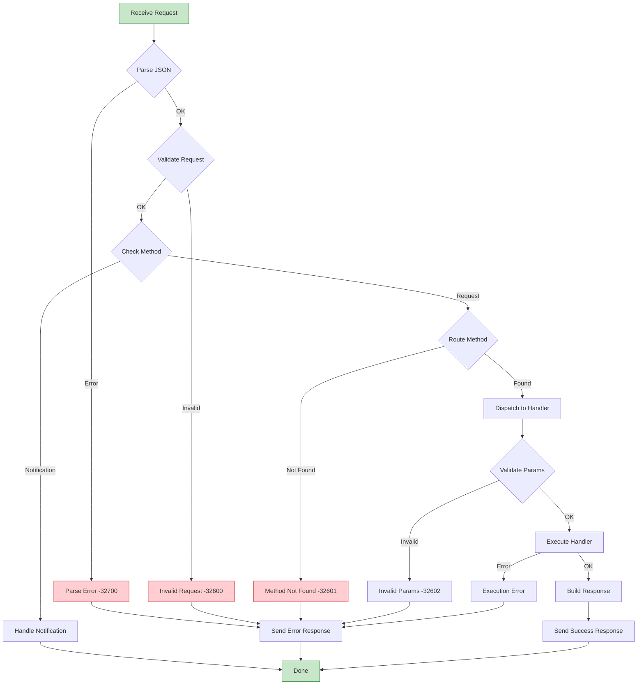
```mermaid
flowchart TD
    START[Receive Request] --> PARSE{Parse JSON}

    PARSE -->|Error| ERR_PARSE[Parse Error -32700]
    PARSE -->|OK| VALIDATE{Validate Request}

    VALIDATE -->|Invalid| ERR_REQ[Invalid Request -32600]
    VALIDATE -->|OK| CHECK_METHOD{Check Method}

    CHECK_METHOD -->|Notification| HANDLE_NOTIF[Handle Notification]
    CHECK_METHOD -->|Request| ROUTE{Route Method}

    ROUTE -->|Not Found| ERR_METHOD[Method Not Found -32601]
    ROUTE -->|Found| DISPATCH[Dispatch to Handler]

    DISPATCH --> VALIDATE_PARAMS{Validate Params}
    VALIDATE_PARAMS -->|Invalid| ERR_PARAMS[Invalid Params -32602]
    VALIDATE_PARAMS -->|OK| EXECUTE[Execute Handler]

    EXECUTE -->|Error| ERR_EXEC[Execution Error]
    EXECUTE -->|OK| RESPONSE[Build Response]

    ERR_PARSE --> SEND_ERR[Send Error Response]
    ERR_REQ --> SEND_ERR
    ERR_METHOD --> SEND_ERR
    ERR_PARAMS --> SEND_ERR
    ERR_EXEC --> SEND_ERR

    RESPONSE --> SEND_OK[Send Success Response]
    HANDLE_NOTIF --> END[Done]
    SEND_ERR --> END
    SEND_OK --> END

    style START fill:#C8E6C9,stroke:#388E3C
    style END fill:#C8E6C9,stroke:#388E3C
    style ERR_PARSE fill:#FFCDD2,stroke:#C62828
    style ERR_REQ fill:#FFCDD2,stroke:#C62828
    style ERR_METHOD fill:#FFCDD2,stroke:#C62828
```

### MCP Methods

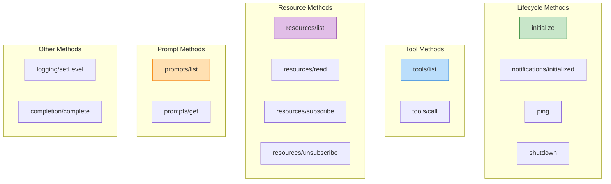
```mermaid
graph TB
    subgraph "Lifecycle Methods"
        M_INIT[initialize]
        M_INITD[notifications/initialized]
        M_PING[ping]
        M_SHUT[shutdown]
    end

    subgraph "Tool Methods"
        M_TLIST[tools/list]
        M_TCALL[tools/call]
    end

    subgraph "Resource Methods"
        M_RLIST[resources/list]
        M_RREAD[resources/read]
        M_RSUB[resources/subscribe]
        M_RUNSUB[resources/unsubscribe]
    end

    subgraph "Prompt Methods"
        M_PLIST[prompts/list]
        M_PGET[prompts/get]
    end

    subgraph "Other Methods"
        M_LOG[logging/setLevel]
        M_COMP[completion/complete]
    end

    style M_INIT fill:#C8E6C9,stroke:#388E3C
    style M_TLIST fill:#BBDEFB,stroke:#1976D2
    style M_RLIST fill:#E1BEE7,stroke:#7B1FA2
    style M_PLIST fill:#FFE0B2,stroke:#F57C00
```

---

## Claude AI Integration

### Client Architecture

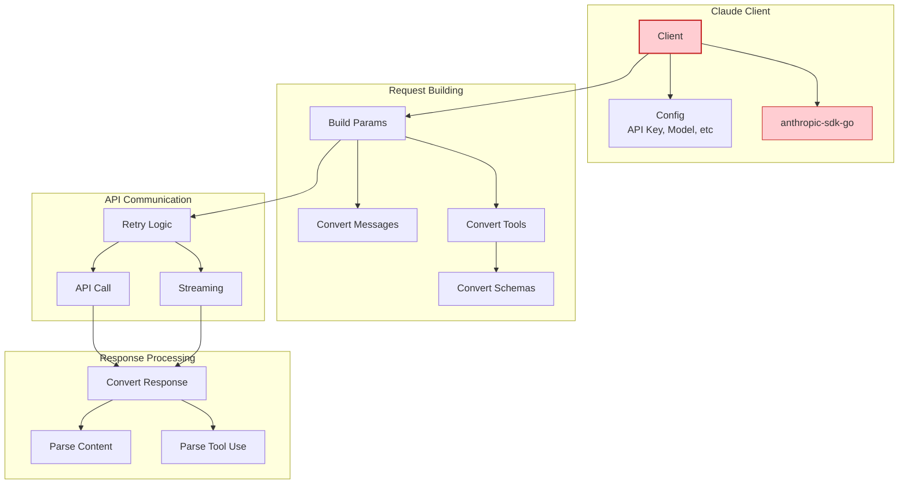
```mermaid
graph TB
    subgraph "Claude Client"
        CLIENT[Client]
        CONFIG[Config<br/>API Key, Model, etc]
        SDK[anthropic-sdk-go]
    end

    subgraph "Request Building"
        BUILD[Build Params]
        MESSAGES[Convert Messages]
        TOOLS[Convert Tools]
        SCHEMA[Convert Schemas]
    end

    subgraph "API Communication"
        RETRY[Retry Logic]
        CALL[API Call]
        STREAM[Streaming]
    end

    subgraph "Response Processing"
        CONVERT[Convert Response]
        PARSE_CONTENT[Parse Content]
        PARSE_TOOLS[Parse Tool Use]
    end

    CLIENT --> CONFIG
    CLIENT --> SDK

    CLIENT --> BUILD
    BUILD --> MESSAGES
    BUILD --> TOOLS
    TOOLS --> SCHEMA

    BUILD --> RETRY
    RETRY --> CALL
    RETRY --> STREAM

    CALL --> CONVERT
    STREAM --> CONVERT
    CONVERT --> PARSE_CONTENT
    CONVERT --> PARSE_TOOLS

    style CLIENT fill:#FFCDD2,stroke:#C62828,stroke-width:2px
    style SDK fill:#FFCDD2,stroke:#C62828
```

### Message Flow with Tool Use

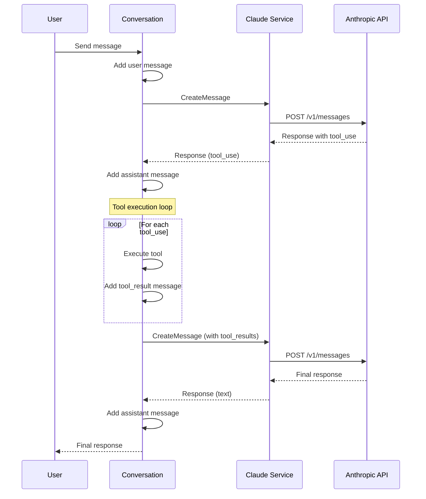
```mermaid
sequenceDiagram
    participant User as User
    participant Conv as Conversation
    participant Claude as Claude Service
    participant API as Anthropic API

    User->>Conv: Send message
    Conv->>Conv: Add user message
    Conv->>Claude: CreateMessage

    Claude->>API: POST /v1/messages
    API-->>Claude: Response with tool_use

    Claude-->>Conv: Response (tool_use)
    Conv->>Conv: Add assistant message

    Note over Conv: Tool execution loop
    loop For each tool_use
        Conv->>Conv: Execute tool
        Conv->>Conv: Add tool_result message
    end

    Conv->>Claude: CreateMessage (with tool_results)
    Claude->>API: POST /v1/messages
    API-->>Claude: Final response

    Claude-->>Conv: Response (text)
    Conv->>Conv: Add assistant message
    Conv-->>User: Final response
```

---

## Tool System

### Tool Registry Architecture

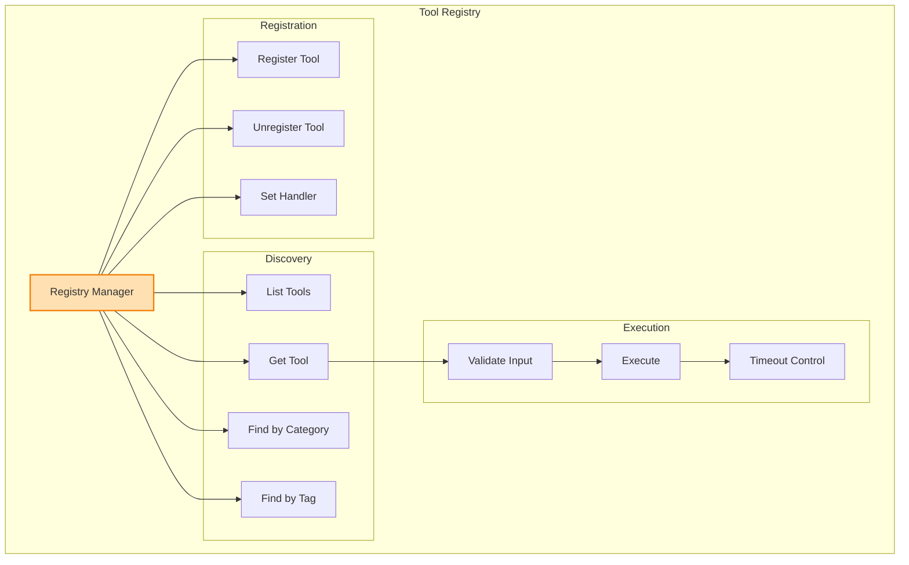
```mermaid
graph TB
    subgraph "Tool Registry"
        REG[Registry Manager]

        subgraph "Registration"
            REG_TOOL[Register Tool]
            UNREG_TOOL[Unregister Tool]
            SET_HANDLER[Set Handler]
        end

        subgraph "Discovery"
            LIST[List Tools]
            GET[Get Tool]
            FIND_CAT[Find by Category]
            FIND_TAG[Find by Tag]
        end

        subgraph "Execution"
            VALIDATE[Validate Input]
            EXEC[Execute]
            TIMEOUT[Timeout Control]
        end
    end

    REG --> REG_TOOL
    REG --> UNREG_TOOL
    REG --> SET_HANDLER

    REG --> LIST
    REG --> GET
    REG --> FIND_CAT
    REG --> FIND_TAG

    GET --> VALIDATE
    VALIDATE --> EXEC
    EXEC --> TIMEOUT

    style REG fill:#FFE0B2,stroke:#F57C00,stroke-width:2px
```

### Tool Execution Flow

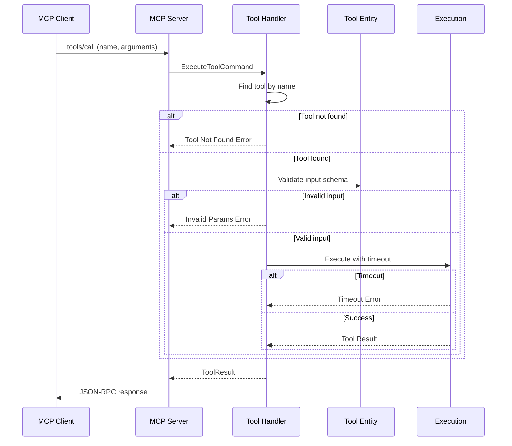
```mermaid
sequenceDiagram
    participant Client as MCP Client
    participant Server as MCP Server
    participant Handler as Tool Handler
    participant Tool as Tool Entity
    participant Exec as Execution

    Client->>Server: tools/call (name, arguments)
    Server->>Handler: ExecuteToolCommand

    Handler->>Handler: Find tool by name
    alt Tool not found
        Handler-->>Server: Tool Not Found Error
    else Tool found
        Handler->>Tool: Validate input schema
        alt Invalid input
            Handler-->>Server: Invalid Params Error
        else Valid input
            Handler->>Exec: Execute with timeout

            alt Timeout
                Exec-->>Handler: Timeout Error
            else Success
                Exec-->>Handler: Tool Result
            end
        end
    end

    Handler-->>Server: ToolResult
    Server-->>Client: JSON-RPC response
```

---

## Session Management

### Session State Machine

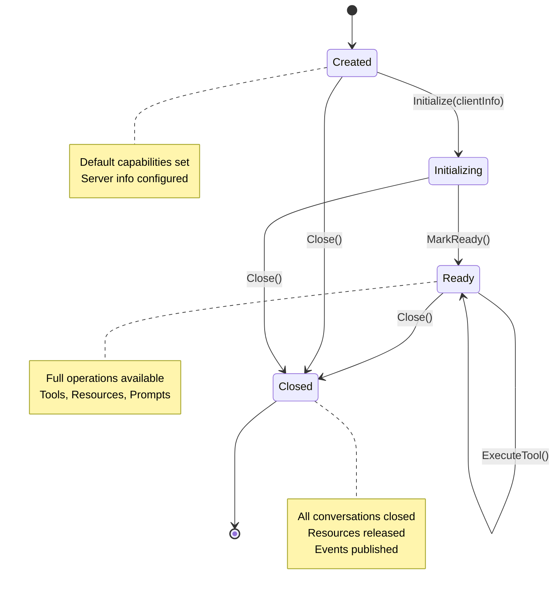
```mermaid
stateDiagram-v2
    [*] --> Created

    Created --> Initializing: Initialize(clientInfo)
    Initializing --> Ready: MarkReady()

    Ready --> Ready: RegisterTool()
    Ready --> Ready: RegisterResource()
    Ready --> Ready: RegisterPrompt()
    Ready --> Ready: ExecuteTool()

    Ready --> Closed: Close()
    Created --> Closed: Close()
    Initializing --> Closed: Close()

    Closed --> [*]

    note right of Created
        Default capabilities set
        Server info configured
    end note

    note right of Ready
        Full operations available
        Tools, Resources, Prompts
    end note

    note right of Closed
        All conversations closed
        Resources released
        Events published
    end note
```

### Conversation State Machine

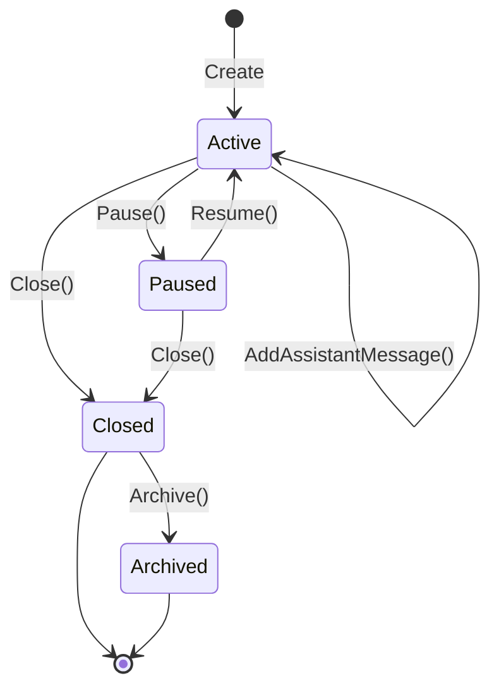
```mermaid
stateDiagram-v2
    [*] --> Active: Create

    Active --> Active: AddMessage()
    Active --> Active: AddUserMessage()
    Active --> Active: AddAssistantMessage()

    Active --> Paused: Pause()
    Paused --> Active: Resume()

    Active --> Closed: Close()
    Paused --> Closed: Close()

    Closed --> Archived: Archive()

    Closed --> [*]
    Archived --> [*]
```

---

## Cache and Queue

### Redis Cache Architecture

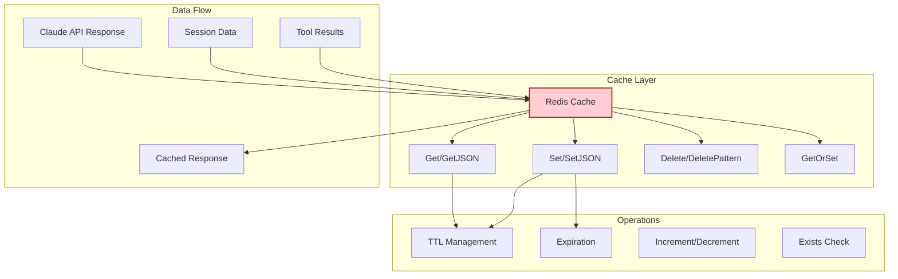
```mermaid
graph TB
    subgraph "Cache Layer"
        CACHE[Redis Cache]
        GET[Get/GetJSON]
        SET[Set/SetJSON]
        DEL[Delete/DeletePattern]
        GOS[GetOrSet]
    end

    subgraph "Operations"
        TTL[TTL Management]
        EXPIRE[Expiration]
        INCR[Increment/Decrement]
        EXISTS[Exists Check]
    end

    subgraph "Data Flow"
        API[Claude API Response] --> CACHE
        CACHE --> RESP[Cached Response]
        SESSION[Session Data] --> CACHE
        TOOL[Tool Results] --> CACHE
    end

    GET --> TTL
    SET --> TTL
    SET --> EXPIRE
    CACHE --> GET
    CACHE --> SET
    CACHE --> DEL
    CACHE --> GOS

    style CACHE fill:#FFCDD2,stroke:#C62828,stroke-width:2px
```

### Queue Architecture (NATS JetStream)

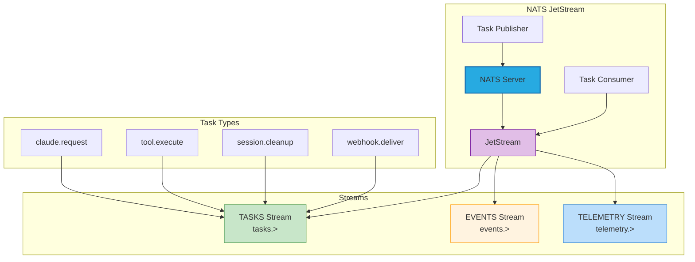
```mermaid
graph TB
    subgraph "NATS JetStream"
        NATS[NATS Server]
        JS[JetStream]
        PRODUCER[Task Publisher]
        CONSUMER[Task Consumer]
    end

    subgraph "Streams"
        TASKS[TASKS Stream<br/>tasks.>]
        EVENTS[EVENTS Stream<br/>events.>]
        TELEMETRY[TELEMETRY Stream<br/>telemetry.>]
    end

    subgraph "Task Types"
        CLAUDE_REQ[claude.request]
        TOOL_EXEC[tool.execute]
        CLEANUP[session.cleanup]
        WEBHOOK[webhook.deliver]
    end

    PRODUCER --> NATS
    NATS --> JS
    JS --> TASKS
    JS --> EVENTS
    JS --> TELEMETRY
    CONSUMER --> JS

    CLAUDE_REQ --> TASKS
    TOOL_EXEC --> TASKS
    CLEANUP --> TASKS
    WEBHOOK --> TASKS

    style NATS fill:#27AAE1,stroke:#1A6FB0,stroke-width:2px
    style JS fill:#E1BEE7,stroke:#7B1FA2
    style TASKS fill:#C8E6C9,stroke:#388E3C
    style EVENTS fill:#FFF3E0,stroke:#FF9800
    style TELEMETRY fill:#BBDEFB,stroke:#1976D2
```

### Queue Task Flow

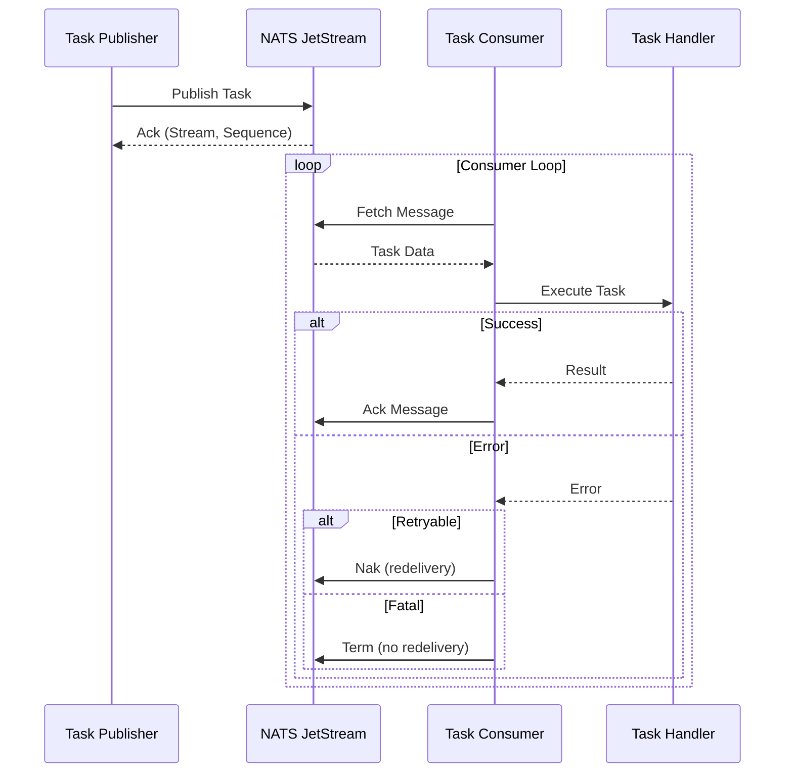
```mermaid
sequenceDiagram
    participant Producer as Task Publisher
    participant NATS as NATS JetStream
    participant Consumer as Task Consumer
    participant Handler as Task Handler

    Producer->>NATS: Publish Task
    NATS-->>Producer: Ack (Stream, Sequence)

    loop Consumer Loop
        Consumer->>NATS: Fetch Message
        NATS-->>Consumer: Task Data

        Consumer->>Handler: Execute Task
        alt Success
            Handler-->>Consumer: Result
            Consumer->>NATS: Ack Message
        else Error
            Handler-->>Consumer: Error
            alt Retryable
                Consumer->>NATS: Nak (redelivery)
            else Fatal
                Consumer->>NATS: Term (no redelivery)
            end
        end
    end
```

---

## Configuration Architecture

### Configuration Loading

```mermaid
flowchart TD
    subgraph "Configuration Sources"
        DEFAULT[Default Values]
        FILE[Config File<br/>config.yaml]
        ENV[Environment Variables<br/>ANTHROPIC_API_KEY, TELEMETRYFLOW_MCP_*]
    end

    subgraph "Viper Processing"
        VIPER[Viper Manager]
        MERGE[Merge Sources]
        BIND[Bind Env Vars]
        UNMARSHAL[Unmarshal to Config]
    end

    subgraph "Validation"
        VALIDATE[Validate Config]
        REQUIRED[Check Required Fields]
        RANGES[Check Value Ranges]
    end

    subgraph "Configuration Struct"
        CFG[Config]
        SRV[ServerConfig]
        CLAUDE[ClaudeConfig]
        MCP[MCPConfig]
        LOG[LoggingConfig]
        TEL[TelemetryConfig]
        SEC[SecurityConfig]
    end

    DEFAULT --> VIPER
    FILE --> VIPER
    ENV --> VIPER

    VIPER --> MERGE
    MERGE --> BIND
    BIND --> UNMARSHAL

    UNMARSHAL --> VALIDATE
    VALIDATE --> REQUIRED
    REQUIRED --> RANGES

    RANGES --> CFG
    CFG --> SRV
    CFG --> CLAUDE
    CFG --> MCP
    CFG --> LOG
    CFG --> TEL
    CFG --> SEC

    style VIPER fill:#FFE0B2,stroke:#F57C00,stroke-width:2px
    style CFG fill:#C8E6C9,stroke:#388E3C,stroke-width:2px
```

### Configuration Hierarchy

```mermaid
graph TD
    CFG[Config]

    CFG --> SRV[Server]
    SRV --> SRV_NAME[name]
    SRV --> SRV_VER[version]
    SRV --> SRV_HOST[host]
    SRV --> SRV_PORT[port]
    SRV --> SRV_TRANS[transport]
    SRV --> SRV_DEBUG[debug]

    CFG --> CLAUDE[Claude]
    CLAUDE --> CL_KEY[api_key]
    CLAUDE --> CL_MODEL[default_model]
    CLAUDE --> CL_TOKENS[max_tokens]
    CLAUDE --> CL_TEMP[temperature]
    CLAUDE --> CL_TIMEOUT[timeout]
    CLAUDE --> CL_RETRY[max_retries]

    CFG --> MCP[MCP]
    MCP --> MCP_VER[protocol_version]
    MCP --> MCP_TOOLS[enable_tools]
    MCP --> MCP_RES[enable_resources]
    MCP --> MCP_PROMPTS[enable_prompts]

    CFG --> LOG[Logging]
    LOG --> LOG_LEVEL[level]
    LOG --> LOG_FMT[format]

    CFG --> TEL[Telemetry]
    TEL --> TEL_EN[enabled]
    TEL --> TEL_SVC[service_name]
    TEL --> TEL_OTLP[otlp_endpoint]

    style CFG fill:#FFE0B2,stroke:#F57C00,stroke-width:2px
```

---

## Database Layer

### Database Architecture

TelemetryFlow MCP uses a polyglot persistence strategy with specialized databases for different workloads:

```mermaid
graph TB
    subgraph "Application Layer"
        MCP[TFO-MCP Server]
        GORM[GORM ORM]
    end

    subgraph "Transactional Storage"
        PG[(PostgreSQL)]
        PG_SESSIONS[Sessions]
        PG_CONV[Conversations]
        PG_MSG[Messages]
        PG_TOOLS[Tools]
        PG_RES[Resources]
        PG_PROMPTS[Prompts]
    end

    subgraph "Analytics Storage"
        CH[(ClickHouse)]
        CH_TOOL[Tool Analytics]
        CH_API[API Analytics]
        CH_SESSION[Session Analytics]
        CH_ERROR[Error Analytics]
    end

    subgraph "Caching Layer"
        REDIS[(Redis)]
        REDIS_CACHE[Response Cache]
        REDIS_SESSION[Session Cache]
    end

    MCP --> GORM
    GORM --> PG
    MCP --> CH
    MCP --> REDIS

    PG --> PG_SESSIONS
    PG --> PG_CONV
    PG --> PG_MSG
    PG --> PG_TOOLS
    PG --> PG_RES
    PG --> PG_PROMPTS

    CH --> CH_TOOL
    CH --> CH_API
    CH --> CH_SESSION
    CH --> CH_ERROR

    REDIS --> REDIS_CACHE
    REDIS --> REDIS_SESSION

    style PG fill:#336791,stroke:#1A365D,color:#fff
    style CH fill:#FFCC00,stroke:#CC9900
    style REDIS fill:#DC382D,stroke:#A52A2A,color:#fff
```

### PostgreSQL Schema

Primary transactional database for MCP session state and metadata:

| Table                    | Purpose               | Key Columns                            |
| ------------------------ | --------------------- | -------------------------------------- |
| `sessions`               | MCP session state     | id, state, client_name, capabilities   |
| `conversations`          | Claude conversations  | id, session_id, model, status          |
| `messages`               | Conversation messages | id, conversation_id, role, content     |
| `tools`                  | Registered tools      | id, name, input_schema, is_enabled     |
| `resources`              | Available resources   | id, uri, name, mime_type               |
| `prompts`                | Prompt templates      | id, name, arguments, template          |
| `resource_subscriptions` | Resource watchers     | id, session_id, resource_uri           |
| `tool_executions`        | Tool execution log    | id, session_id, tool_name, duration_ms |
| `api_keys`               | API authentication    | id, key_hash, scopes, rate_limits      |
| `schema_migrations`      | Migration tracking    | version, applied_at                    |

### ClickHouse Analytics Schema

High-performance analytics for operational intelligence:

| Table                        | Purpose                   | Engine             |
| ---------------------------- | ------------------------- | ------------------ |
| `tool_call_analytics`        | Tool execution metrics    | MergeTree          |
| `api_request_analytics`      | Claude API usage          | MergeTree          |
| `session_analytics`          | Session lifecycle events  | MergeTree          |
| `error_analytics`            | Error tracking            | MergeTree          |
| `token_usage_hourly`         | Aggregated token usage    | SummingMergeTree   |
| `tool_usage_hourly`          | Aggregated tool usage     | SummingMergeTree   |
| `latency_percentiles_hourly` | Response time percentiles | ReplacingMergeTree |

### GORM Models

Domain models with GORM annotations for PostgreSQL:

```mermaid
classDiagram
    class Session {
        +UUID ID
        +string State
        +string ClientName
        +string ClientVersion
        +string ProtocolVersion
        +JSONB Capabilities
        +JSONB ServerInfo
        +string LogLevel
        +time.Time CreatedAt
        +time.Time UpdatedAt
        +time.Time ClosedAt
    }

    class Conversation {
        +UUID ID
        +UUID SessionID
        +string Model
        +string SystemPrompt
        +string Status
        +int MaxTokens
        +float64 Temperature
        +int TotalInputTokens
        +int TotalOutputTokens
        +JSONB Metadata
        +time.Time CreatedAt
        +time.Time UpdatedAt
    }

    class Message {
        +UUID ID
        +UUID ConversationID
        +string Role
        +JSONBArray Content
        +int InputTokens
        +int OutputTokens
        +string StopReason
        +JSONB Metadata
        +time.Time CreatedAt
    }

    class Tool {
        +UUID ID
        +string Name
        +string Description
        +JSONB InputSchema
        +string Category
        +StringArray Tags
        +bool IsEnabled
        +int TimeoutSeconds
        +JSONB Metadata
        +time.Time CreatedAt
        +time.Time UpdatedAt
    }

    Session "1" --> "*" Conversation
    Conversation "1" --> "*" Message
    Session "1" --> "*" Tool
```

### Custom GORM Types

```go
// JSONB handles PostgreSQL JSONB columns
type JSONB map[string]interface{}

// JSONBArray handles PostgreSQL JSONB arrays
type JSONBArray []interface{}

// StringArray handles PostgreSQL text[] arrays
type StringArray []string
```

---

## Migrations and Seeding

### Migration Architecture

```mermaid
flowchart TD
    subgraph "Migration Sources"
        PG_UP[PostgreSQL Up Migrations]
        PG_DOWN[PostgreSQL Down Migrations]
        CH_UP[ClickHouse Up Migrations]
        CH_DOWN[ClickHouse Down Migrations]
    end

    subgraph "Migrator"
        MIGRATOR[Migration Runner]
        STATUS[Migration Status]
        AUTO[Auto Migration]
    end

    subgraph "Operations"
        UP[Up - Apply All]
        DOWN[Down - Rollback One]
        DOWN_TO[DownTo - Rollback To Version]
        RESET[Reset - Rollback All]
        FRESH[Fresh - Reset + Up]
    end

    PG_UP --> MIGRATOR
    PG_DOWN --> MIGRATOR
    CH_UP --> MIGRATOR
    CH_DOWN --> MIGRATOR

    MIGRATOR --> UP
    MIGRATOR --> DOWN
    MIGRATOR --> DOWN_TO
    MIGRATOR --> RESET
    MIGRATOR --> FRESH
    MIGRATOR --> STATUS
    MIGRATOR --> AUTO

    style MIGRATOR fill:#FFE0B2,stroke:#F57C00,stroke-width:2px
```

### Migration Files

Migrations follow a versioned naming convention:

```
migrations/
├── postgres/
│   ├── 000001_init_schema.up.sql    # Create all tables
│   └── 000001_init_schema.down.sql  # Drop all tables
└── clickhouse/
    ├── 000001_init_analytics.up.sql  # Create analytics tables
    └── 000001_init_analytics.down.sql # Drop analytics tables
```

### Migration Commands

| Command                   | Description                     |
| ------------------------- | ------------------------------- |
| `migrate up`              | Apply all pending migrations    |
| `migrate down`            | Rollback the last migration     |
| `migrate down-to VERSION` | Rollback to a specific version  |
| `migrate reset`           | Rollback all migrations         |
| `migrate fresh`           | Reset and re-run all migrations |
| `migrate status`          | Show migration status           |

### Seeding Architecture

```mermaid
flowchart TD
    subgraph "Seeders"
        TOOLS[SeedTools<br/>8 default tools]
        RESOURCES[SeedResources<br/>3 default resources]
        PROMPTS[SeedPrompts<br/>3 default prompts]
        API_KEYS[SeedAPIKeys<br/>Development key]
        DEMO[SeedDemoSession<br/>Demo data]
    end

    subgraph "Operations"
        ALL[SeedAll<br/>All seeders]
        PROD[SeedProduction<br/>Tools, Resources, Prompts only]
    end

    subgraph "Strategy"
        FIRST_OR_CREATE[FirstOrCreate<br/>Idempotent]
        UNIQUE[Unique Constraints<br/>No duplicates]
    end

    TOOLS --> ALL
    RESOURCES --> ALL
    PROMPTS --> ALL
    API_KEYS --> ALL
    DEMO --> ALL

    TOOLS --> PROD
    RESOURCES --> PROD
    PROMPTS --> PROD

    ALL --> FIRST_OR_CREATE
    PROD --> FIRST_OR_CREATE
    FIRST_OR_CREATE --> UNIQUE

    style ALL fill:#C8E6C9,stroke:#388E3C
    style PROD fill:#BBDEFB,stroke:#1976D2
```

### Default Seed Data

**Tools (8 default):**
| Name | Category | Description |
|------|----------|-------------|
| `echo` | utility | Echo input back |
| `read_file` | filesystem | Read file contents |
| `write_file` | filesystem | Write to file |
| `list_directory` | filesystem | List directory contents |
| `execute_command` | system | Execute shell command |
| `search_files` | filesystem | Search files by pattern |
| `system_info` | system | Get system information |
| `claude_conversation` | ai | Have conversation with Claude |

**Resources (3 default):**
| URI | Name | Type |
|-----|------|------|
| `config://server` | Server Configuration | Static |
| `status://health` | Health Status | Static |
| `file:///{path}` | File Resource | Template |

**Prompts (3 default):**
| Name | Arguments |
|------|-----------|
| `code_review` | language, code, focus_areas |
| `explain_code` | language, code, detail_level |
| `debug_help` | language, code, error_message |

### Docker Initialization

The Docker Compose setup uses initialization scripts for database setup:

```mermaid
sequenceDiagram
    participant DC as Docker Compose
    participant PG as PostgreSQL
    participant CH as ClickHouse
    participant INIT as Init Scripts

    DC->>PG: Start container
    DC->>CH: Start container

    PG->>INIT: Run init-db.sql
    INIT->>PG: Create schema
    INIT->>PG: Create indexes
    INIT->>PG: Insert seed data

    CH->>INIT: Run init-clickhouse.sql
    INIT->>CH: Create database
    INIT->>CH: Create tables
    INIT->>CH: Create materialized views
```

---

## Observability

### OpenTelemetry Integration

```mermaid
graph TB
    subgraph "Application"
        APP[TFO-MCP]
        TRACER[Tracer]
        METER[Meter]
        LOGGER[Logger]
    end

    subgraph "Instrumentation"
        SPANS[Spans]
        METRICS[Metrics]
        LOGS[Logs]
    end

    subgraph "Export"
        OTLP_TRACE[OTLP Trace Exporter]
        OTLP_METRIC[OTLP Metric Exporter]
        LOG_EXP[Log Exporter]
    end

    subgraph "Backend"
        COLLECTOR[TFO-Collector]
        JAEGER[Jaeger]
        PROM[Prometheus]
        LOKI[Loki]
    end

    APP --> TRACER
    APP --> METER
    APP --> LOGGER

    TRACER --> SPANS
    METER --> METRICS
    LOGGER --> LOGS

    SPANS --> OTLP_TRACE
    METRICS --> OTLP_METRIC
    LOGS --> LOG_EXP

    OTLP_TRACE --> COLLECTOR
    OTLP_METRIC --> COLLECTOR
    LOG_EXP --> COLLECTOR

    COLLECTOR --> JAEGER
    COLLECTOR --> PROM
    COLLECTOR --> LOKI

    style APP fill:#E1BEE7,stroke:#7B1FA2,stroke-width:2px
    style COLLECTOR fill:#FFE0B2,stroke:#F57C00
```

### Logging Architecture

```mermaid
graph LR
    subgraph "Log Sources"
        REQ[Request Logs]
        ERR[Error Logs]
        EVT[Event Logs]
        DEBUG[Debug Logs]
    end

    subgraph "Zerolog"
        LOGGER[Logger]
        CTX[Context]
        FIELDS[Fields]
    end

    subgraph "Output"
        JSON[JSON Format]
        TEXT[Text Format]
    end

    subgraph "Destination"
        STDERR[stderr]
        FILE[File]
        OTEL[OpenTelemetry]
    end

    REQ --> LOGGER
    ERR --> LOGGER
    EVT --> LOGGER
    DEBUG --> LOGGER

    LOGGER --> CTX
    CTX --> FIELDS

    FIELDS --> JSON
    FIELDS --> TEXT

    JSON --> STDERR
    JSON --> FILE
    JSON --> OTEL

    TEXT --> STDERR

    style LOGGER fill:#BBDEFB,stroke:#1976D2,stroke-width:2px
```

---

## Package Structure

```mermaid
graph TB
    subgraph "cmd/"
        CMD_MCP[mcp/main.go<br/>Entry Point]
    end

    subgraph "internal/domain/"
        DOM_AGG[aggregates/<br/>Session, Conversation]
        DOM_ENT[entities/<br/>Message, Tool, Resource, Prompt]
        DOM_VO[valueobjects/<br/>IDs, Content, MCP Types]
        DOM_EVT[events/<br/>Domain Events]
        DOM_REPO[repositories/<br/>Interfaces]
        DOM_SVC[services/<br/>Interfaces]
    end

    subgraph "internal/application/"
        APP_CMD[commands/<br/>Write Operations]
        APP_QRY[queries/<br/>Read Operations]
        APP_HND[handlers/<br/>CQRS Handlers]
    end

    subgraph "internal/infrastructure/"
        INF_CLAUDE[claude/<br/>API Client]
        INF_CFG[config/<br/>Configuration]
        INF_PERS[persistence/<br/>Repositories]
    end

    subgraph "internal/presentation/"
        PRES_SRV[server/<br/>MCP Server]
        PRES_TOOLS[tools/<br/>Built-in Tools]
    end

    CMD_MCP --> PRES_SRV
    PRES_SRV --> APP_HND
    PRES_TOOLS --> APP_HND

    APP_HND --> APP_CMD
    APP_HND --> APP_QRY
    APP_HND --> DOM_AGG
    APP_HND --> DOM_SVC

    DOM_AGG --> DOM_ENT
    DOM_AGG --> DOM_VO
    DOM_AGG --> DOM_EVT

    DOM_SVC --> INF_CLAUDE
    APP_HND --> INF_PERS
    INF_PERS --> DOM_REPO

    style CMD_MCP fill:#E1BEE7,stroke:#7B1FA2
    style DOM_AGG fill:#C8E6C9,stroke:#388E3C
    style APP_HND fill:#BBDEFB,stroke:#1976D2
    style INF_CLAUDE fill:#FFE0B2,stroke:#F57C00
```

### Directory Structure

```
telemetryflow-mcp/
├── cmd/
│   └── mcp/
│       └── main.go                 # Application entry point
├── internal/
│   ├── domain/                     # Domain Layer
│   │   ├── aggregates/
│   │   │   ├── session.go          # Session aggregate
│   │   │   └── conversation.go     # Conversation aggregate
│   │   ├── entities/
│   │   │   ├── message.go          # Message entity
│   │   │   ├── tool.go             # Tool entity
│   │   │   ├── resource.go         # Resource entity
│   │   │   └── prompt.go           # Prompt entity
│   │   ├── valueobjects/
│   │   │   ├── identifiers.go      # ID value objects
│   │   │   ├── content.go          # Content value objects
│   │   │   └── mcp.go              # MCP value objects
│   │   ├── events/
│   │   │   └── events.go           # Domain events
│   │   ├── repositories/
│   │   │   └── repositories.go     # Repository interfaces
│   │   └── services/
│   │       └── claude_service.go   # Service interfaces
│   ├── application/                # Application Layer
│   │   ├── commands/
│   │   │   └── commands.go         # CQRS commands
│   │   ├── queries/
│   │   │   └── queries.go          # CQRS queries
│   │   └── handlers/
│   │       ├── session_handler.go
│   │       ├── tool_handler.go
│   │       └── conversation_handler.go
│   ├── infrastructure/             # Infrastructure Layer
│   │   ├── claude/
│   │   │   └── client.go           # Claude API client
│   │   ├── config/
│   │   │   └── config.go           # Configuration
│   │   ├── cache/
│   │   │   └── redis.go            # Redis cache implementation
│   │   ├── queue/
│   │   │   ├── nats.go             # NATS JetStream queue implementation
│   │   │   └── tasks.go            # Predefined task types
│   │   └── persistence/
│   │       ├── memory_repositories.go
│   │       ├── migrator.go         # Database migration runner
│   │       ├── seeder.go           # Database seeder
│   │       └── models/
│   │           └── models.go       # GORM models
│   └── presentation/               # Presentation Layer
│       ├── server/
│       │   └── server.go           # MCP server
│       └── tools/
│           └── builtin_tools.go    # Built-in tools
├── migrations/                     # Database migrations
│   ├── postgres/
│   │   ├── 000001_init_schema.up.sql
│   │   └── 000001_init_schema.down.sql
│   └── clickhouse/
│       ├── 000001_init_analytics.up.sql
│       └── 000001_init_analytics.down.sql
├── scripts/                        # Initialization scripts
│   ├── init-db.sql                 # PostgreSQL Docker init
│   └── init-clickhouse.sql         # ClickHouse Docker init
├── configs/
│   └── config.yaml                 # Default configuration
├── tests/
│   └── unit/
│       └── infrastructure/
│           └── migrations/
│               ├── migrator_test.go
│               ├── seeder_test.go
│               └── models_test.go
├── docs/                           # Documentation
└── .kiro/                          # Specifications
```

---

## Version Compatibility

| Component        | Version       | Compatibility         |
| ---------------- | ------------- | --------------------- |
| TFO-MCP          | v1.1.2        | MCP 2024-11-05        |
| Go               | 1.24+         | Required              |
| anthropic-sdk-go | v0.2.0-beta.3 | Claude API            |
| OTEL SDK         | v1.39.0       | TFO ecosystem aligned |
| Zerolog          | v1.33.0       | Logging               |
| Viper            | v1.19.0       | Configuration         |
| Cobra            | v1.8.1        | CLI                   |

---

## Related Diagrams

For detailed visual documentation, see:

- **[Entity Relationship Diagrams (ERD.md)](ERD.md)** - Domain entities, aggregates, database schemas
- **[Data Flow Diagrams (DFD.md)](DFD.md)** - Data flows, state machines, sequence diagrams

---

## References

- [MCP Specification](https://modelcontextprotocol.io)
- [Anthropic Claude API](https://docs.anthropic.com)
- [Domain-Driven Design](https://martinfowler.com/bliki/DomainDrivenDesign.html)
- [CQRS Pattern](https://martinfowler.com/bliki/CQRS.html)
- [Clean Architecture](https://blog.cleancoder.com/uncle-bob/2012/08/13/the-clean-architecture.html)
- [NATS - Cloud Native Messaging](https://nats.io)
- [NATS JetStream - Persistence Layer](https://docs.nats.io/nats-concepts/jetstream)
