# TFO-MCP Commands Reference

> Complete CLI and MCP protocol commands reference for TelemetryFlow MCP Server

---

## Table of Contents

- [Overview](#overview)
- [CLI Commands](#cli-commands)
- [MCP Protocol Methods](#mcp-protocol-methods)
- [Built-in Tools](#built-in-tools)
- [Resource Operations](#resource-operations)
- [Prompt Operations](#prompt-operations)
- [Session Management](#session-management)
- [Examples](#examples)

---

## Overview

TFO-MCP provides two interfaces for interaction:

1. **CLI Commands** - Command-line interface for server management
2. **MCP Protocol Methods** - JSON-RPC methods for client communication

### Command Architecture

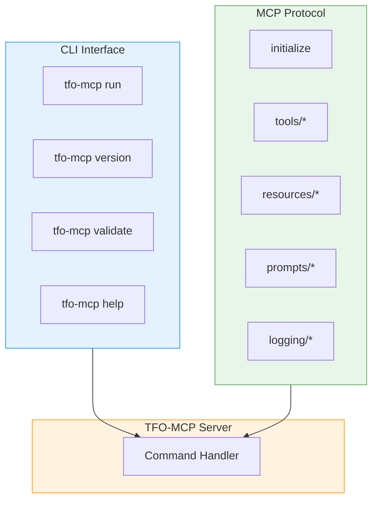

---

## CLI Commands

### Command Structure

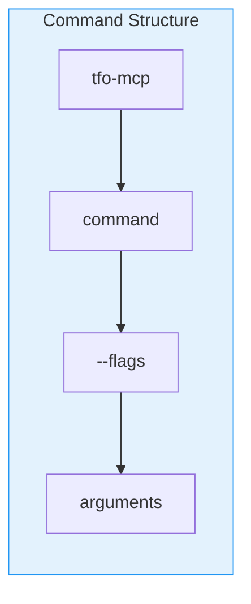

### Available Commands

| Command    | Description              | Usage                      |
| ---------- | ------------------------ | -------------------------- |
| `run`      | Start the MCP server     | `tfo-mcp run [flags]`      |
| `version`  | Show version information | `tfo-mcp version`          |
| `validate` | Validate configuration   | `tfo-mcp validate [flags]` |
| `help`     | Show help information    | `tfo-mcp help [command]`   |

### run Command

Start the MCP server.

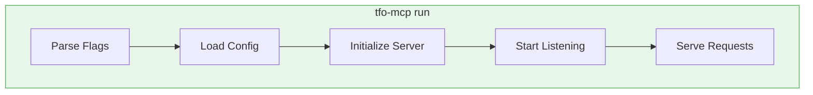

**Usage:**

```bash
# Basic usage
tfo-mcp run

# With custom config
tfo-mcp run --config /path/to/config.yaml

# With debug logging
tfo-mcp run --log-level debug

# With specific transport
tfo-mcp run --transport stdio
```

**Flags:**

| Flag          | Short | Type     | Default       | Description                             |
| ------------- | ----- | -------- | ------------- | --------------------------------------- |
| `--config`    | `-c`  | string   | "config.yaml" | Configuration file path                 |
| `--log-level` | `-l`  | string   | "info"        | Log level (trace/debug/info/warn/error) |
| `--transport` | `-t`  | string   | "stdio"       | Transport type                          |
| `--timeout`   |       | duration | "30s"         | Request timeout                         |

### version Command

Display version and build information.

```bash
tfo-mcp version
```

**Output:**

```
TFO-MCP - TelemetryFlow MCP Server
Version:    1.1.2
Go Version: go1.24
Build Date: 2024-01-15
Git Commit: abc1234
Platform:   darwin/arm64
```

### validate Command

Validate the configuration file.

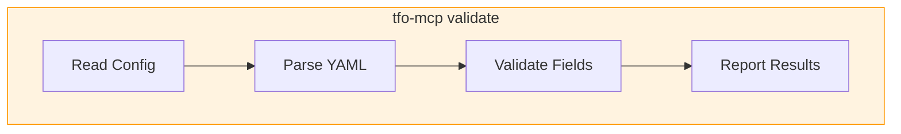

**Usage:**

```bash
# Validate default config
tfo-mcp validate

# Validate specific file
tfo-mcp validate --config /path/to/config.yaml

# Verbose output
tfo-mcp validate --verbose
```

**Flags:**

| Flag        | Short | Type   | Default       | Description             |
| ----------- | ----- | ------ | ------------- | ----------------------- |
| `--config`  | `-c`  | string | "config.yaml" | Configuration file path |
| `--verbose` | `-v`  | bool   | false         | Verbose output          |

---

## MCP Protocol Methods

### Protocol Overview

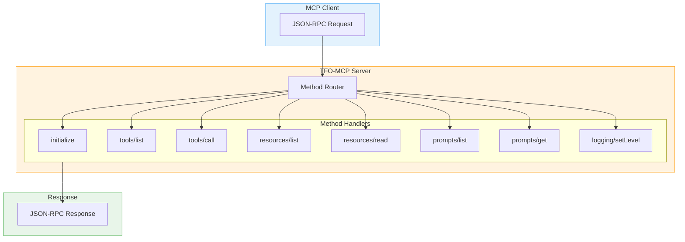

### Method Categories

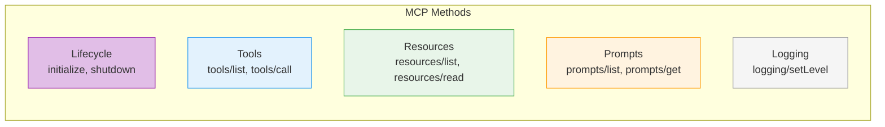

### initialize

Initialize the MCP session.

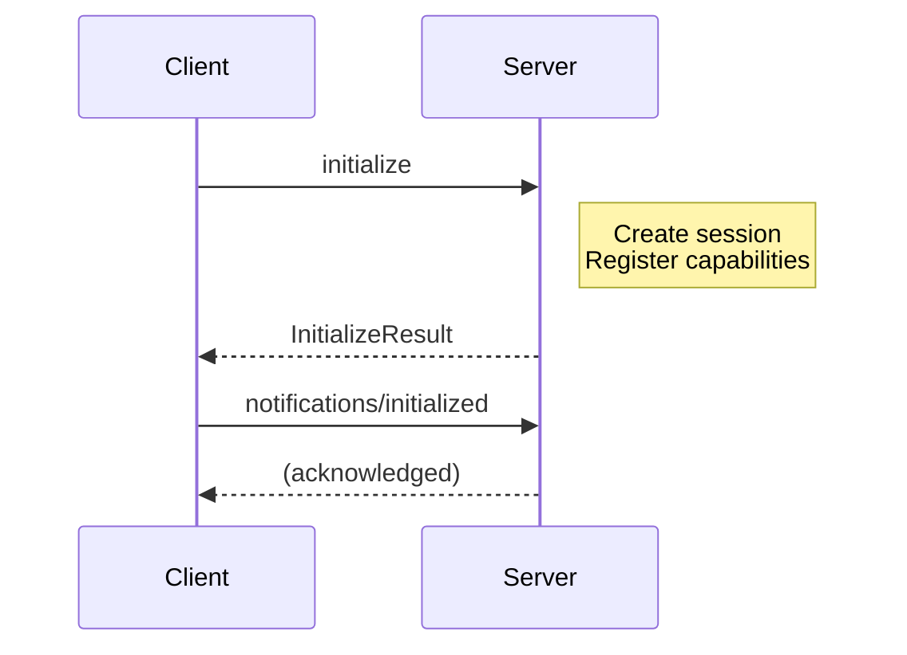

**Request:**

```json
{
  "jsonrpc": "2.0",
  "id": 1,
  "method": "initialize",
  "params": {
    "protocolVersion": "2024-11-05",
    "capabilities": {},
    "clientInfo": {
      "name": "my-client",
      "version": "1.0.0"
    }
  }
}
```

**Response:**

```json
{
  "jsonrpc": "2.0",
  "id": 1,
  "result": {
    "protocolVersion": "2024-11-05",
    "capabilities": {
      "tools": {},
      "resources": {},
      "prompts": {},
      "logging": {}
    },
    "serverInfo": {
      "name": "tfo-mcp",
      "version": "1.1.2"
    }
  }
}
```

### tools/list

List available tools.

**Request:**

```json
{
  "jsonrpc": "2.0",
  "id": 2,
  "method": "tools/list",
  "params": {}
}
```

**Response:**

```json
{
  "jsonrpc": "2.0",
  "id": 2,
  "result": {
    "tools": [
      {
        "name": "claude_conversation",
        "description": "Have a conversation with Claude AI",
        "inputSchema": {
          "type": "object",
          "properties": {
            "message": {
              "type": "string",
              "description": "The message to send to Claude"
            },
            "model": {
              "type": "string",
              "description": "Claude model to use"
            }
          },
          "required": ["message"]
        }
      }
    ]
  }
}
```

### tools/call

Execute a tool.

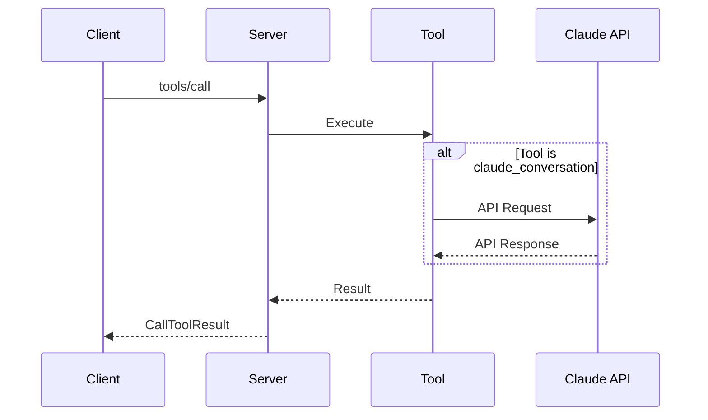

**Request:**

```json
{
  "jsonrpc": "2.0",
  "id": 3,
  "method": "tools/call",
  "params": {
    "name": "claude_conversation",
    "arguments": {
      "message": "What is the capital of France?",
      "model": "claude-sonnet-4-20250514"
    }
  }
}
```

**Response:**

```json
{
  "jsonrpc": "2.0",
  "id": 3,
  "result": {
    "content": [
      {
        "type": "text",
        "text": "The capital of France is Paris."
      }
    ],
    "isError": false
  }
}
```

### resources/list

List available resources.

**Request:**

```json
{
  "jsonrpc": "2.0",
  "id": 4,
  "method": "resources/list",
  "params": {}
}
```

**Response:**

```json
{
  "jsonrpc": "2.0",
  "id": 4,
  "result": {
    "resources": [
      {
        "uri": "file:///project/README.md",
        "name": "README.md",
        "description": "Project readme file",
        "mimeType": "text/markdown"
      }
    ]
  }
}
```

### resources/read

Read a resource.

**Request:**

```json
{
  "jsonrpc": "2.0",
  "id": 5,
  "method": "resources/read",
  "params": {
    "uri": "file:///project/README.md"
  }
}
```

**Response:**

```json
{
  "jsonrpc": "2.0",
  "id": 5,
  "result": {
    "contents": [
      {
        "uri": "file:///project/README.md",
        "mimeType": "text/markdown",
        "text": "# Project README\n..."
      }
    ]
  }
}
```

### prompts/list

List available prompts.

**Request:**

```json
{
  "jsonrpc": "2.0",
  "id": 6,
  "method": "prompts/list",
  "params": {}
}
```

**Response:**

```json
{
  "jsonrpc": "2.0",
  "id": 6,
  "result": {
    "prompts": [
      {
        "name": "code_review",
        "description": "Review code for best practices",
        "arguments": [
          {
            "name": "code",
            "description": "Code to review",
            "required": true
          },
          {
            "name": "language",
            "description": "Programming language",
            "required": false
          }
        ]
      }
    ]
  }
}
```

### prompts/get

Get a specific prompt.

**Request:**

```json
{
  "jsonrpc": "2.0",
  "id": 7,
  "method": "prompts/get",
  "params": {
    "name": "code_review",
    "arguments": {
      "code": "func main() { fmt.Println(\"Hello\") }",
      "language": "go"
    }
  }
}
```

**Response:**

```json
{
  "jsonrpc": "2.0",
  "id": 7,
  "result": {
    "description": "Review code for best practices",
    "messages": [
      {
        "role": "user",
        "content": {
          "type": "text",
          "text": "Please review this go code for best practices:\n\nfunc main() { fmt.Println(\"Hello\") }"
        }
      }
    ]
  }
}
```

### logging/setLevel

Set the logging level.

**Request:**

```json
{
  "jsonrpc": "2.0",
  "id": 8,
  "method": "logging/setLevel",
  "params": {
    "level": "debug"
  }
}
```

**Response:**

```json
{
  "jsonrpc": "2.0",
  "id": 8,
  "result": {}
}
```

---

## Built-in Tools

### Tool Overview

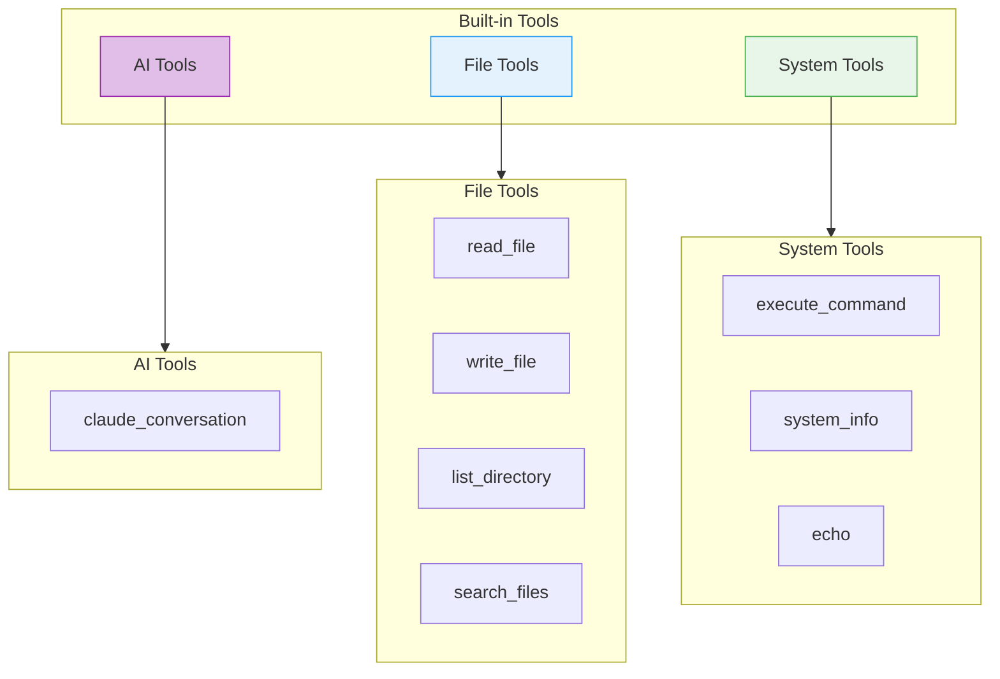

### claude_conversation

Interact with Claude AI.

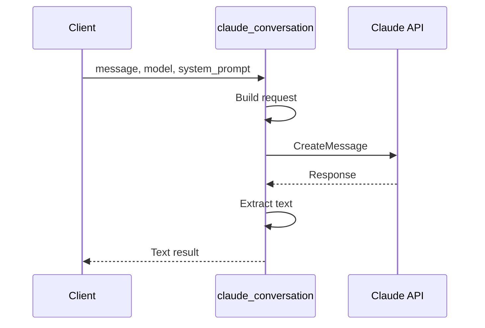

**Parameters:**

| Name            | Type   | Required | Description                          |
| --------------- | ------ | -------- | ------------------------------------ |
| `message`       | string | Yes      | Message to send to Claude            |
| `model`         | string | No       | Claude model (default: config value) |
| `system_prompt` | string | No       | System prompt for context            |
| `max_tokens`    | int    | No       | Maximum response tokens              |
| `temperature`   | float  | No       | Response temperature (0-1)           |

**Example:**

```json
{
  "name": "claude_conversation",
  "arguments": {
    "message": "Explain recursion in programming",
    "model": "claude-sonnet-4-20250514",
    "system_prompt": "You are a helpful programming tutor",
    "max_tokens": 1000
  }
}
```

### read_file

Read file contents.

**Parameters:**

| Name       | Type   | Required | Description                    |
| ---------- | ------ | -------- | ------------------------------ |
| `path`     | string | Yes      | File path to read              |
| `encoding` | string | No       | File encoding (default: utf-8) |

**Example:**

```json
{
  "name": "read_file",
  "arguments": {
    "path": "/project/main.go"
  }
}
```

### write_file

Write content to a file.

**Parameters:**

| Name          | Type   | Required | Description               |
| ------------- | ------ | -------- | ------------------------- |
| `path`        | string | Yes      | File path to write        |
| `content`     | string | Yes      | Content to write          |
| `create_dirs` | bool   | No       | Create parent directories |

**Example:**

```json
{
  "name": "write_file",
  "arguments": {
    "path": "/project/output.txt",
    "content": "Hello, World!",
    "create_dirs": true
  }
}
```

### list_directory

List directory contents.

**Parameters:**

| Name             | Type   | Required | Description          |
| ---------------- | ------ | -------- | -------------------- |
| `path`           | string | Yes      | Directory path       |
| `recursive`      | bool   | No       | List recursively     |
| `include_hidden` | bool   | No       | Include hidden files |

**Example:**

```json
{
  "name": "list_directory",
  "arguments": {
    "path": "/project",
    "recursive": true
  }
}
```

### search_files

Search for files matching a pattern.

**Parameters:**

| Name      | Type   | Required | Description                      |
| --------- | ------ | -------- | -------------------------------- |
| `pattern` | string | Yes      | Search pattern (glob or regex)   |
| `path`    | string | No       | Base path (default: current dir) |
| `type`    | string | No       | Pattern type: "glob" or "regex"  |

**Example:**

```json
{
  "name": "search_files",
  "arguments": {
    "pattern": "*.go",
    "path": "/project",
    "type": "glob"
  }
}
```

### execute_command

Execute a shell command.

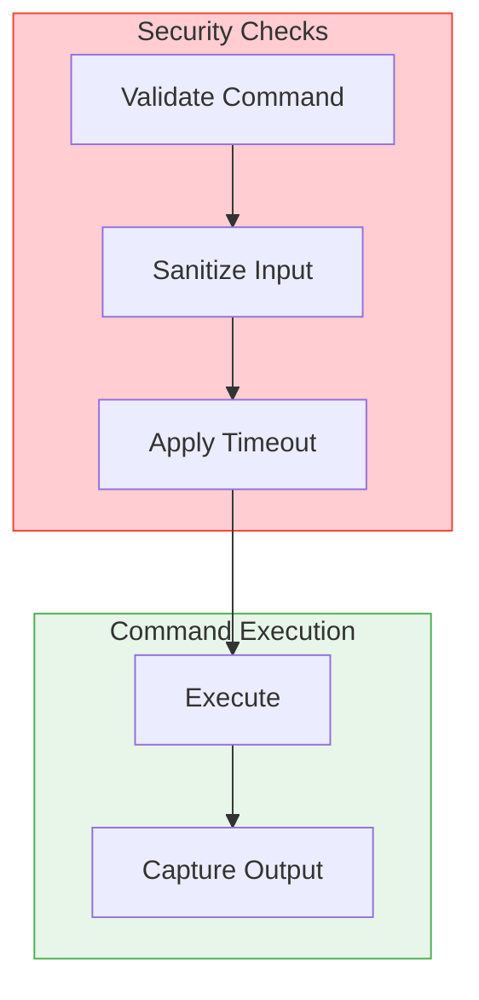

**Parameters:**

| Name          | Type     | Required | Description        |
| ------------- | -------- | -------- | ------------------ |
| `command`     | string   | Yes      | Command to execute |
| `args`        | []string | No       | Command arguments  |
| `timeout`     | string   | No       | Execution timeout  |
| `working_dir` | string   | No       | Working directory  |

**Example:**

```json
{
  "name": "execute_command",
  "arguments": {
    "command": "go",
    "args": ["build", "-o", "app"],
    "timeout": "60s",
    "working_dir": "/project"
  }
}
```

### system_info

Get system information.

**Parameters:**

| Name      | Type     | Required | Description                             |
| --------- | -------- | -------- | --------------------------------------- |
| `include` | []string | No       | Info to include (os, cpu, memory, disk) |

**Example:**

```json
{
  "name": "system_info",
  "arguments": {
    "include": ["os", "cpu", "memory"]
  }
}
```

**Response:**

```json
{
  "os": {
    "platform": "darwin",
    "architecture": "arm64",
    "version": "14.0"
  },
  "cpu": {
    "cores": 8,
    "model": "Apple M1"
  },
  "memory": {
    "total": "16GB",
    "available": "8GB"
  }
}
```

### echo

Echo back the input (useful for testing).

**Parameters:**

| Name      | Type   | Required | Description     |
| --------- | ------ | -------- | --------------- |
| `message` | string | Yes      | Message to echo |

**Example:**

```json
{
  "name": "echo",
  "arguments": {
    "message": "Hello, TFO-MCP!"
  }
}
```

---

## Resource Operations

### Resource Types

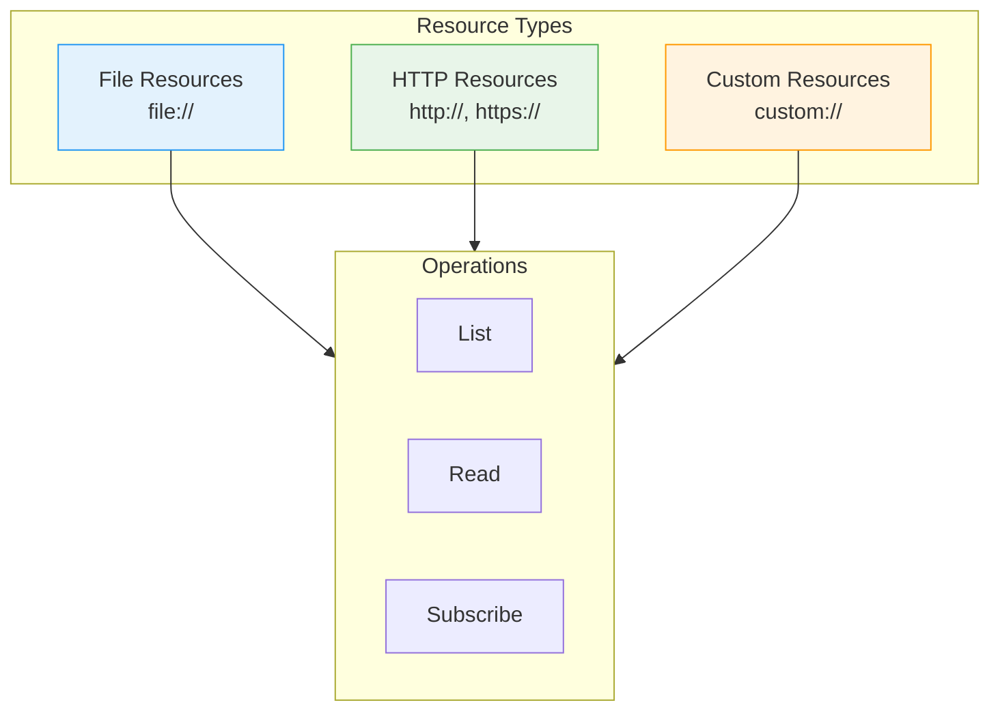

### Resource URI Schemes

| Scheme      | Description       | Example                        |
| ----------- | ----------------- | ------------------------------ |
| `file://`   | Local file system | `file:///path/to/file.txt`     |
| `http://`   | HTTP resource     | `http://api.example.com/data`  |
| `https://`  | HTTPS resource    | `https://api.example.com/data` |
| `custom://` | Custom handler    | `custom://myresource/id`       |

---

## Prompt Operations

### Prompt Lifecycle

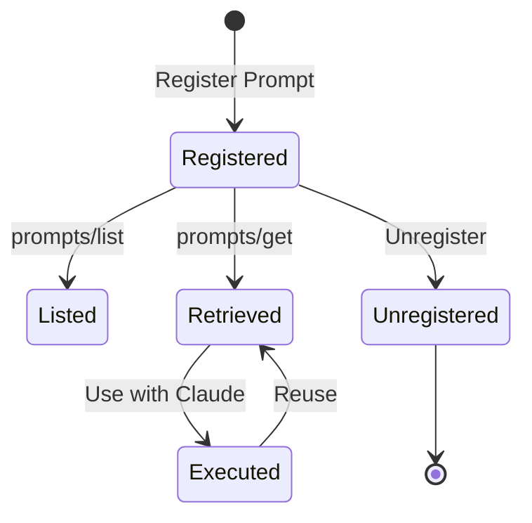

### Built-in Prompts

| Prompt         | Description           | Arguments                    |
| -------------- | --------------------- | ---------------------------- |
| `code_review`  | Code review assistant | code, language               |
| `explain_code` | Code explanation      | code, language, detail_level |
| `debug_help`   | Debugging assistant   | error_message, code_context  |
| `write_docs`   | Documentation writer  | code, doc_type               |

---

## Session Management

### Session Lifecycle

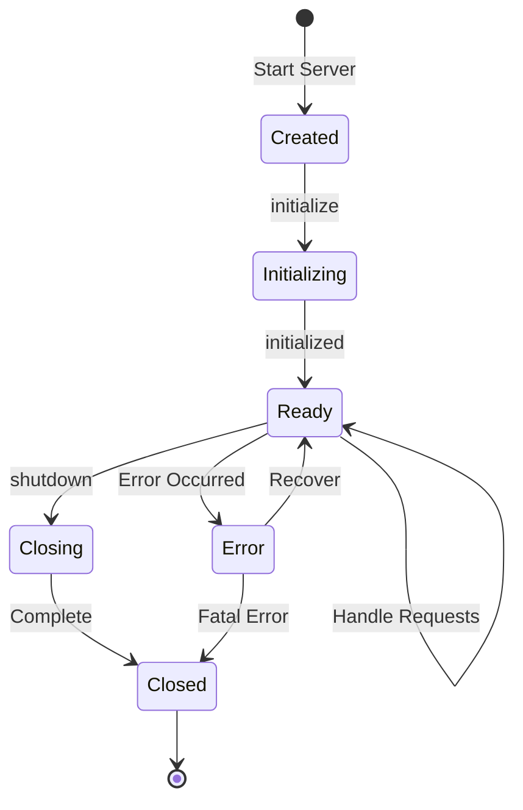

### Session States

| State        | Description                      | Valid Operations |
| ------------ | -------------------------------- | ---------------- |
| Created      | Session created, not initialized | initialize       |
| Initializing | Processing initialize request    | -                |
| Ready        | Session ready for requests       | All MCP methods  |
| Closing      | Session shutting down            | -                |
| Closed       | Session terminated               | -                |

---

## Examples

### Complete Session Example

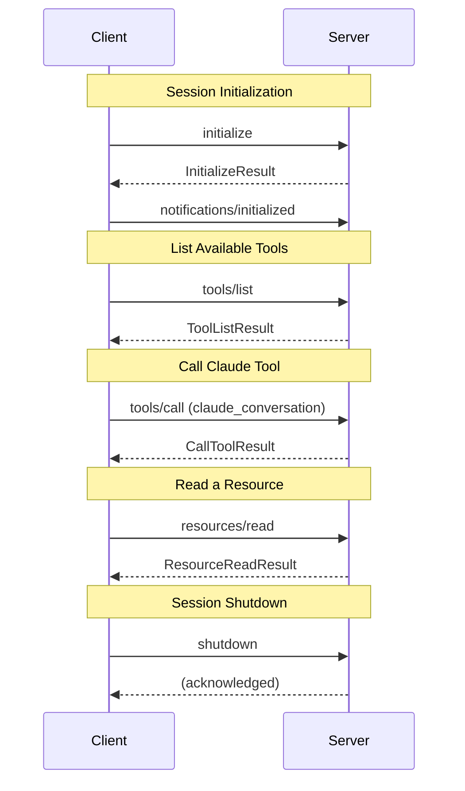

### CLI Usage Examples

```bash
# Start server with default config
tfo-mcp run

# Start with debug logging
tfo-mcp run --log-level debug

# Start with custom config
tfo-mcp run --config /etc/tfo-mcp/production.yaml

# Validate configuration
tfo-mcp validate --verbose

# Show version
tfo-mcp version

# Get help
tfo-mcp help
tfo-mcp help run
```

### JSON-RPC Examples

```bash
# Initialize session
echo '{"jsonrpc":"2.0","id":1,"method":"initialize","params":{"protocolVersion":"2024-11-05","clientInfo":{"name":"test","version":"1.0.0"}}}' | tfo-mcp run

# List tools
echo '{"jsonrpc":"2.0","id":2,"method":"tools/list","params":{}}' | tfo-mcp run

# Call Claude conversation tool
echo '{"jsonrpc":"2.0","id":3,"method":"tools/call","params":{"name":"claude_conversation","arguments":{"message":"Hello!"}}}' | tfo-mcp run
```

---

## Related Documentation

- [Architecture Guide](ARCHITECTURE.md)
- [Configuration Guide](CONFIGURATION.md)
- [Development Guide](DEVELOPMENT.md)
- [Troubleshooting Guide](TROUBLESHOOTING.md)

---

<div align="center">

**[Back to Documentation Index](README.md)**

</div>
