# TFO-MCP Configuration Guide

> Complete configuration reference for TelemetryFlow MCP Server

---

## Table of Contents

- [Overview](#overview)
- [Configuration Architecture](#configuration-architecture)
- [Configuration File](#configuration-file)
- [Environment Variables](#environment-variables)
- [Server Configuration](#server-configuration)
- [Claude API Configuration](#claude-api-configuration)
- [MCP Protocol Configuration](#mcp-protocol-configuration)
- [Logging Configuration](#logging-configuration)
- [Telemetry Configuration](#telemetry-configuration)
- [Security Configuration](#security-configuration)
- [Configuration Validation](#configuration-validation)
- [Configuration Examples](#configuration-examples)
- [Best Practices](#best-practices)

---

## Overview

TFO-MCP uses a hierarchical configuration system that supports multiple sources with precedence rules.

### Configuration Hierarchy

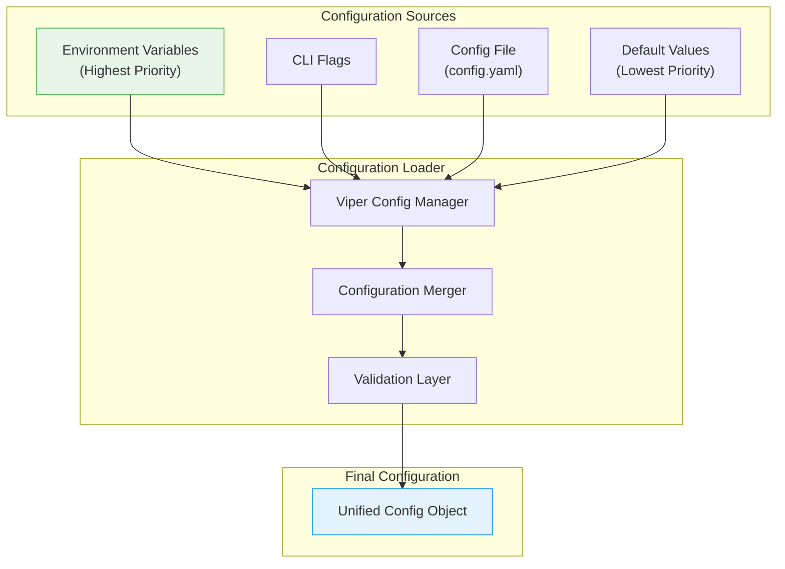

### Configuration Loading Process

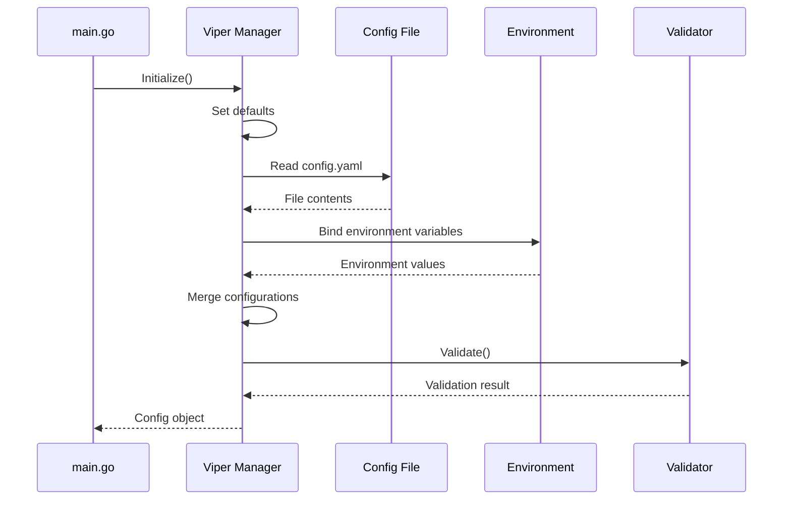

---

## Configuration Architecture

### Configuration Domains

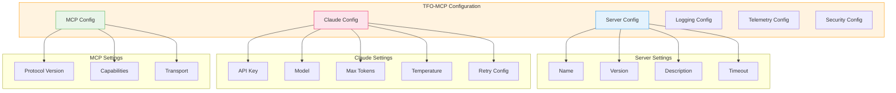

### Configuration Structure

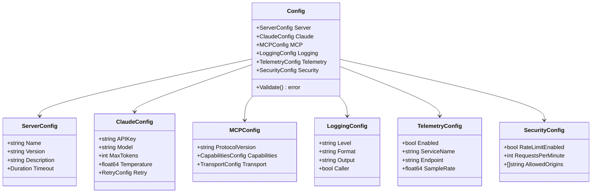

---

## Configuration File

### Default Configuration Location

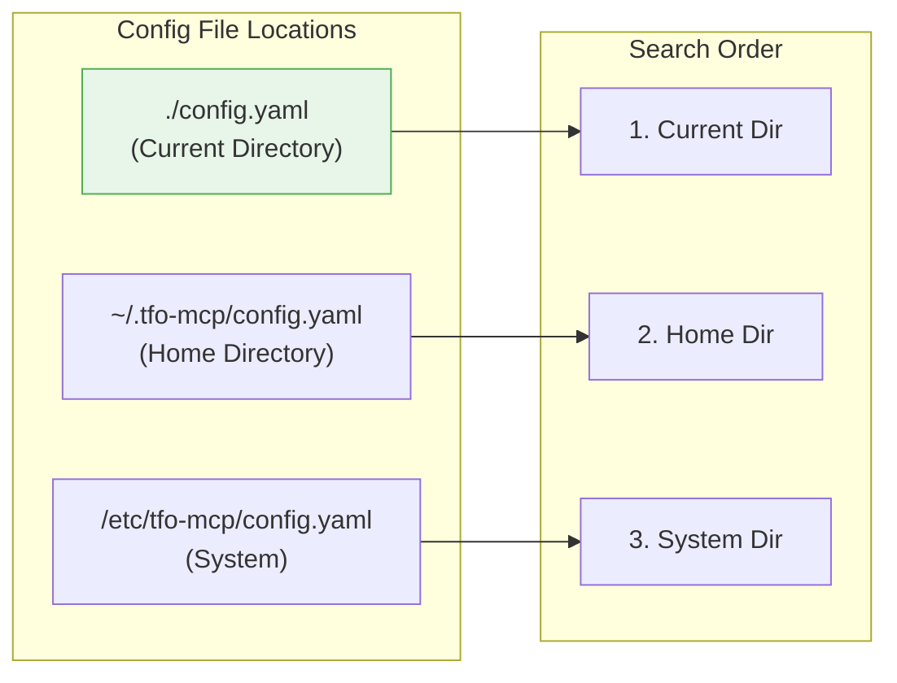

### Complete Configuration File

```yaml
# ==============================================================================
# TFO-MCP Configuration File
# ==============================================================================

# Server Configuration
server:
  name: "tfo-mcp"
  version: "1.1.2"
  description: "TelemetryFlow MCP Server - Claude AI Integration"
  timeout: 30s

# Claude API Configuration
claude:
  api_key: "" # Use TELEMETRYFLOW_MCP_CLAUDE_API_KEY environment variable
  base_url: "https://api.anthropic.com"
  model: "claude-sonnet-4-20250514"
  max_tokens: 4096
  temperature: 0.7
  top_p: 0.9
  top_k: 40
  retry:
    max_attempts: 3
    initial_delay: 1s
    max_delay: 30s
    multiplier: 2.0

# MCP Protocol Configuration
mcp:
  protocol_version: "2024-11-05"
  capabilities:
    tools: true
    resources: true
    prompts: true
    logging: true
  transport:
    type: "stdio"
    buffer_size: 65536

# Logging Configuration
logging:
  level: "info"
  format: "json"
  output: "stderr"
  caller: false
  timestamp_format: "2006-01-02T15:04:05.000Z07:00"

# Telemetry Configuration (OpenTelemetry)
telemetry:
  enabled: false
  service_name: "tfo-mcp"
  service_version: "1.1.2"
  environment: "development"
  endpoint: "localhost:4317"
  sample_rate: 1.0
  export_timeout: 30s

# Security Configuration
security:
  rate_limit:
    enabled: true
    requests_per_minute: 60
    burst_size: 10
  cors:
    enabled: false
    allowed_origins:
      - "*"
  api_key_validation: true
```

---

## Environment Variables

### Environment Variable Mapping

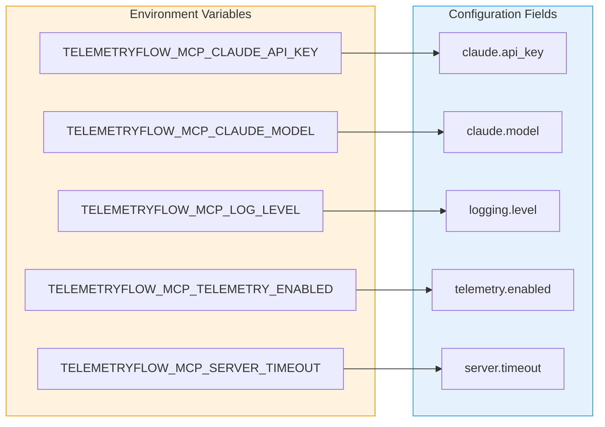

### Complete Environment Variables Reference

| Variable                               | Config Path                               | Type     | Default                     | Description               |
| -------------------------------------- | ----------------------------------------- | -------- | --------------------------- | ------------------------- |
| `TELEMETRYFLOW_MCP_CLAUDE_API_KEY`     | `claude.api_key`                          | string   | ""                          | Claude API key (required) |
| `TELEMETRYFLOW_MCP_CLAUDE_BASE_URL`    | `claude.base_url`                         | string   | "https://api.anthropic.com" | Claude API base URL       |
| `TELEMETRYFLOW_MCP_CLAUDE_MODEL`       | `claude.model`                            | string   | "claude-sonnet-4-20250514"  | Default Claude model      |
| `TELEMETRYFLOW_MCP_CLAUDE_MAX_TOKENS`  | `claude.max_tokens`                       | int      | 4096                        | Maximum response tokens   |
| `TELEMETRYFLOW_MCP_CLAUDE_TEMPERATURE` | `claude.temperature`                      | float    | 0.7                         | Response temperature      |
| `TELEMETRYFLOW_MCP_SERVER_NAME`        | `server.name`                             | string   | "tfo-mcp"                   | Server name               |
| `TELEMETRYFLOW_MCP_SERVER_TIMEOUT`     | `server.timeout`                          | duration | "30s"                       | Request timeout           |
| `TELEMETRYFLOW_MCP_LOG_LEVEL`          | `logging.level`                           | string   | "info"                      | Log level                 |
| `TELEMETRYFLOW_MCP_LOG_FORMAT`         | `logging.format`                          | string   | "json"                      | Log format                |
| `TELEMETRYFLOW_MCP_TELEMETRY_ENABLED`  | `telemetry.enabled`                       | bool     | false                       | Enable telemetry          |
| `TELEMETRYFLOW_MCP_TELEMETRY_ENDPOINT` | `telemetry.endpoint`                      | string   | "localhost:4317"            | OTLP endpoint             |
| `TELEMETRYFLOW_MCP_RATE_LIMIT_ENABLED` | `security.rate_limit.enabled`             | bool     | true                        | Enable rate limiting      |
| `TELEMETRYFLOW_MCP_RATE_LIMIT_RPM`     | `security.rate_limit.requests_per_minute` | int      | 60                          | Requests per minute       |

### Setting Environment Variables

```bash
# Required - Claude API Key
export TELEMETRYFLOW_MCP_CLAUDE_API_KEY="sk-ant-api03-..."

# Optional - Model selection
export TELEMETRYFLOW_MCP_CLAUDE_MODEL="claude-sonnet-4-20250514"

# Optional - Logging
export TELEMETRYFLOW_MCP_LOG_LEVEL="debug"
export TELEMETRYFLOW_MCP_LOG_FORMAT="text"

# Optional - Telemetry
export TELEMETRYFLOW_MCP_TELEMETRY_ENABLED="true"
export TELEMETRYFLOW_MCP_TELEMETRY_ENDPOINT="otel-collector:4317"

# Optional - Rate limiting
export TELEMETRYFLOW_MCP_RATE_LIMIT_ENABLED="true"
export TELEMETRYFLOW_MCP_RATE_LIMIT_RPM="120"
```

---

## Server Configuration

### Server Settings

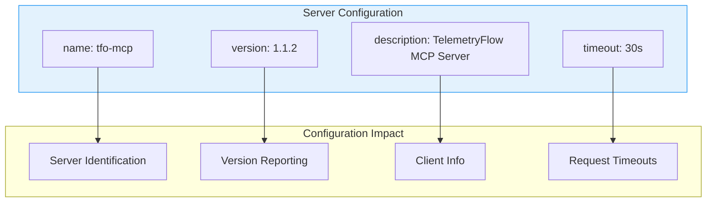

### Server Configuration Options

| Option        | Type     | Default                    | Description                |
| ------------- | -------- | -------------------------- | -------------------------- |
| `name`        | string   | "tfo-mcp"                  | Server identifier          |
| `version`     | string   | "1.1.2"                    | Server version             |
| `description` | string   | "TelemetryFlow MCP Server" | Human-readable description |
| `timeout`     | duration | "30s"                      | Default request timeout    |

### Server Configuration Example

```yaml
server:
  name: "tfo-mcp"
  version: "1.1.2"
  description: "TelemetryFlow MCP Server - Claude AI Integration"
  timeout: 30s
```

---

## Claude API Configuration

### Claude Configuration Flow

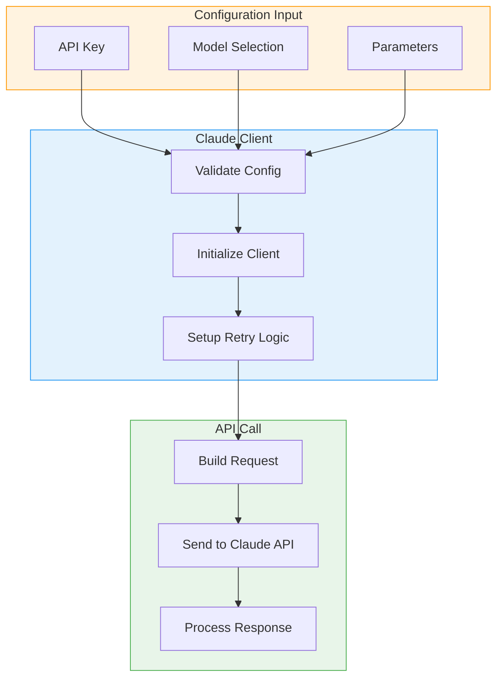

### Claude Configuration Options

| Option                | Type     | Default                     | Description                |
| --------------------- | -------- | --------------------------- | -------------------------- |
| `api_key`             | string   | ""                          | Claude API key (required)  |
| `base_url`            | string   | "https://api.anthropic.com" | API base URL               |
| `model`               | string   | "claude-sonnet-4-20250514"  | Default model              |
| `max_tokens`          | int      | 4096                        | Maximum response tokens    |
| `temperature`         | float    | 0.7                         | Response randomness (0-1)  |
| `top_p`               | float    | 0.9                         | Nucleus sampling threshold |
| `top_k`               | int      | 40                          | Top-k sampling             |
| `retry.max_attempts`  | int      | 3                           | Maximum retry attempts     |
| `retry.initial_delay` | duration | "1s"                        | Initial retry delay        |
| `retry.max_delay`     | duration | "30s"                       | Maximum retry delay        |
| `retry.multiplier`    | float    | 2.0                         | Backoff multiplier         |

### Supported Models

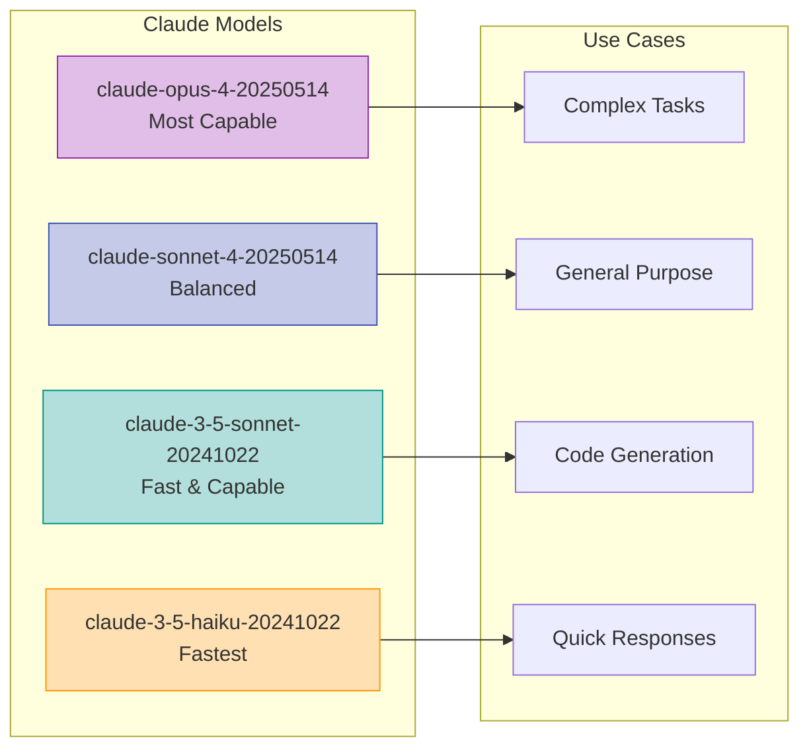

### Claude Configuration Example

```yaml
claude:
  api_key: "" # Use TELEMETRYFLOW_MCP_CLAUDE_API_KEY env var
  base_url: "https://api.anthropic.com"
  model: "claude-sonnet-4-20250514"
  max_tokens: 4096
  temperature: 0.7
  top_p: 0.9
  top_k: 40
  retry:
    max_attempts: 3
    initial_delay: 1s
    max_delay: 30s
    multiplier: 2.0
```

---

## MCP Protocol Configuration

### MCP Capabilities

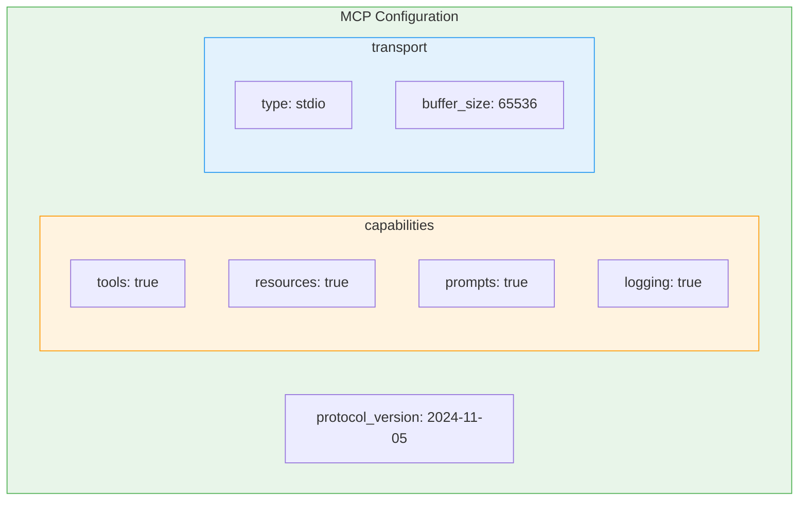

### MCP Configuration Options

| Option                   | Type   | Default      | Description                 |
| ------------------------ | ------ | ------------ | --------------------------- |
| `protocol_version`       | string | "2024-11-05" | MCP protocol version        |
| `capabilities.tools`     | bool   | true         | Enable tools capability     |
| `capabilities.resources` | bool   | true         | Enable resources capability |
| `capabilities.prompts`   | bool   | true         | Enable prompts capability   |
| `capabilities.logging`   | bool   | true         | Enable logging capability   |
| `transport.type`         | string | "stdio"      | Transport type              |
| `transport.buffer_size`  | int    | 65536        | Buffer size in bytes        |

### MCP Configuration Example

```yaml
mcp:
  protocol_version: "2024-11-05"
  capabilities:
    tools: true
    resources: true
    prompts: true
    logging: true
  transport:
    type: "stdio"
    buffer_size: 65536
```

---

## Logging Configuration

### Logging Levels

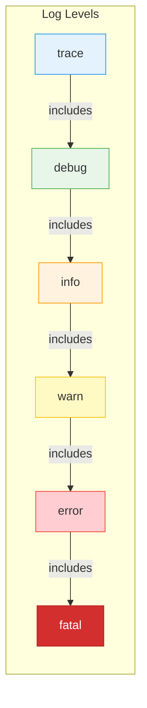

### Logging Configuration Options

| Option             | Type   | Default  | Description                                   |
| ------------------ | ------ | -------- | --------------------------------------------- |
| `level`            | string | "info"   | Log level (trace/debug/info/warn/error/fatal) |
| `format`           | string | "json"   | Output format (json/text)                     |
| `output`           | string | "stderr" | Output destination (stderr/stdout/file path)  |
| `caller`           | bool   | false    | Include caller information                    |
| `timestamp_format` | string | RFC3339  | Timestamp format                              |

### Log Output Formats

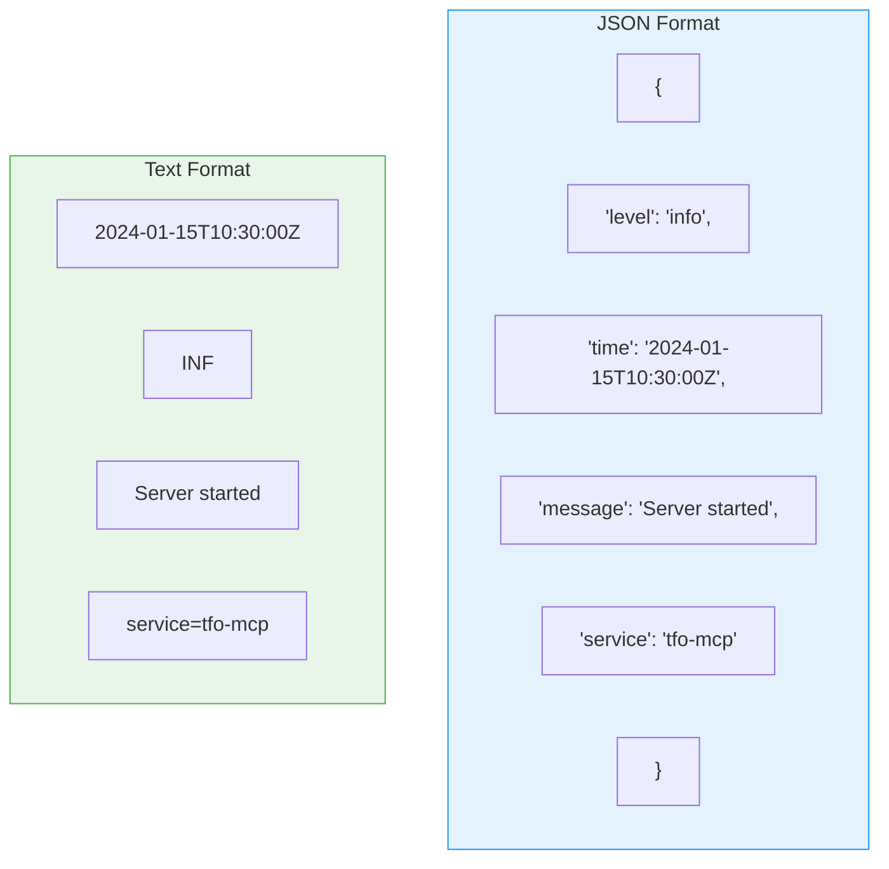

### Logging Configuration Example

```yaml
logging:
  level: "info"
  format: "json"
  output: "stderr"
  caller: false
  timestamp_format: "2006-01-02T15:04:05.000Z07:00"
```

---

## Telemetry Configuration

### OpenTelemetry Integration

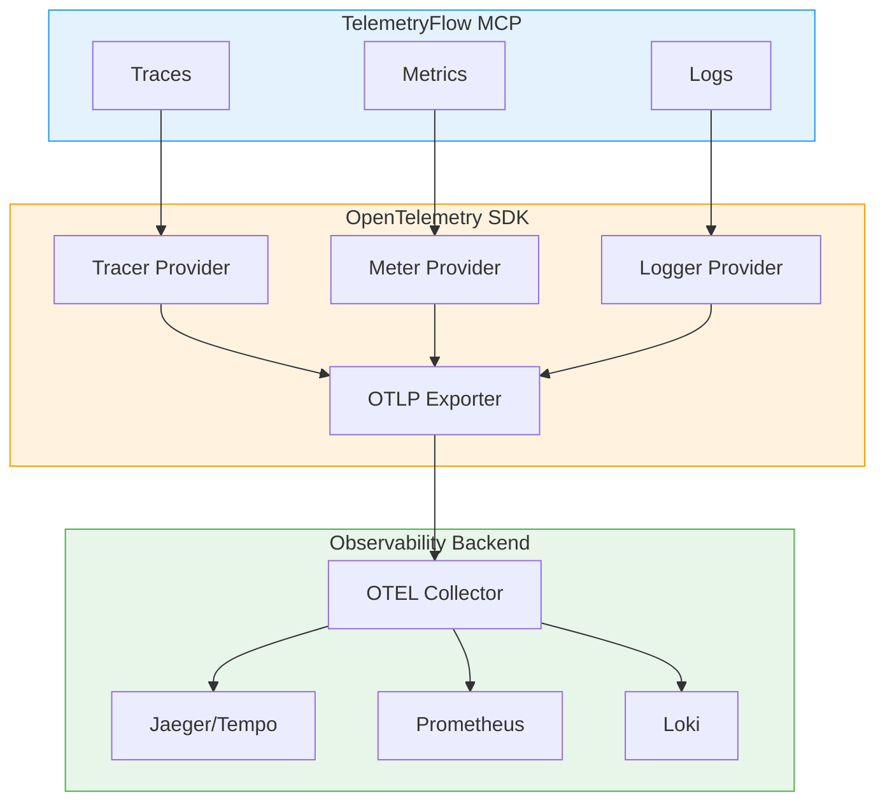

### Telemetry Configuration Options

| Option            | Type     | Default          | Description               |
| ----------------- | -------- | ---------------- | ------------------------- |
| `enabled`         | bool     | false            | Enable telemetry          |
| `service_name`    | string   | "tfo-mcp"        | Service name for traces   |
| `service_version` | string   | "1.1.2"          | Service version           |
| `environment`     | string   | "development"    | Deployment environment    |
| `endpoint`        | string   | "localhost:4317" | OTLP endpoint             |
| `sample_rate`     | float    | 1.0              | Trace sampling rate (0-1) |
| `export_timeout`  | duration | "30s"            | Export timeout            |

### Telemetry Configuration Example

```yaml
telemetry:
  enabled: true
  service_name: "tfo-mcp"
  service_version: "1.1.2"
  environment: "production"
  endpoint: "otel-collector:4317"
  sample_rate: 0.1 # 10% sampling
  export_timeout: 30s
```

---

## Security Configuration

### Security Architecture

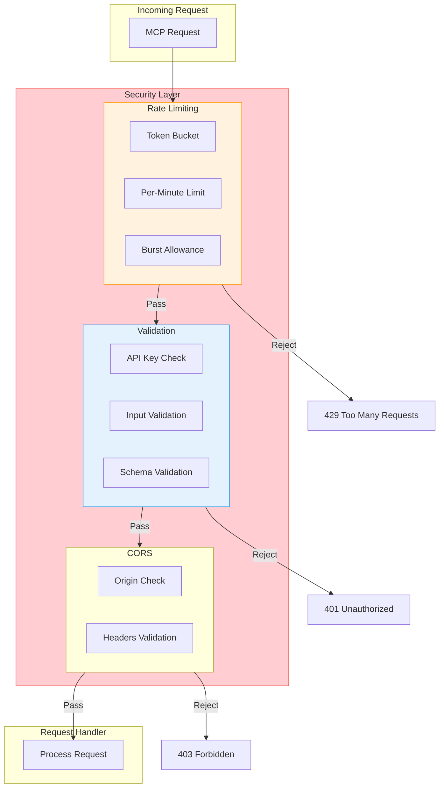

### Security Configuration Options

| Option                           | Type     | Default | Description             |
| -------------------------------- | -------- | ------- | ----------------------- |
| `rate_limit.enabled`             | bool     | true    | Enable rate limiting    |
| `rate_limit.requests_per_minute` | int      | 60      | Max requests per minute |
| `rate_limit.burst_size`          | int      | 10      | Burst allowance         |
| `cors.enabled`                   | bool     | false   | Enable CORS             |
| `cors.allowed_origins`           | []string | ["*"]   | Allowed origins         |
| `api_key_validation`             | bool     | true    | Validate API keys       |

### Security Configuration Example

```yaml
security:
  rate_limit:
    enabled: true
    requests_per_minute: 60
    burst_size: 10
  cors:
    enabled: false
    allowed_origins:
      - "https://example.com"
      - "https://app.example.com"
  api_key_validation: true
```

---

## Configuration Validation

### Validation Process

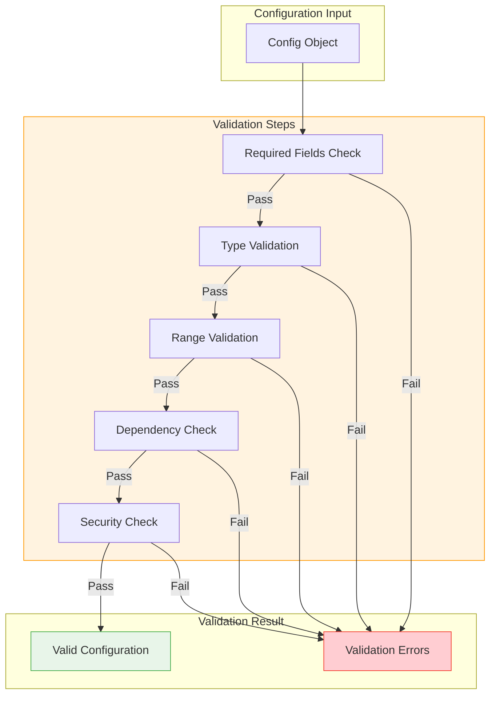

### Validation Rules

| Field                   | Rule        | Error Message                         |
| ----------------------- | ----------- | ------------------------------------- |
| `claude.api_key`        | Required    | "Claude API key is required"          |
| `claude.max_tokens`     | > 0         | "max_tokens must be positive"         |
| `claude.temperature`    | 0-1         | "temperature must be between 0 and 1" |
| `logging.level`         | Valid level | "invalid log level"                   |
| `telemetry.sample_rate` | 0-1         | "sample_rate must be between 0 and 1" |

### Validating Configuration

```bash
# Validate configuration file
tfo-mcp validate

# Validate with verbose output
tfo-mcp validate --verbose

# Validate specific config file
tfo-mcp validate --config /path/to/config.yaml
```

---

## Configuration Examples

### Development Configuration

```yaml
# Development configuration
server:
  name: "tfo-mcp-dev"
  version: "1.1.2"
  timeout: 60s

claude:
  model: "claude-3-5-haiku-20241022" # Fast model for development
  max_tokens: 2048
  temperature: 0.9

logging:
  level: "debug"
  format: "text" # Human-readable format
  caller: true

telemetry:
  enabled: false

security:
  rate_limit:
    enabled: false # Disable for development
```

### Production Configuration

```yaml
# Production configuration
server:
  name: "tfo-mcp"
  version: "1.1.2"
  timeout: 30s

claude:
  model: "claude-sonnet-4-20250514"
  max_tokens: 4096
  temperature: 0.7
  retry:
    max_attempts: 5
    initial_delay: 2s
    max_delay: 60s

logging:
  level: "info"
  format: "json"
  caller: false

telemetry:
  enabled: true
  service_name: "tfo-mcp"
  environment: "production"
  endpoint: "otel-collector.monitoring:4317"
  sample_rate: 0.1

security:
  rate_limit:
    enabled: true
    requests_per_minute: 120
    burst_size: 20
  api_key_validation: true
```

### Minimal Configuration

```yaml
# Minimal configuration - only required settings
claude:
  api_key: "" # Set via TELEMETRYFLOW_MCP_CLAUDE_API_KEY
```

### Docker Configuration

```yaml
# Docker-optimized configuration
server:
  name: "tfo-mcp"
  timeout: 30s

claude:
  api_key: "" # Injected via environment

logging:
  level: "info"
  format: "json"
  output: "stdout" # Docker-friendly

telemetry:
  enabled: true
  endpoint: "otel-collector:4317"
```

---

## Best Practices

### Configuration Best Practices

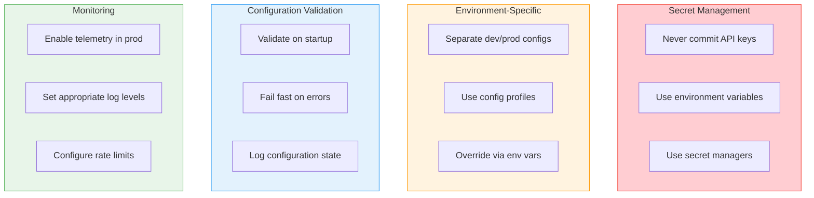

### Security Best Practices

1. **Never commit secrets**

   ```bash
   # Use .gitignore
   echo "config.local.yaml" >> .gitignore
   echo ".env" >> .gitignore
   ```

2. **Use environment variables for secrets**

   ```bash
   export TELEMETRYFLOW_MCP_CLAUDE_API_KEY="sk-ant-api03-..."
   ```

3. **Use secret managers in production**

   ```bash
   # AWS Secrets Manager
   TELEMETRYFLOW_MCP_CLAUDE_API_KEY=$(aws secretsmanager get-secret-value --secret-id tfo-mcp/api-key --query SecretString --output text)
   ```

4. **Enable rate limiting in production**
   ```yaml
   security:
     rate_limit:
       enabled: true
       requests_per_minute: 60
   ```

### Performance Best Practices

1. **Choose appropriate models**

   - Use Haiku for quick responses
   - Use Sonnet for balanced performance
   - Use Opus for complex tasks

2. **Configure appropriate timeouts**

   ```yaml
   server:
     timeout: 30s # Adjust based on workload
   ```

3. **Enable telemetry for monitoring**
   ```yaml
   telemetry:
     enabled: true
     sample_rate: 0.1 # 10% sampling to reduce overhead
   ```

---

## Related Documentation

- [Architecture Guide](ARCHITECTURE.md)
- [Commands Reference](COMMANDS.md)
- [Development Guide](DEVELOPMENT.md)
- [Installation Guide](INSTALLATION.md)
- [Troubleshooting Guide](TROUBLESHOOTING.md)

---

<div align="center">

**[Back to Documentation Index](README.md)**

</div>
