# TFO-MCP Development Guide

> Complete development guide for TelemetryFlow MCP Server

---

## Table of Contents

- [Overview](#overview)
- [Development Environment](#development-environment)
- [Project Structure](#project-structure)
- [Development Workflow](#development-workflow)
- [Coding Standards](#coding-standards)
- [Testing](#testing)
- [Debugging](#debugging)
- [Contributing](#contributing)
- [Release Process](#release-process)

---

## Overview

This guide provides comprehensive information for developers working on TFO-MCP.

### Development Architecture

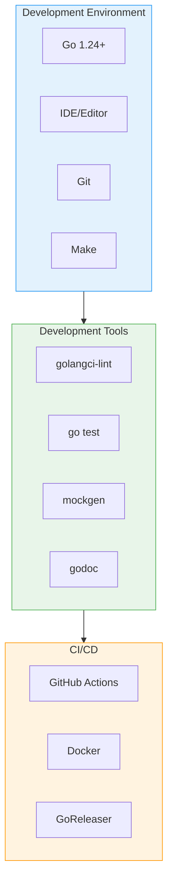

---

## Development Environment

### Prerequisites

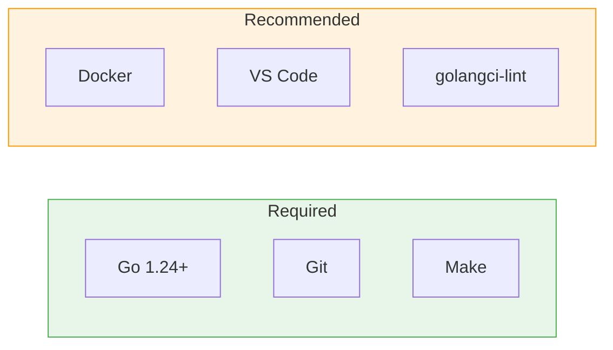

### Installation

```bash
# Install Go 1.24+
# macOS
brew install go

# Linux
wget https://go.dev/dl/go1.24.linux-amd64.tar.gz
sudo tar -C /usr/local -xzf go1.24.linux-amd64.tar.gz
export PATH=$PATH:/usr/local/go/bin

# Windows
# Download from https://go.dev/dl/

# Verify installation
go version
```

### IDE Setup

#### VS Code

```json
// .vscode/settings.json
{
  "go.useLanguageServer": true,
  "go.lintTool": "golangci-lint",
  "go.lintFlags": ["--fast"],
  "go.formatTool": "goimports",
  "go.testFlags": ["-v"],
  "editor.formatOnSave": true,
  "[go]": {
    "editor.defaultFormatter": "golang.go",
    "editor.codeActionsOnSave": {
      "source.organizeImports": true
    }
  }
}
```

#### GoLand

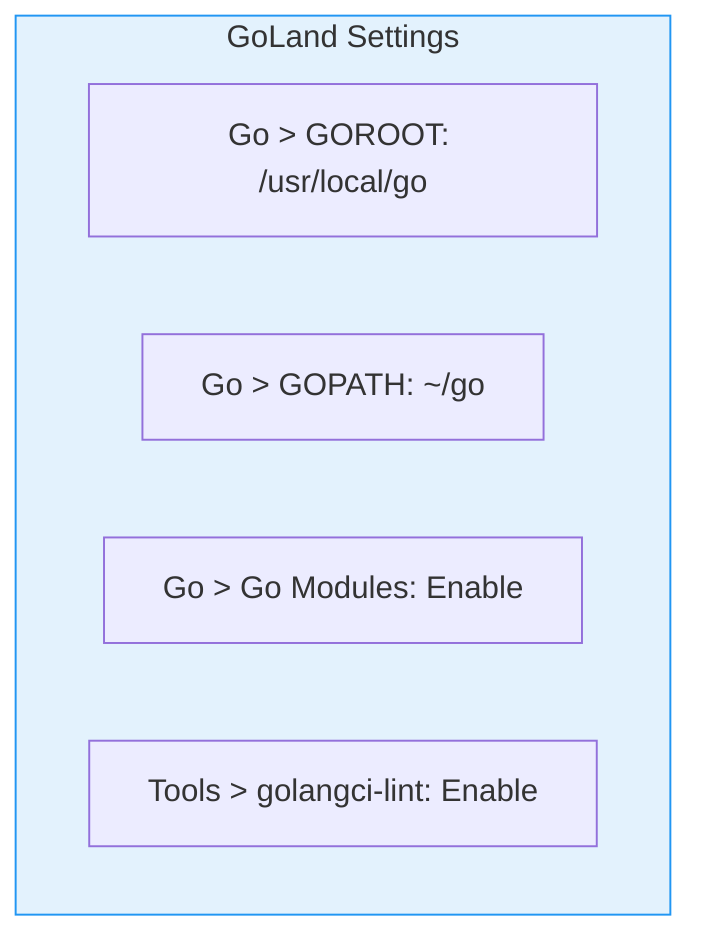

### Clone and Setup

```bash
# Clone repository
git clone https://github.com/devopscorner/telemetryflow.git
cd telemetryflow/telemetryflow-mcp

# Install dependencies
go mod download

# Install development tools
make tools

# Verify setup
make check
```

---

## Project Structure

### Directory Layout

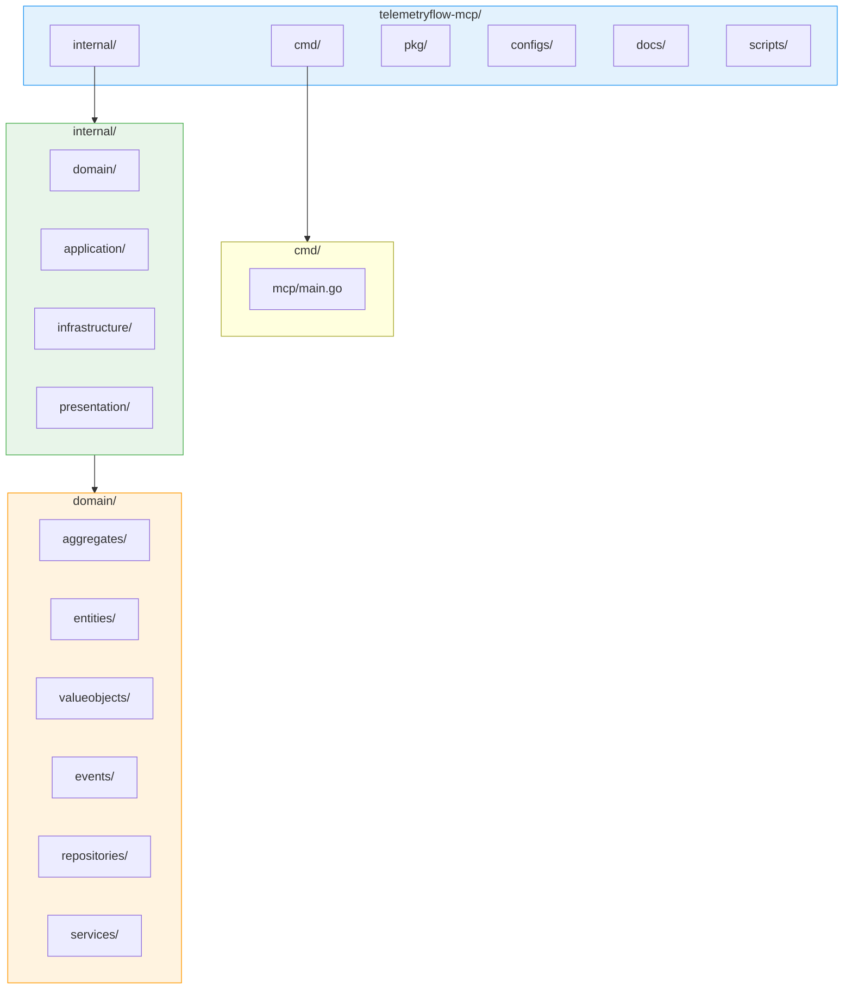

### Layer Responsibilities

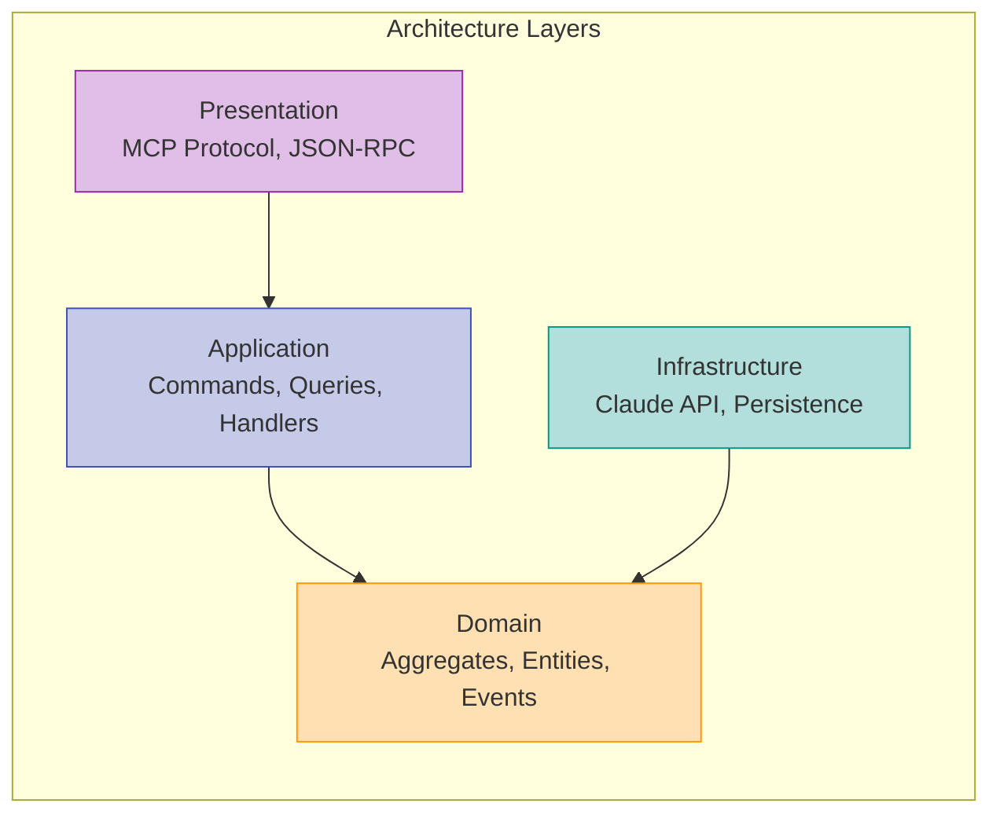

---

## Development Workflow

### Git Workflow

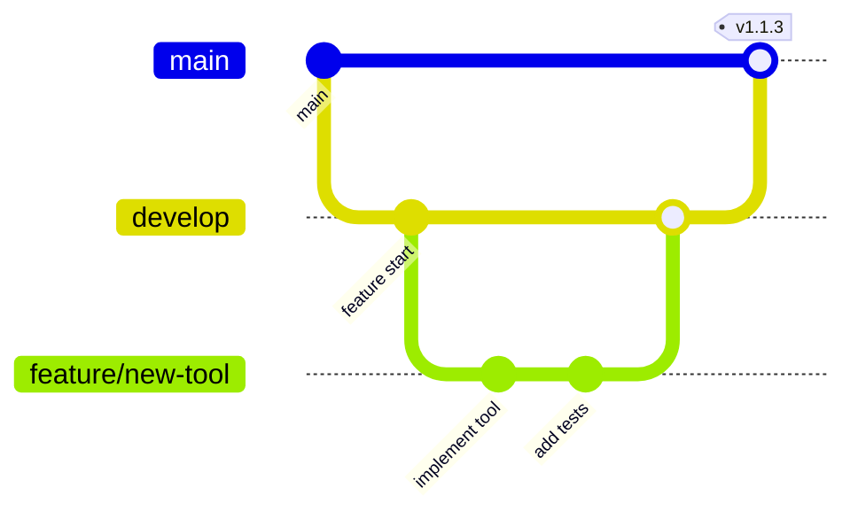

### Branch Naming

| Type    | Pattern               | Example                   |
| ------- | --------------------- | ------------------------- |
| Feature | `feature/description` | `feature/add-search-tool` |
| Bug Fix | `fix/description`     | `fix/session-timeout`     |
| Hotfix  | `hotfix/description`  | `hotfix/api-error`        |
| Release | `release/version`     | `release/1.1.3`           |

### Development Cycle

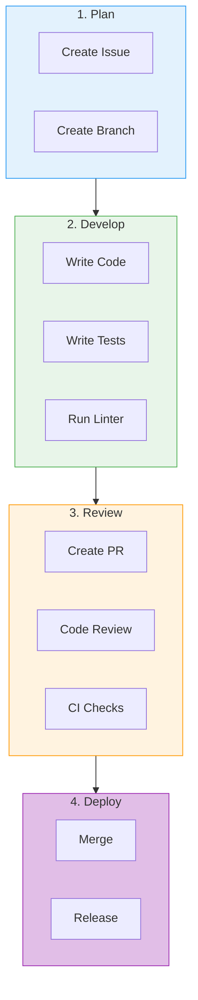

### Make Commands

```bash
# Development
make build          # Build binary
make run            # Run server
make clean          # Clean build artifacts

# Testing
make test           # Run all tests
make test-unit      # Run unit tests
make test-integration # Run integration tests
make test-cover     # Run tests with coverage
make test-bench     # Run benchmarks

# Quality
make lint           # Run linter
make fmt            # Format code
make vet            # Run go vet
make check          # Run all checks

# Documentation
make docs           # Generate documentation
make docs-serve     # Serve documentation locally

# Release
make release        # Create release build
make docker-build   # Build Docker image
```

---

## Coding Standards

### Go Style Guide

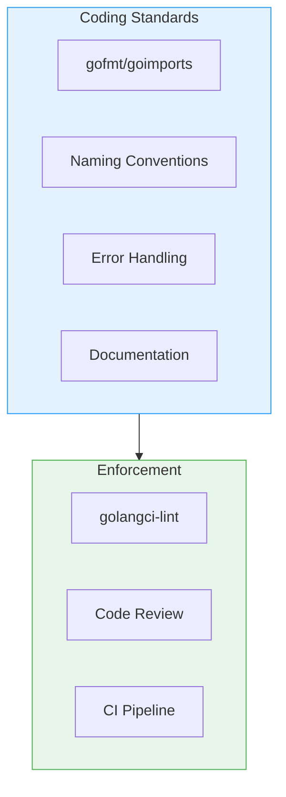

### Naming Conventions

| Type      | Convention                                  | Example                       |
| --------- | ------------------------------------------- | ----------------------------- |
| Package   | lowercase                                   | `valueobjects`                |
| Interface | PascalCase with I prefix                    | `ISessionRepository`          |
| Struct    | PascalCase                                  | `SessionHandler`              |
| Function  | PascalCase (exported), camelCase (internal) | `HandleRequest`, `parseInput` |
| Variable  | camelCase                                   | `sessionID`                   |
| Constant  | PascalCase                                  | `MaxRetries`                  |
| Error     | Err prefix                                  | `ErrSessionNotFound`          |

### File Organization

```go
// Package documentation
package example

// Imports (grouped)
import (
    // Standard library
    "context"
    "errors"

    // Third-party packages
    "github.com/google/uuid"

    // Internal packages
    "github.com/devopscorner/telemetryflow/telemetryflow-mcp/internal/domain"
)

// Constants
const (
    MaxRetries = 3
    Timeout    = 30 * time.Second
)

// Errors
var (
    ErrNotFound = errors.New("not found")
)

// Types (interfaces first, then structs)
type Handler interface {
    Handle(ctx context.Context) error
}

type service struct {
    repo Repository
}

// Constructor
func NewService(repo Repository) *service {
    return &service{repo: repo}
}

// Methods
func (s *service) Process(ctx context.Context) error {
    // Implementation
}

// Helper functions (private)
func validate(input string) error {
    // Implementation
}
```

### Error Handling

```go
// Domain errors
var (
    ErrSessionNotFound    = errors.New("session not found")
    ErrInvalidInput       = errors.New("invalid input")
    ErrConversationClosed = errors.New("conversation is closed")
)

// Wrapping errors
func (s *service) GetSession(ctx context.Context, id string) (*Session, error) {
    session, err := s.repo.FindByID(ctx, id)
    if err != nil {
        return nil, fmt.Errorf("get session: %w", err)
    }
    return session, nil
}

// Error checking
if errors.Is(err, ErrSessionNotFound) {
    // Handle specific error
}
```

### Documentation

```go
// Package valueobjects provides immutable value types for the domain.
package valueobjects

// SessionID represents a unique session identifier.
// It wraps a UUID string and provides validation.
type SessionID struct {
    value string
}

// NewSessionID creates a new SessionID from a string.
// Returns an error if the string is not a valid UUID.
func NewSessionID(value string) (SessionID, error) {
    if _, err := uuid.Parse(value); err != nil {
        return SessionID{}, ErrInvalidSessionID
    }
    return SessionID{value: value}, nil
}

// String returns the string representation of the SessionID.
func (id SessionID) String() string {
    return id.value
}
```

---

## Testing

### Testing Strategy

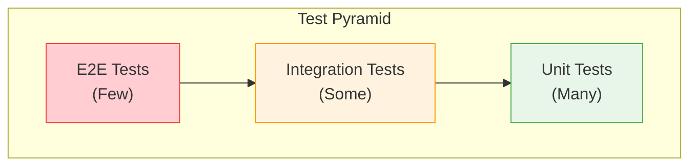

### Unit Tests

```go
// Table-driven tests
func TestNewSessionID(t *testing.T) {
    tests := []struct {
        name    string
        input   string
        want    string
        wantErr bool
    }{
        {
            name:    "valid uuid",
            input:   "123e4567-e89b-12d3-a456-426614174000",
            want:    "123e4567-e89b-12d3-a456-426614174000",
            wantErr: false,
        },
        {
            name:    "invalid uuid",
            input:   "invalid",
            wantErr: true,
        },
        {
            name:    "empty string",
            input:   "",
            wantErr: true,
        },
    }

    for _, tt := range tests {
        t.Run(tt.name, func(t *testing.T) {
            got, err := NewSessionID(tt.input)
            if (err != nil) != tt.wantErr {
                t.Errorf("NewSessionID() error = %v, wantErr %v", err, tt.wantErr)
                return
            }
            if !tt.wantErr && got.String() != tt.want {
                t.Errorf("NewSessionID() = %v, want %v", got.String(), tt.want)
            }
        })
    }
}
```

### Mock Implementations

```go
// Mock repository for testing
type MockSessionRepository struct {
    sessions map[string]*aggregates.Session
    saveErr  error
    findErr  error
}

func NewMockSessionRepository() *MockSessionRepository {
    return &MockSessionRepository{
        sessions: make(map[string]*aggregates.Session),
    }
}

func (m *MockSessionRepository) Save(ctx context.Context, session *aggregates.Session) error {
    if m.saveErr != nil {
        return m.saveErr
    }
    m.sessions[session.ID().String()] = session
    return nil
}

func (m *MockSessionRepository) FindByID(ctx context.Context, id vo.SessionID) (*aggregates.Session, error) {
    if m.findErr != nil {
        return nil, m.findErr
    }
    session, ok := m.sessions[id.String()]
    if !ok {
        return nil, ErrSessionNotFound
    }
    return session, nil
}

// Set errors for testing
func (m *MockSessionRepository) SetSaveError(err error) {
    m.saveErr = err
}

func (m *MockSessionRepository) SetFindError(err error) {
    m.findErr = err
}
```

### Integration Tests

```go
func TestSessionHandler_InitializeSession(t *testing.T) {
    // Setup
    repo := NewMockSessionRepository()
    eventPub := NewMockEventPublisher()
    handler := NewSessionHandler(repo, eventPub)

    ctx := context.Background()
    cmd := &InitializeSessionCommand{
        ClientName:      "test-client",
        ClientVersion:   "1.0.0",
        ProtocolVersion: "2024-11-05",
    }

    // Execute
    session, err := handler.HandleInitializeSession(ctx, cmd)

    // Assert
    if err != nil {
        t.Fatalf("HandleInitializeSession() error = %v", err)
    }
    if session == nil {
        t.Fatal("HandleInitializeSession() session is nil")
    }
    if session.State() != SessionStateReady {
        t.Errorf("session state = %v, want %v", session.State(), SessionStateReady)
    }
    if len(eventPub.Events) == 0 {
        t.Error("no events published")
    }
}
```

### Running Tests

```bash
# Run all tests
make test

# Run with verbose output
go test -v ./...

# Run specific package
go test -v ./internal/domain/valueobjects/...

# Run with coverage
make test-cover
go test -coverprofile=coverage.out ./...
go tool cover -html=coverage.out

# Run benchmarks
make test-bench
go test -bench=. ./...

# Run with race detector
go test -race ./...
```

### Coverage Requirements

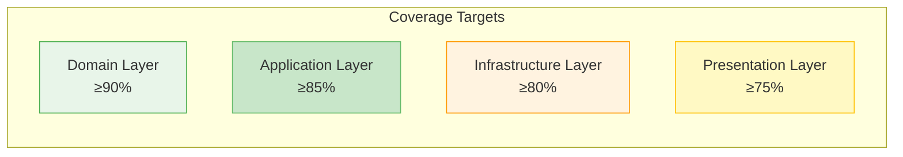

---

## Debugging

### Debug Configuration

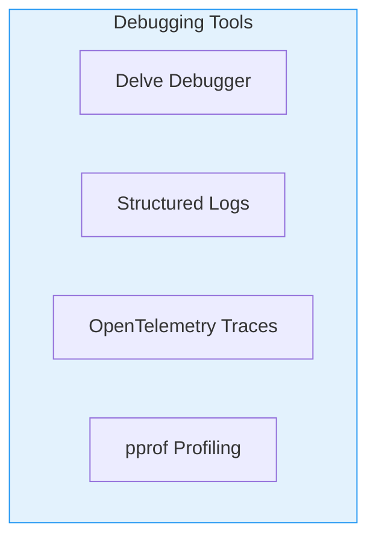

### VS Code Debug Configuration

```json
// .vscode/launch.json
{
  "version": "0.2.0",
  "configurations": [
    {
      "name": "Debug TFO-MCP",
      "type": "go",
      "request": "launch",
      "mode": "debug",
      "program": "${workspaceFolder}/cmd/mcp",
      "args": ["run", "--log-level", "debug"],
      "env": {
        "TELEMETRYFLOW_MCP_CLAUDE_API_KEY": "your-api-key"
      }
    },
    {
      "name": "Debug Tests",
      "type": "go",
      "request": "launch",
      "mode": "test",
      "program": "${workspaceFolder}/internal/domain/valueobjects",
      "args": ["-test.v", "-test.run", "TestNewSessionID"]
    }
  ]
}
```

### Using Delve

```bash
# Install Delve
go install github.com/go-delve/delve/cmd/dlv@latest

# Debug binary
dlv debug ./cmd/mcp -- run

# Debug tests
dlv test ./internal/domain/valueobjects

# Attach to running process
dlv attach <pid>

# Common commands in Delve
# break main.main - Set breakpoint
# continue        - Continue execution
# next            - Step over
# step            - Step into
# print var       - Print variable
# locals          - Show local variables
# stack           - Show stack trace
```

### Logging for Debug

```go
import "github.com/rs/zerolog/log"

// Debug logging
log.Debug().
    Str("session_id", session.ID().String()).
    Str("method", "HandleRequest").
    Int("tools_count", len(session.Tools())).
    Msg("Processing request")

// Error logging with stack trace
log.Error().
    Err(err).
    Stack().
    Str("session_id", sessionID).
    Msg("Failed to process request")
```

### Profiling

```bash
# CPU profiling
go test -cpuprofile=cpu.prof -bench=.
go tool pprof cpu.prof

# Memory profiling
go test -memprofile=mem.prof -bench=.
go tool pprof mem.prof

# HTTP profiling (add to server)
import _ "net/http/pprof"
go func() {
    http.ListenAndServe("localhost:6060", nil)
}()

# View profiles
go tool pprof http://localhost:6060/debug/pprof/heap
go tool pprof http://localhost:6060/debug/pprof/profile
```

---

## Contributing

### Contribution Workflow

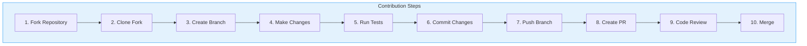

### Commit Message Format

```
<type>(<scope>): <description>

[optional body]

[optional footer]
```

**Types:**

- `feat`: New feature
- `fix`: Bug fix
- `docs`: Documentation
- `style`: Formatting
- `refactor`: Code restructuring
- `test`: Tests
- `chore`: Maintenance

**Examples:**

```
feat(tools): add search_files tool

Add new tool for searching files using glob patterns.
Supports recursive search and file type filtering.

Closes #123

---

fix(session): handle timeout correctly

Session timeout was not being reset after successful
requests, causing premature session termination.

---

docs(readme): update installation instructions
```

### Pull Request Template

```markdown
## Description

Brief description of changes.

## Type of Change

- [ ] Bug fix
- [ ] New feature
- [ ] Breaking change
- [ ] Documentation update

## Testing

- [ ] Unit tests added/updated
- [ ] Integration tests added/updated
- [ ] Manual testing performed

## Checklist

- [ ] Code follows style guidelines
- [ ] Self-review completed
- [ ] Documentation updated
- [ ] No new warnings
- [ ] Tests pass locally
```

---

## Release Process

### Release Workflow

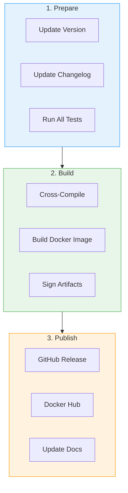

### Version Numbering

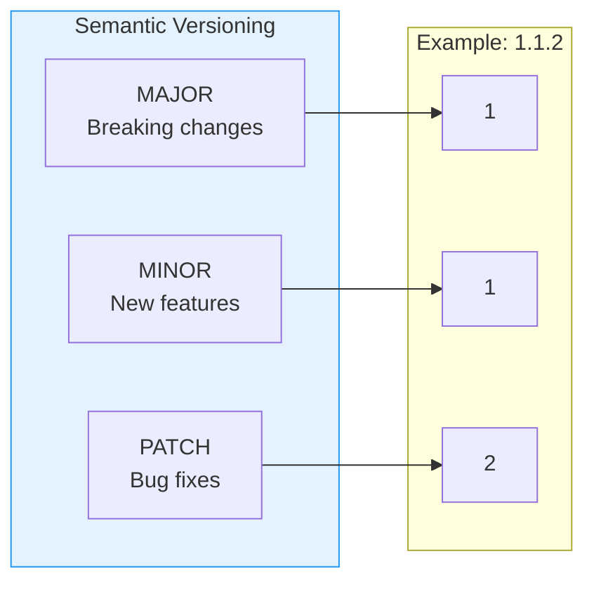

### Release Commands

```bash
# Create release
make release VERSION=1.1.3

# Build all platforms
make build-all

# Push Docker image
make docker-push VERSION=1.1.3

# Generate changelog
git log --oneline v1.1.2..HEAD > CHANGELOG_NEW.md
```

### GoReleaser Configuration

```yaml
# .goreleaser.yaml
project_name: tfo-mcp
before:
  hooks:
    - go mod tidy
    - go generate ./...
builds:
  - env:
      - CGO_ENABLED=0
    goos:
      - linux
      - darwin
      - windows
    goarch:
      - amd64
      - arm64
    main: ./cmd/mcp
    binary: tfo-mcp
    ldflags:
      - -s -w
      - -X main.version={{.Version}}
      - -X main.commit={{.Commit}}
      - -X main.date={{.Date}}
archives:
  - format: tar.gz
    format_overrides:
      - goos: windows
        format: zip
checksum:
  name_template: "checksums.txt"
changelog:
  sort: asc
  filters:
    exclude:
      - "^docs:"
      - "^test:"
      - "^chore:"
```

---

## Related Documentation

- [Architecture Guide](ARCHITECTURE.md)
- [Configuration Guide](CONFIGURATION.md)
- [Commands Reference](COMMANDS.md)
- [Installation Guide](INSTALLATION.md)
- [Troubleshooting Guide](TROUBLESHOOTING.md)

---

<div align="center">

**[Back to Documentation Index](README.md)**

</div>
