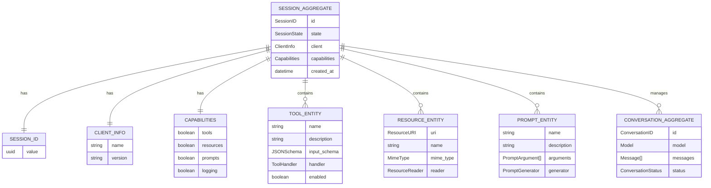
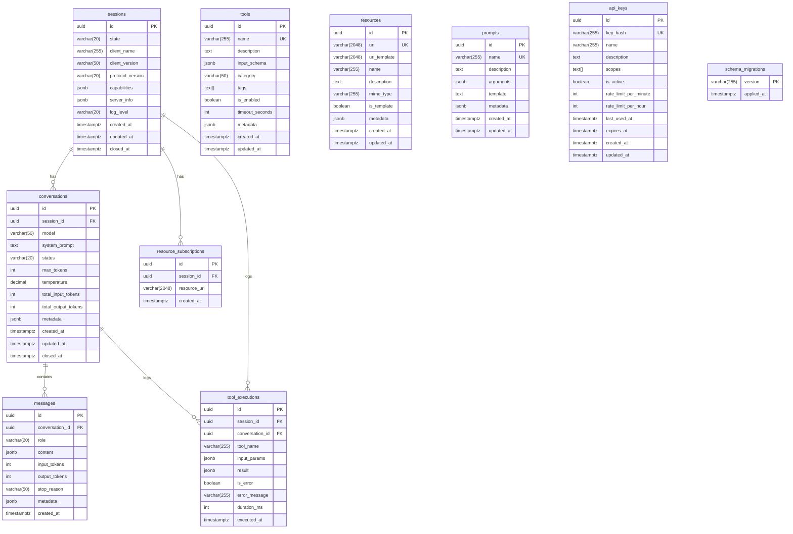

# TFO-MCP Entity Relationship Diagrams

> Entity Relationship Diagrams for TelemetryFlow MCP Server

---

## Table of Contents

- [Overview](#overview)
- [Complete Domain ERD](#complete-domain-erd)
- [Session Aggregate ERD](#session-aggregate-erd)
- [Conversation Aggregate ERD](#conversation-aggregate-erd)
- [Value Objects ERD](#value-objects-erd)
- [Database Schema](#database-schema)

---

## Overview

This document provides Entity Relationship Diagrams that describe the data structures and relationships within the TFO-MCP Server.

---

## Complete Domain ERD

---

## Session Aggregate ERD

---

## Conversation Aggregate ERD

---

## Value Objects ERD

---

## Database Schema

### PostgreSQL Schema (GORM Models)

The PostgreSQL database stores transactional data for MCP sessions, conversations, and registered components.

### ClickHouse Analytics Schema

The ClickHouse database stores high-volume analytics data with time-series optimizations.

### ClickHouse Table Engines

| Table                        | Engine             | Partitioning | TTL      |
| ---------------------------- | ------------------ | ------------ | -------- |
| `tool_call_analytics`        | MergeTree          | Monthly      | 90 days  |
| `api_request_analytics`      | MergeTree          | Monthly      | 90 days  |
| `session_analytics`          | MergeTree          | Monthly      | 180 days |
| `error_analytics`            | MergeTree          | Monthly      | 30 days  |
| `token_usage_hourly`         | SummingMergeTree   | Monthly      | -        |
| `tool_usage_hourly`          | SummingMergeTree   | Monthly      | -        |
| `latency_percentiles_hourly` | ReplacingMergeTree | Monthly      | -        |

### Materialized Views

---

## Related Documentation

- [Data Flow Diagrams](DFD.md)
- [Architecture Guide](ARCHITECTURE.md)
- [Development Guide](DEVELOPMENT.md)

---

**[Back to Documentation Index](README.md)**

