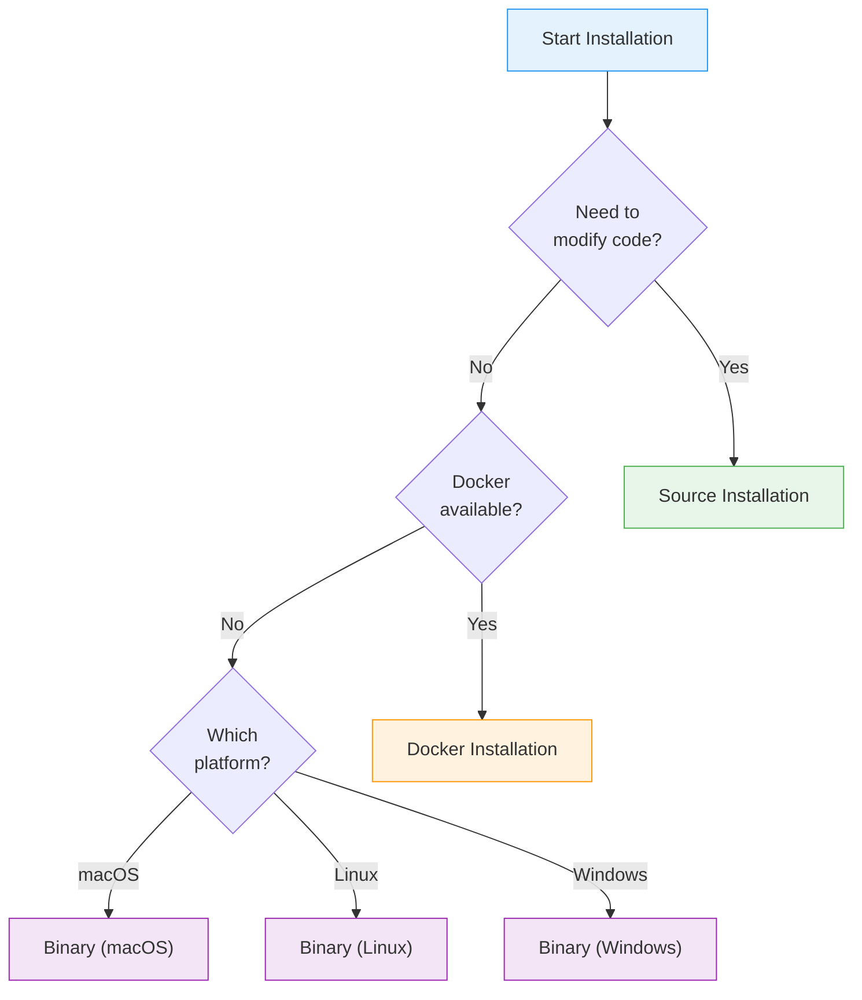
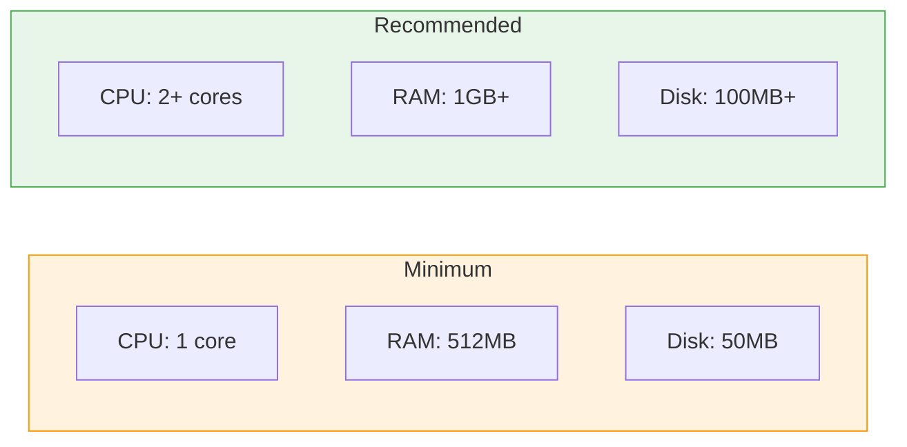
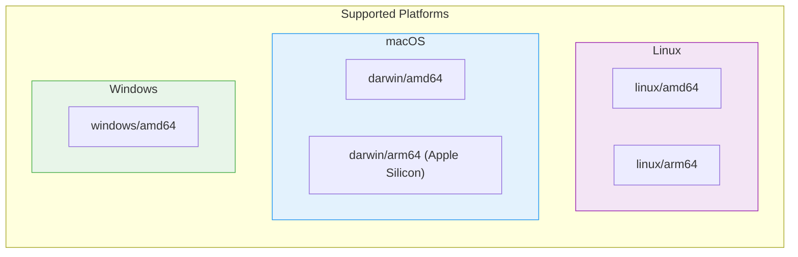
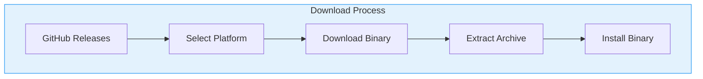
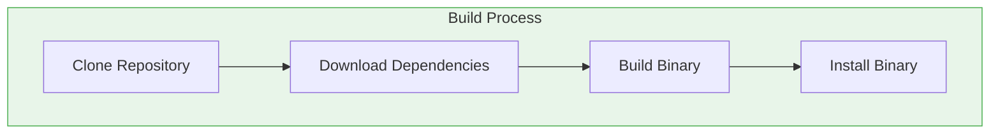
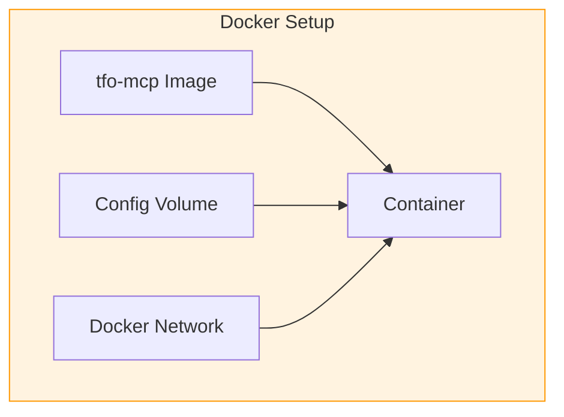
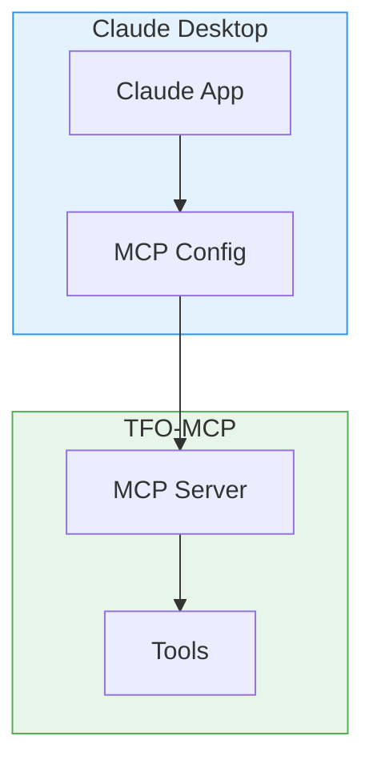
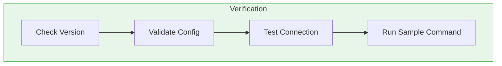
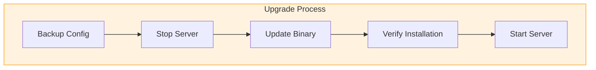

# TFO-MCP Installation Guide

> Complete installation guide for TelemetryFlow MCP Server

---

## Table of Contents

- [Overview](#overview)
- [System Requirements](#system-requirements)
- [Installation Methods](#installation-methods)
- [Binary Installation](#binary-installation)
- [Source Installation](#source-installation)
- [Docker Installation](#docker-installation)
- [IDE Integration](#ide-integration)
- [Verification](#verification)
- [Upgrading](#upgrading)
- [Uninstallation](#uninstallation)

---

## Overview

TFO-MCP can be installed through multiple methods depending on your needs and environment.

### Installation Decision Tree



---

## System Requirements

### Hardware Requirements



### Software Requirements

| Component         | Minimum Version       | Notes                        |
| ----------------- | --------------------- | ---------------------------- |
| Operating System  | Linux, macOS, Windows | 64-bit recommended           |
| Go (source build) | 1.24+                 | Only for source installation |
| Docker            | 20.10+                | Only for Docker installation |
| Git               | 2.0+                  | Only for source installation |

### Supported Platforms



---

## Installation Methods

### Method Comparison

| Method     | Difficulty | Use Case                   | Auto-Update  |
| ---------- | ---------- | -------------------------- | ------------ |
| Binary     | Easy       | Quick setup, production    | Manual       |
| Source     | Medium     | Development, customization | Manual       |
| Docker     | Easy       | Containerized environments | Image pull   |
| Go Install | Easy       | Go developers              | `go install` |

---

## Binary Installation

### Download Binary



### macOS Installation

```bash
# Download latest release (Apple Silicon)
curl -LO https://github.com/telemetryflow/telemetryflow-mcp/releases/latest/download/tfo-mcp_darwin_arm64.tar.gz

# Or Intel Mac
curl -LO https://github.com/telemetryflow/telemetryflow-mcp/releases/latest/download/tfo-mcp_darwin_amd64.tar.gz

# Extract
tar -xzf tfo-mcp_darwin_*.tar.gz

# Move to PATH
sudo mv tfo-mcp /usr/local/bin/

# Verify installation
tfo-mcp version
```

### Linux Installation

```bash
# Download latest release (amd64)
curl -LO https://github.com/telemetryflow/telemetryflow-mcp/releases/latest/download/tfo-mcp_linux_amd64.tar.gz

# Or ARM64
curl -LO https://github.com/telemetryflow/telemetryflow-mcp/releases/latest/download/tfo-mcp_linux_arm64.tar.gz

# Extract
tar -xzf tfo-mcp_linux_*.tar.gz

# Move to PATH
sudo mv tfo-mcp /usr/local/bin/

# Set permissions
sudo chmod +x /usr/local/bin/tfo-mcp

# Verify installation
tfo-mcp version
```

### Windows Installation

```powershell
# Download latest release
Invoke-WebRequest -Uri "https://github.com/telemetryflow/telemetryflow-mcp/releases/latest/download/tfo-mcp_windows_amd64.zip" -OutFile "tfo-mcp.zip"

# Extract
Expand-Archive -Path "tfo-mcp.zip" -DestinationPath "."

# Move to Program Files
Move-Item -Path "tfo-mcp.exe" -Destination "C:\Program Files\TFO-MCP\"

# Add to PATH (run as Administrator)
$env:Path += ";C:\Program Files\TFO-MCP"
[Environment]::SetEnvironmentVariable("Path", $env:Path, [EnvironmentVariableTarget]::Machine)

# Verify installation
tfo-mcp version
```

### Using Homebrew (macOS)

```bash
# Add tap
brew tap telemetryflow/telemetryflow-mcp

# Install
brew install tfo-mcp

# Verify
tfo-mcp version

# Upgrade
brew upgrade tfo-mcp
```

---

## Source Installation

### Build from Source



### Step-by-Step

```bash
# 1. Clone repository
git clone https://github.com/telemetryflow/telemetryflow-mcp.git
cd telemetryflow/telemetryflow-mcp

# 2. Download dependencies
go mod download

# 3. Build binary
make build

# Or manually:
go build -o tfo-mcp ./cmd/mcp

# 4. Install to PATH
sudo mv tfo-mcp /usr/local/bin/

# Or install with go:
go install ./cmd/mcp

# 5. Verify installation
tfo-mcp version
```

### Build Options

```bash
# Build with specific version
make build VERSION=1.1.2

# Build with debug symbols
go build -gcflags="all=-N -l" -o tfo-mcp ./cmd/mcp

# Build for specific platform
GOOS=linux GOARCH=amd64 go build -o tfo-mcp-linux ./cmd/mcp
GOOS=darwin GOARCH=arm64 go build -o tfo-mcp-darwin ./cmd/mcp
GOOS=windows GOARCH=amd64 go build -o tfo-mcp.exe ./cmd/mcp

# Build all platforms
make build-all
```

### Using Go Install

```bash
# Install latest version
go install github.com/telemetryflow/telemetryflow-mcp/telemetryflow-mcp/cmd/mcp@latest

# Install specific version
go install github.com/telemetryflow/telemetryflow-mcp/telemetryflow-mcp/cmd/mcp@v1.1.2

# Verify
tfo-mcp version
```

---

## Docker Installation

### Docker Architecture



### Pull Docker Image

```bash
# Pull latest image
docker pull devopscorner/tfo-mcp:latest

# Pull specific version
docker pull devopscorner/tfo-mcp:1.1.2

# Verify image
docker images devopscorner/tfo-mcp
```

### Run Container

```bash
# Basic run
docker run -it --rm \
  -e TELEMETRYFLOW_MCP_CLAUDE_API_KEY="your-api-key" \
  devopscorner/tfo-mcp:latest

# With custom config
docker run -it --rm \
  -v $(pwd)/config.yaml:/app/config.yaml \
  -e TELEMETRYFLOW_MCP_CLAUDE_API_KEY="your-api-key" \
  devopscorner/tfo-mcp:latest \
  run --config /app/config.yaml

# With volume for resources
docker run -it --rm \
  -v $(pwd)/config.yaml:/app/config.yaml \
  -v $(pwd)/resources:/app/resources \
  -e TELEMETRYFLOW_MCP_CLAUDE_API_KEY="your-api-key" \
  devopscorner/tfo-mcp:latest
```

### Docker Compose

The project includes a comprehensive `docker-compose.yaml` with all required services:

```bash
# Start core services (MCP server, Redis, PostgreSQL, ClickHouse)
docker-compose up -d

# Start with observability stack (add Jaeger, Prometheus, Grafana)
docker-compose --profile observability up -d

# View logs
docker-compose logs -f tfo-mcp

# Stop all services
docker-compose down

# Stop and remove volumes
docker-compose down -v
```

**Services included in docker-compose.yaml:**

| Service        | Port       | Description                           |
| -------------- | ---------- | ------------------------------------- |
| tfo-mcp        | 8080       | MCP Server                            |
| nats           | 4222, 8222 | Message Queue (JetStream)             |
| redis          | 6379       | Cache                                 |
| postgres       | 5432       | Primary Database                      |
| clickhouse     | 8123, 9000 | Analytics Database                    |
| otel-collector | 4317, 4318 | OpenTelemetry (observability profile) |
| jaeger         | 16686      | Tracing UI (observability profile)    |
| prometheus     | 9090       | Metrics (observability profile)       |
| grafana        | 3000       | Dashboards (observability profile)    |

See the full [docker-compose.yaml](../docker-compose.yaml) for complete configuration.

### Build Custom Image

```bash
# Build image
docker build -t my-tfo-mcp:latest .

# Build with specific tag
docker build -t my-tfo-mcp:1.1.2 .

# Build multi-platform
docker buildx build \
  --platform linux/amd64,linux/arm64 \
  -t my-tfo-mcp:latest \
  --push .
```

---

## IDE Integration

### Claude Desktop Integration



### Configure Claude Desktop

1. Open Claude Desktop settings
2. Navigate to MCP Servers section
3. Add TFO-MCP configuration:

**macOS** (`~/Library/Application Support/Claude/claude_desktop_config.json`):

```json
{
  "mcpServers": {
    "tfo-mcp": {
      "command": "/usr/local/bin/tfo-mcp",
      "args": ["run"],
      "env": {
        "TELEMETRYFLOW_MCP_CLAUDE_API_KEY": "your-api-key"
      }
    }
  }
}
```

**Windows** (`%APPDATA%\Claude\claude_desktop_config.json`):

```json
{
  "mcpServers": {
    "tfo-mcp": {
      "command": "C:\\Program Files\\TFO-MCP\\tfo-mcp.exe",
      "args": ["run"],
      "env": {
        "TELEMETRYFLOW_MCP_CLAUDE_API_KEY": "your-api-key"
      }
    }
  }
}
```

**Linux** (`~/.config/Claude/claude_desktop_config.json`):

```json
{
  "mcpServers": {
    "tfo-mcp": {
      "command": "/usr/local/bin/tfo-mcp",
      "args": ["run"],
      "env": {
        "TELEMETRYFLOW_MCP_CLAUDE_API_KEY": "your-api-key"
      }
    }
  }
}
```

### VS Code Integration

```json
// .vscode/settings.json
{
  "mcp.servers": {
    "tfo-mcp": {
      "command": "tfo-mcp",
      "args": ["run", "--log-level", "debug"],
      "env": {
        "TELEMETRYFLOW_MCP_CLAUDE_API_KEY": "${env:TELEMETRYFLOW_MCP_CLAUDE_API_KEY}"
      }
    }
  }
}
```

---

## Verification

### Verification Steps



### Verify Installation

```bash
# 1. Check version
tfo-mcp version

# Expected output:
# TFO-MCP - TelemetryFlow MCP Server
# Version:    1.1.2
# Go Version: go1.24
# ...

# 2. Validate configuration
tfo-mcp validate

# 3. Check help
tfo-mcp help

# 4. Test run (will fail without API key but shows it's working)
tfo-mcp run --help
```

### Test with API Key

```bash
# Set API key
export TELEMETRYFLOW_MCP_CLAUDE_API_KEY="sk-ant-api03-..."

# Run server
tfo-mcp run

# In another terminal, send test request
echo '{"jsonrpc":"2.0","id":1,"method":"initialize","params":{"protocolVersion":"2024-11-05","clientInfo":{"name":"test","version":"1.0.0"}}}' | tfo-mcp run
```

### Docker Verification

```bash
# Check image
docker images devopscorner/tfo-mcp

# Run version check
docker run --rm devopscorner/tfo-mcp:latest version

# Run validation
docker run --rm \
  -v $(pwd)/config.yaml:/app/config.yaml \
  devopscorner/tfo-mcp:latest validate
```

---

## Upgrading

### Upgrade Process



### Binary Upgrade

```bash
# 1. Backup configuration
cp /etc/tfo-mcp/config.yaml /etc/tfo-mcp/config.yaml.bak

# 2. Download new version
curl -LO https://github.com/telemetryflow/telemetryflow-mcp/releases/latest/download/tfo-mcp_$(uname -s | tr '[:upper:]' '[:lower:]')_$(uname -m).tar.gz

# 3. Extract and install
tar -xzf tfo-mcp_*.tar.gz
sudo mv tfo-mcp /usr/local/bin/

# 4. Verify
tfo-mcp version
```

### Docker Upgrade

```bash
# Pull latest image
docker pull devopscorner/tfo-mcp:latest

# Or specific version
docker pull devopscorner/tfo-mcp:1.1.3

# Restart container
docker-compose down
docker-compose up -d
```

### Homebrew Upgrade

```bash
# Update tap
brew update

# Upgrade tfo-mcp
brew upgrade tfo-mcp

# Verify
tfo-mcp version
```

### Source Upgrade

```bash
# Pull latest changes
cd telemetryflow/telemetryflow-mcp
git fetch origin
git checkout main
git pull

# Rebuild
make clean
make build

# Install
sudo mv tfo-mcp /usr/local/bin/
```

---

## Uninstallation

### Uninstall Binary

```bash
# macOS/Linux
sudo rm /usr/local/bin/tfo-mcp

# Remove configuration (optional)
rm -rf ~/.tfo-mcp
rm -rf /etc/tfo-mcp

# Windows (PowerShell as Administrator)
Remove-Item "C:\Program Files\TFO-MCP" -Recurse
```

### Uninstall Docker

```bash
# Stop and remove container
docker stop tfo-mcp
docker rm tfo-mcp

# Remove image
docker rmi devopscorner/tfo-mcp:latest

# Remove volumes (optional)
docker volume rm tfo-mcp-config
```

### Uninstall Homebrew

```bash
# Uninstall package
brew uninstall tfo-mcp

# Remove tap (optional)
brew untap telemetryflow/telemetryflow-mcp
```

### Clean Go Install

```bash
# Remove binary
rm $(go env GOPATH)/bin/tfo-mcp

# Clear module cache (optional)
go clean -modcache
```

---

## Troubleshooting Installation

### Common Issues

| Issue             | Cause                      | Solution                               |
| ----------------- | -------------------------- | -------------------------------------- |
| Permission denied | Missing execute permission | `chmod +x tfo-mcp`                     |
| Command not found | Not in PATH                | Add to PATH or use full path           |
| API key error     | Missing/invalid key        | Set `TELEMETRYFLOW_MCP_CLAUDE_API_KEY` |
| Config not found  | Wrong path                 | Check config location                  |

### Getting Help

```bash
# View help
tfo-mcp help

# Validate configuration
tfo-mcp validate --verbose

# Debug mode
tfo-mcp run --log-level debug
```

See [Troubleshooting Guide](TROUBLESHOOTING.md) for more detailed solutions.

---

## Related Documentation

- [Architecture Guide](ARCHITECTURE.md) - System design, cache & queue architecture
- [Entity Relationship Diagrams](ERD.md) - Database schemas
- [Data Flow Diagrams](DFD.md) - Data flows, state machines
- [Configuration Guide](CONFIGURATION.md) - Environment variables, Redis settings
- [Commands Reference](COMMANDS.md)
- [Development Guide](DEVELOPMENT.md)
- [Troubleshooting Guide](TROUBLESHOOTING.md)

---

<div align="center">

**[Back to Documentation Index](README.md)**

</div>
