# TelemetryFlow MCP Troubleshooting Guide

> Complete troubleshooting guide for TelemetryFlow MCP Server

---

## Table of Contents

- [Overview](#overview)
- [Diagnostic Process](#diagnostic-process)
- [Common Issues](#common-issues)
- [Connection Issues](#connection-issues)
- [Configuration Issues](#configuration-issues)
- [Claude API Issues](#claude-api-issues)
- [Performance Issues](#performance-issues)
- [Tool Execution Issues](#tool-execution-issues)
- [Logging and Debugging](#logging-and-debugging)
- [Error Reference](#error-reference)
- [FAQ](#faq)
- [Getting Help](#getting-help)

---

## Overview

This guide helps diagnose and resolve common issues with TelemetryFlow MCP.

### Troubleshooting Approach

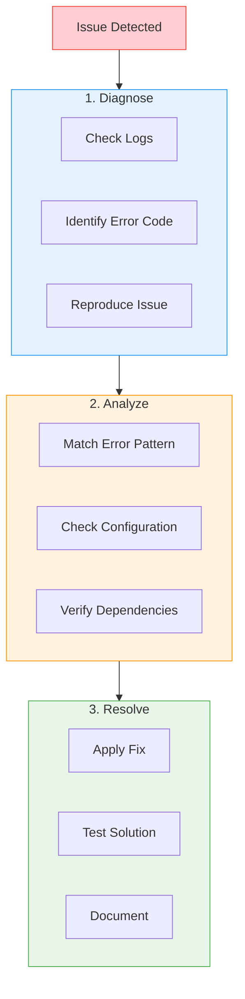

---

## Diagnostic Process

### Quick Diagnostic Checklist

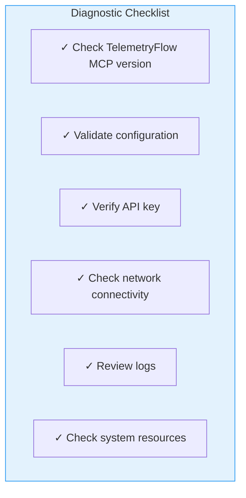

### Diagnostic Commands

```bash
# 1. Check version
tfo-mcp version

# 2. Validate configuration
tfo-mcp validate --verbose

# 3. Check API key is set
echo $TELEMETRYFLOW_MCP_CLAUDE_API_KEY | head -c 20

# 4. Run with debug logging
tfo-mcp run --log-level debug

# 5. Test Claude API connectivity
curl -X POST https://api.anthropic.com/v1/messages \
  -H "x-api-key: $TELEMETRYFLOW_MCP_CLAUDE_API_KEY" \
  -H "anthropic-version: 2023-06-01" \
  -H "content-type: application/json" \
  -d '{"model":"claude-3-haiku-20240307","max_tokens":10,"messages":[{"role":"user","content":"Hi"}]}'
```

---

## Common Issues

### Issue Categories

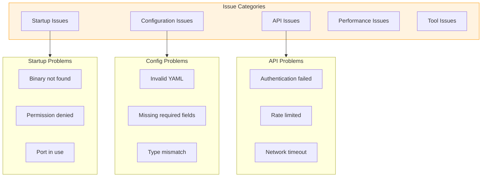

### Quick Fixes

| Issue              | Quick Fix                                                    |
| ------------------ | ------------------------------------------------------------ |
| Command not found  | Add to PATH: `export PATH=$PATH:/usr/local/bin`              |
| Permission denied  | Set executable: `chmod +x tfo-mcp`                           |
| API key error      | Set env var: `export TELEMETRYFLOW_MCP_CLAUDE_API_KEY="..."` |
| Config not found   | Create config: `tfo-mcp validate --verbose`                  |
| Connection timeout | Check network and retry                                      |

---

## Connection Issues

### Connection Flow

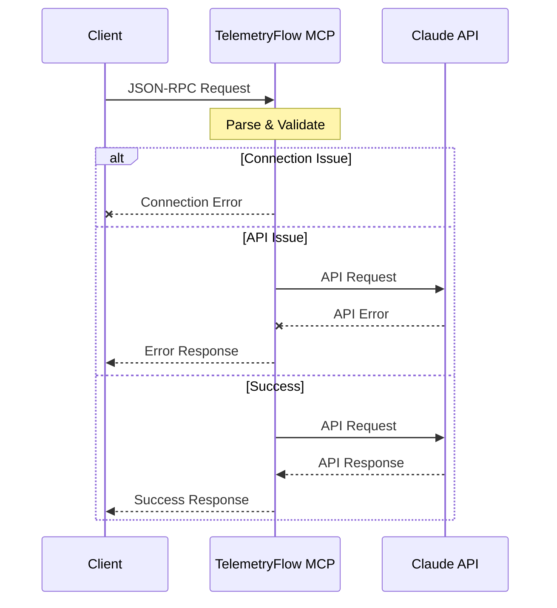

### Server Won't Start

**Symptoms:**

- Server exits immediately
- No output or error message
- "Address already in use" error

**Solutions:**

```bash
# Check if another process is using the same resources
ps aux | grep tfo-mcp

# Kill existing process
pkill tfo-mcp

# Check for port conflicts (if using HTTP transport)
lsof -i :8080

# Run with debug logging to see startup errors
tfo-mcp run --log-level debug 2>&1 | head -50
```

### Client Can't Connect

**Symptoms:**

- MCP client reports "connection refused"
- Timeout waiting for server response

**Solutions:**

```bash
# Verify server is running
ps aux | grep tfo-mcp

# Check server logs
tfo-mcp run --log-level debug

# Test with simple request
echo '{"jsonrpc":"2.0","id":1,"method":"initialize","params":{}}' | tfo-mcp run
```

### Network Timeout

**Symptoms:**

- "context deadline exceeded"
- "connection timeout"

**Solutions:**

```bash
# Check Claude API connectivity
curl -v https://api.anthropic.com/v1/messages

# Increase timeout in config
# config.yaml
server:
  timeout: 60s

# Check DNS resolution
nslookup api.anthropic.com

# Check firewall rules
sudo iptables -L -n | grep -i 443
```

---

## Configuration Issues

### Configuration Validation Flow

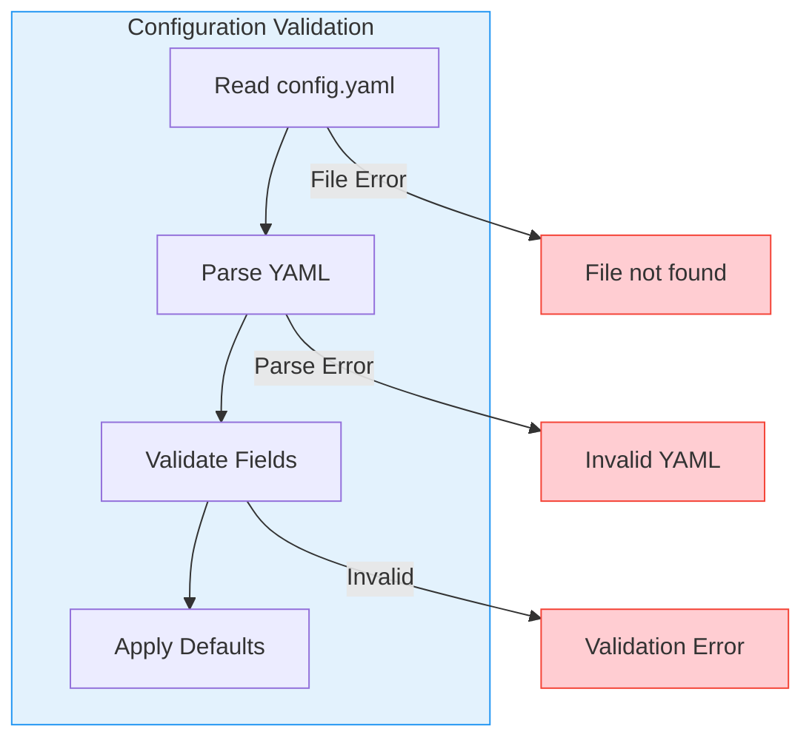

### Invalid Configuration File

**Symptoms:**

- "yaml: unmarshal errors"
- "invalid configuration"

**Solutions:**

```bash
# Validate YAML syntax
cat config.yaml | python -c "import yaml, sys; yaml.safe_load(sys.stdin)"

# Use verbose validation
tfo-mcp validate --verbose

# Common YAML issues:
# - Tabs instead of spaces
# - Missing colons
# - Incorrect indentation
```

**Example fixes:**

```yaml
# WRONG - tabs used
server:
	name: "tfo-mcp"  # Tab character

# CORRECT - spaces used
server:
  name: "tfo-mcp"  # 2 spaces

# WRONG - missing colon
server
  name "tfo-mcp"

# CORRECT
server:
  name: "tfo-mcp"

# WRONG - incorrect indentation
server:
name: "tfo-mcp"

# CORRECT
server:
  name: "tfo-mcp"
```

### Missing Required Fields

**Symptoms:**

- "required field missing"
- "api_key is required"

**Solutions:**

```bash
# Check for required fields
tfo-mcp validate --verbose

# Ensure API key is set via environment variable
export TELEMETRYFLOW_MCP_CLAUDE_API_KEY="sk-ant-api03-..."

# Or in config file (not recommended)
claude:
  api_key: "sk-ant-api03-..."
```

### Environment Variable Not Loaded

**Symptoms:**

- Configuration shows empty values
- "API key is required" despite setting env var

**Solutions:**

```bash
# Verify environment variable is set
echo $TELEMETRYFLOW_MCP_CLAUDE_API_KEY

# Check variable in current shell
env | grep TELEMETRYFLOW_

# Source environment file
source .env

# For systemd services, add to unit file
# /etc/systemd/system/tfo-mcp.service
[Service]
Environment="TELEMETRYFLOW_MCP_CLAUDE_API_KEY=your-key"
```

---

## Claude API Issues

### API Error Flow

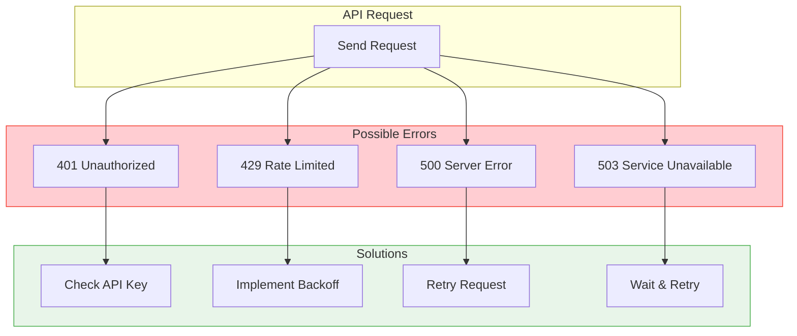

### Authentication Errors (401)

**Symptoms:**

- "authentication_error"
- "invalid x-api-key"
- "401 Unauthorized"

**Solutions:**

```bash
# Verify API key format
# Should start with "sk-ant-api03-"
echo $TELEMETRYFLOW_MCP_CLAUDE_API_KEY | head -c 15

# Test API key directly
curl -X POST https://api.anthropic.com/v1/messages \
  -H "x-api-key: $TELEMETRYFLOW_MCP_CLAUDE_API_KEY" \
  -H "anthropic-version: 2023-06-01" \
  -H "content-type: application/json" \
  -d '{"model":"claude-3-haiku-20240307","max_tokens":10,"messages":[{"role":"user","content":"Hi"}]}'

# Regenerate API key if needed
# Visit: https://console.anthropic.com/settings/keys
```

### Rate Limiting (429)

**Symptoms:**

- "rate_limit_error"
- "429 Too Many Requests"
- Requests failing intermittently

**Solutions:**

```yaml
# Increase retry configuration
claude:
  retry:
    max_attempts: 5
    initial_delay: 2s
    max_delay: 60s
    multiplier: 2.0

# Enable local rate limiting
security:
  rate_limit:
    enabled: true
    requests_per_minute: 30 # Below API limit
```

### Model Not Found

**Symptoms:**

- "model_not_found"
- "invalid_request_error"

**Solutions:**

```yaml
# Use valid model name
claude:
  model: "claude-sonnet-4-20250514" # Correct

# Available models:
# - claude-opus-4-20250514
# - claude-sonnet-4-20250514
# - claude-3-5-sonnet-20241022
# - claude-3-5-haiku-20241022
```

### Token Limit Exceeded

**Symptoms:**

- "max_tokens exceeded"
- Response truncated

**Solutions:**

```yaml
# Adjust token settings
claude:
  max_tokens: 8192 # Increase limit

# Or reduce input size
# Chunk large inputs into smaller requests
```

---

## Performance Issues

### Performance Diagnostics

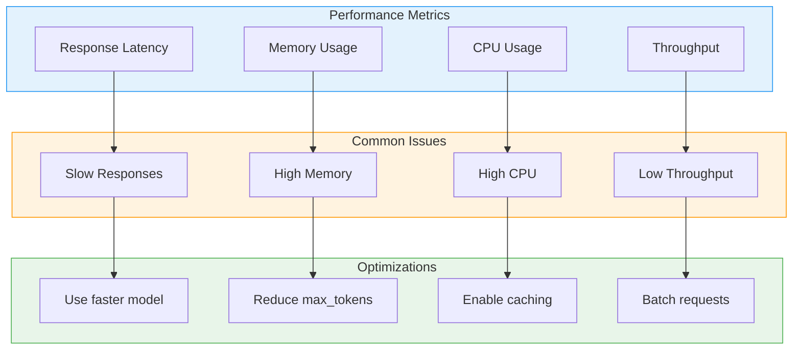

### Slow Response Times

**Symptoms:**

- Requests taking > 30 seconds
- Client timeouts

**Solutions:**

```yaml
# Use faster model
claude:
  model: "claude-3-5-haiku-20241022"  # Fastest model

# Reduce token limits
claude:
  max_tokens: 1024  # Smaller responses

# Increase server timeout
server:
  timeout: 120s
```

### High Memory Usage

**Symptoms:**

- Memory usage grows over time
- Out of memory errors

**Solutions:**

```bash
# Monitor memory usage
top -p $(pgrep tfo-mcp)

# Profile memory
go tool pprof http://localhost:6060/debug/pprof/heap

# Reduce concurrent sessions
# Restart server periodically (if needed)
```

### Connection Pooling Issues

**Symptoms:**

- "too many open files"
- Connection refused after many requests

**Solutions:**

```bash
# Increase file descriptor limit
ulimit -n 65536

# Add to /etc/security/limits.conf
* soft nofile 65536
* hard nofile 65536

# Check current usage
ls /proc/$(pgrep tfo-mcp)/fd | wc -l
```

---

## Tool Execution Issues

### Tool Error Flow

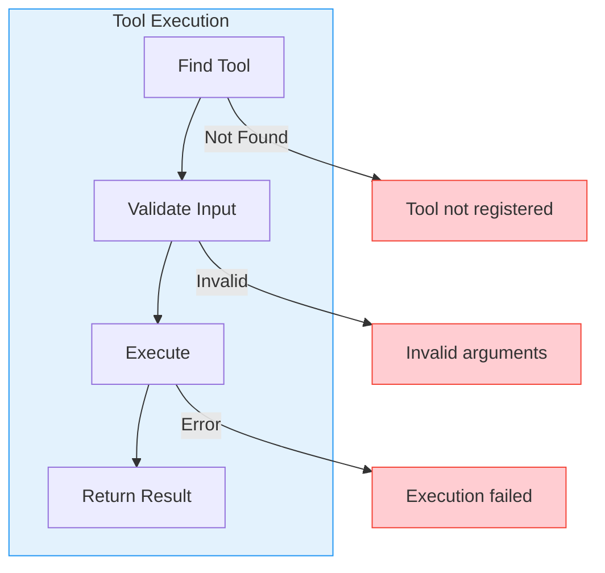

### Tool Not Found

**Symptoms:**

- "unknown tool"
- "tool not registered"

**Solutions:**

```bash
# List available tools
echo '{"jsonrpc":"2.0","id":1,"method":"tools/list","params":{}}' | tfo-mcp run

# Check tool registration in logs
tfo-mcp run --log-level debug
```

### Invalid Tool Arguments

**Symptoms:**

- "invalid arguments"
- "missing required parameter"
- "type mismatch"

**Solutions:**

```json
// Check tool schema
{
  "method": "tools/list",
  "params": {}
}

// Verify argument types match schema
{
  "method": "tools/call",
  "params": {
    "name": "read_file",
    "arguments": {
      "path": "/path/to/file"  // Must be string
    }
  }
}
```

### Tool Execution Failed

**Symptoms:**

- Tool returns error result
- "isError": true in response

**Solutions:**

```bash
# Check tool-specific errors
# read_file: Check file permissions
ls -la /path/to/file

# execute_command: Check command exists
which <command>

# write_file: Check directory permissions
ls -la /path/to/directory/
```

---

## Logging and Debugging

### Log Levels

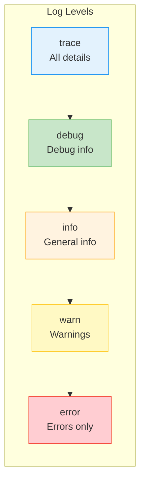

### Enable Debug Logging

```bash
# Via CLI flag
tfo-mcp run --log-level debug

# Via environment variable
export TELEMETRYFLOW_MCP_LOG_LEVEL=debug
tfo-mcp run

# Via config file
logging:
  level: "debug"
  format: "text"  # Human-readable
  caller: true    # Include file:line
```

### Reading Logs

```bash
# View logs in real-time
tfo-mcp run 2>&1 | jq .

# Filter by level
tfo-mcp run 2>&1 | jq 'select(.level == "error")'

# Filter by component
tfo-mcp run 2>&1 | jq 'select(.component == "claude")'

# Save logs to file
tfo-mcp run 2>&1 | tee tfo-mcp.log
```

### Log Analysis

```bash
# Count errors
grep -c '"level":"error"' tfo-mcp.log

# Find specific errors
grep "api_error" tfo-mcp.log | jq .

# Timeline of errors
grep '"level":"error"' tfo-mcp.log | jq -r '.time + " " + .message'
```

---

## Error Reference

### Error Code Reference

| Code   | Name               | Description        | Solution              |
| ------ | ------------------ | ------------------ | --------------------- |
| -32700 | Parse Error        | Invalid JSON       | Fix JSON syntax       |
| -32600 | Invalid Request    | Invalid JSON-RPC   | Check request format  |
| -32601 | Method Not Found   | Unknown method     | Use valid method      |
| -32602 | Invalid Params     | Invalid parameters | Check parameter types |
| -32603 | Internal Error     | Server error       | Check logs            |
| -32001 | Session Not Found  | Invalid session    | Re-initialize         |
| -32002 | Tool Not Found     | Unknown tool       | List available tools  |
| -32003 | Resource Not Found | Unknown resource   | List resources        |

### MCP Error Mapping

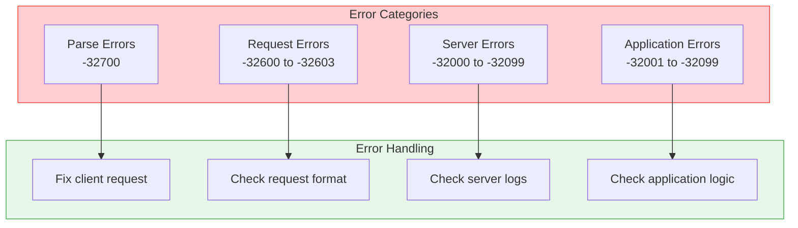

---

## FAQ

### Frequently Asked Questions

**Q: How do I reset the server state?**

```bash
# Restart the server
pkill tfo-mcp
tfo-mcp run
```

**Q: How do I update to the latest version?**

```bash
# Binary
curl -LO https://github.com/devopscorner/telemetryflow/releases/latest/download/tfo-mcp_$(uname -s)_$(uname -m).tar.gz
tar -xzf tfo-mcp_*.tar.gz
sudo mv tfo-mcp /usr/local/bin/

# Docker
docker pull devopscorner/tfo-mcp:latest
```

**Q: How do I check the API key is valid?**

```bash
curl -X POST https://api.anthropic.com/v1/messages \
  -H "x-api-key: $TELEMETRYFLOW_MCP_CLAUDE_API_KEY" \
  -H "anthropic-version: 2023-06-01" \
  -H "content-type: application/json" \
  -d '{"model":"claude-3-haiku-20240307","max_tokens":10,"messages":[{"role":"user","content":"Hi"}]}'
```

**Q: How do I enable telemetry/tracing?**

```yaml
telemetry:
  enabled: true
  endpoint: "localhost:4317"
  sample_rate: 1.0
```

**Q: Where are the log files?**

```bash
# Logs go to stderr by default
# Redirect to file:
tfo-mcp run 2> tfo-mcp.log

# Or configure output:
logging:
  output: "/var/log/tfo-mcp/server.log"
```

---

## Getting Help

### Support Channels

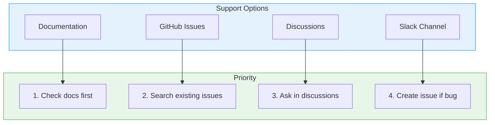

### Filing an Issue

When creating a GitHub issue, include:

```markdown
## Environment

- TelemetryFlow MCP Version: `tfo-mcp version`
- OS: macOS 14.0 / Ubuntu 22.04 / Windows 11
- Go Version: go1.24

## Description

Brief description of the issue.

## Steps to Reproduce

1. Step one
2. Step two
3. Step three

## Expected Behavior

What should happen.

## Actual Behavior

What actually happens.

## Logs
```

<paste relevant logs here>
```

## Configuration

```yaml
<paste sanitized config here>
```

````

### Useful Information to Collect

```bash
# System information
uname -a
go version

# TFO-MCP information
tfo-mcp version

# Configuration (sanitize secrets!)
cat config.yaml | grep -v api_key

# Recent logs
tfo-mcp run --log-level debug 2>&1 | tail -100
````

---

## Related Documentation

- [Architecture Guide](ARCHITECTURE.md)
- [Configuration Guide](CONFIGURATION.md)
- [Commands Reference](COMMANDS.md)
- [Development Guide](DEVELOPMENT.md)
- [Installation Guide](INSTALLATION.md)

---

<div align="center">

**[Back to Documentation Index](README.md)**

</div>
